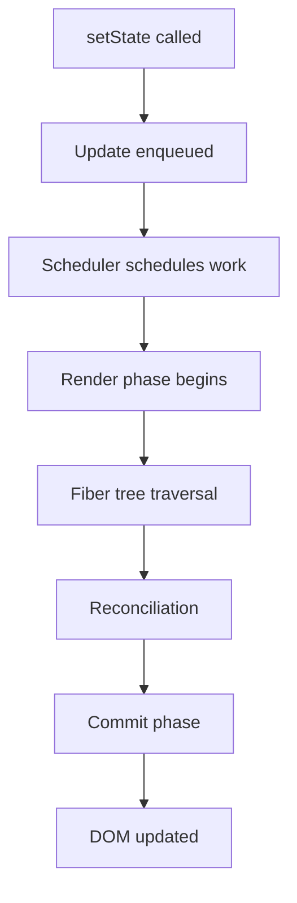

# Contributing to the React + Next.js Engineering Handbook

First — thank you for considering a contribution.  
This handbook exists because engineers share what they know.

This document explains **exactly** what a good contribution looks like, how to submit one, and what the review bar is. Read it fully before opening a pull request.

---

## Table of Contents

- [The Philosophy of This Handbook](#the-philosophy-of-this-handbook)
- [What We Accept](#what-we-accept)
- [What We Do Not Accept](#what-we-do-not-accept)
- [Quality Bar](#quality-bar)
- [Document Structure Standard](#document-structure-standard)
- [Writing Style Guide](#writing-style-guide)
- [Diagram Standards](#diagram-standards)
- [Code Example Standards](#code-example-standards)
- [Good Practice / Bad Practice Format](#good-practice--bad-practice-format)
- [How to Contribute](#how-to-contribute)
- [Pull Request Checklist](#pull-request-checklist)
- [Review Process](#review-process)
- [Types of Contributions](#types-of-contributions)
- [Reporting Issues](#reporting-issues)
- [Community Standards](#community-standards)

---

## The Philosophy of This Handbook

This handbook has one goal: **help engineers understand how things work internally**, not just how to use them.

Every document must answer at least one of:

- _How does this work under the hood?_
- _Why does this pattern exist?_
- _What are the real tradeoffs?_
- _What happens in production when this goes wrong?_
- _How would I debug this problem?_

If a contribution does not move toward one of those goals, it will not be merged — no matter how well-written it is.

> **The test:** If a senior engineer already familiar with React docs would learn nothing new from your document, it is too shallow.

---

## What We Accept

### ✅ Deep Technical Content

- Internal architecture explanations with diagrams
- Step-by-step walkthroughs of React/Next.js source behavior
- Performance analysis with profiling examples
- Production debugging workflows
- Advanced architecture pattern explanations with tradeoff analysis
- Simplified implementations that demonstrate how internals work
- Real-world engineering case studies

### ✅ Corrections & Improvements

- Fixing factual inaccuracies
- Improving technical depth of existing sections
- Adding missing diagrams or visuals
- Adding better code examples
- Updating content for new React/Next.js versions

### ✅ New Documents

- Documents covering topics listed in the Table of Contents that are not yet written
- New sections that fit the depth standard of this handbook
- New real-world project breakdowns
- New exercises and challenges

### ✅ Diagram Contributions

- Mermaid diagrams for rendering pipelines, tree traversals, lifecycle flows
- Architecture diagrams
- Browser rendering visualizations
- Performance flamegraph annotations

---

## What We Do Not Accept

### ❌ Tutorial-Style Content

Content structured as "here is how to use X" without explaining internals.

**Example of what we reject:**

> "To use `useMemo`, wrap your expensive calculation and pass a dependency array. This prevents recalculation on every render."

**Example of what we accept:**

> "When React calls your component function, every expression inside it re-evaluates. `useMemo` works by storing the result of your function in the fiber's `memoizedState` linked list. On subsequent renders, React walks the hook linked list in order, finds the `useMemo` node, compares the dependency array using `Object.is` for each element, and returns the cached value without calling your function again if nothing changed. This means the optimization cost is: the comparison loop + pointer dereference. It only pays off when your computation cost exceeds that overhead — which is not always true for simple calculations."

### ❌ Surface-Level Documentation Rewrites

Rewriting or paraphrasing the official React or Next.js documentation.

### ❌ Simple CRUD Examples

Examples that demonstrate basic API usage without engineering depth.

### ❌ Opinion Pieces Without Technical Foundation

"I prefer X over Y" without architectural analysis.

### ❌ Unverified Claims

Any internal behavior claim that cannot be traced to source code, benchmarks, or reproducible examples.

### ❌ AI-Generated Filler Content

Content that reads as padding — vague, generic, and lacking specificity. Every paragraph must add technical signal.

---

## Quality Bar

Every document in this handbook must meet all of the following:

### Depth

- Explains the **internal mechanism**, not just the API surface
- Answers **why** the behavior exists, not just **what** it does
- References React/Next.js source behavior where relevant (link to source when possible)

### Accuracy

- Technically correct for the React/Next.js version stated
- Code examples are tested and run without errors
- Performance claims are backed by measurement or source citation
- Internal behavior claims match actual runtime behavior

### Clarity

- Beginner-friendly **in explanation style**, advanced **in technical depth**
- One idea per paragraph
- No unexplained jargon — every new term is defined when first used
- Analogies used to build intuition before technical precision

### Completeness

- Includes at least one good practice example
- Includes at least one bad practice example with explanation of consequences
- Includes a Mermaid diagram where the concept is spatial, sequential, or tree-structured
- Includes a "Mental Model" callout that summarizes the core concept in 2–3 sentences

---

## Document Structure Standard

Every document must follow this structure:

```markdown
# [Document Title]

> **One-sentence summary of what this document explains.**

## Overview

2–4 paragraphs explaining the concept at a high level.
Build intuition before going deep.

## Why This Exists / The Problem It Solves

Explain the engineering motivation. What problem existed before this?
What would happen without it?

## How It Works Internally

The deep dive. Step-by-step. Reference source behavior.
Include simplified implementations where helpful.

## [Concept-Specific Sections]

As many as needed. Each one focused on one idea.

## Visual Architecture

Mermaid diagram(s) here.

## Good Practice

✅ Example with explanation of why it is correct.

## Bad Practice

⚠️ Example with explanation of the production consequence.

## Mental Model

> 💡 2–3 sentence summary a senior engineer would put on a whiteboard.

## Common Mistakes

List of real mistakes engineers make with this concept.

## Exercises

1–3 hands-on challenges.

## Further Reading

Links to source code, papers, or related handbook sections.
```

Not every section is mandatory for every document, but **Overview**, **How It Works Internally**, **Good/Bad Practice**, and **Mental Model** are always required.

---

## Writing Style Guide

### Voice

Write as a **senior engineer explaining to a strong junior engineer** — not condescending, not vague. Precise, direct, technical.

### Tense

Use present tense. "React walks the fiber tree" not "React will walk the fiber tree."

### Person

Use "you" for the reader. "When you call `setState`..." not "When the developer calls `setState`..."

### Sentence Length

Vary it. Short sentences land technical points. Longer sentences build context and connect ideas. Never write a paragraph that is all one sentence length.

### Technical Terms

Define every term on first use. Do not assume the reader knows what "fiber," "reconciliation," or "hydration" means even if you think they should.

### Analogies

Use them early in a section to build intuition. Then replace the analogy with the precise technical explanation. Never use an analogy as a substitute for precision.

### Numbers and Claims

Be specific. "Re-rendering 100 list items is slow" is weak. "Re-rendering 100 list items triggers 100 component function calls, 100 virtual DOM node comparisons, and up to 100 DOM mutations in the commit phase" is strong.

### Hedging

Do not over-hedge. If something is true, say it. If something is implementation-specific or version-specific, say that clearly once — then write with confidence.

---

## Diagram Standards

### When to Include a Diagram

- Any rendering pipeline, lifecycle, or phase sequence → flowchart
- Any tree structure (fiber tree, component tree, virtual DOM) → graph
- Any timing relationship (render phase vs commit phase) → sequence or timeline
- Any layered system (browser rendering pipeline, caching layers) → layered diagram

### Mermaid Format

All diagrams use [Mermaid](https://mermaid.js.org/) syntax inside fenced code blocks:

````markdown

````

### Diagram Rules

- Every node label must be a complete phrase, not an abbreviation
- Use `TD` (top-down) for pipelines and lifecycles
- Use `LR` (left-right) for data flow
- Add `style` declarations for color coding where it improves clarity
- Maximum 15 nodes per diagram — split into multiple diagrams if needed

### Naming

Save standalone diagram files to `/diagrams/` with descriptive names:
`fiber-tree-traversal-diagram.md`, `hydration-lifecycle-diagram.md`

---

## Code Example Standards

### Language Tags

Always specify the language:

````markdown
```tsx
// TypeScript React
```

```ts
// TypeScript
```

```js
// JavaScript
```

```bash
# Terminal
```
````

### Example Requirements

- Every code example must be **self-contained** — runnable without hidden context
- Include comments that explain the _non-obvious_ parts (not `// increment counter`)
- Show the **bad version first**, then the **good version** when comparing patterns
- Use realistic names — not `foo`, `bar`, `doThing`

### Simplified Internals

When showing a simplified version of how React works internally, label it clearly:

```tsx
// ⚠️ SIMPLIFIED — This is NOT the actual React source.
// It demonstrates the concept only.
function simplifiedUseState(initialValue) {
  // ...
}
```

### File Headers

Include a comment at the top of every non-trivial code example:

```tsx
/**
 * Example: useMemo with stable vs unstable references
 * Demonstrates: why object literals in render cause unnecessary recalculation
 * Section: hooks-internals/03-usememo-usecallback.md
 */
```

---

## Good Practice / Bad Practice Format

Every section must include at least one of each. Use this exact format:

### Bad Practice Block

````markdown
### ⚠️ Bad Practice — [Short Name]

```tsx
// The problematic code here
```
````

**What happens:** Describe the exact runtime consequence.
**Production impact:** What breaks or degrades in a real application.
**Why engineers make this mistake:** The intuition that leads to this pattern.

````

### Good Practice Block
```markdown
### ✅ Good Practice — [Short Name]

```tsx
// The correct code here
````

**Why this works:** The internal reason this pattern is safe.
**The tradeoff:** What you give up (if anything) to get this behavior.

````

---

## How to Contribute

### Step 1: Check Existing Issues
Before starting, check [open issues](https://github.com/your-org/react-nextjs-engineering-handbook/issues) and [open pull requests](https://github.com/your-org/react-nextjs-engineering-handbook/pulls) to avoid duplication.

### Step 2: Open an Issue First (for new documents)
For new documents or major additions, open an issue describing:
- What document/section you plan to write
- A brief outline of the internal concepts you will cover
- What diagrams you plan to include

Wait for a maintainer to acknowledge before writing the full document. This saves your time if the direction needs adjustment.

### Step 3: Fork and Clone

```bash
git clone https://github.com/your-org/react-nextjs-engineering-handbook.git
cd react-nextjs-engineering-handbook
````

### Step 4: Create a Branch

Use descriptive branch names:

```bash
# For new documents
git checkout -b docs/react-fiber-node-structure

# For corrections
git checkout -b fix/useeffect-cleanup-example

# For diagram additions
git checkout -b diagram/hydration-lifecycle-flow
```

### Step 5: Write Your Contribution

Follow the [Document Structure Standard](#document-structure-standard) and [Writing Style Guide](#writing-style-guide) above.

### Step 6: Self-Review with the Checklist

Run through the [Pull Request Checklist](#pull-request-checklist) before submitting.

### Step 7: Open a Pull Request

Use the PR template. Fill every section. Link the related issue.

---

## Pull Request Checklist

Copy this into your PR description and check every item:

```
## PR Checklist

### Content Quality
- [ ] Explains internal mechanism, not just API surface
- [ ] Every technical claim is accurate and verifiable
- [ ] Includes at least one simplified internal implementation
- [ ] Explains WHY the pattern exists, not just WHAT it does

### Structure
- [ ] Follows the Document Structure Standard
- [ ] Includes Overview section
- [ ] Includes "How It Works Internally" section
- [ ] Includes Good Practice example
- [ ] Includes Bad Practice example with production consequence
- [ ] Includes Mental Model callout

### Diagrams
- [ ] Includes at least one Mermaid diagram (if concept is visual)
- [ ] All diagram nodes use complete phrases
- [ ] Diagram renders correctly (tested at mermaid.live)

### Code Examples
- [ ] All code examples are self-contained
- [ ] All code examples are tested
- [ ] Language tags are specified
- [ ] Simplified internal examples are labeled as such

### Writing
- [ ] No unexplained jargon on first use
- [ ] Beginner-friendly in explanation style
- [ ] Advanced in technical depth
- [ ] No AI-generated filler — every paragraph adds technical signal

### Meta
- [ ] File is in the correct directory
- [ ] Filename matches the naming convention
- [ ] README Table of Contents updated (if new document)
- [ ] Linked from a related document (if applicable)
```

---

## Review Process

### What Reviewers Look For

1. **Technical accuracy** — Is this actually how React/Next.js behaves?
2. **Depth** — Does this go beyond the official docs?
3. **Clarity** — Can a strong junior engineer follow this?
4. **Completeness** — Are good/bad practices, diagrams, and mental models present?

### Timeline

- Initial review acknowledgment: within 7 days
- Full review: within 14 days
- Merge (if approved): same day as final approval

### Revision Requests

Reviewers will leave specific, actionable feedback. Expected revision areas:

- Depth ("this section describes the API — explain the internal mechanism")
- Accuracy ("this claim is not accurate for React 19 — here is the corrected behavior")
- Completeness ("missing a diagram here — the fiber tree traversal is hard to follow as prose")

We aim for reviews that make contributions better, not gatekeeping for its own sake.

---

## Types of Contributions

| Type                        | Issue First? | Complexity                          |
| --------------------------- | ------------ | ----------------------------------- |
| Fix a typo                  | No           | Trivial — open PR directly          |
| Fix a factual error         | No           | Open PR with source citation        |
| Improve an existing section | Recommended  | Describe planned additions in issue |
| Write a new document        | Required     | Full outline in issue first         |
| Add a diagram               | No           | Open PR directly                    |
| Add a code example          | No           | Open PR directly                    |
| Add a new section/category  | Required     | Discuss scope before writing        |
| Add a real-world project    | Required     | Full architecture outline in issue  |

---

## Reporting Issues

### Factual Errors

Open an issue with:

- The incorrect claim (quoted)
- The correct behavior (with source or reproducible example)
- The React/Next.js version this applies to

### Missing Topics

Open an issue with:

- The topic you think is missing
- Why it fits the depth standard of this handbook
- A brief outline of what the document should cover

### Outdated Content

Open an issue with:

- The document and section
- What changed (React/Next.js version)
- The correct current behavior

---

## Community Standards

This is an engineering community. We hold each other to professional standards:

- **Be precise** — vague feedback helps no one
- **Be direct** — say what you mean technically
- **Be constructive** — if something is wrong, explain why and suggest the fix
- **Be patient** — reviewers are engineers with day jobs
- **Be humble** — React internals are complex; we all get things wrong sometimes

Disrespectful, dismissive, or hostile communication is not tolerated.  
See [CODE_OF_CONDUCT.md](CODE_OF_CONDUCT.md) for the full policy.

---

## Recognition

Contributors who add substantial technical content are acknowledged in the document they authored:

```markdown
---

_Originally authored by [@yourhandle](https://github.com/yourhandle)_
_Reviewed by [@reviewer](https://github.com/reviewer)_
```

Significant contributors are listed in [CONTRIBUTORS.md](CONTRIBUTORS.md).

---

## Questions

If you are unsure whether your contribution fits, open a Discussion rather than an Issue.  
We would rather answer a question than see a great contribution go unsubmitted.

---

<div align="center">

**The best way to understand React deeply is to explain it deeply.**  
We are glad you are here.

</div>
