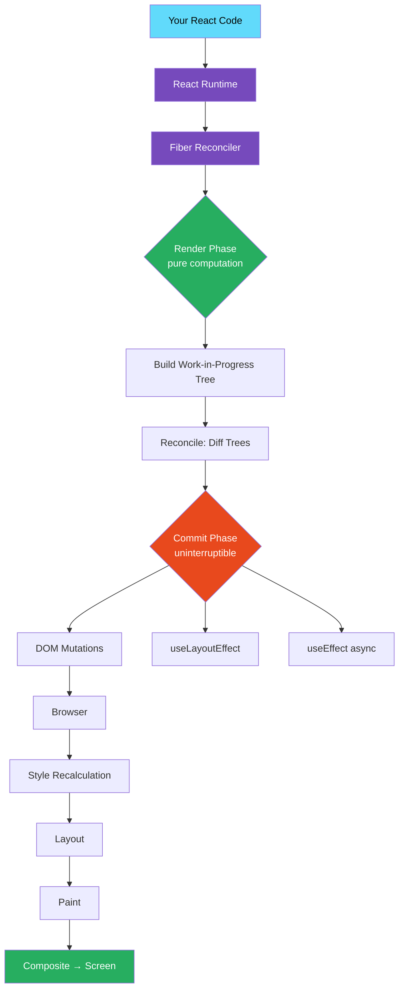

# ⚛️ React + Next.js Engineering Handbook

> **The deepest open-source React & Next.js engineering resource on GitHub.**  
> Built for engineers who want to understand _how_ and _why_, not just _what_.

[](CONTRIBUTING.md)
[](https://github.com/aamitchaudharii/reactjs-nextjs-handbook)

---

## 🧭 What This Handbook Is

This is **not** a tutorial.  
This is **not** a "getting started" guide.  
This is **not** surface-level documentation.

This is a **deep engineering handbook** — 125 documents across 27 parts, built around:

- 🔬 React internals and runtime behavior (Fiber, reconciliation, concurrent rendering)
- ⚙️ Next.js architecture (App Router, RSC, streaming, four-layer caching)
- 🧠 How browsers actually render your UI
- 🚀 Production performance engineering (profiling, memoization, virtualization)
- 🏗️ Scalable frontend architecture (monorepo, micro-frontends, design systems)
- 🔒 Security engineering (XSS/CSP, CSRF, supply chain, security headers)
- 🔍 Real-world debugging workflows (React DevTools, Node.js inspector, memory leaks)
- 📐 Anti-patterns, testing, and 6 production-grade real-world projects

If you have ever asked:

- _"Why does my component re-render so often?"_
- _"What actually happens after I call `setState`?"_
- _"How does Next.js generate HTML on the server?"_
- _"What is React Fiber and why does it matter?"_
- _"How does hydration work and why does it break?"_
- _"What are Next.js's four caching layers and how do they interact?"_
- _"How do I scale a React app to 10 million users?"_

...then this handbook was written for you.

---

## 🎯 Who This Is For

| Audience                              | What You Will Get                                              |
| ------------------------------------- | -------------------------------------------------------------- |
| **Intermediate frontend developers**  | Deep understanding of React internals beyond docs              |
| **Senior React engineers**            | Architecture patterns, scaling strategies, performance systems |
| **Next.js engineers**                 | Full App Router internals, RSC, streaming, caching             |
| **Self-taught developers**            | Structured university-level progression                        |
| **Senior/Staff interview candidates** | Every deep-dive topic interviewers actually ask                |
| **Production engineers**              | Real-world debugging, profiling, architecture decisions        |

---

## 📚 Table of Contents

### Part I — React Core Internals

- [01 · What React Actually Is](docs/react-core/01-what-react-is.md)
- [02 · JSX Transformation & Runtime](docs/react-core/02-jsx-transformation.md)
- [03 · Virtual DOM Deep Dive](docs/react-core/03-virtual-dom.md)
- [04 · Component Architecture](docs/react-core/04-component-architecture.md)
- [05 · Unidirectional Data Flow](docs/react-core/05-unidirectional-data-flow.md)

### Part II — React Rendering Internals

- [06 · The Render Phase](docs/react-rendering/01-render-phase.md)
- [07 · The Commit Phase](docs/react-rendering/02-commit-phase.md)
- [08 · The React Scheduler](docs/react-rendering/03-scheduler.md)
- [09 · Batching & Update Queues](docs/react-rendering/04-batching.md)
- [10 · Effects: Layout vs Passive](docs/react-rendering/05-effects.md)

### Part III — React Fiber Architecture

- [11 · Why Fiber Exists](docs/react-fiber/01-why-fiber.md)
- [12 · Fiber Node Structure](docs/react-fiber/02-fiber-node.md)
- [13 · Fiber Tree Traversal](docs/react-fiber/03-fiber-tree-traversal.md)
- [14 · Interruptible Rendering](docs/react-fiber/04-interruptible-rendering.md)
- [15 · Time Slicing](docs/react-fiber/05-time-slicing.md)

### Part IV — Reconciliation

- [16 · The Diffing Algorithm](docs/reconciliation/01-diffing-algorithm.md)
- [17 · Element Identity & Keys](docs/reconciliation/02-keys.md)
- [18 · Child Reconciliation](docs/reconciliation/03-child-reconciliation.md)
- [19 · DOM Reuse Strategies](docs/reconciliation/04-dom-reuse.md)

### Part V — Hooks Internals

- [20 · useState Internals](docs/hooks-internals/01-usestate.md)
- [21 · useEffect Internals](docs/hooks-internals/02-useeffect.md)
- [22 · useMemo & useCallback](docs/hooks-internals/03-usememo-usecallback.md)
- [23 · useRef Behavior](docs/hooks-internals/04-useref.md)
- [24 · useReducer & useContext](docs/hooks-internals/05-usereducer-usecontext.md)
- [25 · Custom Hook Architecture](docs/hooks-internals/06-custom-hooks.md)

### Part VI — Re-rendering System

- [26 · What Causes Re-renders](docs/react-rendering/06-what-causes-rerenders.md)
- [27 · Reference Equality & Object Identity](docs/react-rendering/07-reference-equality.md)
- [28 · Context Re-render Propagation](docs/react-rendering/08-context-rerenders.md)
- [29 · Re-render Optimization Patterns](docs/react-rendering/09-optimization-patterns.md)

### Part VII — Concurrent React

- [30 · Concurrent Rendering Model](docs/concurrent-react/01-concurrent-model.md)
- [31 · startTransition & useTransition](docs/concurrent-react/02-transitions.md)
- [32 · useDeferredValue](docs/concurrent-react/03-deferred-value.md)
- [33 · Suspense Internals](docs/concurrent-react/04-suspense.md)
- [34 · Scheduling Priorities & Lanes](docs/concurrent-react/05-scheduling.md)

### Part VIII — React Compiler

- [35 · React Compiler Architecture](docs/react-compiler/01-compiler.md)
- [36 · Automatic Memoization](docs/react-compiler/02-auto-memoization.md)
- [37 · Future of React](docs/react-compiler/03-future-react.md)

### Part IX — Next.js Core

- [38 · What is Next.js](docs/nextjs-core/01-what-nextjs-is.md)
- [39 · App Router Architecture](docs/nextjs-core/02-app-router.md)
- [40 · Pages Router Architecture](docs/nextjs-core/03-pages-router.md)
- [41 · File System Routing](docs/nextjs-core/04-file-system-routing.md)
- [42 · Middleware & Edge Runtime](docs/nextjs-core/05-middleware.md)
- [43 · Data Fetching Patterns](docs/nextjs-core/06-data-fetching.md)
- [44 · Image & Font Optimization](docs/nextjs-core/07-image-font-optimization.md)
- [45 · Turbopack Architecture](docs/nextjs-core/08-turbopack.md)
- [46 · Server Actions Deep Dive](docs/nextjs-core/09-server-actions.md)
- [47 · Parallel & Intercepting Routes](docs/nextjs-core/10-parallel-routes.md)

### Part X — React Server Components

- [48 · What Are React Server Components](docs/server-components/01-what-rsc-is.md)
- [49 · Server vs Client Components](docs/server-components/02-server-vs-client.md)
- [50 · Streaming & Suspense with RSC](docs/server-components/03-streaming.md)
- [51 · RSC Patterns](docs/server-components/04-rsc-patterns.md)
- [52 · RSC Composition](docs/server-components/05-patterns.md)

### Part XI — Next.js Rendering Systems

- [53 · Hydration Strategies](docs/nextjs-rendering/01-hydration.md)
- [54 · Static Site Generation](docs/nextjs-rendering/02-static-generation.md)
- [55 · Server-Side Rendering](docs/nextjs-rendering/03-server-side-rendering.md)
- [56 · Incremental Static Regeneration](docs/nextjs-rendering/04-incremental-static-regeneration.md)
- [57 · Client-Side Rendering Boundaries](docs/nextjs-rendering/05-client-side-rendering.md)
- [58 · Rendering Strategies Comparison](docs/nextjs-rendering/06-rendering-strategies-comparison.md)
- [59 · Edge Rendering](docs/nextjs-rendering/07-edge-rendering.md)

### Part XII — Next.js Caching Systems

- [60 · Browser Caching](docs/caching/01-browser-caching.md)
- [61 · CDN & Edge Caching](docs/caching/02-cdn-caching.md)
- [62 · Request Memoization](docs/caching/03-request-memoization.md)
- [63 · Data Cache](docs/caching/04-data-cache.md)
- [64 · Full Route Cache](docs/caching/05-full-route-cache.md)
- [65 · Router Cache](docs/caching/06-router-cache.md)
- [66 · Cache Invalidation Strategies](docs/caching/07-cache-invalidation.md)

### Part XIII — Next.js Advanced Internals

> _Covered in Part IX docs 45–47 above (Turbopack, Server Actions, Parallel Routes)_

### Part XIV — Browser Rendering Internals

- [67 · Browser Rendering Pipeline](docs/browser-internals/01-rendering-pipeline.md)

### Part XV — Performance Engineering

- [68 · React Profiler & Flamegraphs](docs/performance/01-react-profiler.md)
- [69 · Memoization Engineering](docs/performance/02-memoization.md)
- [70 · Virtualization & Windowing](docs/performance/03-virtualization.md)
- [71 · Code Splitting & Lazy Loading](docs/performance/04-code-splitting.md)
- [72 · Bundle Optimization](docs/performance/05-bundle-optimization.md)
- [73 · Large List Rendering](docs/performance/06-large-lists.md)
- [74 · requestAnimationFrame & requestIdleCallback](docs/performance/07-raf-ric.md)

### Part XVI — State Management Deep Dive

- [75 · Context API Internals](docs/state-management/01-context-internals.md)
- [76 · Redux Architecture](docs/state-management/02-redux.md)
- [77 · Zustand Internals](docs/state-management/03-zustand.md)
- [78 · TanStack Query Internals](docs/state-management/04-tanstack-query.md)
- [79 · Server State vs Client State](docs/state-management/05-server-vs-client-state.md)
- [80 · Optimistic Updates](docs/state-management/06-optimistic-updates.md)

### Part XVII — Build Systems

- [81 · AST Transformations & Babel](docs/build-systems/01-ast-babel.md)
- [82 · SWC Architecture](docs/build-systems/02-swc.md)
- [83 · Webpack Internals](docs/build-systems/03-webpack.md)
- [84 · Vite Internals](docs/build-systems/04-vite.md)
- [85 · Tree Shaking & Module Graphs](docs/build-systems/05-tree-shaking.md)
- [86 · ESM vs CJS](docs/build-systems/06-esm-cjs.md)

### Part XVIII — Networking Engineering

- [87 · HTTP Versions (HTTP/1.1, HTTP/2, HTTP/3)](docs/networking/01-http-versions.md)
- [88 · Streaming Responses](docs/networking/02-streaming.md)
- [89 · WebSocket & Server-Sent Events](docs/networking/03-websocket-sse.md)
- [90 · Rendering Waterfalls](docs/networking/04-rendering-waterfalls.md)
- [91 · Backend for Frontend (BFF) Pattern](docs/networking/05-bff.md)

### Part XIX — Architecture Patterns

- [92 · Feature-Based Architecture](docs/architecture/01-feature-based.md)
- [93 · Atomic Design](docs/architecture/02-atomic-design.md)
- [94 · Monorepo Engineering](docs/architecture/03-monorepo.md)
- [95 · Micro-Frontends](docs/architecture/04-micro-frontends.md)
- [96 · State Machines in UI](docs/architecture/05-state-machines.md)

### Part XX — Design Systems

- [97 · Design Tokens](docs/design-systems/01-design-tokens.md)
- [98 · Component API Design](docs/design-systems/02-component-api.md)
- [99 · Accessibility Engineering](docs/design-systems/03-accessibility.md)

### Part XXI — Security

- [100 · XSS & Content Security Policy](docs/security/01-xss-csp.md)
- [101 · CSRF & Authentication Patterns](docs/security/02-csrf-auth.md)
- [102 · Dependency & Supply Chain Security](docs/security/03-dependency-security.md)
- [103 · Security Headers](docs/security/04-security-headers.md)

### Part XXII — Testing

- [104 · Unit Testing with React Testing Library](docs/testing/01-unit-testing.md)
- [105 · Integration Testing with MSW](docs/testing/02-integration-testing.md)
- [106 · E2E Testing with Playwright](docs/testing/03-e2e-playwright.md)
- [107 · Performance Testing](docs/testing/04-performance-testing.md)

### Part XXIII — Debugging

- [108 · Debugging React Applications](docs/debugging/01-debugging-react.md)
- [109 · Debugging Next.js](docs/debugging/02-debugging-nextjs.md)
- [110 · Error Boundaries & Monitoring](docs/debugging/03-error-boundaries-monitoring.md)
- [111 · Performance Debugging](docs/debugging/04-performance-debugging.md)

### Part XXIV — Anti-Patterns

- [112 · Common React Anti-Patterns](docs/anti-patterns/01-common-anti-patterns.md)
- [113 · State Management Anti-Patterns](docs/anti-patterns/02-state-anti-patterns.md)
- [114 · Performance Anti-Patterns](docs/anti-patterns/03-performance-anti-patterns.md)

### Part XXV — Interview Preparation

- [115 · React Internals Interview Questions](docs/interview-prep/01-react-internals-questions.md)
- [116 · Next.js Interview Questions](docs/interview-prep/02-nextjs-questions.md)
- [117 · Frontend System Design](docs/interview-prep/03-system-design.md)
- [118 · Behavioral & Architecture Questions](docs/interview-prep/04-behavioral-questions.md)

### Part XXVI — Real-World Projects

- [P1 · E-Commerce Platform](docs/real-world-projects/P1-ecommerce-platform.md)
- [P2 · Analytics Dashboard](docs/real-world-projects/P2-dashboard-analytics.md)
- [P3 · Multi-Tenant SaaS Application](docs/real-world-projects/P3-saas-multi-tenant.md)
- [P4 · Real-Time Chat Application](docs/real-world-projects/P4-real-time-chat.md)
- [P5 · CMS & Blog Platform](docs/real-world-projects/P5-cms-blog-platform.md)
- [P6 · AI-Powered Application](docs/real-world-projects/P6-ai-powered-application.md)

### Part XXVII — Roadmap & Exercises

- [Learning Roadmap, Synthesis Exercises & What to Build Next](docs/roadmap/01-roadmap-and-exercises.md)

---

## 🗺️ Architecture Overview



---

## ⚡ Quick Navigation by Problem

**"My component re-renders too often"**  
→ [What Causes Re-renders](docs/react-rendering/06-what-causes-rerenders.md) → [Memoization Engineering](docs/performance/02-memoization.md) → [Performance Anti-Patterns](docs/anti-patterns/03-performance-anti-patterns.md)

**"My Next.js page shows stale data"**  
→ [Cache Invalidation Strategies](docs/caching/07-cache-invalidation.md) → [Debugging Next.js](docs/debugging/02-debugging-nextjs.md) → [Data Cache](docs/caching/04-data-cache.md)

**"I don't understand hydration errors"**  
→ [Hydration Strategies](docs/nextjs-rendering/01-hydration.md) → [Debugging React](docs/debugging/01-debugging-react.md) → [Debugging Next.js](docs/debugging/02-debugging-nextjs.md)

**"I need to choose a rendering strategy"**  
→ [Rendering Strategies Comparison](docs/nextjs-rendering/06-rendering-strategies-comparison.md) → [Next.js Caching Systems](docs/caching/01-browser-caching.md) → [P1 E-Commerce ADRs](docs/real-world-projects/P1-ecommerce-platform.md)

**"My application is slow"**  
→ [Performance Debugging](docs/debugging/04-performance-debugging.md) → [React Profiler](docs/performance/01-react-profiler.md) → [Bundle Optimization](docs/performance/05-bundle-optimization.md)

**"I need to architect a large React application"**  
→ [Feature-Based Architecture](docs/architecture/01-feature-based.md) → [State Management Deep Dive](docs/state-management/01-context-internals.md) → [Monorepo Engineering](docs/architecture/03-monorepo.md)

**"Preparing for a senior React interview"**  
→ [React Internals Questions](docs/interview-prep/01-react-internals-questions.md) → [Next.js Questions](docs/interview-prep/02-nextjs-questions.md) → [Frontend System Design](docs/interview-prep/03-system-design.md)

**"I want to understand Next.js App Router deeply"**  
→ [App Router Architecture](docs/nextjs-core/02-app-router.md) → [React Server Components](docs/server-components/01-what-rsc-is.md) → [Next.js Caching Systems](docs/caching/03-request-memoization.md)

---

## 📐 How to Use This Handbook

### Path 1: The Systematic Engineer

Read every part in order. Build deep, interconnected mental models. Takes 3–6 months at a comfortable pace. Start at Part I and follow the numbering. Use the [Learning Roadmap](docs/roadmap/01-roadmap-and-exercises.md) for structured weekly plans.

### Path 2: The Problem Solver

Jump to the section that solves your current engineering challenge. Use the Quick Navigation above. Cross-references within each document point you to related concepts.

### Path 3: The Interview Candidate

Focus on Parts I–VIII (React internals), Parts IX–XII (Next.js core + caching), Part XV (performance), and Part XXV (interview prep). The system design section has worked examples at the depth expected at senior/staff level.

### Path 4: The Architect

Focus on Part IX (Next.js), Part XVI (state management), Part XIX (architecture patterns), Part XXI (security), and Part XXVI (real-world projects). The ADRs in each project document are the most valuable architectural learning artifacts.

### Path 5: The New Engineer

Start with the [Learning Roadmap](docs/roadmap/01-roadmap-and-exercises.md) which has structured tracks by experience level (Junior → Mid, Mid → Senior, Senior → Staff) with weekly plans and capstone exercises.

---

## 🚦 Reading Conventions

Throughout this handbook you will see these markers:

> 🔬 **Internals** — Explains how something works inside React/Next.js source code

> ⚠️ **Anti-Pattern** — A dangerous or inefficient pattern to avoid

> ✅ **Good Practice** — A recommended, production-safe pattern

> 🧪 **Exercise** — A hands-on challenge to solidify understanding

> 📊 **Profiling** — A performance measurement example

> 🏭 **Production Note** — An insight from real production systems

> 💡 **Mental Model** — A conceptual framework to simplify understanding

---

## 🧱 Repository Structure

```
react-nextjs-engineering-handbook/
├── README.md                          ← You are here
├── CONTRIBUTING.md
└── docs/
    ├── react-core/                    ← Parts I: What React is
    ├── react-rendering/               ← Parts II & VI: Render/commit phases, re-rendering
    ├── react-fiber/                   ← Part III: Fiber architecture internals
    ├── reconciliation/                ← Part IV: Diffing, keys, DOM reuse
    ├── hooks-internals/               ← Part V: Every hook, deeply explained
    ├── concurrent-react/              ← Part VII: Transitions, Suspense, scheduling
    ├── react-compiler/                ← Part VIII: Compiler & future React
    ├── nextjs-core/                   ← Parts IX & XIII: App Router, middleware, Server Actions
    ├── server-components/             ← Part X: RSC, server/client boundary, streaming
    ├── nextjs-rendering/              ← Part XI: Hydration, SSG/SSR/ISR/CSR, Edge rendering
    ├── caching/                       ← Part XII: All 4 Next.js cache layers
    ├── browser-internals/             ← Part XIV: Browser rendering pipeline
    ├── performance/                   ← Part XV: Profiling, memoization, virtualization
    ├── state-management/              ← Part XVI: Context, Redux, Zustand, TanStack Query
    ├── build-systems/                 ← Part XVII: Webpack, Vite, SWC, Turbopack
    ├── networking/                    ← Part XVIII: HTTP, streaming, WebSocket, BFF
    ├── architecture/                  ← Part XIX: Feature arch, monorepo, micro-frontends
    ├── design-systems/                ← Part XX: Tokens, component API, accessibility
    ├── security/                      ← Part XXI: XSS/CSP, CSRF, dependency, headers
    ├── testing/                       ← Part XXII: Unit, integration, E2E, performance
    ├── debugging/                     ← Part XXIII: React, Next.js, error boundaries, perf
    ├── anti-patterns/                 ← Part XXIV: Common, state, performance anti-patterns
    ├── interview-prep/                ← Part XXV: React, Next.js, system design, behavioral
    ├── real-world-projects/           ← Part XXVI: 6 production project breakdowns
    └── roadmap/                       ← Part XXVII: Learning roadmap & synthesis exercises
```

**125 documents · 27 parts · MIT License**

---

## 🤝 Contributing

This handbook grows through community engineering expertise.  
See [CONTRIBUTING.md](CONTRIBUTING.md) for guidelines.

All contributions must meet the quality bar:

- Deep technical accuracy (explain _why_, not just _what_)
- Mental model section in every document
- Good/bad practice examples with explanation
- Common misconceptions addressed
- Cross-references to related handbook sections

---

## 📜 License

MIT — Free to use, share, and build upon.  
If this helped you, please ⭐ the repository.

---

## ✍️ Acknowledgments

Built for engineers by engineers.  
Inspired by the complexity of real production systems.  
Committed to the belief that **understanding internals makes better engineers**.

---

<div align="center">

**Start here →** [What React Actually Is](docs/react-core/01-what-react-is.md)

_or jump to your level →_

**[Learning Roadmap & Exercises](docs/roadmap/01-roadmap-and-exercises.md)**

</div>
