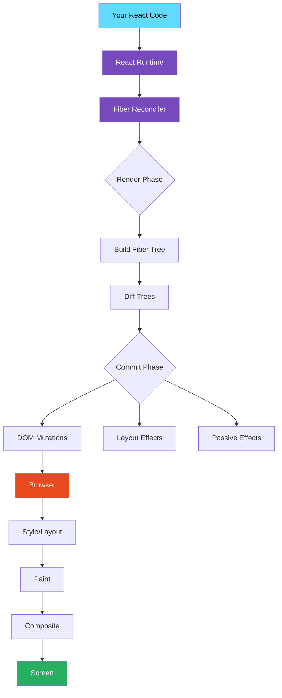

# ⚛️ React + Next.js Engineering Handbook

> **The deepest open-source React & Next.js engineering resource on GitHub.**
> Built for engineers who want to understand _how_ and _why_, not just _what_.

[](https://opensource.org/licenses/MIT)
[](CONTRIBUTING.md)
[](https://github.com/your-org/react-nextjs-engineering-handbook)

---

## 🧭 What This Handbook Is

This is **not** a tutorial.  
This is **not** a "getting started" guide.  
This is **not** surface-level documentation.

This is a **deep engineering handbook** — a university-level course built around:

- 🔬 React internals and runtime behavior
- ⚙️ Next.js architecture and rendering systems
- 🧠 How browsers actually render your UI
- 🚀 Production performance engineering
- 🏗️ Scalable frontend architecture
- 🔍 Real-world debugging workflows
- 📐 Advanced patterns and anti-patterns

If you have ever asked:

- _"Why does my component re-render so often?"_
- _"What actually happens after I call `setState`?"_
- _"How does Next.js generate HTML on the server?"_
- _"What is React Fiber and why does it matter?"_
- _"How does hydration work and why does it break?"_
- _"What is a rendering waterfall?"_
- _"How do I scale a React app to 10 million users?"_

...then this handbook was written for you.

---

## 🎯 Who This Is For

| Audience                             | What You Will Get                                              |
| ------------------------------------ | -------------------------------------------------------------- |
| **Intermediate frontend developers** | Deep understanding of React internals beyond docs              |
| **Senior React engineers**           | Architecture patterns, scaling strategies, performance systems |
| **Next.js engineers**                | Full App Router internals, RSC, streaming, caching             |
| **Self-taught developers**           | Structured university-level progression                        |
| **Senior interview candidates**      | Every deep-dive topic interviewers actually ask                |
| **Production engineers**             | Real-world debugging, profiling, architecture decisions        |

---

## 📚 Table of Contents

### Part I — React Core Internals

- [01 · What React Actually Is](docs/react-core/01-what-react-is.md)
- [02 · JSX Transformation & Runtime](docs/react-core/02-jsx-transformation.md)
- [03 · Virtual DOM Deep Dive](docs/react-core/03-virtual-dom.md)
- [04 · Component Architecture](docs/react-core/04-component-architecture.md)
- [05 · Unidirectional Data Flow](docs/react-core/05-unidirectional-data-flow.md)

### Part II — React Rendering Internals

- [06 · The Render Phase](docs/react-rendering/01-render-phase.md)
- [07 · The Commit Phase](docs/react-rendering/02-commit-phase.md)
- [08 · The React Scheduler](docs/react-rendering/03-scheduler.md)
- [09 · Batching & Update Queues](docs/react-rendering/04-batching.md)
- [10 · Effects: Layout vs Passive](docs/react-rendering/05-effects.md)

### Part III — React Fiber Architecture

- [11 · Why Fiber Exists](docs/react-fiber/01-why-fiber.md)
- [12 · Fiber Node Structure](docs/react-fiber/02-fiber-node.md)
- [13 · Fiber Tree Traversal](docs/react-fiber/03-fiber-tree-traversal.md)
- [14 · Interruptible Rendering](docs/react-fiber/04-interruptible-rendering.md)
- [15 · Time Slicing](docs/react-fiber/05-time-slicing.md)

### Part IV — Reconciliation

- [16 · The Diffing Algorithm](docs/reconciliation/01-diffing-algorithm.md)
- [17 · Element Identity & Keys](docs/reconciliation/02-keys.md)
- [18 · Child Reconciliation](docs/reconciliation/03-child-reconciliation.md)
- [19 · DOM Reuse Strategies](docs/reconciliation/04-dom-reuse.md)

### Part V — Hooks Internals

- [20 · useState Internals](docs/hooks-internals/01-usestate.md)
- [21 · useEffect Internals](docs/hooks-internals/02-useeffect.md)
- [22 · useMemo & useCallback](docs/hooks-internals/03-usememo-usecallback.md)
- [23 · useRef Behavior](docs/hooks-internals/04-useref.md)
- [24 · useReducer & useContext](docs/hooks-internals/05-usereducer-usecontext.md)
- [25 · Custom Hook Architecture](docs/hooks-internals/06-custom-hooks.md)

### Part VI — Re-rendering System

- [26 · What Causes Re-renders](docs/react-rendering/06-what-causes-rerenders.md)
- [27 · Reference Equality & Object Identity](docs/react-rendering/07-reference-equality.md)
- [28 · Context Re-render Propagation](docs/react-rendering/08-context-rerenders.md)
- [29 · Re-render Optimization Patterns](docs/react-rendering/09-optimization-patterns.md)

### Part VII — Concurrent React

- [30 · Concurrent Rendering Model](docs/concurrent-react/01-concurrent-model.md)
- [31 · startTransition & useTransition](docs/concurrent-react/02-transitions.md)
- [32 · useDeferredValue](docs/concurrent-react/03-deferred-value.md)
- [33 · Suspense Internals](docs/concurrent-react/04-suspense.md)
- [34 · Scheduling Priorities](docs/concurrent-react/05-scheduling.md)

### Part VIII — React Compiler

- [35 · React Compiler Architecture](docs/react-compiler/01-compiler.md)
- [36 · Automatic Memoization](docs/react-compiler/02-auto-memoization.md)
- [37 · Future of React](docs/react-compiler/03-future-react.md)

### Part IX — Next.js Core

- [38 · What is Next.js](docs/nextjs-core/01-what-nextjs-is.md)
- [39 · App Router Architecture](docs/nextjs-core/02-app-router.md)
- [40 · Pages Router Architecture](docs/nextjs-core/03-pages-router.md)
- [41 · File System Routing](docs/nextjs-core/04-file-system-routing.md)
- [42 · Middleware & Edge Runtime](docs/nextjs-core/05-middleware.md)
- [43 · Data Fetching Patterns](docs/nextjs-core/06-data-fetching.md)
- [44 · Image & Font Optimization](docs/nextjs-core/07-image-font-optimization.md)

### Part X — React Server Components

- [45 · What Are React Server Components](docs/server-components/01-what-rsc-is.md)
- [46 · Server vs Client Components](docs/server-components/02-server-vs-client.md)
- [47 · Streaming & Suspense with RSC](docs/server-components/03-streaming.md)
- [48 · RSC Patterns](docs/server-components/04-rsc-patterns.md)
- [49 · RSC Composition](docs/server-components/05-patterns.md)

### Part XI — Next.js Rendering Systems

- [50 · Hydration Strategies](docs/nextjs-rendering/01-hydration.md)
- [51 · Static Site Generation](docs/nextjs-rendering/02-static-generation.md)
- [52 · Server-Side Rendering](docs/nextjs-rendering/03-server-side-rendering.md)
- [53 · Incremental Static Regeneration](docs/nextjs-rendering/04-incremental-static-regeneration.md)
- [54 · Client-Side Rendering Boundaries](docs/nextjs-rendering/05-client-side-rendering.md)
- [55 · Rendering Strategies Comparison](docs/nextjs-rendering/06-rendering-strategies-comparison.md)
- [56 · Edge Rendering](docs/nextjs-rendering/07-edge-rendering.md)

### Part XII — Next.js Caching Systems

- [57 · Browser Caching](docs/caching/01-browser-caching.md)
- [58 · CDN & Edge Caching](docs/caching/02-cdn-caching.md)
- [59 · Request Memoization](docs/caching/03-request-memoization.md)
- [60 · Data Cache](docs/caching/04-data-cache.md)
- [61 · Full Route Cache](docs/caching/05-full-route-cache.md)
- [62 · Router Cache](docs/caching/06-router-cache.md)
- [63 · Cache Invalidation Strategies](docs/caching/07-cache-invalidation.md)

### Part XIII — Next.js Advanced Internals

- [64 · Turbopack Architecture](docs/nextjs-core/08-turbopack.md)
- [65 · Server Actions Deep Dive](docs/nextjs-core/09-server-actions.md)
- [66 · Parallel & Intercepting Routes](docs/nextjs-core/10-parallel-routes.md)

### Part XIV — Browser Rendering Internals

- [67 · Browser Rendering Pipeline](docs/browser-internals/01-rendering-pipeline.md)
- [68 · Critical Rendering Path](docs/browser-internals/02-critical-rendering-path.md)
- [69 · Reflow, Repaint & Compositing](docs/browser-internals/03-reflow-repaint.md)
- [70 · GPU Acceleration & Layers](docs/browser-internals/04-gpu-layers.md)
- [71 · Long Tasks & Main Thread](docs/browser-internals/05-long-tasks.md)

### Part XV — Performance Engineering

- [72 · React Profiler & Flamegraphs](docs/performance/01-react-profiler.md)
- [73 · Memoization Engineering](docs/performance/02-memoization.md)
- [74 · Virtualization & Windowing](docs/performance/03-virtualization.md)
- [75 · Code Splitting & Lazy Loading](docs/performance/04-code-splitting.md)
- [76 · Bundle Optimization](docs/performance/05-bundle-optimization.md)
- [77 · Large List Rendering](docs/performance/06-large-lists.md)
- [78 · requestAnimationFrame & requestIdleCallback](docs/performance/07-raf-ric.md)

### Part XVI — State Management Deep Dive

- [79 · Context API Internals](docs/state-management/01-context-internals.md)
- [80 · Redux Architecture](docs/state-management/02-redux.md)
- [81 · Zustand Internals](docs/state-management/03-zustand.md)
- [82 · TanStack Query Internals](docs/state-management/04-tanstack-query.md)
- [83 · Server State vs Client State](docs/state-management/05-server-vs-client-state.md)
- [84 · Optimistic Updates](docs/state-management/06-optimistic-updates.md)

### Part XVII — Build Systems

- [85 · AST Transformations & Babel](docs/build-systems/01-ast-babel.md)
- [86 · SWC Architecture](docs/build-systems/02-swc.md)
- [87 · Webpack Internals](docs/build-systems/03-webpack.md)
- [88 · Vite Internals](docs/build-systems/04-vite.md)
- [89 · Tree Shaking & Module Graphs](docs/build-systems/05-tree-shaking.md)
- [90 · ESM vs CommonJS](docs/build-systems/06-esm-cjs.md)

### Part XVIII — Networking Engineering

- [91 · HTTP/1.1 vs HTTP/2 vs HTTP/3](docs/networking/01-http-versions.md)
- [92 · Streaming & Chunked Transfer](docs/networking/02-streaming.md)
- [93 · WebSocket & SSE](docs/networking/03-websocket-sse.md)
- [94 · Rendering Waterfalls](docs/networking/04-rendering-waterfalls.md)
- [95 · BFF Architecture](docs/networking/05-bff.md)

### Part XIX — Architecture Patterns

- [96 · Feature-Based Architecture](docs/architecture/01-feature-based.md)
- [97 · Atomic Design](docs/architecture/02-atomic-design.md)
- [98 · Monorepo Architecture](docs/architecture/03-monorepo.md)
- [99 · Micro Frontend Architecture](docs/architecture/04-micro-frontends.md)
- [100 · Config-Driven UI](docs/architecture/05-config-driven-ui.md)

### Part XX — Design Systems

- [101 · Design Token Systems](docs/design-systems/01-design-tokens.md)
- [102 · Theming Architecture](docs/design-systems/02-theming.md)
- [103 · Component API Design](docs/design-systems/03-component-api.md)

### Part XXI — Security

- [104 · XSS in React Apps](docs/security/01-xss.md)
- [105 · CSRF & Token Security](docs/security/02-csrf.md)
- [106 · CSP Headers](docs/security/03-csp.md)
- [107 · SSR Security Risks](docs/security/04-ssr-security.md)

### Part XXII — Testing Engineering

- [108 · Testing Philosophy](docs/testing/01-philosophy.md)
- [109 · Component Testing Deep Dive](docs/testing/02-component-testing.md)
- [110 · Integration Testing](docs/testing/03-integration-testing.md)
- [111 · E2E with Playwright](docs/testing/04-playwright.md)

### Part XXIII — Debugging Engineering

- [112 · React Profiler Workflow](docs/debugging/01-react-profiler.md)
- [113 · Memory Leak Detection](docs/debugging/02-memory-leaks.md)
- [114 · Hydration Debugging](docs/debugging/03-hydration-debugging.md)
- [115 · Bundle Analysis Workflows](docs/debugging/04-bundle-analysis.md)

### Part XXIV — Anti-Patterns

- [116 · The 20 Most Dangerous Anti-Patterns](docs/anti-patterns/01-top-antipatterns.md)
- [117 · Context Abuse](docs/anti-patterns/02-context-abuse.md)
- [118 · Render Trap Patterns](docs/anti-patterns/03-render-traps.md)

### Part XXV — Real-World Projects

- [P1 · Real-Time Analytics Dashboard](docs/real-world-projects/01-analytics-dashboard.md)
- [P2 · Collaborative Kanban System](docs/real-world-projects/02-kanban.md)
- [P3 · Rich Text Editor](docs/real-world-projects/03-rich-text-editor.md)
- [P4 · Infinite Scrolling Data Table](docs/real-world-projects/04-infinite-table.md)
- [P5 · Config-Driven Admin Dashboard](docs/real-world-projects/05-admin-dashboard.md)
- [P6 · Canvas Rendering Engine](docs/real-world-projects/06-canvas-engine.md)

### Part XXVI — Interview Preparation

- [119 · Senior Frontend Interview: React Internals](docs/interview/01-react-internals.md)
- [120 · Senior Frontend Interview: Performance](docs/interview/02-performance.md)
- [121 · Senior Frontend Interview: Architecture](docs/interview/03-architecture.md)
- [122 · System Design: Frontend](docs/interview/04-system-design.md)

### Part XXVII — Learning Roadmap

- [Learning Roadmap & Daily Path](docs/roadmap.md)
- [Exercises & Challenges](docs/exercises/README.md)

---

## 🗺️ Architecture Overview



---

## ⚡ Quick Navigation by Problem

**"My component re-renders too often"**
→ [Re-rendering System](docs/react-rendering/06-what-causes-rerenders.md) → [Memoization](docs/performance/02-memoization.md) → [Reference Equality](docs/react-rendering/07-reference-equality.md)

**"My Next.js page is slow"**
→ [Rendering Strategies Comparison](docs/nextjs-rendering/06-rendering-strategies-comparison.md) → [Caching](docs/caching/01-browser-caching.md) → [Bundle Optimization](docs/performance/05-bundle-optimization.md)

**"I don't understand hydration errors"**
→ [Hydration Strategies](docs/nextjs-rendering/01-hydration.md) → [Hydration Debugging](docs/debugging/03-hydration-debugging.md)

**"I need to scale my frontend"**
→ [Architecture Patterns](docs/architecture/01-feature-based.md) → [State Management](docs/state-management/01-context-internals.md) → [Monorepo](docs/architecture/03-monorepo.md)

**"Preparing for a senior React interview"**
→ [Interview: React Internals](docs/interview/01-react-internals.md) → [Interview: Performance](docs/interview/02-performance.md) → [Interview: Architecture](docs/interview/03-architecture.md)

---

## 📐 How to Use This Handbook

### Path 1: The Systematic Engineer

Read every section in order. Build deep, interconnected mental models. Takes 3–6 months at a comfortable pace.

### Path 2: The Problem Solver

Jump to sections that solve your current engineering challenge. Use Quick Navigation above.

### Path 3: The Interview Candidate

Focus on Parts I–VII (React internals), Part XI (Next.js rendering), Part XV (performance). Study the Interview section.

### Path 4: The Architect

Focus on Parts IX–XIII (Next.js), Part XIX (architecture), Part XVI (state management), Part XXV (projects).

---

## 🚦 Reading Conventions

Throughout this handbook, you will see these markers:

> 🔬 **Internals** — Explains how something works inside React/Next.js source code

> ⚠️ **Anti-Pattern** — A dangerous or inefficient pattern to avoid

> ✅ **Good Practice** — A recommended, production-safe pattern

> 🧪 **Exercise** — A hands-on challenge to solidify understanding

> 📊 **Profiling** — A performance measurement example

> 🏭 **Production Note** — An insight from real production systems

> 💡 **Mental Model** — A conceptual framework to simplify understanding

---

## 🧱 Repository Structure

```
react-nextjs-engineering-handbook/
├── README.md                        ← You are here
├── CONTRIBUTING.md
├── docs/
│   ├── react-core/                  ← What React is
│   ├── react-rendering/             ← Render/commit phases, batching
│   ├── react-fiber/                 ← Fiber architecture internals
│   ├── reconciliation/              ← Diffing, keys, DOM reuse
│   ├── hooks-internals/             ← Every hook, deeply explained
│   ├── concurrent-react/            ← Transitions, Suspense, scheduling
│   ├── react-compiler/              ← Compiler & future React
│   ├── nextjs-core/                  ← Next.js internals, routing & data fetching
│   ├── nextjs-rendering/             ← Hydration, SSG/SSR/ISR/CSR, Edge rendering
│   ├── server-components/           ← RSC fundamentals, server/client boundary, streaming
│   ├── caching/                     ← All 4 Next.js cache layers
│   ├── browser-internals/           ← Browser pipeline & layout
│   ├── performance/                 ← Profiling & optimization
│   ├── state-management/            ← Redux, Zustand, TanStack, etc.
│   ├── build-systems/               ← Webpack, Vite, SWC, Turbopack
│   ├── networking/                  ← HTTP, streaming, waterfalls
│   ├── architecture/                ← Feature arch, monorepo, microfrontends
│   ├── design-systems/              ← Tokens, theming, APIs
│   ├── security/                    ← XSS, CSRF, CSP
│   ├── testing/                     ← Testing philosophy & tools
│   ├── debugging/                   ← Profiler, memory, bundle
│   ├── anti-patterns/               ← What NOT to do and why
│   ├── real-world-projects/         ← Full production project breakdowns
│   ├── interview/                   ← Senior frontend interview prep
│   ├── exercises/                   ← Hands-on challenges
│   └── roadmap.md                   ← Learning progression map
├── diagrams/                        ← Mermaid & architecture diagrams
└── assets/                          ← Images, screenshots, profiling data
```

---

## 🤝 Contributing

This handbook grows through community engineering expertise.  
See [CONTRIBUTING.md](CONTRIBUTING.md) for guidelines.

All contributions must meet the quality bar:

- Deep technical accuracy
- Step-by-step explanation style
- Internal architecture focus
- Good/bad practice examples
- Mermaid diagrams where helpful

---

## 📜 License

MIT — Free to use, share, and build upon.  
If this helped you, please ⭐ the repository.

---

## ✍️ Acknowledgments

Built for engineers by engineers.  
Inspired by the complexity of real production systems.  
Committed to the belief that **understanding internals makes better engineers**.

---

<div align="center">

**Start here →** [What React Actually Is](docs/react-core/01-what-react-is.md)

_or_

**Jump to →** [Learning Roadmap](docs/roadmap.md)

</div>
