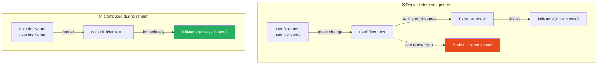

# 116 · Common Anti-Patterns

> **Anti-patterns in React and Next.js are code patterns that seem reasonable, work in simple cases, and are often recommended in outdated tutorials — but that create real problems at scale: bugs that are hard to reproduce, performance that degrades gradually, code that becomes impossible to reason about. This document catalogs the most consequential anti-patterns observed across production React/Next.js applications — not minor style choices, but structural patterns that consistently cause production incidents, debugging nightmares, or maintenance crises. Each anti-pattern is presented with the reasoning for WHY it fails, not just the rule against it.**

The patterns in this document have one thing in common: they work at small scale and break at large scale. A `useEffect` that syncs two pieces of state works fine in a component with 3 state variables — and creates impossible-to-debug cascades in a component with 10 state variables and 6 effects. Understanding the failure mode of each anti-pattern, not just the rule, is what enables engineers to recognize novel instances of the pattern in code they haven't seen documented before.

---

## Table of Contents

- [Anti-Pattern 1: Derived State from Props](#anti-pattern-1-derived-state-from-props)
- [Anti-Pattern 2: useEffect for Derived Data](#anti-pattern-2-useeffect-for-derived-data)
- [Anti-Pattern 3: Key as Reset Mechanism (Overuse)](#anti-pattern-3-key-as-reset-mechanism-overuse)
- [Anti-Pattern 4: Boolean Props Explosion](#anti-pattern-4-boolean-props-explosion)
- [Anti-Pattern 5: The God Component](#anti-pattern-5-the-god-component)
- [Anti-Pattern 6: useContext as Global State](#anti-pattern-6-usecontext-as-global-state)
- [Anti-Pattern 7: Prop Drilling Workarounds That Create Coupling](#anti-pattern-7-prop-drilling-workarounds-that-create-coupling)
- [Anti-Pattern 8: Index as Key](#anti-pattern-8-index-as-key)
- [Anti-Pattern 9: Inline Object/Array/Function Props](#anti-pattern-9-inline-objectarrayfunction-props)
- [Anti-Pattern 10: Mixing Server and Client Concerns](#anti-pattern-10-mixing-server-and-client-concerns)
- [Anti-Pattern 11: Ignoring Error Boundaries](#anti-pattern-11-ignoring-error-boundaries)
- [Anti-Pattern 12: useRef for State](#anti-pattern-12-useref-for-state)
- [Architecture Diagrams](#architecture-diagrams)
- [Anti-Pattern Detection Checklist](#anti-pattern-detection-checklist)
- [Mental Model](#mental-model)
- [Further Reading](#further-reading)

---

## Anti-Pattern 1: Derived State from Props

```tsx
// ❌ THE ANTI-PATTERN: storing derived values in state
function UserProfile({ user }: { user: User }) {
  const [fullName, setFullName] = useState(
    `${user.firstName} ${user.lastName}`,
  );

  // Trying to keep the state in sync with the prop:
  useEffect(() => {
    setFullName(`${user.firstName} ${user.lastName}`);
  }, [user.firstName, user.lastName]);

  return <h1>{fullName}</h1>;
}

// WHY IT FAILS:
// 1. There's a render where `fullName` is stale (between the prop change
//    and the useEffect running → one render with wrong data)
// 2. Two sources of truth that must be kept in sync → bug surface area
// 3. The useEffect adds cognitive overhead with zero benefit — it just
//    copies one value to another

// ✅ THE FIX: compute derived values during render, not in state
function UserProfile({ user }: { user: User }) {
  // Derived value computed inline — always in sync, zero latency:
  const fullName = `${user.firstName} ${user.lastName}`;
  return <h1>{fullName}</h1>;
}

// FOR EXPENSIVE DERIVATIONS: useMemo (not state):
function ProductCatalog({ products, filters }: Props) {
  // Only recalculate when inputs change:
  const filteredProducts = useMemo(
    () => applyFilters(products, filters),
    [products, filters],
  );
  return <ProductGrid products={filteredProducts} />;
}

// THE TEST: "Could this value be computed from existing state/props?"
// YES → don't put it in state; compute it during render (or useMemo)
// NO  → it genuinely needs state (e.g., user input, server data, toggle state)
```

---

## Anti-Pattern 2: useEffect for Derived Data

```tsx
// ❌ THE ANTI-PATTERN: useEffect to sync derived data into state
function SearchResults({
  query,
  products,
}: {
  query: string;
  products: Product[];
}) {
  const [filtered, setFiltered] = useState<Product[]>(products);

  // This effect fires AFTER every render where query or products change,
  // causing an EXTRA re-render just to set state that could be computed inline:
  useEffect(() => {
    setFiltered(products.filter((p) => p.name.includes(query)));
  }, [query, products]);

  return <ProductList products={filtered} />;
}

// WHY IT FAILS:
// 1. Double-render: initial render → effect fires → state update → re-render
// 2. Stale render: one render shows unfiltered results while effect is pending
// 3. Complexity: adds useEffect + useState for something computable in one line
// 4. Bugs: if `query` and `products` change simultaneously, there's a frame
//    where filtered shows the OLD filter applied to the NEW products

// ✅ THE FIX: compute during render
function SearchResults({
  query,
  products,
}: {
  query: string;
  products: Product[];
}) {
  const filtered = useMemo(
    () => products.filter((p) => p.name.includes(query)),
    [query, products],
  );
  return <ProductList products={filtered} />;
}

// LEGITIMATE useEffect USE CASES (NOT derived state):
// - Syncing state with an external system (document title, localStorage)
// - Subscribing to external events (WebSocket, EventEmitter)
// - Fetching data (better: TanStack Query, React cache())
// - Running animations triggered by state changes
// If you're just computing one value from another: it's derived, not an effect.
```

---

## Anti-Pattern 3: Key as Reset Mechanism (Overuse)

```tsx
// ❌ THE ANTI-PATTERN: using key to "reset" state on every prop change
function CommentEditor({ postId }: { postId: string }) {
  const [text, setText] = useState("");

  const handleSubmit = () => {
    /* submit */
  };

  return (
    <Editor
      key={postId}
      text={text}
      onChange={setText}
      onSubmit={handleSubmit}
    />
  );
}
// When postId changes → Editor UNMOUNTS (state lost, effects cleaned up)
//                       → Editor REMOUNTS (fresh state)

// This is CORRECT in some cases (navigating to a different post → reset the editor)
// but WRONG if overused as a lazy way to avoid managing state transitions properly.

// ❌ WRONG USE: key on a complex component to avoid managing a reset:
function DataTable({ tableId, columns, data }: Props) {
  // Using key={tableId} so the table "resets" when tableId changes
  // → DESTROYS and REMOUNTS the entire table (losing sort state, scroll position,
  //   selected rows, filters, pagination — destroying good UX unnecessarily)
  return <Table key={tableId} columns={columns} data={data} />;
}

// ✅ CORRECT USE: key when you genuinely WANT full reset semantics
// - Navigating between different entities (user/1 → user/2: reset their form)
// - A game that should restart from scratch between rounds

// ✅ BETTER APPROACH for prop-driven state transitions:
function DataTable({ tableId, columns, data }: Props) {
  const [sortConfig, setSortConfig] = useState<SortConfig>({
    key: "id",
    dir: "asc",
  });
  const [filters, setFilters] = useState({});

  // When tableId changes, reset state EXPLICITLY and SELECTIVELY:
  useEffect(() => {
    setSortConfig({ key: "id", dir: "asc" }); // reset sort
    setFilters({}); // reset filters
    // Preserve: column visibility, user preferences, etc. if appropriate
  }, [tableId]);

  return <Table /* ... */ />;
}
```

---

## Anti-Pattern 4: Boolean Props Explosion

```tsx
// ❌ THE ANTI-PATTERN: boolean props for variant selection
interface BadButtonProps {
  isPrimary?: boolean;
  isSecondary?: boolean;
  isDanger?: boolean;
  isOutlined?: boolean;
  isLoading?: boolean;
  isDisabled?: boolean;
  isSmall?: boolean;
  isMedium?: boolean;
  isLarge?: boolean;
  isFullWidth?: boolean;
  isIconOnly?: boolean;
}

// Problems with this:
// 1. Impossible states are representable: isPrimary={true} isSecondary={true}
// 2. Prop count grows without bound (every new variant = new boolean)
// 3. TypeScript cannot enforce "choose exactly one variant"
// 4. Discoverability: "what values does variant accept?" → read source code

// ✅ THE FIX: variant unions for mutually exclusive choices
interface GoodButtonProps {
  variant?: "primary" | "secondary" | "danger" | "outlined";
  size?: "sm" | "md" | "lg";
  isLoading?: boolean;
  disabled?: boolean; // these are fine as booleans (independently true/false)
  fullWidth?: boolean;
}

// TypeScript enforces: variant="primary" isSecondary is a type error
// Discoverable: TypeScript autocomplete shows all valid variants
// Extensible: new variant = add to the union, no new prop

// IDENTIFYING THE ANTI-PATTERN:
// If you have 3+ boolean props that are semantically related (all about size,
// all about visual style, all about state category) → consolidate into a union
// If you have 2 booleans that can't both be true at the same time → they should
// be a union, not two separate booleans
```

---

## Anti-Pattern 5: The God Component

```tsx
// ❌ THE ANTI-PATTERN: one component doing too many things
// A single 800-line component that:
// - Manages authentication state
// - Fetches product data AND order history AND user profile
// - Handles the shopping cart logic
// - Renders a product listing AND a sidebar AND a cart summary AND checkout
// - Contains 15 useState calls and 8 useEffect calls

function GodDashboard() {
  const [user, setUser] = useState(null);
  const [products, setProducts] = useState([]);
  const [orders, setOrders] = useState([]);
  const [cart, setCart] = useState([]);
  const [isLoading, setIsLoading] = useState(false);
  const [error, setError] = useState(null);
  const [searchQuery, setSearchQuery] = useState('');
  const [sortBy, setSortBy] = useState('price');
  const [filterCategory, setFilterCategory] = useState('all');
  const [currentPage, setCurrentPage] = useState(1);
  const [selectedProduct, setSelectedProduct] = useState(null);
  const [isCheckoutOpen, setIsCheckoutOpen] = useState(false);
  // ... 3 more states ...

  // 8 useEffects to keep all this synchronized ...

  return (/* 400 lines of JSX */);
}

// WHY IT FAILS:
// 1. Any change anywhere might affect anything else — untestable
// 2. Each feature's logic is entangled with every other feature
// 3. Every render of any state causes the entire dashboard to re-render
// 4. New developers cannot understand the component without reading all 800 lines

// ✅ THE FIX: decompose by concern
// Each piece has its own state, its own data fetching, its own tests:

function Dashboard() {
  return (
    <DashboardLayout>
      <ProductCatalog /> {/* owns: search, filter, sort, products data */}
      <ShoppingCart />   {/* owns: cart state, checkout flow */}
      <OrderHistory />   {/* owns: orders data, pagination */}
    </DashboardLayout>
  );
}

// THRESHOLD: when a component has >5 useState calls or >3 useEffect calls,
// examine whether it can be split into smaller, cohesive components.
```

---

## Anti-Pattern 6: useContext as Global State

```tsx
// ❌ THE ANTI-PATTERN: putting frequently-changing values in a top-level Context
const AppContext = createContext<{
  user: User;
  cart: CartItem[];
  addToCart: (item: CartItem) => void;
  theme: string;
  notifications: Notification[];
  searchQuery: string;
  setSearchQuery: (q: string) => void;
  // ... everything else ...
}>(null!);

function App() {
  const [cart, setCart] = useState<CartItem[]>([]);
  const [searchQuery, setSearchQuery] = useState("");
  // etc.

  return (
    <AppContext.Provider
      value={{ cart, searchQuery, setSearchQuery /* ... */ }}
    >
      <AppContent />
    </AppContext.Provider>
  );
}

// WHY IT FAILS:
// EVERY component that calls useContext(AppContext) re-renders when ANY
// value in the context changes — including components that only care about
// the user (not the cart), or only care about the theme (not notifications).
// Typing in the search box updates searchQuery → EVERY context consumer
// re-renders → SearchBar, CartIcon, UserProfile, NotificationBell ALL re-render
// on every keystroke.

// ✅ THE FIX: split contexts by change frequency
const UserContext = createContext<User | null>(null); // rarely changes
const ThemeContext = createContext<string>("light"); // rarely changes
const CartContext = createContext<CartContextValue>(null!); // moderate change
// SearchQuery: don't use context at all — it's local to the search feature

// OR: use a state management library (Zustand, Redux Toolkit) with selectors
// that enable granular subscriptions:
const cartCount = useCartStore((state) => state.cart.length); // only re-renders when count changes
```

---

## Anti-Pattern 7: Prop Drilling Workarounds That Create Coupling

```tsx
// ❌ THE ANTI-PATTERN: prop drilling "fixed" with window/module globals

// Instead of threading a callback through 4 layers of components,
// some developers use module-level variables or window properties:

// BAD: module-level side channel
let globalCartUpdater: ((item: CartItem) => void) | null = null;

function App() {
  const addToCart = useCallback((item: CartItem) => {
    /* ... */
  }, []);
  globalCartUpdater = addToCart; // ← leaks into module scope
}

function DeepChildComponent() {
  // "Avoids" prop drilling by using the global:
  globalCartUpdater?.({ id: "1", qty: 1 });
}

// WHY IT FAILS:
// 1. globalCartUpdater might be stale (pointing to old closure)
// 2. Multiple App instances (testing, SSR) share the same global → chaos
// 3. The dependency is INVISIBLE — DeepChildComponent looks self-contained
//    but secretly depends on App having mounted and set the global

// ✅ THE ACTUAL FIXES FOR PROP DRILLING:
// Option A: Context (for genuinely shared cross-tree state)
// Option B: Zustand/Redux (for global application state)
// Option C: Composition — instead of drilling through, let the caller compose:
// Pass the deep child UP to where it has access to the callback

function App() {
  const { addToCart } = useCart();
  return (
    <ProductSection
      // Render the action button at the same level that has addToCart:
      renderAction={(product) => (
        <button onClick={() => addToCart(product)}>Add to cart</button>
      )}
    />
  );
}
```

---

## Anti-Pattern 8: Index as Key

```tsx
// ❌ THE ANTI-PATTERN: using array index as the key prop
function CommentList({ comments }: { comments: Comment[] }) {
  return (
    <ul>
      {comments.map((comment, index) => (
        <Comment key={index} comment={comment} /> // ← index as key
      ))}
    </ul>
  );
}

// WHY IT FAILS:
// React uses `key` to match DOM elements across re-renders.
// If the list is: [A(key=0), B(key=1), C(key=2)]
// And A is deleted: [B(key=0), C(key=1)]
// React sees: "key=0 changed from A to B" → updates DOM in place
//             "key=1 changed from B to C" → updates DOM in place
//             "key=2 was removed" → destroys the DOM node
// This is WRONG and causes:
// - Input fields keeping their old values (the DOM node wasn't destroyed/recreated)
// - Animations playing incorrectly (wrong element transitions)
// - Focus moving to the wrong element
// - Stale state in components that hold their own state

// ✅ THE FIX: use a stable, unique identifier
function CommentList({ comments }: { comments: Comment[] }) {
  return (
    <ul>
      {comments.map((comment) => (
        <Comment key={comment.id} comment={comment} /> // ← stable unique ID
      ))}
    </ul>
  );
}

// LEGITIMATE USE OF INDEX AS KEY:
// Static lists that NEVER change order, are NEVER filtered, and the items
// have no state (pure display only). Even then, prefer a real ID when available.
// "Never changes" is hard to guarantee — use a real ID to be safe.
```

---

## Anti-Pattern 9: Inline Object/Array/Function Props

```tsx
// ❌ THE ANTI-PATTERN: creating new references inline on every render
function ProductCatalog() {
  return (
    <ProductGrid
      columns={["name", "price", "category"]} // ← new array every render
      style={{ padding: "16px", gap: "8px" }} // ← new object every render
      onSort={(key) => setSort(key)} // ← new function every render
      filters={{ category: "all", inStock: true }} // ← new object every render
    />
  );
}

// WHY IT FAILS (when ProductGrid is wrapped in React.memo):
// React.memo does a SHALLOW EQUALITY check: prevProps !== nextProps
// ['name', 'price'] !== ['name', 'price'] (different array references)
// → React.memo can NEVER skip a render even though the data is identical
// → All the memoization work is wasted
// Even without React.memo: object/function creation on every render adds
// GC pressure and makes dependency arrays unreliable (useEffect, useMemo)

// ✅ THE FIX: stable references for stable values
const COLUMNS = ["name", "price", "category"] as const; // defined OUTSIDE component
const GRID_STYLE = { padding: "16px", gap: "8px" }; // defined OUTSIDE component
const DEFAULT_FILTERS = { category: "all", inStock: true };

function ProductCatalog() {
  const handleSort = useCallback((key: string) => setSort(key), []); // stable reference

  return (
    <ProductGrid
      columns={COLUMNS} // same reference every render
      style={GRID_STYLE} // same reference every render
      onSort={handleSort} // stable via useCallback
      filters={DEFAULT_FILTERS} // same reference every render
    />
  );
}
```

---

## Anti-Pattern 10: Mixing Server and Client Concerns

```tsx
// ❌ THE ANTI-PATTERN: putting server-only code paths in Client Components
// OR putting browser-only code in Server Components

// BAD: Client Component that tries to use server-only APIs:
"use client";
import { cookies } from "next/headers"; // ← server-only! Will fail at runtime

function UserBadge() {
  const session = cookies().get("session"); // ← throws: not available in browser
  return <span>{session?.value}</span>;
}

// BAD: Server Component accidentally using browser APIs:
async function ServerWidget() {
  // This is a Server Component — these APIs don't exist on the server:
  const theme = localStorage.getItem("theme"); // ← ReferenceError: localStorage not defined
  return <div style={{ background: theme === "dark" ? "#000" : "#fff" }} />;
}

// ✅ THE FIX: clear boundary between server and client concerns
// Server Component: reads cookies, fetches from DB, calls server APIs
async function ServerUserBadge() {
  const session = cookies().get("session"); // ✅ server-only API in server component
  const user = session ? await getUser(session.value) : null;
  return <ClientUserBadge user={user} />; // pass data to client component
}

// Client Component: handles browser APIs, interactivity, browser state
("use client");
function ClientUserBadge({ user }: { user: User | null }) {
  const [theme, setTheme] = useState(
    () => localStorage.getItem("theme") ?? "light",
  );
  // ✅ browser API in useEffect or useState initializer in client component
  return user ? (
    <span style={{ color: theme === "dark" ? "#fff" : "#000" }}>
      {user.name}
    </span>
  ) : null;
}
```

---

## Anti-Pattern 11: Ignoring Error Boundaries

```tsx
// ❌ THE ANTI-PATTERN: no error boundaries anywhere
function Dashboard() {
  return (
    <div>
      <MetricsPanel /> {/* if this throws, the entire dashboard crashes */}
      <OrderList /> {/* even though this is completely unrelated */}
      <ActivityFeed /> {/* and this is also unrelated */}
    </div>
  );
}

// WHY IT FAILS:
// One failed API call in MetricsPanel that causes an unhandled render error
// crashes the ENTIRE dashboard — including OrderList and ActivityFeed which
// were working fine and have nothing to do with the metrics failure.
// Users see a blank page or the root error boundary (if you have one),
// losing access to all functionality.

// ✅ THE FIX: isolate failures with granular error boundaries
function Dashboard() {
  return (
    <div>
      <ErrorBoundary fallback={<MetricsError />}>
        <MetricsPanel />
      </ErrorBoundary>
      <ErrorBoundary fallback={<OrdersError />}>
        <OrderList />
      </ErrorBoundary>
      <ErrorBoundary fallback={<FeedError />}>
        <ActivityFeed />
      </ErrorBoundary>
    </div>
  );
}
// Now: MetricsPanel failure → only MetricsPanel shows an error
//      OrderList and ActivityFeed continue working normally
```

---

## Anti-Pattern 12: useRef for State

```tsx
// ❌ THE ANTI-PATTERN: using useRef to hold values that should trigger re-renders
function Counter() {
  const countRef = useRef(0); // NOT useState

  const increment = () => {
    countRef.current += 1;
    console.log("Count is now:", countRef.current); // correctly updated
    // But NO RE-RENDER OCCURS — the UI still shows 0
  };

  return (
    <div>
      <p>Count: {countRef.current}</p> {/* stuck at 0 */}
      <button onClick={increment}>+1</button>
    </div>
  );
}

// WHY IT FAILS:
// Mutating a ref doesn't trigger a re-render. The component only
// re-renders when STATE changes. The ref value IS updating correctly
// in JavaScript, but React doesn't know to re-render the component,
// so the UI never reflects the updated value.

// ✅ THE FIX: use useState for values that should trigger re-renders
function Counter() {
  const [count, setCount] = useState(0); // triggers re-render when changed
  return (
    <div>
      <p>Count: {count}</p>
      <button onClick={() => setCount((c) => c + 1)}>+1</button>
    </div>
  );
}

// LEGITIMATE useRef USE CASES (values that DON'T need to trigger re-renders):
// - References to DOM elements: const inputRef = useRef<HTMLInputElement>(null)
// - Values that are read but not displayed: const previousValueRef = useRef(value)
// - Mutable values for use in event handlers: const isSubmittingRef = useRef(false)
// - Timers/intervals: const intervalRef = useRef<ReturnType<typeof setInterval>>()
```

---

## Architecture Diagrams

### Derived state vs computed value



---

## Anti-Pattern Detection Checklist

```
DURING CODE REVIEW, CHECK FOR:

□ Does any useState hold a value that could be computed from props or
  other state? → Derived state anti-pattern (#1)

□ Does any useEffect's only job is to setX(computeFrom(y))?
  → useEffect for derived data anti-pattern (#2)

□ Are there 3+ boolean props where only one should be true at a time?
  → Boolean props explosion anti-pattern (#4)

□ Is any component file >300 lines or has >5 useState calls?
  → God component anti-pattern (#5)

□ Does a context provider hold data that updates more frequently than
  the average consumer needs to re-render?
  → useContext as global state anti-pattern (#6)

□ Are any objects/arrays/functions created inline in JSX props?
  → Inline reference anti-pattern (#9)

□ Is any list rendered with key={index}?
  → Index as key anti-pattern (#8)

□ Are there component subtrees with no wrapping error boundary?
  → Missing error boundaries anti-pattern (#11)

□ Is useRef being used to hold a value that's used in JSX output?
  → useRef for state anti-pattern (#12)
```

---

## Mental Model

> 💡 **The anti-pattern mental model:**
>
> Anti-patterns in React are like **architectural shortcuts that create technical debt** — they solve an immediate problem (need to track derived state? put it in useState) while introducing a structural flaw that compounds over time (now you need a useEffect to keep it synced, and a bug where it's stale for one render, and a test that occasionally fails because of the timing). The common thread in all these anti-patterns is **violating a single source of truth**: derived state creates a second source of truth for a value that already has one; God components centralize too many sources of truth in one place; module globals create an invisible source of truth outside React's model. The cure for most anti-patterns is the same: identify the ACTUAL single source of truth and ensure all other values that depend on it are computed FROM that source, not stored as parallel copies. React's rendering model is designed to make this easy — a component renders based on its current state and props, and everything else is derivable from those. Fighting that model by storing parallel copies of the same data is the root cause of most anti-patterns.

---

## Further Reading

- [React docs: You Might Not Need an Effect](https://react.dev/learn/you-might-not-need-an-effect) — the definitive guide on useEffect anti-patterns
- [React docs: Choosing the State Structure](https://react.dev/learn/choosing-the-state-structure) — avoiding derived state and other state structure mistakes
- [React docs: Passing Data Deeply with Context](https://react.dev/learn/passing-data-deeply-with-context) — when to use context and when not to
- [Kent C. Dodds: Don't Sync State — Derive It!](https://kentcdodds.com/blog/dont-sync-state-derive-it) — the derived state anti-pattern in depth
- Related in this handbook: [112 · Debugging React](../debugging/01-debugging-react.md), [79 · Context Internals](../state-management/01-context-internals.md)
- Next in this handbook: [117 · State Management Anti-Patterns](./02-state-anti-patterns.md)

---

_Part of the [React + Next.js Engineering Handbook](../../README.md)_
