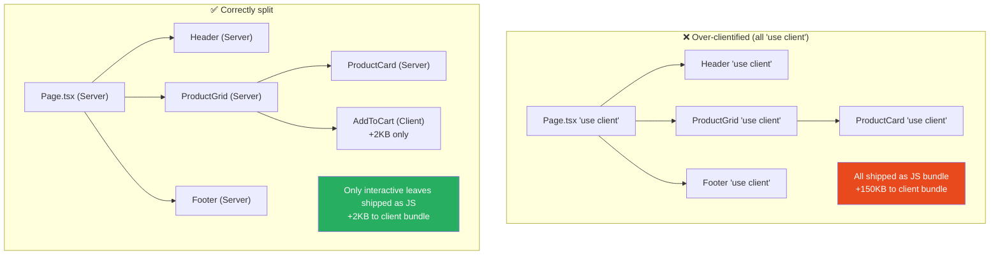

# 118 · Performance Anti-Patterns

> **Performance anti-patterns in React and Next.js are patterns that create performance problems that are invisible in development (where fast hardware masks the impact), emerge gradually in production (each anti-pattern adds milliseconds that compound), and are difficult to attribute to a single cause when investigating a performance regression. They fall into three categories: memoization anti-patterns (doing too much or too little), rendering anti-patterns (causing unnecessary work), and loading anti-patterns (failing to optimize resource delivery). Each is covered here with the exact failure mode and its measurable impact.**

Performance anti-patterns differ from correctness bugs in an important way: they don't BREAK your application, they just make it SLOWER. This means they accumulate undetected over time, each new one adding a small tax that individually seems acceptable but collectively produces an application that "just feels slow" without an obvious single cause. The anti-patterns in this document are the most common causes of that gradual degradation.

---

## Table of Contents

- [Anti-Pattern 1: Memoizing Everything (Over-Memoization)](#anti-pattern-1-memoizing-everything-over-memoization)
- [Anti-Pattern 2: Missing Memoization on Expensive Operations](#anti-pattern-2-missing-memoization-on-expensive-operations)
- [Anti-Pattern 3: Large Component Trees Without Splitting](#anti-pattern-3-large-component-trees-without-splitting)
- [Anti-Pattern 4: Blocking the Main Thread During Render](#anti-pattern-4-blocking-the-main-thread-during-render)
- [Anti-Pattern 5: Unvirtualized Long Lists](#anti-pattern-5-unvirtualized-long-lists)
- [Anti-Pattern 6: Overusing Dynamic Imports](#anti-pattern-6-overusing-dynamic-imports)
- [Anti-Pattern 7: Image Performance Failures](#anti-pattern-7-image-performance-failures)
- [Anti-Pattern 8: Waterfalls in Data Fetching](#anti-pattern-8-waterfalls-in-data-fetching)
- [Anti-Pattern 9: Unnecessary Client Components in Next.js](#anti-pattern-9-unnecessary-client-components-in-nextjs)
- [Anti-Pattern 10: Effect-Driven Cascades](#anti-pattern-10-effect-driven-cascades)
- [Anti-Pattern 11: Prop Spreading into DOM Elements](#anti-pattern-11-prop-spreading-into-dom-elements)
- [Anti-Pattern 12: Missing Suspense Boundaries for Code-Split Routes](#anti-pattern-12-missing-suspense-boundaries-for-code-split-routes)
- [Architecture Diagrams](#architecture-diagrams)
- [Performance Anti-Pattern Detection Checklist](#performance-anti-pattern-detection-checklist)
- [Mental Model](#mental-model)
- [Further Reading](#further-reading)

---

## Anti-Pattern 1: Memoizing Everything (Over-Memoization)

```tsx
// ❌ THE ANTI-PATTERN: wrapping every component and function in memoization
// "for performance," without measuring whether it helps

const UserName = React.memo(function UserName({ name }: { name: string }) {
  return <span>{name}</span>; // renders in ~0.01ms — memo overhead exceeds benefit
});

const ProfileHeader = React.memo(function ProfileHeader({ user }: { user: User }) {
  const formattedDate = useMemo(
    () => formatDate(user.joinedAt), // formatDate takes ~0.001ms — not worth memoizing
    [user.joinedAt]
  );
  const handleClick = useCallback(() => {
    navigate('/settings'); // constant navigate reference — useCallback adds nothing
  }, []);

  return (/* ... */);
});

// WHY IT FAILS:
// React.memo: adds a shallow comparison of ALL props on every parent render.
// For simple components (a span with text), the comparison cost can EXCEED
// the rendering cost.
//
// useMemo: stores the previous value in memory, runs the comparison function
// on every render. For trivial computations (string formatting), the overhead
// of memoization is MORE than just running the computation.
//
// useCallback: same overhead as useMemo. Only beneficial when the stable
// function reference is actually needed (passed to a React.memo child or
// used in a useEffect dependency array).
//
// MEASURABLE IMPACT:
// In a benchmark with 1000 list items:
// Without any memo: 45ms to render
// With React.memo on simple items: 52ms (the comparison overhead adds up)
// With React.memo on genuinely expensive items: 18ms (real benefit)

// ✅ THE FIX: profile first, memoize specifically
// Apply React.memo only to components that:
// 1. Render expensively (confirmed by React DevTools Profiler: >2ms per render)
// 2. Receive stable or rarely-changing props
// 3. Re-render frequently from parent renders (not from their own state)
// Apply useMemo only to computations that take measurable time (>5ms)
// Apply useCallback only when the stable reference actually matters
```

---

## Anti-Pattern 2: Missing Memoization on Expensive Operations

```tsx
// ❌ THE ANTI-PATTERN: no memoization where it genuinely matters
function ProductCatalog({ allProducts }: { allProducts: Product[] }) {
  const [searchQuery, setSearchQuery] = useState("");
  const [sortBy, setSortBy] = useState<"price" | "name">("price");
  const [category, setCategory] = useState("all");

  // This runs on EVERY render — including every keystroke in the search box:
  const filteredAndSorted = allProducts
    .filter(
      (p) =>
        (category === "all" || p.category === category) &&
        p.name.toLowerCase().includes(searchQuery.toLowerCase()),
    )
    .sort((a, b) =>
      sortBy === "price" ? a.price - b.price : a.name.localeCompare(b.name),
    );
  // On 10,000 products: filter + sort ≈ 50ms each render
  // User types one character → 50ms CPU block → visible lag

  return <ProductGrid products={filteredAndSorted} />;
}

// WHY IT FAILS:
// 50ms of synchronous computation on the main thread on EVERY render
// = 50ms delay on every keystroke = visibly laggy search input
// This is directly measurable and directly impacts INP (Interaction to Next Paint)

// ✅ THE FIX: useMemo for expensive computations
function ProductCatalog({ allProducts }: { allProducts: Product[] }) {
  const [searchQuery, setSearchQuery] = useState("");
  const [sortBy, setSortBy] = useState<"price" | "name">("price");
  const [category, setCategory] = useState("all");

  // Only recalculates when the inputs actually change:
  const filteredAndSorted = useMemo(() => {
    return allProducts
      .filter(
        (p) =>
          (category === "all" || p.category === category) &&
          p.name.toLowerCase().includes(searchQuery.toLowerCase()),
      )
      .sort((a, b) =>
        sortBy === "price" ? a.price - b.price : a.name.localeCompare(b.name),
      );
  }, [allProducts, category, searchQuery, sortBy]);

  return <ProductGrid products={filteredAndSorted} />;
}
// Now: typing in search recomputes (expected, searchQuery changed)
// But: changing sortBy doesn't cause a search re-filter unnecessarily
// And: parent re-renders don't cause the computation to re-run
```

---

## Anti-Pattern 3: Large Component Trees Without Splitting

```tsx
// ❌ THE ANTI-PATTERN: one component subtree that renders everything
function Dashboard({ userId }: { userId: string }) {
  const [filter, setFilter] = useState("all");
  // Setting filter re-renders Dashboard AND everything below it:
  // Header, Sidebar, MetricsPanel (100+ elements), OrderList (500+ rows),
  // ActivityFeed (200+ items), Footer — all of it, every filter change

  return (
    <div>
      <Header /> {/* re-renders unnecessarily */}
      <Sidebar /> {/* re-renders unnecessarily */}
      <FilterBar filter={filter} onChange={setFilter} />
      <MetricsPanel userId={userId} /> {/* re-renders unnecessarily */}
      <OrderList filter={filter} /> {/* re-renders — correct (uses filter) */}
      <ActivityFeed userId={userId} /> {/* re-renders unnecessarily */}
      <Footer /> {/* re-renders unnecessarily */}
    </div>
  );
}

// WHY IT FAILS:
// React renders the ENTIRE component subtree when Dashboard re-renders.
// The filter only affects OrderList, but Header, Sidebar, MetricsPanel,
// ActivityFeed, and Footer all run their render functions too.
// At scale: 1000+ DOM elements recomputed → visible lag on filter changes.

// ✅ THE FIX: isolate state closer to where it's used + React.memo
function Dashboard({ userId }: { userId: string }) {
  return (
    <div>
      <Header /> {/* never re-renders — no state dependency */}
      <Sidebar /> {/* never re-renders — no state dependency */}
      <FilterableOrderList userId={userId} /> {/* owns the filter state */}
      <MetricsPanel userId={userId} />
      <ActivityFeed userId={userId} />
      <Footer />
    </div>
  );
}

function FilterableOrderList({ userId }: { userId: string }) {
  const [filter, setFilter] = useState("all");
  // Now only FilterBar + OrderList re-render on filter change:
  return (
    <>
      <FilterBar filter={filter} onChange={setFilter} />
      <OrderList filter={filter} userId={userId} />
    </>
  );
}
```

---

## Anti-Pattern 4: Blocking the Main Thread During Render

```tsx
// ❌ THE ANTI-PATTERN: synchronous heavy computation during render
function ReportGenerator({ rawData }: { rawData: RawRecord[] }) {
  // This runs synchronously on EVERY render:
  const report = generateFullReport(rawData); // ← takes 500ms for large datasets
  // The browser is blocked for 500ms — no user input processed, no frames painted

  return <ReportView report={report} />;
}

// WHY IT FAILS:
// 500ms of synchronous computation = 500ms INP for any interaction that
// triggers this component's re-render. User clicks a button → entire UI
// freezes for half a second → terrible experience.

// ✅ FIX OPTION 1: useMemo (if computation must stay synchronous)
function ReportGenerator({ rawData }: { rawData: RawRecord[] }) {
  const report = useMemo(() => generateFullReport(rawData), [rawData]);
  // Still 500ms on first render, but SKIPS the computation on subsequent renders
  // when rawData hasn't changed. Better, but not ideal for 500ms computations.
}

// ✅ FIX OPTION 2: Web Worker (for truly expensive computations)
function ReportGenerator({ rawData }: { rawData: RawRecord[] }) {
  const [report, setReport] = useState<Report | null>(null);

  useEffect(() => {
    const worker = new Worker(new URL("./report.worker.ts", import.meta.url));
    worker.postMessage(rawData);
    worker.onmessage = (e) => {
      setReport(e.data); // computation done off-main-thread
      worker.terminate();
    };
    return () => worker.terminate();
  }, [rawData]);

  if (!report) return <ReportSkeleton />;
  return <ReportView report={report} />;
}

// ✅ FIX OPTION 3: React.startTransition (mark update as non-urgent)
const [filter, setFilter] = useState("");
const handleFilterChange = (value: string) => {
  setFilter(value); // urgent: update the input immediately
  startTransition(() => {
    setDerivedReport(generateReport(value)); // non-urgent: can be interrupted
  });
};
```

---

## Anti-Pattern 5: Unvirtualized Long Lists

```tsx
// ❌ THE ANTI-PATTERN: rendering ALL items in a long list simultaneously
function ProductList({ products }: { products: Product[] }) {
  // Rendering 5,000 products: ~5,000 DOM nodes
  return (
    <ul>
      {products.map((product) => (
        <ProductCard key={product.id} product={product} />
      ))}
    </ul>
  );
}
// With 5,000 products:
// Initial render: 2-5 seconds of JavaScript + DOM creation
// Each re-render: processes all 5,000 items
// Memory: holding 5,000 DOM nodes (high memory pressure)
// Scroll: EVERY product DOM node triggers scroll-position calculations

// WHY IT FAILS (MEASURABLE):
// LCP: > 3 seconds (massive DOM creation blocks rendering)
// FID/INP: > 500ms (5,000 elements to process per interaction)
// Memory: > 200MB (5,000 complex DOM nodes)
// Scroll jank: < 30fps (browser calculating 5,000 element positions)

// ✅ THE FIX: virtualize — render only what's visible
import { FixedSizeList } from "react-window";

function ProductList({ products }: { products: Product[] }) {
  return (
    <FixedSizeList
      height={600}
      itemCount={products.length}
      itemSize={120} // height of each ProductCard in pixels
      width="100%"
    >
      {({ index, style }) => (
        <div style={style}>
          <ProductCard product={products[index]} />
        </div>
      )}
    </FixedSizeList>
  );
}
// With 5,000 products + virtualization:
// DOM nodes: ~10 (only visible items + a few overscan items)
// Initial render: < 100ms
// Scroll: 60fps (only visible DOM nodes to recalculate)
// Memory: < 20MB

// THRESHOLD: virtualize when the list exceeds ~50-100 items,
// especially if each item is visually complex (has images, interactive elements)
```

---

## Anti-Pattern 6: Overusing Dynamic Imports

```tsx
// ❌ THE ANTI-PATTERN: code-splitting too aggressively
// dynamically importing small, commonly-needed components

const Button = dynamic(() => import("./Button")); // 2KB component — not worth it
const Icon = dynamic(() => import("./Icon")); // 1KB component — not worth it
const Badge = dynamic(() => import("./Badge")); // 0.5KB component — not worth it

function ProductCard({ product }: { product: Product }) {
  return (
    <div>
      <Icon name="star" /> {/* renders a fallback while Icon loads — flash! */}
      <h3>{product.name}</h3>
      <Badge>{product.category}</Badge> {/* same — unnecessary loading flash */}
      <Button>Add to Cart</Button> {/* same — annoying UX */}
    </div>
  );
}

// WHY IT FAILS:
// Each dynamic import = a separate network request + parsing + execution delay.
// For components smaller than 5-10KB: the network request overhead EXCEEDS
// the benefit of code splitting.
// Worse: each dynamic import shows a loading fallback, causing content to
// "pop in" in stages → visible CLS (Cumulative Layout Shift) → poor UX.

// ✅ THE FIX: code-split at the ROUTE or FEATURE level, not at the component level
// Appropriate dynamic imports:
const FullscreenModal = dynamic(() => import("./FullscreenModal"), {
  ssr: false,
});
// → Only loaded when the user opens a modal (rare, complex = worth splitting)

const CheckoutFlow = dynamic(() => import("@/features/checkout/CheckoutFlow"));
// → Only loaded on the checkout page (route-level split)

const VideoPlayer = dynamic(() => import("./VideoPlayer"), { ssr: false });
// → Only loaded on pages that actually have videos, and complex enough to warrant it

// GUIDELINE: dynamic import when the component:
// 1. Is >10KB (gzipped) AND
// 2. Is not needed on the initial page load AND
// 3. Has a reasonable loading fallback that doesn't cause layout shift
```

---

## Anti-Pattern 7: Image Performance Failures

```tsx
// ❌ THE ANTI-PATTERN: naive image rendering

// Problem 1: No size constraints → layout shift (CLS)

// Browser doesn't know the image dimensions until it loads
// → layout shifts when image loads → high CLS score

// Problem 2: Large images served at wrong size
// Serving a 2000x2000px image for a 200x200px thumbnail
// → 10-20x more bytes than needed → slow LCP

// Problem 3: No lazy loading → all images downloaded on page load


// ... 50 more product images
// → All 50 images download immediately, competing with critical resources

// Problem 4: Wrong format → larger files than necessary
// Serving JPEG instead of WebP → typically 25-50% larger
// Serving PNG for photos → 2-5x larger than JPEG/WebP

// ✅ THE FIX: use Next.js Image component
import Image from 'next/image';

function ProductCard({ product }: { product: Product }) {
  return (
    <div className="product-card">
      <Image
        src={product.imageUrl}
        alt={product.name}
        width={300}           // exact dimensions → no layout shift
        height={300}          // serves correctly sized image for this display size
        loading="lazy"        // default in next/image — don't download until visible
        // priority={true}    // ADD only for LCP image (above the fold, most important)
        sizes="(max-width: 768px) 100vw, (max-width: 1200px) 50vw, 300px"
        // sizes: tells the browser which size to download at each viewport width
        // Without sizes: browser downloads the full image width unnecessarily
      />
    </div>
  );
}

// HERO IMAGE (above the fold — affects LCP):
<Image
  src={heroImage}
  alt="Hero"
  width={1200}
  height={600}
  priority   // ← preloads this image, improving LCP
  sizes="100vw"
/>
```

---

## Anti-Pattern 8: Waterfalls in Data Fetching

```tsx
// ❌ THE ANTI-PATTERN: sequential data fetching where parallel is possible
async function DashboardPage() {
  const user = await fetchUser(); // 200ms
  const orders = await fetchOrders(user.id); // 150ms (waits for user)
  const notifications = await fetchNotifications(user.id); // 100ms (waits for orders!)
  // Total: 450ms sequential, when parallel would take max(200, 150, 100) = 200ms

  return (
    <Dashboard user={user} orders={orders} notifications={notifications} />
  );
}

// WHY IT FAILS:
// 450ms vs 200ms server response time = 250ms extra TTFB
// Multiplied across all your users, all day = significant infrastructure cost
// AND direct user-experience impact (slower page loads)

// ✅ THE FIX: fetch in parallel when possible
async function DashboardPage() {
  const [user, orders, notifications] = await Promise.all([
    fetchUser(),
    fetchOrders(userId), // assumes userId is available from session
    fetchNotifications(userId),
  ]);
  // Total: max(200, 150, 100) = 200ms — 2.25x faster
  return (
    <Dashboard user={user} orders={orders} notifications={notifications} />
  );
}

// FOR GENUINE DEPENDENCIES: minimize the dependent part
async function DashboardPage({ userId }: { userId: string }) {
  const user = await fetchUser(userId); // genuinely needed first
  // Start everything that depends on user.orgId in parallel:
  const [orgData, orgMembers] = await Promise.all([
    fetchOrgData(user.orgId), // depends on user
    fetchOrgMembers(user.orgId), // depends on user (same dep as orgData)
  ]);
  return <Dashboard user={user} orgData={orgData} orgMembers={orgMembers} />;
}
```

---

## Anti-Pattern 9: Unnecessary Client Components in Next.js

```tsx
// ❌ THE ANTI-PATTERN: 'use client' on components that don't need it

// A component that just renders static content — no hooks, no event handlers:
"use client"; // ← WRONG: this forces client-side JavaScript for a static component
function ProductDescription({ description }: { description: string }) {
  return <p>{description}</p>;
}

// A parent that passes data to static children:
("use client"); // ← WRONG: the parent doesn't use any client features either
function ProductSection({ product }: { product: Product }) {
  return (
    <div>
      <h1>{product.name}</h1>
      <ProductDescription description={product.description} />
      <PriceTag price={product.price} />
    </div>
  );
}

// WHY IT FAILS:
// Every 'use client' component and its ENTIRE subtree is included in
// the client-side JavaScript bundle.
// Unnecessary 'use client' on ProductSection means:
// → ProductDescription, PriceTag, and all their children are bundled client-side
// → Higher bundle size → slower JavaScript parsing → worse FCP/LCP
// In Next.js App Router: Server Components render HTML on the server with
// ZERO client-side JavaScript overhead. Unnecessary 'use client' eliminates this.

// ✅ THE FIX: 'use client' only where actually needed
// Server Component (default in App Router) — no 'use client':
function ProductSection({ product }: { product: Product }) {
  return (
    <div>
      <h1>{product.name}</h1>
      <ProductDescription description={product.description} /> {/* server */}
      <PriceTag price={product.price} /> {/* server */}
      {/* Only make interactive parts Client Components: */}
      <AddToCartButton productId={product.id} /> {/* client: needs onClick */}
    </div>
  );
}

// 'use client' pushed to the leaf that actually needs it:
("use client");
function AddToCartButton({ productId }: { productId: string }) {
  const { mutate } = useAddToCart();
  return <button onClick={() => mutate(productId)}>Add to Cart</button>;
}
```

---

## Anti-Pattern 10: Effect-Driven Cascades

```tsx
// ❌ THE ANTI-PATTERN: useEffect chains where one effect triggers another state update
// which triggers another effect

function Dashboard({ userId }: { userId: string }) {
  const [user, setUser] = useState<User | null>(null);
  const [orgId, setOrgId] = useState<string | null>(null);
  const [orgData, setOrgData] = useState<OrgData | null>(null);

  // Effect 1: fetch user
  useEffect(() => {
    fetchUser(userId).then(setUser);
  }, [userId]);

  // Effect 2: runs after user state updates
  useEffect(() => {
    if (user) setOrgId(user.orgId);
  }, [user]);

  // Effect 3: runs after orgId state updates
  useEffect(() => {
    if (orgId) fetchOrgData(orgId).then(setOrgData);
  }, [orgId]);

  // WHAT ACTUALLY HAPPENS:
  // Render 1 (userId arrives): all state null, nothing fetching
  // Effect 1 fires → fetchUser starts
  // Render 2 (user arrives): setUser() → re-render
  // Effect 2 fires → setOrgId()
  // Render 3 (orgId set): re-render
  // Effect 3 fires → fetchOrgData starts
  // Render 4 (orgData arrives): final state
  // TOTAL: 4 renders, 2 sequential fetches, 1 pointless intermediate state
}

// WHY IT FAILS:
// 1. Each effect adds at MINIMUM one render cycle of latency
// 2. The chain creates a sequential waterfall: user fetch THEN org fetch
// 3. Hard to follow: why is orgId in state at all? It's just a stepping stone.
// 4. 4 renders for what should be achievable in 2

// ✅ THE FIX: do the work in one effect
useEffect(() => {
  let cancelled = false;
  async function loadData() {
    const user = await fetchUser(userId);
    if (cancelled) return;
    const orgData = await fetchOrgData(user.orgId);
    if (cancelled) return;
    setData({ user, orgData }); // one state update → one re-render
  }
  loadData();
  return () => {
    cancelled = true;
  };
}, [userId]);

// EVEN BETTER: no effects at all — use TanStack Query or RSC
```

---

## Anti-Pattern 11: Prop Spreading into DOM Elements

```tsx
// ❌ THE ANTI-PATTERN: spreading all props onto DOM elements
function Button({
  children,
  ...props
}: ButtonProps & React.HTMLAttributes<HTMLButtonElement>) {
  return (
    <button {...props}>
      {" "}
      {/* ← spreads ALL props including ones React doesn't understand */}
      {children}
    </button>
  );
}

// Usage:
<Button
  variant="primary" // ← NOT a valid HTML attribute → React warning
  isLoading={true} // ← NOT a valid HTML attribute → React warning
  trackingId="btn-123" // ← NOT a valid HTML attribute → React warning (should be data-tracking-id)
  onClick={handler} // ← valid HTML attribute → fine
  className="custom" // ← valid HTML attribute → fine
/>;

// WHY IT FAILS:
// React forwards ALL props to the DOM element. Non-standard HTML attributes
// cause React warnings AND are included in the actual DOM output (invalid HTML).
// React 18+: unknown props are forwarded to DOM — can cause layout issues,
// accessibility issues, or unexpected event handler behavior.
// This also prevents tree-shaking of prop names and can cause hydration issues.

// ✅ THE FIX: explicitly destructure custom props, spread only valid HTML attrs
function Button({
  children,
  variant = "primary", // extract custom prop
  isLoading = false, // extract custom prop
  trackingId, // extract custom prop
  ...htmlProps // only valid HTML props remain in htmlProps
}: ButtonProps) {
  return (
    <button
      {...htmlProps} // only valid HTML attributes
      data-tracking-id={trackingId} // custom data → data-* attribute
      disabled={isLoading || htmlProps.disabled}
      className={cn("button", `button--${variant}`, htmlProps.className)}
    >
      {isLoading ? <Spinner /> : children}
    </button>
  );
}
```

---

## Anti-Pattern 12: Missing Suspense Boundaries for Code-Split Routes

```tsx
// ❌ THE ANTI-PATTERN: dynamic imports without Suspense boundaries
const CheckoutFlow = dynamic(() => import("@/features/checkout/CheckoutFlow"));

function App() {
  return (
    <Routes>
      <Route path="/checkout" element={<CheckoutFlow />} />
      {/* Without Suspense: the page shows NOTHING while CheckoutFlow loads */}
      {/* The user sees a blank screen for 500ms-2s during the network request */}
    </Routes>
  );
}

// WHY IT FAILS:
// next/dynamic and React.lazy require a Suspense boundary to show a fallback
// while the dynamic chunk is loading. Without it, React shows nothing
// (the component simply isn't rendered yet — it's loading).
// From the user's perspective: they click "Checkout" → the page goes blank
// → a few seconds later, the checkout form appears. Confusing and jarring.

// ✅ THE FIX: always pair code splitting with meaningful loading UI
const CheckoutFlow = dynamic(() => import("@/features/checkout/CheckoutFlow"), {
  loading: () => <CheckoutSkeleton />, // next/dynamic's built-in loading prop
  ssr: false, // if checkout-specific and doesn't need SSR
});

// OR with explicit Suspense:
function CheckoutPage() {
  return (
    <Suspense fallback={<CheckoutSkeleton />}>
      <CheckoutFlow />
    </Suspense>
  );
}

// SKELETON BEST PRACTICES:
// - Same approximate dimensions as the loaded content (prevents layout shift)
// - Animated pulse effect signals "loading" to users
// - Should appear INSTANTLY (no delay before showing the skeleton)
```

---

## Architecture Diagrams

### Performance impact of Server vs Client Component boundary



---

## Performance Anti-Pattern Detection Checklist

```
DURING CODE REVIEW, CHECK FOR:

□ React.memo, useMemo, or useCallback applied to simple/cheap operations
  without profiling data → Over-memoization (#1)

□ Expensive computations (sort, filter, format) run directly in render
  body without useMemo → Missing memoization (#2)

□ Frequently-changing state (search query, toggle) held high in the
  component tree, causing large subtree re-renders → No state isolation (#3)

□ Long synchronous operations in render or event handlers without
  useMemo, startTransition, or Web Worker → Main thread blocking (#4)

□ Lists of >50 items rendered without react-window or similar → Unvirtualized list (#5)

□ dynamic() imports on components <10KB → Over-dynamic-importing (#6)

□  tags (not next/image) for user-facing images → Image failures (#7)

□ Sequential awaits in Server Components when requests are independent
  → Data waterfall (#8)

□ 'use client' on components with no hooks or event handlers
  → Unnecessary client component (#9)

□ useEffect chains where one effect's output is another effect's input
  → Effect cascade (#10)

□ {...props} spread onto a DOM element including non-HTML attributes
  → Prop spreading (#11)

□ dynamic() import without loading= prop or Suspense boundary
  → Missing loading UI (#12)
```

---

## Mental Model

> 💡 **The performance anti-pattern mental model:**
>
> Performance anti-patterns are like **inefficiencies in a factory assembly line that each seem minor in isolation but combine to slow the whole line**. Over-memoization is like installing a quality-check station that takes longer to do the check than it would take to just assemble the part (the overhead exceeds the benefit). Unvirtualized lists are like carrying ALL 5,000 products through the factory floor at once, when you only need the 20 on the current shelf. Effect cascades are like having three separate assembly passes for a single operation — each pass takes time, and the next pass can't start until the previous one finishes. The browser's main thread is the factory floor — when it's blocked doing expensive work, it cannot receive user input or update the display. The goal is to keep the main thread clear of expensive synchronous work, use the right tools for each kind of work (Web Workers for CPU-heavy computation, virtualization for large lists, server-side computation for data that doesn't need to be in the browser), and ensure that the optimizations you add (memoization) cost less than the work they prevent.

---

## Further Reading

- [React docs: Render and Commit](https://react.dev/learn/render-and-commit) — React's rendering model and when renders are triggered
- [React docs: useMemo / useCallback](https://react.dev/reference/react/useMemo) — when and how to apply memoization
- [react-window documentation](https://react-window.vercel.app/) — list virtualization
- [web.dev: Optimize long tasks](https://web.dev/articles/optimize-long-tasks) — main thread blocking and solutions
- [Next.js docs: Optimizing](https://nextjs.org/docs/app/building-your-application/optimizing) — official Next.js optimization guide
- Related in this handbook: [72 · React Profiler](../performance/01-react-profiler.md), [73 · Memoization](../performance/02-memoization.md), [74 · Virtualization](../performance/03-virtualization.md), [115 · Performance Debugging](../debugging/04-performance-debugging.md)

---

_Part of the [React + Next.js Engineering Handbook](../../README.md)_
