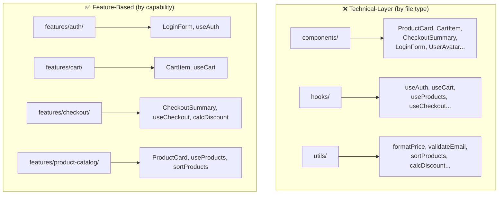
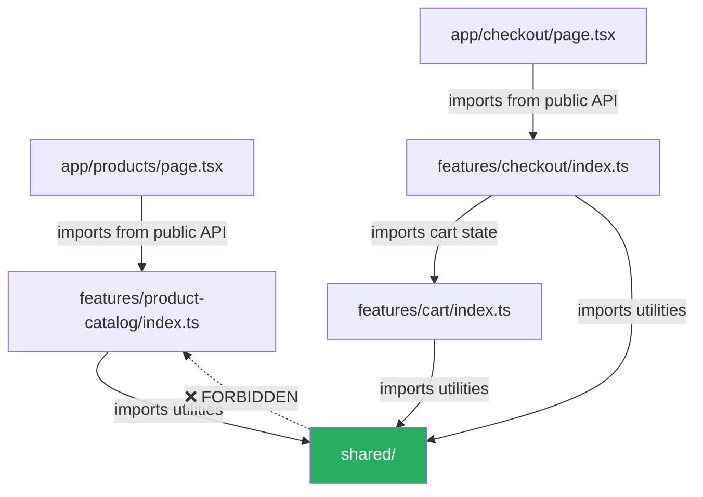

# 96 · Feature-Based Architecture

> **Feature-based architecture is a codebase organization strategy that groups code by product capability (what the code does for the user) rather than by technical layer (what kind of code it is). Instead of `components/`, `hooks/`, `utils/`, `types/` folders at the root containing everything, you have `features/checkout/`, `features/product-catalog/`, `features/user-profile/` — each containing its own components, hooks, utilities, and types. This organizing principle directly addresses the compounding complexity that emerges in mid-to-large React/Next.js applications: the cognitive overhead of understanding which utilities serve which features, the unexpected coupling between unrelated features through shared utility folders, and the difficulty of knowing what's safe to change or delete.**

The choice between technical-layer organization and feature-based organization is architectural — not just cosmetic — because it determines what's co-located (easy to find together) versus separated (hard to reason about together). In technical-layer organization, all the code for "checkout" is spread across five different top-level folders. In feature-based organization, all the code for "checkout" is in one place. As features grow, refactoring becomes local; as features are deleted, so is all their code with confidence.

---

## Table of Contents

- [Why File Organization Is Architectural](#why-file-organization-is-architectural)
- [The Technical-Layer Organization Problem](#the-technical-layer-organization-problem)
- [Feature-Based Organization: The Core Structure](#feature-based-organization-the-core-structure)
- [Defining Feature Boundaries](#defining-feature-boundaries)
- [The Internal Feature Structure](#the-internal-feature-structure)
- [Cross-Feature Dependencies and Shared Code](#cross-feature-dependencies-and-shared-code)
- [Feature-Based Architecture in Next.js App Router](#feature-based-architecture-in-nextjs-app-router)
- [The Index File Convention: Public API for Features](#the-index-file-convention-public-api-for-features)
- [Enforcing Boundaries with ESLint](#enforcing-boundaries-with-eslint)
- [Feature Flags and Feature-Based Architecture](#feature-flags-and-feature-based-architecture)
- [When to Split Features vs Keep Them Together](#when-to-split-features-vs-keep-them-together)
- [Architecture Diagrams](#architecture-diagrams)
- [Good Practices](#good-practices)
- [Bad Practices](#bad-practices)
- [Mental Model](#mental-model)
- [Common Misconceptions](#common-misconceptions)
- [Exercises](#exercises)
- [Further Reading](#further-reading)

---

## Why File Organization Is Architectural

```
FILE ORGANIZATION DETERMINES:
  1. COGNITIVE LOAD: how much code must you hold in mind to
     understand a feature? In technical-layer org: you must open
     5+ directories to understand one feature. In feature-based: one.

  2. CHANGE BLAST RADIUS: when you modify code, which other things
     might break? Technical-layer shared utilities affect every
     consumer — the set is invisible. Feature-based boundaries make
     coupling explicit and local changes genuinely local.

  3. DELETION CONFIDENCE: can you delete a feature without leaving
     orphans? Technical-layer: nearly impossible to know — utils
     might be shared. Feature-based: delete the feature folder, fix
     the import errors (they'll be explicit), done.

  4. TEAM OWNERSHIP: can a team own a vertical slice of the product?
     Feature-based makes team ownership natural — each feature folder
     is a discrete unit. Technical-layer ownership is inherently
     cross-cutting ("who owns the hooks/ folder?").

  5. ONBOARDING SPEED: can a new engineer find all code relevant to
     a task? Feature-based: yes, look in `features/checkout/`.
     Technical-layer: "check components/, hooks/, api/, utils/, types/,
     and probably some of lib/."
```

---

## The Technical-Layer Organization Problem

The classic "layer-based" structure that's the default in most tutorials:

```
❌ Technical-layer organization (the problem):
  src/
    components/
      Button.tsx
      Modal.tsx
      ProductCard.tsx      ← relates to product catalog
      CheckoutSummary.tsx  ← relates to checkout
      CartItem.tsx         ← relates to cart
      UserAvatar.tsx       ← relates to user profile
      ReviewStars.tsx      ← relates to product catalog
      OrderHistoryItem.tsx ← relates to order history
      ... (50+ components, all mixed together)
    hooks/
      useAuth.ts           ← relates to auth
      useCart.ts           ← relates to cart
      useProducts.ts       ← relates to product catalog
      useCheckout.ts       ← relates to checkout
      useReviews.ts        ← relates to product catalog
      ... (40+ hooks, all mixed together)
    utils/
      formatPrice.ts       ← used by product catalog AND checkout AND cart
      validateEmail.ts     ← used by auth AND checkout
      sortProducts.ts      ← relates to product catalog only
      calculateDiscount.ts ← relates to checkout only, but nobody knows
      ... (mixed utility ownership)
    api/
      products.ts
      cart.ts
      checkout.ts
      ... (all API calls mixed)

PROBLEMS THAT EMERGE:
  - "Which components are used by checkout?" — requires grepping
    all of components/ for imports to checkout-related things
  - "Can I safely delete CartItem.tsx?" — requires global search to
    find all consumers; it might be imported from 10 places or 0
  - "Who's responsible for utils/calculateDiscount.ts?" — unknown;
    it has no clear owner, so nobody updates it when logic changes
  - Adding a new "returns" feature: WHERE do the components go? What
    existing utilities are reusable? The folder names give no guidance.
```

---

## Feature-Based Organization: The Core Structure

```
✅ Feature-based organization:
  src/
    features/
      auth/               ← everything authentication-related
        components/
          LoginForm.tsx
          ForgotPasswordModal.tsx
        hooks/
          useAuth.ts
          useSession.ts
        api/
          auth-api.ts
        types.ts
        index.ts          ← public API: what other features can import

      product-catalog/    ← everything product browsing-related
        components/
          ProductCard.tsx
          ReviewStars.tsx
          ProductGrid.tsx
        hooks/
          useProducts.ts
          useReviews.ts
        api/
          products-api.ts
        utils/
          sortProducts.ts  ← only used within this feature
        types.ts
        index.ts

      cart/               ← everything shopping cart-related
        components/
          CartItem.tsx
          CartSummary.tsx
        hooks/
          useCart.ts
        api/
          cart-api.ts
        types.ts
        index.ts

      checkout/           ← everything checkout flow-related
        components/
          CheckoutSummary.tsx
          PaymentForm.tsx
        hooks/
          useCheckout.ts
        api/
          checkout-api.ts
        utils/
          calculateDiscount.ts  ← owned by checkout, clearly
        types.ts
        index.ts

    shared/              ← genuinely cross-feature utilities
      components/
        Button.tsx        ← used by auth, cart, checkout, catalog
        Modal.tsx
        Spinner.tsx
      hooks/
        useLocalStorage.ts
        useDebounce.ts
      utils/
        formatPrice.ts    ← used by cart AND product-catalog AND checkout
        validateEmail.ts  ← used by auth AND checkout
      types/
        common.ts

    app/                 ← Next.js App Router pages (thin, import from features)
      (auth)/
        login/page.tsx
      products/
        page.tsx
        [id]/page.tsx
      cart/page.tsx
      checkout/page.tsx
```

---

## Defining Feature Boundaries

The hardest part of feature-based architecture: deciding what constitutes a "feature" versus what belongs in `shared/`:

```
A FEATURE is a bounded capability the user experiences directly:
  "Browse products" → product-catalog feature
  "Add to cart / view cart" → cart feature
  "Complete purchase" → checkout feature
  "Manage account settings" → user-settings feature
  "View order history" → order-history feature

GOOD SIGNALS THAT SOMETHING IS A FEATURE:
  ✅ It maps to a URL or a section of the navigation
  ✅ A product manager can describe it as a discrete user capability
  ✅ It could theoretically be shipped independently or turned off
  ✅ It has its own data model (specific entities it reads/writes)

GOOD SIGNALS THAT SOMETHING BELONGS IN SHARED/:
  ✅ It's used by 3+ unrelated features
  ✅ It's a pure technical utility (formatting, validation, generic UI)
  ✅ It has no domain knowledge (Button, Modal, formatDate know nothing
     about products, orders, or users)
  ✅ It would make sense in a completely different project

THE GRAY AREA (start in the feature, move to shared when needed):
  When in doubt: start code in the feature that needs it first.
  If a SECOND, UNRELATED feature needs it, consider moving to shared/.
  Don't premature-generalize — wait for the second consumer.
```

---

## The Internal Feature Structure

Features don't need to be flat — they can have their own sub-structure that mirrors the feature's own complexity:

```
features/checkout/
  components/
    CheckoutHeader.tsx
    steps/                     ← complex features can have sub-directories
      ShippingStep.tsx
      PaymentStep.tsx
      ReviewStep.tsx
      ConfirmationStep.tsx
    summary/
      OrderSummary.tsx
      LineItem.tsx
      PricingBreakdown.tsx
  hooks/
    useCheckoutFlow.ts         ← orchestrates the checkout state machine
    useShippingValidation.ts
    usePaymentProcessor.ts
  api/
    checkout-api.ts            ← HTTP calls to the checkout microservice
    payment-api.ts             ← HTTP calls to the payment processor
  store/
    checkout-store.ts          ← Zustand store for checkout wizard state
  utils/
    calculate-totals.ts
    validate-shipping-address.ts
  types.ts                     ← all TypeScript types for this feature
  constants.ts                 ← checkout-specific constants
  index.ts                     ← the feature's public API
```

```
NESTING DEPTH GUIDELINE:
  Stay SHALLOW — usually 2 levels max within a feature.
  Don't create `features/checkout/components/steps/forms/inputs/` —
  that's the technical-layer problem inside a feature.
  If a feature becomes deeply nested, that's a signal it might need
  to be SPLIT into multiple features (checkout-shipping, checkout-payment).
```

---

## Cross-Feature Dependencies and Shared Code

```
DEPENDENCY RULES (a simplified version of "clean architecture"):

  ✅ ALLOWED: feature → shared/
     Product-catalog importing Button from shared/components: fine.

  ✅ ALLOWED: feature → feature (via index.ts only, with care)
     Checkout importing useCart from cart/index.ts: allowed (checkout
     genuinely needs to know what's in the cart).
     But if MANY features import from MANY other features: the feature
     boundaries are becoming meaningless — consider moving shared state
     up to shared/ or a higher-level coordination layer.

  ❌ AVOID: feature → feature internals
     Checkout importing from cart/components/CartItem.tsx (internal):
     this creates tight coupling to implementation details.
     If you need something from another feature, it should be EXPORTED
     from that feature's index.ts (making it deliberately a public API).

  ❌ AVOID: shared/ → feature
     The shared/ utilities should NOT import from specific features —
     that creates a circular dependency (features depend on shared,
     which then depends on features — which then depends on shared...).
     If shared/ needs feature-specific logic, that logic is not truly
     "shared" — it belongs in the feature.

VISUALIZING THE DEPENDENCY DIRECTION:
  features/* → shared/       ✅ (one way)
  features/A → features/B    ⚠️  (sparingly, via index.ts only)
  shared/ → features/*       ❌ (circular, forbidden)
```

---

## Feature-Based Architecture in Next.js App Router

The App Router's file-system routing creates a natural tension with feature-based architecture: pages must be at specific paths in `app/`, but feature code should live in `features/`:

```
RECOMMENDED APPROACH: thin app/ pages, rich features/

src/
  app/
    products/
      page.tsx           ← THIN: imports from features/product-catalog
      [id]/
        page.tsx         ← THIN: imports from features/product-catalog
    cart/
      page.tsx           ← THIN: imports from features/cart
    checkout/
      page.tsx           ← THIN: imports from features/checkout

  features/
    product-catalog/     ← ALL the actual product logic
    cart/                ← ALL the actual cart logic
    checkout/            ← ALL the actual checkout logic
```

```tsx
// app/products/page.tsx — THE THIN PAGE (just wires the feature to the route)
import { ProductCatalogPage } from "@/features/product-catalog";

export default function Page({ searchParams }: { searchParams: SearchParams }) {
  return <ProductCatalogPage searchParams={searchParams} />;
}

// features/product-catalog/index.ts — the feature's real entry point
export { ProductCatalogPage } from "./components/ProductCatalogPage";
export { useProducts } from "./hooks/useProducts";
export type { Product, ProductFilter } from "./types";
```

```
THE THIN PAGE PATTERN:
  app/*/page.tsx files contain:
  - import statements (from the relevant feature)
  - Next.js metadata exports (export const metadata)
  - Any necessary generateStaticParams/generateMetadata functions
  - The default export that delegates to the feature component

  They do NOT contain:
  - Component implementation
  - Data fetching logic
  - Business logic
  - State management

  WHY: app/ files are Next.js routing artifacts. features/ files are
  product code. Keeping them separate means the routing layer can be
  changed (different URL structure) without touching the feature code,
  and the feature can be developed/tested independently of its routing.
```

---

## The Index File Convention: Public API for Features

Each feature's `index.ts` is its CONTRACT with the rest of the application:

```typescript
// features/product-catalog/index.ts
// This is the ONLY file other features/pages should import from.
// Everything listed here is a deliberate, maintained public API.
// Everything NOT listed here is a private implementation detail.

// Public components (safe for external use):
export { ProductCard } from "./components/ProductCard";
export { ProductGrid } from "./components/ProductGrid";
export { ProductCatalogPage } from "./components/ProductCatalogPage";

// Public hooks (safe for external use):
export { useProducts } from "./hooks/useProducts";

// Public types (shared across features):
export type { Product, ProductFilter, ProductSortOrder } from "./types";

// NOT exported (private implementation details):
// - ProductCard's internal sub-components
// - internal utility functions
// - Internal API functions (these go through the hooks, not directly)
// - Internal store state shapes
```

```
BENEFITS OF THE INDEX.TS CONVENTION:
  1. DISCOVERABILITY: "what can I use from the cart feature?" → look at cart/index.ts
  2. BREAKAGE PREVENTION: internal refactors don't break external consumers
     (as long as the public API in index.ts stays the same)
  3. EXPLICIT CONTRACTS: the index.ts IS documentation of the feature's
     public API — intentional and maintained
  4. LINT-ENFORCEABILITY: tools like eslint-plugin-import can enforce
     "never import from features/*/internal paths, only from features/*/index"
```

---

## Enforcing Boundaries with ESLint

```js
// .eslintrc.js — enforcing feature boundary rules
module.exports = {
  rules: {
    // Prevent importing across feature boundaries except via index.ts:
    "no-restricted-imports": [
      "error",
      {
        patterns: [
          {
            // Block: import anything from a feature's non-index file
            // from outside that feature
            // Pattern: importing from features/X/anything except features/X/index
            group: ["**/features/*/*/**"],
            message:
              'Import from the feature\'s index.ts, not internal files. e.g., "@/features/cart" not "@/features/cart/components/CartItem"',
          },
        ],
      },
    ],
  },
};

// OR using eslint-plugin-boundaries (more powerful, purpose-built):
module.exports = {
  plugins: ["boundaries"],
  settings: {
    "boundaries/elements": [
      { type: "feature", pattern: "src/features/*" },
      { type: "shared", pattern: "src/shared/*" },
      { type: "app", pattern: "src/app/*" },
    ],
  },
  rules: {
    "boundaries/element-types": [
      "error",
      {
        default: "disallow",
        rules: [
          { from: "feature", allow: ["shared", "feature"] },
          { from: "app", allow: ["feature", "shared"] },
          { from: "shared", allow: ["shared"] }, // shared can't depend on features
        ],
      },
    ],
  },
};
```

---

## Feature Flags and Feature-Based Architecture

Feature-based organization naturally enables feature-flag-driven development:

```tsx
// features/new-checkout/index.ts — a NEW checkout feature under development
export { NewCheckoutFlow } from "./components/NewCheckoutFlow";

// features/checkout/index.ts — the EXISTING, stable checkout
export { CheckoutFlow } from "./components/CheckoutFlow";

// app/checkout/page.tsx — flags which feature to show
import { CheckoutFlow } from "@/features/checkout";
import { NewCheckoutFlow } from "@/features/new-checkout";
import { getFeatureFlag } from "@/lib/flags";

export default async function CheckoutPage() {
  const useNewCheckout = await getFeatureFlag("new-checkout-flow");

  return useNewCheckout ? <NewCheckoutFlow /> : <CheckoutFlow />;
}

// BENEFITS OF THIS PATTERN:
// - Old and new checkout are completely isolated (different feature folders)
// - Teams can develop new-checkout independently without affecting old-checkout
// - Rolling back: just toggle the flag (or delete the new-checkout feature)
// - A/B testing: show new-checkout to 10% of users, compare metrics
// - Clean deletion when new-checkout is fully adopted: delete old checkout folder
```

---

## When to Split Features vs Keep Them Together

```
SPLIT a feature into smaller features when:
  ✅ The feature has grown to 20+ components or 15+ hooks
  ✅ Multiple teams are working on different parts of the same feature
  ✅ The feature has two distinct user personas (an "admin checkout"
     and a "customer checkout" might be separate features)
  ✅ Parts of the feature can be independently deployed or A/B tested
  ✅ You find yourself saying "the cart has nothing to do with that
     part of the cart" — a signal of hidden sub-features

KEEP features together when:
  ✅ They share significant state and logic (splitting would require
     lots of cross-feature coordination)
  ✅ One feature is meaningless without the other (cart items without
     the cart container)
  ✅ The team responsible is the same and the feature is coherent

A PRACTICAL RULE:
  Start with fewer, larger features. Split when you feel the pain
  (navigation is hard, ownership is unclear, conflicting changes).
  Don't design a perfect feature taxonomy upfront — it will be wrong
  and expensive to change. The architecture should serve today's
  complexity, with paths to grow as complexity demands.
```

---

## Architecture Diagrams

### Technical-layer vs feature-based organization



### Dependency graph with correct flow



---

## Good Practices

### ✅ Good Practice — A well-defined feature with clear public API

```
features/
  order-history/
    components/
      OrderHistoryPage.tsx    ← the main page component
      OrderCard.tsx           ← individual order display
      OrderStatusBadge.tsx    ← reused within this feature
      OrderTimeline.tsx       ← reused within this feature
    hooks/
      useOrderHistory.ts      ← fetching and filtering orders
      useOrderDetails.ts      ← single order detail data
    api/
      orders-api.ts           ← all HTTP calls for this feature
    utils/
      format-order-status.ts  ← converts internal statuses to display text
    types.ts                  ← Order, OrderItem, OrderStatus types
    index.ts                  ← public API: what others can import
```

```typescript
// features/order-history/index.ts
// Deliberate, minimal public API:
export { OrderHistoryPage } from "./components/OrderHistoryPage";
export { useOrderHistory } from "./hooks/useOrderHistory";
export type { Order, OrderStatus } from "./types";
// OrderCard, OrderStatusBadge, OrderTimeline: NOT exported (internal)
// orders-api.ts: NOT exported (use the hook, not the API directly)
```

---

## Bad Practices

### ⚠️ Bad Practice — Importing feature internals across boundaries

```tsx
/**
 * Bad: The checkout feature directly imports from cart's internal
 * components folder — bypassing the public API boundary and creating
 * invisible coupling to an implementation detail that might change.
 */

// features/checkout/components/CheckoutSummary.tsx
// ❌ Importing from cart's INTERNAL component, not cart's index.ts
import { CartItem } from "@/features/cart/components/CartItem";
import { CartItemList } from "@/features/cart/components/CartItemList";
// If CartItem is renamed, refactored, or moved within cart:
// → checkout breaks, even though checkout's consumers saw no change
// → The cart team can't safely refactor their own internals

/**
 * ✅ Fix: use cart's public API (index.ts) only
 */
// features/cart/index.ts — cart DECIDES what to expose:
export { CartItemList } from "./components/CartItemList"; // ← made public
export type { CartItem } from "./types"; // ← type exported if needed

// features/checkout/components/CheckoutSummary.tsx
import { CartItemList } from "@/features/cart"; // ✅ via public API only
import type { CartItem } from "@/features/cart"; // ✅ type via public API
// Now: cart can rename/refactor CartItem's internals freely —
// as long as the CartItemList component's interface (props) stays stable,
// checkout remains unaffected.
```

**Production impact:** A team's `features/payments/` had 43 direct imports from `features/checkout/`'s internal files — bypassing the checkout feature's index.ts entirely. When the checkout team refactored their internal step-based component structure (renaming files and splitting components), payments broke in 43 places, requiring a cross-team fire drill to identify and fix every broken import. The root cause: no established boundary convention. After introducing ESLint rules enforcing index.ts-only imports, the next two checkout refactors were invisible to the payments team.

---

## Mental Model

> 💡 **The feature-based architecture mental model:**
>
> Think of features as **stores in a shopping mall**. Each store has a clear entrance (the `index.ts`), and customers (other features, pages) go through that entrance to use the store's offerings. A customer doesn't walk through the stock room (internal components) or access the employee-only storage area (internal utilities) — they interact only with the curated product display (the public API). The mall management (ESLint boundary rules) physically prevents unauthorized access to back rooms. The `shared/` directory is the mall's common areas — restrooms, food court, the parking structure — infrastructure that any store's customers can use, but which doesn't belong to any one store. A new store opening in the mall (a new feature) knows exactly what other stores offer (their index.ts files) and what common areas are available (shared/), without needing to know how any other store's stockroom is organized.

---

## Common Misconceptions

### "Feature-based organization means no shared code"

Feature-based organization has a `shared/` directory for genuinely cross-cutting concerns. The key principle is that shared code is DELIBERATELY elevated to shared — you don't dump everything there by default. Code starts in the feature, and ONLY moves to shared when a SECOND unrelated feature genuinely needs it (the "rule of three": used in three features → probably should be shared).

### "Every component must be in a feature"

UI primitives (Button, Input, Modal, Table) that have NO domain knowledge and work across any context live in `shared/components/` — not in any specific feature. Feature components are those that know about the domain (ProductCard knows about products; CartItem knows about cart items).

### "Feature-based and layer-based are mutually exclusive"

Features themselves can have internal layer structure (`components/`, `hooks/`, `api/` WITHIN a feature folder) — the distinction is at the TOP LEVEL of organization. You get domain locality (features) combined with technical clarity (sub-folders by file type within each feature). This is not an either/or choice.

### "Feature boundaries map exactly to pages/routes"

Features and pages are related but distinct. A single feature might span multiple pages (checkout has shipping, payment, review, confirmation pages). A single page might draw from multiple features (a dashboard page might use widgets from order-history, analytics, and notifications features). The feature is about PRODUCT CAPABILITY, the page is about URL structure.

### "You need to implement feature-based architecture from day one"

For a small project with 1-2 developers and 10 components: the overhead isn't worth it. Start with feature-based architecture when you have 3+ developers OR 3+ distinct product areas OR feel genuine confusion about "where does this code go?" The architecture should emerge from actual friction, not be imposed preemptively.

---

## Exercises

### Exercise 1 — Audit an existing codebase for feature organization

Take any technical-layer organized React codebase. For each file in `components/` and `hooks/`:

1. Label which product feature it belongs to
2. Find examples of files that SHOULD be in the same feature but are currently isolated in the layer folders
3. Design what the feature-based structure would look like and document the proposed `features/` directory

### Exercise 2 — Define feature boundaries for an e-commerce app

Given these user capabilities, define feature boundaries (group into features), identify what belongs in `shared/`, and write the `index.ts` public API for the checkout feature:

- Browse product catalog (search, filter, sort)
- View product details + reviews
- Add to cart, update quantity, remove
- Apply discount codes
- Complete checkout (shipping, payment, confirmation)
- View order history + individual order detail
- Manage account (profile, addresses, payment methods)

### Exercise 3 — Implement ESLint boundary enforcement

Set up `eslint-plugin-boundaries` (or `no-restricted-imports`) in a project to:

1. Forbid importing from feature internals (must use index.ts)
2. Forbid `shared/` from importing anything from `features/`
3. Verify with an intentionally violating import that the lint error fires

---

## Further Reading

- [Bulletproof React](https://github.com/alan2207/bulletproof-react) — a comprehensive, well-maintained example of feature-based architecture in React
- [Feature Sliced Design](https://feature-sliced.design/) — a methodology and community around frontend architectural standards (extends feature-based with strict layer rules)
- [eslint-plugin-boundaries](https://github.com/jaimeespoz/eslint-plugin-boundaries) — the ESLint plugin for enforcing architectural boundaries
- [Khalil Stemmler: Feature-based architecture](https://khalilstemmler.com/articles/software-design-architecture/feature-based-architecture/) — deep dive with examples
- Related in this handbook: [97 · Atomic Design](./02-atomic-design.md), [98 · Monorepo Architecture](./03-monorepo.md)
- Next in this handbook: [97 · Atomic Design](./02-atomic-design.md)

---

_Part of the [React + Next.js Engineering Handbook](../../README.md)_
