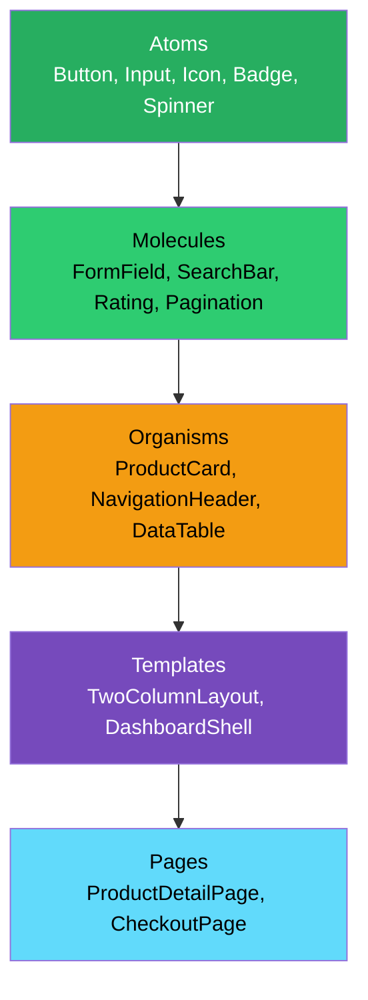
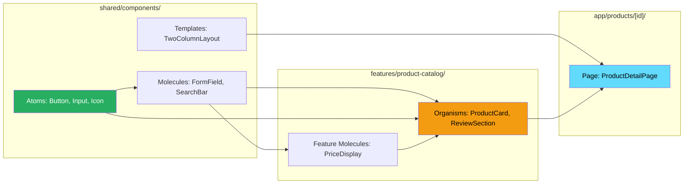

# 97 · Atomic Design

> **Atomic Design is a methodology for creating design systems and component hierarchies, introduced by Brad Frost, that categorizes UI components into five levels — atoms, molecules, organisms, templates, and pages — by their complexity and composition. Applied to React, it provides a principled vocabulary for the question every frontend engineer faces repeatedly: "should this be one component or two? Should I extract this into a shared component or keep it local?" Understanding Atomic Design at the architectural level — not just as a naming convention — reveals a systematic approach to component decomposition that scales from design tokens to full page layouts.**

Most component organization guidance amounts to "use your judgment." Atomic Design provides a STRUCTURED framework for that judgment: a set of criteria (how many other components does it contain? how domain-specific is it?) that determines a component's level and therefore its appropriate location in the codebase. This structure is most valuable at scale — when a team has hundreds of components and must consistently decide where new ones go.

---

## Table of Contents

- [The Five Levels of Atomic Design](#the-five-levels-of-atomic-design)
- [Atoms: The Indivisible UI Primitives](#atoms-the-indivisible-ui-primitives)
- [Molecules: Functional Groups of Atoms](#molecules-functional-groups-of-atoms)
- [Organisms: Complex, Self-Contained UI Sections](#organisms-complex-self-contained-ui-sections)
- [Templates: Page-Level Structure Without Content](#templates-page-level-structure-without-content)
- [Pages: Templates With Real Content](#pages-templates-with-real-content)
- [Atomic Design and Feature-Based Architecture](#atomic-design-and-feature-based-architecture)
- [The Practical Mapping to a React Codebase](#the-practical-mapping-to-a-react-codebase)
- [Where the Methodology Gets Difficult](#where-the-methodology-gets-difficult)
- [Storybook as the Atomic Design Workbench](#storybook-as-the-atomic-design-workbench)
- [Atomic Design and Design Tokens](#atomic-design-and-design-tokens)
- [A Simplified Two-Level Alternative](#a-simplified-two-level-alternative)
- [Architecture Diagrams](#architecture-diagrams)
- [Good Practices](#good-practices)
- [Bad Practices](#bad-practices)
- [Mental Model](#mental-model)
- [Common Misconceptions](#common-misconceptions)
- [Exercises](#exercises)
- [Further Reading](#further-reading)

---

## The Five Levels of Atomic Design

```
ATOMS
  The smallest possible UI building blocks.
  Cannot be meaningfully broken down further without losing function.
  Examples: Button, Input, Label, Icon, Badge, Checkbox, Radio, Spinner

MOLECULES
  Simple groups of 2-4 atoms working together as a functional unit.
  The whole has a distinct purpose that the individual atoms don't have alone.
  Examples: SearchBar (Input + Button + Icon), FormField (Label + Input + Error),
            Checkbox Group (Checkbox + Label), Rating (Icon × N + Label)

ORGANISMS
  Relatively complex components composed of molecules and/or atoms.
  A distinct section of the UI — meaningful in the context of the page.
  Domain-aware (knows about products, users, orders).
  Examples: ProductCard, NavigationHeader, CheckoutForm, ReviewSection,
            DataTable, CommentThread

TEMPLATES
  Page-level structures that define layout and content areas.
  No real content — placeholder-level: shows WHERE things go.
  No domain knowledge — just spatial arrangement.
  Examples: TwoColumnLayout, DashboardShell, ArticleLayout, AuthPageWrapper

PAGES
  Specific instances of templates with REAL content.
  Where templates become concrete with actual data.
  In Next.js: your app/*/page.tsx files.
  Examples: HomePage, ProductDetailPage, CheckoutPage, BlogPostPage
```

---

## Atoms: The Indivisible UI Primitives

```tsx
// Atoms: pure, domain-free, maximally reusable
// They only know about themselves — not about products, users, or business logic

// Button atom — knows about variants, sizes, states — knows NOTHING about business
function Button({
  children,
  variant = "primary",
  size = "md",
  disabled = false,
  isLoading = false,
  onClick,
}: ButtonProps) {
  return (
    <button
      className={cn("button", `button--${variant}`, `button--${size}`, {
        "button--disabled": disabled,
        "button--loading": isLoading,
      })}
      disabled={disabled || isLoading}
      onClick={onClick}
    >
      {isLoading && <Spinner size="sm" />}
      {children}
    </button>
  );
}

// Input atom — handles all input states, no domain knowledge
function Input({
  type = "text",
  placeholder,
  value,
  onChange,
  error,
  disabled,
}: InputProps) {
  return (
    <input
      type={type}
      className={cn("input", { "input--error": !!error })}
      placeholder={placeholder}
      value={value}
      onChange={onChange}
      disabled={disabled}
    />
  );
}
```

```
ATOM CHARACTERISTICS:
  ✅ Can be used in ANY context without modification
  ✅ Styling is fully controlled by props (variant, size, state)
  ✅ No imports from feature folders (domain-agnostic)
  ✅ Works standalone — doesn't need other atoms to be meaningful
  ✅ Design token consumers — they use your color, spacing, type tokens directly

ANTI-ATOM SIGNS:
  ❌ Knows about products, users, or orders (that's an organism)
  ❌ Contains business logic (validation rules, API calls)
  ❌ Makes assumptions about where it will be used
  ❌ Contains another complex component (that's a molecule or organism)
```

---

## Molecules: Functional Groups of Atoms

```tsx
// SearchBar molecule: Input + Button + optional Icon → a functional search unit
function SearchBar({
  value,
  onChange,
  onSubmit,
  placeholder = "Search...",
  isLoading = false,
}: SearchBarProps) {
  return (
    <form onSubmit={onSubmit} className="search-bar">
      <Icon name="search" className="search-bar__icon" />
      <Input
        value={value}
        onChange={(e) => onChange(e.target.value)}
        placeholder={placeholder}
        className="search-bar__input"
      />
      <Button type="submit" variant="primary" isLoading={isLoading}>
        Search
      </Button>
    </form>
  );
}
// SearchBar is still domain-agnostic — it doesn't know WHAT you're
// searching for. You could search products, users, articles, or anything.

// FormField molecule: Label + Input + ErrorMessage → one complete form field unit
function FormField({ label, error, required, children }: FormFieldProps) {
  return (
    <div className="form-field">
      <Label required={required}>{label}</Label>
      {children} {/* the actual Input, Select, Textarea atom goes here */}
      {error && <ErrorMessage>{error}</ErrorMessage>}
    </div>
  );
}
```

```
MOLECULE CHARACTERISTICS:
  ✅ Combines 2-4 atoms into a reusable functional unit
  ✅ The combination has a purpose its atoms alone don't have
     (Label + Input = a form field; Label alone isn't a form field)
  ✅ Still relatively domain-agnostic (FormField works for ANY form field)
  ✅ Usually has a clear single responsibility
  ✅ Small enough to be understood in isolation

MOLECULE VS ORGANISM:
  The boundary can be blurry, but the key question is:
  "Does this component know WHAT it's for in a business context?"
  SearchBar: doesn't know what's being searched → molecule
  ProductSearchBar: knows it searches the product catalog → organism
```

---

## Organisms: Complex, Self-Contained UI Sections

```tsx
// Organisms are where domain knowledge ENTERS the component hierarchy

// ProductCard organism — knows about products specifically
function ProductCard({
  product,
  onAddToCart,
  onWishlist,
}: {
  product: Product;
  onAddToCart: (id: string) => void;
  onWishlist: (id: string) => void;
}) {
  return (
    <div className="product-card">
      <Image
        src={product.images[0].url}
        alt={product.images[0].alt}
        width={300}
        height={300}
      />
      <div className="product-card__body">
        <h3 className="product-card__name">{product.name}</h3>
        <PriceDisplay price={product.price} salePrice={product.salePrice} />
        <Rating value={product.averageRating} count={product.reviewCount} />
        <div className="product-card__actions">
          <Button onClick={() => onAddToCart(product.id)}>Add to Cart</Button>
          <IconButton
            icon="heart"
            onClick={() => onWishlist(product.id)}
            aria-label="Add to wishlist"
          />
        </div>
      </div>
    </div>
  );
}
// ProductCard uses atoms (Button, Image, IconButton) and molecules
// (PriceDisplay with currency formatting, Rating with stars) but
// its purpose is DOMAIN-SPECIFIC: displaying a product for sale.
```

```
ORGANISM CHARACTERISTICS:
  ✅ Composed of molecules and atoms
  ✅ Domain-aware: knows about specific business entities (Product, Order, User)
  ✅ Represents a distinct, self-contained section of the interface
  ✅ Could appear in multiple pages (ProductCard in the listing, search, related)
  ✅ Has meaningful standalone testability ("does this product card render correctly?")

ORGANISM ANTI-PATTERNS:
  ❌ Fetching its own data without being explicitly designed as a data-fetching organism
     (fetching in organisms tightly couples rendering to data source; prefer
     passing data via props and handling fetching at a higher level, OR
     deliberately designate it as a data-fetching organism with clear conventions)
  ❌ So complex it needs its own organisms — that's a template or needs splitting
```

---

## Templates: Page-Level Structure Without Content

```tsx
// Template: structural scaffolding for a page, no real content
function TwoColumnLayout({
  sidebar,
  main,
  sidebarPosition = "left",
}: {
  sidebar: React.ReactNode;
  main: React.ReactNode;
  sidebarPosition?: "left" | "right";
}) {
  return (
    <div
      className={cn(
        "two-column-layout",
        `two-column-layout--sidebar-${sidebarPosition}`,
      )}
    >
      <aside className="two-column-layout__sidebar">{sidebar}</aside>
      <main className="two-column-layout__main">{main}</main>
    </div>
  );
}

// ArticleLayout template
function ArticleLayout({
  header,
  body,
  sidebar,
  footer,
}: {
  header: React.ReactNode;
  body: React.ReactNode;
  sidebar?: React.ReactNode;
  footer?: React.ReactNode;
}) {
  return (
    <div className="article-layout">
      <header className="article-layout__header">{header}</header>
      <div className="article-layout__content">
        <article className="article-layout__body">{body}</article>
        {sidebar && (
          <aside className="article-layout__sidebar">{sidebar}</aside>
        )}
      </div>
      {footer && <footer className="article-layout__footer">{footer}</footer>}
    </div>
  );
}
```

```
TEMPLATE CHARACTERISTICS:
  ✅ Defines spatial layout — WHERE content goes, not WHAT it is
  ✅ Uses placeholder/slot pattern (accepts React.ReactNode children, not typed domain data)
  ✅ No domain knowledge — works for any content type
  ✅ In Storybook: shown with placeholder content like "Main content here"
  ✅ The SKELETON that pages flesh out with real organisms and molecules

TEMPLATES VS ORGANISMS:
  Organism: knows what content it contains (ProductCard contains a Product)
  Template: defines where content CAN BE, but doesn't know what it will be
```

---

## Pages: Templates With Real Content

```tsx
// Page (Next.js App Router): combines template + organisms + real data
// In Next.js, pages ARE the app/*/page.tsx files

// app/products/[id]/page.tsx — this IS the Page level of Atomic Design
async function ProductDetailPage({ params }: { params: { id: string } }) {
  const product = await getProduct(params.id);
  const relatedProducts = await getRelatedProducts(params.id);

  return (
    // Using the TwoColumnLayout template:
    <TwoColumnLayout
      main={
        <>
          {/* Organisms filling the template slots: */}
          <ProductHero product={product} />
          <ProductDescription product={product} />
          <ReviewSection productId={product.id} />
        </>
      }
      sidebar={
        <>
          <ProductPurchasePanel product={product} />
          <RelatedProducts products={relatedProducts} />
        </>
      }
    />
  );
}
```

---

## Atomic Design and Feature-Based Architecture

Atomic Design and feature-based architecture (doc 96) are COMPLEMENTARY, not competing:

```
INTEGRATION STRATEGY:

shared/
  components/
    atoms/           ← pure, domain-free UI primitives
      Button.tsx
      Input.tsx
      Icon.tsx
    molecules/       ← functional groups, still domain-free
      FormField.tsx
      SearchBar.tsx
      Modal.tsx
    templates/       ← page-level layout scaffolding
      TwoColumnLayout.tsx
      DashboardShell.tsx

features/
  product-catalog/
    components/
      organisms/     ← domain-aware, specific to this feature
        ProductCard.tsx
        ProductGrid.tsx
        ReviewSection.tsx
      molecules/     ← domain-specific molecules WITHIN the feature
        PriceDisplay.tsx   ← knows about pricing (not fully generic)
        StockIndicator.tsx ← knows about inventory

  checkout/
    components/
      organisms/
        PaymentForm.tsx
        OrderSummary.tsx
```

```
THE RULE OF THUMB:
  Atoms: always in shared/ (they're the most generic)
  Molecules: usually in shared/ if truly generic; in features/ if domain-specific
  Organisms: always in features/ (they're the most domain-specific)
  Templates: in shared/ if reused across features; in features/ if one-feature-only
  Pages: in app/ (Next.js routing requirement)
```

---

## The Practical Mapping to a React Codebase

```
ORGANIZING BY ATOMIC LEVEL (a common approach):

src/
  components/
    atoms/
      Button/
        Button.tsx
        Button.stories.tsx
        Button.test.tsx
        index.ts
      Input/
      Icon/
      Badge/
    molecules/
      FormField/
      SearchBar/
      Pagination/
      Modal/
    organisms/
      // For smaller projects; in larger ones, organisms live in features/
      ProductCard/
      NavigationHeader/
      DataTable/
    templates/
      DashboardLayout/
      AuthLayout/
      MarketingPageLayout/

ORGANIZING BY FEATURE WITH ATOMIC-INFORMED NAMING:
// (better for large projects — see doc 96)
src/
  shared/components/     ← atoms + generic molecules + templates
  features/
    product-catalog/
      components/        ← organisms specific to this feature
```

---

## Where the Methodology Gets Difficult

```
REAL CHALLENGES WITH ATOMIC DESIGN IN PRACTICE:

1. THE BOUNDARY AMBIGUITY PROBLEM:
   Is NavigationHeader an organism or a template? It's complex (organism-sized)
   but accepts page-agnostic content slots (template-like). Many components
   sit at ambiguous boundaries — the methodology provides guidance but
   not precise rules.
   Pragmatic fix: agree on team conventions for boundary cases; the
   goal is consistency, not philosophical purity.

2. THE ORGANISM FETCHING DILEMMA:
   Should ProductCard fetch its own data (more autonomous, less prop-drilling)
   or receive data via props (more predictable, more testable)?
   Atomic Design doesn't prescribe this — but the answer matters
   architecturally. Common decision: organisms receive data via props
   and are tested with mocked data; data-fetching happens in parent
   containers (often Next.js Server Components) that are separate from
   the "display" organism.

3. THE MOLECULE CREEP PROBLEM:
   Teams tend to under-invest in molecules — going directly from atoms
   to organisms. A form with 10 form fields is "one organism" (CheckoutForm)
   but it probably should be: FormField molecule (used 10 times within
   the organism). Skipping the molecule level leads to non-reusable,
   complex organisms.

4. THE STORYBOOK MAINTENANCE BURDEN:
   Atomic Design works best alongside Storybook (see below), but
   maintaining stories for every atom, molecule, organism, and template
   is significant overhead. Pragmatically: prioritize atoms and molecules
   (highest reuse, lowest context); organisms can have fewer stories.
```

---

## Storybook as the Atomic Design Workbench

```tsx
// Storybook stories map directly to Atomic Design levels:

// atoms/Button/Button.stories.tsx
import type { Meta, StoryObj } from "@storybook/react";
import { Button } from "./Button";

const meta: Meta<typeof Button> = {
  title: "Atoms/Button",
  component: Button,
  argTypes: {
    variant: { control: "select", options: ["primary", "secondary", "ghost"] },
    size: { control: "select", options: ["sm", "md", "lg"] },
    disabled: { control: "boolean" },
    isLoading: { control: "boolean" },
  },
};
export default meta;

export const Primary: StoryObj<typeof Button> = {
  args: { children: "Primary Button", variant: "primary" },
};
export const Secondary: StoryObj<typeof Button> = {
  args: { children: "Secondary Button", variant: "secondary" },
};
export const Loading: StoryObj<typeof Button> = {
  args: { children: "Loading...", isLoading: true },
};

// organisms/ProductCard/ProductCard.stories.tsx
import type { Meta, StoryObj } from "@storybook/react";
import { ProductCard } from "./ProductCard";
import { mockProduct } from "@/test/fixtures/product";

const meta: Meta<typeof ProductCard> = {
  title: "Organisms/ProductCard",
  component: ProductCard,
};
export default meta;

export const Default: StoryObj<typeof ProductCard> = {
  args: { product: mockProduct, onAddToCart: () => {}, onWishlist: () => {} },
};
export const OutOfStock: StoryObj<typeof ProductCard> = {
  args: {
    product: { ...mockProduct, inventoryCount: 0 },
    onAddToCart: () => {},
    onWishlist: () => {},
  },
};
```

```
STORYBOOK TITLE CONVENTIONS:
  'Atoms/Button'         → lives under Atoms/ in Storybook sidebar
  'Molecules/FormField'  → lives under Molecules/
  'Organisms/ProductCard'→ lives under Organisms/
  'Templates/DashboardShell' → lives under Templates/

This mirrors the design system hierarchy, making Storybook a VISUAL
CATALOG of the design system organized by atomic level — exactly
what designers and engineers need when asking "what components do we have?"
```

---

## Atomic Design and Design Tokens

```tsx
// Atoms are the primary CONSUMERS of design tokens:
// (Design Tokens covered fully in Part XX, doc 101)

// atoms/Button/Button.tsx
// The Button uses ONLY design tokens for styling, no hardcoded values:
function Button({ variant, size, children }: ButtonProps) {
  return (
    <button
      style={{
        // Uses design tokens (CSS custom properties):
        backgroundColor: `var(--color-button-${variant}-bg)`,
        color: `var(--color-button-${variant}-text)`,
        padding: `var(--spacing-button-${size}-y) var(--spacing-button-${size}-x)`,
        borderRadius: `var(--border-radius-button)`,
        fontSize: `var(--font-size-button-${size})`,
        fontWeight: `var(--font-weight-button)`,
      }}
    >
      {children}
    </button>
  );
}

// This pattern ensures:
// 1. Changing a design token changes ALL atoms that use it consistently
// 2. Atoms don't hardcode hex colors — they reference semantic tokens
// 3. Theming (dark mode, brand variations) works by changing token values,
//    not by modifying atom components
```

---

## A Simplified Two-Level Alternative

For teams that find five levels of Atomic Design too granular, a pragmatic two-level simplification works well:

```
SIMPLIFIED TWO-LEVEL MODEL:

PRIMITIVE (≈ Atoms + Molecules):
  Domain-free UI building blocks
  Location: shared/components/
  Examples: Button, Input, Modal, FormField, DataTable, Pagination

FEATURE COMPONENT (≈ Organisms + Templates, within features):
  Domain-aware, context-specific
  Location: features/*/components/
  Examples: ProductCard, CheckoutForm, DashboardHeader, OrderTable

This removes the need to debate "is this a molecule or an organism?"
and "is this an organism or a template?" — the only question is
"does this know about my domain or is it generic?"

WHEN TO USE THE SIMPLIFIED MODEL:
  ✅ Smaller teams (2-5 engineers)
  ✅ Simpler products without a dedicated design system
  ✅ Teams new to structured component organization
  ✅ Projects where Storybook/design system investment isn't planned

WHEN TO USE FULL ATOMIC DESIGN:
  ✅ Larger teams with a dedicated design system
  ✅ Multiple product surfaces sharing a component library
  ✅ Design and engineering working closely with shared vocabulary
  ✅ A component library published as an NPM package
```

---

## Architecture Diagrams

### The five levels with examples



### Atomic Design + Feature-Based integration



---

## Good Practices

### ✅ Good Practice — Disciplined molecule extraction from a complex organism

```tsx
/**
 * Good: Identifying a reusable molecule WITHIN an organism before
 * it's needed elsewhere — preventing the organism from becoming
 * a monolithic blob of unrelated concerns.
 */

// Without extraction: ProductCard mixing price display concerns inline
function ProductCard({ product }: { product: Product }) {
  return (
    <div className="product-card">
      <div className="product-card__price">
        {product.salePrice ? (
          <>
            <span className="price--sale">${product.salePrice}</span>
            <span className="price--original price--strikethrough">
              ${product.price}
            </span>
            <Badge variant="sale">
              -{Math.round((1 - product.salePrice / product.price) * 100)}% OFF
            </Badge>
          </>
        ) : (
          <span className="price--regular">${product.price}</span>
        )}
      </div>
    </div>
  );
}

// With extraction: PriceDisplay molecule (domain-aware but reusable within the feature)
function PriceDisplay({
  price,
  salePrice,
}: {
  price: number;
  salePrice?: number;
}) {
  const discountPercent = salePrice
    ? Math.round((1 - salePrice / price) * 100)
    : null;

  return (
    <div className="price-display">
      {salePrice ? (
        <>
          <span className="price-display__sale">${salePrice.toFixed(2)}</span>
          <span className="price-display__original">${price.toFixed(2)}</span>
          <Badge variant="sale">{discountPercent}% OFF</Badge>
        </>
      ) : (
        <span className="price-display__regular">${price.toFixed(2)}</span>
      )}
    </div>
  );
}

function ProductCard({ product }: { product: Product }) {
  return (
    <div className="product-card">
      <PriceDisplay price={product.price} salePrice={product.salePrice} />
      {/* ... rest of card */}
    </div>
  );
}
// PriceDisplay can now also be used in CartItem, CheckoutSummary,
// SearchResult — without duplicating the sale/original/badge logic.
```

---

## Bad Practices

### ⚠️ Bad Practice — The "mega-organism" that skips the molecule level

```tsx
/**
 * Bad: A single organism containing 200 lines of mixed concerns —
 * form fields, validation, formatting, multiple business rules —
 * none of which are extracted to reusable molecules. This is the
 * most common Atomic Design violation: skipping the molecule level
 * because "it's all part of the same form."
 */

// ❌ ShippingForm organism with no internal molecule extraction
function ShippingForm({
  onSubmit,
}: {
  onSubmit: (data: ShippingData) => void;
}) {
  const [firstName, setFirstName] = useState("");
  const [lastNameError, setLastNameError] = useState("");
  // ... 15+ state variables

  return (
    <form>
      {/* Label + Input + Error inline, repeated for every field: */}
      <div className="form-group">
        <label>
          First Name <span className="required">*</span>
        </label>
        <input
          value={firstName}
          onChange={(e) => setFirstName(e.target.value)}
          className={firstNameError ? "input--error" : ""}
        />
        {firstNameError && (
          <span className="error-message">{firstNameError}</span>
        )}
      </div>

      {/* ... same pattern repeated 8 more times for last name, address,
          city, state, zip, country, phone, email ... */}
      {/* 150+ lines of identical Label+Input+Error patterns */}
    </form>
  );
}

/**
 * ✅ Fix: extract the Label+Input+Error pattern as a FormField molecule,
 * then use it everywhere the pattern repeats
 */
function FormField({
  label,
  required,
  error,
  children,
}: {
  label: string;
  required?: boolean;
  error?: string;
  children: React.ReactNode;
}) {
  return (
    <div className="form-field">
      <Label required={required}>{label}</Label>
      {children}
      {error && <ErrorMessage>{error}</ErrorMessage>}
    </div>
  );
}

function ShippingForm({
  onSubmit,
}: {
  onSubmit: (data: ShippingData) => void;
}) {
  const { register, errors, handleSubmit } = useShippingForm();

  return (
    <form onSubmit={handleSubmit(onSubmit)}>
      <FormField label="First Name" required error={errors.firstName?.message}>
        <Input {...register("firstName")} />
      </FormField>
      <FormField label="Last Name" required error={errors.lastName?.message}>
        <Input {...register("lastName")} />
      </FormField>
      {/* ... clean, consistent, reusable */}
    </form>
  );
}
// ShippingForm: ~30 lines instead of 200.
// FormField: reused in CheckoutForm, AccountSettings, ProfileEdit, ContactForm.
```

---

## Mental Model

> 💡 **The Atomic Design mental model:**
>
> Think of building a UI like **constructing a building from standardized materials**. Atoms are the raw materials: bricks (Button), glass panes (Image), pipes (Input) — the most fundamental, interchangeable units that work in any construction. Molecules are prefabricated assemblies: a window unit (Label + Input + ErrorMessage = FormField) that you install as one piece — you don't re-spec how to frame a window every time you need one. Organisms are structural sections: the kitchen with its cupboards, counter, and appliances (ProductCard with its image, pricing, and action buttons) — a self-contained section of the overall design. Templates are the architectural blueprints: the floor plan showing where the kitchen, living room, and bedrooms go, WITHOUT any actual furniture yet. Pages are the blueprints realized with real furniture, real colors, real people living in them — your actual running application. The value of this hierarchy: when a brick needs to change color (design token update), ALL buildings that use it change consistently; when a window unit gets an upgrade (FormField improvement), ALL rooms that contain it benefit immediately.

---

## Common Misconceptions

### "Atoms must have zero styling"

Atoms absolutely HAVE styling — the Button's visual appearance (colors, padding, border-radius, typography) is the atom's entire point. What atoms DON'T have is DOMAIN STYLING (no "product-specific blue" hardcoded, only design token references; no "checkout-button" class that assumes context).

### "Organisms can't use templates"

There's no rule against this. A complex organism like a DataTable might internally use a layout structure that resembles a template. The atomic levels are guidelines for thinking about components, not rigid restrictions on composition.

### "Every project needs all five levels"

For many projects, a simpler model works well (see "A Simplified Two-Level Alternative"). Five levels make sense when you have a dedicated design system team, Storybook-driven development, and a large component library. For a typical product team, atoms + feature components may be sufficient.

### "Storybook is required for Atomic Design"

Storybook is extremely valuable WITH Atomic Design — it provides a visual catalog organized by level, and forces you to design components that work standalone (a key atomic design principle). But Atomic Design as a THINKING TOOL for component decomposition is valuable even without Storybook.

### "The atomic level is fixed once decided"

Components move between levels as they evolve. A ProductSearchBar might start as an organism (knows it's searching products) and be generalized to a SearchBar molecule (domain-agnostic) if the same UI is needed for user search, article search, etc. Classification should reflect current usage and reuse patterns, not historical decisions.

---

## Exercises

### Exercise 1 — Classify a component library by atomic level

Take an existing React project's component folder (or use a public design system like Radix UI, shadcn/ui, or Chakra UI). For 20 components, classify each as atom, molecule, organism, template, or page. Identify any components that sit ambiguously at a boundary.

### Exercise 2 — Extract molecules from an existing organism

Find a form component in any codebase with at least 5 form fields. Identify the repeating pattern (Label + Input + Error, or similar). Extract it as a FormField molecule. Refactor the form to use the molecule. Measure: how many lines did the original form have? The refactored version?

### Exercise 3 — Design the atomic hierarchy for a new feature

You're building a "Product Reviews" section for an e-commerce site. The section shows:

- A summary (average rating, total reviews, rating distribution bars)
- A list of individual reviews (reviewer name, date, rating stars, review text, helpful votes)
- A "Write a review" button that opens a form

Design the atomic hierarchy: which atoms are involved, which molecules would you extract, what does the organism look like, and how does it fit into a template? Write out the component tree before writing any code.

---

## Further Reading

- [Brad Frost: Atomic Design](https://atomicdesign.bradfrost.com/) — the definitive book on the methodology, freely available online
- [Brad Frost: Atomic Design Blog Post](https://bradfrost.com/blog/post/atomic-web-design/) — the original post introducing the concept
- [Storybook: Component-Driven Development](https://storybook.js.org/docs/get-started/why-storybook) — how Storybook supports Atomic Design workflows
- [Smashing Magazine: A New Front-End Methodology: BEM](https://www.smashingmagazine.com/2012/04/a-new-front-end-methodology-bem/) — related methodology for CSS naming that pairs well with Atomic Design
- Related in this handbook: [96 · Feature-Based Architecture](./01-feature-based.md), [101 · Design Token Systems](../design-systems/01-design-tokens.md)
- Next in this handbook: [98 · Monorepo Architecture](./03-monorepo.md)

---

_Part of the [React + Next.js Engineering Handbook](../../README.md)_
