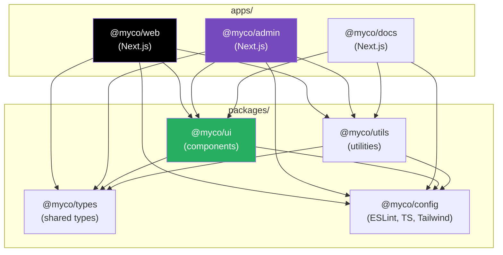
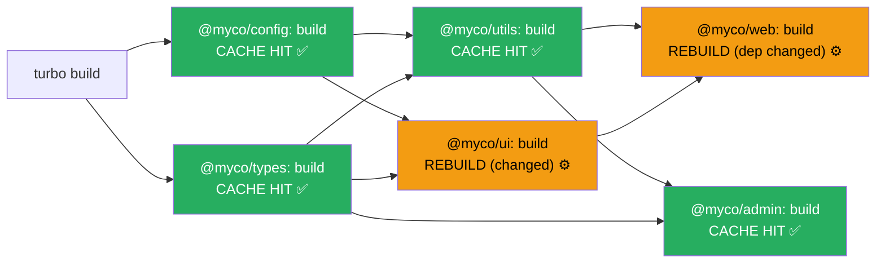

# 98 · Monorepo Architecture

> **A monorepo (monolithic repository) is a codebase strategy where multiple projects, packages, and applications live in a single version-controlled repository. For React/Next.js engineering teams, a monorepo means a design system package, a shared utilities package, multiple Next.js applications, and backend services can all coexist in one repository with shared tooling, consistent dependency versions, atomic commits across packages, and cross-package TypeScript type safety — without the coordination overhead of managing N separate repositories. Turborepo is the modern tool of choice for JavaScript/TypeScript monorepos, bringing caching and parallelization to the multi-package build challenge.**

The decision between a monorepo and polyrepo (multiple separate repositories) is architectural rather than merely organizational. It determines how easily teams can make coordinated changes across packages, how dependency versions stay synchronized, and whether "extract this into a shared package" is a 30-minute task or a 3-hour cross-repository coordination exercise. This document covers the monorepo architecture patterns most relevant to Next.js teams building a shared design system, shared utilities, and multiple product applications.

---

## Table of Contents

- [Monorepo vs Polyrepo: The Real Trade-Offs](#monorepo-vs-polyrepo-the-real-trade-offs)
- [Monorepo Structure for Next.js Projects](#monorepo-structure-for-nextjs-projects)
- [Package Manager Workspaces](#package-manager-workspaces)
- [Turborepo: Caching and Parallelization](#turborepo-caching-and-parallelization)
- [turbo.json: Defining the Task Graph](#turbojson-defining-the-task-graph)
- [Remote Caching with Turborepo](#remote-caching-with-turborepo)
- [Internal Package Patterns](#internal-package-patterns)
- [The `ui` Package: Shared Components](#the-ui-package-shared-components)
- [The `config` Package: Shared Tooling Configuration](#the-config-package-shared-tooling-configuration)
- [TypeScript in a Monorepo](#typescript-in-a-monorepo)
- [Version Management: Internal vs Published Packages](#version-management-internal-vs-published-packages)
- [Dependency Management Strategies](#dependency-management-strategies)
- [CI/CD in a Monorepo](#cicd-in-a-monorepo)
- [Architecture Diagrams](#architecture-diagrams)
- [Good Practices](#good-practices)
- [Bad Practices](#bad-practices)
- [Mental Model](#mental-model)
- [Common Misconceptions](#common-misconceptions)
- [Exercises](#exercises)
- [Further Reading](#further-reading)

---

## Monorepo vs Polyrepo: The Real Trade-Offs

```
MONOREPO ADVANTAGES:
  ✅ ATOMIC CROSS-PACKAGE CHANGES: change shared package AND consuming
     app in one commit — no "release 1.2.0, bump dependency, wait for
     CI" coordination across repos
  ✅ SINGLE TOOLING BASELINE: one ESLint config, one TypeScript config,
     one CI pipeline — no drift between repositories
  ✅ UNIFIED TYPE SYSTEM: UI package exports a type; apps consume it
     via direct path reference — not via published npm version;
     types stay in sync automatically
  ✅ EASY EXTRACTION: "let's move this to a shared package" is a
     15-minute folder restructure, not a new-repository setup
  ✅ UNIFIED CI INSIGHTS: one place to see all build statuses,
     coverage reports, and deployment states

MONOREPO DISADVANTAGES:
  ❌ TOOLING COMPLEXITY: monorepos require workspace-aware package
     managers (pnpm/npm/yarn workspaces), orchestration tools
     (Turborepo/Nx), and careful IDE configuration
  ❌ SCALE CHALLENGES: at very large scale (10,000+ packages, like
     Google or Meta's repos), custom tooling becomes necessary —
     but this is not a relevant concern for most product teams
  ❌ LEARNING CURVE: developers unfamiliar with workspaces and task
     pipelines need time to understand how changes propagate
  ❌ CLONE SIZE: the full repository including all projects can be
     large (mitigated by sparse checkout for specific projects)

POLYREPO ADVANTAGES:
  ✅ SIMPLICITY: each repo is a standard Node.js project with
     no special workspace configuration
  ✅ INDEPENDENT RELEASE CYCLES: packages release on their own schedules
  ✅ CLEAR OWNERSHIP: a repository boundary = a team boundary

WHEN TO CHOOSE MONOREPO:
  ✅ Multiple Next.js apps sharing a design system
  ✅ An npm package AND a docs site AND an example app
  ✅ Frontend + backend services that change together frequently
  ✅ A team of 3-50 engineers working on related products

WHEN POLYREPO MAKES MORE SENSE:
  ✅ Completely independent teams with no shared code
  ✅ Very different technology stacks (a Python backend and a React
     frontend that happen to be owned by the same org)
  ✅ Packages that must be independently version-controlled and
     released to npm on their own cadence
```

---

## Monorepo Structure for Next.js Projects

```
my-monorepo/
  apps/                       ← runnable applications
    web/                      ← the main Next.js app
      app/
      package.json
      next.config.js
      tsconfig.json
    admin/                    ← an admin Next.js app
      app/
      package.json
    docs/                     ← documentation site (e.g., Next.js + Nextra)
      pages/
      package.json

  packages/                   ← shared, reusable packages
    ui/                       ← shared component library
      src/
        components/
          Button/
          Input/
      package.json
      tsconfig.json

    config/                   ← shared configuration packages
      eslint/
        index.js              ← shared ESLint config
        package.json
      typescript/
        base.json             ← base tsconfig
        nextjs.json           ← Next.js-specific tsconfig
        package.json
      tailwind/
        tailwind.config.js    ← shared Tailwind config
        package.json

    utils/                    ← shared utilities
      src/
        format.ts
        validation.ts
      package.json

    types/                    ← shared TypeScript types
      src/
        api.ts                ← shared API response types
        user.ts               ← User type shared across apps
      package.json

  turbo.json                  ← Turborepo task pipeline config
  package.json                ← root workspace config
  pnpm-workspace.yaml         ← workspace definition (if using pnpm)
```

---

## Package Manager Workspaces

Monorepos require workspace support from the package manager to handle cross-package dependencies:

```yaml
# pnpm-workspace.yaml (pnpm — recommended for monorepos)
packages:
  - "apps/*"
  - "packages/*"
```

```json
// Root package.json
{
  "name": "my-monorepo",
  "private": true, // never published to npm
  "scripts": {
    "build": "turbo build",
    "dev": "turbo dev",
    "lint": "turbo lint",
    "test": "turbo test",
    "type-check": "turbo type-check"
  },
  "devDependencies": {
    "turbo": "^2.0.0"
  }
}
```

```json
// apps/web/package.json
{
  "name": "@myco/web",
  "dependencies": {
    "@myco/ui": "workspace:*", // workspace: protocol: resolve from the monorepo
    "@myco/utils": "workspace:*", // not from npm registry
    "@myco/types": "workspace:*",
    "next": "^15.0.0",
    "react": "^18.0.0"
  }
}
```

```
THE `workspace:*` PROTOCOL:
  In pnpm (and similar in yarn/npm workspaces): `workspace:*` means
  "resolve this dependency from the local workspace package with this
  name, not from npm." It creates a SYMLINK in node_modules pointing
  to the actual package folder in the monorepo.

  This means:
  - Changes to @myco/ui are instantly reflected in @myco/web
    (no build/publish/update cycle needed)
  - TypeScript in @myco/web sees @myco/ui's current source types
  - Running @myco/web's dev server automatically uses the latest
    @myco/ui code without any intermediate publish step
```

---

## Turborepo: Caching and Parallelization

```
TURBOREPO SOLVES TWO PROBLEMS:

1. PARALLELIZATION: in a monorepo with 3 apps and 5 packages, which
   tasks can run simultaneously and which must wait for others?
   If @myco/ui must build BEFORE @myco/web can build (because web
   depends on ui's output), Turborepo understands this ordering and
   correctly waits. Tasks without dependencies run in parallel.

2. CACHING: if nothing changed in @myco/utils since the last build,
   why rebuild it? Turborepo hashes the inputs of each task (source
   files, dependencies, environment variables) and restores the
   cached output if the hash matches — across both local builds
   AND team members (via Remote Cache).

THE RESULT:
  `turbo build` on a cold cache: compiles everything in correct order
  `turbo build` after changing one component in @myco/ui:
    - @myco/config: CACHE HIT (nothing changed) — instant
    - @myco/utils: CACHE HIT — instant
    - @myco/types: CACHE HIT — instant
    - @myco/ui: REBUILD (component changed) — takes time
    - @myco/web: REBUILD (depends on ui which changed) — takes time
    - @myco/admin: CACHE HIT (depends on ui, but doesn't use this component)
      — instant if the specific exports admin uses are unchanged
    - @myco/docs: CACHE HIT — instant
  Total build time: only the two packages that ACTUALLY NEED to rebuild.
```

---

## turbo.json: Defining the Task Graph

```json
// turbo.json — the pipeline definition
{
  "$schema": "https://turbo.build/schema.json",
  "tasks": {
    "build": {
      "dependsOn": ["^build"], // run this package's dependencies' build first
      "inputs": [
        "$TURBO_DEFAULT$", // all files Turbo tracks by default
        "!**/*.md" // exclude markdown from cache key
      ],
      "outputs": [
        ".next/**", // Next.js build output
        "!.next/cache/**", // exclude cache from outputs
        "dist/**" // library builds
      ]
    },
    "dev": {
      "dependsOn": ["^build"], // dependencies must be built before dev
      "persistent": true, // dev servers run until killed
      "cache": false // dev tasks are never cached
    },
    "lint": {
      "dependsOn": [], // lint doesn't depend on other packages' lint
      "inputs": ["src/**", ".eslintrc.js", "*.json"]
    },
    "test": {
      "dependsOn": ["^build"], // tests may depend on built outputs
      "inputs": ["src/**", "*.test.*", "*.spec.*", "vitest.config.*"],
      "outputs": ["coverage/**"] // test coverage reports are cached outputs
    },
    "type-check": {
      "dependsOn": ["^build"], // TypeScript type checking needs built types
      "inputs": ["src/**", "tsconfig.json"]
    }
  }
}
```

```
THE `^` PREFIX MEANING:
  "^build" = "first, run `build` in all packages that THIS package
             depends on (in its package.json dependencies)"

  For @myco/web (which depends on @myco/ui):
  `dependsOn: ["^build"]` means: run @myco/ui's build BEFORE
  starting @myco/web's build.

  WITHOUT the `^`: "run this task within THIS package only,
  regardless of dependency ordering."
  lint: { dependsOn: [] } = "just run lint in this package,
  no dependency on other packages' lint results."
```

---

## Remote Caching with Turborepo

```
REMOTE CACHE = shared build cache across the entire team

LOCAL CACHE ONLY (default):
  Developer A runs `turbo build` → builds everything, populates LOCAL cache
  Developer B runs `turbo build` → NOTHING shared with A's cache
  CI runs `turbo build` → NOTHING shared with either dev's cache
  Every environment rebuilds from scratch

REMOTE CACHE (Vercel Turborepo or self-hosted):
  Developer A runs `turbo build` → builds and PUSHES cache to remote
  Developer B runs `turbo build`:
    → checks remote cache for each task
    → CACHE HITS: downloads A's build artifacts directly
    → No rebuilding of unchanged packages
  CI runs `turbo build`:
    → same — cache hits for unchanged code, builds only what changed

SETUP:
  # Link your monorepo to Vercel's Remote Cache:
  npx turbo login
  npx turbo link

  # In CI (GitHub Actions):
  - uses: actions/checkout@v4
  - run: npx turbo build
    env:
      TURBO_TOKEN: ${{ secrets.TURBO_TOKEN }}
      TURBO_TEAM: ${{ vars.TURBO_TEAM }}

BUSINESS IMPACT:
  A typical monorepo CI build without remote caching: 8-15 minutes
  With remote cache (only changed packages rebuild): 1-4 minutes
  The CI time reduction means faster PR feedback cycles — a
  significant developer experience quality-of-life improvement.
```

---

## Internal Package Patterns

There are three common patterns for how internal packages expose their code:

```
PATTERN 1: "Just-in-Time" compilation (recommended for development)
  The package's package.json "main"/"module" points to the SOURCE
  directly. No build step needed. Consuming apps compile the package's
  source as part of their own build.

  packages/ui/package.json:
  {
    "name": "@myco/ui",
    "main": "./src/index.tsx",  // ← raw source, not compiled
    "types": "./src/index.tsx"
  }

  apps/web/next.config.js:
  module.exports = {
    transpilePackages: ['@myco/ui'], // ← Next.js compiles this package's source
  };

  Benefits: instant reflection of changes (no rebuild of the package),
  simple setup, tree shaking works via the consuming app's bundler.
  Drawback: every consuming app must be able to handle the package's
  syntax (TypeScript, JSX) — transpilePackages handles this.

PATTERN 2: Compiled output
  The package runs its own build, outputting .js and .d.ts files.
  Consuming apps use the compiled output, not raw source.

  packages/ui/package.json:
  {
    "name": "@myco/ui",
    "exports": {
      ".": {
        "types": "./dist/index.d.ts",
        "import": "./dist/index.esm.js",
        "require": "./dist/index.cjs.js"
      }
    }
  }

  Benefits: package is truly independent, works as a potential npm
  publish candidate, no transpilePackages needed.
  Drawback: requires building the package before consuming apps can
  use it (Turborepo's dependsOn handles the ordering).

PATTERN 3: Hybrid
  Source for development (workspace: linking), compiled for publishing.
  Two different package.json exports configurations toggled by the
  build environment.
```

---

## The `ui` Package: Shared Components

```tsx
// packages/ui/src/index.ts — the package's public API
export { Button } from './components/Button';
export { Input } from './components/Input';
export { Modal } from './components/Modal';
export { DataTable } from './components/DataTable';
export type { ButtonProps, InputProps, ModalProps } from './types';

// packages/ui/package.json
{
  "name": "@myco/ui",
  "version": "0.0.0",       // internal packages often use 0.0.0 (not published)
  "private": true,           // never published to npm
  "main": "./src/index.ts",
  "types": "./src/index.ts",
  "peerDependencies": {
    "react": "^18.0.0",
    "react-dom": "^18.0.0"
  },
  "devDependencies": {
    "react": "^18.0.0",       // in devDeps: present for testing/storybook
    "react-dom": "^18.0.0"    // consumers provide their own react via peerDeps
  }
}

// apps/web/next.config.js
module.exports = {
  transpilePackages: ['@myco/ui'],  // compile @myco/ui's TypeScript/JSX
};

// apps/web/src/app/page.tsx
import { Button } from '@myco/ui'; // resolved from packages/ui/src/index.ts

export default function Page() {
  return <Button variant="primary">Hello from shared UI</Button>;
}
```

---

## The `config` Package: Shared Tooling Configuration

```js
// packages/config/eslint/index.js — shared ESLint config
module.exports = {
  extends: [
    "next/core-web-vitals",
    "plugin:@typescript-eslint/recommended",
    "prettier",
  ],
  rules: {
    "@typescript-eslint/no-unused-vars": ["error", { argsIgnorePattern: "^_" }],
    "no-console": ["warn", { allow: ["warn", "error"] }],
  },
};

// apps/web/.eslintrc.js — consuming the shared config
module.exports = {
  root: true,
  extends: ["@myco/eslint-config"], // resolved from packages/config/eslint
  parserOptions: {
    project: true,
  },
};
```

```json
// packages/config/typescript/base.json — shared TypeScript config
{
  "$schema": "https://json.schemastore.org/tsconfig",
  "compilerOptions": {
    "strict": true,
    "skipLibCheck": true,
    "moduleResolution": "bundler",
    "module": "esnext",
    "target": "es2022",
    "esModuleInterop": true,
    "isolatedModules": true,
    "jsx": "preserve"
  }
}

// packages/config/typescript/nextjs.json — Next.js-specific extension
{
  "$schema": "https://json.schemastore.org/tsconfig",
  "extends": "./base.json",
  "compilerOptions": {
    "plugins": [{ "name": "next" }],
    "lib": ["dom", "dom.iterable", "esnext"]
  }
}

// apps/web/tsconfig.json — consuming the shared config
{
  "extends": "@myco/typescript-config/nextjs.json",
  "compilerOptions": {
    "baseUrl": ".",
    "paths": {
      "@/*": ["./src/*"]
    }
  },
  "include": ["next-env.d.ts", "**/*.ts", "**/*.tsx"],
  "exclude": ["node_modules"]
}
```

---

## TypeScript in a Monorepo

```
THE CROSS-PACKAGE TYPE RESOLUTION CHALLENGE:

When @myco/web imports from @myco/ui, TypeScript needs to find
@myco/ui's type definitions. There are two approaches:

APPROACH 1: Point TypeScript to source (JIT, recommended for internal):
  packages/ui/package.json:
  { "main": "./src/index.ts", "types": "./src/index.ts" }
  → TypeScript reads the actual .ts source files directly
  → ZERO build delay, instant type feedback
  → Requires transpilePackages in next.config.js

APPROACH 2: Path aliases in tsconfig (for more complex setups):
  apps/web/tsconfig.json:
  {
    "compilerOptions": {
      "paths": {
        "@myco/ui": ["../../packages/ui/src/index.ts"],
        "@myco/utils": ["../../packages/utils/src/index.ts"]
      }
    }
  }
  → TypeScript resolves imports via explicit path mapping
  → More explicit, works without package.json "main" pointing to source

THE RECOMMENDED APPROACH FOR MOST MONOREPOS:
  Use "main": "./src/index.ts" in internal package's package.json
  AND set transpilePackages in consuming Next.js apps' next.config.js
  → Simplest, most seamless DX, zero build step for internal packages
```

---

## Version Management: Internal vs Published Packages

```
INTERNAL PACKAGES (not published to npm):
  Use version: "0.0.0" (or any constant) — it doesn't matter.
  Use workspace:* in consuming packages.
  Changes are always at the "latest" (current source).
  No versioning ceremony, no changelog maintenance required.

PUBLISHED PACKAGES (actual npm packages in your monorepo):
  These require real version management — tools like Changesets are standard:

  # 1. Developer makes a change and runs:
  pnpm changeset
  # → Interactive prompts: which packages changed? Major/minor/patch?
  # → Creates a .changeset/random-name.md file describing the change

  # 2. On merge to main:
  pnpm changeset version
  # → Reads all .changeset/ files, bumps package versions accordingly
  # → Updates CHANGELOG.md for each package

  # 3. On release:
  pnpm changeset publish
  # → Publishes updated packages to npm

CHANGESETS WORKFLOW KEEPS:
  - Version bumps in the repo (in package.json, as a commit)
  - Changelogs auto-generated from changeset descriptions
  - Coordinated multi-package releases (bump ui + types together)
```

---

## Dependency Management Strategies

```
HOISTING (how workspaces handle shared dependencies):
  In pnpm workspaces, packages in multiple workspace projects
  that declare the same dependency version share one copy at
  the root node_modules — "hoisting."

  This means: react@18.2.0 declared by 5 apps and 3 packages
  is installed ONCE at the root, not 8 separate times.
  Significant disk space and install time savings.

PEER DEPENDENCIES FOR SHARED PACKAGES:
  packages/ui should NOT install its own copy of react —
  it should declare react as a peerDependency:
  { "peerDependencies": { "react": "^18.0.0" } }
  The consuming APP provides react; @myco/ui uses the app's copy.
  This prevents "two copies of React" bugs (violates the
  single React instance requirement).

VERSION PINNING STRATEGY:
  Keep all apps and packages on THE SAME major version of shared
  dependencies (react, react-dom, typescript, next).
  Monorepo's single package.json workspace + Renovate/Dependabot
  configured to update all usages simultaneously enforces this.

  Mixed versions (web: react@18, admin: react@17) in a monorepo
  is asking for subtle bugs and bundle bloat from two react versions.
```

---

## CI/CD in a Monorepo

```yaml
# .github/workflows/ci.yml — Turborepo-aware CI
name: CI

on:
  push:
    branches: [main]
  pull_request:
    branches: [main]

jobs:
  build:
    runs-on: ubuntu-latest
    steps:
      - uses: actions/checkout@v4
        with:
          fetch-depth: 0 # full history for Turborepo change detection

      - uses: pnpm/action-setup@v2
        with:
          version: 8

      - uses: actions/setup-node@v4
        with:
          node-version: "20"
          cache: "pnpm"

      - run: pnpm install --frozen-lockfile

      # Turborepo remote cache auth:
      - run: pnpm turbo build lint test type-check
        env:
          TURBO_TOKEN: ${{ secrets.TURBO_TOKEN }}
          TURBO_TEAM: ${{ vars.TURBO_TEAM }}
          # Turborepo automatically identifies what changed and
          # only rebuilds/retests affected packages — both via
          # local file change detection AND remote cache for
          # tasks whose inputs haven't changed at all.

  deploy-web:
    needs: [build]
    runs-on: ubuntu-latest
    if: github.ref == 'refs/heads/main'
    steps:
      - uses: actions/checkout@v4
      - uses: pnpm/action-setup@v2
      - run: pnpm install --frozen-lockfile
      - run: pnpm turbo build --filter=@myco/web
        # --filter: only build the web app (and its dependencies)
        env:
          TURBO_TOKEN: ${{ secrets.TURBO_TOKEN }}
          TURBO_TEAM: ${{ vars.TURBO_TEAM }}
      - run: vercel deploy apps/web/.next --prod
        env:
          VERCEL_TOKEN: ${{ secrets.VERCEL_TOKEN }}
```

```
THE --filter FLAG:
  turbo build --filter=@myco/web
  → Build @myco/web AND all its dependencies (@myco/ui, @myco/utils, etc.)
  → Skip @myco/admin, @myco/docs, and their exclusive dependencies

  turbo build --filter=@myco/ui...
  → Build @myco/ui AND all apps that DEPEND ON @myco/ui
  → Useful: "I changed @myco/ui; rebuild only what's affected"

  turbo build --filter=...[main]
  → Build only packages that changed since the last merge to main
  → Powerful for CI: don't rebuild packages with no changes
```

---

## Architecture Diagrams

### Monorepo package dependency graph



### Turborepo task execution with cache



---

## Good Practices

### ✅ Good Practice — Well-structured turbo.json with appropriate caching inputs

```json
{
  "$schema": "https://turbo.build/schema.json",
  "globalEnv": ["NODE_ENV", "NEXT_PUBLIC_API_URL"],
  "tasks": {
    "build": {
      "dependsOn": ["^build"],
      "inputs": [
        "$TURBO_DEFAULT$",
        "!**/*.test.ts",
        "!**/*.spec.ts",
        "!**/*.stories.tsx",
        "!**/*.md"
      ],
      "outputs": [".next/**", "!.next/cache/**", "dist/**", "build/**"],
      "env": ["NEXT_PUBLIC_API_URL", "ANALYZE"]
    },
    "dev": {
      "dependsOn": ["^build"],
      "persistent": true,
      "cache": false
    },
    "test": {
      "dependsOn": ["^build"],
      "inputs": ["src/**", "test/**", "**/*.test.*", "vitest.config.*"],
      "outputs": ["coverage/**"],
      "env": ["CI"]
    },
    "lint": {
      "inputs": ["src/**", "*.js", ".eslintrc*"],
      "outputs": []
    },
    "type-check": {
      "dependsOn": ["^build"],
      "inputs": ["src/**", "tsconfig.json"],
      "outputs": []
    }
  }
}
```

---

## Bad Practices

### ⚠️ Bad Practice — Installing dependencies at the wrong level, creating phantom dependencies

```json
/**
 * Bad: Installing application-level dependencies at the monorepo ROOT
 * package.json instead of in the specific app that needs them.
 * This creates "phantom dependencies" — packages available everywhere
 * in the monorepo because they're hoisted from the root, even though
 * only ONE app declared needing them. If that app removes its need,
 * all other apps silently still have access via the phantom.
 */

// ❌ Root package.json — wrong place for app-specific dependencies
{
  "name": "my-monorepo",
  "dependencies": {
    "stripe": "^14.0.0",       // ❌ only @myco/web needs Stripe!
    "firebase": "^10.0.0",     // ❌ only @myco/admin needs Firebase!
    "framer-motion": "^11.0.0" // ❌ only @myco/docs needs this!
  }
}
// Now every package in the monorepo CAN import stripe, firebase,
// framer-motion — phantom dependencies. The admin app thinks it
// doesn't depend on Stripe but it COULD import it and nothing
// would fail until the dep is eventually removed from the root.

/**
 * ✅ Fix: install dependencies in the specific workspace that needs them
 */
// pnpm add stripe --filter @myco/web
// → adds stripe to apps/web/package.json only
// → stripe is only available in @myco/web's node_modules context
// → other packages CAN'T import it (explicit, not phantom)

// Root package.json should contain ONLY:
{
  "name": "my-monorepo",
  "private": true,
  "devDependencies": {
    "turbo": "^2.0.0"    // build tooling that applies to the whole repo
  }
}
```

---

## Mental Model

> 💡 **The monorepo mental model:**
>
> A monorepo is like a **company campus with shared infrastructure** — all the buildings (apps and packages) are on the same campus (repository), sharing the same utilities: one electrical grid (one Node.js version), one security system (one set of ESLint/TypeScript rules), and one HR system (one CI pipeline). Moving between buildings is instant (no cross-repo coordination), and upgrades to the campus infrastructure apply everywhere simultaneously (one PR updates TypeScript for all buildings). Turborepo is the **campus's smart facilities management system**: it knows which buildings depend on which utilities, knows not to repaint a building that wasn't touched (caching), and can fix multiple buildings simultaneously (parallelization). The Remote Cache is like a **shared materials warehouse**: when the west wing is renovated, the materials and techniques learned are catalogued; when the east wing needs the same renovation, it uses the catalogue instead of starting from scratch.

---

## Common Misconceptions

### "A monorepo means one package.json for everything"

A monorepo has ONE ROOT package.json for workspace configuration, but EACH package/app has its OWN package.json for its specific dependencies and scripts. The root package.json is the workspace orchestrator; individual package.jsons define each package's identity and dependencies.

### "All code in a monorepo must be built together"

Turborepo's `--filter` flag and task pipeline allow building ONLY specific packages and their dependencies. You can deploy `@myco/admin` without touching `@myco/web` or `@myco/docs`. The monorepo houses them together; Turborepo makes them independently deployable.

### "Monorepos don't scale"

Large tech companies (Google, Meta, Microsoft, Twitter) run what are perhaps the world's most complex codebases as monorepos. The "monorepos don't scale" claim confuses tooling limitations (older tools like npm workspaces without Turborepo) with architectural limitations. Modern tooling (Turborepo, Nx, Bazel) makes monorepos scale well for the vast majority of product teams.

### "All packages in a monorepo should be published to npm"

Internal packages used only within the monorepo should be `"private": true` and use `workspace:*` protocol — never published to npm. Publishing is reserved for packages specifically designed to be consumed externally. Most monorepos have few or no published packages.

### "Turborepo replaces Webpack/Vite/Next.js build tools"

Turborepo is a BUILD ORCHESTRATOR — it determines WHICH tasks to run, in what ORDER, and what can be served from CACHE. It doesn't replace the build tools (Next.js's Webpack/Turbopack, Vite, tsc) — it CALLS those tools for each package, managing the execution pipeline across all packages.

---

## Exercises

### Exercise 1 — Set up a minimal Turborepo monorepo

1. Use `npx create-turbo@latest` to scaffold a starter monorepo
2. Add a second Next.js app (`apps/admin`) that imports a component from the existing `packages/ui`
3. Verify that `turbo build` builds them in the correct order
4. Make a change to a component in `packages/ui` and verify that `turbo build` only rebuilds `ui` and both apps, not unrelated packages

### Exercise 2 — Measure Remote Cache impact

1. Set up Turborepo with Vercel Remote Cache (free tier)
2. Run `turbo build` on a branch — note the full build time
3. Create a new branch from the same commit
4. Run `turbo build` again — observe how many tasks are CACHE HITS from the Remote Cache
5. Measure the time savings vs the original fresh build

### Exercise 3 — Design the monorepo structure for a multi-app company

You're architecting a monorepo for a company with:

- A customer-facing Next.js marketing site
- A customer portal (dashboard + settings) Next.js app
- An internal admin tool Next.js app
- A mobile app (React Native)
- A shared design system (components + tokens)
- A shared API client library
- TypeScript type definitions shared across everything
- Shared authentication logic

Design the complete directory structure, identify which packages are internal vs potentially published, and write the root `turbo.json` task definitions.

---

## Further Reading

- [Turborepo documentation](https://turbo.build/repo/docs) — official Turborepo docs, the primary reference
- [Turborepo: Getting started](https://turbo.build/repo/docs/getting-started/create-new) — scaffolding a new monorepo
- [Changesets documentation](https://github.com/changesets/changesets) — version management for monorepo packages
- [pnpm workspaces](https://pnpm.io/workspaces) — workspace protocol and configuration
- [Vercel: Monorepo deployments](https://vercel.com/docs/monorepos) — deploying specific apps from a monorepo to Vercel
- [Matt Pocock: TypeScript monorepos](https://www.totaltypescript.com/what-is-a-tsconfig-and-how-do-i-use-it) — TypeScript configuration in monorepos
- Related in this handbook: [96 · Feature-Based Architecture](./01-feature-based.md)
- Next in this handbook: [99 · Micro-Frontends](./04-micro-frontends.md)

---

_Part of the [React + Next.js Engineering Handbook](../../README.md)_
