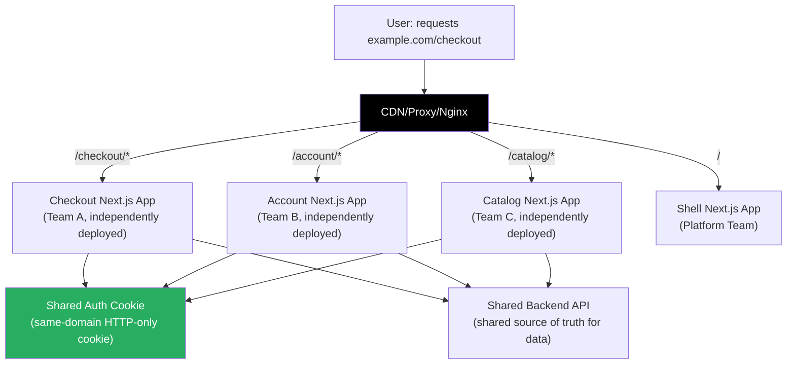
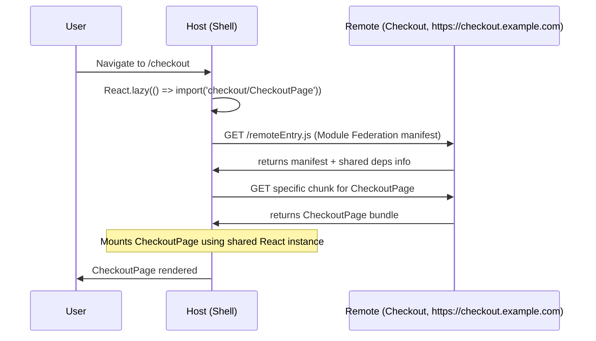

# 99 · Micro-Frontends

> **Micro-frontends extend the microservices philosophy to the frontend: breaking a large frontend application into smaller, independently deployable pieces, each owned by a different team, that compose into a single user-facing product. Where a monorepo (doc 98) keeps multiple apps in one codebase with shared build tooling, micro-frontends go further — each piece is independently built, independently deployed, and can be independently technology-versioned. The architecture solves genuine organizational scaling problems (ten teams shipping to one frontend simultaneously) but introduces real complexity (shared state, routing, auth, design consistency across independent deployments). Understanding the trade-offs and implementation patterns — particularly Module Federation, which Webpack 5 made practical — is essential for engineers working in large frontend organizations or evaluating whether micro-frontends are the right tool for a specific problem.**

Micro-frontends are frequently misapplied: proposed as an organizational solution to a technical problem (shared code → use a monorepo), or proposed for small teams where the coordination overhead exceeds the independence benefit. This document covers the genuine use cases, the dominant implementation patterns, and the specific challenges that arise when micro-frontends meet Next.js's server-side rendering model.

---

## Table of Contents

- [When Micro-Frontends Are the Right Answer](#when-micro-frontends-are-the-right-answer)
- [The Five Implementation Approaches](#the-five-implementation-approaches)
- [Module Federation: Sharing Code at Runtime](#module-federation-sharing-code-at-runtime)
- [Module Federation in Next.js with @module-federation/nextjs-mf](#module-federation-in-nextjs-with-module-federationnextjs-mf)
- [iFrame Micro-Frontends](#iframe-micro-frontends)
- [Web Components as Integration Points](#web-components-as-integration-points)
- [Route-Level Micro-Frontends](#route-level-micro-frontends)
- [Shared Dependencies and the Diamond Dependency Problem](#shared-dependencies-and-the-diamond-dependency-problem)
- [Shared State Across Micro-Frontends](#shared-state-across-micro-frontends)
- [Authentication in a Micro-Frontend Architecture](#authentication-in-a-micro-frontend-architecture)
- [Design Consistency Across Independent Teams](#design-consistency-across-independent-teams)
- [The Shell Application Pattern](#the-shell-application-pattern)
- [Deployment and Versioning Strategies](#deployment-and-versioning-strategies)
- [The Costs of Micro-Frontends](#the-costs-of-micro-frontends)
- [Architecture Diagrams](#architecture-diagrams)
- [Good Practices](#good-practices)
- [Bad Practices](#bad-practices)
- [Mental Model](#mental-model)
- [Common Misconceptions](#common-misconceptions)
- [Exercises](#exercises)
- [Further Reading](#further-reading)

---

## When Micro-Frontends Are the Right Answer

```
GENUINE USE CASES for micro-frontends:

1. ORGANIZATIONAL SCALE: 5+ independent teams each "owning" a vertical
   slice of a product (team A: checkout, team B: product catalog,
   team C: account management) and needing to DEPLOY INDEPENDENTLY
   without coordinating with each other for every release.

   The defining symptom: "We can't ship our feature because team B's
   change needs to be reviewed first, and they're not done yet."
   When deployment coordination becomes a bottleneck, micro-frontends
   remove that bottleneck at the architecture level.

2. TECHNOLOGY DIVERSITY (real cases):
   - Migrating from a legacy framework (Angular → React) without
     a "big bang" rewrite: new features in React, existing features
     stay in Angular, both visible in the same user-facing product
   - An acquired company's product must integrate into the parent
     company's product without a full rebuild
   - One team genuinely needs a technology the rest don't
     (a data visualization team using D3-heavy code, a mobile web
     team using very different rendering approaches)

3. SCALE OF THE MONOLITH: a frontend codebase with 500,000+ lines
   of code, build times >30 minutes, where ANY change requires
   testing the ENTIRE frontend.

WHEN MICRO-FRONTENDS ARE WRONG:

❌ "We want to move fast independently" — but the teams still share
   significant domain models, design system, and state. Moving fast
   in a micro-frontend doesn't mean moving fast as a PRODUCT;
   the seams between teams will show.

❌ "We want to avoid merging conflicts" — use a monorepo with
   proper feature-based architecture and Git practices instead.

❌ Small teams (< 20 engineers): coordination overhead exceeds
   independence benefit at small scale.

❌ When the alternative is a monorepo with proper shared packages:
   a monorepo provides code sharing, independent team velocity,
   and separate deployment pipelines WITHOUT runtime integration
   complexity, bundle duplication, or cross-team state management.
```

---

## The Five Implementation Approaches

```
APPROACH 1: BUILD-TIME INTEGRATION (npm packages)
  Teams publish their micro-frontend as an npm package.
  The shell app installs and builds it at compile time.
  NOT truly independent deployment — still requires shell to rebuild on each change.
  Best for: component libraries, stable APIs, not frequently changing frontends.

APPROACH 2: RUN-TIME VIA JAVASCRIPT (Module Federation, importmap)
  Each micro-frontend is a separately deployed JavaScript bundle.
  The shell loads them at runtime via a URL.
  Truly independent deployment — a micro-frontend update deploys without
  the shell rebuilding.
  Best for: the "canonical" micro-frontend use case.

APPROACH 3: IFRAMES
  Each micro-frontend runs in a completely isolated iframe.
  The strongest isolation (separate browsing context, separate DOM,
  no JavaScript sharing possible).
  Serious UX limitations (scrolling, focus management, resize).
  Best for: strict isolation requirements (third-party untrusted content,
  legacy systems where JavaScript execution isolation is required).

APPROACH 4: WEB COMPONENTS
  Each micro-frontend is packaged as a Custom Element (Web Component).
  Framework-agnostic by definition — a React, Vue, or Svelte micro-frontend
  can be consumed as a <team-a-checkout> custom element anywhere.
  Best for: cross-framework integration needs.

APPROACH 5: SERVER-SIDE COMPOSITION
  The SERVER assembles micro-frontend fragments into a complete HTML response.
  Each micro-frontend exposes an endpoint that returns an HTML fragment.
  A server-side compositor (ESI, nginx composition, or custom BFF) stitches them.
  Best for: server-rendered performance, when client-side JS sharing isn't needed.
  Very relevant with Next.js's RSC model (though this isn't "traditional"
  micro-frontends, the pattern is similar).
```

---

## Module Federation: Sharing Code at Runtime

Module Federation (Webpack 5, 2020) is the most mature runtime integration approach:

```
CORE CONCEPT:
  One webpack bundle (the "REMOTE") can EXPOSE specific modules.
  Another webpack bundle (the "HOST") can CONSUME those modules at runtime.
  The consumption happens without a build-time dependency between HOST and REMOTE.

THE MECHANISM:
  1. REMOTE (team-a's checkout app) exposes:
     - CheckoutContainer (the main component)
     - CheckoutMiniSummary (used in the shell's header)

  2. HOST (the shell app) declares it can consume from team-a:
     "load CheckoutContainer from team-a's deployed URL at runtime"

  3. At runtime, when the user navigates to /checkout:
     → Host's webpack runtime makes a fetch to team-a's deploy URL
     → Downloads team-a's manifest (remoteEntry.js)
     → Downloads only the specific modules requested
     → Executes them in the host's JavaScript context
     → React (shared singleton) renders the checkout component
       as if it were part of the host's own bundle

THE SHARING MAGIC:
  Module Federation can be configured to SHARE specific dependencies
  (like React, React-DOM) as SINGLETONS — only ONE copy is loaded
  regardless of how many micro-frontends consume it.
  This avoids the "two copies of React" problem that would break
  the cross-component state model.
```

```js
// REMOTE: team-a's checkout webpack config
const { ModuleFederationPlugin } = require("webpack").container;

module.exports = {
  plugins: [
    new ModuleFederationPlugin({
      name: "checkout",
      filename: "remoteEntry.js", // the manifest/entry point
      exposes: {
        "./CheckoutContainer": "./src/components/CheckoutContainer",
        "./MiniCart": "./src/components/MiniCart",
      },
      shared: {
        react: { singleton: true, requiredVersion: "^18.0.0" },
        "react-dom": { singleton: true, requiredVersion: "^18.0.0" },
      },
    }),
  ],
};

// HOST: the shell app's webpack config
module.exports = {
  plugins: [
    new ModuleFederationPlugin({
      name: "shell",
      remotes: {
        // Maps 'checkout' to team-a's deployed URL
        checkout: "checkout@https://checkout.example.com/remoteEntry.js",
      },
      shared: {
        react: { singleton: true, requiredVersion: "^18.0.0" },
        "react-dom": { singleton: true, requiredVersion: "^18.0.0" },
      },
    }),
  ],
};
```

```tsx
// HOST: consuming team-a's checkout component
import React, { Suspense } from "react";

// This import resolves at RUNTIME from team-a's deployed bundle
// (TypeScript needs types separately — module federation doesn't
// auto-provide types; teams usually publish a types package or use
// @module-federation/typescript)
const CheckoutContainer = React.lazy(
  () => import("checkout/CheckoutContainer"),
);

function App() {
  return (
    <Suspense fallback={<CheckoutSkeleton />}>
      <CheckoutContainer />
    </Suspense>
  );
}
```

---

## Module Federation in Next.js with @module-federation/nextjs-mf

Next.js's standard Module Federation support requires a plugin due to its custom webpack configuration:

```bash
npm install @module-federation/nextjs-mf
```

```js
// next.config.js (REMOTE — the checkout Next.js app)
const { NextFederationPlugin } = require("@module-federation/nextjs-mf");

module.exports = {
  webpack(config, options) {
    config.plugins.push(
      new NextFederationPlugin({
        name: "checkout",
        filename: "static/chunks/remoteEntry.js",
        exposes: {
          "./CheckoutPage": "./src/components/CheckoutPage",
          "./MiniCart": "./src/components/MiniCart",
        },
        shared: {
          // These are shared as singletons to avoid duplication:
          react: { singleton: true },
          "react-dom": { singleton: true },
          "next/link": { singleton: true },
          "next/router": { singleton: true },
        },
      }),
    );
    return config;
  },
};

// next.config.js (HOST — the shell Next.js app)
const { NextFederationPlugin } = require("@module-federation/nextjs-mf");

module.exports = {
  webpack(config, options) {
    config.plugins.push(
      new NextFederationPlugin({
        name: "shell",
        remotes: {
          checkout: `checkout@${
            process.env.CHECKOUT_URL || "http://localhost:3001"
          }/_next/static/chunks/remoteEntry.js`,
        },
        shared: {
          react: { singleton: true },
          "react-dom": { singleton: true },
          "next/link": { singleton: true },
          "next/router": { singleton: true },
        },
      }),
    );
    return config;
  },
};
```

```
NEXT.JS SPECIFIC CHALLENGES WITH MODULE FEDERATION:
  1. SSR: Module Federation was designed for client-side bundles.
     Server-side rendering in Next.js with federrated modules requires
     careful configuration — both the remote's NODE bundle and the
     client bundle must be configured.

  2. App Router: Module Federation integration with Next.js App Router
     is less mature than with the Pages Router. Server Components
     that load federated modules have additional complexity.

  3. Routing: two Next.js apps both owning their own routing
     (host uses the shell's routing, remote uses its own)
     requires careful configuration to prevent conflicts.

  As of current state: Module Federation + Next.js App Router is
  a rapidly evolving area. Always verify with the latest
  @module-federation/nextjs-mf documentation before implementing.
```

---

## iFrame Micro-Frontends

```tsx
// The simplest (and most isolated) micro-frontend approach:

function CheckoutMicrofrontend({ orderId }: { orderId: string }) {
  return (
    <iframe
      src={`https://checkout.team-a.example.com?orderId=${orderId}`}
      width="100%"
      height="600"
      title="Checkout"
      // Security: restrict capabilities of the iframe
      sandbox="allow-scripts allow-same-origin allow-forms allow-popups"
    />
  );
}
```

```
IFRAME ISOLATION: WHAT'S ISOLATED AND WHAT ISN'T

FULLY ISOLATED:
  ✅ JavaScript execution context (no shared window object)
  ✅ DOM (parent can't read/write iframe's DOM, vice versa)
  ✅ Styles (parent CSS doesn't leak into iframe, iframe CSS doesn't leak out)
  ✅ React instances (safe to have different React versions — they never meet)

COMMUNICATION BETWEEN HOST AND IFRAME:
  // Window.postMessage — the only safe cross-frame communication:
  // In the iframe's code:
  window.parent.postMessage(
    { type: 'CHECKOUT_COMPLETE', orderId: '123' },
    'https://shell.example.com' // targetOrigin: only send to this origin
  );

  // In the host's code:
  window.addEventListener('message', (event) => {
    if (event.origin !== 'https://checkout.example.com') return; // security check
    if (event.data.type === 'CHECKOUT_COMPLETE') {
      router.push('/order-confirmation');
    }
  });

IFRAME LIMITATIONS:
  ❌ Scrolling: iframes have fixed height or scroll separately from the page
  ❌ URL: the iframe has its own URL history — back button behavior is complex
  ❌ Focus management: keyboard focus can get "trapped" inside iframes
  ❌ Modals/dropdowns: can't render outside the iframe's boundaries
  ❌ Performance: two full browser contexts (two separate JS heaps, two DOMs)
  ❌ UX: users can see the iframe loading separately (flash of loading state)
```

---

## Web Components as Integration Points

```tsx
// Team A defines a Web Component:
class CheckoutElement extends HTMLElement {
  connectedCallback() {
    const orderId = this.getAttribute("order-id");
    // Mount whatever framework (React, Vue, vanilla) inside the element
    const container = document.createElement("div");
    this.appendChild(container);
    ReactDOM.createRoot(container).render(<Checkout orderId={orderId} />);
  }

  disconnectedCallback() {
    // cleanup
  }
}

customElements.define("team-a-checkout", CheckoutElement);

// Team B (using React, Vue, Angular — doesn't matter) consumes it:
// In React:
function ShellApp() {
  return <team-a-checkout order-id="123" />;
}

// In Vue:
// <template><team-a-checkout :order-id="orderId" /></template>

// In plain HTML:
// <team-a-checkout order-id="123"></team-a-checkout>
```

```
WEB COMPONENT LIMITATIONS IN PRACTICE:
  ❌ SSR: standard Web Components don't support server-side rendering
     (Declarative Shadow DOM helps but isn't widely adopted yet)
  ❌ React 18's compatibility with Web Components improved significantly
     but there are still edge cases with event handling
  ❌ TypeScript integration requires additional work (typing custom elements)
  ❌ Design system token sharing across shadow DOM boundaries requires
     CSS custom properties (the one way tokens can cross the shadow boundary)

WHEN WEB COMPONENTS MAKE SENSE:
  ✅ Cross-framework composition is genuinely required (React and non-React teams)
  ✅ Teams want maximum framework independence
  ✅ The component is relatively isolated (doesn't need deep integration with
     the host application's state, routing, or design system)
```

---

## Route-Level Micro-Frontends

The simplest micro-frontend approach for Next.js: different routes served by different independent Next.js applications, composed at the reverse proxy/CDN level:

```
ARCHITECTURE:
  nginx / Vercel Edge / Cloudflare Workers (the "smart router")
    /                  → shell Next.js app (marketing, homepage)
    /checkout/*        → checkout Next.js app (team A)
    /account/*         → account Next.js app (team B)
    /catalog/*         → catalog Next.js app (team C)
    /api/*             → API gateway (not a frontend)

Each is a fully independent Next.js application, deployed independently.
The router/proxy makes them appear as one site to the user.

NGINX CONFIGURATION:
  location / {
    proxy_pass http://shell-app:3000;
  }
  location /checkout/ {
    proxy_pass http://checkout-app:3001;
  }
  location /account/ {
    proxy_pass http://account-app:3002;
  }

OR VERCEL REWRITES (for Vercel-hosted multi-app setup):
  // vercel.json in the shell app
  {
    "rewrites": [
      { "source": "/checkout/:path*", "destination": "https://checkout-vercel-app.vercel.app/checkout/:path*" },
      { "source": "/account/:path*", "destination": "https://account-vercel-app.vercel.app/account/:path*" }
    ]
  }

PROS:
  ✅ Complete independence — each team deploys their Next.js app
  ✅ No shared JavaScript runtime concerns
  ✅ Full Next.js features (SSR, RSC, caching) in each micro-frontend
  ✅ Simple mental model for the team boundary

CONS:
  ❌ Full page reload on route transitions between micro-frontends
     (navigating from /catalog to /checkout is a true page reload,
     losing client-side router cache and component state)
  ❌ Shared state (cart, auth session) must be managed externally
     (cookies, localStorage, or a shared BFF)
  ❌ Design system consistency requires discipline (no runtime sharing)
```

---

## Shared Dependencies and the Diamond Dependency Problem

```
THE PROBLEM:

Shell app:
  react@18.2.0
  react-dom@18.2.0

Checkout micro-frontend (Module Federation):
  react@18.0.0  ← DIFFERENT MINOR VERSION
  react-dom@18.0.0

If both versions of React end up in the browser's JavaScript context:
  React hooks state is version-specific. The checkout micro-frontend's
  useState is tied to react@18.0.0's hook state management.
  The shell's useState is tied to react@18.2.0's.
  They CANNOT share context — a React.Context created in the shell is
  invisible to hooks in the checkout bundle using a different React instance.

THE MODULE FEDERATION SOLUTION:
  Declare react as a `singleton` with `requiredVersion`:
  shared: {
    react: {
      singleton: true,           // only ONE copy allowed in the browser
      requiredVersion: '^18.0.0', // this version range is compatible
    }
  }
  Module Federation will use WHICHEVER version is loaded first,
  and the other bundles will reuse that single instance.
  If versions are incompatible (react@17 and react@18): Module Federation
  will log a warning and load the newer version, which may cause issues
  if react@17 code has breaking compatibility with react@18.

THE BEST MITIGATION: all micro-frontends AGREE on the same major
version of React and shared libraries, updated together as a
coordinated monorepo release or a shared baseline agreement.
This is why "micro-frontends solve the need to stay on the same
technology versions" is partially a myth — for shared dependencies
like React, they still need to coordinate versions.
```

---

## Shared State Across Micro-Frontends

```
THE PROBLEM: User adds item to cart on /catalog (team C's app).
  They navigate to /checkout (team A's app, different JavaScript context).
  Cart state must be visible in checkout.

SOLUTIONS BY INTEGRATION APPROACH:

SOLUTION 1: URL / Query Parameters
  Share data that can be serialized as URL state.
  Cart: not practical (can't put the whole cart in the URL).
  Selected filter, current view, etc.: URL is the right answer.

SOLUTION 2: Cookies (available server-side AND client-side)
  Auth tokens, cart ID (not cart contents), user preferences.
  Cookies are the cross-micro-frontend state mechanism for auth.
  Cart ID in a cookie → each micro-frontend fetches fresh cart
  data from the shared cart API service using that ID.
  This is the SERVER as the source of truth — not the JavaScript context.

SOLUTION 3: Custom Events (for same-page Module Federation)
  // In checkout micro-frontend:
  window.dispatchEvent(new CustomEvent('cart:updated', {
    detail: { count: 3 },
    bubbles: true,
  }));

  // In shell's header (monitoring cart count):
  window.addEventListener('cart:updated', (event) => {
    setCartCount(event.detail.count);
  });

SOLUTION 4: Shared BFF / API as source of truth (recommended)
  Don't share JavaScript state — share SERVER state.
  Each micro-frontend reads from and writes to the same backend API.
  The server IS the shared state. No runtime JS sharing needed.
  Works across ALL integration approaches (iframes, route-level, MF).

SOLUTION 5: LocalStorage (simple but limited)
  Small, serializable cross-MF state can use localStorage as a
  shared key-value store — all micro-frontends on the same origin
  share one localStorage.
  Limitation: synchronization (who wins when two MFs write simultaneously?),
  no server-side awareness.
```

---

## Authentication in a Micro-Frontend Architecture

```
THE CHALLENGE:
  Each micro-frontend is independently deployed. When a user authenticates
  in the shell, the checkout and account micro-frontends need to know
  the user is authenticated.

THE STANDARD SOLUTION: HTTP-only cookies

  1. Authentication happens via the shell (or a dedicated auth service)
  2. The auth server issues an HTTP-only cookie (readable by the server,
     NOT accessible to JavaScript — prevents XSS theft)
  3. The cookie is scoped to the PARENT DOMAIN (example.com)
  4. ALL sub-apps on *.example.com send this cookie automatically
     with every HTTP request
  5. Each micro-frontend's server validates the cookie independently
     via a shared auth service or JWT verification

  This works across:
    - Route-level micro-frontends (each is an independent server)
    - Module Federation (the remote's server-side functions get the cookie)
    - iframes (cross-origin iframes require careful SameSite cookie settings)

  The key insight: authentication doesn't need to be a JavaScript
  problem — it's an HTTP problem, and HTTP's cookie mechanism is
  built exactly for this cross-origin-within-same-domain use case.
```

---

## The Shell Application Pattern

```tsx
// The shell is the outermost wrapper that:
// 1. Provides global layout (navigation, footer)
// 2. Handles top-level routing (which micro-frontend to show)
// 3. Provides shared context (auth session, theme, global event bus)
// 4. Lazy-loads micro-frontends on demand

// shell/src/App.tsx
import React, { Suspense, lazy } from "react";
import { Route, Routes } from "react-router-dom";

// Each remote is loaded lazily — only downloaded when the route is visited
const CheckoutMFE = lazy(() => import("checkout/CheckoutPage"));
const AccountMFE = lazy(() => import("account/AccountPage"));
const CatalogMFE = lazy(() => import("catalog/CatalogPage"));

function Shell() {
  return (
    <ShellProviders>
      {" "}
      {/* auth context, theme, global error boundary */}
      <ShellNavigation />
      <main>
        <Routes>
          <Route path="/" element={<HomePage />} />
          <Route
            path="/checkout/*"
            element={
              <Suspense fallback={<CheckoutSkeleton />}>
                <CheckoutMFE />
              </Suspense>
            }
          />
          <Route
            path="/account/*"
            element={
              <Suspense fallback={<AccountSkeleton />}>
                <AccountMFE />
              </Suspense>
            }
          />
          <Route
            path="/catalog/*"
            element={
              <Suspense fallback={<CatalogSkeleton />}>
                <CatalogMFE />
              </Suspense>
            }
          />
        </Routes>
      </main>
      <ShellFooter />
    </ShellProviders>
  );
}
```

---

## The Costs of Micro-Frontends

```
THE REAL COSTS to weigh against the organizational benefits:

BUNDLE DUPLICATION:
  Without Module Federation's singleton sharing: each micro-frontend
  ships its own React, react-dom, and shared libraries.
  A user visiting 3 micro-frontends could download react 3 times.
  Module Federation's shared singletons mitigate this, but require
  all teams to coordinate on versions.

UX DISCONTINUITY:
  Each route transition between micro-frontends may feel different
  if teams don't rigorously share the same design system.
  Loading states, error states, animations, typography — all require
  active coordination to feel like ONE product.

OPERATIONAL COMPLEXITY:
  Each micro-frontend is a separate deployment pipeline, monitoring
  target, error tracking scope, and on-call responsibility.
  "Who owns the cross-cutting concern X?" often has no clear answer.

TESTING INTEGRATION:
  Unit testing each micro-frontend in isolation is simple.
  Integration testing across micro-frontends (does the checkout
  actually work with the catalog's product data?) requires
  contract testing (Pact) or environment-level integration testing
  that's significantly more complex than single-app testing.

DEVELOPER EXPERIENCE:
  Running the FULL product locally means running 5+ separate
  development servers. Local development workflows become complex.
  Docker Compose or custom local orchestration scripts are typically
  needed.

THE HONEST COST ASSESSMENT:
  Micro-frontends are a solution to an ORGANIZATIONAL problem
  (autonomous team deployment), not a technical problem. If you
  don't have the organizational scaling problem (many teams, frequent
  deployment coordination bottlenecks), the costs exceed the benefits.
  A well-structured monorepo with separate CI/CD pipelines per app
  achieves similar deployment independence at much lower complexity cost.
```

---

## Architecture Diagrams

### Route-level micro-frontend composition



### Module Federation runtime loading



---

## Good Practices

### ✅ Good Practice — Route-level micro-frontends with shared authentication via cookies

```
The simplest and most Next.js-compatible micro-frontend approach:
teams own routes, share auth via HTTP-only cookies, share data via
a common backend API — no runtime JavaScript sharing complexity.

team-a-checkout/
  app/checkout/page.tsx        ← Team A owns all /checkout/* routes
  middleware.ts                ← validates the shared auth cookie
  next.config.js               ← standard Next.js config

team-b-account/
  app/account/page.tsx         ← Team B owns all /account/* routes
  middleware.ts                ← validates the SAME shared auth cookie
  next.config.js

vercel.json (in the shell project, or a custom proxy config):
{
  "rewrites": [
    { "source": "/checkout/:path*",
      "destination": "https://team-a.vercel.app/checkout/:path*" },
    { "source": "/account/:path*",
      "destination": "https://team-b.vercel.app/account/:path*" }
  ]
}

Benefits:
  ✅ Full Next.js (RSC, SSR, caching) in each team's app
  ✅ Zero runtime JavaScript sharing complexity
  ✅ Cookie-based auth works across all origins on the same domain
  ✅ True independent deployment for each team
  ✅ Clear team ownership: team A deploys checkout, team B deploys account
```

---

## Bad Practices

### ⚠️ Bad Practice — Choosing micro-frontends to solve a team process problem

```
Bad: Adopting micro-frontend architecture to solve "our deployments
are too coupled" when the real problem is organizational (one deploy
pipeline for all teams) or technical (a monolith without proper
feature boundaries, not a micro-frontend problem).

❌ Symptom: "We need micro-frontends because our monorepo build is
   slow and we can't deploy independently."

   The actual problem: the monorepo lacks proper Turborepo pipeline
   configuration (all apps rebuild on every change) and the CI/CD
   doesn't use affected-package detection.

   The monorepo fix: configure Turborepo's --filter flag to only
   build and deploy apps that changed. Each app can have its own
   Vercel project linked to the monorepo, deploying only when its
   specific packages change.

   This gives: independent deployment PER APP, without any of
   micro-frontends' runtime sharing complexity, bundle duplication
   risks, or cross-team contract management overhead.

❌ Symptom: "We want teams to work independently without blocking
   each other."

   The actual problem: team boundaries aren't reflected in the
   codebase structure (feature-based architecture, as covered in
   doc 96, solves this), or CI gates are blocking teams from
   merging their own changes.

   Feature branches + feature flags + Turborepo's per-app deploy
   pipelines achieve team independence without micro-frontends.

✅ The cases where micro-frontends CORRECTLY solve a real problem:
   - Genuinely different technology stacks (Angular → React migration)
   - Acquired company integration without full rebuild
   - Teams so organizationally separate that even a monorepo is
     politically infeasible (different companies, different repos mandatory)
   - Scale so extreme that even Turborepo's caching doesn't make a
     monorepo CI tractable (10,000+ components is a real number for
     some enterprise-scale products)
```

---

## Mental Model

> 💡 **The micro-frontends mental model:**
>
> Micro-frontends are like a **shopping mall** where each store is independently owned and operated — Gap, Apple, and Starbucks each make their own hiring, inventory, and renovation decisions without asking the mall management. The mall provides the shared infrastructure (common areas, shared parking, consistent signage standards) and handles entrance/exit routing (the proxy). Each store is independently open and closed (deployed). But the stores still have to LOOK like they belong to the same mall (design consistency), accept the same forms of payment (shared auth), and patrons can only carry items between stores by walking out and walking in (route-level MF's full page reload) or through a connected corridor (Module Federation's runtime sharing). A monorepo is more like a **department store** — one company, many departments, same building, shared infrastructure — much easier to coordinate, with the same benefits of "different teams own different sections" within a more unified architecture.

---

## Common Misconceptions

### "Micro-frontends mean each team uses a different framework"

Most micro-frontend implementations use the SAME framework throughout (all React, perhaps different versions) — the independence is about DEPLOYMENT AUTONOMY, not technology diversity. Technology diversity is a legitimate use case but is the exception, not the rule.

### "Module Federation eliminates the need for coordination between teams"

Module Federation requires coordinating on: React version (for singleton sharing), design system (for visual consistency), API contracts (for data sharing), and auth mechanisms. It reduces BUILD-TIME coupling but doesn't eliminate runtime coupling. The coordination burden shifts from "coordinate deployments" to "coordinate contracts."

### "Micro-frontends are always worse for performance"

Route-level micro-frontends can be as performant as a monolith — each is a standard Next.js app with full SSR/RSC. Module Federation without proper singleton configuration is WORSE for performance (duplicate bundles). Module Federation WITH proper singleton configuration can be comparable to a monolith, with the tradeoff of the remote-entry.js fetch on first load.

### "iFrames are an outdated, bad approach to micro-frontends"

iFrames are the STRONGEST isolation mechanism available — appropriate for embedding third-party content, legacy applications, or situations where security isolation is paramount. They're not an outdated anti-pattern; they're a tool with a specific, valid use case (strong isolation) and real costs (UX limitations).

### "A monorepo and micro-frontends are mutually exclusive"

Many micro-frontend architectures use a monorepo to house all the micro-frontend codebases! A monorepo provides shared tooling, consistent dependency management, and atomic commits — micro-frontends provide independent DEPLOYMENT. These are complementary, not competing, organizational strategies.

---

## Exercises

### Exercise 1 — Evaluate if micro-frontends are appropriate

Given this scenario: "An e-commerce company has 80 engineers across 6 teams (catalog, checkout, account, marketing, search, and a platform team). All teams contribute to one Next.js repository. Deploys require coordination across all teams (1-2 per week). Teams frequently block each other waiting for the weekly deploy window."

Analyze: Is this a micro-frontend problem? What are the alternatives? What additional information would you need before recommending micro-frontends? What would you recommend?

### Exercise 2 — Implement route-level composition

Set up two separate Next.js apps:

1. A "shell" app running on port 3000
2. A "checkout" app running on port 3001

Configure the shell's `next.config.js` rewrites to proxy `/checkout/*` to the checkout app. Verify that navigating to `/checkout/` from the shell serves the checkout app's page. Note the UX difference vs client-side navigation within the same app.

### Exercise 3 — Design a shared state strategy

For a micro-frontend setup with:

- A product catalog MFE (team A)
- A cart MFE (team B, shown in the shell's header)
- A checkout MFE (team C)

Design how the cart state (items, count, total) is shared across all three MFEs. Consider: cookies, localStorage, custom events, BFF/API as source of truth, and Module Federation shared store. Evaluate each against the criteria: works with SSR, works after page reload, works across different origins.

---

## Further Reading

- [Micro Frontends](https://micro-frontends.org/) — Cam Jackson's original influential post
- [Martin Fowler: Micro Frontends](https://martinfowler.com/articles/micro-frontends.html) — comprehensive overview and patterns
- [Module Federation docs](https://module-federation.io/docs/en/mf-docs/0.2/getting-started/) — official documentation
- [Luca Mezzalira: Building Micro-Frontends](https://www.buildingmicrofrontends.com/) — the definitive book
- [Turborepo: Deploying multiple apps](https://turbo.build/repo/docs/guides/tools/prisma) — monorepo alternative to micro-frontends for deployment independence
- Related in this handbook: [98 · Monorepo Architecture](./03-monorepo.md), [95 · BFF Architecture](../networking/05-bff.md)
- Next in this handbook: [100 · State Machine Patterns](./05-state-machines.md)

---

_Part of the [React + Next.js Engineering Handbook](../../README.md)_
