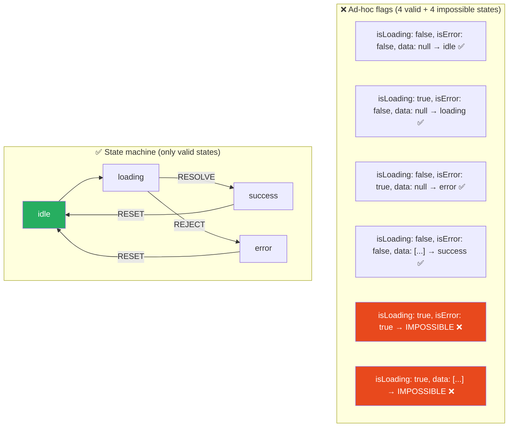
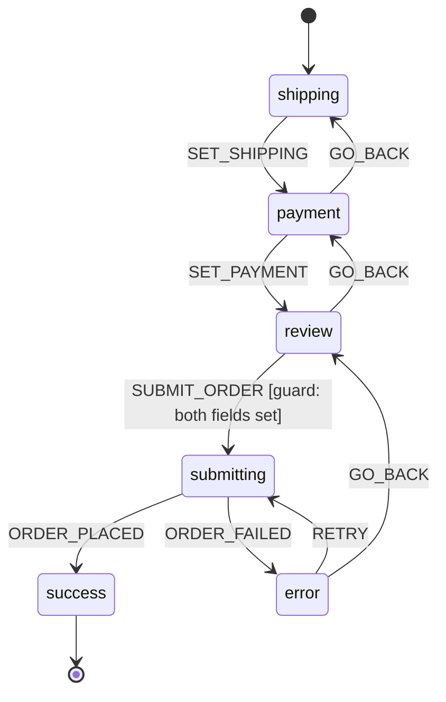

# 100 · State Machine Patterns

> **A finite state machine (FSM) is a mathematical model of computation that describes a system as being in exactly one of a finite number of states at any given time, transitioning between states in response to events according to explicitly defined rules. In React applications, state machines solve the class of bugs collectively called "impossible states" — when ad-hoc boolean flags and conditional logic allow the UI to be simultaneously "loading AND error" or "authenticated AND unauthenticated" — by making valid states and valid transitions the only ones that can exist. XState is the dominant library for state machines and statecharts in the JavaScript ecosystem. Understanding when state machines solve real problems, and when they're over-engineering, is the architectural judgment this document develops.**

The appeal of state machines in UI engineering isn't academic — it's the observation that a checkbox with a loading state (submitting) and an error state doesn't have 2 states, it has at least 4 (unchecked, checked, submitting, error) and often more (unchecked-was-previously-checked, submitting-from-unchecked-direction). Ad-hoc boolean combinations (`const [checked, isLoading, error, previousState]`) enumerate those states IMPLICITLY and make "impossible state" bugs nearly inevitable. State machines make those states EXPLICIT and make impossible states unrepresentable.

---

## Table of Contents

- [The Impossible State Problem](#the-impossible-state-problem)
- [What a Finite State Machine Is](#what-a-finite-state-machine-is)
- [useReducer as a Primitive State Machine](#usereducer-as-a-primitive-state-machine)
- [XState: Formal State Machines in JavaScript](#xstate-formal-state-machines-in-javascript)
- [Defining a Machine with createMachine](#defining-a-machine-with-createmachine)
- [Guards: Conditional Transitions](#guards-conditional-transitions)
- [Actions: Side Effects in State Transitions](#actions-side-effects-in-state-transitions)
- [Statecharts: Hierarchical and Parallel States](#statecharts-hierarchical-and-parallel-states)
- [Actors: Invoking Async Work from Machines](#actors-invoking-async-work-from-machines)
- [XState in React with useMachine](#xstate-in-react-with-usemachine)
- [When State Machines Are the Right Tool](#when-state-machines-are-the-right-tool)
- [Modeling a Multi-Step Form as a State Machine](#modeling-a-multi-step-form-as-a-state-machine)
- [State Machine Visualization and Debugging](#state-machine-visualization-and-debugging)
- [Architecture Diagrams](#architecture-diagrams)
- [Good Practices](#good-practices)
- [Bad Practices](#bad-practices)
- [Mental Model](#mental-model)
- [Common Misconceptions](#common-misconceptions)
- [Exercises](#exercises)
- [Further Reading](#further-reading)

---

## The Impossible State Problem

```tsx
// THE CLASSIC IMPOSSIBLE STATE BUG:

// A fetch-based component with ad-hoc boolean state:
function ProductList() {
  const [isLoading, setIsLoading] = useState(false);
  const [isError, setIsError] = useState(false);
  const [products, setProducts] = useState<Product[]>([]);

  // Q: Can isLoading AND isError be true simultaneously?
  // A: Yes — if setIsLoading(true) then setIsError(true) is called in
  //    succession before a re-render. This is an IMPOSSIBLE STATE in
  //    the UI's logical model (you can't be loading AND errored at once)
  //    but the code makes it representable.

  // Q: What does the UI render when both are true?
  // A: UNDEFINED BEHAVIOR — undefined because no developer intentionally
  //    designed for it, and the current implementation happens to show
  //    one or the other based on which conditional comes first in JSX.
}

// STATE ENUMERATION of three booleans:
// isLoading: false, isError: false, products: empty → IDLE (valid ✅)
// isLoading: true,  isError: false, products: empty → LOADING (valid ✅)
// isLoading: false, isError: true,  products: empty → ERROR (valid ✅)
// isLoading: false, isError: false, products: [...]  → SUCCESS (valid ✅)
// isLoading: true,  isError: true,  products: empty → IMPOSSIBLE ❌
// isLoading: true,  isError: false, products: [...] → IMPOSSIBLE ❌
// isLoading: false, isError: true,  products: [...] → IMPOSSIBLE ❌
// 3 booleans = 2³ = 8 possible states; 4 are valid, 4 are impossible
// but the code makes ALL 8 representable

// THE FIX — make impossible states unrepresentable:
type FetchState<T> =
  | { status: "idle" }
  | { status: "loading" }
  | { status: "error"; error: Error }
  | { status: "success"; data: T };

function ProductList() {
  const [state, setState] = useState<FetchState<Product[]>>({ status: "idle" });
  // Now: impossible states literally cannot be expressed in the type system.
  // status === 'loading' AND status === 'error' simultaneously? SyntaxError.
}
```

---

## What a Finite State Machine Is

```
FORMAL DEFINITION:
  A finite state machine M = (S, Σ, δ, s₀, F) where:
    S: finite set of states
    Σ: finite set of events (the "alphabet")
    δ: transition function δ: S × Σ → S (state × event → next state)
    s₀: initial state (s₀ ∈ S)
    F: set of final/accepting states (F ⊆ S)

INTUITIVE DEFINITION FOR UI:
  At any moment, the machine is in exactly ONE state.
  External events trigger transitions to new states.
  The rules governing which event causes which transition are
  EXPLICITLY DEFINED — unlisted events have no effect (or cause errors).

EXAMPLE: a toggle button
  States: { off, on }
  Events: { TOGGLE }
  Transitions:
    off + TOGGLE → on
    on  + TOGGLE → off
  Initial state: off

EXAMPLE: async data fetching
  States: { idle, loading, success, error }
  Events: { FETCH, RESOLVE, REJECT, RESET }
  Transitions:
    idle    + FETCH   → loading
    loading + RESOLVE → success
    loading + REJECT  → error
    error   + RESET   → idle
    success + RESET   → idle
    (all other event+state combinations: ignored / do nothing)
```

---

## useReducer as a Primitive State Machine

`useReducer` is React's built-in mechanism for state machine-like logic — it's not a full state machine library but represents the same principles:

```tsx
// useReducer as a simple state machine for async fetch:
type State<T> =
  | { status: "idle" }
  | { status: "loading" }
  | { status: "success"; data: T }
  | { status: "error"; error: string };

type Event<T> =
  | { type: "FETCH" }
  | { type: "RESOLVE"; data: T }
  | { type: "REJECT"; error: string }
  | { type: "RESET" };

function fetchReducer<T>(state: State<T>, event: Event<T>): State<T> {
  switch (state.status) {
    case "idle":
      if (event.type === "FETCH") return { status: "loading" };
      return state; // ignore other events in idle state

    case "loading":
      if (event.type === "RESOLVE")
        return { status: "success", data: event.data };
      if (event.type === "REJECT")
        return { status: "error", error: event.error };
      return state;

    case "success":
      if (event.type === "RESET") return { status: "idle" };
      if (event.type === "FETCH") return { status: "loading" }; // allow refetch
      return state;

    case "error":
      if (event.type === "RESET") return { status: "idle" };
      if (event.type === "FETCH") return { status: "loading" }; // allow retry
      return state;
  }
}

function ProductList() {
  const [state, dispatch] = useReducer(fetchReducer<Product[]>, {
    status: "idle",
  });

  const fetchProducts = async () => {
    dispatch({ type: "FETCH" });
    try {
      const data = await getProducts();
      dispatch({ type: "RESOLVE", data });
    } catch (e) {
      dispatch({ type: "REJECT", error: String(e) });
    }
  };

  return (
    <>
      {state.status === "idle" && <button onClick={fetchProducts}>Load</button>}
      {state.status === "loading" && <Spinner />}
      {state.status === "success" && <ProductGrid products={state.data} />}
      {state.status === "error" && (
        <ErrorDisplay
          message={state.error}
          onRetry={() => dispatch({ type: "RESET" })}
        />
      )}
    </>
  );
}
```

---

## XState: Formal State Machines in JavaScript

XState provides a full-featured state machine implementation with: hierarchical states, parallel states, guards, actions, invoked async services, visual tooling, and TypeScript types:

```bash
npm install xstate @xstate/react
```

```ts
import { createMachine, assign } from "xstate";

const fetchMachine = createMachine({
  id: "fetch",
  initial: "idle",
  context: {
    data: null as Product[] | null,
    error: null as string | null,
  },
  states: {
    idle: {
      on: {
        FETCH: "loading", // event FETCH → transition to loading state
      },
    },
    loading: {
      invoke: {
        id: "fetchProducts",
        src: "fetchProducts", // the actual async function (defined separately)
        onDone: {
          target: "success",
          actions: assign({
            data: ({ event }) => event.output, // store the resolved data
          }),
        },
        onError: {
          target: "error",
          actions: assign({
            error: ({ event }) => String(event.error),
          }),
        },
      },
    },
    success: {
      on: {
        RESET: { target: "idle", actions: assign({ data: null, error: null }) },
        FETCH: "loading",
      },
    },
    error: {
      on: {
        RESET: { target: "idle", actions: assign({ data: null, error: null }) },
        FETCH: "loading",
      },
    },
  },
});
```

---

## Defining a Machine with createMachine

```ts
// A more complete machine with guards and multiple context values:
import { createMachine, assign } from "xstate";

interface CheckoutContext {
  items: CartItem[];
  shippingAddress: Address | null;
  paymentMethod: PaymentMethod | null;
  orderId: string | null;
  error: string | null;
}

type CheckoutEvent =
  | { type: "SET_SHIPPING"; address: Address }
  | { type: "SET_PAYMENT"; method: PaymentMethod }
  | { type: "SUBMIT_ORDER" }
  | { type: "ORDER_PLACED"; orderId: string }
  | { type: "ORDER_FAILED"; error: string }
  | { type: "RETRY" }
  | { type: "GO_BACK" };

const checkoutMachine = createMachine({
  id: "checkout",
  initial: "shipping",
  context: {
    items: [],
    shippingAddress: null,
    paymentMethod: null,
    orderId: null,
    error: null,
  } as CheckoutContext,
  states: {
    shipping: {
      on: {
        SET_SHIPPING: {
          actions: assign({ shippingAddress: ({ event }) => event.address }),
          target: "payment",
        },
      },
    },
    payment: {
      on: {
        SET_PAYMENT: {
          actions: assign({ paymentMethod: ({ event }) => event.method }),
          target: "review",
        },
        GO_BACK: "shipping",
      },
    },
    review: {
      on: {
        SUBMIT_ORDER: {
          target: "submitting",
          // Guard: only proceed if both address and payment are set
          guard: ({ context }) =>
            context.shippingAddress !== null && context.paymentMethod !== null,
        },
        GO_BACK: "payment",
      },
    },
    submitting: {
      invoke: {
        src: "submitOrder",
        onDone: {
          target: "success",
          actions: assign({ orderId: ({ event }) => event.output.orderId }),
        },
        onError: {
          target: "error",
          actions: assign({ error: ({ event }) => String(event.error) }),
        },
      },
    },
    success: {
      type: "final", // terminal state — no further transitions
    },
    error: {
      on: {
        RETRY: "submitting",
        GO_BACK: "review",
      },
    },
  },
});
```

---

## Guards: Conditional Transitions

Guards are boolean conditions on transitions — the event is only accepted if the guard returns `true`:

```ts
const trafficLightMachine = createMachine({
  id: "traffic",
  initial: "red",
  states: {
    red: {
      on: {
        TIMER: {
          target: "green",
          guard: ({ context }) => context.pedestriansWaiting === 0,
          // Only transition to green if no pedestrians are waiting
        },
        PEDESTRIAN_CROSSING: {
          target: "red", // stays red
          actions: assign({
            pedestriansWaiting: ({ context }) => context.pedestriansWaiting + 1,
          }),
        },
      },
    },
    green: {
      /* ... */
    },
    yellow: {
      /* ... */
    },
  },
});
```

---

## Actions: Side Effects in State Transitions

```ts
// Actions are side effects that run when a transition occurs.
// XState distinguishes between "entry actions" (run on entering a state),
// "exit actions" (run on leaving a state), and "transition actions":

const loginMachine = createMachine({
  states: {
    authenticating: {
      entry: [
        // Run when entering 'authenticating' state:
        () => analytics.track("login_attempt_started"),
        assign({ loginAttempts: ({ context }) => context.loginAttempts + 1 }),
      ],
      exit: [
        // Run when leaving 'authenticating' state (any transition out):
        () => console.log("Login attempt ended"),
      ],
      on: {
        SUCCESS: {
          target: "authenticated",
          actions: [
            // Run specifically on this transition:
            assign({ user: ({ event }) => event.user }),
            () => analytics.track("login_success"),
          ],
        },
        FAILURE: {
          target: "error",
          actions: () => analytics.track("login_failure"),
        },
      },
    },
  },
});
```

---

## Statecharts: Hierarchical and Parallel States

Statecharts extend finite state machines with two powerful concepts:

```ts
// HIERARCHICAL STATES (nested states):
// A state can CONTAIN sub-states, inheriting parent transitions
const playerMachine = createMachine({
  initial: "stopped",
  states: {
    stopped: {
      on: { PLAY: "playing" },
    },
    playing: {
      // Nested states within 'playing':
      initial: "normal",
      states: {
        normal: {
          on: { FAST_FORWARD: "fastForward" },
        },
        fastForward: {
          on: { NORMAL: "normal" },
        },
      },
      // Parent-level transitions apply to ALL sub-states:
      on: {
        STOP: "stopped", // works whether in normal or fastForward
        PAUSE: "paused", // works whether in normal or fastForward
      },
    },
    paused: {
      on: {
        PLAY: "playing",
        STOP: "stopped",
      },
    },
  },
});
// playing.normal + STOP → stopped ✅
// playing.fastForward + STOP → stopped ✅ (parent transition inherited)
```

```ts
// PARALLEL STATES (multiple simultaneous active states):
// Useful for orthogonal state dimensions that evolve independently
const editorMachine = createMachine({
  type: "parallel", // runs ALL top-level states simultaneously
  states: {
    document: {
      initial: "clean",
      states: {
        clean: {
          on: { EDIT: "dirty" },
        },
        dirty: {
          on: { SAVE: "clean", DISCARD: "clean" },
        },
      },
    },
    selection: {
      initial: "none",
      states: {
        none: {
          on: { SELECT: "selected" },
        },
        selected: {
          on: { DESELECT: "none", SELECT: "selected" },
        },
      },
    },
    mode: {
      initial: "insert",
      states: {
        insert: {
          on: { ENTER_VISUAL: "visual" },
        },
        visual: {
          on: { EXIT_VISUAL: "insert" },
        },
      },
    },
  },
});
// Current state: { document: 'dirty', selection: 'selected', mode: 'visual' }
// All three dimensions tracked simultaneously and independently
```

---

## Actors: Invoking Async Work from Machines

```ts
// XState's "invoke" mechanism handles async operations as actors:
const userProfileMachine = createMachine({
  states: {
    loading: {
      invoke: {
        id: "loadUser",
        src: fromPromise(async ({ input }: { input: { userId: string } }) => {
          const response = await fetch(`/api/users/${input.userId}`);
          if (!response.ok) throw new Error("Failed to load user");
          return response.json();
        }),
        input: ({ context }) => ({ userId: context.userId }),
        onDone: {
          target: "loaded",
          actions: assign({ user: ({ event }) => event.output }),
        },
        onError: {
          target: "error",
          actions: assign({ error: ({ event }) => event.error.message }),
        },
      },
    },
  },
});
```

---

## XState in React with useMachine

```tsx
import { useMachine } from "@xstate/react";
import { checkoutMachine } from "./checkout-machine";

function CheckoutFlow() {
  const [state, send] = useMachine(checkoutMachine, {
    actors: {
      // Provide the actual implementation of the async service:
      submitOrder: fromPromise(async ({ input }) => {
        const result = await fetch("/api/orders", {
          method: "POST",
          body: JSON.stringify(input),
        });
        return result.json();
      }),
    },
  });

  return (
    <div>
      {/* Current state drives rendering: */}
      {state.matches("shipping") && (
        <ShippingForm
          onSubmit={(address) => send({ type: "SET_SHIPPING", address })}
        />
      )}
      {state.matches("payment") && (
        <PaymentForm
          onSubmit={(method) => send({ type: "SET_PAYMENT", method })}
          onBack={() => send({ type: "GO_BACK" })}
        />
      )}
      {state.matches("review") && (
        <OrderReview
          context={state.context}
          onSubmit={() => send({ type: "SUBMIT_ORDER" })}
          onBack={() => send({ type: "GO_BACK" })}
        />
      )}
      {state.matches("submitting") && <SubmittingOverlay />}
      {state.matches("success") && (
        <OrderConfirmation orderId={state.context.orderId} />
      )}
      {state.matches("error") && (
        <ErrorState
          error={state.context.error}
          onRetry={() => send({ type: "RETRY" })}
          onBack={() => send({ type: "GO_BACK" })}
        />
      )}
    </div>
  );
}
```

---

## When State Machines Are the Right Tool

```
✅ USE STATE MACHINES WHEN:
  - The UI has multiple distinct phases/steps (checkout flow, onboarding
    wizard, multi-step form) — the linear sequence is the state machine
  - State bugs are causing repeated production incidents (racing conditions,
    impossible UI states appearing in production)
  - The team is struggling to reason about all valid state combinations
  - You need to VISUALIZE the state transitions to communicate with
    non-engineers (XState's visualizer is invaluable for this)
  - Complex conditional logic is emerging in reducers or component render
    functions that's becoming hard to follow

❌ DON'T REACH FOR STATE MACHINES WHEN:
  - Simple boolean toggle (useLocalState is fine)
  - Server state managed by TanStack Query (it already has its own
    status: 'loading' | 'error' | 'success' pattern)
  - Two or three states with no complex guard logic (a simple enum
    state variable with a reducer handles this fine)
  - The "state machine" would have 2 states and 1 transition
    (this is just a boolean with extra vocabulary)

THE SIGNAL: when you find yourself drawing a diagram to explain
  the valid state combinations to a colleague, that diagram IS the
  state machine — consider encoding it in XState to make the
  diagram executable.
```

---

## Modeling a Multi-Step Form as a State Machine

```
CHECKOUT FLOW STATE MACHINE:

States:
  collecting-shipping → collecting-payment → reviewing-order
                                            → submitting-order
                                            → order-success (final)
                                            → order-error

Events:
  SUBMIT_SHIPPING, SUBMIT_PAYMENT, CONFIRM_ORDER,
  BACK, ORDER_PLACED, ORDER_FAILED, RETRY

WHY THIS IS A GOOD STATE MACHINE USE CASE:
  1. Clear linear state sequence (can't review without shipping)
  2. Multiple terminal states (success, abandoned)
  3. Error and retry paths that go BACK to specific steps
  4. Guard conditions (can't submit without both shipping and payment)
  5. Side effects on transitions (analytics tracking, API calls)
  6. The state diagram is useful for stakeholder communication
  7. Impossible states are real risks: "submitting AND reviewing simultaneously"

WHAT WOULD BE OVER-ENGINEERING:
  A checkbox that has normal/loading/error states (use TanStack
  Mutation's built-in status instead).
  A dropdown that's open or closed (useState(false) is sufficient).
  Any state with fewer than ~4 states and no guard logic.
```

---

## State Machine Visualization and Debugging

```
XSTATE VISUALIZER: https://stately.ai/viz

Features:
  - Paste any XState machine definition → visual state diagram
  - Interactive: send events and watch state transitions animate
  - Validates machine definition (detects unreachable states, etc.)
  - Export to PNG/SVG for documentation

XSTATE DEVTOOLS (browser extension):
  - Inspect all active machines in the current page
  - See current state, context values, history
  - Send events manually to debug specific state transitions
  - Time-travel through state transitions

STATELY STUDIO:
  - Full-featured GUI for designing state machines visually
  - Collaborative (share diagrams with teammates)
  - Export to XState code directly
  - Ideal for stakeholder communication ("here's the flow we're building")

DEBUGGING STRATEGY:
  The VISUALIZER is the single most powerful debugging tool for
  state machines — before adding console.logs, paste the machine
  into the visualizer and VERIFY that the diagram matches your
  mental model of what should happen. Many bugs are caught here
  before any code runs.
```

---

## Architecture Diagrams

### State machine vs ad-hoc boolean flags



### Checkout flow statechart



---

## Good Practices

### ✅ Good Practice — Encoding a complex wizard with guards and error recovery

```ts
/**
 * Good: A machine that explicitly defines every valid state,
 * uses guards to prevent invalid transitions, has clear error
 * recovery paths, and uses context to accumulate wizard data
 * without allowing partial/impossible context states.
 */
import { createMachine, assign, fromPromise } from "xstate";

interface WizardContext {
  step1Data: Step1Data | null;
  step2Data: Step2Data | null;
  step3Data: Step3Data | null;
  resultId: string | null;
  error: string | null;
}

const onboardingWizard = createMachine({
  id: "onboarding",
  initial: "step1",
  context: {
    step1Data: null,
    step2Data: null,
    step3Data: null,
    resultId: null,
    error: null,
  } as WizardContext,
  states: {
    step1: {
      on: {
        NEXT: {
          target: "step2",
          actions: assign({ step1Data: ({ event }) => event.data }),
          // No guard needed — step1 is always accessible
        },
      },
    },
    step2: {
      on: {
        NEXT: {
          target: "step3",
          actions: assign({ step2Data: ({ event }) => event.data }),
        },
        BACK: {
          target: "step1",
          // Preserve step1Data so the user doesn't lose their input
        },
      },
    },
    step3: {
      on: {
        SUBMIT: {
          target: "submitting",
          actions: assign({ step3Data: ({ event }) => event.data }),
          guard: ({ context }) =>
            context.step1Data !== null && context.step2Data !== null,
        },
        BACK: "step2",
      },
    },
    submitting: {
      invoke: {
        src: fromPromise(async ({ input }: { input: WizardContext }) => {
          const result = await submitOnboarding(input);
          return result.id;
        }),
        input: ({ context }) => context,
        onDone: {
          target: "complete",
          actions: assign({ resultId: ({ event }) => event.output }),
        },
        onError: {
          target: "error",
          actions: assign({ error: ({ event }) => event.error.message }),
        },
      },
    },
    complete: { type: "final" as const },
    error: {
      on: {
        RETRY: "submitting",
        BACK: "step3",
      },
    },
  },
});
```

---

## Bad Practices

### ⚠️ Bad Practice — Using XState for simple binary state

```ts
/**
 * Bad: Reaching for XState's full machinery for a simple toggle button
 * that has exactly two states. This adds real complexity, bundle size
 * (~10KB+ for XState), and cognitive overhead for a problem that
 * useState(false) solves in one line.
 */

// ❌ XState for a simple toggle (massively over-engineered)
const toggleMachine = createMachine({
  id: 'toggle',
  initial: 'off',
  states: {
    off: {
      on: { TOGGLE: 'on' },
    },
    on: {
      on: { TOGGLE: 'off' },
    },
  },
});

function ToggleButton() {
  const [state, send] = useMachine(toggleMachine);
  return (
    <button onClick={() => send({ type: 'TOGGLE' })}>
      {state.matches('on') ? 'On' : 'Off'}
    </button>
  );
}

/**
 * ✅ Correct: useState is the right tool for simple binary state
 */
function ToggleButton() {
  const [isOn, setIsOn] = useState(false);
  return (
    <button onClick={() => setIsOn(prev => !prev)}>
      {isOn ? 'On' : 'Off'}
    </button>
  );
}

/**
 * The general rule: add a state management tool when the
 * COMPLEXITY of the problem JUSTIFIES the tool's complexity.
 * A toggle with 2 states and 1 event: useState.
 * A checkout with 6 states, 8 events, guards, and async submission: XState.
 */
```

---

## Mental Model

> 💡 **The state machine mental model:**
>
> Think of a state machine like a **vending machine with clearly labeled buttons**. The vending machine is ALWAYS in one of a known set of states: idle (waiting for money), collecting-money (accumulating coins), dispensing (delivering the item), out-of-stock (nothing to give). Each state has clearly defined inputs it RESPONDS TO (idle + insert-coin → collecting-money) and clearly defined inputs it IGNORES (idle + select-item → still idle, because you haven't paid yet). The machine CANNOT be in two states simultaneously ("idle AND dispensing" is impossible — either the money is in or it isn't). The impossible state problem in UI is like a vending machine that can be simultaneously "waiting for money" AND "dispensing" — the machine would then try to dispense without payment, an undefined, unintended behavior. State machines prevent this by making simultaneous-incompatible-states unrepresentable in the machine's design.

---

## Common Misconceptions

### "State machines and statecharts are the same thing"

Finite state machines have a FLAT set of states. Statecharts (the David Harel formalism XState is based on) EXTEND FSMs with hierarchical states (states within states), parallel states (multiple active states simultaneously), history states, and deferred events. XState implements statecharts, which are more expressive than basic FSMs.

### "XState is only for very complex applications"

XState is most valuable for MODERATELY complex state (wizard flows, async operations with error/retry logic, multi-step processes) — not just extreme complexity. A checkout flow with 5 steps and error handling is a perfect XState use case in any application size.

### "State machines replace all useReducer usage"

State machines are a specific, formal subset of what useReducer can express. Many reducers don't need the full state machine formalism — a reducer without explicit state enumeration and guard logic works fine for simpler cases. XState's value is the additional structure (guards, hierarchy, visualization) for cases that need it.

### "Once I use XState, I don't need React's state at all"

XState manages COMPONENT-LEVEL or FEATURE-LEVEL machine state. Local ephemeral UI state (is this tooltip visible? what is this text field's current value?) still belongs in useState. XState machines and React's local state are complementary, serving different granularities.

### "State machines are only for UI/component code"

State machines are a general-purpose modeling tool — they can model business processes, server-side workflows, protocol implementations, game logic, and anything with clear states and transitions. In a Next.js context, a state machine could model a Server Action's workflow, an event-sourced domain model, or an API rate limiter's state.

---

## Exercises

### Exercise 1 — Identify impossible states in existing code

Take any React component that uses 2+ boolean state variables (`isLoading`, `isError`, `isSuccess`, etc.). Enumerate ALL possible combinations of those booleans. Label each combination as valid, impossible, or "theoretically impossible but technically representable." Redesign the state as a discriminated union (as shown in the Impossible State section).

### Exercise 2 — Model a traffic light as a state machine

Implement a traffic light with:

- States: red, green, yellow
- Timer-driven transitions (red → green → yellow → red)
- A "pedestrian button" that, when pressed during green, accelerates the transition to yellow
- The machine must prevent impossible states (can't be red AND green simultaneously)

Use either `useReducer` (simple) or `createMachine` (full XState). Draw the state diagram FIRST, then implement.

### Exercise 3 — Refactor a wizard to XState

Take a multi-step form you have (or a wizard with 3+ steps and validation). Identify:

1. All states the wizard can be in
2. All events that cause transitions
3. All guards (conditions that must be true for a transition to fire)
4. All actions (side effects on specific transitions)

Draw the statechart. Then implement it with XState's `createMachine` and `useMachine`. Use the Stately Visualizer to verify the diagram matches your drawing.

---

## Further Reading

- [XState documentation](https://stately.ai/docs) — comprehensive official documentation
- [Stately Visualizer](https://stately.ai/viz) — interactive state machine visualization
- [David Harel: Statecharts: A Visual Formalism for Complex Systems](https://www.sciencedirect.com/science/article/pii/0167642387900359) — the original academic paper (1987) that introduced statecharts
- [David Khourshid (XState author): No, disabling a button is not app logic](https://dev.to/davidkpiano/no-disabling-a-button-is-not-app-logic-598i) — why state machines make better UI logic
- [Kyle Shevlin: State Machines in React](https://kyleshevlin.com/state-machines-in-react) — practical introduction
- Related in this handbook: [Part IV: Hooks Internals](../hooks-internals/01-usestate.md), [80 · Redux Architecture](../state-management/02-redux.md)

---

_Part of the [React + Next.js Engineering Handbook](../../README.md)_
