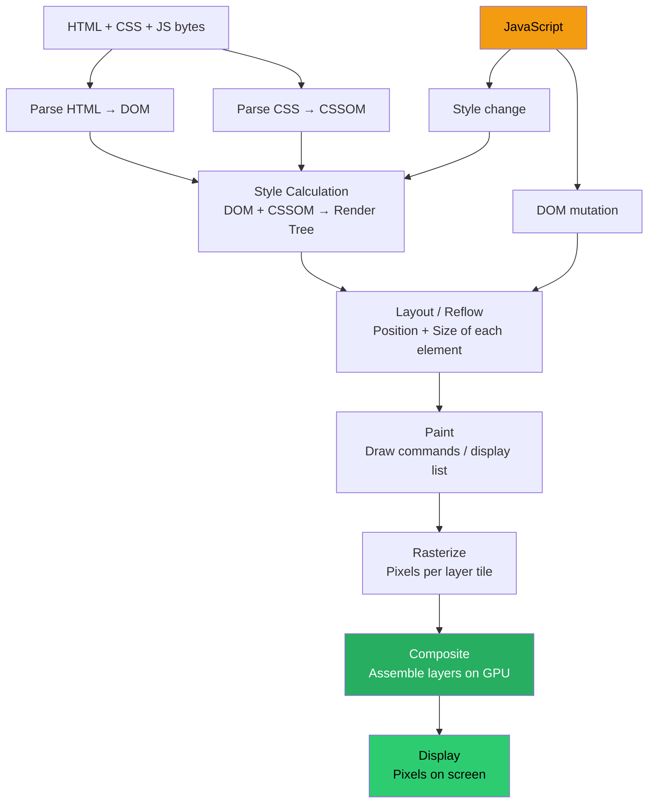
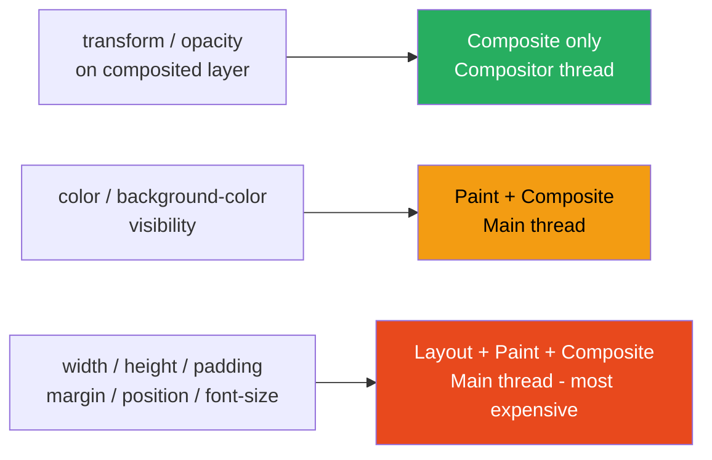

# 67 · Browser Rendering Pipeline

> **The browser rendering pipeline is the sequence of steps a browser takes to turn HTML, CSS, and JavaScript into pixels on the screen. Every React and Next.js performance optimization ultimately targets one or more stages of this pipeline — reducing the work done, moving that work earlier, or moving it off the main thread. Understanding the pipeline at the implementation level reveals why certain patterns are fast and others are slow: why layout thrashing causes jank, why transform animations don't cause reflow, why long JavaScript tasks block rendering, and what "60 frames per second" actually means for the main thread.**

The browser's rendering pipeline isn't one monolithic process — it's a series of distinct phases, each with its own data structures, cost profile, and optimization opportunities. React's virtual DOM, Next.js's streaming, the `will-change` CSS property, `IntersectionObserver`, `requestAnimationFrame` — all of these make more sense once you understand which pipeline stage they're targeting and why.

---

## Table of Contents

- [The Main Thread and the Compositor Thread](#the-main-thread-and-the-compositor-thread)
- [The Seven Stages of the Rendering Pipeline](#the-seven-stages-of-the-rendering-pipeline)
- [Stage 1: Parsing — HTML to DOM, CSS to CSSOM](#stage-1-parsing--html-to-dom-css-to-cssom)
- [Stage 2: Style Calculation](#stage-2-style-calculation)
- [Stage 3: Layout (Reflow)](#stage-3-layout-reflow)
- [Stage 4: Paint](#stage-4-paint)
- [Stage 5: Compositing](#stage-5-compositing)
- [JavaScript in the Pipeline](#javascript-in-the-pipeline)
- [The Frame Budget: 16.67ms at 60fps](#the-frame-budget-1667ms-at-60fps)
- [Critical Rendering Path](#the-critical-rendering-path)
- [Render Blocking vs Parser Blocking](#render-blocking-vs-parser-blocking)
- [GPU Composited Layers](#gpu-composited-layers)
- [DevTools: Reading the Performance Timeline](#devtools-reading-the-performance-timeline)
- [Architecture Diagrams](#architecture-diagrams)
- [Good Practices](#good-practices)
- [Bad Practices](#bad-practices)
- [Mental Model](#mental-model)
- [Common Misconceptions](#common-misconceptions)
- [Exercises](#exercises)
- [Further Reading](#further-reading)

---

## The Main Thread and the Compositor Thread

The browser rendering engine runs work on multiple threads, but two are most important for understanding performance:

```
MAIN THREAD:
  - Parses HTML and CSS
  - Executes JavaScript
  - Performs style calculation
  - Performs layout (reflow)
  - Generates paint records
  - Runs most of React's rendering work
  - Has exclusive access to the DOM

  THE BOTTLENECK: everything listed above competes for time on this
  single thread. JavaScript execution, React reconciliation, DOM
  mutations, layout calculations — all queue up and execute serially.
  This is why long JavaScript tasks (>50ms) cause visible jank:
  they block all other main-thread work including rendering.

COMPOSITOR THREAD:
  - Composites GPU-uploaded layer textures into the final frame
  - Handles scrolling (in most modern browsers, independently of main thread)
  - Handles CSS transform and opacity animations when composited
  - Runs INDEPENDENTLY of the main thread

  THE ADVANTAGE: compositor thread work doesn't compete with JS or
  React. Smooth scroll and `transform`/`opacity` animations can run
  at 60fps even when the main thread is busy — IF they use only
  compositor-thread-eligible properties.
```

This thread distinction is why `transform: translateX(100px)` is preferred over `left: 100px` for animations: transforms can run on the compositor thread (no main thread work after initial promotion), while `left` changes require re-layout on the main thread.

---

## The Seven Stages of the Rendering Pipeline

```
HTML/CSS/JS
    │
    ▼
1. PARSE
   HTML → DOM tree
   CSS → CSSOM tree
    │
    ▼
2. STYLE
   DOM + CSSOM → Render Tree
   (computed styles for each visible node)
    │
    ▼
3. LAYOUT (Reflow)
   Render Tree → Layout Tree
   (position and size of every element)
    │
    ▼
4. PAINT
   Layout Tree → Paint Records
   (ordered list of drawing instructions)
    │
    ▼
5. RASTERIZE
   Paint Records → Pixels
   (the actual pixel values, can be on GPU)
    │
    ▼
6. COMPOSITE
   Layer tiles → Final frame
   (assembled by compositor thread on GPU)
    │
    ▼
7. DISPLAY
   Frame buffer swapped to screen
```

Not every frame triggers all stages. This is the key insight for CSS animation performance:

```
Changing opacity or transform:
  → Only Composite (stages 6-7)
  → Cheapest possible path — compositor thread only

Changing background-color or color:
  → Paint + Rasterize + Composite (stages 4-7)
  → No layout recalculation needed, but painting happens

Changing width, height, padding, margin, position:
  → Layout + Paint + Rasterize + Composite (stages 3-7)
  → Most expensive — triggers reflow of potentially many elements
```

---

## Stage 1: Parsing — HTML to DOM, CSS to CSSOM

### HTML parsing

```
Browser receives bytes:
  Bytes → Characters (UTF-8 decoding)
  Characters → Tokens (HTML tokenizer: <div>, </div>, text nodes, etc.)
  Tokens → Nodes (each token becomes a node object)
  Nodes → DOM tree (parent-child relationships established)

Parsing is INCREMENTAL — the browser builds the DOM progressively
as bytes arrive. This is why streaming HTML (as Next.js does with
RSC) shows content progressively: the browser parses and renders
each chunk as it arrives, before the full document is received.

PARSER BLOCKING: when the HTML parser encounters a <script> tag
without async or defer, it STOPS parsing HTML until the script
is downloaded AND executed. This is why <script> tags at the end
of <body> or with defer/async matter for first-paint performance.
```

### CSS parsing and the CSSOM

```
When the parser encounters a CSS link or <style>:
  CSS bytes → Characters → CSS tokens → CSSOM nodes → CSSOM tree

CSSOM construction is NOT incremental:
  The browser CANNOT apply partial CSS — a later rule might override
  an earlier one. So the browser builds the entire CSSOM before
  applying any styles.

RENDER BLOCKING: CSS blocks rendering (not just parsing). A page
with an external stylesheet will NOT paint anything until that
stylesheet is fully downloaded AND parsed. This is why CSS is
render-blocking: you'd rather see a FOUT (flash of unstyled text)
than... well, an actual flash of unstyled text is exactly what
would happen without the block.

For Next.js: CSS-in-JS that extracts critical CSS into <style>
tags in the <head> avoids this problem by inlining what's needed
for first paint — no external stylesheet request required.
```

---

## Stage 2: Style Calculation

```
Input: DOM tree + CSSOM tree
Output: Render Tree (a subset of DOM, with computed styles)

The browser:
  1. Builds the Render Tree by combining the DOM with matching CSS
  2. For each DOM node: find all matching CSS rules (cascade)
  3. Resolve CSS values: em → px, currentColor → #hex, etc.
  4. Determine which nodes are visible (display:none → excluded)

The Render Tree:
  - Contains only visible nodes (no <head>, no display:none elements)
  - Each node has its fully computed style attached
  - Pseudo-elements (:before, :after) are added as nodes

CSS selector matching cost:
  Browsers match selectors RIGHT TO LEFT.
  For: .container .nav ul li a { color: red; }
    → Find all <a> elements
    → Check if parent is <li>
    → Check if ancestor is <ul>
    → Check if ancestor has class 'nav'
    → Check if ancestor has class 'container'
  Very broad selectors, especially universal selectors (*) and
  deeply nested selectors, are genuinely expensive for large DOMs.
```

---

## Stage 3: Layout (Reflow)

```
Input: Render Tree
Output: Layout Tree with position/size data

The browser:
  1. Walks the Render Tree top-down
  2. For each node: computes its exact position and dimensions
     in the page coordinate space (pixels)
  3. Accounts for the box model, flexbox, grid, float, positioning
  4. Stores the result (a Layout Box for each node)

REFLOW = re-executing the layout stage after the initial layout.
This happens whenever dimensions or positions might have changed:
  - DOM insertions or deletions
  - CSS width, height, padding, margin, border changes
  - Font size changes
  - Viewport resize
  - Reading certain DOM properties (offsetWidth, clientHeight, etc.)
    that FORCE a reflow to return an accurate answer

REFLOW is expensive because it's inherently sequential:
  - A child's size depends on its parent's computed size
  - A parent's size depends on its children's computed sizes
  - These dependencies can cascade through the entire tree

Scope of reflow:
  Global reflow: affects most/all of the layout tree (e.g., body resize)
  Incremental reflow: affects only a "dirty" subtree
    (e.g., adding a child to a deeply nested, contained element)
```

---

## Stage 4: Paint

```
Input: Layout Tree (with positions + sizes)
Output: Paint Records (display lists)

The browser:
  1. Walks the Layout Tree in "stacking context" order
  2. For each node: generates a list of draw commands
     (fill rect, draw text, draw border, clip, etc.)
  3. These records are stored as a "Display List" — an ordered,
     serializable list of drawing instructions

REPAINT = re-executing the paint stage.
  Triggered by visual changes that don't affect layout:
  - color, background-color changes
  - opacity changes (when not on compositor layer)
  - visibility changes
  - box-shadow, outline changes

REPAINT is cheaper than reflow (no position/size recalculation),
but it can still be expensive for large painted areas.

Note: paint doesn't immediately produce pixels — it produces
paint records (a display list). The actual pixel production
(rasterization) happens in a separate step, often on the GPU.
```

---

## Stage 5: Compositing

```
Input: Layer tiles (rasterized pixel data for each layer)
Output: Final composited frame, sent to the GPU

The compositor thread:
  1. Takes the rasterized tiles for each composited layer
  2. Assembles them into the final frame
  3. Handles transforms (translate, scale, rotate) at this step
  4. Handles opacity at this step
  5. Outputs the final frame to the GPU framebuffer

WHAT MAKES COMPOSITING SPECIAL:
  It runs on the compositor thread (separate from the main thread).
  During compositing, the main thread can be doing JavaScript,
  DOM manipulation, style calculation — and compositing still
  happens uninterrupted.

  This is why CSS animations using ONLY transform and opacity
  remain smooth even during heavy JavaScript work:
    → The compositor thread handles the animation each frame
    → The main thread's JavaScript work doesn't block it

  And why adding `position: fixed` to many elements can hurt
  scroll performance: each fixed element is its own compositor layer,
  and compositing many layers is still CPU/GPU work.
```

---

## JavaScript in the Pipeline

```
JavaScript execution happens on the main thread.
It can TRIGGER any stage of the rendering pipeline.

A JS operation that reads a layout property (offsetWidth):
  Forces the browser to complete any pending layout stage
  before returning — called "forced synchronous layout" or
  "layout thrashing" when done in a loop.

A JS operation that writes a DOM property:
  Marks the layout dirty — layout will re-run before the next paint.

THE DANGER OF READING AFTER WRITING:
  for (const box of boxes) {
    box.style.width = '100px';         // write → layout dirty
    console.log(box.offsetWidth);      // read → forces layout NOW
    // Next iteration: write → dirty, read → forces layout again
    // n iterations = n forced layouts
  }

  This is "layout thrashing" — arguably the most common performance
  bug in JavaScript-heavy UIs. React's virtual DOM batches DOM writes,
  then applies them all at once, reducing how often the browser
  must run through the layout stage.
```

---

## The Frame Budget: 16.67ms at 60fps

```
60 frames per second = one frame every 16.67ms

This is the budget for ALL main-thread rendering work per frame:
  JavaScript execution
  Style recalculation
  Layout
  Paint record generation

Plus overhead (browser internal work, ~2-4ms per frame).

Effective budget for your code: ~12-14ms per frame.

VISUAL JANK:
  If the main thread takes >16.67ms for a frame, the browser
  misses the display refresh window. The previous frame stays
  on screen for another 16.67ms. Users perceive this as "dropped
  frames" or "jank."

  The Performance panel in Chrome DevTools shows frames that
  exceeded this budget with a red triangle in the timeline.

WHAT 10MS OF JAVASCRIPT MEANS:
  10ms JS task leaves 6.67ms for all rendering work.
  Possible, but tight.

WHAT 100MS OF JAVASCRIPT MEANS:
  6 missed frames.
  Clearly perceptible jank to any user.
  The browser's "long task" threshold is 50ms — anything above
  this is marked in DevTools as a potentially jank-causing task.
```

---

## The Critical Rendering Path

The Critical Rendering Path (CRP) is the sequence of steps between receiving bytes and producing the first meaningful paint:

```
Bytes received
    │
    ├─► Parse HTML → DOM (incremental)
    │
    ├─► <link rel="stylesheet"> encountered
    │       │
    │       ▼
    │   Download + Parse CSS → CSSOM (render-blocking)
    │       │
    │       ▼
    │   DOM + CSSOM → Render Tree → Layout → Paint → Frame
    │
    └─► <script> (without defer/async) encountered
            │
            ▼
        STOP HTML parsing
        Download + Execute JavaScript (parser-blocking)
            │
            ▼
        Resume HTML parsing

OPTIMIZING THE CRP:
  1. Minimize render-blocking resources:
     - Inline critical CSS (no external request for above-fold styles)
     - Use font-display: optional or swap (fonts don't block text render)
     - Preload critical resources (<link rel="preload">)

  2. Minimize parser-blocking scripts:
     - Use defer (executes after HTML parsing completes)
     - Use async (executes as soon as downloaded, out-of-order)
     - Place scripts at end of body (legacy approach)

  3. Reduce CRP length:
     - Fewer render-blocking resources = faster first paint
     - Smaller HTML + CSS = faster parse
```

---

## Render Blocking vs Parser Blocking

These two concepts are related but distinct:

```
RENDER BLOCKING:
  Prevents the browser from displaying ANYTHING until resolved.
  CSS (external stylesheets) is render-blocking.
  Rationale: don't show the user unstyled content.

PARSER BLOCKING:
  Pauses HTML parsing until the resource is processed.
  Classic <script> tags (no defer/async) are parser-blocking.
  Rationale: JavaScript might call document.write() which could
  insert new HTML that would affect the parser state.

  Modern usage: script tags should almost always have defer or async.
  React's hydration script: Next.js handles this with defer.

PRELOAD:
  <link rel="preload" as="script" href="main.js">
  Tells the browser to start downloading the resource NOW (at high
  priority) but doesn't block parsing or rendering.
  The resource is available when the browser encounters the actual
  <script> or <link> tag later.

PREFETCH:
  <link rel="prefetch" href="/next-page.js">
  Tells the browser to download this resource at LOW priority
  for FUTURE use. Doesn't affect the current page's CRP.
  Used by Next.js's <Link> component for prefetching.
```

---

## GPU Composited Layers

Creating a GPU composited layer removes an element from the main-thread paint/layout flow and lets the compositor handle it independently:

```
WHAT CREATES A COMPOSITING LAYER:
  - will-change: transform (or any compositable property)
  - transform: translateZ(0) or translate3d(0,0,0) (legacy hack)
  - Animated opacity or transform (browser promotes automatically)
  - position: fixed elements
  - <video> and <canvas> elements
  - Elements with certain filters or mix-blend-mode values

BENEFIT:
  Operations that only affect composited layers don't require
  the full paint + composite pipeline. The compositor moves the
  layer's texture without involving the main thread.

COST:
  Each composited layer occupies GPU memory (VRAM).
  The compositor still has to assemble all layers each frame.
  Too many composited layers: GPU memory pressure, compositing overhead.

PRACTICAL RULE:
  Use will-change sparingly — only for elements that ARE CURRENTLY
  being animated. Don't apply it to everything "just in case."
  Abusing will-change is a real source of memory pressure bugs
  on mobile devices.
```

---

## DevTools: Reading the Performance Timeline

```
Chrome DevTools → Performance tab

HOW TO RECORD:
  1. Open DevTools, go to Performance tab
  2. Click ⟳ (record) or Ctrl+Shift+E
  3. Interact with the page / trigger the action you're measuring
  4. Click "Stop"

READING THE TIMELINE:
  Each row represents a thread or category.
  Main thread row: the most important for rendering performance.

  Color coding:
    Blue: Parsing (HTML, CSS)
    Purple: Style (recalculation + layout)
    Green: Paint (including rasterization)
    Yellow: JavaScript execution + compilation
    Gray: Other/idle

  A frame that exceeds 16.67ms budget:
    Red triangle in the top "Frames" row
    The task in the Main thread row will extend beyond the frame boundary

IDENTIFYING LAYOUT THRASHING:
  In the call tree for a JS task:
  → "Recalculate Style" and "Layout" entries appearing INSIDE a
    JavaScript task (not after it) indicate forced synchronous layout.
  → Repeated purple bars inside a yellow JS block = layout thrashing.

LONG TASKS:
  Any main-thread task >50ms is marked as a "Long Task" with a
  red diagonal stripe. Each long task is a potential jank source.
```

---

## Architecture Diagrams

### The rendering pipeline stages



### What each CSS property change triggers



---

## Good Practices

### ✅ Good Practice — Reading DOM properties in batches (avoiding layout thrashing)

```tsx
/**
 * Good: All DOM reads first, all DOM writes after.
 * "Read-Write Separation" — prevents forced synchronous layouts
 * in a loop by separating the read and write phases.
 */

// ✅ All reads first:
const widths = Array.from(elements).map((el) => el.offsetWidth);

// ✅ Then all writes:
elements.forEach((el, i) => {
  el.style.width = `${widths[i] * 2}px`;
});

// Similarly with requestAnimationFrame:
requestAnimationFrame(() => {
  // Reads:
  const height = container.offsetHeight;
  const width = container.offsetWidth;

  // Writes (in the same rAF callback, after all reads):
  element.style.transform = `translate(${width / 2}px, ${height / 2}px)`;
});
```

---

## Bad Practices

### ⚠️ Bad Practice — Layout thrashing in a loop

```tsx
/**
 * Bad: Reading a layout property (offsetWidth) immediately after
 * a DOM write (style.width) inside a loop.
 * Each iteration forces a synchronous layout recalculation.
 * n elements = n forced layouts = O(n²) behavior.
 */
function BAD_resizeElements(elements: HTMLElement[]) {
  for (const el of elements) {
    el.style.width = "200px"; // Write → DOM dirty, layout invalid
    console.log(el.offsetWidth); // Read → forces layout recalculation NOW
    // Next iteration: write + immediate read again
  }
  // For 100 elements: 100 forced layouts. Causes jank.
}

// Observed in the Performance panel:
// Yellow (JS) → Purple (Layout) → Yellow (JS) → Purple (Layout) → ...
// Repeated purple bars inside the JS task = the layout thrashing signature.

/**
 * ✅ Fix: batch all reads first, then all writes
 */
function GOOD_resizeElements(elements: HTMLElement[]) {
  // Phase 1: read everything
  const widths = Array.from(elements).map((el) => el.offsetWidth);

  // Phase 2: write everything (browser only layouts once after this block)
  elements.forEach((el, i) => {
    el.style.width = `${widths[i]}px`;
  });
}
```

---

## Mental Model

> 💡 **The browser rendering pipeline mental model:**
>
> Think of the pipeline as a **theatrical production**: Parsing (Stage 1) is the script being read and understood — the words become a cast list (DOM) and a staging notes document (CSSOM). Style Calculation (Stage 2) is the costume fitting — every actor gets their final look determined by the director's notes and their role. Layout (Stage 3) is blocking the play — every actor gets their exact position on stage determined. Paint (Stage 4) is the stage designer's work — "here, draw a red backdrop; here, write this text in black." Compositing (Stage 5) is the lighting and cinematography team layering those painted elements into the final shot. JavaScript is the director who can change any of these — but the crucial rule is that any time the director asks "where is Actor X standing right now?", the entire blocking team must stop and recalculate before answering. Asking this question frequently while simultaneously moving actors around (layout thrashing) grinds the production to a halt.

---

## Common Misconceptions

### "CSS animations are always smooth"

Only CSS animations that use compositable properties (`transform`, `opacity`) on elements that have been promoted to compositor layers are guaranteed to be smooth independently of main-thread work. CSS animations using `left`, `top`, `width`, `height`, or `color` still require main-thread layout/paint and can be janky during heavy JavaScript execution.

### "The DOM is slow"

The DOM itself (the object model) is reasonably fast. What's slow is the rendering pipeline triggered by DOM mutations — layout, paint, and composite. Writing to the DOM is fast; making the browser do layout work because of that write is the expensive part.

### "React's virtual DOM eliminates layout thrashing"

React's virtual DOM batches DOM writes (in a single commit phase), which reduces how often the browser needs to run layout. But code that reads from the DOM inside `useLayoutEffect` or directly inside event handlers can still cause forced synchronous layouts. React helps, but doesn't eliminate the need for read-write separation.

### "will-change makes everything faster"

`will-change` promotes elements to their own composited layer, which reduces the cost of ANIMATING those elements. But each composited layer uses GPU memory, and the compositor must assemble all layers each frame. Applying `will-change` to many elements simultaneously increases memory pressure and compositing overhead — net negative in the extreme.

### "60fps is always the target"

Modern displays commonly run at 90Hz, 120Hz, or higher. At 120fps, the frame budget is 8.33ms — roughly half of the 60fps budget. Performance budgets should be calibrated to the target device's actual display refresh rate, not hardcoded to 60fps.

---

## Exercises

### Exercise 1 — Observe the rendering pipeline in DevTools

1. Open Chrome DevTools → Performance tab
2. Record while scrolling a content-heavy page
3. Identify: which tasks appear on the main thread? How long is each?
4. Find a frame that exceeds 16.67ms (red triangle) — what task caused it?
5. Calculate: what percentage of frames are "jank frames" (>16.67ms)?

### Exercise 2 — Measure the cost of layout thrashing

```js
// Version A: layout thrashing
const elements = document.querySelectorAll(".box");
for (const el of elements) {
  el.style.width = "100px";
  el.offsetWidth; // forces layout
}

// Version B: batched reads and writes
const widths = Array.from(elements).map((el) => el.offsetWidth);
elements.forEach((el, i) => {
  el.style.width = `${widths[i]}px`;
});
```

Run both against 100 and 1000 elements. Record Performance timelines for each. Compare total task duration. What happens at 1000 elements?

### Exercise 3 — Profile a React render for layout triggering

Using React DevTools Profiler + Chrome DevTools Performance (record both simultaneously):

1. Trigger a state update that causes a re-render of a large list
2. Identify: does the React render task include any "Layout" sub-tasks?
3. If yes: find the DOM read that forced the synchronous layout

---

## Further Reading

- [Google Developers: Rendering Performance](https://web.dev/articles/rendering-performance) — comprehensive rendering performance guide
- [Jake Archibald: Tales of the Metadata Pixel](https://jakearchibald.com/2013/solving-rendering-perf-puzzles/) — practical rendering pipeline walkthrough
- [Paul Lewis: Jank Free](https://jankfree.org/) — performance fundamentals collection
- [Lin Clark: A Cartoon Intro to the Browser's Compositing](https://hacks.mozilla.org/2017/10/the-whole-web-at-maximum-fps-how-webrender-moves-to-the-gpu/) — GPU compositing explained visually
- [Chrome DevTools: Performance Analysis Reference](https://developer.chrome.com/docs/devtools/performance/) — DevTools guide for performance work
- Next in this handbook: [68 · Critical Rendering Path](./02-critical-rendering-path.md)

---

_Part of the [React + Next.js Engineering Handbook](../../README.md)_
