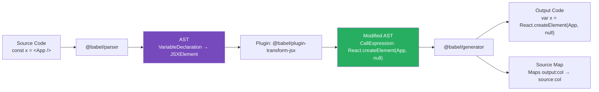
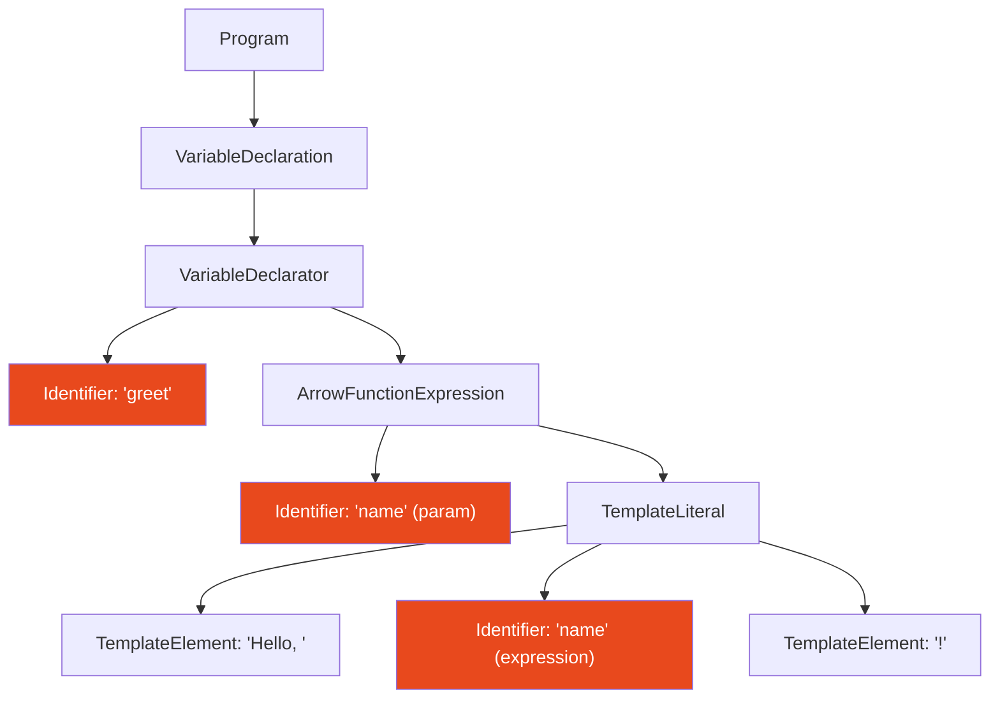

# 85 · AST Transformations & Babel

> **When you write JSX, TypeScript, or modern JavaScript features and the browser runs it without complaint, something transformed your code. That something is a compiler pipeline built on Abstract Syntax Trees (ASTs). The AST is the intermediate representation between your source code (characters) and the output code (different characters) — a structured data model of the code's meaning that can be traversed, analyzed, and modified in ways that text manipulation cannot. Babel is the JavaScript AST transformer that dominated the ecosystem for nearly a decade. Understanding how ASTs work and how Babel uses them is foundational knowledge for writing custom transforms, debugging mysterious compilation errors, and understanding why SWC/Turbopack are architecturally faster.**

The AST is not an abstraction you'll interact with every day — but it explains every "magic" thing in your build toolchain. How `import` becomes `require`. How JSX becomes `React.createElement`. How TypeScript types disappear. How `async/await` becomes state machine code. How your custom Babel plugin adds a data attribute to every JSX element for testing. All of these are AST transformations under the hood.

---

## Table of Contents

- [What an AST Is](#what-an-ast-is)
- [How Babel Works: Parse, Transform, Generate](#how-babel-works-parse-transform-generate)
- [The Babel AST Node Types](#the-babel-ast-node-types)
- [Visitors: How Transforms Traverse the AST](#visitors-how-transforms-traverse-the-ast)
- [Writing a Custom Babel Plugin](#writing-a-custom-babel-plugin)
- [JSX Transformation Deep Dive](#jsx-transformation-deep-dive)
- [TypeScript Erasure](#typescript-erasure)
- [Module Transformation: ESM to CommonJS](#module-transformation-esm-to-commonjs)
- [Babel Presets vs Plugins](#babel-presets-vs-plugins)
- [Babel in Next.js](#babel-in-nextjs)
- [Why SWC Replaced Babel in Next.js](#why-swc-replaced-babel-in-nextjs)
- [AST Explorer: The Essential Debug Tool](#ast-explorer-the-essential-debug-tool)
- [Architecture Diagrams](#architecture-diagrams)
- [Good Practices](#good-practices)
- [Bad Practices](#bad-practices)
- [Mental Model](#mental-model)
- [Common Misconceptions](#common-misconceptions)
- [Exercises](#exercises)
- [Further Reading](#further-reading)

---

## What an AST Is

An Abstract Syntax Tree is a tree representation of source code's structure, stripped of syntactically insignificant details (whitespace, parentheses, semicolons):

```js
// Source code:
const greet = (name) => `Hello, ${name}!`;

// AST representation (simplified):
{
  type: "Program",
  body: [{
    type: "VariableDeclaration",
    kind: "const",
    declarations: [{
      type: "VariableDeclarator",
      id: {
        type: "Identifier",
        name: "greet"
      },
      init: {
        type: "ArrowFunctionExpression",
        params: [{
          type: "Identifier",
          name: "name"
        }],
        body: {
          type: "TemplateLiteral",
          quasis: [
            { type: "TemplateElement", value: { raw: "Hello, ", cooked: "Hello, " } },
            { type: "TemplateElement", value: { raw: "!", cooked: "!" } }
          ],
          expressions: [{
            type: "Identifier",
            name: "name"
          }]
        }
      }
    }]
  }]
}
```

The "Abstract" in AST means it doesn't include every token — just the semantically meaningful nodes. `const x = 1 + 2` and `const x=(1+2)` produce the SAME AST (the parentheses are syntactically meaningful to the parser but absorbed into the tree structure, not preserved as explicit nodes).

### Why the AST matters for transformations

```
You COULD transform code with string manipulation:
  "const " → "var "  (ES6 const → ES5 var)

But string manipulation breaks on:
  "constant" → "variableanle" (oops — "const" is a substring)
  "const foo = const => {}" → "var foo = var => {}"  (oops again)
  Comments, strings, template literals containing "const"
  Contextual meaning: `const` as a keyword vs `const` in a variable name

AST transformations are SEMANTIC, not textual:
  The AST parser already knows which "const" is a keyword and which is
  a substring of an identifier. The transform operates on node types,
  not text matching — structural manipulation, not search-and-replace.
```

---

## How Babel Works: Parse, Transform, Generate

Babel's compilation is a three-phase pipeline:

```
SOURCE CODE
    │
    ▼
1. PARSE (babel-parser / @babel/parser)
   Source code string → AST
   - Tokenization: source → token stream (const, identifier, =, etc.)
   - Parsing: token stream → AST nodes
   - Result: a complete in-memory representation of the code's structure

    │
    ▼
2. TRANSFORM (plugin traversals)
   AST → modified AST
   - Each plugin receives the AST and a visitor object
   - Visitor: { NodeType: { enter/exit: (path) => void } }
   - Multiple plugins run sequentially, each modifying the AST
   - Order matters: plugins run before presets, presets run last-to-first

    │
    ▼
3. GENERATE (babel-generator / @babel/generator)
   Modified AST → output code string
   - Walks the AST and generates code string from nodes
   - Produces source maps (mapping output positions to source positions)
   - Result: the transformed JavaScript string ready for the browser
```

### The timing cost at each phase

```
For a typical React component file:
  Parse: ~5-20ms    (tokenize + build AST)
  Transform: ~1-5ms (plugin traversals)
  Generate: ~5-15ms (code generation)
  Total: ~11-40ms per file

At scale (project with 5,000 files):
  11ms × 5,000 = 55 seconds (minimum sequential)
  With parallelization: still 10-20 seconds
  Per save in watch mode: 1-5 files = 11-200ms (acceptable for hot reload)

This is why Next.js moved to SWC:
  SWC (Rust): parse ~1-3ms, transform ~0.2-1ms, generate ~1-3ms per file
  5,000 × 5ms = 25 seconds → 5,000 × ~5ms = 25s → but parallel in Rust:
  With Rayon (Rust parallelism): ~2-5 seconds total
```

---

## The Babel AST Node Types

Every construct in JavaScript corresponds to an AST node type. Key node types for React/Next.js developers:

```
STATEMENTS (executable instructions):
  VariableDeclaration     → const x = 1; / let y = 2; / var z = 3;
  ExpressionStatement     → myFunc(); (a statement wrapping an expression)
  ReturnStatement         → return <div />;
  ImportDeclaration       → import React from 'react';
  ExportNamedDeclaration  → export function Foo() {}
  ExportDefaultDeclaration→ export default function App() {}

EXPRESSIONS (produce a value):
  JSXElement              → <div className="foo">
  JSXAttribute            → className="foo"
  CallExpression          → React.createElement(...)
  ArrowFunctionExpression → () => {}
  TemplateLiteral         → `Hello ${name}`
  MemberExpression        → React.createElement (obj.property)
  Identifier              → myVariable, React, createElement
  StringLiteral           → 'hello', "world"
  NumericLiteral          → 42
  BooleanLiteral          → true, false
  NullLiteral             → null
  ObjectExpression        → { key: value }
  ArrayExpression         → [1, 2, 3]
  SpreadElement           → ...props

DECLARATIONS:
  FunctionDeclaration     → function foo() {}
  ClassDeclaration        → class MyClass extends React.Component {}

TYPESCRIPT NODES (babel/preset-typescript handles these):
  TSTypeAnnotation        → : string
  TSInterfaceDeclaration  → interface Props {}
  TSTypeAliasDeclaration  → type MyType = string | number
  TSAsExpression          → value as MyType
  TSNonNullExpression     → value!
```

---

## Visitors: How Transforms Traverse the AST

Babel uses the Visitor pattern for traversal. Your plugin provides a "visitor" — an object mapping node types to handler functions. Babel calls your handlers as it walks the tree:

```js
// A Babel plugin is a function that receives babel's API and returns a visitor
module.exports = function myPlugin(babel) {
  const { types: t } = babel; // babel.types has helper functions for creating nodes

  return {
    visitor: {
      // Called when Babel encounters an Identifier node:
      Identifier(path) {
        if (path.node.name === "foo") {
          // Rename all identifiers named 'foo' to 'bar':
          path.node.name = "bar";
        }
      },

      // Called when entering a JSXElement:
      JSXElement: {
        enter(path) {
          // Called when entering the node (top-down traversal)
          console.log("Entering JSX element");
        },
        exit(path) {
          // Called when exiting (after all children processed)
          console.log("Exiting JSX element");
        },
      },

      // Called for every function-like node (including ArrowFunctions):
      "FunctionDeclaration|ArrowFunctionExpression"(path) {
        // Pipe-separated: match multiple node types with one handler
      },
    },
  };
};
```

### The `path` object

```js
// path is NOT the raw AST node — it's a wrapper with rich API:
path.node           // the actual AST node
path.parent         // the parent node
path.parentPath     // the parent path (also a path object)
path.scope          // lexical scope information
path.type           // node type string ('Identifier', 'JSXElement', etc.)

// Navigation:
path.get('property')   // get a child path by property name
path.getSibling(0)     // get sibling path by index

// Replacement:
path.replaceWith(newNode)        // replace this node with another
path.replaceWithMultiple([...])  // replace with multiple nodes
path.remove()                    // remove this node

// Insertion:
path.insertBefore(newNode)       // insert before this node
path.insertAfter(newNode)        // insert after this node

// Traversal:
path.skip()   // don't traverse this node's children
path.stop()   // stop the entire traversal
```

---

## Writing a Custom Babel Plugin

A practical plugin that adds `data-testid` to every JSX element based on the component name:

```js
// babel-plugin-add-test-id.js
module.exports = function (babel) {
  const { types: t } = babel;

  return {
    name: "add-test-id",
    visitor: {
      JSXOpeningElement(path, state) {
        const elementName = path.node.name;
        let testId;

        // Get the component/element name:
        if (t.isJSXIdentifier(elementName)) {
          testId = elementName.name;
        } else if (t.isJSXMemberExpression(elementName)) {
          testId = `${elementName.object.name}.${elementName.property.name}`;
        } else {
          return; // skip unsupported name types
        }

        // Skip if already has a data-testid:
        const hasTestId = path.node.attributes.some(
          (attr) =>
            t.isJSXAttribute(attr) &&
            t.isJSXIdentifier(attr.name) &&
            attr.name.name === "data-testid",
        );
        if (hasTestId) return;

        // Only add in development:
        if (process.env.NODE_ENV === "production") return;

        // Add the attribute:
        path.node.attributes.push(
          t.jsxAttribute(
            t.jsxIdentifier("data-testid"),
            t.stringLiteral(testId),
          ),
        );
      },
    },
  };
};

// Usage in babel.config.js:
module.exports = {
  plugins: ["./babel-plugin-add-test-id.js"],
};
```

---

## JSX Transformation Deep Dive

JSX is not valid JavaScript — it's syntax sugar that Babel (or SWC) transforms into JavaScript function calls:

```jsx
// YOUR CODE (JSX):
function App() {
  return (
    <div className="container">
      <h1>Hello</h1>
      <Button onClick={handleClick} disabled={loading}>
        Click me
      </Button>
    </div>
  );
}
```

```js
// CLASSIC TRANSFORM (React 16 and earlier, requires import React):
import React from "react";

function App() {
  return React.createElement(
    "div",
    { className: "container" },
    React.createElement("h1", null, "Hello"),
    React.createElement(
      Button,
      { onClick: handleClick, disabled: loading },
      "Click me",
    ),
  );
}
```

```js
// NEW TRANSFORM (React 17+, automatic import, no manual React import needed):
import { jsx as _jsx, jsxs as _jsxs } from "react/jsx-runtime";

function App() {
  return _jsxs("div", {
    className: "container",
    children: [
      _jsx("h1", { children: "Hello" }),
      _jsx(Button, {
        onClick: handleClick,
        disabled: loading,
        children: "Click me",
      }),
    ],
  });
}
```

### JSX transformation rules

```
Rule 1: Element name determines the type argument
  Lowercase name → string (native DOM element): 'div', 'h1', 'button'
  Uppercase name → identifier (component reference): Button, MyComponent

Rule 2: Props become an object (second argument)
  className="foo"    → { className: 'foo' }
  onClick={fn}       → { onClick: fn }
  disabled           → { disabled: true }  (boolean shorthand)
  {...spread}        → Object.assign({}, spread, {...restProps})

Rule 3: Children become the 'children' prop (or additional arguments)
  Single child text: _jsx('h1', { children: 'Hello' })
  Multiple children: _jsxs('div', { children: [child1, child2] })
  (jsxs = jsx with multiple children)

Rule 4: Self-closing elements have no children
  <input type="text" /> → _jsx('input', { type: 'text' })
```

---

## TypeScript Erasure

Babel's `@babel/preset-typescript` is a TYPE ERASER, not a type checker:

```typescript
// TypeScript source:
interface User {
  id: string;
  name: string;
  role: "admin" | "user";
}

function greet(user: User): string {
  return `Hello, ${user.name}`;
}

const admin = { id: "1", name: "Alice", role: "admin" } as User;
```

```js
// After @babel/preset-typescript (type erasure only):
function greet(user) {
  // : User removed
  return `Hello, ${user.name}`;
}

const admin = { id: "1", name: "Alice", role: "admin" }; // `as User` removed
// NO type checking occurred — Babel doesn't know if this is type-safe
```

### Why this matters

```
Babel's TypeScript transform:
  ✅ Fast: just strips type annotations, no analysis required
  ❌ No type checking: type errors pass through silently
  ❌ Some TypeScript features not supported:
     - const enum (requires type information)
     - namespace merging (complex, discouraged anyway)

For type safety in Next.js projects:
  Use: tsc --noEmit in CI (or the next build's built-in type check)
  Babel (or SWC) transforms for speed
  tsc for type checking
  These are separate concerns run at different times
```

---

## Module Transformation: ESM to CommonJS

One of Babel's most historically important transforms is ES modules to CommonJS (needed for Node.js before native ESM support and for bundlers without native ESM):

```js
// ES Module (what you write):
import React from "react";
import { useState, useEffect } from "react";
export default function App() {}
export { App as MainApp };
```

```js
// CommonJS transform (what Babel produces for older targets):
"use strict";

const _react = require("react");
const _react2 = _interopRequireDefault(_react);
const { useState, useEffect } = require("react");

function App() {}

exports.default = App;
exports.MainApp = App;

function _interopRequireDefault(obj) {
  return obj && obj.__esModule ? obj : { default: obj };
}
```

This transform is why `import React from 'react'` (ESM) and `const React = require('react')` (CJS) both work in different contexts — they're ultimately the same underlying module, just accessed differently.

---

## Babel Presets vs Plugins

```
PLUGINS: individual transformations
  Each plugin handles ONE feature:
  @babel/plugin-transform-arrow-functions  → () => {} to function() {}
  @babel/plugin-transform-classes         → class Foo {} to function Foo() {}
  @babel/plugin-transform-jsx             → JSX to createElement

PRESETS: curated collections of plugins
  @babel/preset-env: transforms modern JS to target browser compatibility
    Uses browserslist to determine which transforms are needed
    Only transforms what the target browsers don't support

  @babel/preset-react: JSX + display names + fast refresh support

  @babel/preset-typescript: TypeScript type erasure

  Custom presets: companies create these for their internal conventions

ORDERING (counter-intuitive):
  Plugins run BEFORE presets.
  Plugins run FIRST TO LAST (in array order).
  Presets run LAST TO FIRST (in reverse array order).

  Why reverse for presets: historical compatibility — newer presets
  (added last in the array) should transform before older ones,
  and they're loaded in reverse to achieve this.
```

---

## Babel in Next.js

Next.js uses Babel for specific scenarios where SWC doesn't have coverage:

```js
// babel.config.js or .babelrc — used when present in Next.js project
// Next.js detects this file and uses Babel instead of SWC for those files

module.exports = {
  presets: ["next/babel"], // includes preset-env, preset-react, preset-typescript

  plugins: [
    // Custom transforms:
    ["babel-plugin-styled-components", { displayName: true, ssr: true }],
    [
      "module-resolver",
      {
        root: ["./src"],
        alias: { "@": "./src" },
      },
    ],
  ],
};
```

### When Next.js still uses Babel

```
Next.js uses SWC by default (much faster).
Babel is used when:
  1. A .babelrc or babel.config.js is present in the project root
     (Next.js detects this and falls back to Babel for all files)
  2. Specific features not yet ported to SWC:
     Relay, styled-components (partially), certain experimental flags

CONSEQUENCE:
  Adding a .babelrc DISABLES SWC for your entire project.
  Even one .babelrc entry forces Babel for everything.
  → Only add .babelrc when you actually need a Babel-only plugin.
  → Check if SWC has equivalent support before reaching for Babel.
```

---

## Why SWC Replaced Babel in Next.js

```
BABEL:
  Written in JavaScript, runs in Node.js
  Single-threaded by default (JavaScript's constraint)
  Each file: parse ~10ms, transform ~3ms, generate ~10ms
  10,000 files: ~230 seconds (without parallelization)
  Memory: garbage-collected heaps, GC pauses affect compilation

SWC (Speedy Web Compiler):
  Written in Rust, uses Rayon for native parallelism
  Multiple files processed simultaneously (real OS threads)
  Each file: parse ~1ms, transform ~0.2ms, generate ~1ms (~10x faster per file)
  10,000 files: parallelized to ~2-5 seconds depending on CPU cores
  Memory: deterministic allocation, no GC pauses

The difference at human scale:
  `next build` on a large project:
    With Babel: 60-120 seconds
    With SWC: 15-30 seconds
  `next dev` hot reload on file save:
    With Babel: 1-4 seconds
    With SWC: 100-400ms
```

The SWC transformation is semantically equivalent to Babel for all common use cases. The output code is functionally identical — only the speed of production differs.

---

## AST Explorer: The Essential Debug Tool

Before writing any Babel plugin, use the AST Explorer to understand the structure:

```
AST Explorer: https://astexplorer.net/

Steps:
1. Select Parser: @babel/parser (for Babel plugins)
                   or typescript (for TypeScript AST)
2. Paste your source code in the left panel
3. Hover over code → the corresponding AST node is highlighted in the right panel
4. Click any AST node → selects the corresponding code on the left

EXAMPLE USE CASE: "I want to transform JSX attributes"
1. Paste: <div className="foo" />
2. Click "className" in the code → AST shows: JSXAttribute with JSXIdentifier name
3. Click '"foo"' → AST shows: StringLiteral value
4. Now you know: target JSXAttribute nodes,
   check attr.name.name for the attribute name,
   access attr.value for the value

This 2-minute process saves hours of trial-and-error plugin writing.
```

---

## Architecture Diagrams

### Babel's three-phase compilation



### Plugin visitor traversal



---

## Good Practices

### ✅ Good Practice — A robust Babel plugin with AST Explorer-informed development

```js
/**
 * Good: A plugin that adds React.displayName to all components
 * for better debugging. Properly uses path API, checks for
 * existing attributes, and handles edge cases.
 * Developed using AST Explorer to understand the node structure first.
 */
module.exports = function addDisplayName(babel) {
  const { types: t } = babel;

  function getDisplayName(path) {
    const parent = path.parentPath;

    // const MyComponent = () => {}
    if (t.isVariableDeclarator(parent) && t.isIdentifier(parent.node.id)) {
      return parent.node.id.name;
    }

    // export default function MyComponent() {}
    if (t.isFunctionDeclaration(path) && path.node.id) {
      return path.node.id.name;
    }

    return null;
  }

  return {
    name: "add-display-name",
    visitor: {
      "FunctionDeclaration|ArrowFunctionExpression|FunctionExpression"(path) {
        // Only process components (return JSX):
        const returnStatement = path
          .get("body.body")
          .find?.((stmt) => t.isReturnStatement(stmt.node));
        if (!returnStatement?.node?.argument) return;
        if (
          !t.isJSXElement(returnStatement.node.argument) &&
          !t.isJSXFragment(returnStatement.node.argument)
        )
          return;

        const name = getDisplayName(path);
        if (!name) return;

        // Check if displayName already set:
        const parentScope = path.scope.parent;
        if (parentScope?.bindings[name]?.path.get("init.displayName")) return;

        // Add displayName assignment after the component:
        path.parentPath.insertAfter(
          t.expressionStatement(
            t.assignmentExpression(
              "=",
              t.memberExpression(
                t.identifier(name),
                t.identifier("displayName"),
              ),
              t.stringLiteral(name),
            ),
          ),
        );
      },
    },
  };
};
```

---

## Bad Practices

### ⚠️ Bad Practice — Adding a .babelrc just for one plugin without checking SWC first

```js
/**
 * Bad: Adding a babel.config.js to use styled-components' display name plugin,
 * without first checking if SWC's built-in support already handles it.
 * The consequence: the ENTIRE project loses SWC and falls back to Babel —
 * next dev startup goes from 2s to 15s, hot reload from 200ms to 2s.
 *
 * Always check: does SWC already support this, or is there a Next.js config
 * option that achieves the same without a .babelrc?
 */

// ❌ babel.config.js — added "just for styled-components"
module.exports = {
  presets: ["next/babel"],
  plugins: [
    "babel-plugin-styled-components", // the only reason this file exists
  ],
};
// This file existing = ALL of Next.js's SWC optimization disabled.
// 3-10x slower builds for the entire team.

/**
 * ✅ Fix: SWC has built-in styled-components support since Next.js 12!
 */
// next.config.js — no .babelrc needed
module.exports = {
  compiler: {
    styledComponents: true, // SWC handles this natively
  },
};
// Delete the .babelrc entirely.
// SWC remains active. Builds stay fast.
```

**Production impact:** A team added `babel.config.js` when adopting styled-components, using the recommendation from the styled-components docs (which predated SWC). The team noticed Next.js was "much slower than before" — local dev builds that took 3 seconds were now taking 25 seconds, hot reload that was instant was now 2-3 seconds. Investigation revealed the `.babelrc` was disabling SWC. Removing it and using `compiler: { styledComponents: true }` in `next.config.js` restored SWC and cut build times back to baseline.

---

## Mental Model

> 💡 **The AST mental model:**
>
> Think of the AST transformation process as a **literary editor working with a manuscript**. The author writes the manuscript (your source code). Before publication, an editor creates a detailed structural outline of the manuscript (the AST): "Chapter 1 contains Scene A with Characters X and Y, Scene B with Character Z, and a plot twist." The editor can then apply transformations to this outline: "Replace all instances of Character X with Character Y," or "Add a scene to every chapter that begins with a confrontation." These changes are made to the OUTLINE (AST), not by searching the raw text — which would incorrectly change "Xavier" every time "Character X" appears. Once the editing is complete, the outline is used to generate the final manuscript (code generation). The editor (Babel) specializes in applying editorial rules (plugins) efficiently. A faster editor (SWC) works in parallel, reading multiple chapters at once — same editorial quality, much faster delivery.

---

## Common Misconceptions

### "Babel type-checks TypeScript"

Babel's `@babel/preset-typescript` only ERASES type annotations. It never checks whether the types are correct. TypeScript type errors don't stop Babel compilation. For type checking, run `tsc --noEmit` separately. Next.js does this during `next build`.

### "Adding a Babel plugin to Next.js only affects that plugin's output"

Adding ANY Babel configuration (`.babelrc`, `babel.config.js`) disables SWC for the ENTIRE project. Every file is now processed by Babel instead of SWC, regardless of which plugins you added. This is an all-or-nothing switch.

### "SWC does the same thing as Babel, just faster"

Functionally yes — the output is equivalent for supported transformations. But SWC doesn't support all Babel plugins. Custom Babel plugins, in particular, can't be run by SWC (they're JavaScript code running in the Babel pipeline; SWC is a Rust binary). If you have custom Babel plugins, you must use Babel.

### "The AST is just the source code in object form"

The AST is an ABSTRACT representation — it captures semantic structure, not literal text. Whitespace, parentheses (where they don't affect precedence), and semicolons may or may not appear in the AST depending on whether they're semantically meaningful. Two differently-formatted files with the same logical code produce the same AST.

### "Babel is deprecated"

Babel is actively maintained and widely used. It remains the correct choice for: custom plugins (not yet ported to SWC), specialized transforms, and environments where Rust-based tooling isn't available. SWC is preferred when Babel's features aren't specifically needed — not because Babel is deprecated.

---

## Exercises

### Exercise 1 — Explore JSX transformation in AST Explorer

1. Go to astexplorer.net
2. Set parser to `@babel/parser`, enable JSX
3. Paste: `const App = () => <div className="foo"><h1>Hello</h1></div>`
4. Map each part of the JSX to its AST node type
5. Enable the `@babel/plugin-transform-react-jsx` transform and observe
   how the AST changes from JSXElement to CallExpression

### Exercise 2 — Write a plugin that removes console.log in production

```js
// Write a Babel plugin that:
// 1. Finds all ExpressionStatements where the expression is
//    a CallExpression for console.log, console.warn, or console.error
// 2. Removes them from the AST (path.remove())
// 3. Only removes them when process.env.NODE_ENV === 'production'

// Test input:
// const x = 1;
// console.log('debug:', x);
// const y = x + 1;
// console.warn('This is a warning');

// Expected output (production):
// const x = 1;
// const y = x + 1;

// Use AST Explorer to find the correct node types first.
```

### Exercise 3 — Measure the SWC vs Babel speed difference

1. Take a Next.js project (or create a new one)
2. Run `next build` — note the time
3. Add a minimal `babel.config.js` with just `{ presets: ['next/babel'] }` (no custom plugins)
4. Run `next build` again — compare the time
5. Remove the `.babelrc`, run again to confirm the speed returns

---

## Further Reading

- [Babel Handbook](https://github.com/jamiebuilds/babel-handbook) — the definitive Babel plugin development guide by Jamie Kyle
- [AST Explorer](https://astexplorer.net/) — essential interactive tool for understanding AST structure
- [@babel/types documentation](https://babeljs.io/docs/babel-types) — all node builder functions
- [Babel plugin template](https://babeljs.io/docs/babel-template) — for creating AST nodes from strings
- [SWC docs](https://swc.rs/docs/configuration/compilation) — Next.js's Rust-based transform
- [Next.js docs: Compiler](https://nextjs.org/docs/architecture/nextjs-compiler) — SWC integration and built-in transforms
- Next in this handbook: [86 · SWC Architecture](./02-swc.md)

---

_Part of the [React + Next.js Engineering Handbook](../../README.md)_
