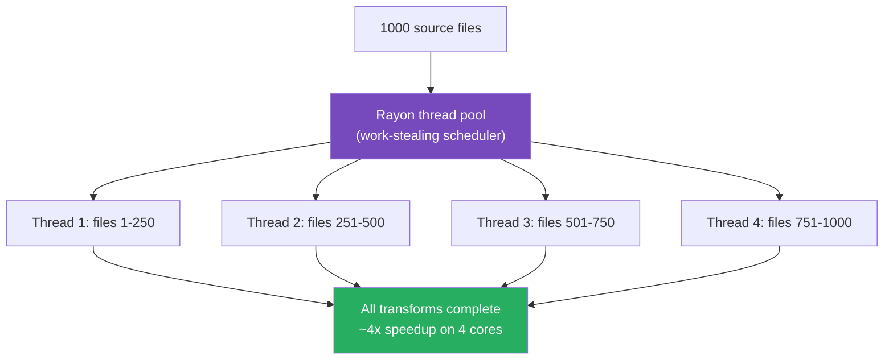
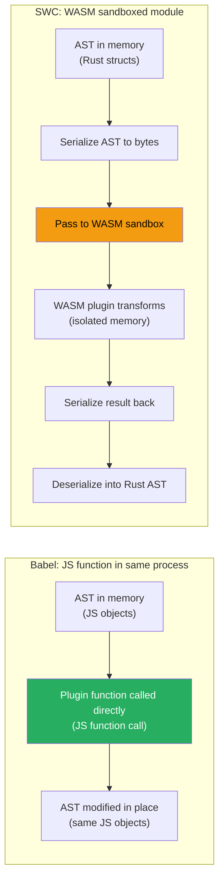

# 86 · SWC Architecture

> **SWC (Speedy Web Compiler) is a Rust-based platform for JavaScript and TypeScript compilation that has become the default transformer in Next.js, replacing Babel for the vast majority of projects. Where Babel's architecture is JavaScript-native and plugin-extensible via JavaScript functions, SWC is built for raw throughput: native code, parallel execution via Rust's Rayon library, and zero garbage-collection pauses. Understanding SWC's architecture clarifies why Next.js builds got dramatically faster, what SWC actually replaces (parsing/transforming, not bundling), and where its plugin model differs fundamentally from Babel's.**

SWC isn't a reimplementation of Babel's API in a faster language — it's an independently designed compiler that happens to solve the same category of problems (parse JS/TS, transform the AST, generate output) with different architectural choices that prioritize speed and predictable performance at scale.

---

## Table of Contents

- [What SWC Is and Isn't](#what-swc-is-and-isnt)
- [The Rust Architecture Advantage](#the-rust-architecture-advantage)
- [SWC's Compilation Pipeline](#swcs-compilation-pipeline)
- [SWC's Visitor Pattern vs Babel's](#swcs-visitor-pattern-vs-babels)
- [Configuring SWC in Next.js](#configuring-swc-in-nextjs)
- [Built-in SWC Transforms in Next.js](#built-in-swc-transforms-in-nextjs)
- [SWC Plugins: WASM-Based Extensibility](#swc-plugins-wasm-based-extensibility)
- [Writing a SWC Plugin in Rust](#writing-a-swc-plugin-in-rust)
- [The .swcrc Configuration File](#the-swcrc-configuration-file)
- [SWC's Minifier](#swcs-minifier)
- [Benchmarking SWC vs Babel vs esbuild](#benchmarking-swc-vs-babel-vs-esbuild)
- [When You Still Need Babel](#when-you-still-need-babel)
- [Architecture Diagrams](#architecture-diagrams)
- [Good Practices](#good-practices)
- [Bad Practices](#bad-practices)
- [Mental Model](#mental-model)
- [Common Misconceptions](#common-misconceptions)
- [Exercises](#exercises)
- [Further Reading](#further-reading)

---

## What SWC Is and Isn't

```
WHAT SWC IS:
  A compiler toolkit (parser + transformer + code generator) for
  JavaScript and TypeScript, written in Rust.
  Used by Next.js (as the default `next/swc` transform), Deno,
  Parcel, and others.

WHAT SWC IS NOT:
  - A bundler (it doesn't resolve module graphs or create chunks —
    that's Webpack's or Turbopack's job)
  - A dev server (it doesn't serve files or handle HMR — the framework does)
  - A drop-in replacement for ALL Babel plugins (different plugin model)

THE DIVISION OF LABOR IN NEXT.JS:
  SWC: parses, transforms (JSX, TS, modern JS), minifies
  Webpack or Turbopack: bundles, resolves modules, creates chunks,
                          handles code splitting
  Together: SWC replaces Babel's role within Webpack's pipeline,
            or operates natively within Turbopack
```

---

## The Rust Architecture Advantage

```
WHY RUST MAKES SWC FASTER THAN BABEL (JAVASCRIPT):

1. NO GARBAGE COLLECTION PAUSES
   JavaScript (V8): allocates objects on a managed heap, periodic GC
   pauses reclaim memory — these pauses are unpredictable and add
   latency to long-running compilation processes.
   Rust: ownership-based memory management at compile time, no runtime
   GC, deterministic memory deallocation when values go out of scope.

2. TRUE PARALLELISM
   JavaScript (Node.js): single-threaded event loop. "Parallel" work
   requires Worker Threads (separate V8 instances, expensive IPC for
   data transfer) or child processes.
   Rust (via Rayon): native OS threads sharing memory directly, work-
   stealing thread pool, near-zero overhead for parallel iteration.
   SWC processes MULTIPLE FILES on MULTIPLE CPU CORES simultaneously,
   with shared memory access (no serialization between threads needed).

3. ZERO-COST ABSTRACTIONS
   Rust's abstractions (iterators, pattern matching, generics) compile
   to code as efficient as hand-written low-level code — "zero cost"
   means using these abstractions has no runtime performance penalty.
   JavaScript's abstractions (array methods, destructuring, classes)
   have real runtime overhead, especially relevant in a hot loop like
   AST traversal that runs millions of times per compilation.

4. COMPILE-TIME OPTIMIZATION
   Rust's compiler (LLVM-based) performs aggressive optimization at
   compile time: inlining, dead code elimination, vectorization.
   JIT-compiled JavaScript (V8) optimizes at RUNTIME, which means the
   first N executions of any function are slower (before JIT warms up) —
   relevant for a compiler that processes many files, each one a "new"
   code path until JIT optimization kicks in.
```

---

## SWC's Compilation Pipeline

Structurally similar to Babel's, but each phase is dramatically faster:

```
SOURCE CODE
    │
    ▼
1. LEXER (swc_ecma_parser)
   Tokenizes source into a token stream.
   Rust's string handling (UTF-8 native, no string boxing overhead)
   makes this phase very fast.

    │
    ▼
2. PARSER (swc_ecma_parser)
   Token stream → AST.
   Hand-written recursive descent parser (not generated from a grammar),
   heavily optimized for the specific shape of JS/TS/JSX syntax.

    │
    ▼
3. TRANSFORMS (swc_ecma_transforms)
   AST → modified AST.
   Each transform is a Rust struct implementing the Visit/VisitMut trait.
   Transforms include: TypeScript stripping, JSX transform, ES target
   downleveling (arrow functions, classes, etc. for older browsers),
   and any WASM plugins.

    │
    ▼
4. CODE GENERATION (swc_ecma_codegen)
   Modified AST → output string + source map.
   Direct buffer writing (no intermediate string concatenation overhead).

    │
    ▼
5. MINIFICATION (optional, swc_ecma_minifier)
   Further AST-level optimization: dead code elimination, identifier
   shortening, constant folding — comparable to Terser but much faster.
```

---

## SWC's Visitor Pattern vs Babel's

Both use the visitor pattern, but the implementation differs significantly:

```rust
// SWC visitor (Rust) — using the Visit trait:
use swc_ecma_visit::{Visit, VisitWith};
use swc_ecma_ast::*;

struct RenameFoo;

impl Visit for RenameFoo {
    fn visit_ident(&mut self, ident: &Ident) {
        if &*ident.sym == "foo" {
            // In a real plugin, you'd use VisitMut to actually modify
            println!("Found identifier: foo");
        }
        ident.visit_children_with(self);
    }
}

// VisitMut for actual AST modification:
use swc_ecma_visit::VisitMut;

struct RenameFooToBar;

impl VisitMut for RenameFooToBar {
    fn visit_mut_ident(&mut self, ident: &mut Ident) {
        if &*ident.sym == "foo" {
            ident.sym = "bar".into();
        }
    }
}
```

```js
// Babel visitor (JavaScript) — equivalent logic:
module.exports = function () {
  return {
    visitor: {
      Identifier(path) {
        if (path.node.name === "foo") {
          path.node.name = "bar";
        }
      },
    },
  };
};
```

```
KEY DIFFERENCES:
  Babel: dynamically typed, runtime dispatch on node.type string
  SWC: statically typed, compile-time dispatch via Rust's trait system
       (the Rust compiler KNOWS at compile time which visit_* method
       handles which node type — no runtime string comparison needed)

  Babel: plugins are JavaScript functions, loaded and run in Node.js
  SWC: native plugins are Rust code, COMPILED INTO the swc binary,
       OR loaded as WASM modules (see plugin section below)
```

---

## Configuring SWC in Next.js

Next.js exposes SWC configuration through `next.config.js`, abstracting away the lower-level `.swcrc` format for common cases:

```js
// next.config.js
/** @type {import('next').NextConfig} */
module.exports = {
  compiler: {
    // Remove console.* calls in production (except console.error):
    removeConsole:
      process.env.NODE_ENV === "production" ? { exclude: ["error"] } : false,

    // styled-components support (built into SWC, no Babel needed):
    styledComponents: true,

    // Emotion support:
    emotion: true,

    // Remove React properties matching a regex (e.g., test-only props):
    reactRemoveProperties: { properties: ["^data-test-"] },

    // Relay support (GraphQL):
    relay: {
      src: "./src",
      language: "typescript",
      artifactDirectory: "./src/__generated__",
    },
  },
};
```

---

## Built-in SWC Transforms in Next.js

```
Next.js's SWC integration includes these transforms out of the box,
each replacing what used to require a Babel plugin:

next/babel preset equivalent → SWC built-in:
  @babel/preset-env           → SWC target-based downleveling
  @babel/preset-react         → SWC's JSX transform
  @babel/preset-typescript    → SWC's TypeScript transform
  styled-jsx (Next.js's CSS)  → built into SWC for Next.js
  babel-plugin-styled-components → compiler.styledComponents
  @emotion/babel-plugin       → compiler.emotion
  babel-plugin-transform-remove-console → compiler.removeConsole
  next/font Babel transform   → SWC built-in font optimization

REMAINING BABEL-ONLY (no SWC equivalent as of current Next.js):
  Custom organization-specific Babel plugins (your own AST transforms)
  Some highly specialized libraries' Babel plugins
  Babel macros (babel-plugin-macros ecosystem)
```

---

## SWC Plugins: WASM-Based Extensibility

SWC supports custom plugins, but the architecture is fundamentally different from Babel's:

```
BABEL PLUGIN MODEL:
  Plugin = JavaScript function
  Runs in the SAME process as Babel (Node.js)
  Direct function calls, shared memory, simple data passing

SWC PLUGIN MODEL:
  Plugin = Rust code compiled to WebAssembly (WASM)
  Runs in a SANDBOXED WASM RUNTIME within the SWC process
  Data passed via SERIALIZATION (the AST is serialized to bytes,
  passed to the WASM module, deserialized, transformed, re-serialized,
  passed back, deserialized again)

WHY THIS MATTERS:
  ✅ WASM plugins are SANDBOXED (can't access the filesystem directly,
     safer to run untrusted third-party plugins)
  ✅ WASM plugins are PORTABLE (same .wasm file works across platforms)
  ❌ Serialization overhead: passing the AST in and out of WASM has
     real cost — for a large AST, this can be slower than Babel's
     direct JS function calls
  ❌ Plugin development requires Rust knowledge (much smaller pool
     of developers who can write SWC plugins vs Babel plugins)
  ❌ The plugin ecosystem is MUCH smaller than Babel's — most
     specialized transforms simply don't have an SWC equivalent yet
```

---

## Writing a SWC Plugin in Rust

A minimal SWC plugin structure (illustrative — actual development requires the Rust toolchain and `swc_plugin` crate):

```rust
// Cargo.toml dependencies:
// swc_plugin = "0.90"
// swc_ecma_ast = "0.110"
// swc_ecma_visit = "0.96"

use swc_core::ecma::{
    ast::*,
    visit::{VisitMut, VisitMutWith},
};
use swc_core::plugin::{plugin_transform, proxies::TransformPluginProgramMetadata};

struct RemoveConsoleLog;

impl VisitMut for RemoveConsoleLog {
    fn visit_mut_stmts(&mut self, stmts: &mut Vec<Stmt>) {
        stmts.retain(|stmt| {
            if let Stmt::Expr(expr_stmt) = stmt {
                if let Expr::Call(call) = &*expr_stmt.expr {
                    if let Callee::Expr(callee_expr) = &call.callee {
                        if let Expr::Member(member) = &**callee_expr {
                            if let Expr::Ident(obj) = &*member.obj {
                                if &*obj.sym == "console" {
                                    return false; // remove this statement
                                }
                            }
                        }
                    }
                }
            }
            true // keep this statement
        });
        stmts.visit_mut_children_with(self);
    }
}

#[plugin_transform]
pub fn process_transform(
    mut program: Program,
    _metadata: TransformPluginProgramMetadata,
) -> Program {
    program.visit_mut_with(&mut RemoveConsoleLog);
    program
}
```

```js
// Usage in next.config.js:
module.exports = {
  experimental: {
    swcPlugins: [
      ["my-remove-console-plugin", {}], // path to compiled .wasm
    ],
  },
};
```

```
COMPILATION STEP (not shown): the Rust code above is compiled to WASM via:
  cargo build --target wasm32-wasi --release
This produces a .wasm file that Next.js loads as the plugin.
```

---

## The .swcrc Configuration File

For projects using SWC directly (outside Next.js's abstraction), `.swcrc` provides low-level configuration:

```json
{
  "jsc": {
    "parser": {
      "syntax": "typescript",
      "tsx": true,
      "decorators": false
    },
    "transform": {
      "react": {
        "runtime": "automatic",
        "development": false,
        "refresh": false
      }
    },
    "target": "es2020",
    "loose": false,
    "externalHelpers": false,
    "keepClassNames": false
  },
  "module": {
    "type": "es6"
  },
  "minify": false,
  "sourceMaps": true
}
```

```
KEY FIELDS:
  jsc.parser.syntax: "ecmascript" | "typescript" — which parser to use
  jsc.transform.react.runtime: "automatic" (new JSX transform) |
                                "classic" (React.createElement)
  jsc.target: the ECMAScript version to downlevel TO
              (es5, es2015, es2016, ..., es2022, esnext)
  module.type: "es6" | "commonjs" | "umd" | "amd" — output module format
  minify: whether to run the minifier
```

---

## SWC's Minifier

SWC includes a minifier as an alternative to Terser, used by default in Next.js production builds:

```
SWC MINIFIER CAPABILITIES:
  ✅ Identifier mangling (shortening variable names)
  ✅ Dead code elimination
  ✅ Constant folding (1 + 2 → 3 at compile time)
  ✅ Whitespace/comment removal
  ✅ Function inlining (small functions)
  ✅ Property mangling (optional, riskier)

PERFORMANCE COMPARISON (approximate, varies by codebase):
  Terser (JavaScript): baseline
  SWC minifier (Rust): 3-5x faster than Terser for equivalent output

NEXT.JS CONFIGURATION:
  next.config.js:
    swcMinify: true  // default since Next.js 13; can be set explicitly
                      // in older versions to opt into SWC's minifier
                      // over Terser
```

---

## Benchmarking SWC vs Babel vs esbuild

```
APPROXIMATE RELATIVE SPEEDS (compiling a large TypeScript/React codebase,
transform-only, not bundling):

  Babel:    1x (baseline)
  SWC:      ~20x faster
  esbuild:  ~20-30x faster (Go-based, similar architecture rationale to SWC)

WHY SWC AND ESBUILD ARE SIMILAR IN SPEED:
  Both are compiled-language implementations (Rust vs Go) with native
  parallelism and no GC pauses during single-file transforms. The
  similarity reflects that the SPEED CEILING is set by the compiled-
  language architecture, not by which specific compiled language.

WHY NEXT.JS CHOSE SWC OVER ESBUILD:
  SWC has more comprehensive TypeScript decorator support, deeper
  plugin extensibility ambitions (even though the ecosystem is still
  developing), and Vercel directly invested in and contributes to SWC
  (the maintainer, Donny/kdy1, was hired by Vercel) — meaning tighter
  integration and prioritized feature development for Next.js's needs.
```

---

## When You Still Need Babel

```
SCENARIOS REQUIRING BABEL DESPITE SWC's SPEED ADVANTAGE:

1. Custom organization-specific transforms:
   Your company has internal Babel plugins for code conventions,
   internationalization extraction, or custom JSX behaviors.
   → Rewriting these in Rust/WASM is a significant undertaking.

2. Specific library requirements:
   Some libraries (certain testing utilities, specific Babel macro
   packages) only ship Babel plugins.

3. Babel macros ecosystem:
   babel-plugin-macros-based libraries (preval.macro, graphql.macro)
   don't have SWC equivalents.

4. Highly specialized AST analysis tools:
   Tools that need deep JavaScript-based AST manipulation logic that's
   impractical to port to Rust.

THE TRADE-OFF:
  Adding Babel for ONE use case disables SWC for the ENTIRE project
  (in current Next.js architecture). This is the single most important
  consideration: is the specific Babel-only feature worth losing
  SWC's speed for ALL compilation in the project?

  Often, the better answer is: find an alternative approach that
  doesn't require the Babel-only feature, preserving SWC's speed.
```

---

## Architecture Diagrams

### SWC's parallel file processing model



### Babel vs SWC plugin execution model



---

## Good Practices

### ✅ Good Practice — Using built-in SWC compiler options instead of reaching for Babel

```js
/**
 * Good: A next.config.js that achieves common transform needs
 * entirely through SWC's built-in compiler options, with zero
 * Babel configuration. This keeps SWC active for the whole project.
 */

/** @type {import('next').NextConfig} */
module.exports = {
  compiler: {
    // Strip console.log in production, keep console.error for monitoring:
    removeConsole:
      process.env.NODE_ENV === "production"
        ? { exclude: ["error", "warn"] }
        : false,

    // CSS-in-JS support without Babel plugins:
    styledComponents: {
      displayName: true,
      ssr: true,
    },

    // Remove test-only data attributes from production builds:
    reactRemoveProperties:
      process.env.NODE_ENV === "production"
        ? { properties: ["^data-testid$"] }
        : false,
  },

  // No babel.config.js anywhere in the project.
  // next dev / next build use SWC at full speed for everything.
};
```

---

## Bad Practices

### ⚠️ Bad Practice — Writing a custom Babel plugin when an SWC built-in option exists

```js
/**
 * Bad: Implementing a custom Babel plugin (and thus disabling SWC
 * project-wide) to strip console.log statements — when Next.js's
 * SWC compiler option `removeConsole` does exactly this natively.
 */

// ❌ babel.config.js — entirely unnecessary
module.exports = {
  presets: ["next/babel"],
  plugins: ["./babel-plugin-remove-console.js"], // custom, hand-rolled
};

// babel-plugin-remove-console.js — reinventing a built-in feature
module.exports = function () {
  return {
    visitor: {
      CallExpression(path) {
        const callee = path.node.callee;
        if (
          callee.type === "MemberExpression" &&
          callee.object.name === "console"
        ) {
          path.remove();
        }
      },
    },
  };
};

/**
 * ✅ Fix: use the built-in SWC option, delete the Babel config entirely
 */
// next.config.js
module.exports = {
  compiler: {
    removeConsole: { exclude: ["error"] },
  },
};
// Result: SWC remains active. Build times return to baseline.
// No custom plugin code to maintain.
```

**The lesson:** before writing ANY custom Babel transform for a Next.js project, check the `compiler` options in `next.config.js` and the SWC plugin registry — the built-in option likely already exists and avoids the SWC-disabling cost entirely.

---

## Mental Model

> 💡 **The SWC mental model:**
>
> If Babel is a skilled translator working through a manuscript page by page with a dictionary and notepad (interpreted, dynamically dispatched, single-threaded), SWC is a translation company with a team of translators working simultaneously on different chapters, each using pre-compiled reference materials instead of looking things up on the fly (compiled, statically dispatched, parallelized). The WASM plugin system is like hiring an outside specialist translator for one unusual chapter — you have to ship the chapter to them in a sealed envelope (serialization), wait for their sealed response (deserialization), and the back-and-forth packaging takes time even though the specialist works fast. For most chapters (the built-in transforms), the in-house team handles everything natively and instantly. You only reach for the outside specialist (WASM plugin or, worse, switching the WHOLE project back to the single translator/Babel) when you have a truly unique requirement the in-house team can't handle.

---

## Common Misconceptions

### "SWC is a Next.js-specific tool"

SWC is a general-purpose JavaScript/TypeScript compiler usable independently of Next.js — it's used by Deno, Parcel, and as a standalone CLI tool (`@swc/cli`). Next.js is one prominent consumer, not the only one. Vercel sponsors SWC's development, but it's an open-source project usable anywhere.

### "Installing an SWC plugin is as easy as a Babel plugin"

Babel plugins are `npm install` + add to config. SWC plugins require either: (1) finding a pre-compiled WASM plugin published to npm (a small but growing ecosystem), or (2) writing Rust code and compiling it to WASM yourself (requiring the Rust toolchain). The barrier to entry is significantly higher.

### "SWC always produces faster runtime code than Babel"

SWC and Babel both compile to roughly equivalent OUTPUT for standard transforms — the runtime performance of the COMPILED code is essentially the same. SWC's speed advantage is in the COMPILATION process (build time), not the resulting code's execution speed.

### "next.config.js compiler options require SWC plugins under the hood"

Most `compiler` options (`removeConsole`, `styledComponents`, `emotion`, `reactRemoveProperties`) are implemented as NATIVE Rust transforms built directly into Next.js's SWC binary — not WASM plugins. They're as fast as any other built-in SWC transform, with none of the WASM serialization overhead.

### "You can mix SWC and Babel transforms on different files"

In current Next.js architecture, the presence of `.babelrc` or `babel.config.js` switches the ENTIRE project to Babel — there's no per-file or per-directory mixing of SWC and Babel within a single Next.js build.

---

## Exercises

### Exercise 1 — Compare build times with and without a Babel config

1. Create a Next.js project with several dozen components
2. Time `next build` (using SWC, the default)
3. Add a minimal `babel.config.js` with just `{ presets: ['next/babel'] }`
4. Time `next build` again
5. Calculate the percentage slowdown caused purely by the presence of the Babel config

### Exercise 2 — Replace a custom Babel plugin with a built-in SWC option

Find a Next.js project (or hypothetical setup) using a custom Babel plugin for a common task (removing console logs, adding test IDs, styled-components display names). Research whether `next.config.js`'s `compiler` options cover the same need. Document the migration.

### Exercise 3 — Explore SWC's playground

1. Visit the SWC playground (swc.rs has an online playground)
2. Paste TypeScript + JSX code
3. Adjust the `jsc.target` option between es5, es2017, and esnext
4. Observe how arrow functions, classes, and async/await are downleveled differently per target
5. Compare the output to what Babel's preset-env produces for the same targets (using browserslist)

---

## Further Reading

- [SWC official docs](https://swc.rs/) — comprehensive documentation
- [SWC plugin development guide](https://swc.rs/docs/plugin/ecmascript/getting-started) — Rust/WASM plugin tutorial
- [Next.js docs: Next.js Compiler](https://nextjs.org/docs/architecture/nextjs-compiler) — SWC integration in Next.js
- [Donny (kdy1)'s SWC announcement](https://github.com/swc-project/swc) — SWC project repository and history
- [SWC vs Babel benchmarks](https://github.com/swc-project/swc/tree/main/bench) — official benchmark suite
- Related in this handbook: [85 · AST Transformations & Babel](./01-ast-babel.md), [64 · Turbopack Architecture](../nextjs-core/08-turbopack.md)
- Next in this handbook: [87 · Webpack Internals](./03-webpack.md)

---

_Part of the [React + Next.js Engineering Handbook](../../README.md)_
