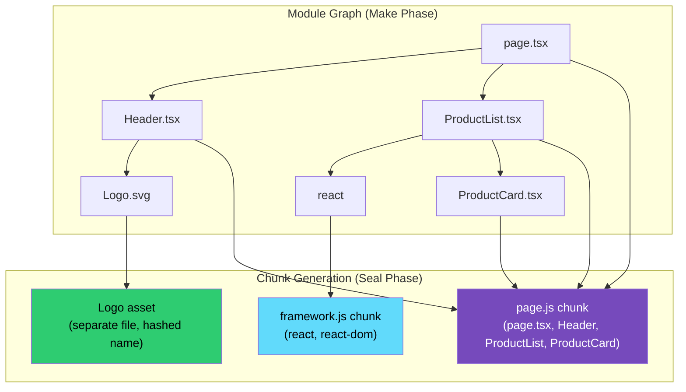
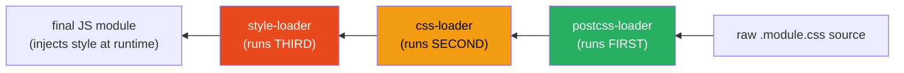

# 87 · Webpack Internals

> **Webpack remains Next.js's default production bundler even as Turbopack handles development builds — understanding its module graph construction, loader pipeline, and plugin system is essential for debugging build issues, writing custom configurations, and understanding what Turbopack is ultimately trying to replace. Webpack's core insight, revolutionary in 2012, was treating every asset — JavaScript, CSS, images, fonts — as a "module" in a unified dependency graph, enabling a single tool to bundle an entire application's static assets with consistent dependency resolution.**

Webpack's architecture is built on three extensibility points: loaders (transform individual files), plugins (hook into the broader compilation lifecycle), and the module resolution algorithm (determines what `import './x'` actually points to). Together these make Webpack simultaneously powerful and complex — understanding the architecture turns "webpack config is magic" into "webpack config is a predictable pipeline with well-defined extension points."

---

## Table of Contents

- [The Module Graph](#the-module-graph)
- [Compilation Lifecycle: Compiler and Compilation](#compilation-lifecycle-compiler-and-compilation)
- [Loaders: Per-File Transformation](#loaders-per-file-transformation)
- [The Loader Pipeline Order](#the-loader-pipeline-order)
- [Plugins: Compilation Lifecycle Hooks](#plugins-compilation-lifecycle-hooks)
- [Module Resolution Algorithm](#module-resolution-algorithm)
- [Chunk Generation and splitChunks](#chunk-generation-and-splitchunks)
- [The Hooks System (Tapable)](#the-hooks-system-tapable)
- [Writing a Custom Webpack Plugin](#writing-a-custom-webpack-plugin)
- [Webpack in Next.js: The webpack() Config Function](#webpack-in-nextjs-the-webpack-config-function)
- [Source Maps Generation](#source-maps-generation)
- [Why Webpack Is Slower Than Turbopack/esbuild](#why-webpack-is-slower-than-turbopackesbuild)
- [Architecture Diagrams](#architecture-diagrams)
- [Good Practices](#good-practices)
- [Bad Practices](#bad-practices)
- [Mental Model](#mental-model)
- [Common Misconceptions](#common-misconceptions)
- [Exercises](#exercises)
- [Further Reading](#further-reading)

---

## The Module Graph

Webpack's fundamental data structure is a directed graph where every node is a "module" — any file that can be required or imported:

```
ENTRY POINT: app/page.tsx
    │
    ├── imports './components/Header'
    │       └── imports './Logo.svg'        (treated as a module!)
    │       └── imports './header.module.css' (treated as a module!)
    │
    ├── imports './components/ProductList'
    │       └── imports 'react'
    │       └── imports './ProductCard'
    │               └── imports './utils/formatPrice'
    │
    └── imports './styles/globals.css'

Webpack builds this ENTIRE graph by:
  1. Starting at entry point(s)
  2. Parsing the file to find all import/require statements
  3. Resolving each import to an actual file path
  4. Recursively repeating for each discovered module
  5. Stopping when no new modules are discovered

The result: a complete graph of every file needed to run the application,
each node knowing its dependencies and dependents.
```

### Every file type becomes a module

```
This is Webpack's defining architectural choice: NOT just JavaScript.
  .js, .ts, .tsx     → JavaScript modules (via loaders/built-in)
  .css, .scss        → CSS modules (via css-loader, sass-loader)
  .svg, .png, .jpg   → Asset modules (via asset modules or file-loader)
  .json              → JSON modules (built-in support)
  .wasm              → WebAssembly modules
  .graphql           → GraphQL modules (via graphql-tag/loader)

Every "import './something'" statement, regardless of file type,
becomes an edge in the SAME unified module graph. This unification
is why Webpack can bundle CSS, images, and JS in one coherent pipeline
where any module can depend on any other module type.
```

---

## Compilation Lifecycle: Compiler and Compilation

Webpack has two core classes with a critical distinction:

```
COMPILER:
  Created ONCE per webpack() call.
  Represents the FULL webpack environment and configuration.
  Persists across multiple builds (in watch mode).
  Emits high-level lifecycle events: 'run', 'watchRun', 'done', etc.

COMPILATION:
  Created FRESH for each build.
  Represents ONE specific build's module graph, assets, and chunks.
  In watch mode: a NEW Compilation object is created for each rebuild,
  but the SAME Compiler persists.

const webpack = require('webpack');
const compiler = webpack(config); // Compiler created once

compiler.run((err, stats) => {
  // stats.compilation is the Compilation object for THIS run
});

compiler.watch({}, (err, stats) => {
  // Called on EVERY rebuild — each call has a fresh Compilation
  // but the SAME compiler instance and its plugins/state
});
```

### The compilation phases

```
1. MAKE PHASE
   Build the module graph starting from entry points.
   For each module: resolve → read file → apply loaders → parse →
   find dependencies → recurse.

2. SEAL PHASE
   The module graph is now complete. Webpack:
   - Determines chunks (groups of modules that ship together)
   - Applies optimizations (tree shaking, scope hoisting, splitChunks)
   - Generates the final asset content for each chunk

3. EMIT PHASE
   Write the generated assets (JS files, CSS files, source maps)
   to the output directory (.next/static/chunks/ for Next.js).
```

---

## Loaders: Per-File Transformation

Loaders transform individual files BEFORE they become part of the module graph. Conceptually similar to Babel/SWC's transform phase, but more general (handles non-JS files too):

```js
// webpack.config.js — loader configuration
module.exports = {
  module: {
    rules: [
      {
        test: /\.tsx?$/, // which files this rule applies to
        use: "swc-loader", // which loader transforms them
        exclude: /node_modules/,
      },
      {
        test: /\.module\.css$/,
        use: [
          "style-loader", // injects CSS into the DOM
          {
            loader: "css-loader", // resolves @import and url()
            options: { modules: true }, // CSS Modules support
          },
        ],
      },
      {
        test: /\.svg$/,
        type: "asset/resource", // built-in asset handling (Webpack 5+)
      },
    ],
  },
};
```

### How a loader function works

```js
// A loader is a function that receives source code and returns transformed code:
module.exports = function myLoader(source) {
  // 'this' is the loader context, with utilities:
  this.cacheable(); // mark as cacheable for incremental builds

  // Transform the source string:
  const transformed = source.replace(/console\.log\(.*\);?/g, "");

  return transformed;
};

// Async loaders use a callback:
module.exports = function myAsyncLoader(source) {
  const callback = this.async(); // signals async operation

  someAsyncTransform(source).then((result) => {
    callback(null, result); // (error, transformedSource, sourceMap?)
  });
};
```

---

## The Loader Pipeline Order

A critical, frequently-confusing detail: loaders for a single rule run RIGHT TO LEFT (bottom to top in array notation):

```js
{
  test: /\.module\.css$/,
  use: [
    'style-loader',  // runs THIRD (last) — injects into DOM
    'css-loader',    // runs SECOND — resolves imports, CSS Modules
    'postcss-loader', // runs FIRST — autoprefixer, etc.
  ],
}

// Execution order for a .module.css file:
// 1. postcss-loader: raw CSS → processed CSS (autoprefixed)
// 2. css-loader: processed CSS → JS module (exports class name mappings)
// 3. style-loader: JS module → JS that injects <style> tag at runtime

// MNEMONIC: loaders execute "bottom to top, right to left"
// Think of it as function composition: style(css(postcss(source)))
```

---

## Plugins: Compilation Lifecycle Hooks

Where loaders transform individual files, plugins hook into the BROADER compilation process — they can affect the entire build, not just one file:

```js
// webpack.config.js — plugin configuration
const HtmlWebpackPlugin = require("html-webpack-plugin");
const { BundleAnalyzerPlugin } = require("webpack-bundle-analyzer");

module.exports = {
  plugins: [
    new HtmlWebpackPlugin({ template: "./src/index.html" }),
    new BundleAnalyzerPlugin({ analyzerMode: "static" }),
  ],
};
```

### What plugins can do that loaders can't

```
LOADERS: transform ONE file's content (text in, text out)
  Cannot: see other modules, modify the chunk structure, add new
  assets unrelated to the current file, hook into compilation
  lifecycle events.

PLUGINS: hook into ANY point in the compilation lifecycle
  Can: read/modify the entire module graph, add/remove/modify chunks,
  inject additional assets (like HtmlWebpackPlugin generating index.html
  with the correct script tags), analyze the full bundle, modify
  the final output in arbitrary ways.

EXAMPLE OF PLUGIN-ONLY CAPABILITY:
  HtmlWebpackPlugin needs to know ALL the generated chunk filenames
  (which include content hashes, only known after the build completes)
  to inject the correct <script> tags into an HTML file. A loader,
  scoped to one file, has no visibility into this — only a plugin,
  hooking into the 'emit' phase after all chunks are generated, can
  do this correctly.
```

---

## Module Resolution Algorithm

When Webpack encounters `import Foo from './foo'`, the resolution algorithm determines exactly which file this points to:

```
RESOLUTION ALGORITHM (simplified):

1. Is it a relative path ('./foo', '../bar')?
   YES → resolve relative to the importing file's directory
   NO  → treat as a module (search node_modules, see below)

2. For relative/absolute paths, try in order:
   a. Exact file: './foo' if './foo' exists as a file → use it
   b. With extensions: './foo.tsx', './foo.ts', './foo.jsx', './foo.js'
      (configured via resolve.extensions)
   c. As a directory with an index file: './foo/index.tsx', etc.
   d. As a directory with package.json "main"/"module" field

3. For module imports ('react', '@mui/material'):
   a. Look in ./node_modules/react
   b. If not found, look in ../node_modules/react
   c. Continue walking UP the directory tree until found or reaching
      the filesystem root
   d. Within the package, check package.json's "exports", "module",
      "main" fields (in that priority order, roughly) to find the
      actual entry file

4. Path aliases (configured via resolve.alias or tsconfig paths):
   '@/components/Button' → resolved via the alias mapping BEFORE
   the standard algorithm runs
```

```js
// next.config.js — webpack resolve customization
module.exports = {
  webpack(config) {
    config.resolve.alias = {
      ...config.resolve.alias,
      "@": path.resolve(__dirname, "src"),
    };
    config.resolve.extensions = [
      ".tsx",
      ".ts",
      ".jsx",
      ".js",
      ...config.resolve.extensions,
    ];
    return config;
  },
};
```

---

## Chunk Generation and splitChunks

After the module graph is built, Webpack decides how to GROUP modules into output files ("chunks"):

```js
// next.config.js — advanced splitChunks customization (rarely needed)
module.exports = {
  webpack(config, { isServer }) {
    if (!isServer) {
      config.optimization.splitChunks = {
        chunks: "all",
        cacheGroups: {
          framework: {
            test: /[\\/]node_modules[\\/](react|react-dom|scheduler)[\\/]/,
            name: "framework",
            priority: 40,
            enforce: true,
          },
          lib: {
            test(module) {
              return (
                module.size() > 160000 &&
                /node_modules[\\/]/.test(module.identifier())
              );
            },
            name(module) {
              const hash = crypto.createHash("sha1");
              hash.update(module.identifier());
              return hash.digest("hex").substring(0, 8);
            },
            priority: 30,
            minChunks: 1,
            reuseExistingChunk: true,
          },
          commons: {
            name: "commons",
            minChunks: 2, // used by at least 2 entry points
            priority: 20,
          },
        },
      };
    }
    return config;
  },
};
```

### How splitChunks decides chunk boundaries

```
DEFAULT STRATEGY:
  1. Each route/page is its own chunk (entry-point-based splitting)
  2. node_modules dependencies used by 2+ chunks: extracted to a
     shared "vendor" or "framework" chunk
  3. Modules >160KB: get their own dedicated chunk (avoid one huge
     vendor blob)
  4. Dynamic imports (import()): automatically become separate chunks

THE GOAL: balance between
  - TOO FEW CHUNKS: one giant bundle, slow initial load, poor caching
    (any change invalidates the ENTIRE bundle's cache)
  - TOO MANY CHUNKS: HTTP overhead for many small requests, though
    HTTP/2 multiplexing mitigates this significantly
```

---

## The Hooks System (Tapable)

Webpack's plugin architecture is built on `tapable` — a library providing typed, synchronous and asynchronous hook points throughout the compilation lifecycle:

```js
// Tapable hook types used throughout Webpack:
const { SyncHook, AsyncSeriesHook, AsyncParallelHook } = require("tapable");

// SyncHook: plugins run synchronously, in registration order
compiler.hooks.compile.tap("MyPlugin", (params) => {
  console.log("Compilation starting");
});

// AsyncSeriesHook: plugins run asynchronously, ONE AT A TIME, in order
compiler.hooks.emit.tapAsync("MyPlugin", (compilation, callback) => {
  doSomethingAsync().then(() => callback());
});

// AsyncParallelHook: plugins run asynchronously, ALL AT ONCE
compiler.hooks.make.tapPromise("MyPlugin", async (compilation) => {
  await doSomethingAsync();
});
```

### Key lifecycle hooks

```
compiler.hooks.environment   → setup, before anything else
compiler.hooks.entryOption   → entry points configured
compiler.hooks.beforeRun     → before compiler.run() executes
compiler.hooks.run           → compiler.run() starting
compiler.hooks.compile       → a new Compilation object created
compiler.hooks.make          → the MAKE PHASE — module graph being built
compiler.hooks.afterCompile  → compilation complete, before emitting
compiler.hooks.emit          → about to write assets to disk
compiler.hooks.afterEmit     → assets have been written
compiler.hooks.done          → entire build complete
```

---

## Writing a Custom Webpack Plugin

```js
// A plugin that logs the total bundle size after each build:
class BundleSizeLogger {
  apply(compiler) {
    compiler.hooks.done.tap("BundleSizeLogger", (stats) => {
      const { assets } = stats.compilation;
      let totalSize = 0;

      for (const assetName in assets) {
        totalSize += assets[assetName].size();
      }

      console.log(`Total bundle size: ${(totalSize / 1024).toFixed(2)} KB`);
    });
  }
}

// next.config.js usage:
module.exports = {
  webpack(config) {
    config.plugins.push(new BundleSizeLogger());
    return config;
  },
};
```

```js
// A more advanced plugin that fails the build if bundle exceeds a limit:
class BundleSizeLimitPlugin {
  constructor(options) {
    this.maxSizeBytes = options.maxSizeKB * 1024;
  }

  apply(compiler) {
    compiler.hooks.emit.tapAsync(
      "BundleSizeLimitPlugin",
      (compilation, callback) => {
        const { assets } = compilation;
        let totalSize = 0;
        for (const name in assets) {
          if (name.endsWith(".js")) {
            totalSize += assets[name].size();
          }
        }

        if (totalSize > this.maxSizeBytes) {
          compilation.errors.push(
            new Error(
              `Bundle size ${(totalSize / 1024).toFixed(2)}KB exceeds limit of ${this.maxSizeBytes / 1024}KB`,
            ),
          );
        }

        callback();
      },
    );
  }
}
```

---

## Webpack in Next.js: The webpack() Config Function

```js
// next.config.js — the standard way to customize Webpack in Next.js
/** @type {import('next').NextConfig} */
module.exports = {
  webpack(config, context) {
    const {
      buildId, // unique identifier for this build
      dev, // true if `next dev`, false if `next build`
      isServer, // true for server bundle, false for client bundle
      defaultLoaders, // pre-configured loaders Next.js uses internally
      nextRuntime, // 'nodejs' | 'edge' | undefined
      webpack, // the webpack module itself (for accessing plugins)
    } = context;

    // Example: add a custom loader for .yaml files
    config.module.rules.push({
      test: /\.ya?ml$/,
      use: "yaml-loader",
    });

    // Example: different config for server vs client bundles
    if (!isServer) {
      config.resolve.fallback = {
        ...config.resolve.fallback,
        fs: false, // Node's 'fs' module doesn't exist in the browser
      };
    }

    // ALWAYS return the modified config:
    return config;
  },
};
```

```
IMPORTANT: this function is called MULTIPLE TIMES per build:
  - Once for the server bundle (isServer: true)
  - Once for the client bundle (isServer: false)
  - Once for the edge runtime bundle, if used (nextRuntime: 'edge')

Each call receives a FRESH config object for that specific bundle target.
Mutations should be conditional on `isServer`/`nextRuntime` where the
change should only apply to one target.
```

---

## Source Maps Generation

```js
// next.config.js
module.exports = {
  webpack(config, { dev }) {
    if (dev) {
      config.devtool = "eval-source-map"; // fast rebuild, good quality
    } else {
      config.devtool = "source-map"; // slower, but most accurate for production debugging
    }
    return config;
  },

  // Or use Next.js's built-in option:
  productionBrowserSourceMaps: true, // generates .map files for production
};
```

```
SOURCE MAP TYPES (devtool option), speed vs quality trade-off:

  eval                  → fastest, least accurate (good for dev)
  eval-source-map       → fast, accurate, larger memory use (good default for dev)
  cheap-source-map       → fast, line-only accuracy (no column info)
  source-map             → slowest, most accurate (best for production)
  hidden-source-map      → like source-map, but no //# sourceMappingURL
                            comment (map exists but isn't auto-loaded —
                            useful for uploading to error tracking services
                            without exposing source to end users)
```

---

## Why Webpack Is Slower Than Turbopack/esbuild

```
ARCHITECTURAL REASONS:

1. JavaScript execution (Node.js):
   Same fundamental limitation as Babel — single-threaded by default,
   GC pauses, JIT warmup costs.

2. Eager, not demand-driven:
   Webpack builds the COMPLETE module graph upfront (in dev mode too),
   unlike Turbopack's demand-driven approach (only compile what's
   actually requested).

3. Loader chain overhead:
   Each loader in a chain (postcss-loader → css-loader → style-loader)
   has function call overhead, string passing between loaders, and
   potential synchronous-to-asynchronous bridging costs.

4. Plugin hook overhead:
   The Tapable hook system, while powerful and flexible, adds
   indirection (hook registration, conditional dispatch) compared to
   a more direct, compiled pipeline.

5. No persistent caching by default (pre-Webpack 5):
   Webpack 5 added persistent caching (filesystem cache), which helps
   significantly, but it's coarser-grained than Turbopack's per-task
   incremental computation model.

WHY NEXT.JS STILL USES WEBPACK FOR PRODUCTION BUILDS (as of current state):
  Maturity: Webpack has 10+ years of edge-case handling, broad plugin
  ecosystem compatibility, and battle-tested optimization passes.
  Turbopack's production build mode is newer and still catching up
  in plugin/loader compatibility and edge-case coverage.
```

---

## Architecture Diagrams

### Webpack's module graph to chunk output



### Loader execution order



---

## Good Practices

### ✅ Good Practice — Targeted webpack customization scoped correctly to server/client

```js
/**
 * Good: A webpack() customization that correctly scopes changes
 * to the appropriate bundle target, avoiding bugs from applying
 * client-only fixes to the server bundle (or vice versa).
 */

/** @type {import('next').NextConfig} */
module.exports = {
  webpack(config, { isServer, dev }) {
    // Client-only: polyfill/fallback for Node.js built-ins
    // that don't exist in the browser
    if (!isServer) {
      config.resolve.fallback = {
        ...config.resolve.fallback,
        fs: false,
        net: false,
        tls: false,
      };
    }

    // Server-only: externalize a package that should use the
    // installed node_modules version rather than being bundled
    if (isServer) {
      config.externals = [...(config.externals || []), "sharp"];
    }

    // Both: add SVG handling (applies to whichever bundle imports SVGs)
    config.module.rules.push({
      test: /\.svg$/,
      use: ["@svgr/webpack"],
    });

    // Dev-only: faster source maps for quicker rebuilds
    if (dev) {
      config.devtool = "eval-source-map";
    }

    return config;
  },
};
```

---

## Bad Practices

### ⚠️ Bad Practice — Unconditional webpack mutations that break one bundle target

```js
/**
 * Bad: Applying a browser-only fallback configuration to BOTH
 * server and client bundles. This can mask real errors (a module
 * that genuinely needs 'fs' on the server now silently resolves
 * to an empty module) and cause confusing runtime failures.
 */

// ❌ No isServer check — applies the client-only fix to server too
module.exports = {
  webpack(config) {
    config.resolve.fallback = {
      fs: false, // ❌ server-side code that legitimately uses 'fs'
      net: false, // ❌ now silently fails or behaves unexpectedly
      tls: false,
    };
    return config;
  },
};

// Symptom: a Server Component using Node's `fs.readFile` for a
// legitimate server-side file read mysteriously fails, because
// the fallback silently replaced 'fs' with an empty/false module
// even in the SERVER bundle, where 'fs' is perfectly valid.

/**
 * ✅ Fix: scope the fallback to the client bundle only
 */
module.exports = {
  webpack(config, { isServer }) {
    if (!isServer) {
      config.resolve.fallback = {
        ...config.resolve.fallback,
        fs: false,
        net: false,
        tls: false,
      };
    }
    return config;
  },
};
```

---

## Mental Model

> 💡 **The Webpack mental model:**
>
> Webpack is like a **factory assembly line for a complex product made of many different materials**. The module graph is the bill of materials — a complete map of every part needed, sourced from where, and how parts depend on each other (the steering wheel needs the steering column, which needs the frame). Loaders are individual workstations along the line: one station (postcss-loader) treats the raw material, the next (css-loader) shapes it, the next (style-loader) attaches it to the assembly. Plugins are factory-wide systems — quality control sensors and packaging robots that don't work on one part but on the COMPLETE assembly: checking the finished product's weight (bundle size), generating the shipping label (HtmlWebpackPlugin), or rejecting products that don't meet spec (BundleSizeLimitPlugin). Tapable's hooks are the factory's control panel — switches at each stage of the line (compile, make, emit, done) where any system can register to be notified or intervene. The factory is thorough and handles enormous part variety reliably — but it's not the fastest possible factory, which is exactly the gap Turbopack's demand-driven, Rust-powered architecture targets.

---

## Common Misconceptions

### "Webpack and Babel/SWC do the same job"

Webpack BUNDLES (builds the module graph, resolves dependencies, splits chunks, outputs files). Babel/SWC TRANSFORM individual files' syntax (JSX → JS, TS → JS, modern → legacy JS). They're complementary: Webpack invokes SWC/Babel (via loaders, like `swc-loader` or `babel-loader`) as part of processing each JS/TS module, but Webpack itself doesn't understand JSX or TypeScript syntax.

### "Loaders and plugins are interchangeable extension mechanisms"

Loaders transform ONE FILE's content during the module graph construction. Plugins hook into the BROADER compilation lifecycle and can affect multiple files, the chunk structure, or generate entirely new assets. A loader cannot see the full module graph; a plugin can.

### "splitChunks always reduces bundle size"

`splitChunks` REORGANIZES code into different files for better CACHING and PARALLEL LOADING — it doesn't remove any code (that's tree shaking's job) or reduce total bytes shipped. More chunks ≠ less code; it means the SAME code is organized into more cacheable, independently-loadable pieces.

### "Webpack 5's persistent cache makes it as fast as Turbopack"

Webpack 5's filesystem cache significantly improves REBUILD speed (subsequent builds after the first), but the architecture is still fundamentally eager (builds the whole graph) rather than demand-driven. For COLD START (first build), Webpack is still substantially slower than Turbopack's near-instant startup.

### "You need to understand Webpack to use Next.js"

Next.js abstracts away most Webpack configuration for typical use cases — most projects never touch `next.config.js`'s `webpack()` function. Understanding Webpack internals becomes necessary specifically when: debugging unusual build errors, integrating libraries with non-standard build requirements, or optimizing bundle output beyond what Next.js's defaults provide.

---

## Exercises

### Exercise 1 — Trace the module graph for a small app

Take a small Next.js project (or create one with 5-10 components).
Run `next build` with `ANALYZE=true` (bundle analyzer).
Manually trace: which file imports which? Compare your manual trace
to what the bundle analyzer shows as the actual chunk groupings.

### Exercise 2 — Write a Webpack plugin

Write a custom Webpack plugin (using the `apply(compiler)` pattern) that:

1. Hooks into the `done` lifecycle event
2. Lists the top 5 largest assets by size
3. Logs a warning if any single JS asset exceeds 200KB

Add it via `next.config.js`'s `webpack()` function and verify it runs on `next build`.

### Exercise 3 — Debug a loader order issue

Given this (broken) configuration:

```js
{
  test: /\.css$/,
  use: ['css-loader', 'style-loader'], // WRONG ORDER
}
```

1. Explain why this order is incorrect (hint: review the loader pipeline order section)
2. Fix it
3. Add `postcss-loader` to the chain in the correct position

---

## Further Reading

- [Webpack official concepts docs](https://webpack.js.org/concepts/) — comprehensive official documentation
- [Webpack: Writing a Loader](https://webpack.js.org/contribute/writing-a-loader/) — loader development guide
- [Webpack: Writing a Plugin](https://webpack.js.org/contribute/writing-a-plugin/) — plugin development guide
- [Tapable documentation](https://github.com/webpack/tapable) — the hooks library underlying Webpack's plugin system
- [Webpack 5 release notes](https://webpack.js.org/blog/2020-10-10-webpack-5-release/) — persistent caching, module federation, and other major changes
- [Next.js docs: Custom Webpack Config](https://nextjs.org/docs/app/api-reference/config/next-config-js/webpack) — the webpack() function reference
- Related in this handbook: [64 · Turbopack Architecture](../nextjs-core/08-turbopack.md), [86 · SWC Architecture](./02-swc.md)
- Next in this handbook: [88 · Vite Internals](./04-vite.md)

---

_Part of the [React + Next.js Engineering Handbook](../../README.md)_
