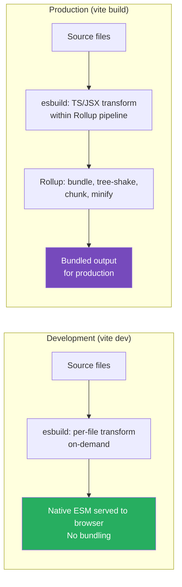

# 88 · Vite Internals

> **Vite (French for "fast") represents a fundamentally different architectural bet than Webpack or Turbopack: instead of bundling everything (even in development), Vite serves source files as native ES modules directly to the browser during development, letting the browser's own module loader handle resolution. Only for production builds does Vite bundle (via Rollup). This split — unbundled native-ESM development, bundled Rollup production — produces near-instant dev server starts regardless of project size, at the cost of architectural differences that matter when comparing to Next.js's bundled-everywhere approach. Understanding Vite's model clarifies an entirely different solution to the same "builds are slow" problem that Turbopack addresses differently.**

While this handbook is React/Next.js-focused, understanding Vite is valuable because it represents the conceptual alternative against which Turbopack and Webpack should be understood — and because Vite-based React frameworks (and increasingly, experimental Next.js/Vite integrations) are part of the broader frontend tooling landscape every senior engineer should understand.

---

## Table of Contents

- [The Bundle vs No-Bundle Philosophy](#the-bundle-vs-no-bundle-philosophy)
- [Native ESM in the Browser](#native-esm-in-the-browser)
- [Vite's Dev Server Architecture](#vites-dev-server-architecture)
- [Pre-Bundling Dependencies with esbuild](#pre-bundling-dependencies-with-esbuild)
- [The Module Graph in Vite's Dev Server](#the-module-graph-in-vites-dev-server)
- [Hot Module Replacement in Vite](#hot-module-replacement-in-vite)
- [Production Builds: Rollup Takes Over](#production-builds-rollup-takes-over)
- [Vite Plugins: Rollup-Compatible Interface](#vite-plugins-rollup-compatible-interface)
- [The transform and resolveId Hooks](#the-transform-and-resolveid-hooks)
- [Vite's CSS Handling](#vites-css-handling)
- [Vite vs Next.js: Architectural Comparison](#vite-vs-nextjs-architectural-comparison)
- [When Vite-Based Frameworks Make Sense](#when-vite-based-frameworks-make-sense)
- [Architecture Diagrams](#architecture-diagrams)
- [Good Practices](#good-practices)
- [Bad Practices](#bad-practices)
- [Mental Model](#mental-model)
- [Common Misconceptions](#common-misconceptions)
- [Exercises](#exercises)
- [Further Reading](#further-reading)

---

## The Bundle vs No-Bundle Philosophy

```
WEBPACK/TURBOPACK PHILOSOPHY (bundle, even in dev):
  Build a complete or partial module graph, generate chunk files,
  serve those chunks to the browser. The browser receives ALREADY-
  BUNDLED JavaScript — it has no awareness of your original file
  structure.

VITE PHILOSOPHY (don't bundle in dev):
  Serve source files essentially AS-IS (with light transformation)
  directly to the browser as native ES modules. The browser's OWN
  module resolution mechanism (import statements resolved via HTTP
  requests) handles what would otherwise be the bundler's job.

  Vite's dev server becomes mostly a FILE SERVER + ON-DEMAND
  TRANSFORMER, rather than a bundler.
```

```
WHY THIS MAKES VITE'S DEV SERVER START SO FAST:

Webpack/Turbopack (even Turbopack's demand-driven model) still need
to PARSE and TRANSFORM each file when first requested, building up
an internal module representation.

Vite's dev server, for the MOST PART, doesn't need to:
  - Resolve a complete dependency graph upfront
  - Bundle anything for first paint
  - Wait for module bundling before serving ANY content

It transforms files (TS → JS, JSX → JS) ON REQUEST, as the browser's
native ES module loader requests each file via HTTP — and the browser
does the "graph traversal" itself, by following import statements with
real HTTP requests.
```

---

## Native ESM in the Browser

Modern browsers support `<script type="module">` and native `import` statements, fetching each imported module as a SEPARATE HTTP request:

```html
<!-- index.html (Vite serves this with minor transformation) -->
<script type="module" src="/src/main.tsx"></script>
```

```tsx
// src/main.tsx
import React from "react";
import ReactDOM from "react-dom/client";
import App from "./App"; // browser will request /src/App.tsx separately
import "./index.css"; // browser will request /src/index.css separately

ReactDOM.createRoot(document.getElementById("root")!).render(<App />);
```

```
WHAT HAPPENS IN THE BROWSER:
  1. Browser requests /src/main.tsx (via <script type="module">)
  2. Vite's dev server intercepts: transforms TSX → JS, returns it
  3. Browser parses the JS, sees: import React from 'react'
  4. Browser requests /node_modules/.vite/react.js (Vite's pre-bundled path)
  5. Browser sees: import App from './App'
  6. Browser requests /src/App.tsx
  7. Vite transforms THIS file (TSX → JS), returns it
  8. Browser sees App.tsx's imports, requests those...
  9. This continues recursively — the BROWSER drives the graph traversal
     via real network requests, not Vite building a graph internally

KEY INSIGHT: Vite doesn't need to know the full dependency graph
upfront. Each file is transformed independently and on-demand,
exactly when the browser's module loader asks for it.
```

---

## Vite's Dev Server Architecture

```
Vite's dev server (built on Node's `http` + a tiny middleware stack
called connect) has these key responsibilities:

1. SERVE static files (public/ directory, as-is)

2. TRANSFORM on request:
   .tsx/.jsx/.ts → JavaScript (via esbuild, extremely fast)
   .css → JavaScript module that injects styles (with HMR support)
   .vue/.svelte → framework-specific compilation (for those frameworks)

3. REWRITE import specifiers:
   import React from 'react'  (bare specifier — invalid in browser ESM)
   becomes:
   import React from '/node_modules/.vite/deps/react.js' (valid URL)
   This rewriting happens during the transform step.

4. INJECT HMR client code:
   Each transformed module gets HMR boilerplate injected, enabling
   the module to accept hot updates without a full page reload.

5. SERVE the Vite HMR WebSocket connection:
   A persistent WebSocket connection between browser and dev server
   for pushing HMR updates when files change.
```

---

## Pre-Bundling Dependencies with esbuild

Vite makes one major EXCEPTION to "don't bundle in dev": third-party dependencies in `node_modules` ARE pre-bundled, using esbuild:

```
WHY PRE-BUNDLE NODE_MODULES DEPENDENCIES:

PROBLEM 1: Many npm packages ship CommonJS, not ESM.
  Native browser ESM can't directly import CommonJS modules.
  Pre-bundling converts CJS → ESM so the browser can import it.

PROBLEM 2: Some packages have MANY internal modules.
  lodash-es has 600+ separate files. If the browser had to make 600+
  HTTP requests just to load lodash-es, that's a massive waterfall
  even on a fast connection — far slower than ONE bundled file.

PROBLEM 3: Deep import chains within a single package.
  Some libraries have internal modules importing other internal
  modules many levels deep — pre-bundling collapses this into
  efficient, flat output.

WHAT VITE DOES:
  On first dev server start (or when dependencies change):
  1. Scans your source code for bare imports (import x from 'some-pkg')
  2. Uses esbuild to bundle EACH dependency into a single, optimized
     ESM file
  3. Caches the result in node_modules/.vite/deps/
  4. Browser imports from this pre-bundled cache (one file per package,
     not hundreds of small requests)

  This pre-bundling step is itself very fast because esbuild (Go-based,
  similar architectural advantages to SWC/Rust) processes node_modules
  packages in milliseconds to low seconds, even for large dependency trees.
```

---

## The Module Graph in Vite's Dev Server

Even though Vite doesn't bundle in dev, it DOES maintain an internal module graph — for HMR invalidation and dependency tracking:

```
Vite's ModuleGraph (internal data structure):
  Map<url, ModuleNode>

  ModuleNode = {
    url: string,                    // e.g. '/src/App.tsx'
    importers: Set<ModuleNode>,     // modules that import this one
    importedModules: Set<ModuleNode>, // modules this one imports
    transformResult: TransformResult | null, // cached transform output
    lastHMRTimestamp: number,
  }

This graph is built INCREMENTALLY as the browser requests files —
NOT eagerly upfront like Webpack's module graph. Each transform()
call updates the graph with the newly discovered import relationships.

USE OF THE GRAPH:
  When a file changes, Vite walks UP the importers chain to determine
  which modules need to be invalidated/re-transformed, and whether
  the change can be HMR'd or requires a full page reload.
```

---

## Hot Module Replacement in Vite

```tsx
// Vite's HMR API (used internally by framework plugins like @vitejs/plugin-react):
if (import.meta.hot) {
  import.meta.hot.accept((newModule) => {
    // Called when this module is updated
    // Framework plugins handle the actual component re-rendering
  });

  import.meta.hot.dispose(() => {
    // Cleanup before the module is replaced
  });
}
```

```
HOW VITE'S HMR ACHIEVES SPEED:

When a file changes:
  1. Vite's file watcher detects the change
  2. Re-transforms ONLY that file (not the whole graph)
  3. Looks up the ModuleNode's importers in the graph
  4. Determines the HMR BOUNDARY (the highest-level module that can
     accept the update without a full reload — usually the React
     component itself, thanks to React Fast Refresh integration)
  5. Sends a WebSocket message to the browser: "module X updated"
  6. Browser re-imports JUST that module (one HTTP request)
  7. Framework-specific HMR logic (React Fast Refresh) re-renders
     the affected component, PRESERVING STATE where possible

WHY THIS IS FASTER THAN WEBPACK'S HMR:
  No bundle regeneration. No re-running the entire bundling pipeline
  for the changed module's chunk. Just: re-transform one file,
  notify the browser, browser re-imports one file.
  Typical Vite HMR update: 10-50ms, regardless of project size.
```

---

## Production Builds: Rollup Takes Over

For production (`vite build`), Vite switches strategy entirely — using Rollup to bundle:

```
WHY NOT USE THE DEV-SERVER STRATEGY FOR PRODUCTION:
  Native ESM with hundreds of separate file requests is GREAT for
  dev (where HTTP/2 multiplexing + local network = negligible latency
  per request) but BAD for production (real network latency × many
  small requests = slow page loads for end users).

  Production needs: bundled, tree-shaken, minified, properly chunked
  output — exactly what Rollup excels at.

vite build:
  1. Uses Rollup (NOT esbuild) for the main bundling pass
     (Rollup has more mature tree-shaking and output control,
      despite esbuild being faster — quality over raw speed for
      the final production artifact)
  2. esbuild is still used for TS/JSX transformation WITHIN Rollup's
     pipeline (faster per-file transforms)
  3. Produces traditional bundled/chunked output, similar in spirit
     to Webpack's output (vendor chunks, route-based splitting, etc.)

THE DEV/PROD ARCHITECTURE SPLIT IS VITE'S DEFINING TRADE-OFF:
  Pro: blazing fast dev server start and HMR, regardless of project size
  Con: dev and production use DIFFERENT bundlers (esbuild-ish dev
       server vs Rollup prod build) — theoretically, dev and prod
       behavior could diverge in edge cases (rare in practice, but
       a real category of bugs: "works in dev, breaks in prod build")
```

---

## Vite Plugins: Rollup-Compatible Interface

Vite's plugin system deliberately extends Rollup's plugin interface, with additional Vite-specific hooks:

```ts
// A Vite plugin (also valid as a Rollup plugin, with extensions):
import type { Plugin } from "vite";

function myPlugin(): Plugin {
  return {
    name: "my-plugin",

    // Rollup-compatible hooks (work in both dev and build):
    resolveId(source, importer) {
      if (source === "virtual:my-module") {
        return source; // resolve a virtual module
      }
    },
    load(id) {
      if (id === "virtual:my-module") {
        return 'export default "Hello from virtual module"';
      }
    },
    transform(code, id) {
      if (id.endsWith(".special")) {
        return { code: transformSpecialFile(code), map: null };
      }
    },

    // Vite-specific hooks (dev server only):
    configureServer(server) {
      server.middlewares.use((req, res, next) => {
        // custom dev server middleware
        next();
      });
    },
    handleHotUpdate(ctx) {
      // custom HMR handling
      if (ctx.file.endsWith(".special")) {
        ctx.server.ws.send({ type: "custom", event: "special-update" });
        return [];
      }
    },
  };
}
```

```
WHY ROLLUP-COMPATIBLE MATTERS:
  Vite's plugin ecosystem can REUSE many existing Rollup plugins
  with little to no modification, since the core hook interface
  (resolveId, load, transform) is shared. This gave Vite a much
  larger initial plugin ecosystem than building from scratch would have.
```

---

## The transform and resolveId Hooks

These two hooks are the most important for understanding how Vite processes files:

```
resolveId(source, importer):
  Called when Vite needs to resolve an import specifier to an actual
  module ID (usually a file path).
  Input: the import string ('./Foo', 'react', 'virtual:config')
  Output: the resolved ID, or null/undefined to defer to other plugins

load(id):
  Called to get the RAW CONTENT of a resolved module ID.
  Useful for virtual modules (content that doesn't exist as a real file).
  Output: the source code string, or null/undefined to read from disk

transform(code, id):
  Called to TRANSFORM a module's content.
  Input: the raw source code and its resolved ID
  Output: { code: transformedCode, map: sourceMap }

THE PIPELINE FOR ONE IMPORT:
  import Foo from './Foo.special'
  1. resolveId('./Foo.special', currentFile) → '/src/Foo.special'
  2. load('/src/Foo.special') → raw file content (or plugin-provided)
  3. transform(rawContent, '/src/Foo.special') → JS code the browser can run
  4. Result sent to the browser as the response to its HTTP request
```

---

## Vite's CSS Handling

```
Vite has built-in support for:
  - Plain CSS: processed and injected via <style> tag (dev) or
    extracted to .css files (build)
  - CSS Modules: *.module.css automatically scoped
  - PostCSS: auto-detected from postcss.config.js
  - Sass/Less/Stylus: auto-installed-package detection (npm install sass)
  - CSS @import: resolved and inlined

DEV MODE CSS HANDLING:
  CSS is injected via JavaScript (a <style> tag manipulation) for HMR
  support — editing a CSS file updates styles WITHOUT a page reload,
  and without even a component re-render (pure CSS injection).

BUILD MODE CSS HANDLING:
  CSS is extracted into separate .css files (not inlined in JS),
  for proper browser caching and parallel loading — similar to
  Next.js's CSS extraction strategy.
```

---

## Vite vs Next.js: Architectural Comparison

```
                        VITE (+ React)      NEXT.JS
Dev server model:       Native ESM,         Turbopack (demand-driven
                         no bundling          bundling) or Webpack
                                              (eager bundling)

Production bundler:     Rollup              Webpack (Turbopack prod:
                                              in development as of
                                              current Next.js)

Routing:                Not built-in        File-system based (built-in)
                         (needs react-       App Router / Pages Router
                         router or similar)

Server rendering:       Not built-in         Built-in (App Router RSC,
                         (needs separate       SSR, SSG, ISR)
                         SSR setup or a
                         meta-framework)

Server Components:      Not supported        Core feature (App Router)
                         natively

API routes:             Not built-in         Built-in (Route Handlers)

Image optimization:     Not built-in         Built-in (next/image)

Deployment model:       Static or custom     Optimized for Vercel,
                         server setup          also self-hostable

WHEN VITE MAKES SENSE FOR A REACT APP:
  - Pure SPA with no server-rendering requirements
  - You want maximum control over routing/data-fetching architecture
  - Extremely fast local dev iteration is the top priority
  - You're building a tool/dashboard/internal app, not an SEO-sensitive
    public site

WHEN NEXT.JS MAKES SENSE:
  - You need SSR/SSG/ISR for SEO or performance
  - You want Server Components and the RSC data-fetching model
  - You want batteries-included: routing, API routes, image optimization
  - You're building a public-facing product where initial load
    performance and SEO matter
```

---

## When Vite-Based Frameworks Make Sense

```
The broader ecosystem includes Vite-based META-FRAMEWORKS that add
SSR/routing on top of Vite's dev server model:

  React Router (v7, formerly Remix): SSR + file-based routing on Vite
  TanStack Start: full-stack React framework on Vite + TanStack Router
  Astro: content-focused, multi-framework, built on Vite

These represent an alternative architectural lineage to Next.js:
  Next.js: integrated framework, Webpack/Turbopack, RSC-first
  Vite meta-frameworks: Vite's dev model + various SSR strategies,
                          generally less RSC-centric (though this is
                          evolving across the ecosystem)

For a React/Next.js engineering handbook, the practical takeaway:
  understanding Vite's architecture helps you evaluate WHEN a
  Vite-based alternative might suit a project better than Next.js —
  primarily for SPA-shaped applications without RSC/SSR requirements.
```

---

## Architecture Diagrams

### Vite dev server vs Webpack dev server request flow

```mermaid
graph TD
    subgraph "Webpack Dev Server"
        WA["Browser requests /"] --> WB["Webpack serves ONE bundle.js<br/>(pre-built from full graph)"]
        WB --> WC["Browser executes the entire bundle"]
    end

    subgraph "Vite Dev Server"
        VA["Browser requests /"] --> VB["index.html with script type=module"]
        VB --> VC["Browser requests main.tsx"]
        VC --> VD["Vite transforms on-demand, returns JS"]
        VD --> VE["Browser sees imports, requests App.tsx"]
        VE --> VF["Vite transforms on-demand, returns JS"]
        VF --> VG["...continues per-file, browser-driven"]
    end

    style WB fill:#f39c12,color:#000
    style VD fill:#27ae60,color:#fff
    style VF fill:#27ae60,color:#fff
```



### Vite's dual bundler strategy



---

## Good Practices

### ✅ Good Practice — Writing a Vite plugin using the standard hooks

```ts
/**
 * Good: A Vite plugin for injecting build-time environment info,
 * using the standard resolveId/load virtual module pattern —
 * works correctly in both dev and build modes.
 */
import type { Plugin } from "vite";

const VIRTUAL_MODULE_ID = "virtual:build-info";
const RESOLVED_VIRTUAL_MODULE_ID = "\0" + VIRTUAL_MODULE_ID;
// The \0 prefix is a Rollup convention signaling "don't let other
// plugins or the file system try to resolve this further"

export function buildInfoPlugin(): Plugin {
  return {
    name: "build-info",

    resolveId(id) {
      if (id === VIRTUAL_MODULE_ID) {
        return RESOLVED_VIRTUAL_MODULE_ID;
      }
    },

    load(id) {
      if (id === RESOLVED_VIRTUAL_MODULE_ID) {
        return `export const buildTime = ${JSON.stringify(new Date().toISOString())};
export const gitCommit = ${JSON.stringify(process.env.GIT_COMMIT ?? "unknown")};`;
      }
    },
  };
}

// vite.config.ts:
// import { buildInfoPlugin } from './plugins/build-info';
// export default defineConfig({ plugins: [react(), buildInfoPlugin()] });

// Usage anywhere in the app:
// import { buildTime, gitCommit } from 'virtual:build-info';
```

---

## Bad Practices

### ⚠️ Bad Practice — Assuming dev and production behavior are always identical

```ts
/**
 * Bad: Relying on dev-server-only behavior (like accessing
 * import.meta.hot, which only exists in dev) without guarding it,
 * causing production build failures or silent misbehavior.
 */

// ❌ No guard around import.meta.hot
function MyComponent() {
  import.meta.hot.accept(() => {
    console.log('Module updated');
  });
  // In production build: import.meta.hot is undefined
  // → TypeError: Cannot read properties of undefined
  return <div>Hello</div>;
}

/**
 * ✅ Fix: always guard dev-only APIs
 */
function MyComponent() {
  if (import.meta.hot) {
    import.meta.hot.accept(() => {
      console.log('Module updated');
    });
  }
  return <div>Hello</div>;
}

/**
 * Bad: assuming a dependency that works via native ESM resolution
 * in dev will bundle identically in production with Rollup.
 * Some packages have dev/prod conditional exports or behave
 * differently when tree-shaken aggressively by Rollup vs loaded
 * directly by the browser in dev. ALWAYS test `vite build && vite preview`
 * before considering a feature complete — dev server testing alone
 * is insufficient.
 */
```

---

## Mental Model

> 💡 **The Vite mental model:**
>
> If Webpack is a factory that builds a complete car before letting you drive it (bundle everything, then serve), Vite's dev server is like **valet parking with on-demand delivery** — you ask for "the engine," and it's brought to you immediately (one file, transformed on-demand); when the engine asks for "the transmission" (an import), THAT is brought too, immediately, on-demand. You're driving a car that's being assembled in real-time, piece by piece, exactly as each piece is needed — and because each piece-fetch is nearly instant (local esbuild transform), the experience feels like driving a complete car from the start. For the SHOWROOM (production), though, you don't want valet-assembled cars delivered to customers piece by piece over the network — you want a complete, optimized, pre-assembled vehicle (Rollup's bundled output) shipped as one unit. This is why Vite uses two different "factories" for two different purposes.

---

## Common Misconceptions

### "Vite doesn't bundle at all"

Vite doesn't bundle YOUR SOURCE CODE in development, but it DOES pre-bundle `node_modules` dependencies (via esbuild) for both correctness (CJS→ESM conversion) and performance (avoiding hundreds of small requests for libraries with many internal files). And for PRODUCTION builds, Vite bundles everything via Rollup.

### "Vite is always faster than Next.js"

Vite's dev server start and HMR are typically faster than Webpack-based Next.js, and competitive with Turbopack-based Next.js dev. But Vite alone is just a build tool — it doesn't include SSR, routing, or RSC. A fair comparison requires comparing Vite + a meta-framework (React Router, TanStack Start) against Next.js, factoring in the different feature sets.

### "Vite plugins work identically to Rollup plugins"

Vite plugins extend Rollup's interface with ADDITIONAL hooks (`configureServer`, `handleHotUpdate`, etc.) that only apply in dev mode. A plugin using ONLY the shared hooks (`resolveId`, `load`, `transform`) works in both Rollup and Vite contexts. A plugin using Vite-specific hooks is Vite-only.

### "Native ESM in dev means there's no compilation step"

TypeScript and JSX still need to be transformed to plain JavaScript — the browser can't execute TSX directly. Vite still TRANSFORMS each file (via esbuild) before serving it; what it DOESN'T do is BUNDLE multiple files together. Transform-per-file and bundle-multiple-files-together are different operations.

### "Switching from Webpack to Vite is always a drop-in replacement"

The build tool and plugin ecosystems differ significantly (Webpack loaders ≠ Vite plugins, despite some Rollup-plugin overlap). CSS handling, asset imports, and environment variable conventions (`process.env` vs `import.meta.env`) differ. Migration typically requires meaningful configuration changes, not just a tool swap.

---

## Exercises

### Exercise 1 — Observe native ESM loading in DevTools

1. Create a Vite + React project (`npm create vite@latest`)
2. Run `vite dev`, open Chrome DevTools → Network tab
3. Reload the page and observe: how many separate HTTP requests are made for your source files?
4. Compare to a Next.js (Webpack) dev server's Network tab for an equivalent app

### Exercise 2 — Write a Vite plugin with a virtual module

Implement a plugin that exposes the count of total files in `src/` as a virtual module (`virtual:file-count`), importable in your app. Use `resolveId` and `load` hooks. Verify it works in both `vite dev` and after `vite build`.

### Exercise 3 — Compare dev vs prod CSS handling

1. In a Vite project, add a CSS file with a distinctive style
2. Run `vite dev`, inspect the DOM — how is the CSS applied (style tag, link tag)?
3. Run `vite build && vite preview`, inspect the DOM — how is the CSS applied now?
4. Document the difference and explain why it exists

---

## Further Reading

- [Vite official docs](https://vitejs.dev/) — comprehensive official documentation
- [Vite: Why Vite](https://vitejs.dev/guide/why.html) — the architectural rationale, in the maintainers' own words
- [Vite Plugin API](https://vitejs.dev/guide/api-plugin.html) — plugin development reference
- [Rollup plugin documentation](https://rollupjs.org/plugin-development/) — the shared hook interface Vite extends
- [Evan You: Vite's design philosophy talks](https://www.youtube.com/results?search_query=evan+you+vite) — various conference talks on Vite's architecture
- Related in this handbook: [64 · Turbopack Architecture](../nextjs-core/08-turbopack.md), [87 · Webpack Internals](./03-webpack.md)
- Next in this handbook: [89 · Tree Shaking & Module Graphs](./05-tree-shaking.md)

---

_Part of the [React + Next.js Engineering Handbook](../../README.md)_
