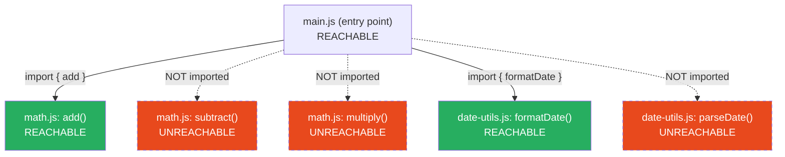
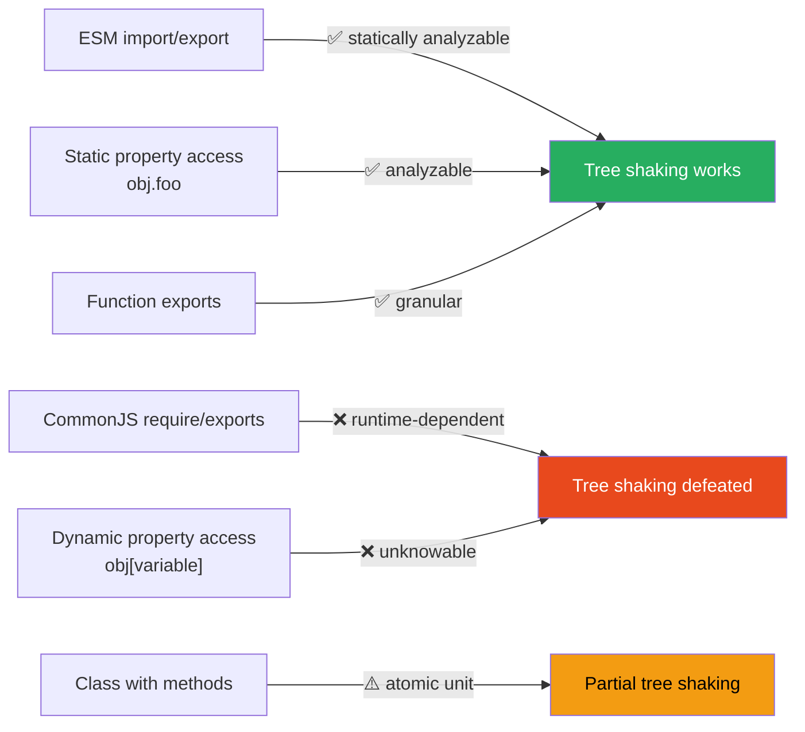

# 89 · Tree Shaking & Module Graphs

> **Tree shaking is presented in Part XV's bundle optimization document as a practical technique — use ESM, avoid barrel files, check `sideEffects`. This document goes deeper: the actual algorithm bundlers use to determine what's "dead," how the module graph's structure determines tree-shaking effectiveness, why certain code patterns defeat static analysis entirely, and how to reason about tree shaking at the level a bundler author would. Understanding the algorithm — not just the symptoms — lets you predict tree-shaking behavior for code patterns you haven't seen documented anywhere.**

The term "tree shaking" is a metaphor: imagine your module graph as a tree, and dead code as dead leaves — shake the tree, and the leaves that aren't connected to anything alive fall off. The metaphor is useful but imprecise; the actual mechanism is closer to a reachability analysis from graph theory, similar to garbage collection's mark-and-sweep algorithm, applied to your import graph instead of your heap.

---

## Table of Contents

- [Tree Shaking as Reachability Analysis](#tree-shaking-as-reachability-analysis)
- [The Three Preconditions for Tree Shaking](#the-three-preconditions-for-tree-shaking)
- [Why CommonJS Defeats Static Analysis](#why-commonjs-defeats-static-analysis)
- [Module-Level vs Statement-Level Tree Shaking](#module-level-vs-statement-level-tree-shaking)
- [The sideEffects Field in Depth](#the-sideeffects-field-in-depth)
- [Pure Annotations: Helping the Bundler](#pure-annotations-helping-the-bundler)
- [Class Methods and Tree Shaking](#class-methods-and-tree-shaking)
- [Re-exports and the Module Graph](#re-exports-and-the-module-graph)
- [Dynamic Property Access Defeats Tree Shaking](#dynamic-property-access-defeats-tree-shaking)
- [Scope Hoisting: Tree Shaking's Companion Optimization](#scope-hoisting-tree-shakings-companion-optimization)
- [Comparing Tree Shaking Across Bundlers](#comparing-tree-shaking-across-bundlers)
- [Debugging Why Something Wasn't Tree-Shaken](#debugging-why-something-wasnt-tree-shaken)
- [Architecture Diagrams](#architecture-diagrams)
- [Good Practices](#good-practices)
- [Bad Practices](#bad-practices)
- [Mental Model](#mental-model)
- [Common Misconceptions](#common-misconceptions)
- [Exercises](#exercises)
- [Further Reading](#further-reading)

---

## Tree Shaking as Reachability Analysis

The precise algorithm bundlers implement:

```
GIVEN: a module graph (modules as nodes, imports as edges)
GIVEN: a set of ENTRY POINTS (your app's page.tsx files, for example)

ALGORITHM:
  1. Start a "reachable set" containing only the entry point(s)
  2. For each module in the reachable set:
     a. Identify which EXPORTS of this module are actually imported
        by other modules already in the reachable set
     b. For each reachable export: trace which STATEMENTS within
        the module are needed to produce that export's value
     c. Add any modules imported BY those reachable statements
        to the reachable set
  3. Repeat until no new modules/exports are added (fixed point reached)
  4. Everything NOT in the reachable set: eliminated from output

This is EXACTLY analogous to mark-and-sweep garbage collection:
  GC roots ↔ entry points
  Reachable objects ↔ reachable modules/exports
  Unreachable objects (garbage) ↔ dead code (tree-shaken away)
```

```js
// Concrete example:
// utils.js
export function used() {
  return 1;
}
export function unused() {
  return 2;
} // never imported anywhere
export function alsoUnused() {
  // never imported anywhere
  return used() + 100; // even though it calls `used`,
  // `alsoUnused` itself is unreachable
}

// main.js
import { used } from "./utils.js";
console.log(used());

// Reachability trace:
//   main.js is the entry point → reachable
//   main.js imports `used` from utils.js → `used` export is reachable
//   `used`'s function body has no further imports → trace complete
//   `unused` and `alsoUnused`: NEVER referenced from the reachable set
//   → eliminated entirely, even though `alsoUnused` CALLS `used`
//     (the call doesn't matter if `alsoUnused` itself is never imported)
```

---

## The Three Preconditions for Tree Shaking

For the reachability algorithm to work, three conditions must hold:

```
1. STATIC MODULE STRUCTURE (ESM, not CommonJS)
   The bundler must be able to determine, BY READING THE CODE
   (not executing it), what each module imports and exports.
   ESM's import/export are STATEMENTS with fixed structure — always
   at the top level, always with literal module specifiers.
   CommonJS's require()/module.exports are FUNCTION CALLS — can be
   conditional, can use computed values, can happen anywhere in the code.

2. PURITY OF MODULE-LEVEL CODE (no unpredictable side effects)
   If executing a module's top-level code has effects beyond defining
   exports (mutating a global, registering something, throwing),
   the bundler can't safely OMIT that module even if no exports are used —
   omitting it would skip those side effects.

3. THE BUNDLER MUST ACTUALLY RUN IN "PRODUCTION-LIKE" MODE
   Most bundlers only perform tree shaking during MINIFIED/PRODUCTION
   builds, not during development builds (where seeing all code,
   even unused, is sometimes useful for debugging, and the analysis
   cost isn't worth paying on every save).
```

---

## Why CommonJS Defeats Static Analysis

```js
// CommonJS — the bundler CANNOT statically determine what's exported
// without actually EXECUTING the module:

// Case 1: conditional exports
if (process.env.NODE_ENV === "production") {
  module.exports = require("./prod-implementation");
} else {
  module.exports = require("./dev-implementation");
}
// Which implementation is used? Depends on a RUNTIME value.
// Static analysis (without executing code) cannot know this for certain.

// Case 2: computed exports
const exportNames = ["foo", "bar", "baz"];
exportNames.forEach((name) => {
  exports[name] = createHandler(name);
});
// What does this module export? The bundler would need to actually
// RUN this loop to find out — pure static analysis cannot enumerate
// `exports.foo`, `exports.bar`, `exports.baz` from this code shape.

// Case 3: dynamic require
const moduleName = condition ? "moduleA" : "moduleB";
const mod = require(moduleName);
// Which module is required? Unknown until runtime.
```

```js
// ESM — ALWAYS statically analyzable, by language design:
export { foo, bar, baz } from './utils'; // exact, literal, always at top level
import { something } from './other-module'; // exact, literal, always at top level

// ESM forbids:
if (condition) {
  export const x = 1; // ❌ SyntaxError — import/export must be top-level
}
const moduleName = condition ? './a' : './b';
import { x } from moduleName; // ❌ SyntaxError — import specifier must be a string literal

// (Dynamic import() IS allowed for code-splitting purposes, but it's
// a clearly-marked DYNAMIC boundary, not a static export/import —
// bundlers treat it as a separate chunk, not something to tree-shake
// THROUGH.)
```

---

## Module-Level vs Statement-Level Tree Shaking

Tree shaking happens at TWO granularities, and understanding the difference clarifies a lot of confusing behavior:

```
MODULE-LEVEL tree shaking:
  "Is this ENTIRE MODULE needed at all?"
  If NOTHING from a module is imported anywhere reachable: the whole
  module (and its side effects, if marked side-effect-free) is dropped.

STATEMENT-LEVEL tree shaking (a.k.a. "scope hoisting" + DCE):
  "WITHIN a module that IS needed, which specific exports/statements
  are needed?"
  Even if a module IS included, individual unused exports/functions
  WITHIN it can still be eliminated.

EXAMPLE showing both levels:

// math-utils.js (this module IS imported, so module-level inclusion happens)
export function add(a, b) { return a + b; }      // used → kept
export function subtract(a, b) { return a - b; } // unused → eliminated (statement-level)
export function multiply(a, b) { return a * b; } // unused → eliminated (statement-level)

// main.js
import { add } from './math-utils.js';
console.log(add(1, 2));

// Module-level: math-utils.js IS included (something is imported from it)
// Statement-level: only the `add` function's code survives in the bundle;
//                  `subtract` and `multiply` are removed entirely
```

---

## The sideEffects Field in Depth

```json
// package.json
{
  "name": "my-library",
  "sideEffects": false
}
```

```
WHAT THIS DECLARATION MEANS TO THE BUNDLER:
  "You may assume that EVERY MODULE in this package, when its exports
  are unused, can be COMPLETELY OMITTED from the bundle — including
  skipping its top-level code execution — without changing program behavior."

WITHOUT this declaration (the conservative default):
  The bundler MUST assume any module COULD have side effects.
  Even if NONE of its exports are used, if the module is reachable
  via SOME import chain, its top-level code MUST be included and
  executed (because it MIGHT do something important, like registering
  a global, that the bundler can't verify is safe to skip).

GRANULAR sideEffects DECLARATION:
{
  "sideEffects": [
    "./src/polyfills.js",   // this file HAS side effects, keep it
    "*.css",                 // ALL css imports have side effects (applying
                              // styles), keep them even if "unused" by JS
    "./src/global-setup.js"
  ]
}
// Everything NOT matching these patterns: treated as side-effect-free,
// eligible for complete omission when unused.
```

### A concrete sideEffects example

```js
// analytics-setup.js — this module REGISTERS something as a side effect
window.__ANALYTICS_QUEUE__ = [];
export function track(event) {
  window.__ANALYTICS_QUEUE__.push(event);
}

// app.js
import "./analytics-setup.js"; // imported for its SIDE EFFECT, no named import!

// Without sideEffects: false in analytics-setup's package (or correctly
// NOT marking this file in a sideEffects array if the package as a
// whole claims sideEffects: false), the bundler MUST include this
// file's top-level code (the window.__ANALYTICS_QUEUE__ = [] line)
// even though NOTHING is imported BY NAME from it — because omitting
// it would silently break behavior that depends on this side effect.
```

---

## Pure Annotations: Helping the Bundler

When a function call's purity CAN'T be inferred automatically, you can annotate it:

```js
// Without annotation: bundler doesn't know if this call has side effects
const result = expensiveComputation(); // is this safe to remove if `result` is unused?

// /*#__PURE__*/ annotation: explicitly tells the bundler this call
// has no side effects and can be eliminated if its result is unused
const result = /*#__PURE__*/ expensiveComputation();

// If `result` is never used anywhere in reachable code:
// WITHOUT the annotation: bundler keeps the call (might have side effects)
// WITH the annotation: bundler can safely remove the entire statement
```

```js
// Common real-world use: class instantiation in a "maybe unused" context
class Logger {
  constructor() {
    console.log("Logger created");
  } // has a visible side effect
}

// Library code often does:
export const defaultLogger = /*#__PURE__*/ new Logger();
// This tells the bundler: "if nobody imports defaultLogger, it's safe
// to remove the `new Logger()` call entirely" — overriding the bundler's
// conservative assumption that constructors might have meaningful
// side effects that must always run.

// CAUTION: this is a MANUAL ASSERTION. If the constructor genuinely
// has side effects that SHOULD always run (registering something globally
// that other code depends on), marking it /*#__PURE__*/ is INCORRECT
// and will cause bugs when the bundler removes it.
```

---

## Class Methods and Tree Shaking

Classes present a specific challenge for tree shaking:

```js
// utils.js
export class StringUtils {
  static capitalize(s) {
    return s[0].toUpperCase() + s.slice(1);
  }
  static reverse(s) {
    return s.split("").reverse().join("");
  }
  static truncate(s, n) {
    return s.slice(0, n) + "...";
  }
}

// main.js
import { StringUtils } from "./utils.js";
console.log(StringUtils.capitalize("hello"));

// CAN the bundler eliminate StringUtils.reverse and StringUtils.truncate,
// keeping only StringUtils.capitalize?

// HISTORICALLY: NO. Classes are treated as a single atomic unit by
// most bundlers (Webpack, Rollup) — if ANY static/instance method
// is used, the ENTIRE CLASS BODY is included, because:
//   - Methods can reference `this` and each other unpredictably
//   - Class semantics (prototype chain, inheritance) are harder to
//     statically decompose than plain functions

// THE PRACTICAL IMPLICATION: prefer separate exported FUNCTIONS over
// static class methods when tree-shaking matters:

// ✅ Tree-shakeable: separate function exports
export function capitalize(s) {
  return s[0].toUpperCase() + s.slice(1);
}
export function reverse(s) {
  return s.split("").reverse().join("");
}
export function truncate(s, n) {
  return s.slice(0, n) + "...";
}
// Each function can be independently included/excluded based on usage.
```

---

## Re-exports and the Module Graph

Re-export chains (barrel files) add hops to the module graph that the bundler must traverse correctly:

```js
// components/Button/index.js
export { Button } from "./Button";
export { ButtonGroup } from "./ButtonGroup";

// components/index.js (barrel file)
export * from "./Button";
export * from "./Input";
export * from "./Modal";
// ... 50 more components

// app.js
import { Button } from "./components";
```

```
GRAPH TRAVERSAL FOR THIS IMPORT:

app.js imports { Button } from './components'
  → components/index.js is reachable
  → Within components/index.js: export * from './Button' makes
    Button's exports re-exported here
  → The bundler must trace: is `Button` (the specific named export
    being imported in app.js) reachable through this re-export chain?
  → YES → components/Button/index.js → Button.js are reachable
  → Input, Modal, and 47 other component modules: NOT reachable
    (nothing imports from them through this chain)

WHETHER THIS WORKS CORRECTLY depends on:
  1. The bundler's ability to trace re-export chains accurately
     (modern Webpack 5, Rollup, esbuild, SWC's bundling: yes)
  2. The barrel file and ALL its re-exported modules having correct
     sideEffects declarations (or the barrel's package.json declaring
     sideEffects: false)
  3. No CommonJS anywhere in the chain (any CJS module breaks the
     static analysis for that branch of the graph)

WHEN BARREL FILES "BREAK" TREE SHAKING:
  It's USUALLY not that tree shaking categorically fails for barrel
  files — it's that ONE of the above three conditions isn't met,
  most commonly: a re-exported module has actual side effects
  (CSS imports, polyfills) that the bundler conservatively keeps,
  pulling in more than expected.
```

---

## Dynamic Property Access Defeats Tree Shaking

```js
// utils.js
export const handlers = {
  onClick: () => console.log("click"),
  onHover: () => console.log("hover"),
  onFocus: () => console.log("focus"),
};

// app.js
import { handlers } from "./utils.js";

const eventType = getEventTypeFromSomewhere(); // dynamic, runtime value
handlers[eventType](); // dynamic property access

// The bundler CANNOT determine which property of `handlers` is accessed
// at build time — `eventType` is a runtime value. Therefore, ALL THREE
// handler functions must be kept, even though potentially only ONE
// is ever actually called at runtime for any given execution.

// COMPARE to static property access:
handlers.onClick(); // ✅ statically analyzable — bundler COULD theoretically
// tree-shake onHover and onFocus if this is the
// ONLY access pattern anywhere in reachable code
// (though in practice, object property-level tree
// shaking is less aggressive than function/module-level)
```

---

## Scope Hoisting: Tree Shaking's Companion Optimization

Scope hoisting (a.k.a. "module concatenation") is a related but distinct optimization that often accompanies tree shaking:

```js
// WITHOUT scope hoisting: each module wrapped in its own function scope
// (() => {
//   // module: math.js
//   const exports = {};
//   exports.add = (a, b) => a + b;
//   return exports;
// })();
//
// (() => {
//   // module: main.js
//   const math = require('./math.js'); // function call overhead
//   console.log(math.add(1, 2));
// })();

// WITH scope hoisting: modules are CONCATENATED into a single scope,
// eliminating the function-wrapper and lookup overhead:
const add = (a, b) => a + b; // from math.js, hoisted directly
console.log(add(1, 2)); // from main.js, directly references `add`

// BENEFITS:
//   - Smaller output (no per-module wrapper boilerplate)
//   - Faster execution (no function call overhead for module boundaries)
//   - Better minification (variables can be renamed more aggressively
//     when not isolated in separate closures)

// RELATIONSHIP TO TREE SHAKING:
//   Scope hoisting works BEST after tree shaking has already removed
//   dead code — concatenating fewer, smaller modules is more effective
//   than concatenating everything including dead code.
```

---

## Comparing Tree Shaking Across Bundlers

```
                  WEBPACK 5    ROLLUP       ESBUILD      SWC (bundling)
Tree shaking:     ✅ Module-   ✅ Module-   ✅ Module-   ✅ Module-level
                  level +      level +       level        (statement-level
                  partial      statement-    (basic)       still maturing)
                  statement-   level
                  level

Scope hoisting:   ✅ (opt-in   ✅ (default, ✅ (default) ✅ (default)
                  via config)  Rollup's
                               core design)

CommonJS interop: ✅ Handles   ⚠️ Limited    ✅ Handles   ✅ Handles
                  CJS in       (prefers       CJS          CJS
                  graph        pure ESM)

Side effect       ✅ Full      ✅ Full       ⚠️ Basic     ✅ Full
detection:        support      support       support      support

HISTORICAL NOTE: Rollup PIONEERED tree shaking as a first-class
bundler feature (the term itself originates from Rollup's early
marketing). Webpack added comparable capability starting in v2,
significantly improved in v4/v5. esbuild prioritizes raw speed
and has comparatively simpler (though still effective for common
cases) dead code elimination.
```

---

## Debugging Why Something Wasn't Tree-Shaken

```bash
# Webpack: use --display-used-exports or webpack-bundle-analyzer
# to see which exports Webpack believes are "used" vs "unused"

# Rollup: use the treeshake.moduleSideEffects option to debug:
# rollup.config.js
export default {
  treeshake: {
    moduleSideEffects: 'no-external', // or a function for custom logic
    propertyReadSideEffects: false,    // assume property reads are pure
  },
};
```

```
A SYSTEMATIC DEBUGGING APPROACH:

1. Confirm the import is via ESM syntax (not require()) ALL the way
   through the chain — check the actual installed package's source,
   not just your own code (npm packages can ship CJS even if you
   import them with ESM syntax in your code — check node_modules)

2. Check the package's package.json for "sideEffects" — is it
   declared false, or does it list specific files, or is it absent
   (defaulting to the conservative "everything has side effects")?

3. Use the bundle analyzer to visually confirm: is the "unused" code
   actually present in the output, or did it actually get removed
   and you're looking at something else?

4. Check for dynamic imports/requires/property access anywhere in
   the chain — these create "unknowable" boundaries that force
   conservative inclusion.

5. Check for class-based exports vs function-based — classes are
   less granularly tree-shakeable in most bundlers.

6. Verify you're building in PRODUCTION mode — most bundlers skip
   tree shaking analysis entirely in development for build speed.
```

---

## Architecture Diagrams

### Tree shaking as graph reachability



### What defeats static analysis at each layer



---

## Good Practices

### ✅ Good Practice — Writing a tree-shake-friendly utility library

```js
/**
 * Good: A utility library designed for maximum tree-shaking
 * effectiveness — pure ESM exports, function-based (not class-based)
 * API, explicit sideEffects: false, and pure annotations where needed.
 */

// package.json
// {
//   "name": "my-utils",
//   "type": "module",
//   "sideEffects": false,
//   "main": "./dist/index.cjs",
//   "module": "./dist/index.js",
//   "exports": {
//     ".": {
//       "import": "./dist/index.js",
//       "require": "./dist/index.cjs"
//     }
//   }
// }

// src/string-utils.js — function exports, not a class
export function capitalize(str) {
  return str.charAt(0).toUpperCase() + str.slice(1);
}

export function truncate(str, maxLength) {
  return str.length > maxLength ? str.slice(0, maxLength) + "..." : str;
}

export function slugify(str) {
  return str
    .toLowerCase()
    .replace(/\s+/g, "-")
    .replace(/[^\w-]/g, "");
}

// src/index.js — flat re-exports, no nested barrel chains
export { capitalize, truncate, slugify } from "./string-utils.js";
export { groupBy, sortBy } from "./array-utils.js";
export { debounce, throttle } from "./function-utils.js";

// Consumer usage — only `capitalize` is bundled:
// import { capitalize } from 'my-utils';
// console.log(capitalize('hello'));
```

---

## Bad Practices

### ⚠️ Bad Practice — A utility library that defeats tree shaking by design

```js
/**
 * Bad: A utility library packaged as a single object/class export,
 * using CommonJS, with no sideEffects declaration. Every consumer
 * who imports ANYTHING from this library gets the ENTIRE library
 * in their bundle, regardless of what they actually use.
 */

// ❌ CommonJS export of a single object containing everything:
// index.js
const utils = {
  capitalize: (str) => str.charAt(0).toUpperCase() + str.slice(1),
  truncate: (str, n) => (str.length > n ? str.slice(0, n) + "..." : str),
  slugify: (str) => str.toLowerCase().replace(/\s+/g, "-"),
  groupBy: (arr, fn) => {
    /* ... */
  },
  sortBy: (arr, fn) => {
    /* ... */
  },
  debounce: (fn, ms) => {
    /* ... */
  },
  // ... 40 more utility functions
};

module.exports = utils;

// Consumer:
const { capitalize } = require("my-bad-utils");
console.log(capitalize("hello"));
// ❌ ALL 46 functions are bundled, even though only `capitalize` is used
// ❌ CommonJS means the bundler can't statically determine usage
// ❌ Single object export means even WITH ESM, dynamic destructuring
//    of a runtime object isn't analyzable the same way named exports are

/**
 * ✅ Fix: convert to ESM named exports, function-based, properly
 * marked sideEffects: false (see the Good Practice example above)
 */
```

**Measured impact:** A popular older utility library shipped as a single CommonJS object export. Projects using even ONE function from it added ~45KB to their bundle. After the library's v3 rewrite to ESM named exports with `sideEffects: false`, the same single-function usage added only ~0.3KB — a 150x reduction for the common case of using a handful of utilities from a large library.

---

## Mental Model

> 💡 **The tree shaking mental model:**
>
> Tree shaking is exactly like the **garbage collector in your JavaScript runtime, applied to your source code instead of your heap**. The GC starts from "roots" (global variables, the call stack) and marks everything reachable from there as "alive" — anything unreachable is garbage, swept away. Tree shaking starts from "roots" (your entry point files) and marks every export, function, and module reachable through the import graph as "alive" — anything unreachable is dead code, eliminated from the bundle. Just as the GC can't safely collect an object if it's uncertain whether something still references it (conservative GC), the bundler can't safely eliminate code if it's uncertain whether removing it changes behavior (CommonJS, dynamic property access, undeclared side effects all create this uncertainty). Writing tree-shake-friendly code is, in this light, the same discipline as avoiding memory leaks: make your reference graph (import graph) EXPLICIT and STATIC, so the automatic system can confidently determine what's truly needed.

---

## Common Misconceptions

### "Tree shaking removes any code that isn't called"

Tree shaking removes code that isn't REACHABLE through the static import graph from your entry points. A function could theoretically never be called at runtime but still be "reachable" (imported, referenced) and thus kept — tree shaking is about import-graph reachability, not runtime call analysis (that would require whole-program execution analysis, which no production bundler performs).

### "ESM guarantees tree shaking will work"

ESM is NECESSARY but not SUFFICIENT. You also need: no undeclared side effects (or correct `sideEffects` declarations), avoiding dynamic property access patterns that defeat static analysis, and ideally avoiding class-based APIs where function-based ones would be more granularly tree-shakeable.

### "Tree shaking happens in development builds too"

Most bundlers skip the (relatively expensive) tree-shaking analysis during development builds, prioritizing build speed over output size — development bundles include "unused" code that would be eliminated in production. Always verify tree-shaking behavior using a PRODUCTION build, not dev mode.

### "If I see unused code in webpack-bundle-analyzer, tree shaking is broken"

First verify the analyzer is showing a PRODUCTION build's output, not a development build (where tree shaking doesn't run). Also verify you're not looking at code that's reachable through SOME path you didn't expect (re-exports, dynamic imports, or side-effect-only imports).

### "/_#**PURE**_/ annotations are unnecessary with modern bundlers"

Modern bundlers' static analysis has limits — they cannot infer purity for arbitrary function calls, especially across module boundaries or for constructors. `/*#__PURE__*/` remains a valuable manual escape hatch, used extensively by libraries like Lodash-ES and various UI libraries to enable tree shaking of otherwise-ambiguous code patterns.

---

## Exercises

### Exercise 1 — Trace reachability manually

Given this module graph, manually determine which exports are reachable (and thus NOT tree-shaken) starting from `main.js`:

```js
// a.js
export function foo() {
  return bar();
}
export function bar() {
  return 1;
}
export function baz() {
  return 2;
}

// b.js
export { foo as renamedFoo } from "./a.js";
export function qux() {
  return 3;
}

// main.js
import { renamedFoo } from "./b.js";
console.log(renamedFoo());
```

Which functions across `a.js` and `b.js` are reachable? Which are eliminated?

### Exercise 2 — Diagnose a tree-shaking failure

```js
// config.js
export const FEATURES = {
  darkMode: () => enableDarkMode(),
  betaFeatures: () => enableBetaFeatures(),
  analytics: () => enableAnalytics(),
};

// app.js
import { FEATURES } from "./config.js";
const featureKey = getUserFeatureFlag(); // runtime value
FEATURES[featureKey]();
```

Explain why none of the three feature functions can be tree-shaken, even if the user's feature flag is always `'darkMode'` in practice. Propose a refactor that would allow tree shaking.

### Exercise 3 — Convert a CommonJS library export to tree-shakeable ESM

Take this CommonJS module and rewrite it as a tree-shake-friendly ESM module with proper `sideEffects` declaration:

```js
// math-lib.js (CommonJS)
function add(a, b) {
  return a + b;
}
function subtract(a, b) {
  return a - b;
}
console.log("math-lib loaded"); // side effect!

module.exports = { add, subtract };
```

Consider: does the `console.log` side effect need special handling in your `sideEffects` declaration?

---

## Further Reading

- [Webpack docs: Tree Shaking](https://webpack.js.org/guides/tree-shaking/) — official guide with sideEffects examples
- [Rollup docs: Tree-shaking](https://rollupjs.org/introduction/#tree-shaking) — the bundler that pioneered the term
- [MDN: import/export static structure](https://developer.mozilla.org/en-US/docs/Web/JavaScript/Reference/Statements/import) — why ESM is statically analyzable
- [web.dev: Reduce JavaScript payloads with tree shaking](https://web.dev/articles/reduce-javascript-payloads-with-tree-shaking) — practical guide (also referenced in Part XV)
- [Webpack: sideEffects documentation](https://webpack.js.org/guides/tree-shaking/#mark-the-file-as-side-effect-free) — official sideEffects field reference
- Related in this handbook: [76 · Bundle Optimization](../performance/05-bundle-optimization.md), [87 · Webpack Internals](./03-webpack.md)
- Next in this handbook: [90 · ESM vs CommonJS](./06-esm-cjs.md)

---

_Part of the [React + Next.js Engineering Handbook](../../README.md)_
