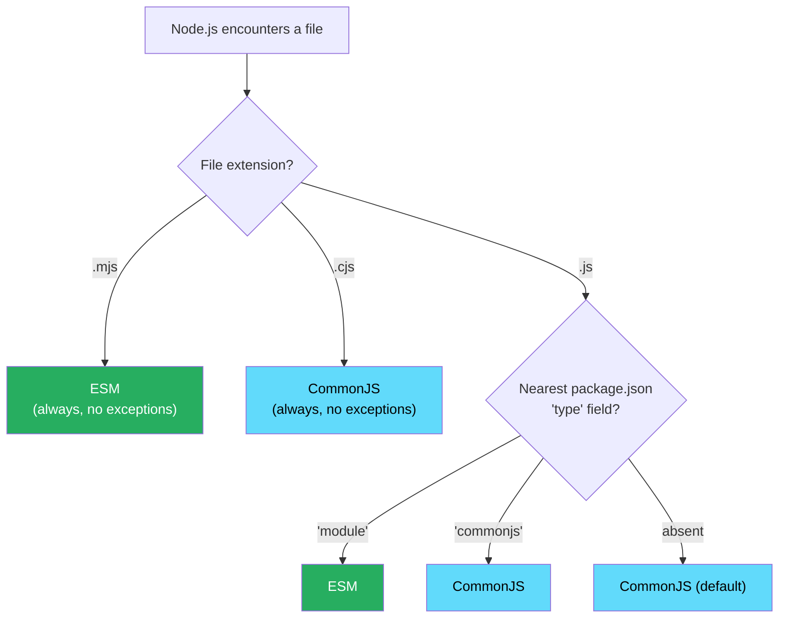

# 90 · ESM vs CommonJS

> **JavaScript has two incompatible module systems coexisting in the ecosystem: CommonJS (CJS), Node.js's original synchronous module system designed in 2009, and ECMAScript Modules (ESM), the language-native standard finalized in ES2015 and only achieving full Node.js support around 2020. Every confusing error involving "require is not defined," "Cannot use import statement outside a module," "ERR_REQUIRE_ESM," or a package mysteriously working in one context but not another traces back to this divide. Understanding both systems' semantics — not just their syntax — is essential for debugging module resolution issues, writing dual-published packages, and understanding why tree shaking, covered in the previous document, fundamentally depends on this distinction.**

The ESM/CJS divide isn't a historical curiosity that will eventually disappear — it's an active architectural reality that every Next.js/React engineer encounters: in `package.json`'s `"type"` field, in `next.config.js`'s module format, in third-party package compatibility issues, and in build tool configuration. This document covers both systems' actual runtime semantics, the interop mechanisms bridging them, and the practical decision-making for package authors and consumers.

---

## Table of Contents

- [The Two Module Systems at a Glance](#the-two-module-systems-at-a-glance)
- [CommonJS Semantics](#commonjs-semantics)
- [ESM Semantics](#esm-semantics)
- [The Critical Difference: Synchronous vs Asynchronous Resolution](#the-critical-difference-synchronous-vs-asynchronous-resolution)
- [Live Bindings vs Value Copies](#live-bindings-vs-value-copies)
- [How Node.js Decides Which System to Use](#how-nodejs-decides-which-system-to-use)
- [The package.json exports Field](#the-packagejson-exports-field)
- [Interop: Importing CJS from ESM](#interop-importing-cjs-from-esm)
- [Interop: Requiring ESM from CJS](#interop-requiring-esm-from-cjs)
- [Dual Package Publishing](#dual-package-publishing)
- [Common Error Messages Decoded](#common-error-messages-decoded)
- [ESM/CJS in Next.js Specifically](#esmcjs-in-nextjs-specifically)
- [Architecture Diagrams](#architecture-diagrams)
- [Good Practices](#good-practices)
- [Bad Practices](#bad-practices)
- [Mental Model](#mental-model)
- [Common Misconceptions](#common-misconceptions)
- [Exercises](#exercises)
- [Further Reading](#further-reading)

---

## The Two Module Systems at a Glance

```
                        COMMONJS              ESM
Syntax:                 require()/            import/export
                         module.exports

Origin:                 Node.js (2009)         ECMAScript spec (ES2015)

Resolution timing:      Synchronous            Asynchronous (can be sync
                                                 in practice for local files,
                                                 but spec-defined as async)

Loading:                Dynamic (require()     Static (import/export are
                         is a function call,    declarations, fixed at
                         can be conditional)    parse time, top-level only)

Browser support:        None natively           Native via <script type="module">

Node.js support:        Native since 2009       Native since Node 12+ (stable
                                                  since ~14), file extension
                                                  or package.json "type" required

Tree shaking:           Not statically          Fully supported (see doc 89)
                         analyzable

Top-level await:        Not supported            Supported

Circular deps:          Partial exports         Live bindings handle
                         object at time of       circularity correctly
                         circular reference
```

---

## CommonJS Semantics

```js
// math.js (CommonJS module)
function add(a, b) {
  return a + b;
}
function subtract(a, b) {
  return a - b;
}

module.exports = { add, subtract };
// or: exports.add = add; exports.subtract = subtract;

// main.js
const math = require("./math.js");
console.log(math.add(1, 2)); // 3
```

### How require() actually works

```
1. require('./math.js') is a SYNCHRONOUS FUNCTION CALL.
2. Node.js resolves the path, reads the file SYNCHRONOUSLY (blocking I/O).
3. The module's code is WRAPPED in a function:
   (function(exports, require, module, __filename, __dirname) {
     // your module code here
   })(...)
   This wrapper is why `exports`, `require`, `module`, `__filename`,
   and `__dirname` are available without explicit imports in CJS files.
4. The wrapped function EXECUTES IMMEDIATELY (synchronously).
5. module.exports (whatever it ends up being) is CACHED.
6. Subsequent require() calls for the SAME file return the CACHED
   module.exports object — the module body runs ONLY ONCE.

CRITICAL: because require() is a regular function call, it can be:
  called conditionally: if (x) { require('./a') } else { require('./b') }
  called with a computed path: require(someVariable)
  called anywhere in the file (not just at the top)
This dynamism is exactly what makes CJS hard to statically analyze
(as covered in the tree shaking document).
```

---

## ESM Semantics

```js
// math.mjs (or math.js with "type": "module" in package.json)
export function add(a, b) {
  return a + b;
}
export function subtract(a, b) {
  return a - b;
}

// main.mjs
import { add } from "./math.mjs";
console.log(add(1, 2)); // 3
```

### How import actually works

```
1. import is a DECLARATION (part of the module's static structure),
   not a function call. It MUST appear at the top level of a module
   (not inside an if, function, or loop) — this is enforced by the
   JavaScript grammar itself (SyntaxError otherwise).

2. ESM resolution happens in PHASES, per the spec:
   a. CONSTRUCTION: parse the module, recursively discover and parse
      all its imports (building the complete module graph) — this
      phase can be done in parallel for unrelated imports
   b. INSTANTIATION: allocate memory for each module's exports
      (creating "bindings" — see live bindings below), link imports
      to their corresponding exports across modules
   c. EVALUATION: execute each module's top-level code, in dependency
      order (dependencies evaluated before dependents)

3. This multi-phase process is why ESM naturally supports:
   - Static analysis (construction phase sees the whole graph
     before any code runs)
   - Correct circular dependency handling (instantiation links
     bindings before evaluation runs, so circular references
     resolve correctly)
   - Top-level await (evaluation phase can be asynchronous)
```

---

## The Critical Difference: Synchronous vs Asynchronous Resolution

```
COMMONJS: require() is SYNCHRONOUS, blocking.
  const fs = require('fs');           // Node.js built-in: instant (already in memory)
  const lodash = require('lodash');   // npm package: synchronous file read + execute
  // Code AFTER this line does not run until the require() completes.

ESM: import resolution is conceptually ASYNCHRONOUS (per spec),
     though for LOCAL FILE imports, the asynchrony is often invisible
     because file reads happen fast and the module graph is resolved
     before your code starts running.
  import fs from 'fs';
  import _ from 'lodash';
  // These resolve as part of the module's "construction phase"
  // BEFORE your module's top-level code begins executing.

TOP-LEVEL AWAIT (ESM only):
  // config.mjs
  const response = await fetch('https://api.example.com/config');
  export const config = await response.json();
  // This works in ESM because module evaluation can be async.
  // CommonJS has NO equivalent — you cannot `await` at the top level
  // of a .js (CJS) file; you'd need an async IIFE wrapper.
```

---

## Live Bindings vs Value Copies

This is the most subtle and consequential semantic difference between the two systems:

```js
// CommonJS: exports are VALUE COPIES (or object references, but the
// BINDING itself is not live)

// counter.js (CJS)
let count = 0;
function increment() {
  count++;
}
module.exports = { count, increment };
// `count` is COPIED into the exports object AT THE TIME OF EXPORT.

// main.js (CJS)
const { count, increment } = require("./counter.js");
increment();
console.log(count); // 0 — STILL THE ORIGINAL VALUE!
// Because `count` was destructured as a primitive VALUE COPY at
// require() time, calling increment() (which mutates the internal
// `count` variable inside counter.js) has NO EFFECT on the `count`
// binding in main.js.
```

```js
// ESM: exports are LIVE BINDINGS — a reference to the variable itself,
// not a snapshot of its value at import time

// counter.mjs (ESM)
export let count = 0;
export function increment() {
  count++;
}

// main.mjs (ESM)
import { count, increment } from "./counter.mjs";
increment();
console.log(count); // 1 — REFLECTS THE CURRENT VALUE!
// ESM's `count` binding is LIVE — it always reflects the CURRENT
// value of the exporting module's `count` variable, not a snapshot
// taken at import time.
```

```
WHY THIS MATTERS PRACTICALLY:
  This is rarely an issue for typical React/Next.js code (most exports
  are functions and constants, not mutable primitives). But it explains:
  - Why some testing/mocking patterns behave differently between CJS
    and ESM modules
  - Why certain "hot module reloading" patterns work more naturally
    with ESM's live bindings
  - Edge cases in libraries that export mutable state directly
    (a pattern that's increasingly discouraged anyway)
```

---

## How Node.js Decides Which System to Use

```
Node.js determines whether to treat a .js file as CJS or ESM using
THREE possible signals, in priority order:

1. FILE EXTENSION (highest priority, unambiguous):
   .mjs  → ALWAYS treated as ESM, regardless of package.json
   .cjs  → ALWAYS treated as CommonJS, regardless of package.json
   .js   → ambiguous, falls through to signal #2

2. PACKAGE.JSON "type" FIELD (for .js files):
   { "type": "module" }     → .js files in this package are ESM
   { "type": "commonjs" }   → .js files in this package are CJS
   (absent)                 → defaults to "commonjs"

3. NEAREST package.json (for files without their own clear signal):
   Node.js walks UP the directory tree from the file's location
   to find the nearest package.json and reads its "type" field.
```

```json
// package.json
{
  "name": "my-app",
  "type": "module", // ← ALL .js files in this package are now ESM
  "main": "./index.js"
}
```

```js
// This now MUST use ESM syntax (because of "type": "module" above):
// index.js
import { something } from "./utils.js"; // ✅ correct
export default function App() {}

// const x = require('./utils.js'); // ❌ ReferenceError: require is not defined
```

---

## The package.json exports Field

The modern (and increasingly mandatory) way for packages to declare their entry points and support both module systems:

```json
{
  "name": "my-library",
  "type": "module",
  "exports": {
    ".": {
      "import": "./dist/index.mjs", // used when `import` is used
      "require": "./dist/index.cjs" // used when `require()` is used
    },
    "./utils": {
      "import": "./dist/utils.mjs",
      "require": "./dist/utils.cjs"
    },
    "./package.json": "./package.json" // explicit allow-list for package.json access
  }
}
```

```
WHY exports IS IMPORTANT:

1. ENCAPSULATION: only paths explicitly listed in "exports" are
   importable. require('my-library/internal/secret-file') FAILS
   even if that file physically exists, unless it's in the exports map.
   This prevents consumers from depending on a package's internals.

2. CONDITIONAL RESOLUTION: the SAME import specifier resolves to
   DIFFERENT files depending on HOW it's being consumed (import vs
   require, browser vs Node.js, development vs production) — enabling
   a single package to correctly serve both module systems.

3. SUBPATH EXPORTS: explicitly declare which "deep imports" are
   public API (./utils, ./hooks) vs implementation details.

Common condition keys:
  "import"      → used by ESM import statements
  "require"     → used by CJS require() calls
  "browser"     → used when bundling for browser targets
  "node"        → used when running in Node.js
  "development" → used in development builds (some frameworks set this)
  "production"  → used in production builds
  "default"     → fallback, should be LAST in the conditions object
```

---

## Interop: Importing CJS from ESM

```js
// ESM importing a CommonJS module — this generally WORKS due to
// Node.js's CJS-ESM interop layer:

// some-cjs-module.cjs
module.exports = { foo: "bar", baz: 42 };

// main.mjs (ESM)
import cjsModule from "./some-cjs-module.cjs";
console.log(cjsModule.foo); // 'bar' — works!

// NAMED imports from CJS (Node.js attempts static analysis to
// detect "named exports" from module.exports, but this is HEURISTIC
// and doesn't always work):
import { foo, baz } from "./some-cjs-module.cjs";
// This MAY work (Node's cjs-module-lexer tries to detect static
// `exports.x = y` patterns) but is NOT guaranteed for all CJS code
// shapes, especially dynamically-constructed exports objects.

// THE SAFEST PATTERN for importing CJS from ESM: default import,
// then destructure:
import cjsModule from "./some-cjs-module.cjs";
const { foo, baz } = cjsModule; // always works, no heuristics involved
```

---

## Interop: Requiring ESM from CJS

```js
// CommonJS CANNOT directly require() an ESM module — this is a
// HARD LIMITATION, not a heuristic issue:

// some-esm-module.mjs
export const foo = "bar";

// main.cjs (CommonJS)
const esmModule = require("./some-esm-module.mjs");
// ❌ Error [ERR_REQUIRE_ESM]: require() of ES Module not supported

// THE WORKAROUND: dynamic import() (which IS available in CJS,
// since Node.js 12+), but it's ASYNCHRONOUS:
async function loadESM() {
  const esmModule = await import("./some-esm-module.mjs");
  console.log(esmModule.foo); // 'bar'
}
loadESM();

// THIS IS WHY: a CJS package depending on an ESM-only package
// (like many modern packages that have dropped CJS support, e.g.
// recent versions of `chalk`, `node-fetch`, `execa`) cannot simply
// require() it — they must either convert to ESM themselves, or
// use dynamic import() with the resulting async complexity.
```

---

## Dual Package Publishing

For library authors wanting to support BOTH CJS and ESM consumers:

```json
// package.json — dual package setup
{
  "name": "my-library",
  "type": "module",
  "main": "./dist/index.cjs", // legacy fallback for old tooling
  "module": "./dist/index.mjs", // legacy bundler hint (Webpack 4, etc.)
  "types": "./dist/index.d.ts", // TypeScript types
  "exports": {
    ".": {
      "types": "./dist/index.d.ts",
      "import": "./dist/index.mjs",
      "require": "./dist/index.cjs"
    }
  },
  "scripts": {
    "build": "npm run build:esm && npm run build:cjs",
    "build:esm": "tsc --module esnext --outDir dist --moduleResolution bundler",
    "build:cjs": "tsc --module commonjs --outDir dist-cjs && rename-cjs-files"
  }
}
```

```
THE DUAL PACKAGE HAZARD:
  If a dual-published package is loaded via BOTH its CJS and ESM
  entry points within the SAME application (e.g., one dependency
  requires it via CJS, another imports it via ESM), you can end up
  with TWO SEPARATE INSTANCES of the module — each with its own
  module-level state, its own class definitions (instanceof checks
  failing across the two instances), etc.

  This is a genuine, documented Node.js footgun (the "dual package
  hazard") and is one of the strongest arguments for the ecosystem
  moving toward ESM-ONLY packages rather than maintaining dual
  CJS/ESM support indefinitely.
```

---

## Common Error Messages Decoded

```
"SyntaxError: Cannot use import statement outside a module"
  → You're running a file with ESM syntax (import/export) but
    Node.js is treating it as CommonJS (no "type": "module", no
    .mjs extension). Fix: add "type": "module" to package.json,
    rename to .mjs, or convert the syntax to CommonJS.

"ReferenceError: require is not defined in ES module scope"
  → You're using require() inside a file Node.js is treating as
    ESM. Fix: convert to import syntax, or rename to .cjs, or
    remove "type": "module" if this should be CJS.

"Error [ERR_REQUIRE_ESM]: require() of ES Module ... not supported"
  → You're require()-ing a package that's published as ESM-only
    from a CommonJS context. Fix: use dynamic import() instead,
    or check if an older/CJS version of the package is available.

"Named export 'X' not found. The requested module ... is a CommonJS
module, which may not support all module.exports as named exports"
  → You used `import { X } from 'cjs-package'` but Node's static
    CJS-export-detection heuristic couldn't find a statically-
    analyzable `exports.X = ...` pattern. Fix: use default import
    and destructure instead: `import pkg from 'cjs-package'; const { X } = pkg;`

"Module not found: Error: Package path . is not exported from package"
  → The package's package.json "exports" field doesn't include the
    path you're trying to import (often because you're trying to
    import an internal/private module path not in the public API).
    Fix: use only the package's documented public entry points.
```

---

## ESM/CJS in Next.js Specifically

```
Next.js's handling of ESM/CJS:

1. Next.js itself supports BOTH module systems for your application
   code — you can write next.config.js as either CJS (module.exports)
   or ESM (export default), and components can use either, though
   ESM (with import/export) is the conventional and recommended style
   for App Router projects.

2. next.config.js specifically:
   // CommonJS (traditional, still widely used):
   module.exports = { /* config */ };

   // ESM (works if next.config.mjs, or package.json has "type": "module"):
   export default { /* config */ };

3. transpilePackages option: for npm packages published as ESM-only
   (or with syntax your build target doesn't support), Next.js needs
   to know to TRANSFORM them rather than treating them as pre-built:
   // next.config.js
   module.exports = {
     transpilePackages: ['some-esm-only-package'],
   };
   Without this, an ESM-only package that uses syntax incompatible
   with your build can cause build failures — transpilePackages tells
   Next.js's bundler to process that package through the same
   transform pipeline as your own source code.

4. Server Components and ESM:
   The RSC module graph (which modules run on the server vs client)
   is INDEPENDENT of the ESM/CJS distinction — both module systems
   work in both Server and Client Components, as long as the package
   itself doesn't rely on Node.js-specific APIs in a context where
   they're unavailable (e.g., a CJS package using `fs` imported into
   client-side code would fail regardless of module system).
```

---

## Architecture Diagrams

### CJS vs ESM resolution timing

```mermaid
graph TD
    subgraph "CommonJS: synchronous, dynamic"
        A1["File starts executing"] --> B1["require('./a') — BLOCKS"]
        B1 --> C1["File a.js fully executes"]
        C1 --> D1["Continue executing (line by line)"]
        D1 --> E1["require('./b') — BLOCKS<br/>(could be conditional!)"]
    end

    subgraph "ESM: phased, static"
        A2["Construction phase:<br/>parse ALL imports first"] --> B2["Instantiation phase:<br/>link all bindings"]
        B2 --> C2["Evaluation phase:<br/>execute in dependency order"]
        C2 --> D2["Module code runs<br/>(imports already resolved)"]
    end

    style B1 fill:#f39c12,color:#000
    style E1 fill:#f39c12,color:#000
    style A2 fill:#27ae60,color:#fff
```



### Module type resolution decision tree



---

## Good Practices

### ✅ Good Practice — A well-configured modern package.json for an ESM-first library

```json
{
  "name": "my-modern-library",
  "version": "2.0.0",
  "type": "module",
  "exports": {
    ".": {
      "types": "./dist/index.d.ts",
      "import": "./dist/index.js",
      "require": "./dist/index.cjs"
    },
    "./hooks": {
      "types": "./dist/hooks/index.d.ts",
      "import": "./dist/hooks/index.js",
      "require": "./dist/hooks/index.cjs"
    },
    "./package.json": "./package.json"
  },
  "sideEffects": false,
  "engines": {
    "node": ">=18"
  }
}
```

```js
// Library source — pure ESM, no CJS authoring needed
// (the build step produces the .cjs fallback automatically)

// src/index.ts
export { useCounter } from './hooks/useCounter';
export { formatDate } from './utils/date';
export type { CounterOptions } from './types';
```

---

## Bad Practices

### ⚠️ Bad Practice — Mixing module syntax without clear signals, causing ambiguous resolution

```js
/**
 * Bad: A project with .js files containing ESM syntax, but NO
 * "type": "module" in package.json and no .mjs extensions —
 * Node.js defaults to treating these as CommonJS, causing a
 * SyntaxError the moment any import/export statement is parsed.
 */

// package.json — MISSING "type": "module"
// {
//   "name": "my-app",
//   "main": "index.js"
// }

// index.js — uses ESM syntax but Node.js thinks this is CJS:
import express from "express"; // ❌ SyntaxError: Cannot use import
//    statement outside a module

/**
 * ✅ Fix option 1: declare "type": "module" in package.json
 */
// { "name": "my-app", "type": "module", "main": "index.js" }
// Now index.js (and ALL .js files in this package) are ESM.

/**
 * ✅ Fix option 2: use .mjs extension explicitly
 */
// index.mjs — extension makes the module type unambiguous
// regardless of package.json, no config change needed

/**
 * ✅ Fix option 3: if CJS is intended, use require() instead
 */
// const express = require('express'); // CommonJS syntax,
// works with default "commonjs" type
```

**Production impact:** A team migrated a Node.js script to use modern `import` syntax for consistency with their Next.js app code, but forgot to update the script's directory's `package.json`. The script failed in CI with a cryptic `SyntaxError`, costing the team 30 minutes of debugging before realizing the missing `"type": "module"` declaration was the root cause — a single-line fix once correctly diagnosed.

---

## Mental Model

> 💡 **The ESM vs CommonJS mental model:**
>
> CommonJS is like **ordering food by walking into the kitchen and asking the chef directly, mid-conversation** — you can ask different things depending on what's happening (`if (hungry) { require('main course') } else { require('snack') }`), the chef hands you food immediately (synchronous), and if you ask for the same dish twice, you get the same plate from before (caching) without the chef cooking it again. ESM is like **submitting a complete written order form before the kitchen starts cooking anything** — the form lists exactly what you want (static imports, declared upfront), the kitchen reviews ALL the orders from ALL the tables before cooking starts (construction phase), figures out the most efficient cooking order based on dependencies (instantiation), and then cooks everything in the right sequence (evaluation). This upfront structure is WHY the kitchen (bundler) can look at the complete order sheet and say "nobody ordered dessert, don't make any" (tree shaking) — something it could never safely determine if customers could walk up and ask for arbitrary dishes mid-meal (CommonJS's dynamic require()).

---

## Common Misconceptions

### "ESM and CommonJS are just different syntax for the same thing"

They have genuinely different RUNTIME SEMANTICS: synchronous vs phased resolution, value-copy vs live-binding exports, static vs dynamic import declarations, and different circular dependency handling. The syntax difference (import/export vs require/module.exports) is the visible surface of much deeper architectural differences.

### "You can always use Babel/TypeScript to make ESM and CJS interchangeable"

Babel and TypeScript can TRANSFORM ESM syntax to CJS output (or vice versa) at BUILD TIME, which solves authoring convenience. But at RUNTIME, in actual Node.js execution (not bundled/transformed code), the two systems remain genuinely different, with real interop limitations (like CJS being unable to synchronously require() true ESM).

### "Adding 'type': 'module' to package.json is always safe"

This changes how ALL .js files in that package are interpreted — if you have existing CommonJS code using require()/module.exports, adding `"type": "module"` will break those files (since .js now means ESM). A careful migration either converts all files to ESM syntax or selectively renames CJS files to .cjs.

### "ESM-only packages are always 'more modern' and better"

ESM offers real benefits (tree shaking, top-level await, static analysis), but ESM-only packages create real friction for consumers still in CJS-heavy environments (older Node.js versions, certain testing frameworks with incomplete ESM support, build tools with ESM limitations). The "ESM-only" trend in npm packages (chalk, node-fetch, execa, etc. all went ESM-only) has caused real, documented friction across the ecosystem.

### "The exports field in package.json is optional best practice"

For NEW packages, `exports` is increasingly closer to mandatory in practice — without it, packages fall back to looser, less precise resolution (main/module fields), and modern tooling (bundlers, Node.js itself) increasingly prioritize `exports`-based resolution. Packages without an `exports` field may have inconsistent behavior across different consumers' build tools.

---

## Exercises

### Exercise 1 — Diagnose and fix module type errors

For each of these scenarios, identify the error that would occur and the fix:

1. A file `script.js` uses `import fs from 'fs'`, and the nearest package.json has no `"type"` field.
2. A file `legacy.cjs` uses `export default function() {}`.
3. A CommonJS file does `const pkg = require('esm-only-package')` where `esm-only-package`'s package.json has `"type": "module"` and no `"main"`/`require` export condition.

### Exercise 2 — Build a dual-published mini-package

Create a tiny utility package with one function. Configure its `package.json` with:

1. `"type": "module"`
2. An `exports` field with both `import` and `require` conditions
3. Build scripts that produce both `.js` (ESM) and `.cjs` (CommonJS) outputs

Test that both `import { myFn } from './my-package'` and `const { myFn } = require('./my-package')` work correctly from separate test files.

### Exercise 3 — Demonstrate live bindings vs value copies

Write two equivalent modules — one CJS, one ESM — each exporting a mutable counter and an increment function. Write a consumer for each that imports the counter, calls increment, and logs the counter value. Confirm the CJS version shows the STALE value while the ESM version shows the UPDATED value, and explain why in your own words.

---

## Further Reading

- [Node.js docs: Modules - ECMAScript modules](https://nodejs.org/api/esm.html) — official Node.js ESM documentation
- [Node.js docs: Modules - CommonJS modules](https://nodejs.org/api/modules.html) — official Node.js CJS documentation
- [Node.js docs: Packages - Dual CommonJS/ES module packages](https://nodejs.org/api/packages.html#dual-commonjses-module-packages) — dual package guidance and hazard explanation
- [Sindre Sorhus: Pure ESM package](https://gist.github.com/sindresorhus/a39b44ea7dcd7a2a2920) — the ecosystem-influential case for ESM-only packages
- [Are The Types Wrong?](https://arethetypeswrong.github.io/) — a tool for diagnosing dual-package and exports-field issues in published packages
- [MDN: JavaScript modules](https://developer.mozilla.org/en-US/docs/Web/JavaScript/Guide/Modules) — language-level ESM reference
- Related in this handbook: [89 · Tree Shaking & Module Graphs](./05-tree-shaking.md), [87 · Webpack Internals](./03-webpack.md)

---

_Part of the [React + Next.js Engineering Handbook](../../README.md)_
