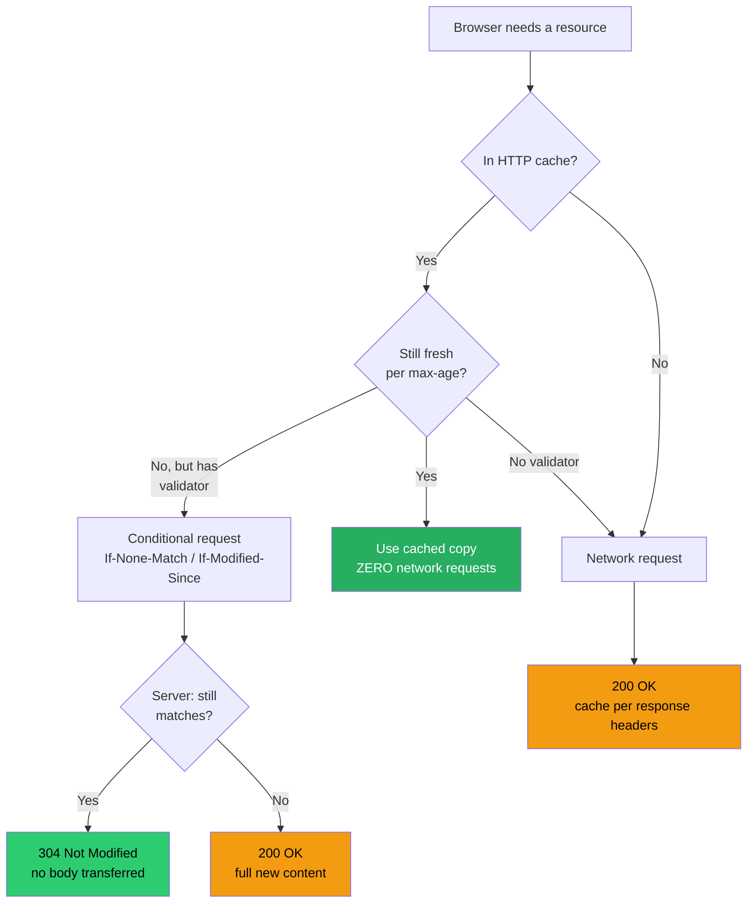
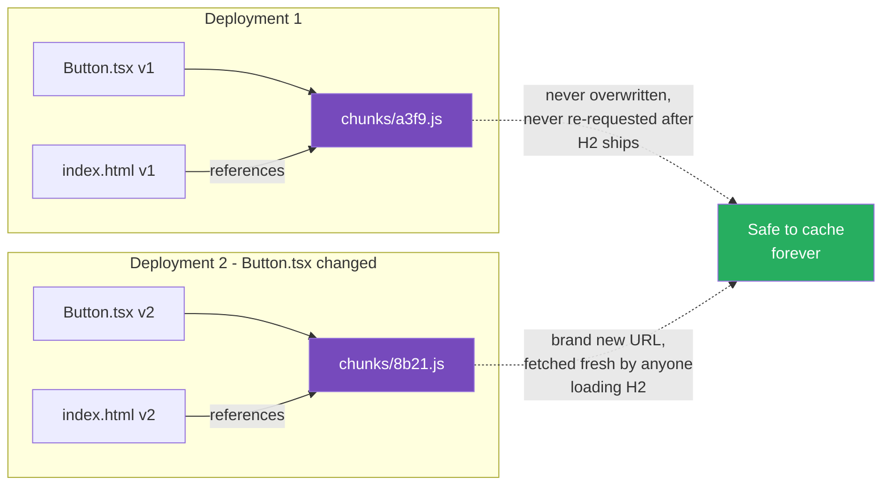

# 57 · Browser Caching

> **Browser caching is the first and most overlooked layer in the Next.js caching stack — it happens entirely on the user's machine, before any request reaches your CDN or server, and it's governed by plain HTTP headers rather than anything Next.js-specific. Understanding exactly how the browser decides whether to reuse a previously-fetched response, what role content hashing plays in making "cache forever" safe, and how this layer composes with everything covered later in this part (CDN caching, the Data Cache, the Full Route Cache, the Router Cache) is the foundation for reasoning correctly about the other five layers.**

It's tempting to treat "caching" as a single concept, but a request in a Next.js application can be satisfied by any of six distinct caches, each with different scope, storage location, and invalidation rules. Browser caching is the outermost layer — the one closest to the user and the one that, when configured correctly, means a huge fraction of requests for a returning visitor never leave their device at all.

---

## Table of Contents

- [Where Browser Caching Sits in the Stack](#where-browser-caching-sits-in-the-stack)
- [The Two Cache Validation Models](#the-two-cache-validation-models)
- [Cache-Control Directives in Depth](#cache-control-directives-in-depth)
- [How Next.js Sets Cache-Control by Asset Type](#how-nextjs-sets-cache-control-by-asset-type)
- [Content Hashing: Why "Cache Forever" Is Safe](#content-hashing-why-cache-forever-is-safe)
- [ETag and Last-Modified Validation](#etag-and-last-modified-validation)
- [The Browser's Internal Cache Layers](#the-browsers-internal-cache-layers)
- [Back/Forward Cache (bfcache)](#backforward-cache-bfcache)
- [Caching HTML Documents Specifically](#caching-html-documents-specifically)
- [Service Workers as a Programmable Cache Layer](#service-workers-as-a-programmable-cache-layer)
- [Inspecting Browser Cache Behavior](#inspecting-browser-cache-behavior)
- [Common Browser Caching Bugs](#common-browser-caching-bugs)
- [Architecture Diagrams](#architecture-diagrams)
- [Good Practices](#good-practices)
- [Bad Practices](#bad-practices)
- [Mental Model](#mental-model)
- [Common Misconceptions](#common-misconceptions)
- [Exercises](#exercises)
- [Further Reading](#further-reading)

---

## Where Browser Caching Sits in the Stack

A single page load in a Next.js application can touch up to six caching layers, in this order from the user's perspective:

```
1. Browser Cache         — this document. Local to the user's device.
2. Router Cache          — client-side, in-memory, holds RSC payloads for
                            visited routes during the session (Part XII, doc 06)
3. CDN / Edge Cache       — shared across all users, sits in front of your origin
4. Full Route Cache       — Next.js's cache of rendered HTML/RSC output (server)
5. Data Cache             — Next.js's cache of individual fetch() results
6. Request Memoization    — per-render deduplication of identical fetch() calls
```

This document covers layer 1 exclusively. It is the only layer in this list that is NOT Next.js-specific — it's the standard HTTP caching model implemented by every browser, and Next.js's job is simply to set the right headers so the browser uses it correctly.

---

## The Two Cache Validation Models

HTTP caching offers two fundamentally different strategies, and conflating them is the source of most browser-caching confusion:

### Strategy 1: Freshness (no network request at all)

```
Response includes: Cache-Control: max-age=31536000

Browser logic:
  "I have a cached copy of this URL that's less than 31536000 seconds old?
   Use it directly. Don't even ASK the server."

No network round-trip happens. Not even a fast one. Zero requests.
This is the fastest possible outcome — faster than any server-side cache,
because the request never leaves the device.
```

### Strategy 2: Validation (a cheap network request, possibly no body)

```
Response includes: Cache-Control: no-cache  (confusingly, this STILL allows caching)
            (or)    Cache-Control: max-age=0, must-revalidate

Browser logic:
  "I have a cached copy, but I'm not allowed to use it without checking.
   Send a conditional request: If-None-Match: <etag> or
   If-Modified-Since: <date>"

Server logic:
  "Does this match what I'd serve right now?
   YES → respond 304 Not Modified, NO BODY (tiny, fast)
   NO  → respond 200 OK with the new content"
```

The critical distinction: `no-cache` does NOT mean "don't cache" (a common misreading) — it means "cache it, but always validate before using it." The directive that actually prevents caching is `no-store`.

---

## Cache-Control Directives in Depth

```
max-age=<seconds>
  How long the response is considered fresh, starting from when it was
  generated (the Date header), not from when each browser fetched it.

s-maxage=<seconds>
  Same as max-age, but applies ONLY to shared caches (CDNs, proxies) —
  browsers ignore it. Lets you give the CDN a different freshness window
  than the end user's browser.

no-cache
  Always revalidate before using the cached copy. Caching IS allowed;
  using it WITHOUT asking first is not.

no-store
  Do not cache this response at all, anywhere. The strongest directive.
  Use for sensitive, request-unique content (e.g., a one-time download
  link, a page showing another user's private data in a multi-tenant
  preview).

private
  May be cached, but only by the end user's browser — NOT by shared
  caches (CDNs). Use for per-user content that's still safe to keep
  on the user's own device.

public
  May be cached by any cache, including shared/CDN caches. Without
  this, some intermediate caches treat authenticated responses as
  non-cacheable by default.

must-revalidate
  Once stale (past max-age), the cache MUST validate with the origin
  before use — it cannot serve stale content even if the origin is
  unreachable. Contrast with stale-while-revalidate behavior, which
  explicitly permits serving stale content under specific conditions.

immutable
  Tells the browser: this exact URL's content will NEVER change.
  Skips revalidation entirely even on a hard refresh in supporting
  browsers (Firefox, Safari). Only safe to use with content-hashed
  URLs (see below) — never on a stable, un-hashed path.

stale-while-revalidate=<seconds>
  Permits serving stale content for up to N additional seconds AFTER
  max-age expires, while a background revalidation happens. This is
  the same SWR concept covered in ISR (Part XI), expressed as a
  standard HTTP directive usable by any cache that supports it.
```

---

## How Next.js Sets Cache-Control by Asset Type

Next.js's default header behavior differs meaningfully by what kind of file is being served:

```
Static assets with a content hash in the filename
(e.g., /_next/static/chunks/847f9a2b.js):
  Cache-Control: public, max-age=31536000, immutable
  → Cached for a year, never revalidated. Safe because the filename
    itself changes whenever the content changes (see next section).

next/image optimized output (/_next/image?...):
  Cache-Control: public, max-age=31536000, immutable (typically,
  configurable via the `images.minimumCacheTTL` option in next.config.js
  for the underlying optimized image cache lifetime)

Statically generated HTML pages (output: 'export', or static routes
served by a CDN in front of Next.js):
  Typically: public, max-age=0, must-revalidate (delegate freshness
  control to the CDN/ISR layer rather than the browser long-term cache)
  — the HTML document itself is usually kept revalidate-able so that
  deploys and ISR updates reach users promptly, while the hashed assets
  it references are cached aggressively.

API Route Handlers (app/api/.../route.ts):
  No special default — YOU set Cache-Control explicitly based on the
  endpoint's actual freshness requirements (see Part XII docs on the
  Data Cache and Full Route Cache for the Next.js-side caching that's
  independent of these browser-facing headers).

Server Action responses:
  Not cached by the browser by design — these are mutations, and
  Next.js does not add caching headers that would encourage browsers
  to reuse a mutation's response.
```

### Why the split matters

```
The HTML document and the assets it references are deliberately
treated differently:

HTML (the "entry point"):
  Needs to be checked relatively often, because IT is what tells
  the browser which hashed asset filenames to fetch. If the HTML
  itself were cached for a year, users would never discover new
  deployments.

Hashed assets (referenced BY the HTML):
  Can be cached essentially forever, because a new deployment
  produces NEW filenames for changed content — the OLD filenames
  remain valid and unchanged for as long as any cached HTML still
  references them.
```

---

## Content Hashing: Why "Cache Forever" Is Safe

The `immutable` + `max-age=31536000` combination would be dangerous on a stable URL — but Next.js's build process never reuses a filename for different content:

```
Build 1:
  components/Button.tsx compiled → chunks/a3f9.js (hash of CONTENT)

You edit Button.tsx, deploy again:

Build 2:
  components/Button.tsx compiled → chunks/8b21.js (DIFFERENT hash,
  because the content changed)

The OLD file at chunks/a3f9.js is never overwritten and never
changes — it simply stops being referenced by any newly-generated
HTML. Any browser with chunks/a3f9.js cached from Build 1 can keep
that cache entry forever; it will just never be requested again
after the user loads a page generated from Build 2 (which references
chunks/8b21.js instead).
```

This is THE precondition that makes long-lived, non-revalidated browser caching safe at all: the cache key (the URL) and the cache value (the content) are bound together by the hash, so "cache this URL forever" can never become "serve stale content under this URL," because that URL's content is permanently fixed by construction.

```
Without content hashing, you'd face an impossible tradeoff:
  Cache aggressively → users on old deployments never see updates
  Revalidate often → lose most of the performance benefit

WITH content hashing, there is no tradeoff:
  Cache the hashed asset forever (it can never go stale, by definition)
  Revalidate the HTML entry point reasonably often (it's small, and
  it's the only thing that needs to "discover" new hashes)
```

---

## ETag and Last-Modified Validation

For responses that DO need periodic revalidation (rather than indefinite caching), the browser uses conditional requests to avoid re-downloading unchanged content:

```http
First request:
  GET /api/config HTTP/1.1

Response:
  HTTP/1.1 200 OK
  Cache-Control: no-cache
  ETag: "a1b2c3d4"
  Content-Length: 4096

  { ...4KB of JSON... }

Second request (after cache becomes stale, or with no-cache forcing
  validation every time):
  GET /api/config HTTP/1.1
  If-None-Match: "a1b2c3d4"

Response, if unchanged:
  HTTP/1.1 304 Not Modified
  ETag: "a1b2c3d4"
  (no body at all — saves the full 4KB transfer)

Response, if changed:
  HTTP/1.1 200 OK
  ETag: "e5f6g7h8"
  Content-Length: 4350
  { ...new 4.25KB of JSON... }
```

`Last-Modified` / `If-Modified-Since` work the same way but with a timestamp instead of an opaque content hash — generally considered a weaker validator (granularity is limited to one second, and content can theoretically change without the modification time changing on some systems), but simpler to generate when an ETag isn't readily available.

```
ETag generation strategies:
  Strong ETag: hash of the exact byte content — any change, however
               small, produces a different ETag
  Weak ETag (prefixed "W/"): semantically equivalent content produces
               the same ETag even if bytes differ (e.g., whitespace
               differences in generated HTML) — useful when byte-exact
               equality is stricter than you actually need
```

---

## The Browser's Internal Cache Layers

"The browser cache" is actually several distinct caches with different lifetimes and scopes, checked in this order:

```
1. Memory Cache
   Lifetime: until the tab/process closes (sometimes shorter)
   Scope: extremely fast, RAM-resident
   Holds: resources used by the current page, especially ones
          loaded multiple times in the same session

2. Disk Cache (HTTP Cache)
   Lifetime: governed by Cache-Control / expiration headers, persists
             across browser restarts
   Scope: per-origin, stored on disk
   Holds: anything fetched with cacheable headers — this is "the"
          HTTP cache most discussions of browser caching refer to

3. Back/Forward Cache (bfcache)
   Lifetime: a few minutes, page-instance-specific
   Scope: an entire PAGE's JavaScript heap and DOM state, frozen
   Holds: a fully restorable snapshot for instant back/forward
          navigation (see dedicated section below)

4. Preload Cache
   Lifetime: very short, single navigation
   Scope: resources hinted via <link rel="preload">
   Holds: a temporary bridge between an early fetch and the
          resource being "claimed" by the page that requested it
```

Chrome DevTools' Network panel surfaces the distinction directly in the "Size" column: `(memory cache)`, `(disk cache)`, or an actual transferred byte size (meaning neither cache served it).

---

## Back/Forward Cache (bfcache)

bfcache is worth covering specifically because it interacts with Next.js applications in ways that surprise developers:

```
What it does:
  When navigating AWAY from a page (e.g., clicking a link), instead
  of destroying the page's JS heap and DOM, the browser can FREEZE
  the entire page in memory. Navigating back instantly RESTORES it —
  no re-fetch, no re-render, no re-run of JavaScript. This produces
  the near-instant back-button experience users expect.

What can block it:
  - An active, unclosed WebSocket or fetch with no AbortController
  - Listeners on `unload` (NOT `beforeunload` — unload specifically
    is a strong bfcache-blocking signal in most browsers)
  - Open IndexedDB transactions at the moment of navigation
  - Pages marked with Cache-Control: no-store on the document itself
```

### Why this matters for a Next.js app

```tsx
// ❌ This pattern blocks bfcache in many browsers
useEffect(() => {
  window.addEventListener("unload", () => {
    sendAnalyticsBeacon(); // intent: fire on page leave
  });
}, []);

// ✅ Use the Page Visibility / pagehide pattern instead —
// does not block bfcache, and is actually MORE reliable
// (unload is not guaranteed to fire on mobile browsers at all)
useEffect(() => {
  const handler = () => {
    if (document.visibilityState === "hidden") {
      sendAnalyticsBeacon();
    }
  };
  document.addEventListener("visibilitychange", handler);
  return () => document.removeEventListener("visibilitychange", handler);
}, []);
```

```
Testing bfcache eligibility:
  Chrome DevTools → Application panel → Back/forward cache
  → "Test back/forward cache" button
  → Reports exactly which API or listener is blocking restoration,
    if any
```

---

## Caching HTML Documents Specifically

The HTML document itself deserves separate treatment from every other asset, because it's the one resource the browser ALWAYS has to ask about (it's the entry point — there's no "previous HTML" to compare a hash against before the user navigates):

```
For a static/ISR page served through a CDN (the common production setup):
  Browser-facing Cache-Control on the HTML: typically short or
  revalidate-focused (e.g., public, max-age=0, must-revalidate, or a
  short max-age like 60s), because:
    1. The CDN layer (next document in this part) is what actually
       provides the caching benefit for HTML — it's a SHARED cache
       serving all users, far more impactful than each individual
       browser independently caching the same HTML.
    2. Keeping the browser's OWN copy short-lived means users see
       new deployments and ISR updates promptly, while still
       benefiting from the CDN's shared cache for the actual
       "is this expensive to regenerate" question.

For a fully static export with no server/CDN layer making caching
decisions dynamically:
  You have more freedom to set longer browser cache lifetimes on
  the HTML itself, since there's no separate revalidation/ISR
  mechanism providing freshness guarantees elsewhere in the stack.
```

This is a deliberate division of labor: let the CDN/server layers (covered in the rest of this Part) handle "is this content still correct," and use the browser cache primarily for content that's either genuinely immutable (hashed assets) or where slight staleness is explicitly acceptable.

---

## Service Workers as a Programmable Cache Layer

A service worker sits BETWEEN the browser's HTTP cache and the network, giving you full programmatic control over caching decisions — at the cost of significant complexity:

```js
// A minimal service worker implementing a cache-first strategy
// for hashed static assets, falling back to network for everything else

self.addEventListener("fetch", (event) => {
  const url = new URL(event.request.url);

  if (url.pathname.startsWith("/_next/static/")) {
    // Hashed, immutable — safe to serve from cache indefinitely
    event.respondWith(
      caches.match(event.request).then((cached) => {
        if (cached) return cached;
        return fetch(event.request).then((response) => {
          const clone = response.clone();
          caches
            .open("static-v1")
            .then((cache) => cache.put(event.request, clone));
          return response;
        });
      }),
    );
  }
  // Everything else: let the browser's normal HTTP cache + network handle it
});
```

```
When a service worker is worth the complexity:
  ✅ Offline support is an actual product requirement
  ✅ You need caching logic the standard HTTP model can't express
     (e.g., "cache this API response but limit to the 50 most
     recent distinct query parameters")
  ✅ You're building toward a installable PWA experience

When it's NOT worth it:
  ❌ "Just to make the site faster" — standard Cache-Control headers
     combined with content hashing already solve the vast majority
     of real-world caching needs without the operational complexity
     of versioning, updating, and debugging a service worker
  ❌ You haven't measured an actual gap that HTTP caching leaves open
```

Next.js does not ship a service worker by default and has no special built-in integration for one — adding one is an application-level decision, typically via a library like `next-pwa` or a hand-rolled implementation, and it operates entirely independently of everything else described in this Part.

---

## Inspecting Browser Cache Behavior

```
Chrome DevTools → Network panel:
  - "Size" column shows "(disk cache)", "(memory cache)", or actual
    transferred bytes
  - Click a request → Headers tab → see the actual Cache-Control,
    ETag, and Age response headers
  - "Disable cache" checkbox: simulates a fresh visitor with no
    cache — essential for testing what a first-time visitor
    actually experiences

Chrome DevTools → Application panel → Cache Storage:
  - Inspect what a service worker (if any) has explicitly cached
  - Distinct from the browser's automatic HTTP disk cache

curl, for raw header inspection without browser-layer interference:
  curl -I https://example.com/_next/static/chunks/847f9a2b.js
  → Shows exactly what Cache-Control, ETag, etc. the server sent,
    with no browser caching behavior involved at all
```

---

## Common Browser Caching Bugs

### Bug 1: Caching an HTML document as if it were a hashed asset

```
Symptom: users report "I deployed a fix but some visitors still see
the old version" — even after waiting well past any ISR/CDN window.

Cause: an HTML document (or an API response acting as a quasi-page)
accidentally received long-lived, non-revalidated Cache-Control
headers — often via a misconfigured reverse proxy or CDN rule that
applies one blanket caching policy to an entire path pattern,
unintentionally catching the HTML entry point along with the
hashed assets it references.

Fix: ensure caching rules distinguish the HTML document (short/
revalidate-focused) from hashed static assets (long/immutable) —
never apply the same Cache-Control policy to both categories.
```

### Bug 2: Service worker serving content from a previous deployment indefinitely

```
Symptom: after deploying, returning users are stuck on an old
version of the app even after a hard refresh — but ONLY on browsers
where the service worker has previously installed.

Cause: a cache-first service worker strategy with no cache
versioning/cleanup logic — the SAME cache name is reused across
deployments, so old entries are never evicted, and the SW never
checks the network for assets it believes it already has cached.

Fix: version your cache names per deployment (e.g., `static-v${BUILD_ID}`)
and add a cleanup step in the SW's `activate` event that deletes
caches from previous versions.
```

---

## Architecture Diagrams

### The freshness-vs-validation decision the browser makes



### Why content hashing makes immutable caching safe



---

## Good Practices

### ✅ Good Practice — Explicit, differentiated Cache-Control for a custom API route

```tsx
/**
 * Good: a Route Handler that explicitly sets Cache-Control based on
 * the ACTUAL freshness requirement of this specific endpoint, rather
 * than relying on framework defaults or copy-pasting headers from
 * an unrelated route.
 */

// app/api/exchange-rates/route.ts
export async function GET() {
  const rates = await fetchLatestExchangeRates();

  return Response.json(rates, {
    headers: {
      // Public: safe for shared/CDN caches too, since rates are
      // identical for every requester.
      // max-age=60: browsers can reuse for 1 minute without asking.
      // stale-while-revalidate=300: for up to 5 more minutes past
      // that, serve the (slightly stale) cached copy WHILE quietly
      // revalidating in the background — smooths over the exact
      // moment of expiry for any cache that supports the directive.
      "Cache-Control": "public, max-age=60, stale-while-revalidate=300",
    },
  });
}
```

---

## Bad Practices

### ⚠️ Bad Practice — Blanket no-store on everything "to be safe"

```tsx
/**
 * Bad: defensively disabling all caching across an entire application
 * because of one genuinely sensitive endpoint, instead of scoping the
 * no-store directive to where it's actually needed. This silently
 * discards the entire benefit of content-hashed static assets,
 * forcing every visitor to re-fetch unchanged JS/CSS on every visit.
 */

// next.config.js
module.exports = {
  async headers() {
    return [
      {
        source: "/:path*",
        headers: [
          { key: "Cache-Control", value: "no-store" }, // ❌ applies to EVERYTHING
        ],
      },
    ];
  },
};
// This header now overrides Next.js's own carefully-chosen
// `public, max-age=31536000, immutable` for hashed chunks —
// every single asset, on every single page view, for every
// single visitor, is re-downloaded from scratch.

/**
 * ✅ Fix: scope no-store to the specific sensitive route,
 * leave Next.js's static asset caching defaults untouched
 */
// app/account/sensitive-export/route.ts
export async function GET() {
  const data = await getSensitiveOneTimeExport();
  return Response.json(data, {
    headers: { "Cache-Control": "no-store" }, // ✅ scoped to where it matters
  });
}
```

**Production impact:** A team added a blanket `no-store` rule after a security review flagged one specific endpoint that returned per-user sensitive data. The rule's `source: '/:path*'` pattern matched every request in the application, including `/_next/static/*`. Repeat-visitor page weight increased by several megabytes per session (every JS/CSS chunk re-downloaded on every visit instead of being served from disk cache), and Core Web Vitals for returning users regressed measurably. Scoping the directive to the single sensitive route restored static asset caching everywhere else.

---

## Mental Model

> 💡 **The browser caching mental model:**
>
> Think of the browser's HTTP cache as a **librarian who only re-checks a book's edition number if you ask for "the latest version" of something** (a no-cache/revalidate resource), versus a sealed, dated collector's edition you're told will never be reprinted (an immutable, content-hashed asset) — for the sealed edition, the librarian hands it over instantly without even glancing at the shelf for updates, because the edition number IS the guarantee that nothing has changed. Content hashing is what turns every static asset into a sealed collector's edition: change the content, and you get an entirely new edition number (URL), so the old sealed copies sitting on a million bookshelves around the world remain perfectly valid forever — they just stop being the edition anyone asks for going forward.

---

## Common Misconceptions

### "Cache-Control: no-cache means the response won't be cached"

It means the opposite of what it sounds like: the response IS cached, but must be revalidated with the server before each use. `no-store` is the directive that actually prevents caching.

### "A hard refresh always bypasses the browser cache entirely"

A hard refresh typically forces revalidation of cached resources (skipping the "use without asking" freshness check), but in browsers that respect the `immutable` directive, even a hard refresh can skip revalidation for assets marked immutable — which is exactly the intended behavior for content-hashed files.

### "Setting a long max-age is risky because users might be stuck on stale content"

This risk only exists for STABLE (non-hashed) URLs. For content-hashed asset filenames, a long max-age carries zero staleness risk by construction — the URL itself can never have new content put behind it.

### "ETags and Last-Modified solve the same problem, so you only need one"

They're complementary, not redundant: ETag is more precise (catches byte-level changes, supports weak comparison for semantic equivalence) while Last-Modified is cheaper to generate and useful as a fallback when an ETag can't easily be computed. Many servers send both.

### "Service workers are required for good caching in a modern web app"

Standard HTTP caching (Cache-Control + content hashing), which requires zero custom code, already covers the overwhelming majority of caching needs. Service workers add genuine value for offline support and bespoke caching logic — not as a default upgrade over HTTP caching.

---

## Exercises

### Exercise 1 — Observe content-hash caching directly

1. Build and run a Next.js app in production mode (`next build && next start`)
2. Open Chrome DevTools → Network tab, load the page
3. Find a request to `/_next/static/chunks/*.js` — inspect its Cache-Control header
4. Reload the page — observe the request now shows `(disk cache)` with zero network time
5. Change a component, rebuild, reload — observe the JS chunk now has a DIFFERENT filename, and the OLD filename is never requested again

### Exercise 2 — Diagnose a bfcache failure

```tsx
"use client";
function AnalyticsTracker() {
  useEffect(() => {
    const handler = () => sendBeacon("/api/track", { event: "leave" });
    window.addEventListener("unload", handler);
    return () => window.removeEventListener("unload", handler);
  }, []);
  return null;
}
```

1. Add this component to a page
2. In Chrome DevTools → Application → Back/forward cache, click "Test back/forward cache"
3. Observe the blocking reason reported
4. Fix it using the `visibilitychange` pattern shown in this document
5. Re-test and confirm bfcache eligibility is restored

### Exercise 3 — Design Cache-Control headers for a mixed API

For a hypothetical API with these four endpoints, write the exact `Cache-Control` header you'd use for each, with justification:

1. `/api/countries` — a static list of country codes/names, changes maybe once a year
2. `/api/exchange-rates` — updates every few minutes, identical for all users
3. `/api/users/me` — the current user's own profile data
4. `/api/users/me/export` — a one-time generated data export download link

---

## Further Reading

- [MDN: HTTP caching](https://developer.mozilla.org/en-US/docs/Web/HTTP/Caching) — the canonical reference for every directive covered here
- [web.dev: HTTP cache](https://web.dev/articles/http-cache) — practical guidance with worked examples
- [web.dev: Back/forward cache](https://web.dev/articles/bfcache) — full list of blocking APIs and testing guidance
- [Next.js docs: Headers configuration](https://nextjs.org/docs/app/api-reference/config/next-config-js/headers) — setting custom Cache-Control via next.config.js
- [HTTP RFC 9111: Caching](https://httpwg.org/specs/rfc9111.html) — the formal specification, for when MDN's summary isn't precise enough
- Next in this handbook: [58 · CDN & Edge Caching](./02-cdn-caching.md)

---

_Part of the [React + Next.js Engineering Handbook](../../README.md)_
