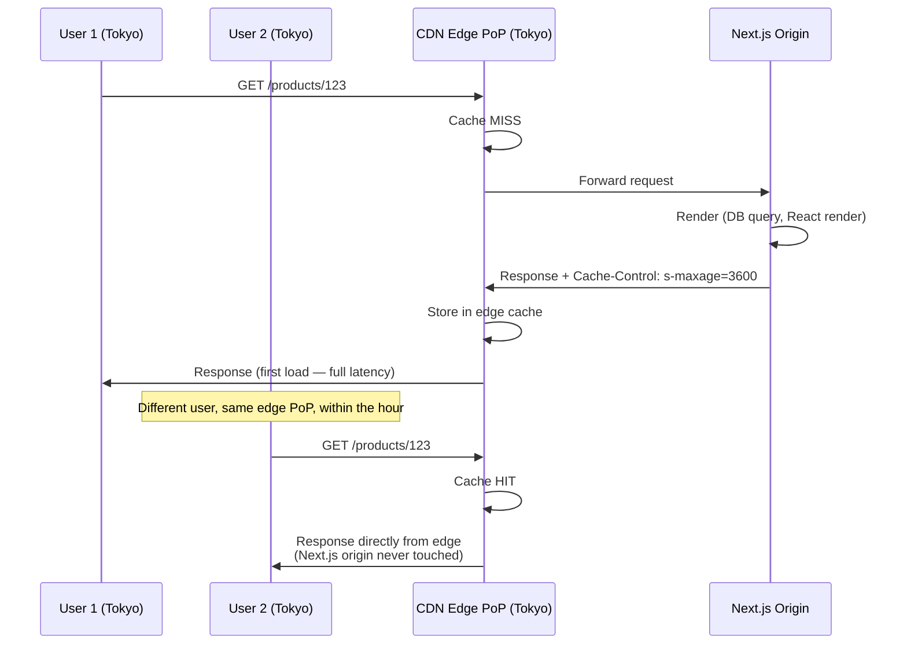
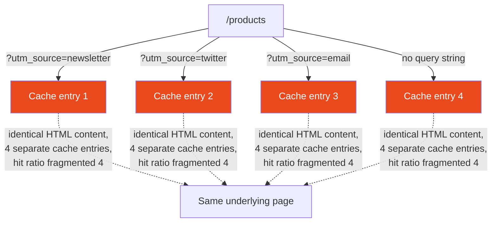

# 58 · CDN & Edge Caching

> **CDN caching is the second layer in the Next.js caching stack, and the one with the highest leverage: a single cached response served from a CDN's edge network can satisfy millions of requests from millions of different users without ever touching your origin server. Where browser caching (the previous document) benefits one user's one device, CDN caching is a shared cache — the work of generating a response happens once, and every subsequent visitor anywhere in the world who hits the same edge node gets the cached result. Understanding the shared-cache-specific directives, how cache keys are constructed, and how this layer interacts with Next.js's own Full Route Cache is essential for getting the deployment-time performance Next.js is designed to provide.**

A CDN (Content Delivery Network) is a distributed network of servers (Points of Presence, or PoPs) positioned geographically close to end users. When configured correctly, it intercepts requests before they reach your origin, serves cached responses directly from the nearest PoP, and only "falls through" to the origin when no valid cached copy exists. For a Next.js application, the CDN layer and Next.js's own server-side caching (Full Route Cache, Data Cache — covered later in this Part) work together but are NOT the same mechanism, and conflating them is a common source of confusion when debugging "why isn't this updating."

---

## Table of Contents

- [CDN Caching vs Browser Caching](#cdn-caching-vs-browser-caching)
- [Shared-Cache-Specific Directives](#shared-cache-specific-directives)
- [How Cache Keys Are Constructed](#how-cache-keys-are-constructed)
- [The Vary Header and Its Dangers](#the-vary-header-and-its-dangers)
- [Surrogate Keys / Cache Tags for Granular Purging](#surrogate-keys--cache-tags-for-granular-purging)
- [How Next.js's Full Route Cache Interacts with the CDN](#how-nextjss-full-route-cache-interacts-with-the-cdn)
- [Vercel's Edge Network Specifics](#vercels-edge-network-specifics)
- [Self-Hosted CDN Configuration](#self-hosted-cdn-configuration)
- [Cache Hit Ratio: The Metric That Matters](#cache-hit-ratio-the-metric-that-matters)
- [Purging and Invalidation Propagation Time](#purging-and-invalidation-propagation-time)
- [Multi-Tenant and Personalized Content at the CDN Layer](#multi-tenant-and-personalized-content-at-the-cdn-layer)
- [Debugging CDN Caching Issues](#debugging-cdn-caching-issues)
- [Architecture Diagrams](#architecture-diagrams)
- [Good Practices](#good-practices)
- [Bad Practices](#bad-practices)
- [Mental Model](#mental-model)
- [Common Misconceptions](#common-misconceptions)
- [Exercises](#exercises)
- [Further Reading](#further-reading)

---

## CDN Caching vs Browser Caching

The directives look similar, but the scope is fundamentally different:

```
Browser cache (previous document):
  Scope: ONE user's ONE device
  Benefit: that user doesn't re-fetch on their NEXT visit
  Storage: local disk/memory on the user's machine
  Population: happens lazily, one user at a time, after each
              individual fetch

CDN cache:
  Scope: EVERY user hitting the same edge node
  Benefit: the SECOND visitor anywhere near that PoP gets a cache
           hit, even if THEY personally have never visited before
  Storage: the CDN provider's edge infrastructure
  Population: happens once per edge node (on the first request that
              reaches it), then serves potentially millions of
              subsequent requests
```

This is why CDN cache hit ratio is a far more consequential metric than browser cache behavior at scale: a 95% CDN hit ratio means your origin server only does real work for 5% of total traffic, regardless of how many distinct individual users are visiting.

---

## Shared-Cache-Specific Directives

Some `Cache-Control` directives exist specifically to give CDNs different instructions than browsers:

```
s-maxage=<seconds>
  Overrides max-age, but ONLY for shared caches. Browsers ignore
  s-maxage entirely and fall back to max-age (or revalidate, if no
  max-age is present).

  Example: Cache-Control: max-age=0, s-maxage=3600
  → Browsers: treat as immediately stale, revalidate every time
  → CDN: cache for 1 hour, serve to everyone during that window
  This is an extremely common and useful pattern: let the CDN do
  the heavy lifting of absorbing traffic, while individual browsers
  always check in (cheaply, since the CDN itself answers most of
  those checks) so users see updates as soon as the CDN's window
  expires.

private
  Explicitly forbids SHARED caches from storing the response at all,
  while still permitting the browser's own (private) cache to do so.
  Critical for any per-user content that must never be cached at a
  layer shared across different users.

public
  Permits shared caching even for responses that might otherwise be
  treated cautiously (e.g., responses with a Set-Cookie header, which
  some caches treat as non-cacheable by default unless told otherwise).
```

### The s-maxage + stale-while-revalidate combination

```
Cache-Control: s-maxage=60, stale-while-revalidate=86400

CDN behavior:
  0-60s:      serve from cache, no origin hit
  60s-86460s: serve STALE from cache immediately, trigger ONE
              background regeneration request to origin
  After regen: cache updated, window resets

This is functionally identical to Next.js's ISR stale-while-revalidate
behavior (covered in Part XI), but expressed as a standard HTTP
directive that works with ANY CDN respecting it — not just Next.js's
own internal Full Route Cache mechanism.
```

---

## How Cache Keys Are Constructed

A CDN doesn't cache "a URL" in the abstract — it caches a response under a CACHE KEY, and understanding exactly what's included in that key explains both correct caching and a large class of caching bugs:

```
Default cache key components (typical CDN default):
  - Request method (GET requests are cached; POST/PUT typically aren't,
    by default)
  - Full URL including query string
  - Sometimes: a subset of headers, if Vary is used (see next section)

What this means in practice:
  /products?sort=price  and  /products?sort=name
  → DIFFERENT cache keys, DIFFERENT cache entries, even though they
    might be served by the exact same Next.js route component

  /products  and  /products/
  → Depending on the CDN's normalization rules, these might be the
    SAME or DIFFERENT cache keys — a common source of unexpectedly
    low hit ratios when both forms are linked to inconsistently
    throughout a site

  /products?utm_source=newsletter  and  /products
  → DIFFERENT cache keys by default, even though the actual PAGE
    CONTENT is identical — tracking query parameters are a classic
    cause of cache key explosion (see Bad Practices below)
```

---

## The Vary Header and Its Dangers

`Vary` tells caches "the response differs based on this REQUEST header too, not just the URL" — necessary for correctness in some cases, but dangerous if overused:

```http
Cache-Control: public, max-age=3600
Vary: Accept-Encoding
```

```
With Vary: Accept-Encoding:
  A request with "Accept-Encoding: gzip, br" and one with
  "Accept-Encoding: gzip" get SEPARATE cache entries, because the
  CDN might serve a Brotli-compressed body to one and gzip to the
  other — correctly accounting for the fact the response BODY
  actually differs.

The danger — Vary: User-Agent (a real anti-pattern seen in the wild):
  User-Agent headers have enormous, near-unique cardinality in
  practice (every browser version, OS version, and device
  combination produces a distinct string). Using Vary: User-Agent
  effectively creates a near-unique cache entry PER VISITOR,
  collapsing your CDN hit ratio toward zero while technically
  still "having a cache."
```

```
Safe, common Vary values:
  Accept-Encoding  — genuinely changes the response body (compression)
  Accept-Language  — if you serve genuinely different content per
                      locale AND don't already encode locale in the
                      URL path (most Next.js i18n setups DO encode
                      it in the path, making this Vary unnecessary)

Dangerous Vary values:
  User-Agent       — near-unique per visitor, destroys hit ratio
  Cookie           — same problem if cookies vary per-session, which
                      they almost always do
```

---

## Surrogate Keys / Cache Tags for Granular Purging

Purging an entire CDN cache (or even an entire path prefix) on every content update is wasteful — surrogate keys (sometimes called cache tags) let you invalidate precisely the cached responses affected by a specific change, even when those responses live under many different URLs:

```http
Response from origin, tagging it with the entities it depends on:
  Cache-Control: public, s-maxage=3600
  Surrogate-Key: product-123 category-electronics homepage-featured
```

```
Later, when product-123 changes:
  PURGE request to the CDN's API: invalidate tag "product-123"

  → Every cached response anywhere on the site that was tagged with
    "product-123" is purged in one operation — the product's own
    page, the category listing that featured it, AND the homepage's
    "featured" section — without needing to enumerate every URL
    individually or purge unrelated content that happens to share
    a URL prefix.
```

This is conceptually identical to Next.js's `revalidateTag()` (covered in Part XI's ISR document) but operating at the CDN layer rather than Next.js's internal Data/Route caches — some deployment setups use BOTH: `revalidateTag()` for Next.js's own server-side caches, plus CDN-level surrogate keys for a separate shared cache sitting in front of Next.js entirely. Not every CDN provider supports surrogate keys; it's a feature to check for specifically if granular, tag-based purging matters for your architecture.

---

## How Next.js's Full Route Cache Interacts with the CDN

This is the most common source of confusion in this part of the stack, because there are TWO caches in play for a single static/ISR page, and they're easy to conflate:

```
Layer A: Next.js's Full Route Cache (server-side, covered in the
         next document of this Part)
  - Lives wherever your Next.js server/serverless functions run
  - Populated when a static or ISR page is generated
  - Governed by `revalidate` and `revalidateTag`/`revalidatePath`

Layer B: A CDN sitting in FRONT of your Next.js deployment
  - Lives at the CDN's edge PoPs, geographically distributed
  - Populated by the RESPONSE HEADERS Next.js's server sends
  - Governed by whatever Cache-Control headers reach it

On Vercel specifically:
  Vercel's own Edge Network IS the CDN layer, and it's tightly
  integrated with Next.js's ISR mechanism — `revalidatePath`/
  `revalidateTag` calls propagate to invalidate the EDGE-cached
  copy directly, not just an internal server-side cache. This is
  why ISR "just works" on Vercel without manually configuring
  Cache-Control headers for a separate CDN product.

Self-hosted (Next.js behind your own CDN — Cloudflare, Fastly,
  CloudFront, etc.):
  These are now TWO INDEPENDENT caches. Calling `revalidatePath()`
  invalidates Layer A (Next.js's own internal cache) — it does
  NOT automatically purge Layer B (your separate CDN) unless you
  explicitly wire that up, typically via a webhook in your
  revalidation logic that also calls the CDN provider's purge API.
```

```tsx
// Self-hosted pattern: purge BOTH layers on content change
"use server";
import { revalidateTag } from "next/cache";

export async function publishProductUpdate(productId: string) {
  await db.products.update({
    /* ... */
  });

  // Layer A: Next.js's own server-side caches
  revalidateTag(`product-${productId}`);

  // Layer B: the separate CDN sitting in front of this deployment
  await fetch(`https://api.cdn-provider.com/purge`, {
    method: "POST",
    headers: { Authorization: `Bearer ${process.env.CDN_API_TOKEN}` },
    body: JSON.stringify({ surrogateKey: `product-${productId}` }),
  });
}
```

---

## Vercel's Edge Network Specifics

```
Distributed PoPs: Vercel's network spans many global regions; a
request is served from the nearest PoP to the requester, falling
through to a Serverless/Edge Function invocation (in the nearest
applicable region) only on a cache miss.

ISR integration: as noted above, revalidatePath/revalidateTag
invalidate the actual edge-cached entries, and on-demand
regeneration writes the fresh result back into the distributed
cache — propagating globally within seconds in the common case.

Stale-while-revalidate by default for ISR: the SWR behavior
described in Part XI's ISR document IS this CDN layer's behavior
on Vercel — there is no separate "configure your CDN's SWR window"
step, because ISR's revalidate window directly drives it.

Automatic compression, HTTP/2 (and HTTP/3 where supported), and
Brotli are handled at this layer without additional Next.js
configuration.
```

---

## Self-Hosted CDN Configuration

For a self-hosted Next.js deployment behind a separate CDN, you are responsible for:

```
1. Ensuring your Next.js server sends Cache-Control headers the CDN
   will actually respect for the response types you want cached
   (the CDN's DEFAULT behavior for dynamic-looking responses may be
   conservative — explicitly setting headers is safer than relying
   on a provider's defaults).

2. Configuring purge/invalidation hooks so that revalidatePath/
   revalidateTag calls in your Server Actions also trigger a CDN-side
   purge (as shown in the code example above) — otherwise the CDN
   layer can keep serving pre-update content even after Next.js's
   own internal cache has been correctly invalidated.

3. Deciding whether the CDN should cache HTML at all, or only the
   hashed static assets — a common, conservative starting
   configuration is: cache /_next/static/* aggressively (immutable),
   and either bypass the CDN for HTML entirely (forwarding straight
   to the Next.js server, which handles its OWN Full Route Cache/ISR
   logic) or cache HTML with a short s-maxage plus the purge hook
   described above.

4. Verifying the CDN doesn't strip or rewrite headers Next.js relies
   on for the App Router's RSC payload requests (notably the
   `RSC` and related internal request headers used for client-side
   navigation) — misconfigured CDN rules can occasionally interfere
   with these, producing confusing partial-hydration or navigation
   bugs that have nothing to do with React itself.
```

---

## Cache Hit Ratio: The Metric That Matters

```
Cache Hit Ratio = cached responses / total requests

A 99% hit ratio means: for every 100 requests, only 1 actually
reaches your origin server and does real computational work
(rendering, database queries). The other 99 are answered entirely
by the CDN's edge infrastructure.

Why this matters more than any individual response's latency:
  - Origin server capacity planning scales with the MISS volume,
    not the total traffic volume — a 99% hit ratio means your
    origin needs to handle roughly 1% of your actual traffic.
  - A single popular page miss-then-cache can absorb enormous
    traffic spikes (a "thundering herd" of requests for a page
    that just went viral) IF the CDN's request-coalescing behavior
    ensures only ONE of those simultaneous requests actually
    triggers a single origin fetch while the rest wait for that
    one result (most major CDNs implement this; verify your
    provider does too).
```

```
Common reasons for a lower-than-expected hit ratio:
  - Cache key fragmentation from tracking query parameters (see
    Bad Practices below)
  - An overly broad Vary header (User-Agent, Cookie)
  - Cache-Control headers that are more conservative than necessary
    (no-cache/private on content that's actually safe to share-cache)
  - A revalidate window so short that most requests fall just outside it
```

---

## Purging and Invalidation Propagation Time

```
Time-based expiration (s-maxage / revalidate window):
  Propagation is implicit — once the window passes, ANY edge node's
  copy becomes eligible for the stale-while-revalidate or full
  refetch behavior, independently, whenever it next receives a
  request. No explicit "push" step required.

On-demand purge (revalidateTag / revalidatePath / a CDN purge API call):
  Propagation time depends entirely on the provider's infrastructure
  — ranges from "a few seconds, globally" (typical for major CDN
  providers and for Vercel's ISR on-demand revalidation) to
  "tens of seconds to a couple minutes" for some self-hosted/
  third-party CDN purge APIs, particularly for FULL cache purges
  across very large path sets.

  A purge request returning success does NOT necessarily mean every
  edge node has already evicted the entry — for genuinely critical,
  must-be-instant updates, consider whether the content actually
  belongs in this caching layer at all, versus being served
  uncached/SSR for that specific narrow case.
```

---

## Multi-Tenant and Personalized Content at the CDN Layer

A common architectural trap: trying to CDN-cache content that's subtly different per visitor.

```
❌ Naive approach: cache the full HTML response, with personalization
   baked directly into the server-rendered output
   → Cache key would need to vary by user, destroying the entire
     point of a SHARED cache (you'd effectively have a private
     cache, but implemented with shared-cache infrastructure and
     its associated overhead)

✅ Correct approach: cache the SHARED parts at the CDN layer, deliver
   personalization through a mechanism that doesn't require a unique
   cache entry per user:
   - Client-side fetch for the personalized fragment (covered in
     Part XI's CSR document) — the cached shell loads from the CDN,
     personalization arrives via a separate, deliberately
     UNcached (or per-user-cached-elsewhere) request
   - Edge Middleware injecting a request-scoped header that a
     downstream, separately-cached or uncached component reads —
     the bulk of the page still benefits from CDN caching
   - A dedicated personalization service/cookie-based variant
     system designed explicitly around small, enumerable variant
     sets (e.g., an A/B test with 2-3 variants CAN be CDN-cached
     per-variant, since the cardinality is small and known in
     advance — this is fundamentally different from "infinite,
     per-user" personalization)
```

---

## Debugging CDN Caching Issues

```
Inspect cache status headers most CDNs add automatically:
  X-Cache: HIT | MISS | STALE
  X-Vercel-Cache: HIT | MISS | STALE | PRERENDER
  Age: <seconds since this response was generated/cached>
  (exact header names vary by provider — check your provider's docs)

curl -I against the production URL (bypassing browser-layer caching
entirely, isolating the CDN's actual behavior):
  curl -I https://example.com/products/123

Test cache key fragmentation directly:
  curl -I "https://example.com/products?utm_source=test1"
  curl -I "https://example.com/products?utm_source=test2"
  → Compare X-Cache status and Age headers between the two — if
    both show fresh MISS-then-HIT independently, you've confirmed
    the query string IS fragmenting your cache key
```

---

## Architecture Diagrams

### Request flow with a CDN layer in front of Next.js



### Cache key fragmentation from tracking parameters



---

## Good Practices

### ✅ Good Practice — Stripping tracking parameters before they reach the cache key

```tsx
/**
 * Good: Edge Middleware normalizes tracking query parameters into a
 * separate mechanism (e.g., setting a cookie or forwarding to
 * analytics) BEFORE the request reaches the cacheable route, so the
 * CDN cache key is based on the canonical URL rather than every
 * possible combination of marketing parameters.
 */

// middleware.ts
import { NextResponse } from "next/server";
import type { NextRequest } from "next/server";

const TRACKING_PARAMS = [
  "utm_source",
  "utm_medium",
  "utm_campaign",
  "fbclid",
  "gclid",
];

export function middleware(request: NextRequest) {
  const url = request.nextUrl;
  const hasTrackingParams = TRACKING_PARAMS.some((p) =>
    url.searchParams.has(p),
  );

  if (hasTrackingParams) {
    // Record the attribution data via a cookie (read by analytics
    // client-side, doesn't affect the cache key)...
    const response = NextResponse.next();
    const attribution = TRACKING_PARAMS.filter((p) => url.searchParams.has(p))
      .map((p) => `${p}=${url.searchParams.get(p)}`)
      .join("&");
    response.cookies.set("attribution", attribution, {
      maxAge: 60 * 60 * 24 * 30,
    });

    // ...then redirect to the CLEAN url, which IS cacheable consistently
    TRACKING_PARAMS.forEach((p) => url.searchParams.delete(p));
    return NextResponse.redirect(url);
  }

  return NextResponse.next();
}
```

---

## Bad Practices

### ⚠️ Bad Practice — Letting marketing campaigns silently destroy cache hit ratio

```
Bad: a marketing team adds utm_source, utm_medium, utm_campaign, and
gclid parameters to every ad and email campaign link pointing at the
SAME landing page — completely standard, expected marketing practice.

Without any cache-key normalization, the engineering side has
unknowingly built a CDN configuration where every distinct campaign
combination produces an entirely separate cache entry for what is,
content-wise, the exact same page.

Result observed in production:
  A landing page with a single piece of static content, linked from
  40+ different campaign variants (different combinations of
  utm_source × utm_medium × utm_campaign), showed a CDN hit ratio
  of roughly 15% instead of the 95%+ expected for genuinely static
  content — because the cache was effectively being asked to store
  and serve 40+ "different" pages that were byte-for-byte identical.
  Origin compute cost for this single landing page was an order of
  magnitude higher than necessary.

Fix: the Middleware-based normalization shown in Good Practices above
— stripping tracking parameters into a cookie/redirect before the
request reaches the cacheable route restored the expected hit ratio
within one deployment, with zero loss of attribution data (still
captured via the cookie, just no longer part of the cache key).
```

---

## Mental Model

> 💡 **The CDN caching mental model:**
>
> Think of a CDN as a **chain of local libraries with their own copy machines**, versus a single national archive (your origin server) that holds the one authoritative original of every document. The FIRST person at a local library branch who asks for a specific document triggers a call to the national archive, a copy is made, and that copy stays on the local branch's shelf. EVERY subsequent person who asks for that exact same document at that branch gets the LOCAL copy instantly — the national archive is never bothered again until the local copy is deliberately discarded (expires) or the archive announces "the document has changed, throw out your copies" (a purge/revalidateTag). The danger of letting trivial differences (a tracking sticker on the request, a near-unique "who's asking" identifier) count as "a different document" is that the local branch ends up making a fresh call to the national archive for nearly every single request, defeating the entire point of having local copies in the first place.

---

## Common Misconceptions

### "The CDN cache and Next.js's ISR cache are the same thing"

On Vercel they're tightly integrated (revalidateTag/revalidatePath purge the actual edge cache), but conceptually — and explicitly in self-hosted deployments — they are two independent caching layers that need to be kept in sync deliberately.

### "Adding query parameters never affects caching if the page content doesn't change"

By default, most CDNs include the full query string in the cache key regardless of whether your application code actually reads those parameters. Unless you've configured the CDN to ignore specific parameters (or normalize them away before the cacheable route, as shown above), each distinct query string combination gets its own cache entry.

### "A higher cache TTL is always better for performance"

A higher TTL improves hit ratio but increases the risk window for serving stale content after an update, unless paired with on-demand purging (revalidateTag/surrogate keys) for the cases where freshness actually matters. The right TTL is the longest one your content's actual change frequency and your purge mechanism's reliability can comfortably support.

### "Vary: Cookie is necessary because users have different cookies"

If the cookie's value doesn't actually change what content should be served (e.g., a purely client-side UI preference cookie, or a tracking cookie not read by the server-rendered output), adding it to Vary fragments the cache for no benefit. Only add Vary for headers that genuinely correspond to different response BODIES.

### "Purging the CDN cache is instant everywhere"

Purge propagation time varies by provider and purge type (single URL/tag vs. full wildcard purge) — ranging from near-instant to a couple of minutes for some providers' broader purge operations. For content where even a few seconds of staleness during propagation is unacceptable, reconsider whether that content belongs in this caching layer at all.

---

## Exercises

### Exercise 1 — Measure cache key fragmentation

Using `curl -I`, request the same conceptual page with five different combinations of `utm_*` query parameters. Compare the `X-Cache`/`Age` headers across all five requests. Are they sharing a cache entry, or fragmenting into five separate ones?

### Exercise 2 — Implement tracking-parameter normalization

Build the Middleware shown in Good Practices. Verify: a request with `?utm_source=test` redirects to the clean URL, an `attribution` cookie is set, and the clean URL's cache entry is shared across multiple different original tracking-parameter combinations.

### Exercise 3 — Design a multi-tenant caching strategy

For a hypothetical SaaS product where each customer has a custom subdomain (`acme.example.com`, `globex.example.com`) serving largely identical page templates but with tenant-specific branding (logo, colors) injected server-side, design a CDN caching strategy that:

1. Achieves a high hit ratio despite per-tenant content differences
2. Allows a single tenant's branding update to purge ONLY that tenant's cached pages
3. Does not require Vary: Host (which would fragment the cache 1:1 with tenant count, a legitimate use here — discuss why this case is actually fine despite the general caution against high-cardinality Vary values)

---

## Further Reading

- [MDN: HTTP caching — shared vs private caches](https://developer.mozilla.org/en-US/docs/Web/HTTP/Caching#shared_and_private_caches) — the s-maxage/private/public distinction in depth
- [Fastly: Cache key and Vary](https://www.fastly.com/documentation/guides/concepts/edge-state/cache/cache-keys/) — a detailed treatment from a major CDN provider's own docs
- [Vercel: Edge Network caching](https://vercel.com/docs/edge-network/caching) — platform-specific behavior referenced throughout this document
- [Cloudflare: Cache-Tag and purge by tag](https://developers.cloudflare.com/cache/how-to/purge-cache/purge-by-tags/) — a concrete surrogate-key implementation
- [web.dev: HTTP cache](https://web.dev/articles/http-cache) — shared foundation with the previous document in this Part
- Related in this handbook: [04 · Incremental Static Regeneration](../nextjs-rendering/04-incremental-static-regeneration.md)
- Next in this handbook: [59 · Request Memoization](./03-request-memoization.md)

---

_Part of the [React + Next.js Engineering Handbook](../../README.md)_
