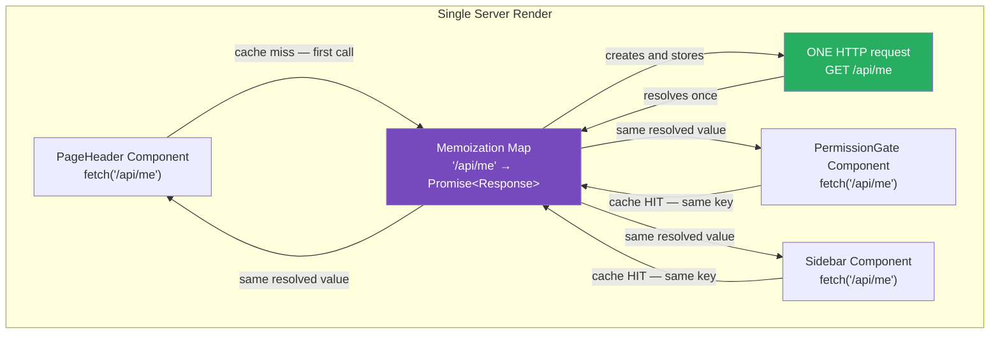
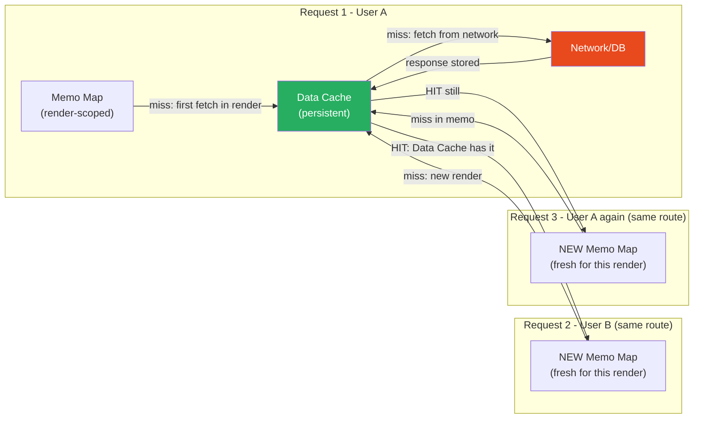

# 59 · Request Memoization

> **Request Memoization is the innermost, shortest-lived caching layer in the Next.js stack — it deduplicates identical fetch() calls that occur within a single server render, ensuring that no matter how many components in the same tree ask for the same data, the underlying network request (or database query) executes only once. Unlike every other caching layer covered in this Part, request memoization is entirely in-memory, lives for the duration of a single render, and resets completely when that render ends. It requires no configuration: if two fetch() calls in the same render pass the same URL and options, Next.js automatically returns the same Promise for both.**

The need for request memoization arises directly from the RSC component model. In a world where each Server Component fetches its own data (co-located fetching, covered in Part X), the same data may be legitimately needed by multiple components in the same tree — the current user's profile might be needed by the page header, a permission check, and the main content area simultaneously. Without memoization, this would mean three database hits per render; with it, it means one.

---

## Table of Contents

- [The Problem It Solves](#the-problem-it-solves)
- [How Memoization Works in Next.js's fetch Extension](#how-memoization-works-in-nextjss-fetch-extension)
- [The Memoization Scope: Per-Render, Not Per-Request](#the-memoization-scope-per-render-not-per-request)
- [Memoization vs the Data Cache](#memoization-vs-the-data-cache)
- [react/cache for Non-fetch Data Sources](#reactcache-for-non-fetch-data-sources)
- [How the Cache Key Is Constructed](#how-the-cache-key-is-constructed)
- [When Memoization Does NOT Apply](#when-memoization-does-not-apply)
- [Memoization and Parallel Component Rendering](#memoization-and-parallel-component-rendering)
- [Memoization and Streaming](#memoization-and-streaming)
- [Observing Memoization in Practice](#observing-memoization-in-practice)
- [Architecture Diagrams](#architecture-diagrams)
- [Good Practices](#good-practices)
- [Bad Practices](#bad-practices)
- [Mental Model](#mental-model)
- [Common Misconceptions](#common-misconceptions)
- [Exercises](#exercises)
- [Further Reading](#further-reading)

---

## The Problem It Solves

Consider a typical RSC component tree for an authenticated page:

```tsx
// Each component independently needs the current user
async function PageHeader() {
  const user = await fetch("/api/me").then((r) => r.json());
  return (
    <nav>
      <Avatar src={user.avatar} />
    </nav>
  );
}

async function PermissionGate({ children }) {
  const user = await fetch("/api/me").then((r) => r.json());
  if (!user.permissions.includes("view_page")) redirect("/403");
  return <>{children}</>;
}

async function PersonalizedContent() {
  const user = await fetch("/api/me").then((r) => r.json());
  const content = await fetchContentForUser(user.id);
  return <ContentArea content={content} />;
}

async function Page() {
  return (
    <PermissionGate>
      <PageHeader />
      <PersonalizedContent />
    </PermissionGate>
  );
}
```

Without memoization: three identical network requests to `/api/me` during a single server render — wasted latency, wasted API load.

With memoization (Next.js's default behavior): the `fetch('/api/me')` call returns the same `Promise` for all three components. The underlying HTTP request executes once; all three components receive the same resolved value.

This means co-located data fetching (each component fetches its own data, with no prop-drilling) is not just architecturally clean — it's also efficient by default.

---

## How Memoization Works in Next.js's fetch Extension

Next.js wraps the native `fetch` global with an extended version that adds caching behavior. At the memoization layer specifically:

```
Per render, Next.js maintains a Map:
  Map<cacheKey, Promise<Response>>

When any component calls fetch(url, options):
  1. Compute cache key = hash(url + method + headers + body)
  2. Check: is this key already in the Map?

  YES → return the EXISTING Promise (no new network request)
  NO  → create a new fetch Promise, store it in the Map, return it

When the render completes:
  The Map is discarded.
  The next render starts with an empty Map.
```

The critical detail: what's stored is the **Promise** itself, not the resolved value. If three components call `fetch('/api/me')` in the same render — even concurrently — they all receive the exact same Promise object. The underlying fetch fires once; all three `.then()` callbacks are registered on that one Promise.

```tsx
// This is what happens under the hood (simplified):
const memoCache = new Map<string, Promise<Response>>();

function memoizedFetch(url: string, options?: RequestInit): Promise<Response> {
  const key = createCacheKey(url, options);

  if (memoCache.has(key)) {
    return memoCache.get(key)!; // same Promise, no new request
  }

  const promise = originalFetch(url, options);
  memoCache.set(key, promise);
  return promise;
}
```

---

## The Memoization Scope: Per-Render, Not Per-Request

This is the most important distinction to internalize about request memoization:

```
PER-RENDER scope means:
  - Starts fresh at the beginning of React's render of the current
    route/component tree
  - Ends (cache discarded) when that render completes
  - Does NOT persist across multiple requests, even to the same route
  - Does NOT persist between a page render and a Suspense boundary
    resolution in the same overall response (each Suspense chunk
    renders with the SAME memoization cache that was in place when
    the overall page render started — they're part of the same
    server-side render pass)

PER-REQUEST scope would mean:
  - One HTTP request → one memoization cache
  - Two simultaneous HTTP requests for /dashboard by two different
    users → TWO separate caches (which is what actually happens)
  - Correct for SSR isolation between different users

PER-PROCESS scope would mean:
  - The server caches fetch results across multiple requests
  - This is the Data Cache (next document in this Part), NOT
    memoization — they are distinct layers
```

---

## Memoization vs the Data Cache

The two are often confused because they both prevent redundant network requests, but they operate at completely different scopes:

|                           | Request Memoization                      | Data Cache                                               |
| ------------------------- | ---------------------------------------- | -------------------------------------------------------- |
| Scope                     | One render pass                          | Across many renders / many requests                      |
| Storage                   | In-memory Map                            | Persistent (disk or external store)                      |
| Lifetime                  | Duration of one render                   | Until revalidation (revalidate window or tag/path purge) |
| Configuration             | None (automatic)                         | `next.revalidate`, `next.tags` on fetch options          |
| What it deduplicates      | Identical fetches within a single render | Identical fetches across separate renders/requests       |
| Affected by revalidateTag | No                                       | Yes                                                      |

```tsx
// Both layers in action, for the same fetch call:
const product = await fetch(`/api/products/${id}`, {
  next: { revalidate: 3600, tags: [`product-${id}`] },
}).then((r) => r.json());

// Memoization (automatic):
//   If ANOTHER component in THIS SAME RENDER also calls this fetch
//   with the same URL and options, they get the same Promise.
//   No extra HTTP request within this render.

// Data Cache (from the next.revalidate option):
//   The resolved response is ALSO stored persistently on disk/memory
//   with a 1-hour freshness window.
//   The NEXT render (a different request, a different user) for the
//   same URL will find this cached entry and avoid a new HTTP request
//   — entirely independently of whether memoization applies in THAT
//   render for some other reason.
```

---

## react/cache for Non-fetch Data Sources

`fetch()` is automatically memoized in Next.js. But what about direct database calls with Prisma, Drizzle, or any other async function that's not going through `fetch`?

React provides `cache()` — a function wrapper that applies the same per-render memoization semantics to any async function:

```tsx
// lib/data/user.ts
import { cache } from "react";
import { db } from "@/lib/db";

// Wrap the database call in cache() once, at the definition site
export const getCurrentUser = cache(async (userId: string) => {
  return db.users.findUnique({
    where: { id: userId },
    select: { id: true, name: true, email: true, role: true, avatar: true },
  });
});
```

```tsx
// Any number of components can now call getCurrentUser(userId) within
// the same render, and the database query will execute at most once,
// regardless of how many of them are rendered and in what order.

async function Header() {
  const user = await getCurrentUser(userId); // DB query #1 in this render
  return <Avatar src={user.avatar} />;
}

async function Sidebar() {
  const user = await getCurrentUser(userId); // Returns cached result, NO new query
  return <RoleIndicator role={user.role} />;
}

async function MainContent() {
  const user = await getCurrentUser(userId); // Returns cached result, NO new query
  const content = await fetchUserContent(user.id);
  return <ContentArea content={content} />;
}
```

### How react/cache differs from useMemo

```
useMemo (client-side):
  - Runs inside a React component function
  - Memoizes synchronous values between RE-RENDERS of the same
    component instance
  - Scope: one component instance, across multiple renders
  - Lives as long as the component is mounted

React.cache (server-side):
  - Wraps an async function definition (outside any component)
  - Memoizes async results within a single RENDER PASS
  - Scope: the full server-side render, across ALL components
  - Lives for the duration of one render, then resets

They're complementary, not alternatives.
```

---

## How the Cache Key Is Constructed

Understanding the cache key is essential for debugging cases where memoization unexpectedly misses:

### For fetch():

```
Cache key = hash(
  url (full, including query string),
  method (GET, POST, etc.),
  headers (request headers, as a sorted key-value structure),
  body (for POST requests with a body)
)
```

```tsx
// These ARE the same cache key (same URL, method, no headers/body):
await fetch("https://api.example.com/products/123");
await fetch("https://api.example.com/products/123");

// These are DIFFERENT cache keys:
await fetch("https://api.example.com/products/123");
await fetch("https://api.example.com/products/123?foo=bar"); // different URL

await fetch("https://api.example.com/products/123", {
  headers: { Authorization: "Bearer tokenA" },
});
await fetch("https://api.example.com/products/123", {
  headers: { Authorization: "Bearer tokenB" }, // different headers
});

// This one is NEVER memoized (POST is excluded by default):
await fetch("https://api.example.com/products", {
  method: "POST",
  body: JSON.stringify({ name: "Widget" }),
});
```

### For react/cache():

```
Cache key = the actual ARGUMENTS passed to the cached function,
            compared by reference for objects, by value for primitives

getCurrentUser('user-123')  and  getCurrentUser('user-123')
→ SAME cache key (same string primitive)

getCurrentUser({ id: 'user-123' })  and  getCurrentUser({ id: 'user-123' })
→ DIFFERENT cache keys (different object references, even with same shape)
// This is a common gotcha: pass primitives (IDs, strings) rather than
// objects to react/cache-wrapped functions when you want memoization to work
```

---

## When Memoization Does NOT Apply

### Case 1: POST requests

```tsx
// POST requests are not memoized — they're mutations, and making
// two POST requests appear to be "the same" would be incorrect
// semantics in nearly every real-world case.
await fetch("/api/orders", { method: "POST", body: "..." });
// Each call makes a distinct network request, even if called
// multiple times in the same render.
```

### Case 2: Explicitly opted-out fetches

```tsx
// cache: 'no-store' opts out of the Data Cache layer, but whether
// it also opts out of memoization is an implementation detail —
// in practice, two fetch() calls with identical URLs + { cache: 'no-store' }
// in the same render ARE deduplicated in current Next.js versions.
// Don't rely on this distinction for correctness; if you genuinely need
// two separate HTTP requests within one render, use different URLs or
// add a cache-busting query parameter.
```

### Case 3: Different render trees (Suspense / parallel routes)

```tsx
// Memoization applies within a SINGLE render. Parallel Route segments
// render independently, and their renders do NOT share a memoization cache.
// Similarly, a Server Action that's called DURING an ongoing render is
// a separate execution context — it does NOT share memoization with the
// page render that triggered it.
```

### Case 4: Arguments that are objects passed to react/cache

```tsx
// As noted in the cache key section: object arguments are compared
// by reference, so two structurally identical objects create two
// separate cache entries.
const getUser = cache(async (options: { userId: string }) => {
  /* ... */
});

// Memoization FAILS here — two different object instances, even with
// the same shape:
await getUser({ userId: "123" });
await getUser({ userId: "123" }); // cache miss!

// ✅ Fix: use a primitive as the cache key
const getUser = cache(async (userId: string) => {
  /* ... */
});
await getUser("123");
await getUser("123"); // cache hit ✅
```

---

## Memoization and Parallel Component Rendering

React renders Server Components in a tree, but because Server Components are async, multiple branches of the tree can be "in flight" simultaneously. Memoization correctly handles concurrent access to the same cache key:

```tsx
async function Page() {
  return (
    <>
      <Header /> {/* starts rendering, calls fetch('/api/me') */}
      <Sidebar /> {/* starts rendering concurrently, calls fetch('/api/me') */}
      <MainContent />{" "}
      {/* starts rendering concurrently, calls fetch('/api/me') */}
    </>
  );
}

// All three call fetch('/api/me') "simultaneously" (they all start
// before any of them has completed — they're all async, all in-flight):
//
// First to execute: stores a new Promise in the memoization Map
// Second and third: find the SAME Promise already in the Map, add their
//   .then() callbacks to it
//
// Result: ONE HTTP request for /api/me, THREE components receive the same data.
// This is correct and safe — Promises are designed for multiple consumers.
```

---

## Memoization and Streaming

When Suspense boundaries are used for streaming (Part X, doc 03), the memoization cache spans the entire render including content rendered within Suspense boundaries:

```tsx
async function Page() {
  // This fetch is in the shell
  const config = await fetch("/api/config").then((r) => r.json());

  return (
    <>
      <ShellContent config={config} />
      <Suspense fallback={<Skeleton />}>
        <SlowSection /> {/* renders later, as part of the stream */}
      </Suspense>
    </>
  );
}

async function SlowSection() {
  // Even though this renders "later" (streamed chunk),
  // it's part of the SAME server-side render pass.
  // If it also calls fetch('/api/config'), it gets the memoized result.
  const config = await fetch("/api/config").then((r) => r.json()); // memoized ✅
  return <SlowContent config={config} />;
}
```

The render pass for a single request is one continuous (though potentially asynchronous, time-sliced) execution — Suspense boundaries don't create new render contexts on the server.

---

## Observing Memoization in Practice

```tsx
// Instrument your data-fetching functions to count actual calls:

import { cache } from "react";

let callCount = 0;

export const getUser = cache(async (userId: string) => {
  callCount++;
  console.log(`[getUser] actual DB call #${callCount} for userId: ${userId}`);
  return db.users.findUnique({ where: { id: userId } });
});

// If you see call #1 but NOT #2, #3, etc. in the logs for a single
// request that renders multiple components all calling getUser(sameId),
// memoization is working correctly.
// If you see multiple calls, debug the arguments being passed —
// likely an object reference vs. primitive mismatch.
```

---

## Architecture Diagrams

### Request memoization within a single render



### Memoization scope vs Data Cache scope



---

## Good Practices

### ✅ Good Practice — A shared, cache()-wrapped data access layer

```tsx
/**
 * Good: All data-fetching functions that might be called from multiple
 * components in the same render are defined once, wrapped in cache(),
 * and imported wherever needed. Components don't need to know about
 * memoization — they just call the function, and deduplication happens
 * automatically.
 */

// lib/data/index.ts — all shared data access functions defined here
import { cache } from "react";
import { db } from "@/lib/db";

// Primitive argument → reliable cache key
export const getCurrentUser = cache(async (userId: string) => {
  return db.users.findUnique({
    where: { id: userId },
    select: { id: true, name: true, role: true, avatar: true },
  });
});

export const getUserPermissions = cache(async (userId: string) => {
  return db.permissions.findMany({ where: { userId } });
});

// Composed: both inner calls are themselves memoized —
// if multiple callers use getAuthorizedUser, the inner calls
// to getCurrentUser and getUserPermissions also deduplicate
export const getAuthorizedUser = cache(async (userId: string) => {
  const [user, permissions] = await Promise.all([
    getCurrentUser(userId),
    getUserPermissions(userId),
  ]);
  return { ...user, permissions };
});
```

---

## Bad Practices

### ⚠️ Bad Practice — Passing object arguments to react/cache functions

```tsx
/**
 * Bad: Wrapping a function with cache() but calling it with object
 * arguments. Object arguments are compared by reference, not value —
 * two structurally identical objects create two separate cache entries,
 * defeating the purpose of memoization entirely.
 *
 * This is a subtle gotcha because the function looks "memoized" and
 * there's no error or warning — it just silently doesn't deduplicate.
 */
import { cache } from "react";

// ❌ Object argument: memoization won't work as expected
const getProduct = cache(
  async (options: { productId: string; locale: string }) => {
    return db.products.findUnique({ where: { id: options.productId } });
  },
);

// These two calls look identical but create DIFFERENT cache entries
// because {} !== {} in JavaScript (different object references):
const product1 = await getProduct({ productId: "123", locale: "en" });
const product2 = await getProduct({ productId: "123", locale: "en" }); // cache miss!

/**
 * ✅ Fix: Use primitive arguments, or a stable string key
 */
const getProduct = cache(async (productId: string, locale: string) => {
  return db.products.findUnique({ where: { id: productId } });
});

// Now these DO share a cache entry — primitive arguments are compared by value
const product1 = await getProduct("123", "en");
const product2 = await getProduct("123", "en"); // cache HIT ✅
```

**Why this matters at scale:** In a server-rendered component tree, a single page might render 20-30 product cards, each calling `getProduct({ productId: card.id, locale })`. With object arguments, that's 20-30 separate database queries per render. With primitive arguments, it's one query per unique productId — a 20-30x reduction in database load for that render.

---

## Mental Model

> 💡 **The request memoization mental model:**
>
> Request memoization is like a **whiteboard in the server's rendering room that gets erased after every page is finished**. During a single page render, every component that needs "the current user's data" walks up to the whiteboard, looks for a sticky note labeled "GET /api/me." The FIRST component to look doesn't find one — it goes to fetch the data and writes the result on a new sticky note. Every SUBSEQUENT component to look finds the sticky note already there and just reads from it, without making another trip. When the render is done and the page is sent to the browser, the whiteboard is completely erased — the next render starts completely fresh. The sticky note never lasts beyond one page's rendering, and it's never visible from another room (another concurrent request). It's the rendering room's own local scratch pad, scoped to exactly one job.

---

## Common Misconceptions

### "Request memoization replaces the Data Cache"

They're complementary layers at completely different scopes. Memoization deduplicates calls within one render; the Data Cache deduplicates across renders and requests. Both are usually active simultaneously for the same `fetch()` call.

### "react/cache persists between requests like a server-side memory store"

`React.cache` creates per-render memoization — the cache is per-render, not per-process. There's no shared state between requests; each server-side render gets its own fresh cache. Using `React.cache` as a global in-process store for cross-request caching would be both incorrect semantics and a user-isolation bug.

### "POST requests are memoized if called twice in a render"

By definition, mutation semantics (POST, PUT, DELETE, PATCH) require each call to reach the server — two POST requests with identical bodies should NOT be collapsed into one (they represent two separate mutations). Next.js doesn't memoize POST requests.

### "Object arguments to react/cache() are compared deeply"

They're compared by reference (`===`), not by deep equality. This is standard JavaScript — no magic deep comparison happens automatically. Use primitive arguments (strings, numbers) as cache keys.

### "Using fetch() everywhere automatically solves the N+1 problem"

Request memoization deduplicates IDENTICAL calls (same URL, same arguments). It does not deduplicate calls with DIFFERENT URLs, even if those different calls could logically be batched into one database query. Memoization addresses "the same data needed by multiple components"; it doesn't replace careful query design for "related data that could be fetched together."

---

## Exercises

### Exercise 1 — Observe memoization in action

```tsx
// Add instrumentation to a shared data function:
import { cache } from "react";

let callCount = 0;
export const getUser = cache(async (userId: string) => {
  console.log(`DB hit #${++callCount} for user ${userId}`);
  return { id: userId, name: "Test User" };
});
```

Build a page that renders three components, each calling `getUser('test-123')`. Observe the server logs. How many "DB hit" lines appear per request? Try calling with an object argument instead of a string — what changes?

### Exercise 2 — Convert prop drilling to co-located cache() fetching

Take a component tree where the top-level page fetches the current user and drills it through several layers of props to a deeply nested component. Refactor it so each component calls `getCurrentUser(userId)` directly (via `React.cache`), eliminating all prop drilling. Verify (via instrumentation) that the database is still queried only once.

### Exercise 3 — Identify when memoization can't help

```tsx
// Given this data access pattern:
async function ProductList() {
  const products = await db.products.findMany({ take: 20 });
  return (
    <ul>
      {products.map((product) => (
        <ProductItem key={product.id} productId={product.id} />
      ))}
    </ul>
  );
}

async function ProductItem({ productId }: { productId: string }) {
  const details = await db.products.findUnique({ where: { id: productId } });
  return <li>{details?.name}</li>;
}
```

This is an N+1 pattern. Why doesn't memoization fix it? What's the correct solution (hint: it's a query design change, not a caching change)?

---

## Further Reading

- [React Docs: cache](https://react.dev/reference/react/cache) — the official API reference for server-side memoization
- [Next.js docs: Request Memoization](https://nextjs.org/docs/app/building-your-application/caching#request-memoization) — Next.js's own documentation of this layer
- [Next.js docs: Data Fetching Patterns](https://nextjs.org/docs/app/building-your-application/data-fetching/fetching) — how co-located fetching and memoization work together in practice
- Related in this handbook: [43 · Data Fetching Patterns](../nextjs-core/06-data-fetching.md) — how this layer is used in the larger data fetching model
- Next in this handbook: [60 · Data Cache](./04-data-cache.md)

---

_Part of the [React + Next.js Engineering Handbook](../../README.md)_
