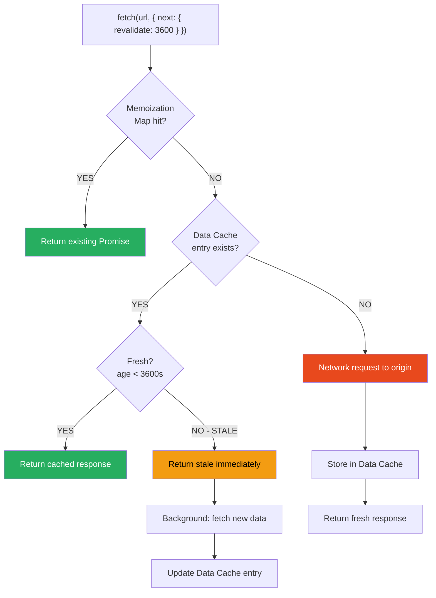
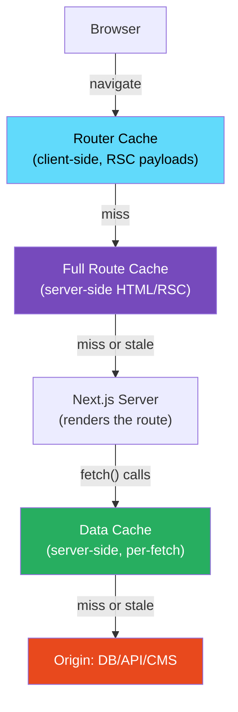

# 60 · Data Cache

> **The Data Cache is Next.js's persistent, server-side store for the results of individual fetch() calls. Where request memoization (the previous document) deduplicates identical fetches within a single render, the Data Cache persists those results across renders, across requests, and across deployments — until explicitly invalidated. It is the layer that transforms a dynamically rendered page (one that hits an external API on every request) into something that behaves like a statically cached page for the underlying data, without requiring the developer to restructure their code or add any explicit caching infrastructure.**

The Data Cache is distinct from the Full Route Cache (which caches the rendered HTML/RSC output of an entire route) and from the Router Cache (which caches RSC payloads client-side for navigation). The Data Cache operates at the fetch() call level: it's concerned with "did we already fetch this piece of data from this URL?" rather than "did we already render this page?" This granularity is what allows a single route to have some data fetched fresh on every request (a user's session token), some cached for an hour (a product catalog), and some cached until explicitly purged (a CMS article).

---

## Table of Contents

- [What the Data Cache Stores](#what-the-data-cache-stores)
- [Cache Entry Lifecycle](#cache-entry-lifecycle)
- [Configuring Fetch Caching Behavior](#configuring-fetch-caching-behavior)
- [The revalidate Option in Depth](#the-revalidate-option-in-depth)
- [Tags and On-Demand Invalidation](#tags-and-on-demand-invalidation)
- [Data Cache and Static vs Dynamic Routes](#data-cache-and-static-vs-dynamic-routes)
- [Data Cache Storage: Where It Lives](#data-cache-storage-where-it-lives)
- [Opting Out of the Data Cache](#opting-out-of-the-data-cache)
- [Data Cache and Request Memoization Interaction](#data-cache-and-request-memoization-interaction)
- [Data Cache and the Full Route Cache Interaction](#data-cache-and-the-full-route-cache-interaction)
- [Debugging the Data Cache](#debugging-the-data-cache)
- [Direct Database Calls and the Data Cache](#direct-database-calls-and-the-data-cache)
- [Architecture Diagrams](#architecture-diagrams)
- [Good Practices](#good-practices)
- [Bad Practices](#bad-practices)
- [Mental Model](#mental-model)
- [Common Misconceptions](#common-misconceptions)
- [Exercises](#exercises)
- [Further Reading](#further-reading)

---

## What the Data Cache Stores

For each `fetch()` call with caching enabled, Next.js stores:

```
Cache entry structure (conceptual):
  key:   hash(url + method + request-headers + body)
  value: {
    body:           the response body (text, JSON, binary),
    headers:        the response headers,
    status:         the HTTP status code,
    tags:           the tags associated with this entry,
    createdAt:      timestamp when this entry was written,
    revalidate:     the freshness window in seconds (or false for indefinite)
  }
```

The stored response body is exactly what the server returned — not a parsed JavaScript value. When a cache hit occurs, Next.js reconstructs a `Response` object from the stored data and returns it, as if a network request had just completed. Your `fetch(...).then(r => r.json())` code doesn't need to know or care whether it received a cached or fresh response.

---

## Cache Entry Lifecycle

```
1. A Server Component calls fetch(url, { next: { revalidate: 300 } })

2. Next.js checks the Data Cache for this key:

   CACHE MISS (no entry, or entry has been explicitly invalidated):
     a. Network request sent to the actual URL
     b. Response received
     c. Entry written to the Data Cache:
        { body, headers, status, tags, createdAt, revalidate: 300 }
     d. Response returned to the component

   CACHE HIT, FRESH (current time - createdAt < 300s):
     a. Cached body/headers/status returned directly
     b. No network request made
     c. createdAt NOT updated (the window continues from original creation)

   CACHE HIT, STALE (current time - createdAt >= 300s):
     a. Stale cached data returned to the component IMMEDIATELY
     b. Background revalidation triggered: fresh fetch sent to URL
     c. New entry written to Data Cache (replacing the stale one)
     d. createdAt reset to now (the 300s window starts fresh)

3. Explicit invalidation via revalidateTag() or revalidatePath():
     The entry is marked stale (or deleted) immediately.
     The NEXT fetch with this key treats it as a cache miss.
```

---

## Configuring Fetch Caching Behavior

The `next` option on `fetch()` is Next.js's extension to the standard Web Fetch API:

```tsx
// Default (no options): cached indefinitely (like force-cache)
// This changed in Next.js 15 — see important note below
const data = await fetch("https://api.example.com/data");

// Explicit indefinite caching (static — only revalidated by
// revalidateTag, revalidatePath, or redeploy):
const data = await fetch("https://api.example.com/data", {
  cache: "force-cache",
});

// Time-based revalidation — fresh for N seconds:
const data = await fetch("https://api.example.com/products", {
  next: { revalidate: 3600 }, // 1 hour
});

// Tag association for on-demand invalidation:
const data = await fetch(`https://api.example.com/products/${id}`, {
  next: {
    revalidate: 3600,
    tags: [`product-${id}`, "all-products"],
  },
});

// Opt OUT of the Data Cache entirely (no caching, fresh on every render):
const data = await fetch("https://api.example.com/user/me", {
  cache: "no-store",
});
```

### Important: Default behavior changed in Next.js 15

```
Next.js ≤ 14:
  fetch() with no options → cached indefinitely (force-cache behavior)
  This was the source of many "my data is stale but I don't know why"
  bugs for developers unfamiliar with the Data Cache behavior.

Next.js 15:
  fetch() with no options → NOT cached (no-store behavior)
  This is a breaking change for applications upgrading from 14 to 15.
  Explicit caching now requires explicit opt-in (force-cache or revalidate).
```

Always be explicit about caching intent rather than relying on the default.

---

## The revalidate Option in Depth

`revalidate: N` sets the freshness window in seconds. The interaction between `next.revalidate` and `export const revalidate` at the route segment level is hierarchical:

```tsx
// Route segment level (applies to ALL fetches in this route that
// don't have their OWN next.revalidate):
export const revalidate = 60;

async function Page() {
  // No per-fetch revalidate → inherits route-level: 60s
  const products = await fetch("/api/products").then((r) => r.json());

  // Per-fetch revalidate overrides the route-level setting:
  const config = await fetch("/api/config", {
    next: { revalidate: 86400 }, // 1 day — overrides route's 60s
  }).then((r) => r.json());

  // No-store overrides the route-level setting:
  const session = await fetch("/api/me", {
    cache: "no-store", // not cached — overrides route's 60s
  }).then((r) => r.json());

  return <Page products={products} config={config} session={session} />;
}
```

### The minimum-wins rule

```
When multiple revalidate values apply to the same route (from
different fetch calls with different windows), Next.js's Full
Route Cache for that route uses the MINIMUM (shortest) revalidate
value among all the fetches in the render — because a page can't
be considered "fresh" any longer than its least-fresh piece of data.

Example:
  fetch A: revalidate: 3600 (1 hour)
  fetch B: revalidate: 300  (5 minutes)
  fetch C: cache: 'no-store'

  → fetch C forces the route to be dynamic (no Full Route Cache)
  → If C weren't there: the route's effective revalidate would be 300
    (the minimum of A and B)
```

---

## Tags and On-Demand Invalidation

Tags allow invalidating cache entries by semantic label rather than by URL — essential when the same data appears behind multiple different URLs, or when you don't know the exact URL(s) that need to be invalidated at mutation time:

```tsx
// Tagging during fetch:
async function BlogPost({ slug }: { slug: string }) {
  const post = await fetch(`https://cms.example.com/api/posts/${slug}`, {
    next: {
      revalidate: 3600,
      tags: [
        `post-${slug}`, // specific to this post
        "all-posts", // any listing page that shows posts
        `author-${post.authorId}`, // pages showing this author's posts
      ],
    },
  }).then((r) => r.json());

  return <PostContent post={post} />;
}
```

```tsx
// Invalidating by tag (in a Server Action or Route Handler):
"use server";
import { revalidateTag } from "next/cache";

export async function publishPost(postId: string, slug: string) {
  await cms.posts.publish(postId);

  // Invalidate just this post's cache entries:
  revalidateTag(`post-${slug}`);

  // Also invalidate listing pages that show all posts:
  revalidateTag("all-posts");
}

export async function updateAuthorBio(authorId: string) {
  await db.authors.update({
    where: { id: authorId },
    data: {
      /* ... */
    },
  });

  // Invalidate ALL posts by this author (possibly dozens of URLs,
  // invalidated in one operation):
  revalidateTag(`author-${authorId}`);
}
```

### How revalidateTag() works internally

```
revalidateTag('post-abc') triggers:
  1. Next.js searches its Data Cache for all entries whose `tags`
     array includes 'post-abc'
  2. Each matching entry is marked as stale (or deleted, depending
     on implementation)
  3. The next request for any route that fetches data under those
     cache entries will trigger background revalidation
  4. revalidatePath() for any routes associated with those data
     entries is also triggered (affecting the Full Route Cache —
     see the next section)
```

---

## Data Cache and Static vs Dynamic Routes

The Data Cache interacts differently with static and dynamic routes:

```
STATIC route (no cookies(), headers(), etc.):
  At build time:
    fetch() calls run, responses stored in Data Cache AND used to
    generate the static HTML (also stored in the Full Route Cache)

  At request time (cache hit):
    Full Route Cache serves the pre-built HTML directly. The Data
    Cache is not consulted — the route HTML is already complete.

  At request time (Full Route Cache stale/expired, ISR regeneration):
    Next.js re-executes the route's render. fetch() calls now check
    the Data Cache — if THEY are still fresh, no new network
    requests are needed even during the ISR regeneration step.
    This can make ISR regeneration significantly faster: only
    actually-stale fetches hit the network.

DYNAMIC route (uses cookies(), headers(), force-dynamic, etc.):
  At request time (every request):
    Route re-renders fresh. fetch() calls check the Data Cache.
    Cached entries are served without a new network request.
    This means a dynamic route can still benefit from Data Cache
    for its underlying fetches — the route itself renders per-request,
    but the DATA it fetches may be cached across requests.
```

This last point is often overlooked: a route being "dynamic" (SSR-rendered) does not automatically make all its data fetches uncached. A dashboard that reads `cookies()` to get the user's session (making it dynamic) can still have its product catalog or configuration data served from the Data Cache.

---

## Data Cache Storage: Where It Lives

```
Local development (next dev):
  In-memory. Resets on every server restart. Intentionally no
  persistent caching during development — avoids confusing
  situations where stale cached data makes a local change appear
  not to be working.

Production on Vercel:
  Vercel's own distributed cache infrastructure, integrated with
  their Edge Network. Shared across all serverless function
  instances for the same deployment. Persists across function
  cold starts. Propagates revalidation globally.

Production, self-hosted:
  File system by default (.next/cache/fetch-cache directory).
  NOT shared across multiple server instances unless you configure
  a custom cache handler (Redis, shared filesystem, etc.) — the
  same limitation as ISR on self-hosted (covered in Part XI).

Custom cache handler (next.config.js):
  module.exports = {
    cacheHandler: require.resolve('./cache-handler.js'),
  };
  Allows implementing any storage backend for the Data Cache —
  Redis, Memcached, a CDN-backed store, etc.
```

---

## Opting Out of the Data Cache

There are several ways a specific fetch call can bypass the Data Cache:

```tsx
// Method 1: explicit no-store
const data = await fetch(url, { cache: "no-store" });

// Method 2: unstable_noStore() at the component level
import { unstable_noStore as noStore } from "next/cache";

async function RealtimeWidget() {
  noStore(); // opts ALL fetches in this component out of the data cache
  const data = await fetch(url);
  return <Widget data={data} />;
}

// Method 3: route-level dynamic = 'force-dynamic'
export const dynamic = "force-dynamic";
// This opts the entire route out of static generation, but individual
// fetch() calls CAN still use the Data Cache unless they also use
// cache: 'no-store' or noStore()

// Method 4: route-level revalidate = 0
export const revalidate = 0;
// Sets the route's freshness window to zero — effectively equivalent
// to force-dynamic for the route, while still technically permitting
// individual fetches to have their own longer revalidate windows
```

---

## Data Cache and Request Memoization Interaction

These two layers work together in a layered lookup:

```
fetch() called in a component:

  Step 1: Check Memoization Map (in-memory, this render only)
    → HIT: return the existing Promise (no further checks needed)
    → MISS: continue

  Step 2: Check Data Cache (persistent, across renders)
    → HIT, FRESH: reconstruct Response from stored data, add to
                   Memoization Map, return
    → HIT, STALE: return stale immediately, trigger background
                   revalidation, add to Memoization Map
    → MISS: continue

  Step 3: Network request
    → Fetch from origin URL
    → Store in Data Cache (if caching is configured)
    → Store in Memoization Map
    → Return Response to component
```

---

## Data Cache and the Full Route Cache Interaction

```
The Data Cache is the FOUNDATION that the Full Route Cache builds on.

When a route is statically generated or ISR-regenerated:
  1. fetch() calls run, responses stored in Data Cache
  2. The rendered HTML/RSC payload is computed FROM those fetched values
  3. The HTML/RSC payload is stored in the Full Route Cache
  4. The Full Route Cache entry's freshness is bound by the MINIMUM
     revalidate across all fetch() calls in the render

When the Full Route Cache entry expires (ISR stale):
  1. The next request triggers background regeneration
  2. During regeneration, fetch() calls check the Data Cache first
  3. If the Data Cache entries are STILL FRESH (their own revalidate
     hasn't expired yet): NO new network requests — the route
     re-renders using cached data
  4. Only actually-expired Data Cache entries trigger new network
     requests during regeneration
  5. A new Full Route Cache entry is written

When revalidateTag() or revalidatePath() is called:
  → Data Cache entries are marked stale
  → Full Route Cache entries that depended on those data entries
     are also marked stale (so the HTML will be regenerated using
     fresh data on the next request)
```

---

## Debugging the Data Cache

```
In local development (next dev):
  The Data Cache is in-memory and verbose logging is available:
  Set NEXT_PRIVATE_DEBUG_CACHE=1 environment variable to log
  cache hits and misses to the server console.

In production:
  Vercel Analytics → Functions tab shows cache hit/miss breakdown
  per function invocation for routes on Vercel.

  For self-hosted, instrument the custom cache handler (if using one)
  with metrics — cache hit rate, entry count, eviction frequency.

In any environment — add explicit logging around cached fetches:
```

```tsx
async function DebugFetch(url: string, options?: RequestInit) {
  const start = Date.now();
  const response = await fetch(url, options);
  const source = response.headers.get("x-nextjs-cache") ?? "unknown";
  console.log(`[fetch] ${url} → ${source} (${Date.now() - start}ms)`);
  return response;
}
// x-nextjs-cache header: 'HIT', 'MISS', 'SKIP', 'STALE' in
// Next.js development mode — exact header name may vary by version
```

---

## Direct Database Calls and the Data Cache

The Data Cache only covers `fetch()`. Direct database calls via Prisma, Drizzle, or raw SQL do NOT participate in the Data Cache:

```tsx
// ❌ NOT cached by the Data Cache
const products = await prisma.products.findMany();

// ✅ IS cached by the Data Cache (but requires a network hop to your DB)
const products = await fetch("https://your-api/products").then((r) => r.json());
```

For direct database calls that should benefit from caching, the options are:

```tsx
// Option 1: Route Handler in front of the DB call
// app/api/products/route.ts
export const revalidate = 3600; // route-level caching
export async function GET() {
  const products = await prisma.products.findMany();
  return Response.json(products);
}
// Now fetch('https://your-app/api/products') is Data-Cache-eligible

// Option 2: unstable_cache for direct DB calls (Next.js 14+)
import { unstable_cache } from "next/cache";

const getCachedProducts = unstable_cache(
  async () => prisma.products.findMany(),
  ["all-products"], // cache key
  {
    revalidate: 3600,
    tags: ["products"],
  },
);

// Now this function's result IS cached by the Data Cache,
// even though it doesn't go through fetch()
const products = await getCachedProducts();
```

`unstable_cache` is the lower-level primitive that `fetch()`'s caching builds on top of — it's "unstable" in the sense that its API may change, but it's widely used in production for exactly this purpose.

---

## Architecture Diagrams

### Data Cache lookup sequence



### The four Next.js cache layers and their relationship



---

## Good Practices

### ✅ Good Practice — Independent revalidation windows per data type

```tsx
/**
 * Good: Each piece of data has its OWN revalidation window calibrated
 * to that data's actual change frequency — independent of the overall
 * route's caching strategy. The route benefits from the Data Cache
 * at different granularities for different data, without forcing a
 * single "lowest common denominator" freshness setting on everything.
 */
async function ProductPage({ params }: { params: { id: string } }) {
  const [product, inventory, config] = await Promise.all([
    // Product info changes rarely → long cache window
    fetch(`https://api.example.com/products/${params.id}`, {
      next: { revalidate: 86400, tags: [`product-${params.id}`] },
    }).then((r) => r.json()),

    // Inventory changes frequently → short cache window
    fetch(`https://api.example.com/inventory/${params.id}`, {
      next: { revalidate: 30, tags: [`inventory-${params.id}`] },
    }).then((r) => r.json()),

    // Config (site settings) almost never changes → very long cache
    fetch("https://api.example.com/config", {
      next: { revalidate: 604800, tags: ["site-config"] }, // 1 week
    }).then((r) => r.json()),
  ]);

  return (
    <ProductView product={product} inventory={inventory} config={config} />
  );
}
// The route's effective Full Route Cache window is min(86400, 30, 604800) = 30s
// But the DATA for product and config doesn't refetch every 30s —
// only inventory does. On ISR regeneration at 30s, only the inventory
// fetch hits the network; product and config come from the Data Cache.
```

---

## Bad Practices

### ⚠️ Bad Practice — Using cache: 'no-store' on shared configuration data

```tsx
/**
 * Bad: Adding cache: 'no-store' to a fetch that returns data which
 * is genuinely shared across all users and changes very rarely.
 * Done reflexively "to make sure I always have fresh data," this
 * forces a network round-trip on every render for data that could
 * safely be cached for hours.
 */
async function Layout({ children }) {
  // ❌ 'no-store' on config that changes once a month at most
  const siteConfig = await fetch("https://api.example.com/site-config", {
    cache: "no-store", // forced fresh on every request, unnecessarily
  }).then((r) => r.json());

  return (
    <html>
      <body style={{ fontFamily: siteConfig.brandFont }}>{children}</body>
    </html>
  );
}
// This layout renders on every page view (layouts are shared).
// With no-store, EVERY page view for EVERY user triggers a network
// request to the config API — even though the response would be
// identical for every one of those requests.

/**
 * ✅ Fix: An appropriate revalidate window + tag for on-demand
 * invalidation when someone actually changes the config
 */
async function Layout({ children }) {
  const siteConfig = await fetch("https://api.example.com/site-config", {
    next: { revalidate: 86400, tags: ["site-config"] }, // 1 day safety net
  }).then((r) => r.json());

  return (
    <html>
      <body style={{ fontFamily: siteConfig.brandFont }}>{children}</body>
    </html>
  );
}
// When the config actually changes, call revalidateTag('site-config')
// in the admin Server Action — instant propagation, zero wasted requests
// between config changes.
```

---

## Mental Model

> 💡 **The Data Cache mental model:**
>
> The Data Cache is like a **shared shelf of pre-poured ingredient bowls in a professional kitchen**, where each bowl is labeled with a best-by time. The first cook who needs "chopped onions" (a fetch to `/api/products/123`) checks the shelf — if there's a fresh bowl there, they grab it directly without chopping. If the bowl is past its best-by time, they grab the current (possibly slightly past-its-prime) bowl to use immediately while sending an assistant to chop a fresh batch in the background. If there's no bowl at all, they chop one fresh and put it on the shelf for the next cook. All cooks working in the kitchen at the same time SHARE this shelf — so a dozen simultaneous requests to the same page only cause one actual set of ingredient fetches, not a dozen. When an admin (a Server Action) updates a product, they can throw out just the affected bowl (`revalidateTag('product-123')`) without touching the bowls for other ingredients — far more targeted than clearing the entire shelf.

---

## Common Misconceptions

### "The Data Cache is the same as the Full Route Cache"

The Data Cache caches individual fetch() responses (raw data). The Full Route Cache caches the rendered HTML/RSC output of entire routes. They're complementary: the Full Route Cache is built from data in the Data Cache, but they have independent lifetimes, independent invalidation, and serve different purposes.

### "cache: 'no-store' on a fetch() makes the whole route dynamic"

`cache: 'no-store'` opts that SPECIFIC fetch out of the Data Cache — the route's overall rendering mode (static vs dynamic) is determined by whether the route uses cookies(), headers(), or other dynamic APIs, not by whether individual fetches opt out of caching.

### "revalidateTag() immediately updates all users' browsers"

`revalidateTag()` marks Data Cache and Full Route Cache entries as stale — it tells Next.js's SERVER-SIDE caches to re-generate on the next request. Browser caches and the Router Cache (client-side navigation cache) are not directly affected by revalidateTag(). Users who have the old HTML in their browser cache or Router Cache may see stale content until those caches naturally expire or they navigate to trigger a fresh fetch.

### "Direct Prisma/Drizzle calls are automatically cached by the Data Cache"

Only `fetch()` is intercepted and potentially cached by the Data Cache. Direct database clients need `unstable_cache` or a Route Handler in front of them to benefit from Data Cache caching.

### "A shorter revalidate is always safer"

A very short revalidate (say, 5 seconds) on a shared-for-all-users fetch means the Data Cache entries are refreshed continuously, generating constant load on your origin even if the underlying data hasn't changed. Tag-based on-demand invalidation is typically a much better strategy for "I want it fresh after it changes" scenarios.

---

## Exercises

### Exercise 1 — Observe the Data Cache hit/miss directly

In a Next.js project, add timing logs around a fetch call:

```tsx
const start = Date.now();
const data = await fetch("https://jsonplaceholder.typicode.com/posts", {
  next: { revalidate: 30 },
});
console.log(`Fetch took: ${Date.now() - start}ms`);
```

Load the page twice in quick succession. Compare the logged timing — a cache HIT should be orders of magnitude faster than the initial network request.

### Exercise 2 — Implement unstable_cache for a database call

Take a component that calls Prisma directly without caching:

```tsx
async function CategoryList() {
  const categories = await prisma.categories.findMany({
    orderBy: { name: "asc" },
  });
  return (
    <ul>
      {categories.map((c) => (
        <li key={c.id}>{c.name}</li>
      ))}
    </ul>
  );
}
```

Wrap the database call with `unstable_cache`, add an appropriate revalidation window and a tag, and add a Server Action that calls `revalidateTag` on that tag. Verify the category list updates within seconds of calling the action, without a full rebuild.

### Exercise 3 — Design a tagging strategy for a content platform

For a blog platform with: articles (each with a unique slug), author pages (each showing all articles by that author), category pages (each showing articles in a category), and a homepage (showing the top 5 recent articles from all categories), design the complete fetch tagging strategy such that:

1. Publishing a new article invalidates the correct listing pages
2. Updating an article invalidates only that article's page and its author/category listing
3. Deleting an article does not leave a "ghost" in any listing cache

---

## Further Reading

- [Next.js docs: Data Cache](https://nextjs.org/docs/app/building-your-application/caching#data-cache) — official reference
- [Next.js docs: unstable_cache](https://nextjs.org/docs/app/api-reference/functions/unstable_cache) — caching non-fetch async functions
- [Next.js docs: revalidateTag](https://nextjs.org/docs/app/api-reference/functions/revalidateTag) — on-demand tag invalidation
- [Next.js: Caching overview diagram](https://nextjs.org/docs/app/building-your-application/caching#overview) — the official full-stack cache interaction diagram
- Related in this handbook: [53 · Incremental Static Regeneration](../nextjs-rendering/04-incremental-static-regeneration.md) — how the Data Cache underpins ISR
- Next in this handbook: [61 · Full Route Cache](./05-full-route-cache.md)

---

_Part of the [React + Next.js Engineering Handbook](../../README.md)_
