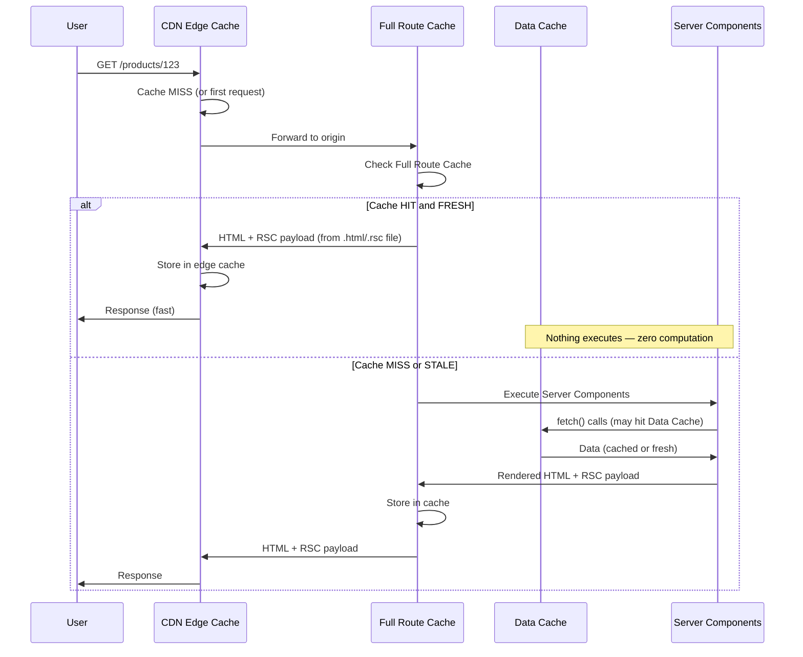
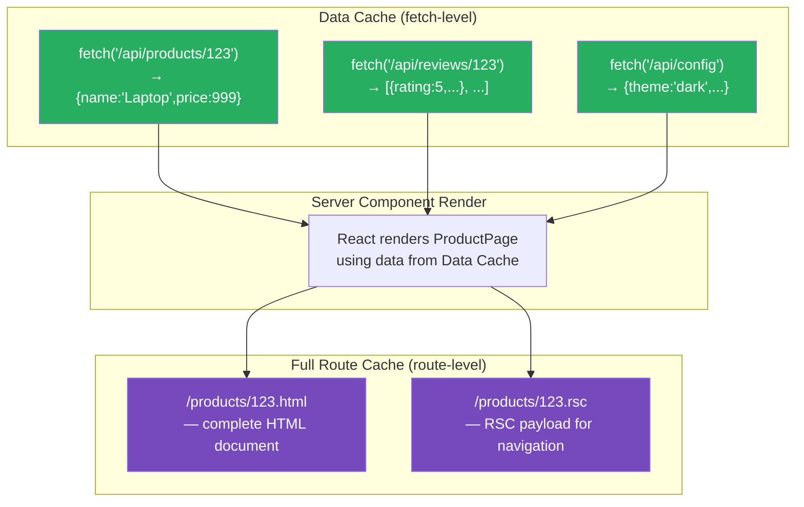

# 61 · Full Route Cache

> **The Full Route Cache is Next.js's server-side store for the rendered output of entire routes — both the HTML document and the RSC payload that React uses to reconstruct the component tree for client-side navigation. While the Data Cache stores individual fetch() results, the Full Route Cache stores what was BUILT from those results: the complete rendered page. For statically generated and ISR routes, the Full Route Cache is what makes subsequent requests for the same route essentially free — no re-execution of Server Components, no re-execution of data fetches, no React rendering. The request hits the Full Route Cache, and a complete, pre-built response is returned immediately.**

The Full Route Cache is the server-side counterpart to the Browser Cache: the browser caches what it received last time (for this specific user), and the Full Route Cache caches what was rendered last time (for all users). For a static or ISR page, a cache hit means ZERO server-side computation — not "fast computation," literally zero: no Server Component code runs, no fetch() calls are checked, no HTML is generated. The server reads a file and sends it.

---

## Table of Contents

- [What the Full Route Cache Stores](#what-the-full-route-cache-stores)
- [Routes That Are Cached vs Routes That Are Not](#routes-that-are-cached-vs-routes-that-are-not)
- [The Full Route Cache Lifecycle](#the-full-route-cache-lifecycle)
- [How the Full Route Cache Relates to Static Generation and ISR](#how-the-full-route-cache-relates-to-static-generation-and-isr)
- [Full Route Cache Invalidation](#full-route-cache-invalidation)
- [The RSC Payload Stored Separately from HTML](#the-rsc-payload-stored-separately-from-html)
- [Full Route Cache and the CDN Layer](#full-route-cache-and-the-cdn-layer)
- [What Forces a Route Out of the Full Route Cache](#what-forces-a-route-out-of-the-full-route-cache)
- [Inspecting Full Route Cache Status](#inspecting-full-route-cache-status)
- [Full Route Cache Storage Location](#full-route-cache-storage-location)
- [Architecture Diagrams](#architecture-diagrams)
- [Good Practices](#good-practices)
- [Bad Practices](#bad-practices)
- [Mental Model](#mental-model)
- [Common Misconceptions](#common-misconceptions)
- [Exercises](#exercises)
- [Further Reading](#further-reading)

---

## What the Full Route Cache Stores

For each statically-cacheable route, the Full Route Cache maintains two artifacts:

```
1. The HTML Document
   Stored at: .next/server/app/products/123.html
   Used for:  direct navigation (typing URL, clicking an external link,
              page refresh) — the first HTTP response the browser receives

2. The RSC Payload
   Stored at: .next/server/app/products/123.rsc
   Used for:  client-side navigation (clicking a <Link> component) —
              React's runtime fetches this and reconciles it against
              the current client component tree

Both are generated from the same server render, stored as separate files,
and served from the same cache entry. When the Full Route Cache is
invalidated, BOTH are discarded together.
```

### Why two separate formats

```
HTML is what the browser renders for initial page loads:
  Complete HTML document, including the server-rendered content
  of all Server Components, Suspense fallbacks for async sections,
  and the script tags to load the client JavaScript bundle.

RSC payload is what React's client-side runtime uses for navigation:
  A compact, JSON-like format that describes the component tree
  and data needed for React to update the client-side UI without
  a full page reload.
  Much smaller than HTML — doesn't include boilerplate HTML structure,
  only the component tree diff needed for the navigation.
```

---

## Routes That Are Cached vs Routes That Are Not

```
FULL ROUTE CACHE IS USED (static routes):
  ✅ Routes with no dynamic APIs in the render path
  ✅ Routes where all fetch() calls have `force-cache` or `revalidate`
  ✅ Routes with `export const dynamic = 'error'` or 'force-static'
  ✅ Routes with `generateStaticParams` pre-built entries

FULL ROUTE CACHE IS NOT USED (dynamic routes):
  ❌ Routes that call cookies() or headers()
  ❌ Routes with any fetch(..., { cache: 'no-store' })
  ❌ Routes with `export const dynamic = 'force-dynamic'`
  ❌ Routes with `export const revalidate = 0`
  ❌ Routes that access searchParams as a page prop (if actually read)

BUILD OUTPUT LEGEND:
  ○ (Static)   → Full Route Cache used, entry pre-built at build time
  ● (SSG)      → Full Route Cache used, entries pre-built via generateStaticParams
  ƒ (Dynamic)  → Full Route Cache NOT used, rendered per-request
```

---

## The Full Route Cache Lifecycle

```
At build time, for a static route:
  1. Next.js executes the route's Server Components
  2. fetch() calls run, responses stored in the Data Cache
  3. React renders the component tree to HTML + RSC payload
  4. Both artifacts written to the Full Route Cache on disk:
       .next/server/app/products/123.html
       .next/server/app/products/123.rsc
  5. A metadata entry is written:
       createdAt: <build timestamp>
       revalidate: <minimum revalidate from all fetch() calls>
       tags: <union of all tags from all fetch() calls>

At request time, for a cached route:
  1. Next.js router matches the route
  2. Full Route Cache checked:
     HIT + FRESH: serve HTML directly (zero computation)
     HIT + STALE: serve HTML directly (background regen triggered)
     MISS: execute Server Components fresh, build + cache new entry

At request time, for a dynamic route (Full Route Cache not used):
  1. Next.js router matches the route
  2. Server Components execute fresh every time
  3. No entry written to or read from Full Route Cache
```

---

## How the Full Route Cache Relates to Static Generation and ISR

Static generation and ISR are, from the Full Route Cache's perspective, the same mechanism with different freshness windows:

```
Static generation (revalidate = false or very long):
  Full Route Cache entry created at build time.
  Served indefinitely until:
    - A new deployment (build + cache entries rebuilt)
    - An explicit revalidatePath() or revalidateTag() call

ISR (revalidate = N seconds):
  Full Route Cache entry created at build time (or on first request,
  for routes using dynamicParams: true not pre-built).
  Served until its revalidate window expires.
  After expiry: STALE is served immediately (SWR behavior) + background
  regeneration triggered.
  After regeneration: new entry replaces the old one.

On-demand revalidation (revalidatePath / revalidateTag):
  Full Route Cache entry invalidated immediately regardless of
  its current age/freshness.
  Next request triggers fresh render + new cache entry.
```

---

## Full Route Cache Invalidation

There are four ways a Full Route Cache entry can be invalidated:

### 1. New deployment

```
next build produces new cache artifacts for ALL static routes.
Previous cache entries are replaced.
For Vercel: new deployments automatically get fresh cache entries;
previous deployments' cache is retained while that deployment is live
(in case of rollback needs).
```

### 2. Time-based expiry (ISR)

```
Entry's age exceeds its revalidate window.
The NEXT request triggers background regeneration.
Entry is NOT deleted on expiry — it's marked stale and served until
fresh replacement is available.
```

### 3. revalidatePath()

```tsx
import { revalidatePath } from "next/cache";

// Invalidate a specific page:
revalidatePath("/products/123");

// Invalidate all pages in a layout subtree:
revalidatePath("/products", "layout");

// Invalidate all pages of a dynamic route:
revalidatePath("/products/[id]", "page");
```

`revalidatePath()` does two things simultaneously:

- Marks the Full Route Cache entry for that path as stale
- Also purges any Data Cache entries associated with fetches at that path (so the next render gets fresh data AND produces fresh HTML)

### 4. revalidateTag()

```tsx
import { revalidateTag } from "next/cache";

// Marks stale: all Data Cache entries with this tag,
// AND all Full Route Cache entries whose data depended on those entries
revalidateTag("product-123");
```

The Full Route Cache → Data Cache relationship means tag-based invalidation correctly propagates: invalidating a data tag invalidates both the underlying data cache entry AND the rendered HTML that was built from it.

---

## The RSC Payload Stored Separately from HTML

The RSC payload format and its role in client-side navigation deserve specific attention:

```
Initial page load (typing URL / clicking external link):
  Browser fetches: /products/123
  Server responds with: products/123.html  (full HTML document)
  This is the "traditional" page load — complete HTML, then JS hydration.

Client-side navigation (clicking <Link href="/products/123">):
  React's router sends: fetch /products/123
                        with header: RSC: 1  (or similar Next.js internal header)
  Server responds with: products/123.rsc  (the RSC payload, NOT HTML)
  React's runtime: patches the existing client-side component tree using
  the RSC payload — no full HTML parse, only the changed component subtree
  is updated. MUCH faster than a full page load.
```

```
RSC payload for a simple product page (illustrative, not exact format):
  1:{"id":"123","name":"Laptop Pro","price":999}
  0:["$","article",null,{"children":[
    ["$","h1",null,{"children":"Laptop Pro"}],
    ["$","span",null,{"children":"$999"}],
    ["$","$Lc9b3",["$","$L4d12",null,null],null]
  ]}]

  Where $Lc9b3 is a reference to a Client Component chunk (AddToCartButton),
  not the component's code. React on the client already has this chunk loaded;
  it hydrates the referenced component with the data from the RSC payload.
```

---

## Full Route Cache and the CDN Layer

The Full Route Cache lives on Next.js's origin servers. A CDN sitting in front can cache the same HTML/RSC artifacts at the edge, independently:

```
CDN Cache (the layer from the previous document in this Part):
  Lives at CDN edge PoPs, geographically close to users
  Populated from the origin server's Full Route Cache responses
  Governed by the Cache-Control headers Next.js sends

Full Route Cache:
  Lives at the Next.js origin server/Vercel's infrastructure
  Populated by Next.js's rendering pipeline
  Governed by revalidate windows and revalidateTag/revalidatePath

On Vercel: these two are tightly integrated — the edge cache IS the
Full Route Cache from the user's perspective (Vercel's edge caches the
rendered HTML and RSC payload at PoPs closest to each user, backed by
the central rendering infrastructure).

Self-hosted: they are two separate, independent caches that must be
kept in sync manually if you're using a CDN. A revalidatePath() call
purges Next.js's Full Route Cache on the origin, but does NOT
automatically purge an independently deployed CDN's cache of that URL.
```

---

## What Forces a Route Out of the Full Route Cache

```tsx
// Each of these, if present ANYWHERE in the route's component tree,
// prevents the Full Route Cache from being used for that route:

// 1. Reading request cookies
import { cookies } from "next/headers";
const token = cookies().get("session");

// 2. Reading request headers
import { headers } from "next/headers";
const ua = headers().get("user-agent");

// 3. Reading searchParams (if actually accessed)
async function Page({ searchParams }: { searchParams: { q?: string } }) {
  const query = searchParams.q; // accessing this forces dynamic rendering
}

// 4. Any fetch with cache: 'no-store'
const data = await fetch(url, { cache: "no-store" });

// 5. Explicit opt-out via route segment config
export const dynamic = "force-dynamic";
export const revalidate = 0;

// 6. unstable_noStore()
import { unstable_noStore as noStore } from "next/cache";
noStore();

// Anything in a LAYOUT also affects all PAGES under it — if a layout
// reads cookies(), every page in that layout's subtree is dynamic,
// even if the individual page.tsx files don't use any dynamic APIs.
```

---

## Inspecting Full Route Cache Status

```bash
# next build output tells you the cache status of every route:
$ next build

Route (app)                                Size     First Load JS
┌ ○ /                                      2.4 kB   89.1 kB
├ ○ /about                                 142 B    87.3 kB
├ ● /blog/[slug]                           1.8 kB   89.0 kB
├   ├ /blog/hello-world
├   ├ /blog/getting-started
├   └ [+14 more paths]
├ ƒ /dashboard                             4.2 kB   95.4 kB
└ ƒ /api/webhook                           0 B      0 B

○ = Static (Full Route Cache used, infinite freshness)
● = SSG    (Full Route Cache used, pre-built with generateStaticParams)
ƒ = Dynamic (Full Route Cache NOT used)

# If you expected ○ but got ƒ, add `export const dynamic = 'error'`
# temporarily to find out WHY Next.js considers it dynamic — it will
# throw a build error with the specific dynamic API that was detected.
```

```tsx
// For production debugging on Vercel, the X-Vercel-Cache response
// header indicates the cache layer's status:
// X-Vercel-Cache: HIT    → served from edge cache (Full Route Cache hit)
// X-Vercel-Cache: MISS   → edge cache miss, origin hit
// X-Vercel-Cache: STALE  → served stale, background regen triggered
// X-Vercel-Cache: PRERENDER → served from prerendered HTML
// X-Vercel-Cache: BYPASS → cache intentionally bypassed
```

---

## Full Route Cache Storage Location

```
Development (next dev):
  NOT used. Every request renders fresh in development.
  This ensures you always see your latest code changes without
  cache invalidation issues during development.

Production, self-hosted:
  File system: .next/server/app/**/*.html and .next/server/app/**/*.rsc
  These files are created at build time for static routes and written
  dynamically at runtime for ISR routes as they regenerate.

Production on Vercel:
  Vercel's distributed infrastructure handles storage and global
  propagation. The .next directory is used during the build, but
  serving happens through Vercel's own caching layer.

Custom cache handler:
  For self-hosted multi-instance deployments, the same `cacheHandler`
  configuration from next.config.js that governs the Data Cache also
  affects Full Route Cache storage — using a shared backend (Redis,
  shared storage) ensures all instances serve consistent Full Route
  Cache contents.
```

---

## Architecture Diagrams

### Full Route Cache in the complete request flow



### What's stored in the Full Route Cache vs Data Cache



---

## Good Practices

### ✅ Good Practice — Using dynamic = 'error' as a build-time guard

```tsx
/**
 * Good: Explicitly declaring that a route MUST be statically cacheable,
 * with a build-time failure if anything in the render path accidentally
 * opts it out of the Full Route Cache. This is particularly valuable
 * for high-traffic pages where the performance contract of the Full
 * Route Cache is load-bearing — if the page ever becomes dynamic,
 * you want to know immediately in CI, not after a production incident.
 */

// app/pricing/page.tsx
// INTENT: This page is identical for all users. It references
// prices from a CMS that update at most weekly. It must be fully
// statically cached (Full Route Cache) to handle marketing traffic spikes.
export const dynamic = "error"; // build fails if anything makes this dynamic
export const revalidate = 86400; // 24 hours, with on-demand revalidation via CMS webhook

async function PricingPage() {
  const plans = await fetch("https://cms.example.com/pricing", {
    next: { revalidate: 86400, tags: ["pricing"] },
  }).then((r) => r.json());

  return <PricingTable plans={plans} />;
}
```

---

## Bad Practices

### ⚠️ Bad Practice — Unintentionally disabling the Full Route Cache via a high-level layout

```tsx
/**
 * Bad: A top-level layout reads a request header "for analytics" —
 * an innocuous-seeming addition that silently disables the Full Route
 * Cache for EVERY page in the application, converting every
 * high-traffic marketing page from a zero-computation static cache
 * hit to a per-request server render.
 *
 * This is the most impactful category of accidental Full Route Cache
 * busting, because a single line in a shared layout propagates to
 * every route in the entire application.
 */

// app/layout.tsx — ROOT LAYOUT, applies to every route
import { headers } from "next/headers";

export default function RootLayout({ children }) {
  // ❌ Reading headers() here forces every single route to be dynamic
  const country = headers().get("cf-ipcountry") ?? "US";

  // The intent: "show a localized greeting based on the user's country"
  // The impact: EVERY route in the app loses its Full Route Cache entry
  // The /home page, the /about page, the /pricing page — all now
  // re-render on EVERY request, even though their content doesn't
  // actually vary by country.

  return (
    <html>
      <body>
        <Banner country={country} />
        {children}
      </body>
    </html>
  );
}

/**
 * ✅ Fix 1: Move the dynamic behavior to a Client Component
 * that detects geography client-side (using the browser's
 * Intl API or a client-side fetch) — the layout itself
 * stays static.
 */
export default function RootLayout({ children }) {
  return (
    <html>
      <body>
        <GeoAwareBanner />{" "}
        {/* Client Component, detects country via client API */}
        {children}
      </body>
    </html>
  );
}

/**
 * ✅ Fix 2: Use Edge Middleware to inject the country as a cookie,
 * which the Client Component then reads — the layout itself
 * never touches request headers directly.
 */

/**
 * ✅ Fix 3: If the country-specific banner is the RIGHT design and
 * should genuinely be SSR'd, use Partial Prerendering (PPR) to
 * keep the rest of the layout and its child pages in the Full Route
 * Cache while only the banner section is dynamic.
 */
```

**Production impact:** A team added geo-detection in their root layout right before a major product launch. The `/home`, `/pricing`, and `/features` pages had previously served from the Full Route Cache (millisecond response times from Vercel's edge), handling the expected launch traffic spike trivially. After the layout change — deployed the night before launch — these routes became dynamic, regenerating on every request. Within an hour of the launch announcement, the origin server was overwhelmed. Rolling back the layout change (not the feature — just moving it to a client component) within 20 minutes restored Full Route Cache behavior and resolved the incident.

---

## Mental Model

> 💡 **The Full Route Cache mental model:**
>
> The Full Route Cache is like a **photocopier's output tray** — the original document has been laboriously typeset (Server Components rendered, data fetched, HTML generated), and the output tray holds a printed stack ready to hand to anyone who asks. Anyone who walks up and asks for "the product page for item 123" gets a copy from the stack instantly — no re-typesetting, no waiting for the printer to warm up, no fetching fresh data from the filing cabinet. The tray empties (cache invalidated) when the content team says the document has changed (revalidatePath/revalidateTag) or when a scheduled refresh is due (ISR revalidate window). The critical architectural rule: anything that means "this copy must be personalized for THIS specific person" (cookies, headers, dynamic APIs) means you can't use the pre-printed stack — you must typeset each person's copy on demand, which is dramatically more expensive. The skill is in identifying exactly which parts genuinely need personalization and isolating them to the smallest possible surface area, leaving everything else to benefit from the shared stack.

---

## Common Misconceptions

### "The Full Route Cache and the Data Cache are the same thing"

They operate at different granularities. The Data Cache stores raw fetch() results (the ingredients). The Full Route Cache stores the rendered HTML/RSC payload built from those ingredients (the finished dish). You can have a Data Cache hit but a Full Route Cache miss (the data was cached but the HTML needs to be regenerated — this is what ISR background regeneration does).

### "Dynamic routes can't benefit from any caching"

Dynamic routes (not in the Full Route Cache) still benefit from the Data Cache for their individual fetch() calls. A dynamic dashboard page that reads the user's session cookie can still have its product catalog, site configuration, or other shared data served from the Data Cache — only the HTML output isn't cached.

### "revalidatePath() makes the page instantly fresh for all users"

revalidatePath() marks the Full Route Cache entry as stale — the NEXT request for that route triggers regeneration, and from that point forward, new requests get the fresh content. Existing browser caches, CDN caches, and client-side Router Caches may still serve the old content for some time. The propagation is asynchronous.

### "Full Route Cache misses are always expensive"

A Full Route Cache miss triggers Server Component execution and Data Cache lookups. If the Data Cache has fresh entries for all the fetch() calls in the render, the miss is only the cost of executing the component logic and rendering HTML — no additional network requests to external APIs or databases. The Data Cache acts as a buffer that makes Full Route Cache regeneration much cheaper than a fresh SSR render with no caching at any layer.

### "next dev uses the Full Route Cache"

`next dev` deliberately bypasses the Full Route Cache so every change you make is immediately visible without manual cache clearing. The Full Route Cache is only active in production (`next start` after `next build`).

---

## Exercises

### Exercise 1 — Identify which routes use the Full Route Cache

Run `next build` on a Next.js project and read the output table. For every route marked ƒ (dynamic), open the corresponding page.tsx and identify exactly which API call or import forces it to be dynamic. Document whether each one genuinely REQUIRES per-request freshness or whether it could be moved to a Client Component/isolated further.

### Exercise 2 — Observe the Full Route Cache's impact on response time

For a statically cached route in production (on Vercel or a self-hosted instance):

1. Fetch the page with `curl -w "%{time_total}\n" -o /dev/null -s https://your-site.com/products/123` several times
2. Note the `X-Vercel-Cache: HIT` response header and sub-10ms total time
3. Call `revalidatePath('/products/123')` via a Server Action
4. Fetch the same URL again — observe the MISS response, higher latency, then subsequent HIT

### Exercise 3 — Find and fix an accidental Full Route Cache bust

```tsx
// This layout is supposed to be static but is accidentally dynamic.
// Find the problem and propose two different fixes:

// app/(marketing)/layout.tsx
import { headers } from "next/headers";

export default function MarketingLayout({ children }) {
  const locale = headers().get("accept-language")?.split(",")[0] ?? "en-US";
  const currencySymbol = locale.startsWith("en-GB") ? "£" : "$";

  return (
    <div>
      <PriceContext.Provider value={currencySymbol}>
        {children}
      </PriceContext.Provider>
    </div>
  );
}
```

---

## Further Reading

- [Next.js docs: Full Route Cache](https://nextjs.org/docs/app/building-your-application/caching#full-route-cache) — official reference
- [Next.js docs: Route Segment Config](https://nextjs.org/docs/app/api-reference/file-conventions/route-segment-config) — dynamic, revalidate options
- [Next.js docs: revalidatePath](https://nextjs.org/docs/app/api-reference/functions/revalidatePath) — invalidation API
- [Vercel: Understanding ISR caching](https://vercel.com/docs/incremental-static-regeneration) — platform-specific Full Route Cache behavior
- Related in this handbook: [51 · Static Site Generation](../nextjs-rendering/02-static-generation.md)
- Related in this handbook: [53 · ISR](../nextjs-rendering/04-incremental-static-regeneration.md)
- Next in this handbook: [62 · Router Cache](./06-router-cache.md)

---

_Part of the [React + Next.js Engineering Handbook](../../README.md)_
