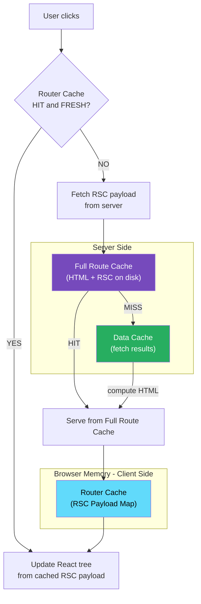
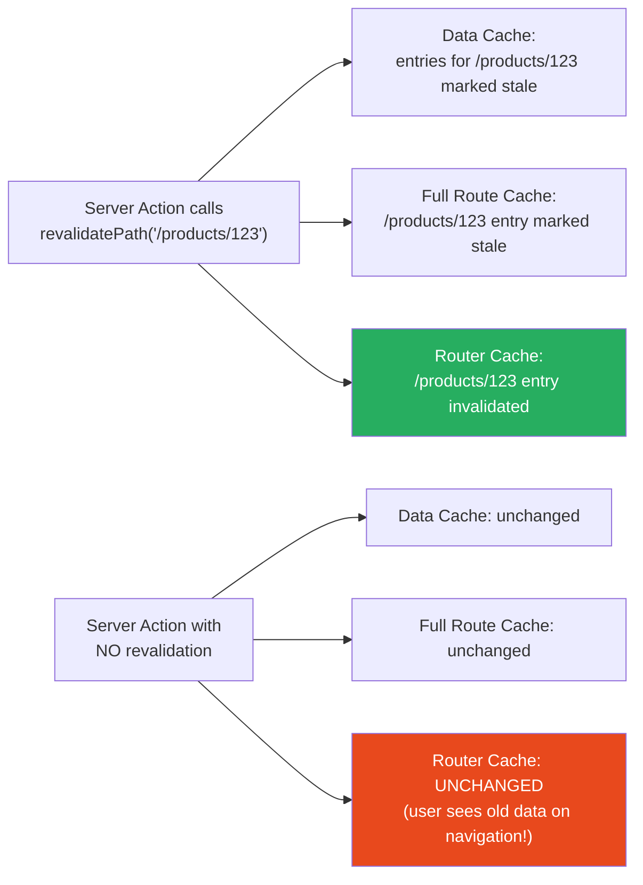

# 62 · Router Cache

> **The Router Cache is the only caching layer in this Part that lives entirely on the client — in the browser's memory, scoped to a single navigation session. It stores RSC payloads for routes the user has visited (or prefetched), and uses them to make subsequent navigation to those routes feel instant: no network request, no server computation, the page appears immediately from memory. Understanding the Router Cache is essential for explaining why a user sometimes sees stale data after a Server Action, why prefetching works the way it does, and how to correctly control the balance between cache freshness and navigation speed.**

The Router Cache is the final layer in the stack, closest to the user's actual experience. While every other caching layer discussed in this Part is about server-side efficiency (reducing origin computation, network requests, and rendering work), the Router Cache is about client-side perceived performance — making navigation feel faster than any network could. Its staleness-vs-freshness tradeoffs are therefore different: where server caches can be invalidated centrally, the Router Cache can only be invalidated by the client's own navigation behavior or by explicit programmatic intervention.

---

## Table of Contents

- [What the Router Cache Is and Isn't](#what-the-router-cache-is-and-isnt)
- [What Gets Stored in the Router Cache](#what-gets-stored-in-the-router-cache)
- [Router Cache Lifetime and Staleness Windows](#router-cache-lifetime-and-staleness-windows)
- [How Prefetching Populates the Router Cache](#how-prefetching-populates-the-router-cache)
- [Navigation and the Router Cache](#navigation-and-the-router-cache)
- [When the Router Cache Is Bypassed](#when-the-router-cache-is-bypassed)
- [Server Actions and the Router Cache](#server-actions-and-the-router-cache)
- [Programmatic Router Cache Invalidation](#programmatic-router-cache-invalidation)
- [The router.refresh() Method](#the-routerrefresh-method)
- [Router Cache vs Browser bfcache](#router-cache-vs-browser-bfcache)
- [Router Cache and Shared Layouts](#router-cache-and-shared-layouts)
- [Debugging Router Cache Behavior](#debugging-router-cache-behavior)
- [Architecture Diagrams](#architecture-diagrams)
- [Good Practices](#good-practices)
- [Bad Practices](#bad-practices)
- [Mental Model](#mental-model)
- [Common Misconceptions](#common-misconceptions)
- [Exercises](#exercises)
- [Further Reading](#further-reading)

---

## What the Router Cache Is and Isn't

```
WHAT IT IS:
  - A client-side, in-memory store of RSC (React Server Component)
    payloads for routes the user has visited or prefetched
  - Scoped to a single browser tab's session
  - Managed by Next.js's App Router client runtime
  - Automatically used during <Link>-based navigation

WHAT IT ISN'T:
  - A service worker cache (it's in-process JavaScript memory, not
    a browser API cache that persists after the tab closes)
  - The same as the bfcache (different mechanism, different scope)
  - Configurable via HTTP headers (it's entirely client-side, no
    Cache-Control headers affect it)
  - A cache of the complete HTML document (it stores RSC payloads —
    the compact component-tree format, not full HTML)
  - Shared between users or between browser sessions
```

---

## What Gets Stored in the Router Cache

For each visited or prefetched route, the Router Cache stores:

```
Router Cache entry structure:
  key:   the full route path (e.g., '/products/123')
  value: {
    rscPayload: <the RSC payload fetched from /.nextjs/internal/...>,
    prefetchedAt: <timestamp when this was stored>,
    isStatic: <boolean — whether this route is statically generated>
  }
```

The RSC payload is what Next.js fetches from the server during client-side navigation — a compact, JSON-like representation of the server-rendered component tree (described in Part X, doc 45). Storing it in the Router Cache means subsequent navigations to the same route can skip the network fetch entirely.

### Layout segments are cached independently

A critical optimization: the Router Cache stores layout segments and page segments separately. When navigating between two pages that share a layout, only the page's RSC payload needs to be fetched (or served from cache) — the shared layout segment is reused from the Router Cache without re-fetching.

```
/products (layout) → /products/123 (page)
/products (layout) → /products/456 (page)

Navigation from /products/123 to /products/456:
  Router Cache for /products (layout): HIT — layout RSC reused
  Router Cache for /products/456 (page): MISS or HIT — page RSC
  Result: only the page segment is fetched/updated, layout is instant
```

---

## Router Cache Lifetime and Staleness Windows

The Router Cache uses different freshness windows for static and dynamic routes:

```
STATIC routes (pre-rendered, served from Full Route Cache):
  Prefetch lifetime: 5 minutes
  (After 5 minutes, the prefetched payload is considered stale and
  will be re-fetched from the server on the next navigation)

DYNAMIC routes (per-request SSR):
  Prefetch lifetime: 30 seconds
  (Dynamic routes have a much shorter freshness window because their
  content is specifically designed to be per-request fresh)

NON-PREFETCHED routes (visited but not prefetched):
  Active lifetime: 30 seconds (regardless of static/dynamic status)
  (A route that was navigated to directly — without prior prefetching
  — is cached for 30 seconds so an immediate back-navigation is instant)
```

### Why the distinction between static and dynamic

```
Static routes are known to be identical for all users and all
requests within their ISR/revalidate window — a 5-minute prefetch
freshness window is safe because the content genuinely won't change
during that window in most cases.

Dynamic routes are specifically opted out of server-side caching
because their content IS request-specific. A 30-second window is
a best-effort optimization for the case where a user navigates
back within half a minute, balanced against the risk of showing
stale dynamic content for longer.
```

---

## How Prefetching Populates the Router Cache

The `<Link>` component in Next.js automatically prefetches routes when they become visible in the viewport (during a navigation context):

```tsx
// This Link component, when it enters the viewport,
// triggers a prefetch of /products/new-arrivals
<Link href="/products/new-arrivals">New Arrivals</Link>

// The prefetch happens by fetching the RSC payload for the route:
// fetch('https://example.com/products/new-arrivals',
//   { headers: { RSC: '1', 'Next-Router-Prefetch': '1' } })
// Response stored in Router Cache

// When the user clicks the Link:
//   1. Router Cache checked for /products/new-arrivals
//   2. HIT and FRESH → navigate instantly (no network request)
//   3. MISS or STALE → fetch RSC payload, navigate after fetch
```

### Prefetch prop variants

```tsx
// Default prefetch behavior (varies by route type):
<Link href="/products/123">Product</Link>

// Force full prefetch (ignores dynamic/static classification):
<Link href="/products/123" prefetch={true}>Product</Link>

// Disable prefetching entirely:
<Link href="/products/123" prefetch={false}>Product</Link>
```

### Partial prefetch: layouts only

For dynamic routes, prefetching is "partial" by default — only the SHARED LAYOUT segments are prefetched (those that are statically cacheable), not the dynamic page content itself. This avoids fetching per-request-dynamic content before the user has actually navigated to it (where that content might already be stale by the time they arrive):

```
Static layout + Dynamic page:
  Link enters viewport → layout RSC payload prefetched and cached
  User clicks → layout served from Router Cache (instant)
               → page RSC payload fetched fresh from server
  Result: the navigation is faster (layout is instant) but not
  fully instant (page still fetches) — the best possible outcome
  for a dynamic route
```

---

## Navigation and the Router Cache

During a `<Link>`-driven navigation, Next.js's client-side router:

```
1. Checks Router Cache for the target route's page segment:
   HIT (within freshness window):
     → Updates the React tree using the cached RSC payload
     → No network request for this route
     → Navigation is effectively instant (just JS execution time)

   MISS (not cached, or stale):
     → Fetches RSC payload from the server for the page segment
     → Stores fetched payload in Router Cache
     → Updates the React tree with the new payload

2. Shared layout segments:
   Always served from Router Cache if available (layouts are
   cached for the same duration as their route type — static/dynamic)

3. Client Components in the navigated page:
   Their state resets on navigation to a new route
   (unless you've implemented URL-based state preservation)

4. Browser history:
   Updated via the History API (pushState) — the URL changes,
   the back button works correctly
```

---

## When the Router Cache Is Bypassed

```
1. Hard refresh (Ctrl/Cmd + Shift + R or clearing browser data):
   Router Cache is cleared entirely — treated as a fresh session

2. Direct URL navigation (new tab, typing URL):
   Router Cache doesn't exist yet for this tab — full server fetch

3. Expiry (30s for dynamic, 5min for static):
   Stale entry triggers a server fetch rather than being served

4. router.refresh() called programmatically (see below):
   Current route's Router Cache entry is invalidated

5. Server Action with response mutations:
   Specific cache entries can be invalidated as part of the action
   response (Next.js does this automatically for revalidated paths/tags)

6. Network failures during prefetch:
   Prefetch may silently fail; the navigation falls back to a
   fresh server fetch on click
```

---

## Server Actions and the Router Cache

Server Actions interact with the Router Cache in a specific, intentional way that's frequently misunderstood:

```
Without explicit revalidation in the Server Action:
  A Server Action mutation (e.g., updating a product price) executes
  on the server. The origin's Data Cache and Full Route Cache may be
  updated. But the CLIENT's Router Cache is not invalidated.
  → The user navigates back to the product page and sees the OLD cached
    price (from the Router Cache), not the updated one.
  This is the source of the "my mutation worked but I still see old
  data on navigation" bug.

With revalidatePath() in the Server Action:
  'use server';
  export async function updatePrice(productId: string, price: number) {
    await db.products.update({ where: { id: productId }, data: { price } });
    revalidatePath(`/products/${productId}`);
    // revalidatePath(): invalidates server-side caches AND signals
    // the client that the Router Cache entry for this path is stale
  }
  → Client's Router Cache entry for /products/productId is invalidated
  → Next navigation to that route fetches fresh data from the server
  → User sees the updated price immediately

With revalidateTag():
  Same behavior — the tags' corresponding Router Cache entries
  are invalidated as part of the Server Action's response.
```

### How the signal travels client-side

When a Server Action returns (successfully) after calling `revalidatePath` or `revalidateTag`, Next.js embeds the invalidated paths/tags in the action's response. The client runtime receives these and removes the corresponding Router Cache entries — all transparently, without any additional client code.

---

## Programmatic Router Cache Invalidation

```tsx
"use client";
import { useRouter } from "next/navigation";

function ProductEditor({ productId }: { productId: string }) {
  const router = useRouter();

  const handleSave = async () => {
    await saveProduct(productId, formData);

    // Option 1: Force re-fetch of the CURRENT route's data
    // from the server, invalidating its Router Cache entry
    router.refresh();
    // Does NOT navigate away — stays on current page.
    // Does NOT do a full page reload.
    // Fetches fresh RSC payload for the current route and
    // updates the React tree with the new server data.

    // Option 2: Navigate away and back (clears Router Cache entry
    // for the product page via re-fetch on return navigation):
    router.push("/products"); // navigate away
    // The /products/id page's Router Cache entry is gone since
    // the session will have a MISS when navigating back to it
  };
}
```

### router.refresh() in detail

```
router.refresh():
  1. Does NOT navigate — the URL stays the same
  2. Does NOT perform a full page reload (no HTML document refetch)
  3. Sends a new RSC payload request to the server for the current route
  4. The server re-renders the Server Components for this route
  5. The React tree is reconciled with the new RSC payload:
     → Server Component output updates (shows new data)
     → Client Component state PRESERVED (useState values unchanged)
     → Scroll position preserved

This is the correct pattern after a mutation that didn't use a
Server Action with revalidatePath — the manual equivalent of what
revalidatePath does automatically.
```

---

## Router Cache vs Browser bfcache

These are two entirely separate browser-level mechanisms that overlap in their effects on navigation:

```
Browser bfcache (Back/Forward Cache):
  Mechanism: browser freezes the entire page (DOM + JS heap) in RAM
  Scope: back/forward navigation ONLY — specifically clicking
         the browser's back or forward button
  Trigger: browser-managed, not controllable via JavaScript
  Restores: ENTIRE page state including Client Component state,
            scroll position, form values, canvas state, everything
  Speed: nearly instantaneous (just "unfreezing" memory)
  Blocked by: unload listeners, unclosed WebSockets, etc.

Next.js Router Cache:
  Mechanism: Next.js stores RSC payloads in a JS Map in memory
  Scope: ANY <Link>-driven navigation, not just back/forward
  Trigger: controlled by Next.js runtime and explicitly via router.refresh()
  Restores: Server Component output only — Client Component state
            resets on navigation (this is intentional — the page
            is conceptually "new" even if the RSC payload is cached)
  Speed: very fast (JS execution, no network)
  Blocked by: expiry, programmatic invalidation, hard refresh
```

Both can be active simultaneously — a back navigation might use BOTH: bfcache (if the page was eligible) takes priority. If bfcache is unavailable (e.g., after a hard refresh cleared it), the Router Cache's RSC payload may be used to reconstruct the page faster than a full server fetch.

---

## Router Cache and Shared Layouts

Shared layouts are the biggest "win" from the Router Cache — navigating between pages in the same layout section reuses the layout RSC without any network request:

```tsx
// app/products/layout.tsx — this layout is shared across all /products/* routes
async function ProductsLayout({ children }) {
  const categories = await fetchProductCategories(); // may be Data Cache hit
  return (
    <div>
      <CategorySidebar categories={categories} />
      {children}
    </div>
  );
}
```

```
User navigation flow:
  1. User navigates to /products/laptops
     → Full fetch: layout RSC + page RSC
     → Both stored in Router Cache

  2. User clicks a product link → /products/laptops/123
     → Layout RSC for /products: Router Cache HIT (shared layout)
     → Page RSC for /products/laptops/123: fetched fresh (or prefetch HIT)
     → Navigation: layout is instant, only the page content updates

  3. User clicks back → /products/laptops
     → Layout RSC: Router Cache HIT
     → Page RSC for /products/laptops: Router Cache HIT (still within window)
     → Navigation: entirely instant, no server requests

This is why App Router navigation often FEELS instant even without
any explicit caching optimization: the shared layout reuse from the
Router Cache eliminates most of the perceived overhead.
```

---

## Debugging Router Cache Behavior

```
Symptom: navigating back to a page shows stale data after a mutation
Diagnosis: The mutation updated server-side caches but didn't
           invalidate the client's Router Cache entry.
Fix: Add revalidatePath() to the Server Action, OR call router.refresh()
     after the mutation in a Client Component.

Symptom: a product price updated on the server doesn't reflect in the
         UI even after navigating away and back within 5 minutes
Diagnosis: The 5-minute static route window is keeping the old RSC
           payload. The user sees cached Router Cache content.
Fix: The Server Action or API call updating the price should call
     revalidatePath('/products/[id]', 'page') so the Router Cache
     entry is invalidated as part of the mutation's response.

Symptom: a page shows fresh data on first load but stale data after
         navigation (even though server data is correct)
Diagnosis: Classic Router Cache freshness issue. Server-side caches
           are fine; client-side RSC payload is being reused.
Fix: Confirm revalidatePath/revalidateTag is called in the mutation,
     and that the path pattern matches the route that's staying stale.
```

```tsx
// Temporary debug: force-disable Router Cache for a route
// by calling router.refresh() on mount — NOT for production,
// only for development debugging:
"use client";
import { useRouter } from "next/navigation";
import { useEffect } from "react";

function DebugFreshPage() {
  const router = useRouter();
  useEffect(() => {
    router.refresh(); // forces a fresh server fetch on every mount
  }, [router]);
  return null;
}
```

---

## Architecture Diagrams

### Router Cache in the full navigation flow



### What gets invalidated and when



---

## Good Practices

### ✅ Good Practice — Always call revalidatePath in mutations that affect navigated routes

```tsx
/**
 * Good: Every Server Action that mutates data that a user might
 * then navigate to immediately includes the corresponding
 * revalidatePath call — so both the server-side and client-side
 * (Router Cache) caches are invalidated together.
 * The user always sees fresh data after their own mutations.
 */
"use server";
import { revalidatePath } from "next/cache";
import { redirect } from "next/navigation";

export async function updateOrderStatus(
  orderId: string,
  status: "processing" | "shipped" | "delivered",
) {
  await db.orders.update({ where: { id: orderId }, data: { status } });

  // Invalidate server-side caches AND signal Router Cache invalidation:
  revalidatePath(`/orders/${orderId}`); // the specific order's detail page
  revalidatePath("/orders"); // the order listing page

  // If navigating away after the action, the target page will
  // have its Router Cache entry invalidated, so it shows fresh data:
  redirect(`/orders/${orderId}`);
}
```

---

## Bad Practices

### ⚠️ Bad Practice — Mutating data without invalidating the Router Cache

```tsx
/**
 * Bad: A Server Action updates the database and the server-side
 * Data Cache, but doesn't call revalidatePath — so the client's
 * Router Cache still holds the old RSC payload for the affected
 * route. Any navigation to that route within the Router Cache's
 * freshness window shows stale data.
 *
 * This is the MOST COMMON Router Cache bug in production Next.js
 * applications. It's invisible in development (where the Router Cache
 * is much shorter-lived and devs tend to hard-refresh frequently)
 * but very visible to real users.
 */
"use server";
export async function toggleProductFeatured(productId: string) {
  await db.products.update({
    where: { id: productId },
    data: { featured: true },
  });
  // ❌ No revalidatePath or revalidateTag!
  // Server DB: updated ✅
  // Data Cache: still has the old product data ❌
  // Full Route Cache: still has the old HTML ❌
  // Router Cache: still has the old RSC payload ❌
}

// When the admin clicks "Feature this product":
//   DB updated ✅
//   Admin navigates to /products to see the change ← Router Cache HIT
//   Admin sees the old "not featured" state ❌
//   Admin refreshes (hard refresh) → finally sees update ✅
//   Admin reports "the feature toggle is broken"

/**
 * ✅ Fix: Add revalidateTag to invalidate all caching layers at once
 */
("use server");
import { revalidateTag } from "next/cache";

export async function toggleProductFeatured(productId: string) {
  await db.products.update({
    where: { id: productId },
    data: { featured: true },
  });

  // Invalidates Data Cache, Full Route Cache, AND Router Cache:
  revalidateTag(`product-${productId}`);
  revalidateTag("featured-products"); // any listing page showing featured
}
```

**Production impact:** An e-commerce admin team reported that product status changes (featured, sale, sold-out) appeared to "not work" for several minutes after being applied. The Server Actions were correctly updating the database and the server-side caches, but the missing `revalidateTag` calls meant the team's own browsers — which had recently visited those product pages — were serving Router Cache hits rather than fresh data. From their perspective, the mutation appeared to have no effect until their Router Cache entries expired (up to 5 minutes for static routes). Adding `revalidateTag` to all mutation actions resolved the issue instantly.

---

## Mental Model

> 💡 **The Router Cache mental model:**
>
> The Router Cache is like a **personal stack of sticky notes** you carry with you during a shopping trip — each note has "what I saw at aisle 7" written on it. When you go back to aisle 7, you check your notes first instead of walking all the way back to look again. If you just came from there (within 30 seconds), the note is definitely fresh and you use it. If it's been a few minutes (for a static store layout you know rarely changes) you'll use it for up to 5 minutes. But if an employee tells you "prices just changed in aisle 7" (a Server Action calls revalidatePath), you immediately cross out that sticky note — the next visit to aisle 7 gets fresh eyes, not old notes. The key insight: your sticky notes only exist for YOU, only for this shopping trip (session), and only in your HEAD (browser memory) — other shoppers and other trips start with blank notes every time.

---

## Common Misconceptions

### "The Router Cache is the same as the Full Route Cache"

The Full Route Cache is server-side, stores complete HTML + RSC payloads, and is shared across all users and requests. The Router Cache is client-side, stores only RSC payloads, and is private to one browser session. A Full Route Cache HIT prevents server-side rendering; a Router Cache HIT prevents even the network request to the server.

### "router.refresh() reloads the page"

`router.refresh()` does NOT reload the page, change the URL, or reset Client Component state. It fetches fresh server data and updates the Server Component portions of the React tree in place — scroll position, form inputs, and Client Component state are all preserved.

### "Hard-refreshing always clears the Router Cache"

A hard refresh (Ctrl+Shift+R / Cmd+Shift+R) clears the Browser HTTP Cache and forces a new HTML document fetch, which starts a new JavaScript execution context — so yes, it implicitly "clears" the Router Cache (because the new page context has a fresh, empty Router Cache). But DevTools Network "disable cache" only affects browser HTTP caching; it does NOT affect the Router Cache, which is in-JavaScript-memory.

### "Server Actions automatically keep the Router Cache fresh"

Server Actions automatically invalidate the Router Cache ONLY for routes that are explicitly named in `revalidatePath()` or `revalidateTag()` calls within the action. Actions that mutate data WITHOUT calling revalidation functions leave the Router Cache untouched — users see stale data until the cache expires naturally.

### "The Router Cache is 30 seconds for all routes"

The 30-second window applies to dynamic routes and to non-prefetched routes that were visited directly. Static routes that were prefetched (via `<Link>` entering the viewport) have a 5-minute freshness window. The distinction matters for applications with both static marketing pages (long prefetch window) and dynamic data-heavy pages (short window).

---

## Exercises

### Exercise 1 — Observe the Router Cache's staleness window

1. Build and run a Next.js app in production mode (`next build && next start`)
2. Navigate to a product page — note a piece of data (e.g., a name)
3. Directly update the database value for that piece of data
4. Navigate away, then navigate back within 30 seconds — does the old value appear?
5. Wait 35 seconds after the first visit, then navigate back — does the new value appear?

Document the observed staleness window and compare it to what this document predicts.

### Exercise 2 — Fix a "mutation appears to not work" bug

Create a Server Action that updates a value in the database WITHOUT calling `revalidatePath`. Add a Client Component that shows the current value (fetched by a Server Component parent) and a button that triggers the action. Observe the "stale data after mutation" behavior. Then add the appropriate `revalidatePath` call and verify the behavior corrects.

### Exercise 3 — Understand router.refresh() vs router.push()

Build a simple counter component:

- Stored in the database (server state, not client state)
- Displayed by a Server Component
- Incremented by a Server Action

Compare these three approaches to reflecting the update in the UI:

1. `router.refresh()` after the action
2. `router.push(currentPath)` after the action
3. `revalidatePath(currentPath)` inside the action (no router call)

For each: does Client Component state reset? Does scroll position reset? Does the page "flash"?

---

## Further Reading

- [Next.js docs: Router Cache](https://nextjs.org/docs/app/building-your-application/caching#client-side-router-cache) — official reference
- [Next.js docs: router.refresh()](https://nextjs.org/docs/app/api-reference/functions/use-router#routerrefresh) — API reference
- [Next.js docs: Link prefetching](https://nextjs.org/docs/app/api-reference/components/link#prefetch) — prefetch prop behavior
- [web.dev: bfcache](https://web.dev/articles/bfcache) — the browser-level mechanism that complements the Router Cache
- Related in this handbook: [61 · Full Route Cache](./05-full-route-cache.md)
- Next in this handbook: [63 · Cache Invalidation Strategies](./07-cache-invalidation.md)

---

_Part of the [React + Next.js Engineering Handbook](../../README.md)_
