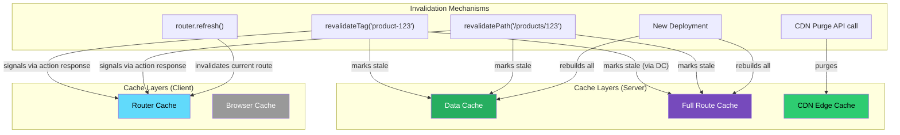
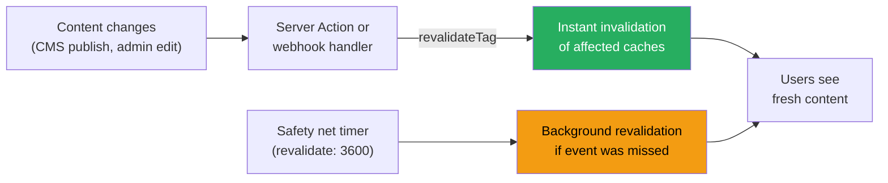

# 63 · Cache Invalidation Strategies

> **Phil Karlton's observation that "there are only two hard things in computer science: cache invalidation and naming things" remains true in Next.js, but the framework gives you the most structured set of invalidation primitives available in the React ecosystem. The challenge isn't a missing API — it's knowing WHICH of the six caching layers to invalidate, in WHAT ORDER, and with WHICH mechanism, for any given content-change scenario. This document is the synthesis: a complete map of every cache layer, every invalidation mechanism, and the decision logic for choosing correctly.**

Cache invalidation bugs in Next.js follow a predictable pattern: a mutation is made, the developer verifies the data changed in the database, but the user still sees old content. The root cause is almost always that one or more cache layers were not invalidated — either because the developer didn't know that layer existed, or because the invalidation call they used doesn't reach all the way through the stack. This document provides the complete picture.

---

## Table of Contents

- [The Six Cache Layers and Their Invalidation Mechanisms](#the-six-cache-layers-and-their-invalidation-mechanisms)
- [The Invalidation Propagation Chain](#the-invalidation-propagation-chain)
- [revalidatePath: The Workhorse](#revalidatepath-the-workhorse)
- [revalidateTag: The Precision Tool](#revalidatetag-the-precision-tool)
- [Time-Based vs Event-Based Invalidation](#time-based-vs-event-based-invalidation)
- [Invalidation Scenarios: The Decision Matrix](#invalidation-scenarios-the-decision-matrix)
- [CMS Webhook-Triggered Invalidation](#cms-webhook-triggered-invalidation)
- [E-Commerce Inventory Invalidation](#e-commerce-inventory-invalidation)
- [Multi-Tenant Invalidation](#multi-tenant-invalidation)
- [Cross-Layer Invalidation Pitfalls](#cross-layer-invalidation-pitfalls)
- [Testing Your Invalidation Strategy](#testing-your-invalidation-strategy)
- [Architecture Diagrams](#architecture-diagrams)
- [Good Practices](#good-practices)
- [Bad Practices](#bad-practices)
- [Mental Model](#mental-model)
- [Common Misconceptions](#common-misconceptions)
- [Exercises](#exercises)
- [Further Reading](#further-reading)

---

## The Six Cache Layers and Their Invalidation Mechanisms

A complete reference of every caching layer and how each one can be invalidated:

| Layer               | Location       | Scope       | Primary Invalidation                                               | Secondary                    |
| ------------------- | -------------- | ----------- | ------------------------------------------------------------------ | ---------------------------- |
| Browser Cache       | User's device  | Per-user    | Cache-Control max-age expiry                                       | Hard refresh, service worker |
| Router Cache        | Browser memory | Per-session | revalidatePath/Tag (via action), router.refresh()                  | Session end, hard refresh    |
| CDN Cache           | Edge PoPs      | All users   | revalidatePath/Tag → CDN purge API (self-hosted), Vercel automatic | TTL expiry, deploy           |
| Full Route Cache    | Next.js server | All users   | revalidatePath/Tag, new deploy                                     | ISR TTL expiry               |
| Data Cache          | Next.js server | All users   | revalidateTag, revalidatePath                                      | next.revalidate TTL          |
| Request Memoization | Server memory  | Per-render  | Automatic (clears after each render)                               | N/A                          |

```
INVALIDATION REACH by mechanism:

router.refresh():
  → Router Cache (current route only)
  Does NOT affect: Data Cache, Full Route Cache, CDN, Browser Cache

revalidatePath('/products/123'):
  → Full Route Cache (that path)
  → Data Cache (fetches associated with that path)
  → Router Cache (that path, via action response signal)
  Does NOT affect: CDN Cache (self-hosted), Browser Cache

revalidateTag('product-123'):
  → Data Cache (all entries tagged 'product-123')
  → Full Route Cache (all routes whose renders depended on those entries)
  → Router Cache (those paths, via action response signal)
  Does NOT affect: CDN Cache (self-hosted), Browser Cache

New deployment (next build):
  → Full Route Cache (all entries rebuilt)
  → Data Cache (typically cleared with new build)
  Does NOT affect: CDN Cache (must purge separately), Browser Cache,
                   Router Cache (in-memory, cleared on page reload)
```

---

## The Invalidation Propagation Chain

When you call `revalidatePath('/products/123')` in a Server Action, here's the exact propagation order:

```
1. Data Cache entries associated with /products/123 are marked stale
   (all fetch() calls that contributed to rendering that route)

2. Full Route Cache entry for /products/123 is marked stale
   (the .html and .rsc files are marked as needing regeneration)

3. Server Action response sent to client includes invalidation metadata:
   { revalidated: ['/products/123'], tags: [] }

4. Client's Router Cache: the app router receives the action response,
   reads the invalidation metadata, removes the Router Cache entry
   for /products/123

5. If the Server Action also called redirect('/products/123'),
   the client navigates to /products/123 — which now has no Router
   Cache entry, triggering a fresh fetch from the server.

6. Server receives the navigation request for /products/123:
   Full Route Cache: MISS (just invalidated) → render fresh
   Data Cache: MISS (just invalidated) → fetch from origin
   New HTML + RSC payload cached in Full Route Cache

7. CDN Cache (on Vercel): integrated, invalidated as part of step 2
   CDN Cache (self-hosted): NOT invalidated — separate API call required
```

---

## revalidatePath: The Workhorse

```tsx
import { revalidatePath } from "next/cache";

// Four forms with different reach:

// 1. Specific page path — most targeted
revalidatePath("/products/123");
// Invalidates: data fetches and HTML cache for /products/123 ONLY

// 2. Dynamic path pattern — one level
revalidatePath("/products/[id]", "page");
// Invalidates: ALL /products/* entries (every pre-generated product)

// 3. Layout invalidation — propagates down the tree
revalidatePath("/products", "layout");
// Invalidates: /products AND all pages under /products/**
// This is a broad invalidation — use when the layout's data changes

// 4. Root layout invalidation — the nuclear option
revalidatePath("/", "layout");
// Invalidates: ALL routes in the application
// Use only for site-wide changes (global config, site-down banners)

// When to use which:
// - One entity changed (a product): revalidatePath('/products/123')
// - A listing changed (new product added): revalidatePath('/products')
// - Navigation structure changed: revalidatePath('/', 'layout')
```

### revalidatePath and layout segments

```
Layout structure:
  app/layout.tsx (root)
  app/(shop)/layout.tsx (shop section)
  app/(shop)/products/layout.tsx (products section)
  app/(shop)/products/[id]/page.tsx (product page)

revalidatePath('/products/123'):
  → ONLY /products/123 page

revalidatePath('/products', 'layout'):
  → /products page
  → /products/123 page
  → /products/456 page
  → ALL pages under /products/**

revalidatePath('/', 'layout'):
  → Every single route in the application
```

---

## revalidateTag: The Precision Tool

```tsx
import { revalidateTag } from "next/cache";

// Tags are applied to fetch() calls and unstable_cache() calls:
const product = await fetch(`/api/products/${id}`, {
  next: {
    tags: [
      `product-${id}`, // specific entity tag
      "all-products", // collection tag
      `category-${cat}`, // category-based tag
      `author-${authorId}`, // relationship tag
    ],
  },
});

// Invalidation scenarios:
revalidateTag(`product-${id}`); // just this product, wherever it appears
revalidateTag("all-products"); // any page that lists products
revalidateTag(`category-${cat}`); // this category's listing + any product in it
revalidateTag(`author-${authorId}`); // everything this author contributed to

// Granularity comparison:
// revalidatePath: "invalidate routes by URL"
// revalidateTag:  "invalidate data by what it IS, regardless of which URL uses it"
```

### Tag design principles

```
1. Entity tags: one per database row/entity
   `product-${id}`, `user-${id}`, `order-${id}`
   Use when: the entity appears on multiple, potentially unknown pages
             and needs precision invalidation

2. Collection tags: one per logical grouping
   `all-products`, `featured-items`, `recent-posts`
   Use when: the collection's contents change (new item added/removed)

3. Relationship tags: one per relationship
   `user-orders-${userId}`, `category-products-${catId}`
   Use when: data at the intersection of two entities changes

4. Type tags: broad, catch-all
   `products`, `users`, `orders`
   Use when: you want to invalidate everything of a type (rare,
             usually only for migrations or major updates)

5. Composite tags for complex pages:
   A product listing page might tag its fetch with both
   'all-products' AND 'featured-items' — so either event
   (a new product OR a product being featured) correctly
   invalidates that page.
```

---

## Time-Based vs Event-Based Invalidation

The choice between these two approaches depends on the relationship between "when does the data change" and "do you have a reliable event for that change":

```
TIME-BASED (next: { revalidate: N }):
  ✅ Use when:
    - Data changes on an unknown/unpredictable schedule
    - You don't have a webhook or event hook into the data source
    - Bounded staleness is acceptable (e.g., sports scores: 30s is fine)
    - The data source is a third-party API you don't control

  ❌ Don't use when:
    - Data changes via known, controllable events (user action, admin panel)
    - The change needs to be reflected "immediately" (< 1 revalidate window)
    - Very short windows would generate excessive load on your data source

EVENT-BASED (revalidateTag/revalidatePath on mutation):
  ✅ Use when:
    - Changes happen via identifiable events you control (form submit,
      admin action, CMS publish, webhook)
    - You need near-instant propagation after changes
    - You want precision (invalidate only what changed)
    - Reducing unnecessary revalidation requests matters for cost

  ❌ Don't use when:
    - The data source changes in ways you can't hook into
    - Webhook/event delivery is unreliable (missing one event = stale forever)

HYBRID (both together):
  ✅ Best practice for most production applications:
    - Short-moderate revalidate as a safety net (catches missed events)
    - Event-based revalidateTag as the primary, instant invalidation
    Example: a CMS article page with revalidate: 3600 (safety net) AND
             revalidateTag('article-${slug}') on CMS publish webhook
             (primary, instant path)
```

---

## Invalidation Scenarios: The Decision Matrix

For common content-change scenarios, here's the correct invalidation strategy:

```
SCENARIO 1: Admin edits a product's name and price
  Changes: one specific product in the database
  Affected pages: /products/123 (the product page)
                  /products (if it shows product names)
                  /products?category=X (category listing)
                  /search (if search results are cached)
  Strategy:
    revalidateTag(`product-${id}`)    → exact product anywhere
    revalidateTag('all-products')      → any listing containing this product
  Code:
    revalidateTag(`product-${productId}`);
    revalidateTag('all-products');

SCENARIO 2: CMS editor publishes a new blog post
  Changes: a new article added to the collection
  Affected pages: /blog (the listing page)
                  /blog/[category] (category pages for this post's category)
                  / (if homepage shows recent posts)
  Strategy:
    revalidateTag('all-posts')
    revalidateTag(`category-${post.category}`)
    revalidatePath('/')                → homepage (quick, specific)
  Code:
    revalidateTag('all-posts');
    revalidateTag(`category-${post.categorySlug}`);
    revalidatePath('/');

SCENARIO 3: A product goes out of stock
  Changes: inventory count for one product → 0
  Affected pages: /products/123 (shows "Out of Stock")
                  /products (listing shows availability badge)
  Time sensitivity: HIGH (users shouldn't add OOS items to cart)
  Strategy: on-demand, immediate
    revalidateTag(`inventory-${productId}`)
    revalidateTag(`product-${productId}`)

SCENARIO 4: Site-wide config update (new theme, navigation change)
  Changes: global configuration read by the root layout
  Affected pages: EVERY page in the application
  Strategy:
    revalidateTag('site-config')   → if config is fetched with this tag
    OR
    revalidatePath('/', 'layout')  → if config is fetched directly in layout

SCENARIO 5: User updates their own profile
  Changes: user's name and avatar in the database
  Affected pages: /profile (the user's own profile page)
                  ANY page showing this user's posts/comments with their name
  Special consideration: this is USER-SPECIFIC data
    → Most of these pages are likely SSR (they use cookies/auth)
    → The Full Route Cache probably doesn't apply (dynamic routes)
    → router.refresh() from the Client Component after the action
       is sufficient (updates the Router Cache / current render)
    → OR revalidatePath('/profile') if needed for shared pages
```

---

## CMS Webhook-Triggered Invalidation

A complete implementation of CMS-triggered cache invalidation:

```tsx
// app/api/cms-webhook/route.ts
import { revalidatePath, revalidateTag } from "next/cache";
import { NextRequest, NextResponse } from "next/server";
import { createHmac } from "crypto";

function verifyWebhookSignature(payload: string, signature: string): boolean {
  const expected = createHmac("sha256", process.env.CMS_WEBHOOK_SECRET!)
    .update(payload)
    .digest("hex");
  return `sha256=${expected}` === signature;
}

export async function POST(request: NextRequest) {
  // 1. Verify this is actually from your CMS
  const rawBody = await request.text();
  const signature = request.headers.get("x-cms-signature") ?? "";
  if (!verifyWebhookSignature(rawBody, signature)) {
    return NextResponse.json({ error: "Invalid signature" }, { status: 401 });
  }

  const event = JSON.parse(rawBody);

  // 2. Route to appropriate invalidation based on event type
  switch (event.type) {
    case "entry.publish":
    case "entry.update": {
      const contentType = event.model;
      const entryId = event.entry.id;
      const entrySlug = event.entry.slug;

      if (contentType === "article") {
        // Invalidate this specific article
        revalidateTag(`article-${entrySlug}`);
        // Invalidate any listing pages that include articles
        revalidateTag("all-articles");
        // Invalidate category listing if applicable
        if (event.entry.category) {
          revalidateTag(`category-${event.entry.category.slug}`);
        }
        // Homepage if it shows recent articles
        revalidatePath("/");
      }

      if (contentType === "product") {
        revalidateTag(`product-${entryId}`);
        revalidateTag("all-products");
      }

      if (contentType === "site-config") {
        revalidateTag("site-config");
        revalidatePath("/", "layout"); // full site layout change
      }
      break;
    }

    case "entry.unpublish":
    case "entry.delete": {
      // Same as update — the listing pages need to reflect removal
      revalidateTag(`article-${event.entry.slug}`);
      revalidateTag("all-articles");
      break;
    }
  }

  return NextResponse.json({
    revalidated: true,
    eventType: event.type,
    timestamp: Date.now(),
  });
}
```

---

## E-Commerce Inventory Invalidation

Inventory is the highest-stakes caching scenario in e-commerce — too stale and users buy items that don't exist:

```tsx
// lib/invalidation/inventory.ts
import { revalidateTag } from "next/cache";

// Called from: order processing system, inventory management system
// Expected latency: called in near-real-time as stock changes

export async function invalidateProductInventory(productId: string) {
  // Immediate invalidation: inventory data is time-sensitive
  revalidateTag(`inventory-${productId}`);

  // Also invalidate the product page overall (shows "In Stock / Out of Stock")
  revalidateTag(`product-${productId}`);
}

export async function invalidateInventoryForCategory(category: string) {
  // When a bulk import or category-wide event occurs
  revalidateTag(`category-inventory-${category}`);
  revalidateTag("all-products"); // any listing showing stock status
}

// The corresponding fetch tags in the data layer:
async function getProductInventory(productId: string) {
  return fetch(`https://inventory.example.com/products/${productId}`, {
    next: {
      revalidate: 30, // safety net: 30s max staleness
      tags: [`inventory-${productId}`], // for on-demand invalidation
    },
  }).then((r) => r.json());
}
```

---

## Multi-Tenant Invalidation

For SaaS applications where different tenants have isolated data:

```tsx
// Tag strategy for multi-tenant data:
// Prefix all tags with the tenant identifier to ensure
// invalidation is always scoped to a single tenant

async function fetchTenantData(tenantId: string, resourceId: string) {
  return fetch(
    `https://api.example.com/tenants/${tenantId}/resources/${resourceId}`,
    {
      next: {
        tags: [
          `tenant-${tenantId}`, // all data for this tenant
          `tenant-${tenantId}-resource-${resourceId}`, // specific resource
        ],
      },
    },
  ).then((r) => r.json());
}

// Invalidation on tenant-scoped mutation:
export async function updateTenantResource(
  tenantId: string,
  resourceId: string,
) {
  await db.resources.update({ where: { id: resourceId, tenantId } });

  // Scoped invalidation: only affects THIS tenant's cache
  revalidateTag(`tenant-${tenantId}-resource-${resourceId}`);
}

// Nuclear option — invalidate ALL of one tenant's data:
export async function resetTenantCache(tenantId: string) {
  revalidateTag(`tenant-${tenantId}`);
}
```

---

## Cross-Layer Invalidation Pitfalls

```
PITFALL 1: Invalidating the Data Cache without the Full Route Cache
  Calling unstable_cache(() => ..., ['my-key']) when data changes
  may clear the Data Cache entry but NOT propagate to the Full Route Cache.
  Fix: Use revalidateTag() on the same tag used in unstable_cache's tags array,
  not manual cache-key operations.

PITFALL 2: Invalidating server caches but not the CDN (self-hosted)
  revalidatePath() purges Next.js's internal Full Route Cache on your origin.
  A CDN in front of your origin still has the old version cached.
  Fix: After calling revalidatePath(), ALSO call your CDN provider's purge API.

PITFALL 3: Invalidating the Full Route Cache but not the Router Cache
  A revalidatePath() in a plain API Route Handler (not a Server Action)
  MAY not propagate the Router Cache invalidation signal to the client.
  Server Actions are the correct mechanism for mutations that should
  also invalidate the client's Router Cache.
  Fix: Use Server Actions for mutations, not Route Handlers, when
  Router Cache invalidation is needed.

PITFALL 4: revalidateTag() called BEFORE the mutation
  If revalidateTag() runs before the database update completes,
  the next fetch may re-cache the OLD data.
  Fix: Always call revalidatePath/revalidateTag AFTER the mutation:
    await db.update(...)
    revalidateTag('product-123') // after, not before

PITFALL 5: Not accounting for Request Memoization during the same render
  revalidateTag() affects the persistent Data Cache.
  Within the SAME render that called revalidateTag(), the Request
  Memoization layer may still return the OLD value (since it was
  fetched at the start of this render before revalidateTag was called).
  This is rarely a problem in practice but can cause subtle bugs in
  code that calls revalidateTag() mid-render and expects to immediately
  see the new value in a subsequent fetch within the same render.
  Fix: call redirect() or return after revalidateTag() to start a
  fresh render that benefits from the invalidation.
```

---

## Testing Your Invalidation Strategy

```tsx
// A test harness for verifying cache invalidation:

// 1. Seed data (known state)
// 2. Fetch the route — verify content reflects seeded data
// 3. Mutate the data (via Server Action or direct DB)
// 4. Verify revalidateTag/revalidatePath was called
// 5. Fetch the route again — verify content reflects updated data
// 6. Check that related routes were correctly updated too

// Using Playwright for end-to-end cache invalidation testing:
import { test, expect } from "@playwright/test";

test("product price updates propagate through caches", async ({ page }) => {
  // Step 1: Verify current price
  await page.goto("/products/widget-pro");
  await expect(page.locator('[data-testid="price"]')).toHaveText("$99.99");

  // Step 2: Update price via admin action
  await page.goto("/admin/products/widget-pro");
  await page.fill('[name="price"]', "79.99");
  await page.click('button[type="submit"]');

  // Step 3: Navigate to product page (fresh, not from Router Cache)
  // router.push should trigger a fresh fetch after revalidation
  await page.goto("/products/widget-pro");
  await expect(page.locator('[data-testid="price"]')).toHaveText("$79.99");
});
```

---

## Architecture Diagrams

### Complete invalidation reach by mechanism



### Hybrid time + event invalidation strategy



---

## Good Practices

### ✅ Good Practice — A complete Server Action with layered invalidation

```tsx
/**
 * Good: A Server Action that explicitly invalidates every affected
 * cache layer, uses tags for precision, includes a safety-net
 * revalidate on the fetch, and redirects only AFTER all invalidation
 * is complete. Nothing is left to chance — if this action succeeds,
 * every user who visits any affected page will see the updated content.
 */
"use server";
import { revalidateTag } from "next/cache";
import { redirect } from "next/navigation";

export async function publishArticle(articleId: string) {
  // Step 1: Mutation
  const article = await db.articles.update({
    where: { id: articleId },
    data: {
      status: "published",
      publishedAt: new Date(),
    },
    select: { slug: true, categorySlug: true, authorId: true },
  });

  // Step 2: Invalidate by entity (the specific article, wherever it appears)
  revalidateTag(`article-${article.slug}`);

  // Step 3: Invalidate collections that now include this article
  revalidateTag("all-articles");
  revalidateTag(`category-${article.categorySlug}`);
  revalidateTag(`author-articles-${article.authorId}`);

  // Step 4: Invalidate the homepage if it shows recent articles
  // (revalidatePath for specific known pages, not the layout)
  // revalidatePath('/'); // uncomment if homepage shows recent articles

  // The corresponding fetches were tagged at definition time:
  // fetch('/api/articles/' + slug, { next: { revalidate: 86400, tags: ['article-' + slug] } })
  // fetch('/api/articles', { next: { revalidate: 3600, tags: ['all-articles'] } })
  // etc.

  // Step 5: Redirect to the published article
  // (this also triggers a fresh Router Cache entry for the article page)
  redirect(`/articles/${article.slug}`);
}
```

---

## Bad Practices

### ⚠️ Bad Practice — The everything-or-nothing anti-patterns

```tsx
/**
 * Bad: Two opposite extremes, both problematic.
 *
 * Pattern A: "Just revalidate everything" — the nuclear option used
 * because it's the easiest thing to type, but it's wildly excessive
 * for most mutations.
 *
 * Pattern B: "Don't revalidate anything" — forgetting that caches
 * need to be told about mutations.
 */

// ❌ Pattern A: Nuclear option for every mutation
"use server";
export async function updateProductName(productId: string, name: string) {
  await db.products.update({ where: { id: productId }, data: { name } });

  revalidatePath("/", "layout"); // ← invalidates EVERY page in the app!
  // For a product name change:
  //   - Invalidates /blog/every-post-ever ← unnecessary
  //   - Invalidates /about ← unnecessary
  //   - Invalidates /legal/privacy-policy ← unnecessary
  //   - Forces regeneration of potentially thousands of pages
  //   - Causes a brief surge in origin requests as CDN/Full Route Cache
  //     entries are rebuilt across the entire site
  //   - Takes longer to propagate than targeted invalidation
}

// ❌ Pattern B: Zero invalidation
("use server");
export async function updateProductStock(productId: string, count: number) {
  await db.inventory.update({
    where: { productId },
    data: { count },
  });
  // ← No revalidation at all!
  // Users may see "In Stock" for 30 minutes (the Data Cache TTL)
  // even after the item goes out of stock
  // For inventory (high business risk), this is not acceptable
}

/**
 * ✅ Fix for Pattern A: Use the minimum necessary invalidation
 */
("use server");
export async function updateProductName(productId: string, name: string) {
  await db.products.update({ where: { id: productId }, data: { name } });

  // Only these two — the product page and any listing that shows names
  revalidateTag(`product-${productId}`);
  revalidateTag("all-products");
}

/**
 * ✅ Fix for Pattern B: Add revalidation with appropriate urgency
 */
("use server");
export async function updateProductStock(productId: string, count: number) {
  await db.inventory.update({ where: { productId }, data: { count } });

  // High-urgency: inventory affects purchasing decisions
  revalidateTag(`inventory-${productId}`);
  revalidateTag(`product-${productId}`); // product page shows stock status
}
```

---

## Mental Model

> 💡 **The cache invalidation mental model:**
>
> Think of the six cache layers as **six physical distance rings around a single source of truth** (your database). The database is the center; browser caches are the outermost ring. When data changes at the center, the "update signal" has to travel outward through each ring — and it only travels as far as you explicitly send it. `revalidateTag` is like a radio broadcast that reaches the Data Cache and Full Route Cache rings (the two server-side persistent rings) and sends a signal via action response to the client's Router Cache ring. The CDN ring (on self-hosted deployments) and the Browser Cache ring require separate, explicit signals to update — `revalidateTag` doesn't reach them without additional wiring. The Request Memoization ring (innermost server-side, per-render) manages itself automatically and needs no manual clearing. Cache invalidation bugs occur when the update signal stops before it reaches all the rings that hold a stale copy.

---

## Common Misconceptions

### "revalidatePath() instantly makes all users see fresh content"

revalidatePath() invalidates server-side caches (Data Cache, Full Route Cache). Users whose browsers have cached the old HTML, or who have it in their Router Cache, may still see the old content until those client-side caches expire or are explicitly cleared. For mutation actions, `revalidatePath` in a Server Action handles the Router Cache; the Browser Cache respects its own TTL.

### "revalidateTag() and revalidatePath() are interchangeable"

They're different tools for different granularity. `revalidatePath` is "clear this URL's caches." `revalidateTag` is "clear all caches for data bearing this label, regardless of which URL used it." For data that appears on multiple routes, tags are far more precise and don't require knowing every affected URL in advance.

### "Calling revalidateTag() before the await mutation is fine"

Calling revalidateTag before the mutation completes risks the next cache fill fetching the OLD data — producing a "corrected" cache entry that still shows the pre-mutation state. Always await the mutation first, then revalidate.

### "next.revalidate and revalidateTag serve the same purpose"

`next.revalidate` sets a TIME-BASED freshness window (cache is stale after N seconds). `revalidateTag` is EVENT-BASED invalidation (cache becomes stale immediately when called). They complement each other: time-based as a safety net, event-based for precision. Using only one is rarely optimal.

### "A shorter next.revalidate window guarantees freshness"

A shorter window means MORE frequent regeneration, but NOT guaranteed freshness. The background regeneration only triggers on the NEXT request after the window expires — if traffic is sparse, content may be stale for longer than the window. Event-based revalidation is the correct tool for "I need this to be fresh WHEN it changes."

---

## Exercises

### Exercise 1 — Map the affected cache layers for a scenario

For each of the following mutations, identify EVERY cache layer that holds stale data after the mutation, and write the exact revalidation code needed to clear all of them:

1. A user updates their display name (shown in their profile page AND in comment threads across the site)
2. A flash sale starts (price drops on 50 specific products, plus a site-wide banner)
3. The navigation menu structure changes (affects the root layout)

### Exercise 2 — Implement end-to-end invalidation and test it

Build a simple blog with:

- A list page (`/blog`) showing post titles and excerpts
- Individual post pages (`/blog/[slug]`)
- An admin action to "update" a post's title

Implement tagging and revalidation so that updating a post title:

1. Immediately updates `/blog/[slug]` for that post
2. Immediately updates `/blog` to show the new title
3. Does NOT unnecessarily invalidate any other cached routes

Write a Playwright test that verifies all three behaviors.

### Exercise 3 — Diagnose a caching bug from symptoms

Given these symptoms, identify which cache layer is at fault and propose the fix:

```
Symptom: An admin updates a product price in the admin panel.
The admin immediately navigates to the product's public page and
sees the OLD price. But if they open an incognito window and
navigate to the product page, they see the NEW price.

Clue: The Server Action updating the price DOES call
revalidatePath('/products/123').
```

---

## Further Reading

- [Next.js docs: Caching overview](https://nextjs.org/docs/app/building-your-application/caching) — the authoritative reference with the canonical interaction diagram
- [Next.js docs: revalidatePath](https://nextjs.org/docs/app/api-reference/functions/revalidatePath) — full API reference
- [Next.js docs: revalidateTag](https://nextjs.org/docs/app/api-reference/functions/revalidateTag) — full API reference
- [Next.js docs: Server Actions and mutations](https://nextjs.org/docs/app/building-your-application/data-fetching/server-actions-and-mutations) — mutations + invalidation combined
- Related in this handbook: [04 · Data Cache](./04-data-cache.md)
- Related in this handbook: [05 · Full Route Cache](./05-full-route-cache.md)
- Related in this handbook: [06 · Router Cache](./06-router-cache.md)
- Next in this handbook: [64 · Turbopack Architecture](../nextjs-core/08-turbopack.md)

---

_Part of the [React + Next.js Engineering Handbook](../../README.md)_
