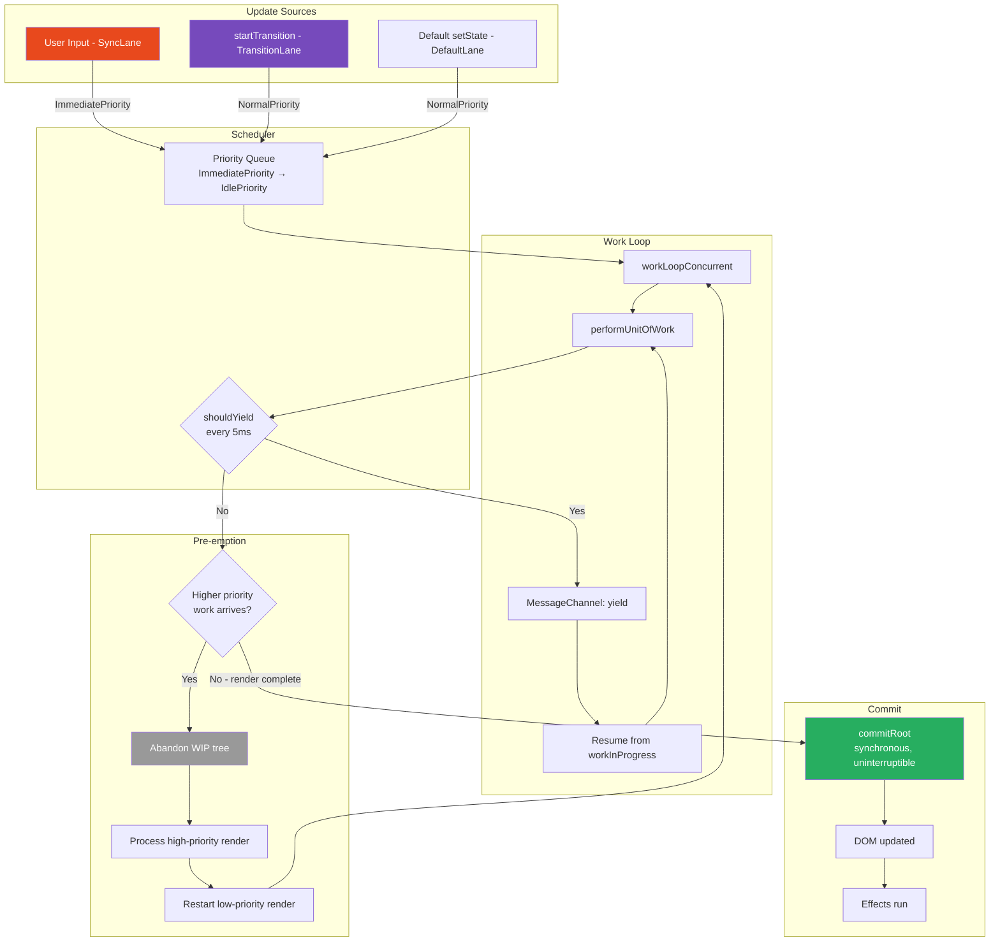
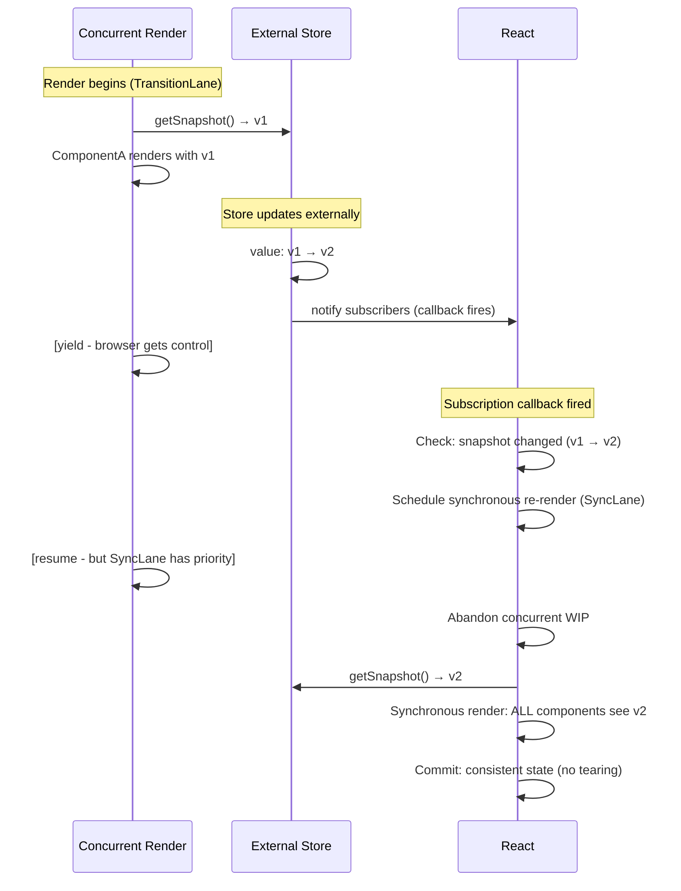

# 30 · Concurrent Rendering Model

> **Concurrent React is not a new way to write React — it is a new way for React to execute the work you already describe. The concurrent model gives React the ability to prepare multiple versions of the UI simultaneously, interrupt and resume rendering based on priority, and show a consistent UI snapshot when ready. Understanding the concurrent model is understanding how React 18 turns a single-threaded environment into a system that feels responsive under heavy load.**

React 18's concurrent features — `startTransition`, `useTransition`, `useDeferredValue`, Suspense for data, streaming SSR — all emerge from one foundational capability: the ability to work on rendering in the background while keeping the current UI fully interactive. This document explains the model itself: what "concurrent" means in React's single-threaded context, what problems it solves, and how the mechanisms interact.

---

## Table of Contents

- [What "Concurrent" Means in JavaScript](#what-concurrent-means-in-javascript)
- [The Core Problem: Blocking Renders](#the-core-problem-blocking-renders)
- [The Concurrent Solution: Interruptible Work](#the-concurrent-solution-interruptible-work)
- [The Two Modes: Legacy and Concurrent](#the-two-modes-legacy-and-concurrent)
- [Tearing: The Risk of Concurrent Rendering](#tearing-the-risk-of-concurrent-rendering)
- [React's Tearing Prevention](#reacts-tearing-prevention)
- [Concurrent Rendering and External Stores](#concurrent-rendering-and-external-stores)
- [The Render-Commit Contract in Concurrent Mode](#the-render-commit-contract-in-concurrent-mode)
- [Priority Lanes and Concurrent Rendering](#priority-lanes-and-concurrent-rendering)
- [Multiple In-Progress Renders](#multiple-in-progress-renders)
- [Suspense in the Concurrent Model](#suspense-in-the-concurrent-model)
- [The Concurrent Feature Surface](#the-concurrent-feature-surface)
- [Concurrency vs Parallelism](#concurrency-vs-parallelism)
- [Production Considerations](#production-considerations)
- [Architecture Diagrams](#architecture-diagrams)
- [Good Practices](#good-practices)
- [Bad Practices](#bad-practices)
- [Mental Model](#mental-model)
- [Common Misconceptions](#common-misconceptions)
- [Exercises](#exercises)
- [Further Reading](#further-reading)

---

## What "Concurrent" Means in JavaScript

True concurrency — multiple threads executing simultaneously — is not possible in standard JavaScript. There is one main thread, one call stack, and one event loop. "Concurrent" in React's context means something different: **cooperative multitasking on a single thread**.

```
True parallelism (not React):
Thread 1: [====work====]
Thread 2:    [====work====]
Thread 3:       [====work====]
Time:      ─────────────────>

React concurrent (cooperative multitasking):
One thread: [work][yield][browser][work][yield][browser][work][commit]
Time:       ────────────────────────────────────────────────────>
```

In React's concurrent model:

- One thread handles everything (JavaScript, React rendering, browser events)
- React voluntarily yields control of that thread at regular intervals (every 5ms)
- The browser uses those intervals to paint frames and process user input
- React resumes rendering in the next available slot

This creates the _illusion_ of concurrency — the user sees a responsive UI while React is doing background work — but everything still executes on a single thread.

### What makes React's concurrency different from "async"

Normal async JavaScript (Promises, setTimeout, fetch) also uses cooperative multitasking. The difference: React's concurrent rendering controls _when_ within that cooperative system React's work runs, and at what _priority_ relative to other work.

```
Normal JavaScript async:
  fetch('/api/data').then(callback)
  // callback runs "whenever" — no priority control

React concurrent:
  startTransition(() => setState(newData))
  // React processes this at LOW priority
  // High-priority work (user input) pre-empts it
  // React can restart it if it becomes stale
```

---

## The Core Problem: Blocking Renders

React's legacy synchronous rendering model has one critical failure mode: large state updates block the main thread.

```
User interaction → setState → React starts rendering → 80ms passes → React commits
During those 80ms:
  - No user input processed
  - No frames painted
  - Browser appears frozen
  - Next user interaction arrives but cannot be processed until render completes
```

This was measurable in production React applications. Any component tree rendering that took more than 16.67ms (one frame) would drop frames. Any render over 100ms was perceptible lag. Any render over 300ms felt frozen.

The problem compounded: React could not prioritize. A user typing in a search input triggered the same priority render as a background data update. There was no way to say "process this keypress now, handle the data update when you have time."

```
Legacy model — all updates equal priority:
  User types → background data arrives → setState × 2
  React: processes both equally, blocks for combined time
  User experience: noticeable lag

Concurrent model — priority differentiation:
  User types (high priority) → background data (low priority)
  React: processes keypress immediately, defers data update
  User experience: instant response
```

---

## The Concurrent Solution: Interruptible Work

Concurrent React's solution is built on three capabilities:

### Capability 1: Work units (Fibers)

React's render work is divided into fiber-sized units. The work loop processes one fiber at a time. Between fibers, it checks if it should yield.

```js
function workLoopConcurrent() {
  while (workInProgress !== null && !shouldYield()) {
    performUnitOfWork(workInProgress); // process one fiber
  }
  // After each fiber: check whether to continue or yield
}
```

### Capability 2: Interruptible work loop

The work loop can be interrupted between any two fiber units:

```
Frame 1: [fiber 1][fiber 2][fiber 3] → shouldYield = true → YIELD
Browser: paints frame, processes input events
Frame 2: [fiber 4][fiber 5][fiber 6] → shouldYield = true → YIELD
...
Frame N: [fiber 499][fiber 500] → workInProgress = null → render complete → commit
```

### Capability 3: Priority lanes

Different updates get different priorities. High-priority updates can pre-empt in-progress low-priority renders:

```
Low-priority render in progress (fiber 250 of 500)...
User types in input → SyncLane update (high priority)
React: abandon low-priority render, process SyncLane synchronously
User sees their keystroke immediately
React: restart low-priority render from scratch
```

Together, these three capabilities produce a runtime that is responsive to user input even while doing background rendering work.

---

## The Two Modes: Legacy and Concurrent

React 18 ships two root creation modes:

### Legacy mode (createRoot is still concurrent in React 18)

```tsx
// React 17 and below:
import ReactDOM from "react-dom";
ReactDOM.render(<App />, document.getElementById("root"));
// All renders: synchronous, uninterruptible

// React 18 — still the "legacy" API but now also concurrent:
// ReactDOM.render is deprecated but still available
// Use createRoot for the full concurrent model
```

### Concurrent mode (React 18 default with createRoot)

```tsx
import { createRoot } from "react-dom/client";
const root = createRoot(document.getElementById("root")!);
root.render(<App />);
// Default behavior: concurrent rendering for state updates
// Discrete user events: still synchronous (onClick, onChange, etc.)
// startTransition: explicitly concurrent (interruptible, low priority)
```

### Important nuance: not all renders are concurrent

Even in React 18 with `createRoot`, not all renders are concurrent:

```
Discrete user events (click, keypress, form submit):
  → SYNCHRONOUS render (SyncLane)
  → Uninterruptible, must complete before next event

Continuous user events (mousemove, scroll):
  → InputContinuousLane
  → Lower priority than discrete, but still urgent

startTransition updates:
  → TransitionLane (low priority)
  → Concurrent, interruptible, can be pre-empted

Background/idle work:
  → IdleLane (lowest priority)
  → Concurrent, deferred until browser is idle
```

The concurrent model is opt-in per update via priority designation — not a global flag that changes all rendering.

---

## Tearing: The Risk of Concurrent Rendering

Tearing is the most subtle correctness risk in concurrent rendering. It occurs when a component tree renders with **inconsistent state** — some components see an old version of a value, others see a new version.

```
External store value: v1 → v2 (changes during render)

Without concurrent rendering:
  Render is synchronous: all components see v1 OR all see v2 (consistent)

With concurrent rendering:
  Render starts: ComponentA reads store → sees v1
  [yield to browser]
  External store updates: v1 → v2
  [render resumes]
  ComponentB reads store → sees v2
  Committed UI: ComponentA shows v1, ComponentB shows v2 → TORN
```

A torn UI shows contradictory state — the same data appears as two different values in different parts of the screen simultaneously. This is a user-visible bug.

### Why tearing is only a risk with external stores

React's own state (useState, useReducer) cannot tear because:

1. React creates a "snapshot" of state at render start
2. The snapshot doesn't change during the render
3. All components in the render read from the same snapshot

```js
// React state is snapshot-safe:
// At render start: React captures all pending state updates
// During render: state values come from the committed fiber tree (immutable during render)
// External store mutation during render: doesn't affect React state
```

External stores (global variables, module-level state, non-React state management) can be read by components at different times during a concurrent render — and their values can change between those reads.

---

## React's Tearing Prevention

React provides two mechanisms to prevent tearing:

### Mechanism 1: useSyncExternalStore

The primary solution. `useSyncExternalStore` integrates external stores with React's rendering system:

```tsx
import { useSyncExternalStore } from "react";

function useUserStore() {
  return useSyncExternalStore(
    userStore.subscribe, // subscribe: called to register callback
    userStore.getSnapshot, // getSnapshot: returns current store value
    userStore.getServerSnapshot, // for SSR
  );
}

// React guarantees:
// 1. getSnapshot is called at the start of render (takes a "snapshot")
// 2. If the snapshot changes between renders: React re-renders synchronously
//    before committing (no tearing possible)
// 3. The subscription callback triggers React's update mechanism
```

### Mechanism 2: Consistency check during commit

React checks for external store consistency right before committing:

```js
// In the commit phase, before mutations:
function checkForNestedUpdates() {
  // If any useSyncExternalStore component's snapshot changed
  // during the render, React detects this and re-renders synchronously
  // This is the "tearing prevention" mechanism
}
```

### Why React.memo and tearing interact

`React.memo` components that read from external stores can tear even with `useSyncExternalStore` in some concurrent scenarios. The React team addressed this by making `useSyncExternalStore` force synchronous rendering when the snapshot changes — effectively opting out of concurrency for that update.

---

## Concurrent Rendering and External Stores

Popular state management libraries required updates to work correctly with React 18's concurrent rendering:

### Redux (react-redux v8+)

react-redux v8 switched from `useReducer`-based subscriptions to `useSyncExternalStore`:

```tsx
// react-redux v8+: uses useSyncExternalStore internally
// Tearing-safe for concurrent rendering
const counter = useSelector((state) => state.counter);
// Guaranteed consistent even during concurrent renders
```

### Zustand (v4+)

```tsx
// Zustand v4+: uses useSyncExternalStore
const bears = useBearStore((state) => state.bears);
// Tearing-safe
```

### MobX (mobx-react v9+)

MobX uses fine-grained reactivity which makes it tearing-resistant by nature — but the React bindings needed updates for React 18.

### Why you should use useSyncExternalStore for custom stores

```tsx
// Building a custom store: always use useSyncExternalStore
class Store<T> {
  private listeners = new Set<() => void>();
  private snapshot: T;

  constructor(initialValue: T) {
    this.snapshot = initialValue;
  }

  getSnapshot = () => this.snapshot;

  subscribe = (callback: () => void) => {
    this.listeners.add(callback);
    return () => this.listeners.delete(callback);
  };

  setState = (newValue: T) => {
    this.snapshot = newValue;
    this.listeners.forEach((l) => l()); // notify React
  };
}

// In component:
function useStore<T>(store: Store<T>): T {
  return useSyncExternalStore(store.subscribe, store.getSnapshot);
}
```

---

## The Render-Commit Contract in Concurrent Mode

In concurrent mode, the render-commit contract changes in one important way: **the render phase may run N times for each commit**.

### Legacy mode contract

```
setState → 1 render → 1 commit
           └─ component functions called exactly once
              for each committed render cycle
```

### Concurrent mode contract

```
setState → possibly many render attempts → 1 commit
           └─ component functions called once per attempt
              attempts are abandoned if pre-empted
              only one render's output is ever committed
```

The number of times component functions run per committed update:

- **StrictMode (dev):** 2x (deliberate double-invoke to surface impurity)
- **Pre-empted transition:** multiple (each pre-emption triggers a restart)
- **Normal concurrent render:** 1x (if not pre-empted)
- **Synchronous render (SyncLane):** 1x (no pre-emption possible)

This is why component purity is a correctness requirement in concurrent React, not just a style guide.

---

## Priority Lanes and Concurrent Rendering

React 18's lane system controls how concurrent rendering is scheduled:

```js
// From ReactFiberLane.js:
// SyncLane (bit 2):        discrete user events — always synchronous
// InputContinuousLane (8): mousemove, scroll — high priority
// DefaultLane (32):        default state updates — normal priority
// TransitionLanes (128-...):startTransition — low priority, interruptible
// IdleLane (max):          offscreen, idle work — lowest priority
```

### How priority determines rendering behavior

```
SyncLane (discrete input):
  → workLoopSync: no shouldYield checks
  → Render completes before any other work
  → Cannot be pre-empted
  → Used by: onClick, onChange, onKeyPress

InputContinuousLane:
  → workLoopConcurrent with high priority
  → Can be pre-empted by SyncLane
  → Used by: onMouseMove, onScroll

DefaultLane:
  → workLoopConcurrent with normal priority
  → Can be pre-empted by SyncLane and InputContinuousLane
  → Used by: fetch callbacks, setTimeout, default useState updates

TransitionLane:
  → workLoopConcurrent with low priority
  → Can be pre-empted by everything
  → Renderer shows stale UI while pending
  → Used by: startTransition
```

### The pre-emption sequence

```
1. TransitionLane render begins (low priority)
   → Rendering 50% of component tree...

2. User presses a key (SyncLane — high priority)
   → React detects higher-priority work in ensureRootIsScheduled
   → Cancels TransitionLane callback in Scheduler
   → Calls prepareFreshStack: discards in-progress TransitionLane WIP tree
   → Processes SyncLane synchronously (workLoopSync)
   → Commits SyncLane result

3. TransitionLane render restarts from scratch
   → Now starts with the committed SyncLane state as base
   → Correctly incorporates the keypress result
```

---

## Multiple In-Progress Renders

In React 18, multiple renders can be "in progress" simultaneously at different priority levels. This is managed through the double-buffer system:

```
Root fiber: current = committed tree

Work-in-progress:
  - SyncLane WIP tree (if sync render running)
  - TransitionLane WIP tree (if transition rendering)

But: only ONE WIP tree exists at a time
  - SyncLane render: creates/updates WIP tree
  - SyncLane commits: WIP becomes current
  - TransitionLane render: creates new WIP tree from new current
```

The apparent "multiple renders" are sequential at the work loop level, even though conceptually they represent different render "threads." The priority system ensures the right one runs at the right time.

---

## Suspense in the Concurrent Model

Suspense is deeply integrated with concurrent rendering. In concurrent mode, Suspense enables:

1. **Showing fallback without hiding completed content** — Suspense in concurrent mode shows the fallback for the suspended part while the already-rendered parts stay visible

2. **Streaming HTML** — In streaming SSR, Suspense boundaries are streaming insertion points

3. **Selective hydration** — Parts of the page hydrate independently, with user-interacted parts prioritized

```tsx
function App() {
  return (
    <Suspense fallback={<Spinner />}>
      <SlowDataComponent /> {/* throws Promise until data is ready */}
    </Suspense>
  );
}

// In concurrent mode, when SlowDataComponent throws a Promise:
// 1. React catches the throw in the render phase
// 2. Shows the fallback (<Spinner />) immediately (without committing the thrown state)
// 3. Subscribes to the Promise via .then()
// 4. When Promise resolves: schedules a retry render at RetryLane priority
// 5. Retry render completes: commits the resolved content
// 6. Spinner replaced with SlowDataComponent's output

// In concurrent mode (vs legacy):
// - The entire tree above the Suspense boundary is NOT hidden
// - Only the Suspense boundary's children show the fallback
// - This enables partially-loaded UIs without full-page loading states
```

---

## The Concurrent Feature Surface

React 18's concurrent features are the user-facing APIs built on the concurrent model:

### `startTransition` / `useTransition`

Marks a state update as non-urgent. React renders the update at TransitionLane priority — interruptible, can be pre-empted by user input.

```tsx
const [isPending, startTransition] = useTransition();
startTransition(() => setState(newValue));
// → TransitionLane render, shows stale UI while pending
```

### `useDeferredValue`

Creates a deferred version of a value that renders at lower priority:

```tsx
const deferredQuery = useDeferredValue(query);
// deferredQuery lags behind query during rapid changes
// Allows expensive computation on deferredQuery without blocking query updates
```

### `Suspense` for data

In concurrent mode, Suspense works for data fetching (not just code splitting):

```tsx
<Suspense fallback={<Skeleton />}>
  <DataComponent /> {/* can throw a Promise for data loading */}
</Suspense>
```

### Streaming SSR

Concurrent React enables React to stream HTML to the browser, inserting Suspense-bounded content as it resolves:

```tsx
// Server component:
async function Page() {
  return (
    <html>
      <body>
        <Header /> {/* streams immediately */}
        <Suspense fallback={<Skeleton />}>
          <SlowSection /> {/* streams when ready */}
        </Suspense>
      </body>
    </html>
  );
}
```

---

## Concurrency vs Parallelism

This distinction is critical for understanding React's concurrent model:

```
PARALLELISM: Multiple things happen AT THE SAME TIME
  Thread 1: executing JavaScript
  Thread 2: executing JavaScript simultaneously
  → Not possible in React (main thread only)

CONCURRENCY: Multiple things make PROGRESS OVER TIME
  Task A: starts → pauses → resumes → completes
  Task B:    starts → pauses → resumes → completes
  Tasks interleave but don't truly overlap
  → This is what React concurrent rendering does
```

React's concurrent rendering is cooperative concurrency — React voluntarily yields between tasks. It is not preemptive concurrency (where an external scheduler forcibly interrupts tasks).

### What this means for performance

```
Question: "Does concurrent rendering make React faster?"
Answer: No — it makes React MORE RESPONSIVE.

Total CPU time for a render: same in both models
But: in concurrent mode, that CPU time is spread across frames
     → browser can paint between slices
     → user input is processed between slices
     → UI never freezes for more than 5ms at a time

Think of it as:
  Legacy: one 100ms meal eaten in one sitting (hungry for 100ms)
  Concurrent: same meal eaten in 10ms bites with 6ms breaks (always sipping)
```

---

## Production Considerations

### When to opt into concurrent features

```
// Use startTransition when:
// - Expensive state update (>16ms render)
// - Must show immediate feedback on user input
// - Can show stale content while new content loads

// Use useDeferredValue when:
// - Same as startTransition but don't control the setState call site
// - Want automatic deferral without explicit transition markers

// Use Suspense for data when:
// - Using a Suspense-compatible data fetching library (TanStack Query, SWR)
// - Building streaming SSR with Next.js App Router
```

### Monitoring concurrent render behavior

```tsx
// React Profiler shows whether renders were concurrent
// Look for: "render" entries with large wall-clock gaps between start and commit
// This indicates time-sliced rendering with yields

// Chrome DevTools → Performance:
// Look for short (5ms) JavaScript tasks separated by browser rendering
// This is React's time slicing in action

// React DevTools → Profiler:
// "Pending" state in the profiler timeline = transition in progress
// "Committed" = render complete and DOM updated
```

---

## Architecture Diagrams

### The concurrent rendering pipeline



### Tearing prevention with useSyncExternalStore



---

## Good Practices

### ✅ Good Practice — Use startTransition for visually expensive state updates

```tsx
/**
 * Good: startTransition correctly signals which updates are urgent
 * vs which can be deferred. The input stays instant.
 * The visualization updates when CPU is available.
 */
function DataExplorer({ dataset }: { dataset: DataPoint[] }) {
  const [filterQuery, setFilterQuery] = useState("");
  const [visData, setVisData] = useState<DataPoint[]>(dataset);
  const [isPending, startTransition] = useTransition();

  const handleFilter = (query: string) => {
    // Urgent: reflect the input immediately
    setFilterQuery(query);

    // Non-urgent: update the visualization
    // This can be pre-empted if user keeps typing
    startTransition(() => {
      const filtered = dataset.filter(
        (point) =>
          point.label.toLowerCase().includes(query.toLowerCase()) ||
          point.category === query,
      );
      setVisData(filtered);
    });
  };

  return (
    <div>
      <input
        value={filterQuery}
        onChange={(e) => handleFilter(e.target.value)}
        placeholder="Filter data..."
      />
      {isPending && <LoadingOverlay />}
      <DataVisualization
        data={visData}
        style={{ opacity: isPending ? 0.7 : 1 }}
      />
    </div>
  );
}
```

**Why this works:** The input always reflects the user's latest keypress (SyncLane, instant). The visualization renders at TransitionLane priority — if the user types again before it finishes, the in-progress visualization render is abandoned and restarted with the new query. The user never waits for an intermediate result to finish rendering before their next keypress is reflected.

---

## Bad Practices

### ⚠️ Bad Practice — Side effects in render causing issues in concurrent mode

```tsx
/**
 * Bad: Analytics tracking fired in the render phase.
 * In concurrent mode, a render may be abandoned and restarted.
 * Each attempt fires the analytics event.
 * Result: 2-5x analytics events per committed render during busy interactions.
 *
 * Example: user types rapidly in search box with startTransition.
 * 10 keystrokes → 10 abandoned renders → 10 startSearch events
 * But only 1 committed render → user only "searched" once
 * Analytics shows 10x inflated search count.
 */
function SearchPanel({ query }: { query: string }) {
  // ❌ Fires during render phase — may fire on abandoned renders
  analytics.track("search_executed", { query, timestamp: Date.now() });

  // ❌ Mutates external state during render — wrong in any render mode
  searchHistory.addEntry(query); // fires on every render attempt

  return <SearchResults query={query} />;
}

/**
 * ✅ Correct: All side effects in useEffect — only runs on committed renders
 */
function SearchPanel({ query }: { query: string }) {
  useEffect(() => {
    // Fires exactly once per committed render
    analytics.track("search_executed", { query, timestamp: Date.now() });
    searchHistory.addEntry(query);
  }, [query]); // re-fires when query changes

  return <SearchResults query={query} />;
}
```

**Production impact:** In a high-traffic search application with React 18 and startTransition for search results, tracking analytics in render instead of useEffect produced 3-5x inflated search event counts during active typing sessions. This corrupted search volume metrics, skewed funnel analysis, and caused engineering investigations into "phantom" user behavior. The fix was moving analytics to useEffect.

---

## Mental Model

> 💡 **The concurrent rendering mental model:**
>
> Think of concurrent React as a **surgeon who can be called away mid-operation**. In legacy React, the surgeon starts an operation and cannot stop until it's done — no matter how long it takes or who needs attention. In concurrent React, the surgeon works for 5 minutes, then checks the waiting room. If an emergency arrived (user input), they hand off the current operation to an assistant (save the WIP tree), handle the emergency, and come back to their original patient. Crucially: the patient's condition (current tree on screen) never changes mid-operation — only the surgeon's notes (WIP tree) are in-progress. Patients always see a complete, consistent state of care. The surgeon's ability to pause and respond is what makes the emergency room (input) feel responsive, even during complex scheduled surgeries (large renders).

---

## Common Misconceptions

### "Concurrent rendering is automatic — my app is faster with React 18"

Concurrent rendering is partially automatic (batching improvements) but the main performance benefits require explicit opt-in via `startTransition` or `useDeferredValue`. Migrating from React 17 to React 18 without adopting concurrent features gives mainly the automatic batching improvement.

### "startTransition makes renders faster"

`startTransition` makes renders INTERRUPTIBLE and lower priority. Total CPU time is the same or higher. The benefit is responsiveness — urgent updates (input) are processed without waiting for the transition to complete.

### "Concurrent rendering means React uses multiple threads"

React renders on a single main JavaScript thread. "Concurrent" refers to time-sliced interleaved execution on that single thread, not true parallel execution.

### "All React 18 renders are concurrent"

Discrete user events (click, keypress) still render synchronously even in React 18 with `createRoot`. `startTransition` and `useDeferredValue` explicitly opt into concurrent rendering.

### "Concurrent rendering fixes all performance problems"

Concurrent rendering addresses one specific problem: UI responsiveness during heavy renders. It does not fix: expensive individual component renders (each still takes the same time), poor state architecture (still causes unnecessary re-renders), missing memoization (still causes excess work), network latency, or slow third-party code.

---

## Exercises

### Exercise 1 — Observe time-sliced rendering

Build a component that renders 3000 elements, each taking ~0.1ms:

```tsx
function HeavyList() {
  const [, setCount] = useState(0);

  return (
    <>
      <button onClick={() => setCount((c) => c + 1)}>Render</button>
      {/* Without startTransition: synchronous */}
      {/* With startTransition: time-sliced */}
      {Array.from({ length: 3000 }, (_, i) => (
        <SlowItem key={i} index={i} />
      ))}
    </>
  );
}

function SlowItem({ index }: { index: number }) {
  // Artificial 0.1ms delay
  const start = performance.now();
  while (performance.now() - start < 0.1) {}
  return <div>{index}</div>;
}
```

Profile in Chrome DevTools:

1. Click "Render" without any transition
2. Click "Render" wrapped in startTransition
3. Compare the task duration in the Performance panel

### Exercise 2 — Demonstrate tearing

```tsx
// Non-tearing-safe external store:
let externalValue = 0;
const listeners = new Set<() => void>();
const store = {
  get: () => externalValue,
  set: (v: number) => {
    externalValue = v;
    listeners.forEach((l) => l());
  },
  subscribe: (l: () => void) => {
    listeners.add(l);
    return () => listeners.delete(l);
  },
};

// Component that reads directly (can tear):
function UnsafeDisplay() {
  const [, forceUpdate] = useState(0);
  useEffect(() => {
    return store.subscribe(() => forceUpdate((c) => c + 1));
  }, []);
  return <span>{store.get()}</span>; // reads at render time — can see different values
}

// Component that uses useSyncExternalStore (tearing-safe):
function SafeDisplay() {
  const value = useSyncExternalStore(store.subscribe, store.get);
  return <span>{value}</span>;
}
```

With startTransition causing renders to be time-sliced, and rapid store updates: observe if `UnsafeDisplay` shows inconsistent values between two instances, while `SafeDisplay` does not.

### Exercise 3 — Measure transition pre-emption

```tsx
let preemptionCount = 0;
let renderCount = 0;

function TrackingComponent({ value }: { value: number }) {
  renderCount++;
  // If renderCount > committed renders: pre-emption occurred
  return <div>{value}</div>;
}
```

Trigger a transition render and rapidly type in an input during it. Log:

- How many times did the component render?
- How many times did the effect fire (committed renders)?
- The difference = pre-emptions × component renders per attempt

---

## Further Reading

- [React 18 Working Group: Concurrent Features](https://github.com/reactwg/react-18/discussions) — Design discussions
- [React Source: ReactFiberWorkLoop.js](https://github.com/facebook/react/blob/main/packages/react-reconciler/src/ReactFiberWorkLoop.js) — The concurrent work loop
- [React Source: ReactFiberNewContext.js — useSyncExternalStore](https://github.com/facebook/react/blob/main/packages/react-reconciler/src/ReactFiberHooks.js) — Tearing prevention
- [React 18 Blog: What is Concurrent React](https://react.dev/blog/2022/03/29/react-v18) — Official announcement
- [Dan Abramov: Concurrent Mode Intro](https://reactjs.org/docs/concurrent-mode-intro.html) — Original introduction
- [Andrew Clark: What's New in React 18 (ReactConf)](https://www.youtube.com/watch?v=FZ0cG47msEk) — Feature walkthrough
- Next in this handbook: [31 · startTransition & useTransition](./02-transitions.md)

---

_Part of the [React + Next.js Engineering Handbook](../../README.md)_
