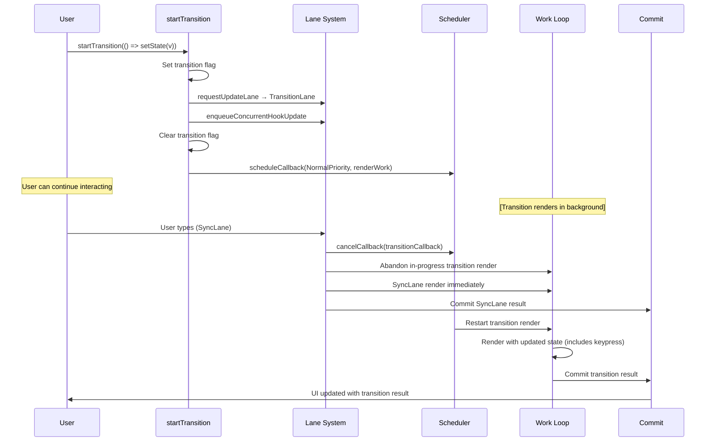
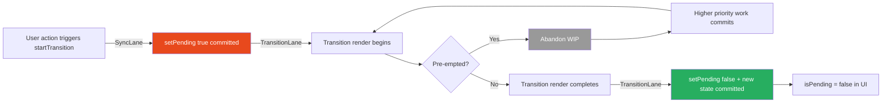

# 31 · startTransition & useTransition

> **startTransition and useTransition are the primary user-facing APIs for React's concurrent rendering model. They do one thing: mark a state update as non-urgent, giving React permission to interrupt that render when higher-priority work (like user input) arrives. Understanding exactly what that means at the implementation level — how the transition lane is assigned, how pre-emption works, what isPending tracks, and what transitions cannot do — transforms these APIs from "magic responsiveness toggles" into precise engineering tools.**

Most introductions to transitions describe them as "making renders non-blocking." This is correct but incomplete. A transition render is still blocked during its time slices — it still takes the same total CPU time. What changes is its relationship to higher-priority work. This document explains that relationship precisely.

---

## Table of Contents

- [What startTransition Actually Does](#what-starttransition-actually-does)
- [The Transition Lane](#the-transition-lane)
- [startTransition Internals](#starttransition-internals)
- [useTransition: The Hook Version](#usetransition-the-hook-version)
- [isPending: What It Tracks Precisely](#ispending-what-it-tracks-precisely)
- [How Pre-emption Works During Transitions](#how-pre-emption-works-during-transitions)
- [The Stale-While-Rendering Pattern](#the-stale-while-rendering-pattern)
- [Multiple Concurrent Transitions](#multiple-concurrent-transitions)
- [Transitions and Suspense](#transitions-and-suspense)
- [What Transitions Cannot Do](#what-transitions-cannot-do)
- [When to Use Transitions](#when-to-use-transitions)
- [Server Actions and Transitions](#server-actions-and-transitions)
- [Transitions in Next.js](#transitions-in-nextjs)
- [Architecture Diagrams](#architecture-diagrams)
- [Good Practices](#good-practices)
- [Bad Practices](#bad-practices)
- [Mental Model](#mental-model)
- [Common Misconceptions](#common-misconceptions)
- [Exercises](#exercises)
- [Further Reading](#further-reading)

---

## What startTransition Actually Does

`startTransition` does exactly one thing at the implementation level: it sets a flag on `ReactCurrentBatchConfig` that causes any `setState` calls within the callback to receive a `TransitionLane` instead of `DefaultLane`.

That's it. The entire API surface is this lane assignment.

```js
// From ReactStartTransition.js
function startTransition(scope, options) {
  const prevTransition = ReactCurrentBatchConfig.transition;

  // Set the transition flag
  ReactCurrentBatchConfig.transition = {};
  // ↑ This object is used as a truthy marker
  // Its presence tells requestUpdateLane to assign TransitionLane

  try {
    scope(); // call your setState(s) here
    // Inside scope(), every setState call checks:
    // if (ReactCurrentBatchConfig.transition !== null) → use TransitionLane
  } finally {
    ReactCurrentBatchConfig.transition = prevTransition;
    // Restore previous state (supports nested transitions)
  }
}
```

The lane assignment happens in `requestUpdateLane`:

```js
function requestUpdateLane(fiber) {
  // Check if we're inside a transition
  const transition = ReactCurrentBatchConfig.transition;

  if (transition !== null) {
    // We're in startTransition — assign a TransitionLane
    const actionScopeLane = peekEntangledActionLane();
    return actionScopeLane !== NoLane
      ? actionScopeLane
      : requestTransitionLane(transition);
  }

  // Not in transition: use the event priority
  const updateLane = getCurrentUpdatePriority();
  if (updateLane !== NoLane) {
    return updateLane;
  }

  // Fallback: use the event lane
  return getEventPriority();
}
```

`requestTransitionLane` assigns one of 16 available transition lanes (`TransitionLane1` through `TransitionLane16`). React cycles through them round-robin, which allows tracking multiple simultaneous transitions independently.

---

## The Transition Lane

TransitionLanes occupy bits 7-22 in React's 31-bit lane bitmask:

```js
// From ReactFiberLane.js
export const TransitionLane1 = 0b0000000000000000000000001000000;
export const TransitionLane2 = 0b0000000000000000000000010000000;
export const TransitionLane3 = 0b0000000000000000000000100000000;
// ... through TransitionLane16

export const TransitionLanes = 0b0000000001111111111111110000000;
// All 16 TransitionLanes OR'd together
```

TransitionLane has lower priority than:

- `SyncLane` (discrete user events)
- `InputContinuousLane` (continuous user events)
- `DefaultLane` (normal state updates)

And higher priority than:

- `RetryLanes` (Suspense retries)
- `IdleLane` (background work)
- `OffscreenLane` (hidden content)

### How the Scheduler processes TransitionLane work

```js
// In ensureRootIsScheduled:
function lanesToSchedulerPriority(lanes) {
  const higherPriorityLanes = pickArbitraryLane(getHighestPriorityLanes(lanes));

  if (higherPriorityLanes === SyncLane) {
    return ImmediateSchedulerPriority; // runs synchronously
  }
  if (
    includesSomeLane(higherPriorityLanes, InputContinuousLane | DefaultLane)
  ) {
    return UserBlockingSchedulerPriority; // 250ms before expiry
  }
  if (includesSomeLane(higherPriorityLanes, TransitionLanes)) {
    return NormalSchedulerPriority; // 5000ms before expiry
  }
  return IdleSchedulerPriority; // never expires
}
```

TransitionLane work is scheduled at `NormalPriority` in the Scheduler — the same as regular state updates — but with a longer expiry time (5 seconds vs 250ms). This means transitions won't be starved even if high-priority work keeps arriving.

---

## startTransition Internals

Full flow from calling `startTransition` to a render being scheduled:

```
1. startTransition(scope) called
   → ReactCurrentBatchConfig.transition = {} (truthy marker)

2. scope() executes
   → setState(newValue) called inside scope
   → dispatchSetState fires
   → requestUpdateLane: sees transition flag → assigns TransitionLane
   → Update object created: { lane: TransitionLane, action: newValue }
   → enqueueConcurrentHookUpdate: adds to fiber's queue
   → scheduleUpdateOnFiber: marks fiber and ancestors with TransitionLane

3. scope() exits
   → ReactCurrentBatchConfig.transition = null (restored)

4. scheduleUpdateOnFiber processes:
   → ensureRootIsScheduled
   → No existing SyncLane work → schedule TransitionLane work
   → scheduleCallback(NormalSchedulerPriority, performConcurrentWorkOnRoot)

5. Next task slot:
   → performConcurrentWorkOnRoot runs
   → renderLanes includes TransitionLane
   → workLoopConcurrent begins
   → Time-sliced render (5ms chunks with shouldYield checks)
```

### Nested startTransition

`startTransition` supports nesting by saving and restoring the transition state:

```tsx
startTransition(() => {
  // ReactCurrentBatchConfig.transition = transitionA
  setState(valueA); // gets TransitionLane

  startTransition(() => {
    // ReactCurrentBatchConfig.transition = transitionB (new object)
    setState(valueB); // gets TransitionLane (possibly different TransitionLane)
  });
  // ReactCurrentBatchConfig.transition = transitionA (restored)

  setState(valueC); // gets TransitionLane
});
// ReactCurrentBatchConfig.transition = null (restored)
```

Nested transitions are tracked independently — React can tell them apart via the lane entanglement system.

---

## useTransition: The Hook Version

`useTransition` is `startTransition` plus an `isPending` state:

```tsx
const [isPending, startTransition] = useTransition();
```

Internally:

```js
// From ReactFiberHooks.js
function mountTransition() {
  const [isPending, setPending] = mountState(false);

  // Create a bound startTransition that also updates isPending
  const start = startTransitionWithCallbacks.bind(null, root, setPending);

  const hook = mountWorkInProgressHook();
  hook.memoizedState = start;

  return [isPending, start];
}

function updateTransition() {
  const [isPending] = updateState(false);
  const hook = updateWorkInProgressHook();
  const start = hook.memoizedState; // the bound startTransition function
  return [isPending, start];
}
```

The `startTransition` returned by `useTransition` does everything the global `startTransition` does, plus:

1. Sets `isPending = true` synchronously (via SyncLane) before starting the transition
2. Sets `isPending = false` synchronously when the transition commits

```js
function startTransitionWithCallbacks(root, setPending, scope, options) {
  // Set isPending = true synchronously (SyncLane — instant)
  ReactCurrentBatchConfig.transition = null;
  setPending(true); // ← SyncLane: renders immediately

  ReactCurrentBatchConfig.transition = {};

  try {
    // Set isPending = false as part of the transition
    // (so it commits at the same time as the transition result)
    setPending(false);
    scope(); // your setState calls — TransitionLane
  } finally {
    ReactCurrentBatchConfig.transition = null;
  }
}
```

The sequence:

1. `setPending(true)` → SyncLane → renders immediately → `isPending = true` in UI
2. Transition render starts (TransitionLane)
3. Transition render commits → `setPending(false)` commits at the same time → `isPending = false`

---

## isPending: What It Tracks Precisely

`isPending` is `true` from when `startTransition` is called until the transition commits. During that window:

```
t=0: startTransition called
     isPending = true committed (synchronous)
     Transition render begins (time-sliced)

t=50ms: User types → pre-empts transition
        isPending still = true (transition not committed yet)
        Transition render abandoned
        SyncLane render for keypress commits

t=100ms: Transition render restarted
         still isPending = true

t=150ms: Transition render completes
         isPending = false commits
         Final transition result visible
```

`isPending = true` means: "a transition is in progress — the UI may be showing stale content for the transitioned state."

### Using isPending correctly

```tsx
const [isPending, startTransition] = useTransition();

// ✅ Show loading indicator during transition
{isPending && <LoadingSpinner />}

// ✅ Style stale content during transition
<ResultsList
  results={results}
  style={{ opacity: isPending ? 0.7 : 1 }}
/>

// ✅ Disable action button during transition to prevent double-submit
<button
  onClick={handleAction}
  disabled={isPending}
>
  {isPending ? 'Processing...' : 'Submit'}
</button>

// ❌ Don't use isPending for data-dependent logic
// isPending tells you about the render, not about data availability
if (!isPending) {
  // This is true both before the transition starts AND after it commits
  // It cannot tell you "do we have fresh data"
}
```

---

## How Pre-emption Works During Transitions

This is the core behavior that makes transitions valuable. When a high-priority update arrives during a transition render:

```js
// In performConcurrentWorkOnRoot:
function performConcurrentWorkOnRoot(root) {
  const originalCallbackNode = root.callbackNode;
  const lanes = getNextLanes(root, root.pingedLanes | root.expiredLanes);

  // Render the transition
  renderRootConcurrent(root, lanes);

  // After render phase: check if we were pre-empted
  if (root.callbackNode !== originalCallbackNode) {
    // A higher-priority update arrived and replaced our callback
    // Our work was abandoned
    return null;
  }

  // ...proceed to commit if not pre-empted
}
```

The pre-emption sequence in detail:

```
Transition render: processing fiber 250 of 500

User presses key → dispatchSetState fires (SyncLane)
  → ensureRootIsScheduled called
  → SyncLane has higher priority than TransitionLane
  → cancelCallback(existingTransitionCallbackNode)
    ← This cancels the transition's Scheduler callback
  → scheduleCallback for SyncLane work
  → root.callbackNode = new SyncLane callback

workLoopConcurrent: shouldYield() fires (5ms elapsed)
  → work loop exits
  → performConcurrentWorkOnRoot: checks root.callbackNode
  → callbackNode !== originalCallbackNode → ABANDONED
  → return null (don't reschedule transition)

SyncLane render runs synchronously:
  → workLoopSync (no shouldYield)
  → commitRoot
  → keypress result committed

ensureRootIsScheduled called again (for pending transition work):
  → TransitionLane still has pending updates
  → scheduleCallback(NormalPriority, performConcurrentWorkOnRoot)
  → Transition render RESTARTS from root
  → prepareFreshStack: new WIP tree from current (includes keypress result)
```

The critical detail: when the transition restarts, it starts from the newly committed state (including the keypress). The transition render will incorporate the keypress result, not override it.

---

## The Stale-While-Rendering Pattern

During a transition, the current UI remains visible and interactive. This is the "stale-while-rendering" pattern — you show the old content while preparing the new:

```tsx
function TabBar({ tabs }: { tabs: Tab[] }) {
  const [activeTab, setActiveTab] = useState(tabs[0].id);
  const [isPending, startTransition] = useTransition();

  const handleTabClick = (tabId: string) => {
    startTransition(() => {
      setActiveTab(tabId); // slow: new tab content may take 100ms to render
    });
  };

  return (
    <div>
      <nav>
        {tabs.map((tab) => (
          <button
            key={tab.id}
            onClick={() => handleTabClick(tab.id)}
            className={activeTab === tab.id ? "active" : ""}
            // ↑ activeTab shows the CURRENT committed tab
            // The user sees the current tab as active while the new tab renders
            style={{ opacity: isPending && activeTab === tab.id ? 0.7 : 1 }}
          >
            {tab.label}
          </button>
        ))}
      </nav>

      {/* Shows current tab content until new tab renders */}
      <TabContent tabId={activeTab} />
      {isPending && <LoadingOverlay />}
    </div>
  );
}
```

### Why the current tab stays visible

During the transition render:

- `activeTab` state update is pending in the TransitionLane
- The committed state still has the old tab's `activeTab` value
- The component renders with the committed (old) `activeTab`
- The new tab content renders in the background (WIP tree)
- When transition commits: `activeTab` = new tab, content switches instantly

No flash of empty content. No loading state occupying the content area. Just the old content staying visible while the new content loads in the background.

---

## Multiple Concurrent Transitions

React can have multiple transitions in flight simultaneously. Each gets a distinct TransitionLane from the pool of 16:

```tsx
function Dashboard() {
  const [isPendingA, startTransitionA] = useTransition();
  const [isPendingB, startTransitionB] = useTransition();

  const handleActionA = () => {
    startTransitionA(() => {
      setDataA(computeExpensiveA()); // gets TransitionLane1
    });
  };

  const handleActionB = () => {
    startTransitionB(() => {
      setDataB(computeExpensiveB()); // gets TransitionLane2
    });
  };
}
```

React processes these transitions independently. If both are triggered simultaneously:

- TransitionLane1 and TransitionLane2 are both in `root.pendingLanes`
- React renders them together in one render pass when possible (both lanes in `renderLanes`)
- Or renders them sequentially if one pre-empts the other

### Lane entanglement

When a transition interacts with Suspense, React may entangle lanes — ensuring related updates commit together:

```js
// From ReactFiberWorkLoop.js
function entangleTransitionUpdate(root, queue, lane) {
  if (includesSomeLane(lane, TransitionLanes)) {
    // Mark this queue as entangled with its transition lane
    let queueLanes = queue.lanes;
    queueLanes = intersectLanes(queueLanes, root.pendingLanes);
    const newQueueLanes = mergeLanes(queueLanes, lane);
    queue.lanes = newQueueLanes;
    markRootEntangled(root, newQueueLanes);
  }
}
```

Lane entanglement prevents a transition from partially committing — if part of the transition is waiting for Suspense, the whole transition waits.

---

## Transitions and Suspense

Transitions and Suspense form a powerful combination for data loading:

```tsx
function App() {
  const [resource, setResource] = useState(null);
  const [isPending, startTransition] = useTransition();

  const handleLoad = (id: string) => {
    startTransition(() => {
      setResource(createResource(id)); // may trigger Suspense in child
    });
  };

  return (
    <>
      <button onClick={() => handleLoad("123")}>Load Profile</button>

      {isPending && <SkeletonLoader />}

      <Suspense fallback={<FullPageSpinner />}>
        {resource && <Profile resource={resource} />}
        {/* Profile reads from resource — may suspend */}
      </Suspense>
    </>
  );
}
```

### How transition + Suspense interacts

Without transition:

```
setState → render → Profile suspends → Suspense shows fallback (<FullPageSpinner />)
→ Current content is REPLACED by spinner until data loads
```

With transition:

```
startTransition → render → Profile suspends → Suspense KEEPS current content visible
→ isPending = true (shows SkeletonLoader in header)
→ Current content remains until transition commits
→ When data resolves → retry render → Profile renders → transition commits
→ New content replaces old — no spinner ever shown in the content area
```

> 🔬 **Internals:** React tracks which Suspense boundaries have pending transitions. When a Suspense boundary is inside a transition render and throws a Promise, React marks it with a special flag (`DidCapture | ShouldCapture`). Instead of showing the fallback immediately, React records the suspended boundary and continues rendering the rest of the tree. The current content stays visible until the transition commits or the Promise resolves.

---

## What Transitions Cannot Do

Understanding transitions' limitations prevents misapplication:

### Cannot cancel network requests

```tsx
// ❌ startTransition does NOT cancel the fetch
const [isPending, startTransition] = useTransition();

const handleSearch = (query: string) => {
  startTransition(() => {
    setQuery(query);
    // If this triggers a fetch in a useEffect:
    // The fetch fires when the transition commits
    // startTransition cannot cancel in-flight fetches
  });
};

// ✅ For cancellable requests: use AbortController in useEffect
useEffect(() => {
  const controller = new AbortController();
  fetch(`/api/search?q=${query}`, { signal: controller.signal });
  return () => controller.abort();
}, [query]);
```

### Cannot make individual component renders faster

```tsx
// ❌ startTransition doesn't help when one component takes 50ms
function SlowComponent() {
  // 50ms synchronous computation
  const result = expensiveAlgorithm(data);
  return <div>{result}</div>;
}

startTransition(() => setData(newData));
// → Starts transition render
// → SlowComponent.render() takes 50ms
// → shouldYield() fires after each fiber, not mid-fiber
// → SlowComponent blocks for its full 50ms regardless of transition
```

### Cannot prevent commits from blocking

```tsx
// ❌ Once transition commits, commit phase is synchronous
// If transition involves 1000 DOM mutations: all happen synchronously in commit
// startTransition doesn't split the commit phase
```

### Cannot work with synchronous rendering

```tsx
// ❌ flushSync inside startTransition is an error
startTransition(() => {
  flushSync(() => {
    setState(value); // throws: flushSync cannot be nested in transitions
  });
});
```

### Cannot defer synchronous effects

```tsx
// useLayoutEffect runs synchronously after commit — even for transitions
// useEffect runs after paint — same for transitions (no special deferral)
```

---

## When to Use Transitions

The decision criteria:

```
USE startTransition when ALL of these are true:
  1. The state update triggers an expensive render (>16ms)
  2. The update is triggered by user interaction that must feel instant
  3. You can show the current UI while the new UI loads
  4. You have feedback for the pending state (isPending indicator)

DON'T USE startTransition when:
  - The render is fast (<16ms) — transitions add overhead for no benefit
  - The update must commit immediately (form submission, navigation)
  - There is no way to show stale content (e.g., modal open/close)
  - The update is from a network response (network latency, not render time)
```

### Common valid use cases

```tsx
// ✅ Filtering large lists
startTransition(() => setFilter(newFilter));

// ✅ Sorting large datasets
startTransition(() => setSortKey(newKey));

// ✅ Navigating between heavy pages
startTransition(() => router.push("/heavy-page"));

// ✅ Toggling between complex visualizations
startTransition(() => setVisualizationType("treemap"));

// ✅ Loading search results while input stays responsive
startTransition(() => setSearchResults(computeResults(query)));
```

---

## Server Actions and Transitions

React 19 introduces Server Actions — async functions that run on the server. When called from a client component, they automatically work with transitions:

```tsx
// React 19 + Next.js App Router
"use client";
import { useTransition } from "react";
import { updateProfile } from "./actions"; // server action

function ProfileForm({ user }: { user: User }) {
  const [isPending, startTransition] = useTransition();

  const handleSubmit = (formData: FormData) => {
    startTransition(async () => {
      // Server action: async, runs on server
      await updateProfile(formData);
      // isPending stays true until the server action resolves AND
      // the resulting re-render commits
    });
  };

  return (
    <form action={handleSubmit}>
      <input name="name" defaultValue={user.name} />
      <button type="submit" disabled={isPending}>
        {isPending ? "Saving..." : "Save"}
      </button>
    </form>
  );
}
```

Server actions inside `startTransition` extend `isPending` to cover the full lifecycle: client render → network request → server execution → server response → client re-render → commit.

---

## Transitions in Next.js

Next.js App Router uses transitions throughout for route navigation:

```tsx
// next/navigation useRouter uses startTransition internally
import { useRouter } from "next/navigation";

function NavigationLink({
  href,
  children,
}: {
  href: string;
  children: React.ReactNode;
}) {
  const router = useRouter();
  const [isPending, startTransition] = useTransition();

  return (
    <a
      href={href}
      onClick={(e) => {
        e.preventDefault();
        startTransition(() => {
          router.push(href); // transition: current page stays visible while new page loads
        });
      }}
    >
      {isPending ? <Spinner /> : children}
    </a>
  );
}
```

### The loading.js file and transitions

Next.js's `loading.js` convention creates a Suspense boundary that shows during navigation transitions:

```tsx
// app/dashboard/loading.tsx
export default function DashboardLoading() {
  return <DashboardSkeleton />; // shown during transition to dashboard
}

// app/dashboard/page.tsx — async component
async function DashboardPage() {
  const data = await fetchDashboardData(); // server-side fetch
  return <Dashboard data={data} />;
}
```

During navigation to `/dashboard`:

- `startTransition` wraps the router.push (implicit in Next.js)
- Current page stays visible (stale-while-rendering)
- `loading.tsx` Suspense fallback may show if transition takes too long
- When new page is ready: instant switch

---

## Architecture Diagrams

### startTransition: from call to commit



### isPending lifecycle



---

## Good Practices

### ✅ Good Practice — Combine startTransition with visual feedback

```tsx
/**
 * Good: Every transition has three parts:
 * 1. Urgent feedback (happens immediately — SyncLane)
 * 2. Non-urgent computation (happens in background — TransitionLane)
 * 3. Pending indicator (shows while transition is in progress)
 *
 * The user never wonders if their action registered.
 * The UI is always interactive during the transition.
 */
function KanbanBoard({ tasks }: { tasks: Task[] }) {
  const [columns, setColumns] = useState(groupByStatus(tasks));
  const [isPending, startTransition] = useTransition();
  const [optimisticMove, setOptimisticMove] = useState<{
    taskId: string;
    toColumn: string;
  } | null>(null);

  const handleTaskMove = (taskId: string, toColumn: string) => {
    // 1. URGENT: optimistic update — task visually moves immediately
    setOptimisticMove({ taskId, toColumn });

    // 2. NON-URGENT: recompute all column groupings
    startTransition(() => {
      const updatedTasks = tasks.map((t) =>
        t.id === taskId ? { ...t, status: toColumn } : t,
      );
      setColumns(groupByStatus(updatedTasks));
      setOptimisticMove(null); // clear optimistic state when real state commits
    });
  };

  return (
    <div className={`board ${isPending ? "board--computing" : ""}`}>
      {/* 3. PENDING: subtle visual feedback during recomputation */}
      {isPending && (
        <div className="board__computing-indicator">Organizing...</div>
      )}
      {Object.entries(columns).map(([status, columnTasks]) => (
        <Column
          key={status}
          status={status}
          tasks={columnTasks}
          optimisticMove={optimisticMove}
          onTaskMove={handleTaskMove}
        />
      ))}
    </div>
  );
}
```

---

## Bad Practices

### ⚠️ Bad Practice — Using startTransition for synchronous urgent updates

```tsx
/**
 * Bad: startTransition applied to updates that must be immediate.
 * The "pending" state and deferred rendering cause a worse UX than
 * just rendering synchronously.
 *
 * Here: a toggle button. Clicking it should immediately reflect the change.
 * Wrapping in startTransition makes it feel laggy — the button won't
 * show the new state until the transition commits.
 */
function ToggleButton() {
  const [isOn, setIsOn] = useState(false);
  const [isPending, startTransition] = useTransition();

  const handleClick = () => {
    // ❌ Wrong: toggle should be instant
    startTransition(() => {
      setIsOn((v) => !v); // DelayedTransition — button feels unresponsive
    });
    // User clicks → button doesn't change → isPending = true → ...200ms later → button changes
    // User thinks button didn't register their click
  };

  return (
    <button
      onClick={handleClick}
      className={isOn ? "on" : "off"} // shows CURRENT committed state
      // During transition: still shows OLD state → confusing
    >
      {isOn ? "ON" : "OFF"}
    </button>
  );
}

/**
 * ✅ Correct: instant toggle — never use startTransition for simple state changes
 */
function ToggleButton() {
  const [isOn, setIsOn] = useState(false);
  // No transition — setIsOn renders synchronously (SyncLane)
  return (
    <button
      onClick={() => setIsOn((v) => !v)} // immediate
      className={isOn ? "on" : "off"}
    >
      {isOn ? "ON" : "OFF"}
    </button>
  );
}
```

**Production impact:** A team applied `startTransition` to all their state updates "for performance." Every button click, every toggle, every form field update now had an imperceptible delay. Users reported that the app "felt slow and unresponsive" — the opposite of the intended effect. `startTransition` made simple interactions feel laggy because the immediate SyncLane render was replaced by a deferred TransitionLane render with `isPending` causing visual stutter.

---

## Mental Model

> 💡 **The transition mental model:**
>
> `startTransition` is a **"low priority mail" designation**. When you write a letter (state update) without any designation, it gets processed as regular mail — the postal service (React Scheduler) handles it in the order it arrives. When you mark a letter as "low priority / non-urgent," it still goes into the queue, still gets delivered, but urgent mail (user input) always gets processed first. If a lot of urgent mail arrives, your low-priority letter waits in the queue — but it doesn't get lost. Eventually, when the urgent mail is cleared, your letter gets delivered. The `isPending` flag is like a tracking notification — "your letter is in transit, not yet delivered." The key: you still have to write a good letter (efficient component). Marking bad code as "low priority" doesn't make it faster — it just lets other mail go first.

---

## Common Misconceptions

### "startTransition prevents the UI from freezing"

`startTransition` prevents the _transition render_ from blocking user input — not from freezing the UI. If a single component in the transition render takes 50ms, the UI freezes for that 50ms. Time slicing only helps between component renders.

### "useTransition is required for startTransition"

`startTransition` (the standalone function from `react`) works without the hook. The hook version (`useTransition`) adds the `isPending` state. Use the hook when you need the pending indicator; use the standalone when you don't.

### "isPending means data is loading"

`isPending` means "a transition render is in progress." It is true from when `startTransition` is called until when the transition commits. It says nothing about network requests, data availability, or Suspense state — only about React's render lifecycle.

### "Transitions work with any setState"

Transitions only work with `setState` calls that happen _inside_ the `startTransition` callback. If a `setState` happens in a callback triggered by the transition's effects, it gets DefaultLane priority — not TransitionLane.

### "A transition render cannot be interrupted by another transition"

A TransitionLane render can be interrupted by SyncLane, InputContinuousLane, and DefaultLane — but also by another transition with an older (expired) lane. The priority system is hierarchical among TransitionLanes based on when they were created.

---

## Exercises

### Exercise 1 — Measure the transition benefit

```tsx
function SearchBenchmark({ items }: { items: Item[] }) {
  const [query, setQuery] = useState("");
  const [filtered, setFiltered] = useState(items);
  const [isPending, startTransition] = useTransition();

  // Version A: without transition
  const handleChangeA = (q: string) => {
    setQuery(q);
    setFiltered(items.filter((i) => i.name.includes(q)));
  };

  // Version B: with transition
  const handleChangeB = (q: string) => {
    setQuery(q);
    startTransition(() => {
      setFiltered(items.filter((i) => i.name.includes(q)));
    });
  };

  // Measure: input lag (time between keypress and character appearing in input)
  // with 10,000 items in each version
  // Use performance.mark() before and after input update
}
```

### Exercise 2 — Observe pre-emption

```tsx
let renderAttempts = 0;
let committedRenders = 0;

function TransitionComponent({ value }: { value: number }) {
  renderAttempts++;
  // Add artificial slowness
  const start = performance.now();
  while (performance.now() - start < 2) {} // 2ms per component

  useEffect(() => {
    committedRenders++;
    console.log(
      `Committed render ${committedRenders} (${renderAttempts} attempts)`,
    );
  });

  return <div>{value}</div>;
}
```

Trigger a transition render of 100 `TransitionComponent` instances. While it renders, rapidly click a button (SyncLane). Count render attempts vs committed renders. The ratio shows pre-emptions.

### Exercise 3 — Build a transition-aware router

```tsx
// Build a client-side router that uses transitions for navigation:
// - Current page stays visible during load
// - isPending shows a navigation loading bar
// - Pre-emption: if user clicks another link, current navigation is abandoned
// - Suspense: if new page has data requirements, fallback shows in new page area

function Router() {
  const [route, setRoute] = useState("/home");
  const [isPending, startTransition] = useTransition();

  const navigate = (to: string) => {
    startTransition(() => setRoute(to));
  };

  return (
    <>
      {isPending && <NavigationBar />}
      <nav>
        <button onClick={() => navigate("/home")}>Home</button>
        <button onClick={() => navigate("/about")}>About</button>
        <button onClick={() => navigate("/data")}>Data (slow)</button>
      </nav>
      <Suspense fallback={<PageSkeleton />}>
        <Page route={route} />
      </Suspense>
    </>
  );
}
```

---

## Further Reading

- [React Source: ReactStartTransition.js](https://github.com/facebook/react/blob/main/packages/react/src/ReactStartTransition.js) — startTransition implementation
- [React Source: ReactFiberHooks.js — mountTransition, updateTransition](https://github.com/facebook/react/blob/main/packages/react-reconciler/src/ReactFiberHooks.js) — useTransition implementation
- [React Source: ReactFiberLane.js — TransitionLanes](https://github.com/facebook/react/blob/main/packages/react-reconciler/src/ReactFiberLane.js) — Lane system
- [React Docs: startTransition](https://react.dev/reference/react/startTransition) — Official reference
- [React Docs: useTransition](https://react.dev/reference/react/useTransition) — Official hook reference
- [React 18 Working Group: New Suspense SSR Architecture](https://github.com/reactwg/react-18/discussions/37) — Transitions + Suspense design
- Next in this handbook: [32 · useDeferredValue](./03-deferred-value.md)

---

_Part of the [React + Next.js Engineering Handbook](../../README.md)_
