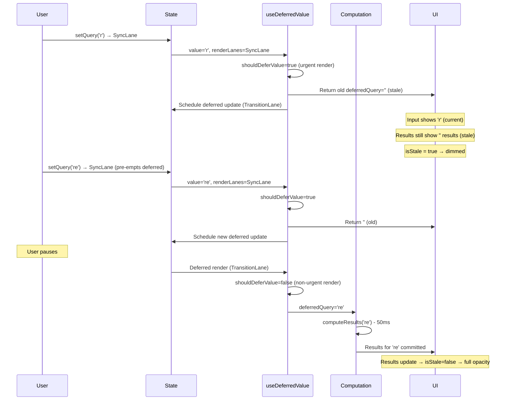

# 32 · useDeferredValue

> **useDeferredValue is the component-level equivalent of startTransition — it creates a deferred copy of a value that renders at lower priority, allowing expensive renders driven by that value to be interrupted by urgent work. The difference is in where control lives: startTransition wraps the setState call, useDeferredValue wraps the value itself. This distinction determines which API to reach for based on whether you own the state update or receive a value as a prop.**

`useDeferredValue` is one of React 18's most useful but least understood APIs. It solves a specific problem elegantly: what do you do when you receive a rapidly-changing value as a prop (or from context) and using it drives an expensive render, but you cannot change the code that produces that value? `useDeferredValue` lets the receiver — not the producer — control when the expensive computation runs.

---

## Table of Contents

- [What useDeferredValue Does](#what-usedeferredvalue-does)
- [useDeferredValue Internals](#usedeferredvalue-internals)
- [The Deferred Render Mechanism](#the-deferred-render-mechanism)
- [useDeferredValue vs startTransition](#usedeferredvalue-vs-starttransition)
- [The Staleness Indicator Pattern](#the-staleness-indicator-pattern)
- [useDeferredValue with useMemo](#usedeferredvalue-with-usememo)
- [useDeferredValue and Suspense](#usedeferredvalue-and-suspense)
- [How useDeferredValue Behaves Under Load](#how-usedeferredvalue-behaves-under-load)
- [When deferredValue Catches Up](#when-deferredvalue-catches-up)
- [useDeferredValue in React 19](#usedeferredvalue-in-react-19)
- [Architecture Diagrams](#architecture-diagrams)
- [Good Practices](#good-practices)
- [Bad Practices](#bad-practices)
- [Mental Model](#mental-model)
- [Common Misconceptions](#common-misconceptions)
- [Exercises](#exercises)
- [Further Reading](#further-reading)

---

## What useDeferredValue Does

`useDeferredValue` accepts a value and returns a "deferred" version of it. The deferred version:

1. **Starts equal to the original value** on first render
2. **Lags behind** the original value when updates are frequent — React renders the urgent parts first, then updates the deferred value when the thread is free
3. **Eventually catches up** — every update is guaranteed to commit eventually

```tsx
function SearchPage() {
  const [query, setQuery] = useState("");
  const deferredQuery = useDeferredValue(query);

  // query: always current — input stays responsive
  // deferredQuery: may lag behind during rapid typing
  //   → but drives the expensive search results computation

  const results = useMemo(
    () => computeSearchResults(deferredQuery), // expensive
    [deferredQuery],
  );

  const isStale = query !== deferredQuery; // true while deferred value is behind

  return (
    <div>
      <input value={query} onChange={(e) => setQuery(e.target.value)} />
      <div style={{ opacity: isStale ? 0.7 : 1 }}>
        <SearchResults results={results} />
      </div>
    </div>
  );
}
```

When the user types rapidly:

- `query` updates immediately (SyncLane) on every keystroke
- `deferredQuery` lags — it renders at lower priority (TransitionLane)
- `results` recomputes only when `deferredQuery` changes
- The input is always responsive

---

## useDeferredValue Internals

`useDeferredValue` is implemented as a combination of state and effect — it schedules a low-priority update to synchronize the deferred value with the current value:

```js
// From ReactFiberHooks.js
function mountDeferredValue(value, initialValue) {
  const hook = mountWorkInProgressHook();

  return mountDeferredValueImpl(hook, value, initialValue);
}

function mountDeferredValueImpl(hook, value, initialValue) {
  if (enableUseDeferredValueInitialArg) {
    // React 19: supports an initialValue for the first render
    const prevValue = initialValue !== undefined ? initialValue : value;
    hook.memoizedState = prevValue;
    return prevValue;
  } else {
    hook.memoizedState = value; // React 18: starts with the provided value
    return value;
  }
}

function updateDeferredValue(value, initialValue) {
  const hook = updateWorkInProgressHook();
  const resolvedCurrentHook = currentHook;
  const prevValue = resolvedCurrentHook.memoizedState;
  return updateDeferredValueImpl(hook, prevValue, value, initialValue);
}

function updateDeferredValueImpl(hook, prevValue, value, initialValue) {
  if (Object.is(value, prevValue)) {
    // Value unchanged — return the same deferred value
    return value;
  }

  // Value changed — should we use the new value or defer?
  const shouldDeferValue = !includesOnlyNonUrgentLanes(renderLanes);

  if (shouldDeferValue) {
    // We are currently rendering at URGENT priority
    // Defer: return the old value for now
    // Schedule a low-priority update to apply the new value later

    if (!Object.is(value, hook.memoizedState)) {
      // Mark that we need a deferred update
      const deferredLane = requestDeferredLane();
      currentlyRenderingFiber.lanes = mergeLanes(
        currentlyRenderingFiber.lanes,
        deferredLane,
      );
      markSkippedUpdateLanes(deferredLane);
    }

    // Return OLD value — deferred update pending
    return hook.memoizedState;
  } else {
    // We are rendering at non-urgent (transition) priority
    // It's safe to use the new value immediately
    hook.memoizedState = value;
    return value;
  }
}
```

The key logic is `shouldDeferValue = !includesOnlyNonUrgentLanes(renderLanes)`:

- **Urgent render** (SyncLane, InputContinuousLane): `shouldDeferValue = true` → return old value, schedule deferred update
- **Non-urgent render** (TransitionLane, DefaultLane): `shouldDeferValue = false` → use new value immediately

---

## The Deferred Render Mechanism

When a component renders at urgent priority with a new value, `useDeferredValue` schedules a deferred update and returns the old value. This deferred update is what eventually makes `deferredValue` catch up:

```
Render 1 (initial, DefaultLane):
  query = ''
  useDeferredValue: renderLanes has DefaultLane (non-urgent)
  shouldDeferValue = false → use value immediately
  deferredQuery = '' (same as query)

User types 'r' (SyncLane):
Render 2 (SyncLane):
  query = 'r'
  useDeferredValue: renderLanes has SyncLane (urgent!)
  shouldDeferValue = true → return old value
  deferredQuery = '' (old value)
  Schedule deferred update at deferredLane

[Input immediately shows 'r' — SyncLane committed]
[Deferred update scheduled via requestDeferredLane]

Render 3 (deferred, non-urgent):
  query = 'r' (from committed state)
  useDeferredValue: renderLanes has deferredLane (non-urgent)
  shouldDeferValue = false → use new value
  deferredQuery = 'r' (catches up!)
  [expensive computation runs with 'r']
  [Search results update]
```

This creates two render cycles per update:

1. Urgent render (SyncLane): input updates, `deferredQuery` stays behind
2. Deferred render (lower priority): `deferredQuery` catches up, expensive computation runs

### `requestDeferredLane`

```js
function requestDeferredLane() {
  // Returns the current render's transition lane if we're in a transition
  // Otherwise allocates a new deferred lane
  if (workInProgressDeferredLane === NoLane) {
    const currentEventTransitionLane = currentEventTransitionLane;
    if (currentEventTransitionLane !== NoLane) {
      workInProgressDeferredLane = currentEventTransitionLane;
    } else {
      workInProgressDeferredLane = claimNextTransitionLane();
    }
  }
  return workInProgressDeferredLane;
}
```

The deferred update uses a `TransitionLane` — the same priority level as `startTransition`. This means the deferred render:

- Is interruptible by urgent work
- Can be pre-empted if the user types again before it commits
- Has a 5-second expiry to prevent starvation

---

## useDeferredValue vs startTransition

These two APIs solve related but distinct problems. Understanding when to use each requires understanding what you control:

### startTransition: you control the setState call

```tsx
// ✅ Use startTransition when you call setState yourself
function SearchPage() {
  const [results, setResults] = useState([]);
  const [isPending, startTransition] = useTransition();

  const handleSearch = (query: string) => {
    startTransition(() => {
      setResults(computeResults(query)); // you call this setState
    });
  };

  return (
    <>
      <SearchInput onSearch={handleSearch} />
      {isPending && <LoadingIndicator />}
      <ResultsList results={results} />
    </>
  );
}
```

### useDeferredValue: you receive a value, don't control its source

```tsx
// ✅ Use useDeferredValue when you receive a value you don't control
function ExpensiveResultsList({ query }: { query: string }) {
  // You receive query as a prop — you can't wrap the parent's setState
  const deferredQuery = useDeferredValue(query);

  const results = useMemo(
    () => computeExpensiveResults(deferredQuery),
    [deferredQuery],
  );

  return <ResultsList results={results} />;
}

// Parent doesn't need to know about transitions:
function SearchPage() {
  const [query, setQuery] = useState("");
  return (
    <>
      <input value={query} onChange={(e) => setQuery(e.target.value)} />
      <ExpensiveResultsList query={query} />
    </>
  );
}
```

### Side-by-side comparison

| Aspect            | startTransition                        | useDeferredValue               |
| ----------------- | -------------------------------------- | ------------------------------ |
| Where to apply    | Around the `setState` call             | Around the received value      |
| Who controls      | The state producer                     | The state consumer             |
| Pending state     | `useTransition` gives `isPending`      | Compare value vs deferredValue |
| Number of renders | 1 transition render                    | 2 renders (urgent + deferred)  |
| Network awareness | Yes (with async functions in React 19) | No                             |
| Granularity       | Per state update                       | Per value usage                |

### When both are appropriate

Sometimes you can use either — pick based on where it's cleaner to apply:

```tsx
// These produce similar results:

// Option 1: startTransition at the setState site
const handleChange = (value: string) => {
  setQuery(value); // urgent: input
  startTransition(() => {
    setFilter(value); // deferred: expensive filter
  });
};

// Option 2: useDeferredValue at the consumption site
const deferredQuery = useDeferredValue(query);
const filtered = useMemo(() => filter(deferredQuery), [deferredQuery]);
```

---

## The Staleness Indicator Pattern

The most important UX pattern when using `useDeferredValue`: always indicate to users when they're seeing stale content.

```tsx
function ProductCatalog({ products }: { products: Product[] }) {
  const [sortOrder, setSortOrder] = useState<"asc" | "desc">("asc");
  const [filterCategory, setFilterCategory] = useState<string>("all");

  // Deferred: only the sorting/filtering computation is deferred
  const deferredSortOrder = useDeferredValue(sortOrder);
  const deferredCategory = useDeferredValue(filterCategory);

  const processedProducts = useMemo(
    () =>
      products
        .filter(
          (p) => deferredCategory === "all" || p.category === deferredCategory,
        )
        .sort((a, b) =>
          deferredSortOrder === "asc" ? a.price - b.price : b.price - a.price,
        ),
    [products, deferredSortOrder, deferredCategory],
  );

  // Staleness: either deferred value is behind its source
  const isStale =
    sortOrder !== deferredSortOrder || filterCategory !== deferredCategory;

  return (
    <div>
      <FilterBar
        sortOrder={sortOrder}
        onSortChange={setSortOrder}
        category={filterCategory}
        onCategoryChange={setFilterCategory}
      />

      {/* Visual feedback while deferred render catches up */}
      <div
        className="product-grid"
        style={{
          opacity: isStale ? 0.6 : 1,
          transition: "opacity 200ms",
          pointerEvents: isStale ? "none" : "auto", // prevent interaction with stale content
        }}
        aria-busy={isStale}
        aria-label={isStale ? "Loading updated products..." : undefined}
      >
        {processedProducts.map((product) => (
          <ProductCard key={product.id} product={product} />
        ))}
      </div>

      {isStale && (
        <div role="status" className="loading-indicator">
          Updating results...
        </div>
      )}
    </div>
  );
}
```

### Why the staleness indicator matters

Without a staleness indicator:

- User changes filter → products grid shows OLD products
- There's no loading state
- User doesn't know if their action registered
- May click again thinking it didn't work → confusing behavior

With a staleness indicator:

- User changes filter → products grid dims slightly
- User knows an update is in progress
- When deferred render commits: grid returns to full opacity with new products

---

## useDeferredValue with useMemo

`useDeferredValue` is most powerful when combined with `useMemo`. The deferred value creates stable memoization deps that only change when the deferred render commits:

```tsx
function DataVisualization({ data, config }: VisualizationProps) {
  // Defer the entire config object
  const deferredConfig = useDeferredValue(config);

  // useMemo: only recomputes when deferredConfig changes
  // (not on every render triggered by other state)
  const chartData = useMemo(
    () => transformDataForChart(data, deferredConfig),
    [data, deferredConfig],
  );

  // Without useDeferredValue:
  // Every time config changes (even rapid slider movements):
  // → transformDataForChart runs → potentially 50ms of work → UI jank
  //
  // With useDeferredValue:
  // config updates instantly for the slider UI
  // deferredConfig lags behind → chartData only recomputes when thread is free
  // → Slider feels instant, chart updates when ready

  const isStale = config !== deferredConfig;

  return (
    <div>
      <ConfigSliders
        config={config}
        onChange={setConfig} // instant UI update
      />
      <div style={{ opacity: isStale ? 0.7 : 1 }}>
        <Chart data={chartData} />
      </div>
    </div>
  );
}
```

### The key optimization chain

```
Frequent value update (config changes rapidly)
  ↓
useDeferredValue: urgent renders use old deferredConfig
  ↓
useMemo: deps haven't changed (still old deferredConfig)
  ↓
No recomputation during rapid updates
  ↓
[User pauses or browser is idle]
  ↓
Deferred render: deferredConfig catches up
  ↓
useMemo: deps changed → recompute
  ↓
Chart updates with new data
```

---

## useDeferredValue and Suspense

`useDeferredValue` integrates with Suspense to prevent fallback flickering during rapid updates:

```tsx
function UserProfile({ userId }: { userId: string }) {
  const deferredUserId = useDeferredValue(userId);
  const isStale = userId !== deferredUserId;

  return (
    <div style={{ opacity: isStale ? 0.7 : 1 }}>
      {/* Profile loads from a Suspense-compatible data source */}
      <Suspense fallback={<ProfileSkeleton />}>
        <ProfileData userId={deferredUserId} />
        {/* Uses deferredUserId: stays on previous profile until new one loads */}
      </Suspense>
    </div>
  );
}
```

Without `useDeferredValue`:

- `userId` changes → ProfileData suspends with new userId → Suspense shows fallback
- User sees: current profile → loading skeleton → new profile
- The loading skeleton flash is jarring

With `useDeferredValue`:

- `userId` changes → `deferredUserId` stays old → ProfileData renders OLD profile (no suspension)
- Old profile shown while new profile loads in background
- When new profile ready → deferred render commits → instant switch
- User sees: current profile (slightly dimmed) → new profile (no skeleton)

---

## How useDeferredValue Behaves Under Load

Under continuous rapid updates (like typing), `useDeferredValue` exhibits specific timing behavior:

### Scenario: User types "react" one character at a time

```
t=0ms:   User types 'r' → SyncLane render: query='r', deferredQuery=''
          Schedule deferred update (TransitionLane)

t=5ms:   Deferred render starts: deferredQuery='r'
          (expensive computation starts)

t=8ms:   User types 'e' → SyncLane pre-empts deferred render
          SyncLane render: query='re', deferredQuery='r' (stayed at 'r')
          Deferred render ABANDONED (was computing for 'r')
          Schedule NEW deferred update for 're'

t=10ms:  Deferred render restarts: computing for 're'

t=12ms:  User types 'a' → SyncLane pre-empts again
          deferredQuery='r' still (deferred render for 're' was abandoned)
          Schedule NEW deferred update for 'rea'

t=14ms:  [User pauses typing for 100ms]

t=14ms:  Deferred render starts: computing for 'rea'
          (no more pre-emptions while user pauses)

t=64ms:  Deferred render commits: deferredQuery='rea'
          (50ms computation for 'rea')
          [User continues typing...]
```

During rapid typing, the deferred render may never catch up to intermediate values — it catches up to the _latest_ value when the user pauses. This is the correct behavior: no wasted computation on intermediate results.

### The "always shows latest result" guarantee

React guarantees that `deferredValue` will eventually equal `value` — it cannot permanently lag. The 5-second expiry on TransitionLanes ensures starvation doesn't occur.

---

## When deferredValue Catches Up

`deferredValue` catches up to `value` in two scenarios:

### Scenario 1: User pauses (most common)

When no new SyncLane updates arrive, the deferred render has time to complete:

```
User stops typing for 16ms+
  → No more pre-emptions
  → Deferred render completes
  → deferredValue = value
  → isStale = false
  → UI shows fresh results
```

### Scenario 2: Transition lane expires

If the deferred render has been pending for 5 seconds (unusual), the Scheduler promotes it to a higher priority, ensuring it commits:

```
Deferred update pending for 5000ms
  → Lane expires
  → Scheduler: treat as Immediate priority
  → Deferred render runs synchronously (SyncLane equivalent)
  → deferredValue catches up
```

This prevents starvation in extreme edge cases.

---

## useDeferredValue in React 19

React 19 adds an optional `initialValue` parameter to `useDeferredValue`:

```tsx
// React 18:
const deferredQuery = useDeferredValue(query);
// First render: deferredQuery = query (no deferral on first render)

// React 19:
const deferredQuery = useDeferredValue(query, "");
// First render: deferredQuery = '' (the initialValue)
// Subsequent renders: behavior same as React 18
```

This is useful for server-side rendering where you want the client's first render to use a placeholder while the real computation runs:

```tsx
// Server renders with query from URL params
// Client hydrates and immediately shows placeholder while deferred render computes
function SearchPage({ initialQuery }: { initialQuery: string }) {
  const [query, setQuery] = useState(initialQuery);

  // React 19: starts with empty string, then catches up to initialQuery
  // Prevents hydration mismatch when deferred render produces different output
  const deferredQuery = useDeferredValue(query, "");

  return (
    <>
      <SearchInput value={query} onChange={setQuery} />
      <SearchResults query={deferredQuery} />
    </>
  );
}
```

---

## Architecture Diagrams

### useDeferredValue: two-render lifecycle per update



### useDeferredValue vs startTransition: control placement

```mermaid
graph TD
    subgraph "startTransition: producer controls"
        P1[Parent Producer]
        P1 -->|"startTransition(() => setState(v))"| T1[TransitionLane update]
        T1 --> C1[Child Consumer renders with new v]
        style P1 fill:#764abc,color:#fff
    end

    subgraph "useDeferredValue: consumer controls"
        P2[Parent Producer]
        P2 -->|"setState(v) — no transition"| D1[Prop v changes]
        D1 --> C2[Child Consumer]
        C2 -->|"deferredV = useDeferredValue(v)"| DU[Returns old v for urgent renders]
        DU -->|"schedules deferred update"| TR[TransitionLane render later]
        TR --> C2
        style C2 fill:#764abc,color:#fff
        style DU fill:#61dafb,color:#000
    end
```



---

## Good Practices

### ✅ Good Practice — useDeferredValue for prop-driven expensive renders

```tsx
/**
 * Good: useDeferredValue at the consumer end of a rapidly-changing prop.
 * The producer (SearchPage) is clean — no transition logic needed.
 * The consumer (SearchResults) handles its own deferral.
 * Staleness is clearly communicated to the user.
 */

// Producer: simple, no transition needed
function SearchPage() {
  const [query, setQuery] = useState("");

  return (
    <div>
      <input
        value={query}
        onChange={(e) => setQuery(e.target.value)}
        placeholder="Search 50,000 products..."
      />
      {/* Consumer handles deferral internally */}
      <SearchResults query={query} />
    </div>
  );
}

// Consumer: defers expensive computation without impacting producer
function SearchResults({ query }: { query: string }) {
  const deferredQuery = useDeferredValue(query);
  const isStale = query !== deferredQuery;

  // Expensive: filters 50,000 products
  const results = useMemo(
    () => searchIndex.query(deferredQuery, { limit: 50 }),
    [deferredQuery],
  );

  return (
    <>
      {/* Accessible loading state */}
      <div role="region" aria-label="Search results" aria-busy={isStale}>
        {isStale && (
          <span className="sr-only">Loading results for: {query}</span>
        )}

        <div
          style={{ opacity: isStale ? 0.6 : 1, transition: "opacity 0.15s" }}
        >
          {results.length === 0 && deferredQuery ? (
            <EmptyState query={deferredQuery} />
          ) : (
            <ResultGrid results={results} />
          )}
        </div>
      </div>

      <div className="result-meta">
        {!isStale && `${results.length} results for "${deferredQuery}"`}
      </div>
    </>
  );
}
```

**Why this works:** `SearchPage` has zero transition logic — it just manages the query string normally. `SearchResults` independently decides to defer the expensive computation. The `isStale` flag drives clear visual feedback. If `SearchResults` is used elsewhere without rapid updates, the deferral is invisible (catches up immediately). The component is self-optimizing.

---

## Bad Practices

### ⚠️ Bad Practice — useDeferredValue on everything "for performance"

```tsx
/**
 * Bad: Applying useDeferredValue to all values "just in case."
 * This creates extra render cycles without any benefit when the values
 * are cheap to use, or when the renders are already fast.
 *
 * Each useDeferredValue creates TWO renders per update (urgent + deferred).
 * For trivial computations, the overhead of the extra render exceeds
 * any savings from the deferral.
 */
function UserHeader({ user, isLoggedIn, theme, locale }: HeaderProps) {
  // ❌ useDeferredValue on a boolean — renders instantly, deferral adds overhead
  const deferredIsLoggedIn = useDeferredValue(isLoggedIn);

  // ❌ useDeferredValue on a theme string — theme changes are rare, render is fast
  const deferredTheme = useDeferredValue(theme);

  // ❌ useDeferredValue on locale — same issue
  const deferredLocale = useDeferredValue(locale);

  // ❌ useDeferredValue on a user object where rendering is trivial
  const deferredUser = useDeferredValue(user);

  return (
    <header className={`header-${deferredTheme}`}>
      {deferredIsLoggedIn ? (
        <UserAvatar user={deferredUser} />
      ) : (
        <LoginButton locale={deferredLocale} />
      )}
    </header>
  );
}

/**
 * ✅ Correct: useDeferredValue only where the computation is measurably expensive
 * AND the value changes frequently enough to cause problems
 */
function SearchResultsPanel({ query }: { query: string }) {
  // ✅ Justified: computeResults takes 50ms on 100k items, query changes on every keystroke
  const deferredQuery = useDeferredValue(query);
  const results = useMemo(() => computeResults(deferredQuery), [deferredQuery]);

  return <ResultsList results={results} isStale={query !== deferredQuery} />;
}
```

**Production impact:** A team applied `useDeferredValue` to 15 different values in their app header "for performance." Each user interaction now triggered 2 renders instead of 1 for the header — doubling the reconciliation work for that component on every update. The header contained no expensive computations, so the deferral provided zero benefit while adding 100% overhead. React DevTools showed twice as many renders for the header than before the "optimization."

---

## Mental Model

> 💡 **The useDeferredValue mental model:**
>
> `useDeferredValue` is like a **slow-to-update scoreboard** at a sports event. The actual game is happening in real time (the `value` — always current). The scoreboard shows the score, but it updates only when there's a pause in play (the `deferredValue` — catches up when the thread is free). During active play, the scoreboard might show last quarter's score — it's "stale" — but the game itself hasn't stopped. When play pauses for a moment, the scoreboard updates to show the current score. You can tell the scoreboard is stale because it shows a different number than the live ticker (the `isStale` check). Nobody stops the game to update the scoreboard — the scoreboard updates itself when it can. `useDeferredValue` is the same: the expensive computation (scoreboard) updates on its own schedule, without blocking the important work (the game).

---

## Common Misconceptions

### "useDeferredValue makes renders faster"

`useDeferredValue` splits one render into two renders — making individual renders more numerous but shorter per update cycle. Total CPU time is the same or higher. The benefit is responsiveness: the expensive second render can be pre-empted by urgent work.

### "deferredValue is always one render behind"

The deferred value lags behind only during urgent renders. During non-urgent renders (like the deferred render itself), `shouldDeferValue = false` and the deferred value uses the current value immediately. Once the deferred render commits, `deferredValue === value`.

### "useDeferredValue and startTransition are interchangeable"

They solve similar problems in different places. Use `startTransition` when you control the `setState` call. Use `useDeferredValue` when you receive a prop or context value and can't change how it's produced. They're complementary, not alternatives.

### "useDeferredValue requires useMemo"

`useDeferredValue` works without `useMemo`, but combining them is the primary use case. Without `useMemo`, the expensive computation still runs on every render of the component (just not on every update to the value).

### "isStale is a reliable loading indicator"

`isStale = (value !== deferredValue)` is a synchronous check. It's true while the deferred render is pending. But it doesn't tell you about network loading, data availability, or Suspense state — only about the render lifecycle.

---

## Exercises

### Exercise 1 — Observe the two-render lifecycle

```tsx
let renderCount = 0;
let urgentRenders = 0;
let deferredRenders = 0;

function TrackingComponent({ query }: { query: string }) {
  renderCount++;
  const deferredQuery = useDeferredValue(query);
  const isDeferred = query !== deferredQuery;

  if (isDeferred) urgentRenders++;
  else deferredRenders++;

  console.log(
    `Render ${renderCount}: query=${query}, deferred=${deferredQuery}, urgent=${isDeferred}`,
  );

  return <div>{deferredQuery}</div>;
}
```

Type rapidly into an input connected to `query`. Observe:

- Every keystroke: one urgent render (query updated, deferredQuery stale)
- After pause: one deferred render (deferredQuery catches up)
- How urgentRenders compares to deferredRenders (should be ~equal)

### Exercise 2 — Measure responsiveness improvement

```tsx
function MeasuredInput() {
  const [query, setQuery] = useState("");
  const deferredQuery = useDeferredValue(query);

  const mark = (e: React.KeyboardEvent) => {
    performance.mark(`keydown-${e.key}`);
  };

  const handleChange = (e: React.ChangeEvent<HTMLInputElement>) => {
    setQuery(e.target.value);
    // After state update commits:
    requestAnimationFrame(() => {
      const entry = performance.getEntriesByName(
        `keydown-${e.target.value.slice(-1)}`,
      )[0];
      if (entry) {
        console.log(`Input lag: ${performance.now() - entry.startTime}ms`);
      }
    });
  };

  // Generate 10,000 items to make results expensive
  const results = useMemo(
    () => generateResults(deferredQuery, 10000),
    [deferredQuery],
  );

  return (
    <>
      <input value={query} onChange={handleChange} onKeyDown={mark} />
      <Results items={results} />
    </>
  );
}
```

Measure input lag with and without `useDeferredValue`.

### Exercise 3 — useDeferredValue with Suspense

Build a profile viewer that switches between users. Without `useDeferredValue`, clicking a new user shows a loading skeleton. With `useDeferredValue`, the current profile stays visible (dimmed) while the new profile loads:

```tsx
function ProfileViewer({ userId }: { userId: string }) {
  // Without: always shows skeleton between profiles
  // With useDeferredValue: shows current profile while loading next

  const deferredUserId = useDeferredValue(userId);
  const isStale = userId !== deferredUserId;

  return (
    <div style={{ opacity: isStale ? 0.7 : 1 }}>
      <Suspense fallback={<ProfileSkeleton />}>
        {/* Uses deferredUserId — stays on previous profile during transition */}
        <Profile userId={deferredUserId} />
      </Suspense>
    </div>
  );
}
```

Verify: switching users shows the OLD profile dimmed rather than a skeleton.

---

## Further Reading

- [React Source: ReactFiberHooks.js — mountDeferredValue, updateDeferredValue](https://github.com/facebook/react/blob/main/packages/react-reconciler/src/ReactFiberHooks.js)
- [React Docs: useDeferredValue](https://react.dev/reference/react/useDeferredValue) — Official reference
- [React 18 Working Group: useDeferredValue](https://github.com/reactwg/react-18/discussions/129) — Design discussion
- [React Docs: Deferring a value to improve performance](https://react.dev/reference/react/useDeferredValue#deferring-re-rendering-for-a-part-of-the-ui) — Practical guide
- Next in this handbook: [33 · Suspense Internals](./04-suspense.md)

---

_Part of the [React + Next.js Engineering Handbook](../../README.md)_
