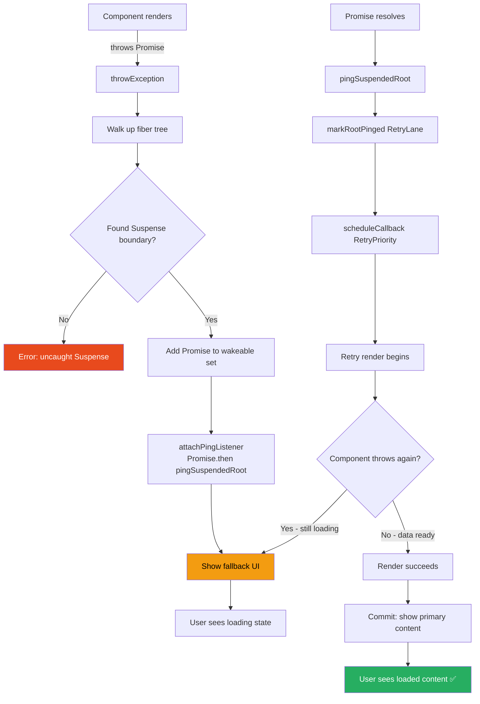
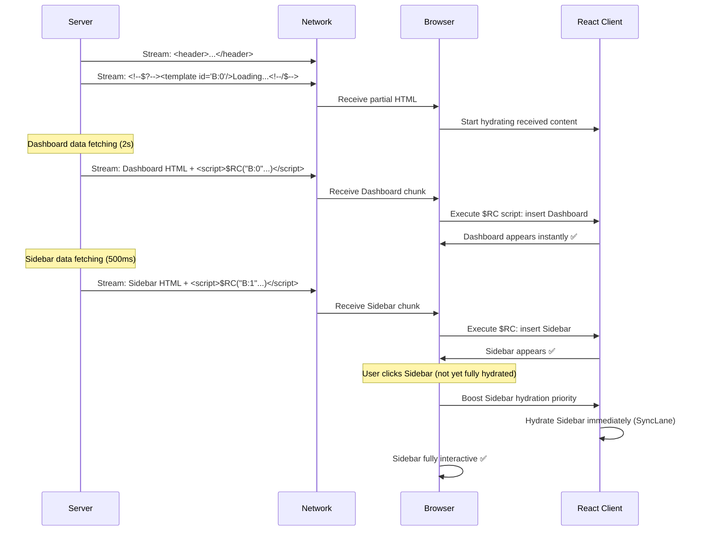

# 33 · Suspense Internals

> **Suspense is React's mechanism for declaratively handling asynchronous rendering. When a component "suspends," it throws a Promise. React catches that throw, shows a fallback UI, and retries the render when the Promise resolves. Understanding this throw-and-retry mechanism, how it interacts with concurrent rendering and transitions, and how streaming SSR uses it reveals why Suspense is the foundational primitive for loading states in modern React.**

Suspense looks simple from the outside: wrap something in `<Suspense fallback={<Loading />}>` and React handles the loading state. The internal implementation is considerably more complex — it involves Promise detection in the reconciler, error boundary-like parent traversal, retry scheduling, dehydrated tree management, and selective hydration. This document traces the complete Suspense lifecycle from Promise throw to committed result.

---

## Table of Contents

- [The Throw-and-Catch Mechanism](#the-throw-and-catch-mechanism)
- [What Suspense Actually Catches](#what-suspense-actually-catches)
- [The SuspenseComponent Fiber](#the-suspensecomponent-fiber)
- [Render Phase: Catching the Throw](#render-phase-catching-the-throw)
- [The Fallback and the Hidden Tree](#the-fallback-and-the-hidden-tree)
- [Retry: How Suspense Resolves](#retry-how-suspense-resolves)
- [Suspense and Transitions: The No-Fallback Contract](#suspense-and-transitions-the-no-fallback-contract)
- [Nested Suspense Boundaries](#nested-suspense-boundaries)
- [Data Fetching with Suspense](#data-fetching-with-suspense)
- [Suspense and Error Boundaries](#suspense-and-error-boundaries)
- [Streaming SSR and Suspense](#streaming-ssr-and-suspense)
- [Selective Hydration](#selective-hydration)
- [Suspense in React 19](#suspense-in-react-19)
- [Architecture Diagrams](#architecture-diagrams)
- [Good Practices](#good-practices)
- [Bad Practices](#bad-practices)
- [Mental Model](#mental-model)
- [Common Misconceptions](#common-misconceptions)
- [Exercises](#exercises)
- [Further Reading](#further-reading)

---

## The Throw-and-Catch Mechanism

Suspense works by exploiting JavaScript's exception system in an unconventional way: components throw Promises (not Errors) to signal that they're not ready to render.

```tsx
// A simple Suspense-compatible data source
function createResource<T>(fetchFn: () => Promise<T>) {
  let status: "pending" | "success" | "error" = "pending";
  let result: T | Error;

  const promise = fetchFn().then(
    (data) => {
      status = "success";
      result = data;
    },
    (err) => {
      status = "error";
      result = err;
    },
  );

  return {
    read(): T {
      if (status === "pending") throw promise; // ← THROW A PROMISE
      if (status === "error") throw result as Error;
      return result as T;
    },
  };
}

// Component using the resource:
function UserProfile({
  resource,
}: {
  resource: ReturnType<typeof createResource<User>>;
}) {
  const user = resource.read(); // throws promise if not ready
  return <div>{user.name}</div>;
}

// Usage:
function App() {
  const resource = createResource(() => fetchUser("123"));
  return (
    <Suspense fallback={<Skeleton />}>
      <UserProfile resource={resource} />
    </Suspense>
  );
}
```

When `resource.read()` throws a Promise:

1. React catches the throw in the reconciler (not in user code)
2. React finds the nearest Suspense boundary above the throwing component
3. React shows the fallback UI
4. React attaches a `.then()` to the Promise
5. When the Promise resolves: React retries the render

---

## What Suspense Actually Catches

React's reconciler uses a try-catch around `beginWork` to catch throws from component renders:

```js
// In ReactFiberWorkLoop.js — simplified
function performUnitOfWork(unitOfWork) {
  let next;
  try {
    next = beginWork(current, unitOfWork, renderLanes);
  } catch (thrownValue) {
    handleThrow(root, thrownValue);
    next = null;
  }
  // ...
}

function handleThrow(root, thrownValue) {
  if (
    thrownValue !== null &&
    typeof thrownValue === "object" &&
    typeof thrownValue.then === "function"
  ) {
    // It's a thenable (Promise-like) — this is Suspense
    workInProgressSuspendedReason = SuspendedOnData;
    workInProgressThrownValue = thrownValue;
  } else if (thrownValue instanceof Error) {
    // Regular Error — this is for Error Boundaries
    workInProgressSuspendedReason = SuspendedOnError;
    workInProgressThrownValue = thrownValue;
  }
  // Mark the throwing fiber as Incomplete
  workInProgress.flags |= Incomplete;
}
```

React distinguishes between:

- **Thenable (Promise-like)**: Suspense mechanism — show fallback, retry when resolved
- **Error**: Error Boundary mechanism — show error UI, cannot recover automatically

The check is duck-typed: `typeof thrownValue.then === 'function'`. Any Promise-like object works — not just native Promises.

---

## The SuspenseComponent Fiber

A `<Suspense>` component creates a fiber with tag `SuspenseComponent`:

```js
// SuspenseComponent fiber state:
fiber.memoizedState = null; // null when NOT suspended
// When suspended:
fiber.memoizedState = {
  dehydrated: null, // for SSR dehydration
  treeContext: null,
  retryLane: RetryLane, // the lane to use for retry render
};
```

When not suspended: `memoizedState = null` → show children normally.
When suspended: `memoizedState = { ... }` → show fallback, children are hidden.

The Suspense fiber's children structure:

```
SuspenseComponent fiber
  ├── "Primary" child (what you want to show)
  │     ├── ComponentA
  │     └── ComponentB (this one suspended)
  └── "Fallback" child (what to show while suspended)
        └── YourFallbackUI
```

During suspension, the primary child is rendered to a hidden tree (OffscreenComponent) and the fallback is shown. This allows the primary tree to retain its state while hidden.

---

## Render Phase: Catching the Throw

When a component throws a Promise, React walks up the fiber tree to find the nearest Suspense boundary:

```js
// From ReactFiberThrow.js
function throwException(
  root,
  returnFiber,
  sourceFiber,
  value,
  rootRenderLanes,
) {
  // Mark the throwing fiber as Incomplete
  sourceFiber.flags |= Incomplete;

  // Walk up the tree to find a Suspense boundary
  let workInProgress = returnFiber;
  do {
    if (workInProgress.tag === SuspenseComponent) {
      // Found a Suspense boundary!

      // Check if it's already suspended (deduplication)
      const wakeables = workInProgress.updateQueue;

      if (wakeables === null) {
        // First suspension on this boundary: create the wakeable set
        const retryQueue = new Set();
        workInProgress.updateQueue = retryQueue;
      }

      // Add our Promise to the wakeable set
      const retryQueue = workInProgress.updateQueue;
      retryQueue.add(value); // value = the thrown Promise

      // Attach the retry callback to the Promise
      attachPingListener(root, value, rootRenderLanes);
      // ↑ When this Promise resolves: scheduleUpdateOnFiber with RetryLane

      return; // Suspense boundary found — stop walking up
    }

    // Not a Suspense boundary: mark as Incomplete and continue up
    workInProgress.flags |= Incomplete;
    workInProgress.subtreeFlags = NoFlags;
    workInProgress.deletions = null;

    workInProgress = workInProgress.return;
  } while (workInProgress !== null);

  // Reached root without finding Suspense: this is an error
  // (should have been caught by an Error Boundary instead)
}
```

### attachPingListener: scheduling the retry

```js
function attachPingListener(root, wakeable, lanes) {
  // Create a ping listener (called when the Promise resolves)
  let pingCache = root.pingCache;

  if (pingCache === null) {
    root.pingCache = pingCache = new PossiblyWeakMap();
  }

  let threadIDs = pingCache.get(wakeable);
  if (threadIDs === undefined) {
    pingCache.set(wakeable, (threadIDs = new Set()));
  }

  if (!threadIDs.has(lanes)) {
    threadIDs.add(lanes);

    // Attach the ping callback to the Promise
    const ping = pingSuspendedRoot.bind(null, root, wakeable, lanes);
    wakeable.then(ping, ping); // called on resolve OR reject
  }
}

function pingSuspendedRoot(root, wakeable, pingedLanes) {
  // Promise resolved! Schedule a retry render
  const cache = root.pingCache;
  if (cache !== null) {
    cache.delete(wakeable); // remove from pending set
  }

  const eventTime = requestEventTime();
  markRootPinged(root, pingedLanes, eventTime);
  // Schedules a new render at RetryLane priority
  ensureRootIsScheduled(root, eventTime);
}
```

---

## The Fallback and the Hidden Tree

When a Suspense boundary is suspended, React performs a specific sequence:

```js
// In ReactFiberBeginWork.js — updateSuspenseComponent
function updateSuspenseComponent(current, workInProgress, renderLanes) {
  const nextProps = workInProgress.pendingProps;
  const nextChildren = nextProps.children;
  const nextFallback = nextProps.fallback;

  // Is this boundary currently suspended?
  const didSuspend = (workInProgress.flags & DidCapture) !== 0;

  if (didSuspend) {
    // ─── SUSPENDED STATE ────────────────────────────────────────────────
    workInProgress.flags &= ~DidCapture; // clear the flag

    // Create an OffscreenComponent to hide (but preserve) the primary children
    const primaryChildFragment = mountWorkInProgressHook(); // simplified
    primaryChildFragment.mode |= ConcealedMode; // hidden, but state preserved

    // Mount the fallback in its place
    const fallbackFragment = createFiberFromFragment(
      nextFallback,
      workInProgress.mode,
      renderLanes,
      null,
    );

    workInProgress.child = primaryChildFragment;
    primaryChildFragment.sibling = fallbackFragment;

    // Set suspended state on this Suspense fiber
    workInProgress.memoizedState = SUSPENDED_MARKER;

    return fallbackFragment; // render the fallback next
  } else {
    // ─── UNSUSPENDED STATE ──────────────────────────────────────────────
    // Render primary children normally
    const primaryChildFragment = updateWorkInProgressHook(); // simplified
    workInProgress.child = primaryChildFragment;
    return primaryChildFragment;
  }
}
```

### The OffscreenComponent: preserving hidden state

The primary children (what you WANT to show) are wrapped in an `OffscreenComponent` fiber when suspended. This component:

- Does not render to the DOM (invisible)
- Preserves all child component state
- Preserves event listeners
- Allows the primary tree to complete rendering in the background (concurrent mode)

When the Promise resolves and the retry render commits, React swaps: the OffscreenComponent becomes visible and the fallback is unmounted.

---

## Retry: How Suspense Resolves

When the thrown Promise resolves, `pingSuspendedRoot` schedules a retry render:

```js
function pingSuspendedRoot(root, wakeable, pingedLanes) {
  // Mark this lane as "pinged" (retry needed)
  markRootPinged(root, pingedLanes, eventTime);
  ensureRootIsScheduled(root, eventTime);
  // → scheduleCallback with RetryLane priority
}
```

The retry render:

```js
// In the retry render (renderLanes includes RetryLane):
function updateSuspenseComponent(current, workInProgress, renderLanes) {
  // Check if this Suspense boundary needs to retry
  if (includesSomeLane(renderLanes, RetryLane)) {
    // We're retrying — clear the suspended state
    workInProgress.flags |= DidCapture; // set to trigger re-evaluation
  }

  const didSuspend = (workInProgress.flags & DidCapture) !== 0;

  if (!didSuspend) {
    // Try to render primary children again
    // If component no longer throws: success → show primary content
    // If still throws: stay in fallback state
  }
}
```

### Complete retry flow

```
Promise resolves
  ↓
pingSuspendedRoot called
  ↓
markRootPinged: root.pingLanes = RetryLane
  ↓
ensureRootIsScheduled: scheduleCallback(RetryPriority)
  ↓
performConcurrentWorkOnRoot (RetryLane)
  ↓
renderRootConcurrent
  ↓
workLoopConcurrent:
  beginWork(SuspenseComponent fiber)
    → didSuspend = false (cleared)
    → Try primary children
    → beginWork(OffscreenComponent)
      → beginWork(UserProfile)
        → resource.read() → returns data (no throw this time)
        → Renders successfully
  completeWork(UserProfile)
  completeWork(OffscreenComponent) → primary content ready
  completeWork(SuspenseComponent) → no longer suspended
  ↓
commitRoot:
  SuspenseComponent.memoizedState = null (not suspended)
  OffscreenComponent switches from hidden to visible
  Fallback fiber deleted
  ↓
User sees the loaded content ✅
```

---

## Suspense and Transitions: The No-Fallback Contract

When a Suspense throw happens inside a transition, React does NOT immediately show the fallback. Instead, the current content stays visible until the transition completes:

```tsx
function App() {
  const [userId, setUserId] = useState("alice");
  const [isPending, startTransition] = useTransition();

  return (
    <>
      <button onClick={() => startTransition(() => setUserId("bob"))}>
        Switch to Bob
      </button>
      {isPending && <LoadingBar />}

      <Suspense fallback={<ProfileSkeleton />}>
        <UserProfile userId={userId} />
      </Suspense>
    </>
  );
}
```

**Without transition:**

- Click → `userId = 'bob'` → UserProfile suspends → Suspense shows `<ProfileSkeleton />`
- Current profile disappears, skeleton appears, then Bob's profile appears

**With transition:**

- Click → transition starts → `isPending = true` → `<LoadingBar />` shows
- Transition render: UserProfile with userId='bob' suspends
- React: "this is a transition — don't show the fallback"
- Current profile (Alice) stays visible (slightly dimmed if you style it)
- When Bob's data loads: transition commits → Alice profile replaced by Bob's instantly
- `<ProfileSkeleton />` is NEVER shown

### How React implements the transition + Suspense contract

```js
// In throwException — when a throw is caught during a transition render:
if (includesSomeLane(renderLanes, TransitionLane)) {
  // We're in a transition — don't show fallback immediately
  // Instead: mark the Suspense boundary as "did capture" but
  // keep the current UI visible by NOT immediately showing the fallback
  workInProgress.flags |= ShouldCapture;
  // ShouldCapture (vs DidCapture): pending capture, not yet activated

  // The transition will show stale content while retrying
}
```

This "no-fallback during transition" behavior makes transitions + Suspense the ideal pattern for navigation: you always see complete page content, never a blank loading state.

---

## Nested Suspense Boundaries

Suspense boundaries are hierarchical. When a component suspends, React shows the fallback of the NEAREST ancestor Suspense boundary:

```tsx
function App() {
  return (
    <Suspense fallback={<AppLoading />}>
      {" "}
      {/* outer */}
      <Layout>
        <Suspense fallback={<SidebarLoading />}>
          {" "}
          {/* inner */}
          <Sidebar />
        </Suspense>
        <Suspense fallback={<ContentLoading />}>
          {" "}
          {/* inner */}
          <MainContent />
        </Suspense>
      </Layout>
    </Suspense>
  );
}
```

If `<Sidebar />` suspends: only `<SidebarLoading />` shows — `<MainContent />` and `<Layout />` are unaffected.

If `<Layout />` itself suspends (throws during render): `<AppLoading />` shows — the entire layout fallback.

### The boundary selection in throwException

```js
function throwException(
  root,
  returnFiber,
  sourceFiber,
  value,
  rootRenderLanes,
) {
  let workInProgress = returnFiber;
  do {
    if (
      workInProgress.tag === SuspenseComponent &&
      workInProgress.memoizedState === null
    ) {
      // Found the NEAREST unsuspended Suspense boundary
      // (memoizedState !== null means already suspended)
      // Attach to this boundary and stop walking up
      return;
    }
    workInProgress = workInProgress.return;
  } while (workInProgress !== null);
}
```

React always finds the nearest unsuspended boundary. An already-suspended boundary is skipped (its own fallback is already showing).

---

## Data Fetching with Suspense

Modern Suspense-compatible data fetching libraries (TanStack Query, SWR, Relay) handle the throw-and-catch automatically:

```tsx
// With TanStack Query (React Query):
import { useSuspenseQuery } from "@tanstack/react-query";

function UserProfile({ userId }: { userId: string }) {
  // useSuspenseQuery throws a Promise if data isn't cached
  const { data: user } = useSuspenseQuery({
    queryKey: ["user", userId],
    queryFn: () => fetchUser(userId),
  });

  // If we reach here: data is ready (no throw occurred)
  return <div>{user.name}</div>;
}

function App() {
  return (
    <Suspense fallback={<Skeleton />}>
      <UserProfile userId="123" />
    </Suspense>
  );
}
```

Under the hood, `useSuspenseQuery` maintains a cache:

- If cache hit: returns data immediately (no throw)
- If cache miss: starts fetch, throws a Promise
- When fetch completes: caches result, promise resolves → React retries
- On retry: cache hit → returns data → renders successfully

### Building a minimal Suspense cache

```tsx
// Educational: a minimal Suspense-compatible cache
class SuspenseCache {
  private cache = new Map<string, { status: string; result: unknown }>();

  read<T>(key: string, fetcher: () => Promise<T>): T {
    let entry = this.cache.get(key);

    if (!entry) {
      // No cache entry: start fetch, create pending entry
      entry = { status: "pending", result: null };
      this.cache.set(key, entry);

      fetcher()
        .then((data) => {
          entry!.status = "success";
          entry!.result = data;
        })
        .catch((err) => {
          entry!.status = "error";
          entry!.result = err;
        });
    }

    if (entry.status === "pending") {
      // Throw the pending promise — Suspense catches this
      throw new Promise<void>((resolve) => {
        const check = setInterval(() => {
          if (entry!.status !== "pending") {
            clearInterval(check);
            resolve();
          }
        }, 16);
      });
    }

    if (entry.status === "error") throw entry.result;

    return entry.result as T;
  }
}
```

> 🏭 **Production Note:** Don't build your own cache. Use TanStack Query, SWR, or another Suspense-compatible library. A production cache needs: deduplication, background revalidation, garbage collection, optimistic updates, error recovery, and streaming support. Roll-your-own caches miss these invariants and produce subtle bugs.

---

## Suspense and Error Boundaries

Suspense (for loading states) and Error Boundaries (for error states) are complementary:

```tsx
function SafeUserProfile({ userId }: { userId: string }) {
  return (
    <ErrorBoundary fallback={<ErrorUI />}>
      <Suspense fallback={<LoadingSkeleton />}>
        <UserProfile userId={userId} />
        {/* UserProfile may throw Promise (Suspense) or Error (ErrorBoundary) */}
      </Suspense>
    </ErrorBoundary>
  );
}
```

When `UserProfile` throws:

- **Promise**: Suspense catches it → shows `<LoadingSkeleton />`
- **Error**: Error Boundary catches it → shows `<ErrorUI />`

The distinction in `throwException`:

```js
if (typeof thrownValue.then === "function") {
  // → Suspense path
} else {
  // → Error Boundary path
}
```

If a Suspense boundary's fallback itself throws an error: the error propagates to the nearest Error Boundary above.

---

## Streaming SSR and Suspense

React 18's streaming SSR uses Suspense boundaries as streaming insertion points:

```tsx
// Server component with async data
async function DashboardPage() {
  return (
    <html>
      <body>
        {/* Streams immediately */}
        <Header />

        {/* Streams when data is ready */}
        <Suspense fallback={<DashboardSkeleton />}>
          <Dashboard />
        </Suspense>

        {/* Streams independently */}
        <Suspense fallback={<SidebarSkeleton />}>
          <Sidebar />
        </Suspense>
      </body>
    </html>
  );
}
```

### The streaming sequence

```
Server rendering begins:
  1. <Header /> renders completely → HTML sent to browser immediately
  2. <Dashboard /> and <Sidebar /> start fetching data

Browser receives partial HTML:
  <html>
    <body>
      <header>...</header>           ← streamed immediately
      <!--$?--><template id="B:0"/> ← Dashboard placeholder
      <div>Loading dashboard...</div>
      <!--/$-->
      <!--$?--><template id="B:1"/> ← Sidebar placeholder
      <div>Loading sidebar...</div>
      <!--/$-->
    </body>
  </html>

React hydrates the received HTML immediately (works without full page)

Dashboard data arrives (3 seconds later):
  Server sends script to browser:
  <div hidden id="S:0">
    [Complete dashboard HTML]
  </div>
  <script>
    $RC("B:0", "S:0"); // React Client Component replace
  </script>

Browser immediately inserts dashboard content:
  → No additional round-trip needed
  → Content appears as soon as server has it ready
```

### How React generates the streaming HTML

`renderToPipeableStream` (Node.js) and `renderToReadableStream` (Edge/Deno) handle streaming:

```js
// Server-side rendering
const { pipe, abort } = renderToPipeableStream(<App />, {
  onShellReady() {
    // Shell (everything before first Suspense) is ready
    response.setHeader("Content-Type", "text/html");
    pipe(response); // start streaming
  },
  onAllReady() {
    // All Suspense boundaries resolved — streaming complete
  },
  onError(error) {
    console.error(error);
    response.statusCode = 500;
  },
});

// Timeout: abort streaming after 10 seconds
setTimeout(() => abort(), 10000);
```

---

## Selective Hydration

In streaming SSR, React can hydrate different parts of the page independently. More importantly, it prioritizes hydration based on user interaction:

```tsx
// Three independent Suspense boundaries
function Page() {
  return (
    <>
      <Suspense fallback={<Skeleton />}>
        <Comments /> {/* receives HTML from stream */}
      </Suspense>
      <Suspense fallback={<Skeleton />}>
        <Sidebar /> {/* receives HTML from stream */}
      </Suspense>
      <Suspense fallback={<Skeleton />}>
        <ProductDetails /> {/* receives HTML from stream */}
      </Suspense>
    </>
  );
}
```

Normal hydration: React hydrates in tree order (Comments → Sidebar → ProductDetails).

**User interaction during hydration:** If the user clicks on `<Sidebar />` before it's hydrated, React immediately prioritizes `<Sidebar />`'s hydration — it becomes fully interactive before `<Comments />` finishes hydrating.

```js
// When user interacts with a not-yet-hydrated Suspense boundary:
function attemptHydrationAtCurrentPriority(root, fiber) {
  // Boost this fiber's hydration to SyncLane
  const lane = SyncLane;
  markRootUpdated(root, lane, eventTime);
  ensureRootIsScheduled(root, eventTime);
  // React hydrates this boundary immediately, before others
}
```

This makes large pages feel interactive almost immediately — even if parts are still loading or hydrating.

---

## Suspense in React 19

React 19 brings significant Suspense improvements:

### Async component support (Server Components)

```tsx
// React 19: async components work with Suspense automatically
async function UserCard({ userId }: { userId: string }) {
  const user = await fetchUser(userId); // direct await — no useEffect
  return <div>{user.name}</div>;
}

// In a Client Component:
function Page() {
  return (
    <Suspense fallback={<Skeleton />}>
      <UserCard userId="123" />
      {/* React handles the async automatically */}
    </Suspense>
  );
}
```

### `use` hook

React 19 introduces `use(promise)` — a hook that reads a Promise's value (and throws if not ready):

```tsx
import { use } from "react";

function UserProfile({ userPromise }: { userPromise: Promise<User> }) {
  // use() reads from the Promise, throws if pending, returns if resolved
  const user = use(userPromise);
  return <div>{user.name}</div>;
}

// Can be used conditionally (unlike other hooks):
function Profile({ userId }: { userId: string | null }) {
  if (!userId) return <EmptyState />;

  const userPromise = fetchUser(userId);
  const user = use(userPromise); // conditionally called — valid with use()
  return <div>{user.name}</div>;
}
```

`use()` is more powerful than the resource pattern because:

- Can be called conditionally
- Works with any Promise (not just special cache objects)
- Integrates with React's context reading too (`use(Context)`)

---

## Architecture Diagrams

### Suspense: the throw-catch-retry cycle



### Streaming SSR with Suspense



---

## Good Practices

### ✅ Good Practice — Granular Suspense boundaries for independent loading

```tsx
/**
 * Good: Each section has its own Suspense boundary.
 * Loading states are independent — one section loading doesn't block others.
 * Skeleton UIs match the content they're waiting for.
 * User sees progressive content revelation.
 */
function ProductPage({ productId }: { productId: string }) {
  return (
    <div className="product-page">
      {/* Critical: product info loads fast, shown first */}
      <Suspense fallback={<ProductInfoSkeleton />}>
        <ProductInfo productId={productId} />
      </Suspense>

      {/* Independent: images can load in parallel */}
      <Suspense fallback={<ImageGallerySkeleton />}>
        <ImageGallery productId={productId} />
      </Suspense>

      {/* Below the fold: reviews can take longer */}
      <Suspense fallback={<ReviewsSkeleton />}>
        <ProductReviews productId={productId} />
      </Suspense>

      {/* Recommendations: low priority, shown last */}
      <Suspense fallback={<RecommendationsSkeleton />}>
        <Recommendations productId={productId} />
      </Suspense>
    </div>
  );
}
```

**Why this works:** Four independent Suspense boundaries mean four parallel loading paths. `ProductInfo` (critical, fast) appears immediately when ready. `ImageGallery` and `ProductReviews` appear independently. `Recommendations` (low priority) don't block the others. Each skeleton matches its content area — no jarring layout shifts when content arrives.

---

## Bad Practices

### ⚠️ Bad Practice — One Suspense boundary for everything

```tsx
/**
 * Bad: Single Suspense boundary wrapping the entire page.
 * All data must load before ANYTHING is shown.
 * Slowest data source determines when the user sees anything.
 * User stares at a spinner for the entire load time.
 */
function ProductPage({ productId }: { productId: string }) {
  return (
    // ❌ One boundary: everything or nothing
    <Suspense fallback={<FullPageSpinner />}>
      <ProductInfo productId={productId} /> {/* fast: 50ms */}
      <ImageGallery productId={productId} /> {/* medium: 200ms */}
      <ProductReviews productId={productId} /> {/* slow: 1500ms */}
      <Recommendations productId={productId} /> {/* slow: 2000ms */}
    </Suspense>
  );
}
// User sees: spinner for 2000ms → everything at once
// ProductInfo was ready at 50ms but user couldn't see it
```

**Production impact:** In a product page with a 50ms product info endpoint and a 2000ms recommendations endpoint, the monolithic Suspense boundary forces users to wait 2000ms before seeing ANY content — even though the core product information was available in 50ms. Users have a 40x worse time-to-first-content experience. With granular boundaries, product info appears at 50ms, images at 200ms, reviews at 1500ms, and recommendations at 2000ms. The user feels the page "loading progressively" rather than "blank then everything at once."

---

## Mental Model

> 💡 **The Suspense mental model:**
>
> Suspense is like a **restaurant table reservation system**. Your React components are diners who need data (food) to render (eat). When a diner arrives and their food isn't ready, they throw their order ticket at the kitchen (throw a Promise). A Suspense boundary is like a maître d' who catches the ticket and seats the diner at a waiting area (shows the fallback). The kitchen (async data source) processes the order and calls back when ready (Promise resolves). The maître d' then shows the diner to their main table (retry render). With granular boundaries, different diners can wait independently — your appetizer diner (ProductInfo) doesn't wait for the dessert diner (Recommendations). With one big boundary, everyone waits until the last diner's order is ready.

---

## Common Misconceptions

### "Suspense is for React.lazy only"

Suspense works with any component that throws a Promise — `React.lazy` is just the most common built-in example. Data fetching libraries, async components (React 19), and custom caches all work with Suspense.

### "The fallback shows until the component is done loading"

The fallback shows until the Promise resolves AND the subsequent render succeeds (doesn't throw again). If the component throws a different Promise on retry, the fallback continues showing until that resolves too.

### "Suspense replaces useEffect for data fetching"

Suspense is the display mechanism (what to show while loading). Data fetching still needs to happen somewhere — in a library like TanStack Query (which integrates with Suspense), in a server component (React 19), or in a custom cache. Raw `useEffect` data fetching is not compatible with Suspense.

### "Nested Suspense boundaries are bad for performance"

Nested boundaries enable parallel, progressive loading — generally better than one big boundary. The overhead of extra Suspense fiber nodes is negligible compared to the user experience benefit.

### "Suspense works with all async operations"

Suspense requires the async operation to throw a Promise synchronously during render. Operations that start in effects (`useEffect`) cannot use Suspense directly — the component has already rendered by the time the effect fires.

---

## Exercises

### Exercise 1 — Build a minimal Suspense-compatible cache

```tsx
// Build a cache that:
// 1. Throws a Promise on cache miss
// 2. Returns cached data on cache hit
// 3. Works with React's Suspense boundary

class Cache {
  read<T>(key: string, fetcher: () => Promise<T>): T {
    // Your implementation
  }
}

// Test it:
const cache = new Cache();

function DataComponent() {
  const data = cache.read("my-data", () =>
    fetch("/api/data").then((r) => r.json()),
  );
  return <div>{JSON.stringify(data)}</div>;
}

function App() {
  return (
    <Suspense fallback={<p>Loading...</p>}>
      <DataComponent />
    </Suspense>
  );
}
```

### Exercise 2 — Observe nested boundaries

Build a page with 3 nested Suspense boundaries with different delays (200ms, 800ms, 2000ms). Observe the progressive revelation. Then merge them into one boundary and observe the degraded experience.

### Exercise 3 — Transition + Suspense integration

```tsx
// Implement a user profile switcher that:
// 1. Shows current profile while loading next (no skeleton between transitions)
// 2. Shows a loading bar at the top (via isPending)
// 3. Uses Suspense for initial load (shows skeleton on first load only)

function ProfileSwitcher() {
  const [userId, setUserId] = useState("alice");
  const [isPending, startTransition] = useTransition();

  const switchUser = (id: string) => {
    startTransition(() => setUserId(id));
  };

  return (
    <>
      {isPending && <LinearProgressBar />}
      <UserList onSelect={switchUser} />
      <Suspense fallback={<ProfileSkeleton />}>
        {/* Profile: shows skeleton on first load, stays visible on switch */}
        <Profile userId={userId} />
      </Suspense>
    </>
  );
}
```

---

## Further Reading

- [React Source: ReactFiberThrow.js](https://github.com/facebook/react/blob/main/packages/react-reconciler/src/ReactFiberThrow.js) — throwException implementation
- [React Source: ReactFiberBeginWork.js — updateSuspenseComponent](https://github.com/facebook/react/blob/main/packages/react-reconciler/src/ReactFiberBeginWork.js) — Suspense rendering
- [React Source: ReactFiberWorkLoop.js — pingSuspendedRoot](https://github.com/facebook/react/blob/main/packages/react-reconciler/src/ReactFiberWorkLoop.js) — Retry scheduling
- [React 18: New Suspense SSR Architecture](https://github.com/reactwg/react-18/discussions/37) — Streaming SSR design
- [React Docs: Suspense](https://react.dev/reference/react/Suspense) — Official reference
- [React Docs: use](https://react.dev/reference/react/use) — React 19 use() hook
- [TanStack Query: Suspense](https://tanstack.com/query/latest/docs/react/guides/suspense) — Production Suspense data fetching
- Next in this handbook: [34 · Scheduling Priorities](./05-scheduling.md)

---

_Part of the [React + Next.js Engineering Handbook](../../README.md)_
