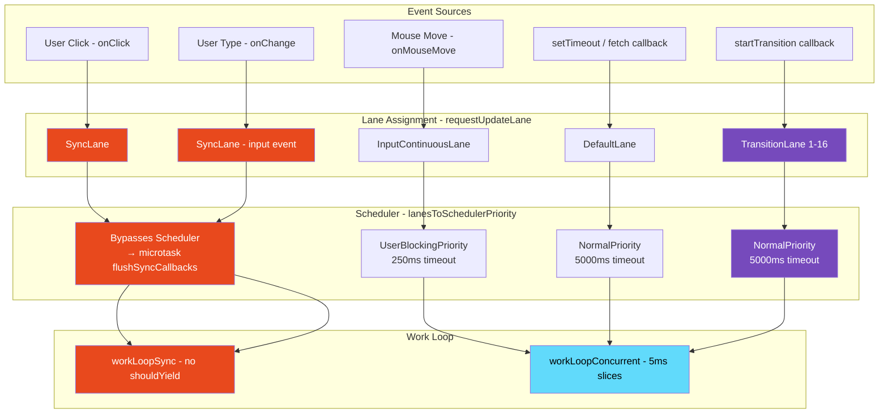
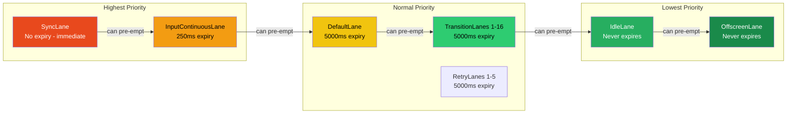

# 34 · Scheduling Priorities

> **React's scheduling system is a cooperative multitasking framework built on two layered priority systems: the Scheduler package (which assigns CPU time) and the Lane system (which assigns semantic priority to React updates). These two systems interact to determine when each update renders, whether it can be pre-empted, and how long it can wait before being forced to run. Understanding both layers and how they compose is the foundation for diagnosing performance problems, using concurrent features correctly, and reasoning about update ordering.**

Scheduling in React is not about making individual renders faster — it is about ensuring that the right renders happen at the right time. A 50ms render that blocks input is a different problem from a 50ms render that runs silently in the background. The scheduling system is what decides which category each render falls into.

---

## Table of Contents

- [The Two-Layer Scheduling System](#the-two-layer-scheduling-system)
- [Layer 1: The Scheduler Package](#layer-1-the-scheduler-package)
- [Layer 2: React's Lane System](#layer-2-reacts-lane-system)
- [Lane-to-Scheduler Priority Mapping](#lane-to-scheduler-priority-mapping)
- [How Updates Get Their Lane](#how-updates-get-their-lane)
- [Event Priority: The Input Layer](#event-priority-the-input-layer)
- [The Complete Priority Hierarchy](#the-complete-priority-hierarchy)
- [Priority Propagation Through the Tree](#priority-propagation-through-the-tree)
- [How Multiple Priorities Interact](#how-multiple-priorities-interact)
- [Starvation Prevention](#starvation-prevention)
- [The Entanglement System](#the-entanglement-system)
- [Observing Priority in Practice](#observing-priority-in-practice)
- [Scheduling in Next.js](#scheduling-in-nextjs)
- [Architecture Diagrams](#architecture-diagrams)
- [Good Practices](#good-practices)
- [Bad Practices](#bad-practices)
- [Mental Model](#mental-model)
- [Common Misconceptions](#common-misconceptions)
- [Exercises](#exercises)
- [Further Reading](#further-reading)

---

## The Two-Layer Scheduling System

React uses two distinct but related priority systems:

```
Layer 1: Scheduler Package (@react/scheduler)
  Purpose: CPU scheduling — when does work get CPU time?
  Priorities: ImmediatePriority, UserBlockingPriority, NormalPriority, LowPriority, IdlePriority
  Mechanism: Min-heap of tasks, MessageChannel-based time slicing

Layer 2: React Fiber Lanes
  Purpose: Semantic update priority — what kind of update is this?
  Priorities: 31-bit bitmask with ~20 distinct lane values
  Mechanism: Bitmask operations for O(1) set intersection, merging, comparison

These two layers are connected by:
  lanesToSchedulerPriority(): Lane → Scheduler Priority
  schedulerPriorityToLane(): Scheduler Priority → Lane
```

The Lane system is React's internal concept — it knows about the _meaning_ of updates (user input vs background data). The Scheduler knows about _CPU time_ — it doesn't care what React is doing, just how urgently it needs CPU.

---

## Layer 1: The Scheduler Package

The Scheduler package is a standalone priority queue for JavaScript tasks. It is published separately as `scheduler` on npm and could theoretically be used by any JavaScript application.

### Scheduler priority levels

```js
// From scheduler/src/SchedulerPriorities.js
export const NoPriority = 0;
export const ImmediatePriority = 1; // Highest: run synchronously
export const UserBlockingPriority = 2; // 250ms timeout before starvation
export const NormalPriority = 3; // 5000ms timeout before starvation
export const LowPriority = 4; // 10000ms timeout before starvation
export const IdlePriority = 5; // Never expires — runs only when idle
```

### Task expiry: preventing starvation

Each priority level has a **timeout** — how long a task can wait before it's promoted to run urgently:

```js
// From scheduler/src/Scheduler.js
function timeoutForPriorityLevel(priorityLevel) {
  switch (priorityLevel) {
    case ImmediatePriority:
      return IMMEDIATE_PRIORITY_TIMEOUT; // -1: already expired (run now)
    case UserBlockingPriority:
      return USER_BLOCKING_PRIORITY_TIMEOUT; // 250ms
    case IdlePriority:
      return IDLE_PRIORITY_TIMEOUT; // 1073741823 (never)
    case LowPriority:
      return LOW_PRIORITY_TIMEOUT; // 10000ms
    case NormalPriority:
    default:
      return NORMAL_PRIORITY_TIMEOUT; // 5000ms
  }
}
```

A task scheduled at `NormalPriority` gets 5 seconds before it's promoted. After 5 seconds of being repeatedly pre-empted, it runs regardless of higher-priority work arriving. This ensures no task is permanently starved.

### The Scheduler's task queue

```js
// Tasks are stored in a min-heap sorted by expiration time
// Task with the smallest expirationTime = highest priority to run now
const task = {
  id: taskIdCounter++,
  callback: performConcurrentWorkOnRoot, // what to run
  priorityLevel: NormalPriority,
  startTime: currentTime,
  expirationTime: currentTime + timeout, // when it becomes urgent
  sortIndex: -1, // set to expirationTime when in taskQueue
};

// The work loop:
function workLoop(hasTimeRemaining, initialTime) {
  let currentTime = initialTime;
  advanceTimers(currentTime); // move expired tasks from timerQueue to taskQueue

  currentTask = peek(taskQueue); // O(1): get highest priority task

  while (
    currentTask !== null &&
    !(enableSchedulerDebugging && isSchedulerPaused)
  ) {
    if (
      currentTask.expirationTime > currentTime &&
      (!hasTimeRemaining || shouldYieldToHost())
    ) {
      // Task hasn't expired AND either no time left OR should yield
      break;
    }

    const callback = currentTask.callback;
    if (typeof callback === "function") {
      currentTask.callback = null;
      currentPriorityLevel = currentTask.priorityLevel;

      const continuationCallback = callback(didUserCallbackTimeout);
      // callback returns: null (done) or a function (continuation)

      if (typeof continuationCallback === "function") {
        currentTask.callback = continuationCallback; // reschedule
      } else {
        pop(taskQueue); // task complete: remove from queue
      }
    } else {
      pop(taskQueue); // null callback: cancelled task
    }

    currentTask = peek(taskQueue);
  }

  if (currentTask !== null) {
    return true; // more work pending
  }
  return false; // queue empty
}
```

---

## Layer 2: React's Lane System

React's Lane system provides semantic priority — it knows why an update is happening and what the user expects from it.

### The complete lane bitmask

```js
// From ReactFiberLane.js — actual source values
export const TotalLanes = 31;

export const NoLanes:                Lanes = /*   */ 0b0000000000000000000000000000000;
export const NoLane:                  Lane = /*   */ 0b0000000000000000000000000000000;

export const SyncHydrationLane:       Lane = /*   */ 0b0000000000000000000000000000001;
export const SyncLane:                Lane = /*   */ 0b0000000000000000000000000000010;

export const InputContinuousHydrationLane:Lane=/**/ 0b0000000000000000000000000000100;
export const InputContinuousLane:     Lane = /*   */ 0b0000000000000000000000000001000;

export const DefaultHydrationLane:    Lane = /*   */ 0b0000000000000000000000000010000;
export const DefaultLane:             Lane = /*   */ 0b0000000000000000000000000100000;

export const SyncUpdateLanes: Lanes = SyncLane | InputContinuousHydrationLane | InputContinuousLane;

// Transition lanes (16 distinct lanes for 16 simultaneous transitions)
export const TransitionHydrationLane: Lane = /*   */ 0b0000000000000000000000001000000;
export const TransitionLanes:        Lanes = /*   */ 0b0000000001111111111111110000000;
export const TransitionLane1:         Lane = /*   */ 0b0000000000000000000000010000000;
// ... through TransitionLane16

// Retry lanes (for Suspense retries)
export const RetryLanes:             Lanes = /*   */ 0b0000111110000000000000000000000;
export const RetryLane1:              Lane = /*   */ 0b0000000010000000000000000000000;
// ... through RetryLane5

export const SelectiveHydrationLane: Lane = /*   */ 0b0001000000000000000000000000000;
export const IdleHydrationLane:       Lane = /*   */ 0b0010000000000000000000000000000;
export const IdleLane:                Lane = /*   */ 0b0100000000000000000000000000000;
export const OffscreenLane:           Lane = /*   */ 0b1000000000000000000000000000000;
```

### Lane operations (all O(1) bitwise)

```js
// Check if a set of lanes includes a specific lane:
function includesSomeLane(a: Lanes, b: Lanes): boolean {
  return (a & b) !== NoLanes;
}

// Check if a is a subset of b:
function isSubsetOfLanes(set: Lanes, subset: Lanes): boolean {
  return (set & subset) === subset;
}

// Merge two lane sets:
function mergeLanes(a: Lanes, b: Lanes): Lanes {
  return a | b;
}

// Remove lanes from a set:
function removeLanes(set: Lanes, subset: Lanes): Lanes {
  return set & ~subset;
}

// Get the highest priority lane from a set:
function getHighestPriorityLane(lanes: Lanes): Lane {
  return lanes & -lanes; // isolate lowest set bit (= highest priority lane)
}

// Example:
// lanes = 0b0000...00110010 (SyncLane | InputContinuousLane | DefaultLane)
// getHighestPriorityLane:
// -lanes = two's complement: 0b1111...11001110
// lanes & -lanes = 0b0000...00000010 = SyncLane ✓
```

### Why bitmasks?

React frequently needs to answer questions like:

- "Does this fiber have any pending work in these lanes?"
- "Are there any non-idle lanes pending?"
- "Is this lane a subset of the current render lanes?"

With bitmasks, each of these is a single CPU instruction (AND, OR, etc.). With a sorted array, each would be O(n) — prohibitively slow for the hot path of reconciliation.

---

## Lane-to-Scheduler Priority Mapping

When React schedules a render, it converts the pending lanes to a Scheduler priority:

```js
// From ReactFiberWorkLoop.js
function ensureRootIsScheduled(root: FiberRoot, currentTime: number) {
  const existingCallbackNode = root.callbackNode;
  const nextLanes = getNextLanes(root, root.pingedLanes | root.expiredLanes);

  if (nextLanes === NoLanes) {
    // No work to do
    if (existingCallbackNode !== null) {
      cancelCallback(existingCallbackNode);
    }
    return;
  }

  // Get the highest priority lane in the pending set
  const newCallbackPriority = getHighestPriorityLane(nextLanes);

  // Convert lane priority to Scheduler priority
  let schedulerPriorityLevel: SchedulerPriorityLevel;
  if (includesSomeLane(nextLanes, InputContinuousLane | SyncHydrationLane)) {
    schedulerPriorityLevel = UserBlockingSchedulerPriority; // 250ms timeout
  } else if (includesSomeLane(nextLanes, DefaultLane | TransitionLanes)) {
    schedulerPriorityLevel = NormalSchedulerPriority;       // 5000ms timeout
  } else if (includesSomeLane(nextLanes, IdleLane)) {
    schedulerPriorityLevel = IdleSchedulerPriority;          // never expires
  } else {
    schedulerPriorityLevel = NormalSchedulerPriority;
  }

  // SyncLane is special: doesn't go through Scheduler at all
  if (newCallbackPriority === SyncLane) {
    // Schedule synchronous render via microtask (bypasses Scheduler)
    scheduleSyncCallback(performSyncWorkOnRoot.bind(null, root));
    queueMicrotask(flushSyncCallbacks);
    return;
  }

  // Schedule through Scheduler for non-sync work
  const newCallbackNode = scheduleCallback(
    schedulerPriorityLevel,
    performConcurrentWorkOnRoot.bind(null, root),
  );
  root.callbackNode = newCallbackNode;
  root.callbackPriority = newCallbackPriority;
}
```

### The complete mapping table

| Lane                | Scheduler Priority   | Timeout         | Pre-emptable? | Work Loop          |
| ------------------- | -------------------- | --------------- | ------------- | ------------------ |
| SyncLane            | Bypasses Scheduler   | N/A (immediate) | No            | workLoopSync       |
| SyncHydrationLane   | ImmediatePriority    | -1ms            | No            | workLoopSync       |
| InputContinuousLane | UserBlockingPriority | 250ms           | Yes (by Sync) | workLoopConcurrent |
| DefaultLane         | NormalPriority       | 5000ms          | Yes           | workLoopConcurrent |
| TransitionLanes     | NormalPriority       | 5000ms          | Yes           | workLoopConcurrent |
| RetryLanes          | NormalPriority       | 5000ms          | Yes           | workLoopConcurrent |
| IdleLane            | IdlePriority         | Never           | Yes           | workLoopConcurrent |
| OffscreenLane       | IdlePriority         | Never           | Yes           | workLoopConcurrent |

---

## How Updates Get Their Lane

When `setState` is called, `requestUpdateLane` determines which lane the update gets:

```js
function requestUpdateLane(fiber: Fiber): Lane {
  // Check 1: Are we in a batched sync context?
  const mode = fiber.mode;
  if ((mode & ConcurrentMode) === NoMode) {
    // Legacy mode: always SyncLane
    return SyncLane;
  }

  // Check 2: Are we inside a transition?
  const isTransition = requestCurrentTransition() !== NoTransition;
  if (isTransition) {
    // Inside startTransition callback
    const actionScopeLane = peekEntangledActionLane();
    return actionScopeLane !== NoLane
      ? actionScopeLane
      : requestTransitionLane(); // returns one of TransitionLane1-16
  }

  // Check 3: Are we inside an event handler?
  const updateLane: Lane = getCurrentUpdatePriority();
  if (updateLane !== NoLane) {
    return updateLane;
    // Set by React's event system:
    // onClick → SyncLane
    // onMouseMove → InputContinuousLane
    // etc.
  }

  // Check 4: What is the current event priority?
  const eventLane: Lane = getCurrentEventPriority();
  return eventLane;
  // Fallback based on the current event type
}
```

---

## Event Priority: The Input Layer

React's event system assigns priorities to events before they ever reach your event handlers. This is done in `ReactDOMEventListener.js`:

```js
// From ReactDOMEventListener.js
function getEventPriority(domEventName: DOMEventName): EventPriority {
  switch (domEventName) {
    // Discrete events: user expects immediate response
    case 'cancel':
    case 'click':
    case 'close':
    case 'contextmenu':
    case 'copy':
    case 'cut':
    case 'auxclick':
    case 'dblclick':
    case 'dragend':
    case 'dragstart':
    case 'drop':
    case 'focusin':
    case 'focusout':
    case 'input':
    case 'invalid':
    case 'keydown':
    case 'keypress':
    case 'keyup':
    case 'mousedown':
    case 'mouseup':
    case 'paste':
    case 'pause':
    case 'play':
    case 'pointercancel':
    case 'pointerdown':
    case 'pointerup':
    case 'ratechange':
    case 'reset':
    case 'resize':
    case 'seeked':
    case 'submit':
    case 'touchcancel':
    case 'touchend':
    case 'touchstart':
    case 'volumechange':
      return DiscreteEventPriority; // → SyncLane

    // Continuous events: user expects smooth response
    case 'drag':
    case 'dragenter':
    case 'dragexit':
    case 'dragleave':
    case 'dragover':
    case 'mousemove':
    case 'mouseout':
    case 'mouseover':
    case 'pointermove':
    case 'pointerout':
    case 'pointerover':
    case 'scroll':
    case 'toggle':
    case 'touchmove':
    case 'wheel':
      return ContinuousEventPriority; // → InputContinuousLane

    default:
      return DefaultEventPriority; // → DefaultLane
  }
}
```

### How event priority flows to setState

```
User clicks a button (click event fires)
  ↓
React's root listener (event delegation) fires
  ↓
setCurrentUpdatePriority(DiscreteEventPriority)
  // Sets a global that requestUpdateLane reads
  ↓
Your onClick handler runs
  ↓
setState(newValue) called inside onClick
  ↓
requestUpdateLane: sees DiscreteEventPriority → assigns SyncLane
  ↓
Update enqueued with SyncLane
  ↓
After event handler: flushSyncCallbacks()
  → Synchronous render (workLoopSync, no shouldYield)
  ↓
Commit: user sees result immediately
```

---

## The Complete Priority Hierarchy

From highest to lowest priority:

```
Priority Level    Lane                  Renders              Expected UX
─────────────────────────────────────────────────────────────────────────
Synchronous       SyncLane              Immediately           Instant (<16ms)
                  SyncHydrationLane     Immediately           Instant

High              InputContinuousLane   250ms timeout         Smooth (hover, scroll)

Normal            DefaultLane           5000ms timeout        Perceptible but acceptable
                  TransitionLanes       5000ms timeout        Background (transition visual)
                  RetryLanes            5000ms timeout        After Suspense resolves

Low               IdleLane              Never expires         Visible when idle

Offscreen         OffscreenLane         Never expires         Hidden content prep
─────────────────────────────────────────────────────────────────────────
```

### Priority in everyday React usage

```tsx
function UserDashboard() {
  const [notification, setNotification] = useState(null); // DefaultLane when from API
  const [searchQuery, setSearchQuery] = useState(""); // SyncLane (input event)
  const [sortOrder, setSortOrder] = useState("asc"); // SyncLane (click event)

  // From an interval (not an event → DefaultLane):
  useEffect(() => {
    const id = setInterval(() => {
      fetchNotification().then((n) => setNotification(n)); // DefaultLane
    }, 30000);
    return () => clearInterval(id);
  }, []);

  // From startTransition → TransitionLane:
  const [results, setResults] = useState([]);
  const [isPending, startTransition] = useTransition();
  const handleSearch = (q: string) => {
    setSearchQuery(q); // SyncLane (input)
    startTransition(() => {
      setResults(compute(q)); // TransitionLane
    });
  };
}
```

---

## Priority Propagation Through the Tree

When a fiber receives an update at a specific lane, that lane propagates upward through the tree so React knows where to look for pending work:

```js
function markUpdateLaneFromFiberToRoot(sourceFiber: Fiber, lane: Lane): FiberRoot | null {
  // Mark the source fiber itself
  sourceFiber.lanes = mergeLanes(sourceFiber.lanes, lane);
  let alternate = sourceFiber.alternate;
  if (alternate !== null) {
    alternate.lanes = mergeLanes(alternate.lanes, lane);
  }

  // Walk up to root, marking childLanes on each ancestor
  let node = sourceFiber.return;
  let root = null;

  while (node !== null) {
    node.childLanes = mergeLanes(node.childLanes, lane);
    alternate = node.alternate;
    if (alternate !== null) {
      alternate.childLanes = mergeLanes(alternate.childLanes, lane);
    }

    if (node.tag === HostRoot) {
      root = node.stateNode; // FiberRoot
      break;
    }

    node = node.return;
  }

  return root;
}
```

This propagation enables the work loop's bailout optimization: a fiber with `childLanes = NoLanes` has no descendants with pending work — the entire subtree can be skipped.

---

## How Multiple Priorities Interact

When multiple updates at different priorities are pending simultaneously, React must decide what to render:

### Scenario 1: High-priority interrupts low-priority

```
TransitionLane render in progress (fiber 100/500)

User clicks a button → SyncLane update arrives
  ensureRootIsScheduled:
    newCallbackPriority = SyncLane (higher than TransitionLane)
    existingCallbackPriority = NormalPriority (TransitionLane)
    → Since SyncLane > existing: cancel TransitionLane callback
    → Schedule SyncLane work (microtask: flushSyncCallbacks)

SyncLane render runs synchronously:
  workLoopSync (no shouldYield)
  Commits SyncLane result

TransitionLane render RESTARTS:
  prepareFreshStack: new WIP tree from current (includes SyncLane result)
  renderLanes = TransitionLane
  workLoopConcurrent runs
```

### Scenario 2: Same priority — batched

```
User moves mouse (InputContinuousLane) → setState A
User moves mouse again → setState B

Both at InputContinuousLane:
  root.pendingLanes: InputContinuousLane (with both updates queued)
  ensureRootIsScheduled: same callback node (already scheduled)
  → No cancellation, no new scheduling
  → Existing render will process BOTH updates
```

### Scenario 3: Lower priority forced by expiry

```
TransitionLane render being repeatedly pre-empted for 5000ms

Scheduler: NormalPriority timeout expires
  task.expirationTime <= currentTime
  → Task is "overdue"
  → workLoop: isTaskTimeoutExpired = true
  → Even if shouldYield() = true: don't yield (task must run)
  → TransitionLane render runs without interruption until complete
```

---

## Starvation Prevention

React's Scheduler prevents starvation through the expiry system. But React also has its own starvation prevention:

### Expired lanes are promoted

```js
function getNextLanes(root: FiberRoot, wipLanes: Lanes): Lanes {
  const pendingLanes = root.pendingLanes;
  if (pendingLanes === NoLanes) return NoLanes;

  let nextLanes = NoLanes;

  // Check for expired lanes — these MUST run first
  const expiredLanes = root.expiredLanes;
  if (expiredLanes !== NoLanes) {
    // Expired lanes are included regardless of other priorities
    nextLanes = expiredLanes;
    return nextLanes;
  }

  // Non-idle pending work
  const nonIdlePendingLanes = pendingLanes & NonIdleLanes;
  if (nonIdlePendingLanes !== NoLanes) {
    // Prioritize SyncLane and hydration lanes
    const nonIdleUnblockedLanes = nonIdlePendingLanes & ~suspendedLanes;
    if (nonIdleUnblockedLanes !== NoLanes) {
      nextLanes = getHighestPriorityLanes(nonIdleUnblockedLanes);
    } else {
      // All non-idle lanes are suspended: check pinged lanes
      const nonIdlePingedLanes = nonIdlePendingLanes & root.pingedLanes;
      if (nonIdlePingedLanes !== NoLanes) {
        nextLanes = getHighestPriorityLanes(nonIdlePingedLanes);
      }
    }
  }

  return nextLanes;
}

// Lanes expire in markStarvedLanesAsExpired:
function markStarvedLanesAsExpired(root: FiberRoot, currentTime: number) {
  const pendingLanes = root.pendingLanes;
  const expirationTimes = root.expirationTimes;

  let lanes = pendingLanes;
  while (lanes > 0) {
    const index = pickArbitraryLaneIndex(lanes);
    const lane = 1 << index;

    const expirationTime = expirationTimes[index];
    if (expirationTime === NoTimestamp) {
      // Not yet assigned an expiry: assign one
      expirationTimes[index] = computeExpirationTime(lane, currentTime);
    } else if (expirationTime <= currentTime) {
      // EXPIRED: add to expiredLanes
      root.expiredLanes |= lane;
    }

    lanes &= ~lane;
  }
}
```

### Expiry times per lane

```js
function computeExpirationTime(lane: Lane, currentTime: number): number {
  switch (lane) {
    case SyncHydrationLane:
    case SyncLane:
    case InputContinuousHydrationLane:
    case InputContinuousLane:
      // These are high priority — expire immediately if not already run
      return currentTime + 250;
    case DefaultHydrationLane:
    case DefaultLane:
    case TransitionHydrationLane:
    case TransitionLane1:
    // ... through TransitionLane16:
      return currentTime + 5000; // 5 seconds
    case RetryLane1:
    // ... through RetryLane5:
      return currentTime + 5000;
    case SelectiveHydrationLane:
    case IdleHydrationLane:
    case IdleLane:
    case OffscreenLane:
      return NoTimestamp; // never expires
    default:
      return NoTimestamp;
  }
}
```

---

## The Entanglement System

Sometimes React must ensure that multiple lanes commit together — even if they have different priorities. The entanglement system handles this:

```js
// When two updates must commit together (e.g., Suspense retry + transition):
function markRootEntangled(root: FiberRoot, entangledLanes: Lanes) {
  const rootEntangledLanes = root.entangledLanes |= entangledLanes;
  const entanglements = root.entanglements;

  let lanes = rootEntangledLanes;
  while (lanes) {
    const index = pickArbitraryLaneIndex(lanes);
    const lane = 1 << index;

    if (
      (lane & entangledLanes) !== 0 ||  // this lane is being entangled
      (entanglements[index] & entangledLanes) !== 0 // or it's already entangled with them
    ) {
      entanglements[index] |= entangledLanes;
    }

    lanes &= ~lane;
  }
}
```

Entanglement prevents partial commits where some lanes commit and others don't, which could produce inconsistent UI.

Common entanglement scenarios:

- **Transition + Suspense**: if a Suspense retry needs to commit with its initiating transition
- **Multiple setState in startTransition**: all updates in one `startTransition` call are entangled
- **Server Actions**: client updates entangled with server response

---

## Observing Priority in Practice

### DevTools: identifying update priorities

```
React DevTools → Profiler → record interactions

After recording:
- Orange sections: transitions (TransitionLane)
- Gray sections: default renders (DefaultLane or SyncLane)
- The "reason" for each render shows the update type

Chrome DevTools → Performance:
- Short JavaScript tasks (5ms): React time slices (concurrent)
- Long JavaScript tasks: synchronous renders (SyncLane) or commit phases
- Tasks right after user input: SyncLane renders
- Scheduled tasks (MessageChannel): concurrent render continuations
```

### Programmatic priority inspection

```tsx
// Unstable API: inspect current priority in development
import { unstable_getCurrentPriorityLevel as getCurrentPriority } from "scheduler";
import {
  unstable_ImmediatePriority as ImmediatePriority,
  unstable_UserBlockingPriority as UserBlockingPriority,
  unstable_NormalPriority as NormalPriority,
  unstable_LowPriority as LowPriority,
  unstable_IdlePriority as IdlePriority,
} from "scheduler";

function DebugComponent() {
  useEffect(() => {
    const priority = getCurrentPriority();
    const priorityName =
      {
        [ImmediatePriority]: "Immediate",
        [UserBlockingPriority]: "UserBlocking",
        [NormalPriority]: "Normal",
        [LowPriority]: "Low",
        [IdlePriority]: "Idle",
      }[priority] ?? "Unknown";

    console.log(`Effect running at: ${priorityName} priority`);
    // Effects always run at NormalPriority (passive effects phase)
  });
}
```

---

## Scheduling in Next.js

Next.js's App Router has additional scheduling considerations on top of React's priority system:

### Server Components and scheduling

Server Components render on the server — outside React's client-side scheduler entirely. Their rendering is bounded by Node.js's event loop and network latency, not React's 5ms time slices.

### Client-side navigation and priorities

```tsx
// next/navigation: router.push uses startTransition internally
import { useRouter } from "next/navigation";

function NavLink({ href }: { href: string }) {
  const router = useRouter();
  const [isPending, startTransition] = useTransition();

  return (
    <a
      onClick={(e) => {
        e.preventDefault();
        startTransition(() => {
          router.push(href);
          // → TransitionLane: navigation render is interruptible
          // → Current page stays visible while new page loads
          // → isPending = true → show loading indicator
        });
      }}
      aria-busy={isPending}
    >
      {isPending ? "Loading..." : children}
    </a>
  );
}
```

### Streaming and priority in Next.js RSC

Next.js App Router streaming uses React's Suspense priority system:

- Shell (above first Suspense) renders at highest priority → streamed first
- Suspense boundaries resolve at RetryLane when their data is ready
- Selective hydration: user interaction with a Suspense boundary promotes it to SyncLane

---

## Architecture Diagrams

### The complete scheduling pipeline



### Lane priority hierarchy and expiry



---

## Good Practices

### ✅ Good Practice — Align update priority with user expectation

```tsx
/**
 * Good: Each state update is assigned the correct priority based on
 * what the user expects. Immediate visual feedback is SyncLane.
 * Expensive background computation is TransitionLane.
 * Analytics is DefaultLane (after user interaction context ends).
 */
function SearchInterface() {
  const [inputValue, setInputValue] = useState("");
  const [results, setResults] = useState<Result[]>([]);
  const [recentSearches, setRecentSearches] = useState<string[]>([]);
  const [isPending, startTransition] = useTransition();

  const handleInput = useCallback((e: React.ChangeEvent<HTMLInputElement>) => {
    const value = e.target.value;

    // SyncLane (onChange event): input value updates instantly
    // User expects to see their keystrokes immediately
    setInputValue(value);

    // TransitionLane: expensive search computation
    // User expects results to update, but can wait
    // This render can be pre-empted if user keeps typing
    startTransition(() => {
      setResults(searchIndex.query(value));
    });

    // DefaultLane: analytics tracking
    // Batched with other DefaultLane updates
    // Not urgent — can wait until after the urgent renders
    // Note: this actually runs in the onClick handler context (SyncLane)
    // For truly DefaultLane analytics, use setTimeout:
    setTimeout(() => {
      analytics.track("search_typed", { query: value });
    }, 0);
  }, []);

  return (
    <div>
      <input value={inputValue} onChange={handleInput} />
      {isPending && <LoadingIndicator />}
      <SearchResults results={results} isStale={isPending} />
    </div>
  );
}
```

---

## Bad Practices

### ⚠️ Bad Practice — Misusing flushSync in high-frequency contexts

```tsx
/**
 * Bad: flushSync forces SyncLane rendering — bypasses all scheduling.
 * Used in a scroll handler (fires 60+ times per second):
 * Every scroll event → synchronous render → blocks thread → jank.
 *
 * flushSync is a "stop everything and render NOW" instruction.
 * In a handler that fires 60x/second, that's 60 synchronous renders/second
 * on top of browser scroll/paint work. The thread is fully saturated.
 */
import { flushSync } from "react-dom";

function ScrollTracker() {
  const [scrollPosition, setScrollPosition] = useState(0);

  const handleScroll = (e: React.UIEvent<HTMLDivElement>) => {
    // ❌ Forces synchronous render on every scroll event
    flushSync(() => {
      setScrollPosition(e.currentTarget.scrollTop);
    });
    // Result: 60 synchronous renders/second during scroll → severe jank
    // Chrome DevTools: 60 "Long Task" entries per second of scrolling
  };

  return (
    <div onScroll={handleScroll} style={{ overflow: "auto", height: 400 }}>
      <div style={{ position: "sticky", top: 0 }}>
        Scroll: {scrollPosition}px
      </div>
      {/* content */}
    </div>
  );
}

/**
 * ✅ Correct: Let React's scheduler handle scroll at InputContinuousLane
 * Or use a ref for instant display without re-renders
 */
function ScrollTracker() {
  const [scrollPosition, setScrollPosition] = useState(0);
  const displayRef = useRef<HTMLDivElement>(null);

  const handleScroll = (e: React.UIEvent<HTMLDivElement>) => {
    const pos = e.currentTarget.scrollTop;

    // Option 1: Let React batch at InputContinuousLane (fine for most cases)
    setScrollPosition(pos);

    // Option 2: Direct DOM for 60fps critical display (no React involved)
    if (displayRef.current) {
      displayRef.current.textContent = `Scroll: ${pos}px`; // bypasses React entirely
    }
  };

  return (
    <div onScroll={handleScroll} style={{ overflow: "auto", height: 400 }}>
      <div ref={displayRef} style={{ position: "sticky", top: 0 }}>
        Scroll: {scrollPosition}px
      </div>
    </div>
  );
}
```

**Production impact:** A news site used `flushSync` in an infinite-scroll handler to ensure list items appeared immediately when new content was fetched. During scrolling, the handler fired 60+ times per second, each triggering a synchronous render. The browser spent 40ms/frame on JavaScript vs a 16.67ms budget. All animation on the page dropped to 15fps. Users reported the site as "laggy and unusable while scrolling." Removing `flushSync` (or deferring to `startTransition`) fixed scroll performance while keeping content additions responsive.

---

## Mental Model

> 💡 **The scheduling priority mental model:**
>
> React's scheduling is like an **emergency room triage system**. Patients (updates) arrive with different urgency levels. The triage nurse (Scheduler) assigns priority and puts them in the correct queue. Immediate emergencies (SyncLane / discrete input) go directly to the treatment room — they bypass the queue entirely. Urgent but not life-threatening (InputContinuousLane) get seen within 250 minutes. Non-emergency appointments (DefaultLane/TransitionLane) get seen within 5 hours. Elective procedures (IdleLane) get done when there are no other patients. If a non-emergency patient has been waiting for 5 hours (expiry), they get promoted to urgent status. The key insight: arriving first doesn't guarantee being seen first — urgency does. Your role as a developer: correctly triage your updates (use the right API for the right type of interaction) so the ER (scheduler) can route them appropriately.

---

## Common Misconceptions

### "All React 18 renders use concurrent scheduling"

Discrete user event handlers (click, keypress, form submit) always trigger SyncLane renders — synchronous and uninterruptible — even in React 18 with `createRoot`. Concurrent scheduling applies to `startTransition`, `useDeferredValue`, and renders at DefaultLane or lower.

### "Higher Scheduler priority = faster render"

Higher priority means the render happens _sooner_ and is less likely to be pre-empted. The render itself takes the same time regardless of priority. ImmediatePriority doesn't make your components faster — it just ensures they run before lower-priority work.

### "TransitionLane and DefaultLane have different Scheduler priorities"

Both TransitionLane and DefaultLane map to `NormalPriority` in the Scheduler (5000ms timeout). The difference is conceptual: DefaultLane comes from user actions (without startTransition), TransitionLane from explicit `startTransition`. React uses the lane distinction for pre-emption logic and stale-UI detection, not for Scheduler differentiation.

### "flushSync makes renders faster"

`flushSync` makes renders happen _right now_ — it bypasses scheduling entirely. This can make the render appear to the user sooner, but it blocks the JavaScript thread synchronously, which can cause jank if called in hot paths (scroll, mousemove).

### "The Lane system and Scheduler are the same thing"

They are two separate systems that work together. The Lane system carries semantic meaning about updates (what kind of update is this?). The Scheduler carries CPU allocation meaning (when does this task run?). They are connected by `lanesToSchedulerPriority` conversion functions.

---

## Exercises

### Exercise 1 — Observe priority assignment

```tsx
// Build this component and observe when each setState fires
function PriorityObserver() {
  const [syncState, setSyncState] = useState(0);
  const [continuousState, setContinuousState] = useState(0);
  const [transitionState, setTransitionState] = useState(0);

  const [, startTransition] = useTransition();

  // onClick → SyncLane
  const handleClick = () => setSyncState((s) => s + 1);

  // onMouseMove → InputContinuousLane
  const handleMouseMove = () => setContinuousState((s) => s + 1);

  // startTransition → TransitionLane
  const handleTransition = () =>
    startTransition(() => setTransitionState((s) => s + 1));

  return (
    <div onClick={handleClick} onMouseMove={handleMouseMove}>
      <p>Click count: {syncState}</p>
      <p>Mouse move count: {continuousState}</p>
      <p>Transition count: {transitionState}</p>
      <button onClick={handleTransition}>Trigger Transition</button>
    </div>
  );
}
```

Profile in Chrome DevTools. Identify: which updates produce short tasks (concurrent), which produce long tasks (synchronous). Which tasks appear immediately, which are delayed?

### Exercise 2 — Measure starvation prevention

```tsx
// Build: constantly trigger high-priority updates while a transition is pending
// Observe: does the transition ever commit? When?

function StarvationTest() {
  const [highPriCount, setHighPriCount] = useState(0);
  const [transitionState, setTransitionState] = useState(0);
  const [isPending, startTransition] = useTransition();

  useEffect(() => {
    // Fire SyncLane updates every 100ms for 10 seconds
    const id = setInterval(() => {
      setHighPriCount((c) => c + 1);
    }, 100);

    // At the same time, start a long transition
    startTransition(() => {
      setTransitionState((s) => s + 1);
    });

    return () => clearInterval(id);
  }, []);

  return (
    <div>
      <p>High pri count: {highPriCount} (SyncLane)</p>
      <p>Transition state: {transitionState} (TransitionLane)</p>
      <p>isPending: {String(isPending)}</p>
      {/* Question: does transitionState ever update while highPriCount is changing? */}
      {/* When? (After ~5000ms starvation expiry) */}
    </div>
  );
}
```

### Exercise 3 — Lane inspection via fiber

```js
// In browser console — inspect the lanes on a fiber
const root = document.getElementById("root");
const rootKey = Object.keys(root).find((k) => k.startsWith("__reactFiber"));
const rootFiber = root[rootKey].stateNode;

// Check pending lanes on the root:
console.log("pendingLanes:", rootFiber.pendingLanes.toString(2));
// Each bit represents a different lane
// SyncLane = bit 1 (0b10)
// InputContinuousLane = bit 3 (0b1000)
// DefaultLane = bit 5 (0b100000)
// TransitionLanes start at bit 6

// Check expired lanes:
console.log("expiredLanes:", rootFiber.expiredLanes.toString(2));
// Non-zero: some lanes have been waiting too long → will run urgently
```

---

## Further Reading

- [React Source: ReactFiberLane.js](https://github.com/facebook/react/blob/main/packages/react-reconciler/src/ReactFiberLane.js) — Complete Lane system
- [React Source: ReactFiberWorkLoop.js — ensureRootIsScheduled](https://github.com/facebook/react/blob/main/packages/react-reconciler/src/ReactFiberWorkLoop.js) — Lane to Scheduler mapping
- [React Source: ReactDOMEventListener.js — getEventPriority](https://github.com/facebook/react/blob/main/packages/react-dom-bindings/src/events/ReactDOMEventListener.js) — Event priority assignment
- [React Source: scheduler/src/Scheduler.js](https://github.com/facebook/react/blob/main/packages/scheduler/src/forks/Scheduler.js) — Scheduler implementation
- [React 18 Working Group: Priority](https://github.com/reactwg/react-18/discussions/27) — Priority design discussion
- Next in this handbook: [35 · React Compiler Architecture](../react-compiler/01-compiler.md)

---

_Part of the [React + Next.js Engineering Handbook](../../README.md)_
