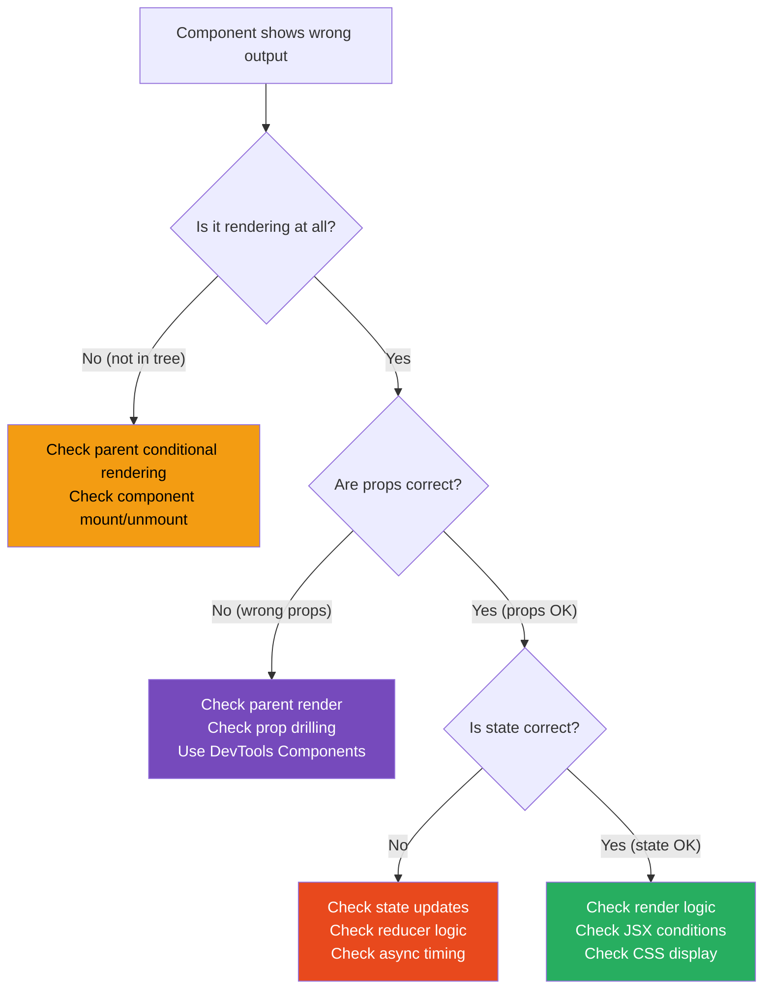

# 112 · Debugging React Applications

> **Debugging React applications requires a systematic approach to a non-deterministic problem space: components render based on state and props that change asynchronously, effects fire at lifecycle moments that aren't always intuitive, and the virtual DOM creates an abstraction layer between your code and what the browser actually does. Random insertion of console.log statements is a debugging strategy that works by luck — a mental model of React's execution, combined with the right debugging tools applied to the right question, is what consistently resolves issues quickly. This document covers the systematic debugging approach for the most common React bug categories: unexpected re-renders, stale closures, useEffect timing, and component state issues.**

Effective React debugging has two phases: forming a precise hypothesis about what's wrong (which requires understanding React's execution model), and confirming or refuting that hypothesis using the right tool (React DevTools Profiler, the debugger, strategic console output). Engineers who debug slowly are usually stuck in an undifferentiated "add more console.logs" loop rather than forming and testing specific hypotheses about the failure mode.

---

## Table of Contents

- [The Debugging Mental Model](#the-debugging-mental-model)
- [React DevTools: The Essential Tool](#react-devtools-the-essential-tool)
- [The Profiler: Debugging Re-renders](#the-profiler-debugging-re-renders)
- [Why Did This Re-render? Methodology](#why-did-this-re-render-methodology)
- [why-did-you-render: Automated Re-render Detection](#why-did-you-render-automated-re-render-detection)
- [Debugging useEffect: The Common Failure Modes](#debugging-useeffect-the-common-failure-modes)
- [Debugging Stale Closures](#debugging-stale-closures)
- [Debugging useReducer and Complex State](#debugging-usereducer-and-complex-state)
- [The React DevTools Debugger Integration](#the-react-devtools-debugger-integration)
- [Error Boundaries as Debug Signals](#error-boundaries-as-debug-signals)
- [Debugging Hydration Errors](#debugging-hydration-errors)
- [Strategic console.log Patterns](#strategic-consolelog-patterns)
- [Architecture Diagrams](#architecture-diagrams)
- [Good Practices](#good-practices)
- [Bad Practices](#bad-practices)
- [Mental Model](#mental-model)
- [Common Misconceptions](#common-misconceptions)
- [Exercises](#exercises)
- [Further Reading](#further-reading)

---

## The Debugging Mental Model

```
BEFORE ADDING A CONSOLE.LOG, ANSWER THESE QUESTIONS:

1. WHAT IS THE SYMPTOM?
   Be specific: "The cart count shows 0 after adding an item"
   Not: "The cart is broken"

2. WHAT SHOULD HAPPEN?
   Articulate the expected behavior and the state it requires:
   "After addToCart() is called, cart.items should have length 1,
    and CartIcon should re-render showing '1'"

3. WHERE DOES THE ACTUAL DIVERGE FROM EXPECTED?
   At what layer? At the state update? At the render? At the display?
   "The state IS updated (I can see it in DevTools), but CartIcon
    doesn't re-render to show the new count"

4. WHAT IS YOUR HYPOTHESIS?
   "CartIcon must be receiving the cart count as a prop (not reading
    from state directly), and the prop isn't being updated"

5. HOW DO YOU CONFIRM OR REFUTE THE HYPOTHESIS?
   "Check CartIcon's props in React DevTools — if the count prop
    is still 0 while state shows 1, the hypothesis is correct"

THIS APPROACH:
  Forms a TESTABLE HYPOTHESIS before looking at code
  Points you to the SPECIFIC TOOL needed to confirm
  Avoids the "add logs everywhere" trap
  Usually resolves bugs in 1-3 iterations instead of 10+
```

---

## React DevTools: The Essential Tool

```
INSTALLATION:
  Chrome: Chrome Web Store → "React Developer Tools"
  Firefox: Firefox Add-ons → "React Developer Tools"
  Edge: Edge Add-ons → "React Developer Tools"

TWO MAIN PANELS:

COMPONENTS PANEL:
  Shows the React component tree (not the DOM tree)
  Select any component to see:
  - Current props (values shown, not references)
  - Current state (each useState value labeled)
  - Current hooks (useRef values, useContext, custom hooks)
  - The component's rendered location (source map link)

  DEBUGGING USE:
  "Is this component receiving the right props?" → check in Components
  "What is the current state of this component?" → check in Components
  "Is this component even mounted?" → if it's not in the tree, it didn't render

PROFILER PANEL:
  Records component render timings
  Shows WHICH components rendered and WHY (prop/state/context change)
  Shows HOW LONG each render took

  DEBUGGING USE:
  "Why is this component re-rendering?" → Profiler
  "Which component is causing performance problems?" → Profiler
  (See dedicated Profiler section below)

SETTINGS WORTH KNOWING:
  ⚙️ → Highlight updates when components render
  → Adds a color flash to components when they re-render (visible in the app itself)
  → EXCELLENT for spotting unexpected re-renders visually
```

---

## The Profiler: Debugging Re-renders

```
PROFILER WORKFLOW FOR RE-RENDER DEBUGGING:

1. Open React DevTools → Profiler tab
2. Click "Start profiling" (the ● record button)
3. Perform the action that triggers the suspected unnecessary re-render
4. Click "Stop profiling"
5. Examine the flame chart

READING THE FLAME CHART:
  Vertical bars: each bar = one commit (one batch of re-renders)
  Height: doesn't mean much (nested component tree)
  Color:
    Gray: the component did NOT render in this commit
    Yellow: the component rendered (and was slower — yellow = worth investigating)
    Green: the component rendered (fast)

  Click any colored bar → see WHY it rendered (in the "Why did this render?" panel):
    "Props changed" + list of which props changed → prop drilling issue
    "State changed" → state update triggered this
    "Hooks changed" → a hook's subscribed value changed
    "Context changed" → the component reads a context that was updated
    "The parent component rendered" → parent re-render cascaded down
    "This is the first time the component rendered" → initial mount

EXAMPLE DIAGNOSIS:
  User reports "typing in the search box is laggy."
  Profiler recording: typing in the search box triggers 150 components
  to re-render on EVERY KEYSTROKE.
  Click on one of those 150 components:
    "Why did it render? → Parent component rendered"
  Click on its parent:
    "Why did it render? → Props changed → {items: Array}"
  The parent is re-creating the `items` array on every render (new reference
  even though the data is the same). Fix: useMemo for the items array.
```

---

## Why Did This Re-render? Methodology

```tsx
// SCENARIO: clicking a "Filter" button re-renders the entire product grid
// even though the filtered products haven't changed.

// STEP 1: Identify the re-rendering component in the Profiler
// Profiler shows ProductGrid renders on filter button click.
// "Why did this render? → Props changed → {products: Array}"

// STEP 2: Examine the prop at the parent:
function ProductCatalog({ allProducts }: { allProducts: Product[] }) {
  const [filter, setFilter] = useState("all");

  // ❌ This creates a NEW array reference on EVERY render:
  const filteredProducts = allProducts.filter((p) =>
    filter === "all" ? true : p.category === filter,
  );

  return <ProductGrid products={filteredProducts} />;
  // ProductGrid re-renders on every FilterButton click
  // because filteredProducts is a new array reference each time,
  // even if the filter didn't change the actual items.
}

// STEP 3: Confirm the hypothesis:
// Add a log in ProductGrid's render: console.log('ProductGrid rendering', products.length)
// Click the filter → it logs even when the filter results in the same products.
// Hypothesis CONFIRMED: new array reference on every parent render.

// STEP 4: Fix and verify:
function ProductCatalog({ allProducts }: { allProducts: Product[] }) {
  const [filter, setFilter] = useState("all");

  // ✅ useMemo: only recompute when filter or allProducts changes
  const filteredProducts = useMemo(
    () =>
      allProducts.filter((p) =>
        filter === "all" ? true : p.category === filter,
      ),
    [allProducts, filter],
  );

  return <ProductGrid products={filteredProducts} />;
}
// + wrap ProductGrid with React.memo() so it only re-renders
// when its props actually change (reference equality).
```

---

## why-did-you-render: Automated Re-render Detection

```bash
npm install -D @welldone-software/why-did-you-render
```

```ts
// src/wdyr.ts — import at the very beginning of your app (dev only)
// (not in production — it adds overhead)
if (process.env.NODE_ENV === 'development') {
  const React = require('react');
  const whyDidYouRender = require('@welldone-software/why-did-you-render');
  whyDidYouRender(React, {
    trackAllPureComponents: true,  // track all React.memo and PureComponent
    logOnDifferentValues: true,    // log even when values are "equal" but different refs
  });
}

// On a specific component:
function ExpensiveComponent({ data }: { data: Record<string, unknown> }) {
  return <div>{/* expensive render */}</div>;
}

// Add the tracking flag:
ExpensiveComponent.whyDidYouRender = true;

// Now in the console, you'll see:
// 🔴 ExpensiveComponent re-rendered:
//   props changed: { data: {prev: Object, next: Object} }
//   [Different object, same content: {foo: 1}]
//   CONSIDER using React.memo or useMemo
```

---

## Debugging useEffect: The Common Failure Modes

```tsx
// FAILURE MODE 1: Effect runs more often than expected
// SYMPTOM: A fetch is called on every render instead of once

function ProductDetail({ productId }: { productId: string }) {
  const [options, setOptions] = useState({
    includeReviews: true,
    sortOrder: "desc",
  });

  useEffect(() => {
    fetchProduct(productId, options); // called on every render!
  }, [productId, options]); // ❌ options is a new object reference every render

  // ...
}

// DIAGNOSIS: The dependency `options` is an object defined in the component body.
// Every render creates a new `options` object (new reference), so the
// dependency array always sees a "changed" value, triggering the effect every render.

// FIX OPTIONS:
// Option A: List the primitive dependencies directly (not the object):
useEffect(() => {
  fetchProduct(productId, {
    includeReviews: options.includeReviews,
    sortOrder: options.sortOrder,
  });
}, [productId, options.includeReviews, options.sortOrder]); // ✅ primitives, stable references

// Option B: Move the object outside the component (if it's static):
const DEFAULT_OPTIONS = { includeReviews: true, sortOrder: "desc" }; // outside component

// FAILURE MODE 2: Effect never runs (empty deps array + reading state)
function Timer() {
  const [count, setCount] = useState(0);

  useEffect(() => {
    const interval = setInterval(() => {
      setCount(count + 1); // ❌ `count` is captured at mount (always 0)
    }, 1000);
    return () => clearInterval(interval);
  }, []); // empty deps: closes over count=0 FOREVER (stale closure)

  return <div>{count}</div>; // always increments from 0, then resets
}

// DIAGNOSIS: The empty deps array means the effect runs ONCE.
// The setInterval callback captures `count` at its value when the effect ran (0).
// This is the stale closure problem — see dedicated section below.

// FIX: Use the functional update form of setState (doesn't need to read current value):
useEffect(() => {
  const interval = setInterval(() => {
    setCount((c) => c + 1); // ✅ always increments from current value
  }, 1000);
  return () => clearInterval(interval);
}, []); // now correct — doesn't need count in deps
```

---

## Debugging Stale Closures

```tsx
// Stale closures are the most common React bug that requires a mental model
// to debug — a console.log won't tell you WHY the value is stale.

// THE MECHANISM:
function SearchComponent() {
  const [query, setQuery] = useState("");
  const [results, setResults] = useState([]);

  const debouncedSearch = useMemo(
    () =>
      debounce(async () => {
        // ❌ `query` is captured at the time useMemo runs
        // Since useMemo deps are empty [], this function ALWAYS sees query=''
        const data = await fetchResults(query);
        setResults(data);
      }, 300),
    [], // ← empty deps: function created once, `query` is always ''
  );

  return (
    <input
      value={query}
      onChange={(e) => {
        setQuery(e.target.value);
        debouncedSearch(); // this always searches for ''
      }}
    />
  );
}

// DIAGNOSING STALE CLOSURES:
// Add a log INSIDE the closed-over function, not in the component body:
const debouncedSearch = useMemo(
  () =>
    debounce(async () => {
      console.log("searching for:", query); // ← logs '' always? STALE CLOSURE
      const data = await fetchResults(query);
      setResults(data);
    }, 300),
  [],
);

// HOW TO FIX: use a ref to hold the current value:
function SearchComponent() {
  const [query, setQuery] = useState("");
  const [results, setResults] = useState([]);
  const queryRef = useRef(query); // ← ref is always current

  useEffect(() => {
    queryRef.current = query; // sync ref with state on every render
  }, [query]);

  const debouncedSearch = useMemo(
    () =>
      debounce(async () => {
        const currentQuery = queryRef.current; // ← always reads current value
        const data = await fetchResults(currentQuery);
        setResults(data);
      }, 300),
    [], // ✅ stable function, always reads current query via ref
  );
}
```

---

## Debugging useReducer and Complex State

```tsx
// Add a debugger-friendly logging middleware to your reducer:
function loggingReducer<S, A>(reducer: (state: S, action: A) => S) {
  return (state: S, action: A): S => {
    const nextState = reducer(state, action);
    console.group(`Action: ${(action as any).type}`);
    console.log("Previous state:", state);
    console.log("Action:", action);
    console.log("Next state:", nextState);
    console.groupEnd();
    return nextState;
  };
}

// In development only:
const reducerToUse =
  process.env.NODE_ENV === "development"
    ? loggingReducer(cartReducer)
    : cartReducer;

const [state, dispatch] = useReducer(reducerToUse, initialState);

// DEBUGGING STATE TRANSITIONS:
// 1. Look at the action logged — is the action type correct?
// 2. Look at the previous state — does it match what you expected?
// 3. Look at the next state — does the reducer produce the right output?
// This immediately isolates whether the bug is in the action dispatch
// (wrong type/payload) or in the reducer logic (wrong transformation).

// REDUX DEVTOOLS INTEGRATION:
// If using Redux Toolkit or Zustand with Redux DevTools middleware:
// The Redux DevTools browser extension shows:
// - Every action dispatched with its payload
// - State before and after each action
// - Time-travel: replay state to any previous point
// This is even more powerful than the logging middleware approach above.
```

---

## The React DevTools Debugger Integration

```ts
// React DevTools integrates with the browser's debugger (Sources tab):

// BREAKPOINTS IN COMPONENT CODE:
// 1. In React DevTools Components tab: click a component
// 2. Click the "<>" (view source) icon → jumps to the component in Sources
// 3. Set a breakpoint → it fires on the next render of that component
// 4. The debugger pauses with access to all local variables including
//    state and props at that exact render

// CONDITIONAL BREAKPOINTS (only pause on specific conditions):
// In Chrome Sources tab:
// Right-click a line number → "Add conditional breakpoint"
// Enter condition: count > 5 || props.name === 'Alice'
// Pauses only when the condition is true — avoid infinite loops in frequent renders

// LOGPOINTS (log without modifying source code):
// Right-click a line → "Add logpoint"
// Enter expression: 'Component rendered with:', props
// Like a console.log but in the browser debugger, not your source code

// USEFUL DEBUGGER PATTERNS:
// Pause at initial render to inspect initial state:
function MyComponent(props) {
  debugger; // ← pauses here on first render, inspect props in the debugger
  const [state, setState] = useState(0);
  // ...
}

// Pause only when state has an unexpected value:
function MyComponent({ count }: { count: number }) {
  // Conditional: pause only when count is unexpectedly negative
  if (count < 0) {
    debugger;
  }
  // ...
}
```

---

## Error Boundaries as Debug Signals

```tsx
// Error boundaries catch rendering errors and can provide rich debug info:

class DebugErrorBoundary extends React.Component<
  { children: React.ReactNode; componentName: string },
  { error: Error | null; errorInfo: React.ErrorInfo | null }
> {
  state = { error: null, errorInfo: null };

  componentDidCatch(error: Error, errorInfo: React.ErrorInfo) {
    this.setState({ error, errorInfo });

    // Log to your error monitoring service:
    console.error("React Error in:", this.props.componentName, {
      error: error.message,
      stack: error.stack,
      componentStack: errorInfo.componentStack,
    });
  }

  render() {
    if (this.state.error) {
      return (
        <div
          style={{
            padding: 20,
            border: "2px solid red",
            fontFamily: "monospace",
          }}
        >
          <h3>Error in {this.props.componentName}</h3>
          <p>{this.state.error.message}</p>
          {process.env.NODE_ENV === "development" && (
            <details>
              <summary>Component Stack</summary>
              <pre>{this.state.errorInfo?.componentStack}</pre>
            </details>
          )}
        </div>
      );
    }
    return this.props.children;
  }
}

// THE COMPONENT STACK is the key debugging information:
// It shows EXACTLY which component in the tree threw the error:
// at Button (Button.tsx:23)
// at ProductCard (ProductCard.tsx:45)
// at ProductGrid (ProductGrid.tsx:12)
// at Page (page.tsx:8)
// → The error is in Button at line 23, inside a ProductCard, inside ProductGrid.
```

---

## Debugging Hydration Errors

```tsx
// "Text content did not match" or "Expected server HTML to contain a matching element"
// These are React's hydration mismatch warnings/errors.

// COMMON CAUSES AND FIXES:

// CAUSE 1: Date/time formatting differences between server and client
// ❌ Server renders "2024" (UTC), client renders "2025" (local timezone)
function Date({ timestamp }: { timestamp: number }) {
  return <span>{new Date(timestamp).getFullYear()}</span>; // different on server vs client!
}

// FIX: Use suppressHydrationWarning for intentionally mismatched content:
function ClientOnlyDate({ timestamp }: { timestamp: number }) {
  const [year, setYear] = useState<number | null>(null);
  useEffect(() => {
    setYear(new Date(timestamp).getFullYear());
  }, [timestamp]);
  return <span suppressHydrationWarning>{year ?? ""}</span>;
}

// CAUSE 2: Browser extensions modifying the DOM
// Browser extensions (like Grammarly, ad blockers) inject elements into the DOM
// BEFORE React hydrates. React sees a DOM that doesn't match its virtual DOM.
// FIX: Not fixable in your app code. Document it as a known limitation.
// For testing: reproduce in an incognito window without extensions.

// CAUSE 3: Invalid HTML nesting (browser auto-corrects on parse)
// ❌ <p> contains a <div> (invalid HTML):
<p>
  <div>nested incorrectly</div>
</p>;
// Server renders this correctly; browser auto-corrects to two separate elements;
// React's hydration sees a different structure.
// FIX: Use valid HTML nesting. <p> can only contain inline elements.

// DEBUGGING TOOL: React 18 detailed hydration errors:
// React 18 logs exactly WHICH content mismatched:
// "Warning: Expected server HTML to contain a matching <span> in <div>.
//  Server: <span>Loading...</span>
//  Client: <span>Loaded</span>"
// This tells you exactly what rendered differently — trace it to the component.
```

---

## Strategic console.log Patterns

```tsx
// PATTERN 1: Trace through a rendering tree
// Which renders are expected? Which are extra?
function Parent({ children }: { children: React.ReactNode }) {
  console.log("[Parent] rendering");
  return <div>{children}</div>;
}

function Child({ value }: { value: number }) {
  console.log("[Child] rendering with value:", value);
  return <span>{value}</span>;
}

// PATTERN 2: Track state over time with labels
const [cart, setCart] = useState<CartItem[]>([]);
console.log("[Cart state]", {
  length: cart.length,
  items: cart.map((i) => i.id),
});
// More informative than: console.log(cart) (large object dumps obscure the key info)

// PATTERN 3: Effect dependency tracking
useEffect(() => {
  console.log("[Effect running] dependencies changed:", {
    userId, // log each dependency individually
    filter,
    sortOrder,
  });
  return () => {
    console.log("[Effect cleanup] running before next effect or unmount");
  };
}, [userId, filter, sortOrder]);

// PATTERN 4: Detect a component mounting/unmounting
useEffect(() => {
  console.log("[ComponentName] MOUNTED");
  return () => {
    console.log("[ComponentName] UNMOUNTED");
  };
}, []); // empty deps → fires only on mount and unmount

// PATTERN 5: Use console.trace to see the call stack
// When you don't know WHERE a function is being called from:
function setQuantity(newQty: number) {
  console.trace("setQuantity called from:"); // logs full call stack
  // ← now you can see if it's being called from an unexpected place
}

// PATTERN 6: Diff two renders' props
function ProductCard({ product }: { product: Product }) {
  const prevProduct = useRef(product);
  if (prevProduct.current !== product) {
    const changes: Record<string, [unknown, unknown]> = {};
    for (const key in product) {
      if (
        product[key as keyof Product] !==
        prevProduct.current[key as keyof Product]
      ) {
        changes[key] = [
          prevProduct.current[key as keyof Product],
          product[key as keyof Product],
        ];
      }
    }
    console.log("[ProductCard] prop changes:", changes);
  }
  prevProduct.current = product;
}
```

---

## Architecture Diagrams

### Systematic debugging decision tree



---

## Good Practices

### ✅ Good Practice — Systematic re-render debugging with the Profiler

```tsx
/**
 * Good: A structured approach to diagnosing and fixing an unexpected
 * re-render, using React DevTools Profiler + React.memo + useCallback.
 */

// STEP 1: Identify with Profiler → ProductList re-renders on every parent render
// Profiler: "Why did it render? Parent component rendered"

// STEP 2: Look at what changed in the parent:
function App() {
  const [searchQuery, setSearchQuery] = useState("");
  const [cart, setCart] = useState<CartItem[]>([]);

  // Problem: this function is recreated on every App render,
  // so ProductList sees a new `onAddToCart` reference every render.
  const handleAddToCart = (productId: string) => {
    setCart((prev) => [...prev, { productId, quantity: 1 }]);
  };

  return (
    <>
      <SearchBar query={searchQuery} onChange={setSearchQuery} />
      {/* Typing in SearchBar updates App's state, re-renders App,
          creates new handleAddToCart, re-renders ProductList */}
      <ProductList onAddToCart={handleAddToCart} />
    </>
  );
}

// STEP 3: Fix — memoize the callback + wrap ProductList:
function App() {
  const [searchQuery, setSearchQuery] = useState("");
  const [cart, setCart] = useState<CartItem[]>([]);

  // Stable function reference — only changes when setCart changes (never):
  const handleAddToCart = useCallback((productId: string) => {
    setCart((prev) => [...prev, { productId, quantity: 1 }]);
  }, []); // no deps needed because setCart is stable

  return (
    <>
      <SearchBar query={searchQuery} onChange={setSearchQuery} />
      <ProductList onAddToCart={handleAddToCart} />
      {/* ProductList is now wrapped with React.memo — skips render
          when onAddToCart reference is stable */}
    </>
  );
}

const ProductList = React.memo(function ProductList({
  onAddToCart,
}: ProductListProps) {
  console.log("ProductList rendering"); // verify it's not re-rendering on search
  return <div>{/* ... */}</div>;
});
```

---

## Bad Practices

### ⚠️ Bad Practice — Console.log spam without hypothesis

```tsx
/**
 * Bad: Adding console.logs throughout the component tree without a
 * specific hypothesis about what's wrong. This creates noise that
 * obscures the actual issue and wastes debugging time.
 */

function ProductCard({ product, onAddToCart }: ProductCardProps) {
  console.log("ProductCard"); // ❌ logs on every render, no information
  console.log(product); // ❌ dumps the whole object, hard to scan

  const handleClick = () => {
    console.log("clicked"); // ❌ tells you it was clicked but nothing useful
    onAddToCart(product.id);
    console.log("after onAddToCart"); // ❌ not useful — async effects happen later
  };

  return <button onClick={handleClick}>{product.name}</button>;
}

// The developer sees 47 "ProductCard" logs, 47 object dumps, and 5 "clicked"
// logs in the console. None of this helps debug "why doesn't the cart update?"

/**
 * ✅ Fix: form a hypothesis first, then log specifically to confirm/refute it
 */

// HYPOTHESIS: "onAddToCart isn't being called" → refuted if 'clicked' appears
// HYPOTHESIS: "the product.id is wrong" → check specifically:
const handleClick = () => {
  console.log("[ProductCard] Adding to cart, productId:", product.id); // specific
  onAddToCart(product.id);
};

// HYPOTHESIS: "cart state isn't updating" → check in the store, not in this component
// → Look at the reducer/store in DevTools, not here
```

---

## Mental Model

> 💡 **The React debugging mental model:**
>
> Debugging React is like being a **detective investigating a scene**: you start with the symptom (the crime), form a hypothesis about the cause (the suspect), and then look for evidence that confirms or refutes your hypothesis (the clues). A detective who randomly searches every room for evidence finds nothing useful; a detective who thinks "the crime was committed from inside the building, so I should look for evidence of an inside job" focuses their effort and finds the evidence quickly. React's execution model — renders are pure functions of state and props, effects fire after rendering, closures capture their scope at creation time — gives you the framework for forming precise hypotheses. "The component is re-rendering unexpectedly" → "a prop or state must be changing" → "which prop or state? The Profiler will tell me." Each hypothesis narrows the search space by half, and three iterations find even the subtlest bugs.

---

## Common Misconceptions

### "React DevTools only shows components, not state"

React DevTools shows components, their current props, their current state (each `useState` value labeled by position), all hooks values (including `useRef`, `useContext`, and custom hooks), and the component's source location. It's far more useful than most developers realize — it's often possible to diagnose a bug entirely in DevTools without modifying any code.

### "console.log inside useEffect shows the state at render time"

`console.log` inside a `useEffect` shows the state CAPTURED by the closure — which is the state at the time the effect was created (determined by the dependency array). If the state has since updated, the log shows the OLD value. This is a stale closure, not a bug in your logging.

### "React StrictMode causes double-renders in production"

React StrictMode's double-invoking of component functions and effects only happens in DEVELOPMENT mode. Production builds never double-render due to StrictMode. The double-invoking is intentional — it helps detect side effects inside render functions that shouldn't be there.

### "A component re-rendering is always a performance problem"

React renders are generally fast — the virtual DOM diffing is much cheaper than actual DOM updates. A component that renders many times but produces the same output (and thus triggers no DOM updates) may not be a meaningful performance problem. The Profiler's "actual duration" shows how long the render took — only long renders (>16ms) impact the user's perceived performance.

### "If I add a console.log and the bug disappears, it must be a timing issue"

This is sometimes true, but more often the console.log changed the timing of EFFECTS (triggering re-renders through the Strict Mode double-invoke, or changing the timing of when browser work happens). The bug hasn't disappeared — it's being masked by the log statement's timing effect. Use the debugger (which pauses execution) to investigate timing-sensitive bugs.

---

## Exercises

### Exercise 1 — Profile and fix an unnecessary re-render

1. Take any React component that has a child component
2. Enable "Highlight updates when components render" in React DevTools
3. Trigger any interaction on the parent and observe which children flash
4. Use the Profiler to identify WHY the children are re-rendering
5. Fix with React.memo, useCallback, or useMemo as appropriate

### Exercise 2 — Debug a stale closure

Reproduce and fix this stale closure bug:

```tsx
function StaleCounter() {
  const [count, setCount] = useState(0);
  const printCount = useCallback(() => {
    setTimeout(() => {
      console.log("Count is:", count); // always prints 0?
    }, 3000);
  }, []);

  return (
    <div>
      <button onClick={() => setCount((c) => c + 1)}>+1</button>
      <button onClick={printCount}>Print count in 3 seconds</button>
    </div>
  );
}
```

### Exercise 3 — Diagnose a hydration mismatch

1. Create a component that renders a random number: `{Math.random()}`
2. Observe the hydration error in the console
3. Fix it using `suppressHydrationWarning` and `useEffect` for the client-side value
4. Explain why this particular component pattern causes the mismatch

---

## Further Reading

- [React DevTools documentation](https://react.dev/learn/react-developer-tools) — official guide
- [React: Profiler API](https://react.dev/reference/react/Profiler) — the Profiler component documentation
- [why-did-you-render](https://github.com/welldone-software/why-did-you-render) — automated re-render tracking
- [Kent C. Dodds: Fix the slow render before you fix the re-render](https://kentcdodds.com/blog/fix-the-slow-render-before-you-fix-the-re-render) — re-render debugging philosophy
- [React: Understanding Your UI as a Tree](https://react.dev/learn/understanding-your-ui-as-a-tree) — mental model for React component trees
- Next in this handbook: [113 · Debugging Next.js](./02-debugging-nextjs.md)

---

_Part of the [React + Next.js Engineering Handbook](../../README.md)_
