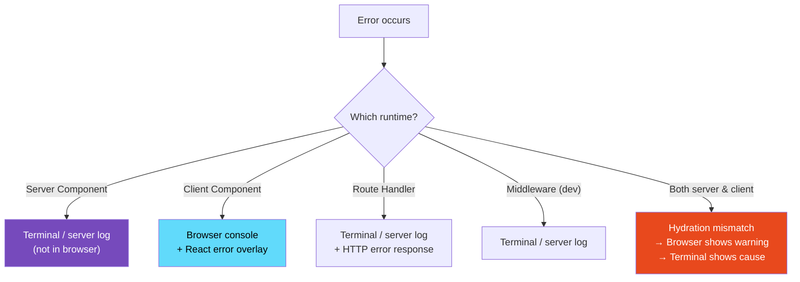

# 113 · Debugging Next.js

> **Next.js introduces debugging challenges that don't exist in a traditional React SPA: errors that occur server-side (and therefore don't appear in the browser console), caching that serves stale content despite source changes, server/client boundary violations that produce cryptic error messages, and routing behaviors that differ between development and production builds. Understanding WHERE an error originates — browser, Node.js server, Edge runtime — is the first step in any Next.js debugging session, because the right debugging tool depends entirely on the execution context.**

Next.js's power comes from its ability to run code in multiple environments (server, edge, browser) with sophisticated caching — and its debugging complexity comes from exactly the same source. This document covers the systematic approach to debugging each of the major Next.js-specific problem categories, with the exact tools and techniques for each.

---

## Table of Contents

- [Locating the Execution Context](#locating-the-execution-context)
- [Debugging Server Component Errors](#debugging-server-component-errors)
- [Server-Side Debugging with Node.js Inspector](#server-side-debugging-with-nodejs-inspector)
- [Debugging the Server/Client Boundary](#debugging-the-serverclient-boundary)
- [Debugging App Router Caching](#debugging-app-router-caching)
- [Debugging Route Handlers](#debugging-route-handlers)
- [Debugging Middleware](#debugging-middleware)
- [Debugging Next.js Build Errors](#debugging-nextjs-build-errors)
- [The .next Directory: Reading Build Output](#the-next-directory-reading-build-output)
- [Debugging next/image Issues](#debugging-nextimage-issues)
- [Debugging Environment Variables](#debugging-environment-variables)
- [Next.js Error Reference: Common Errors Decoded](#nextjs-error-reference-common-errors-decoded)
- [Architecture Diagrams](#architecture-diagrams)
- [Good Practices](#good-practices)
- [Bad Practices](#bad-practices)
- [Mental Model](#mental-model)
- [Common Misconceptions](#common-misconceptions)
- [Exercises](#exercises)
- [Further Reading](#further-reading)

---

## Locating the Execution Context

```
THE FIRST QUESTION IN ANY NEXT.JS DEBUG SESSION:
"Where is this code executing?"

BROWSER CONSOLE (F12 → Console):
  Client Components after hydration
  Browser-only APIs (window, document, localStorage)
  Error: "window is not defined" → your code ran server-side
  Error: "module 'fs' not found" → your code ran client-side

TERMINAL / SERVER CONSOLE (where you ran `next dev`):
  Server Components (async components, no 'use client')
  Route Handlers (app/api/*/route.ts)
  Middleware (middleware.ts)
  Server Actions ('use server' functions)
  Next.js framework internals (routing, caching)

NEXT.JS RUNTIME LOGS (terminal during `next dev`):
  Prefetch errors, cache invalidation logs, server-side renders
  Look for: [Server] or red error blocks in the terminal output

EDGE RUNTIME (Vercel dashboard or Vercel logs CLI):
  Middleware (when deployed to Vercel Edge)
  Route Handlers with `export const runtime = 'edge'`
  NOT in your local terminal for production deployments

QUICK IDENTIFICATION:
  Error appears in browser console → Client Component
  Error in terminal but not browser → Server Component, Action, or Route Handler
  Error in BOTH → likely a hydration mismatch (server vs client output diverges)
  Error only in production → likely an environment variable issue or build optimization
```

---

## Debugging Server Component Errors

```tsx
// Server Component errors appear in the TERMINAL, not the browser console.
// The browser shows a generic error boundary UI (or the Next.js error overlay)
// but the ACTUAL error is in your terminal.

// FINDING THE ERROR:
// 1. Look in the terminal where `next dev` is running
// 2. Look for red text or "Error:" preceded by a component name
// 3. The stack trace shows the SERVER-SIDE file location

// ADDING DEBUGGING TO SERVER COMPONENTS:
async function ProductPage({ params }: { params: { id: string } }) {
  // Server-side console.log appears in the TERMINAL, not the browser:
  console.log("[ProductPage] Fetching product:", params.id);

  const product = await db.products.findUnique({
    where: { id: params.id },
  });

  // Server-side: log what you got back
  console.log(
    "[ProductPage] Got product:",
    product?.name,
    "exists:",
    !!product,
  );

  if (!product) {
    notFound(); // triggers the not-found.tsx page
  }

  return <ProductView product={product} />;
}

// USING CONSOLE.ERROR FOR EXPECTED ERRORS:
async function fetchUserData(userId: string) {
  try {
    const user = await db.users.findUnique({ where: { id: userId } });
    return user;
  } catch (error) {
    // This appears in the terminal with full details:
    console.error("[fetchUserData] Database error for userId:", userId, error);
    // Don't throw here if you want to gracefully degrade;
    // throw if you want Next.js to show the error boundary
    return null;
  }
}

// FORCE DYNAMIC TO DEBUG CACHING:
// If your page isn't showing updated data, try:
export const dynamic = "force-dynamic";
// This disables caching for this route during debugging
// (don't leave this in production without intention)
```

---

## Server-Side Debugging with Node.js Inspector

```bash
# Start Next.js with the Node.js inspector enabled:
node --inspect node_modules/.bin/next dev
# or:
NODE_OPTIONS='--inspect' npm run dev

# Output:
# Debugger listening on ws://127.0.0.1:9229/...
# For help, see: https://nodejs.org/en/docs/inspector

# Open Chrome DevTools:
# 1. Navigate to: chrome://inspect
# 2. Under "Remote Target" you'll see your Next.js server
# 3. Click "inspect" → opens a separate DevTools window for Node.js

# THIS GIVES YOU:
# - Breakpoints in server-side code (Server Components, Route Handlers, Actions)
# - Variable inspection at breakpoints (state of all variables on the call stack)
# - Call stack for server-side errors
# - The equivalent of browser DevTools but for your Node.js server process

# SETTING BREAKPOINTS:
# In the Node.js DevTools window → Sources tab
# Navigate to your source file (or use Cmd+P to open by filename)
# Click a line number to set a breakpoint
# The next request to that code will pause execution there

# OR: add debugger statements directly in server code:
async function createOrder(data: OrderData) {
  debugger; // ← Node.js inspector will pause here
  const order = await db.orders.create({ data });
  return order;
}
```

---

## Debugging the Server/Client Boundary

```
THE SERVER/CLIENT BOUNDARY ERRORS:

ERROR: "You're importing a component that needs X. It only works in a Client Component"
  CAUSE: You imported a component that uses browser-only APIs or hooks
         into a Server Component.
  LOCATION: Browser console (it's a build/render error surfaced in the browser)

  FIX STEPS:
  1. Identify which import is causing it (the error message names the hook/API)
  2. Add 'use client' to the component that uses that hook, OR
  3. Move the browser-specific logic into a separate Client Component

ERROR: "cannot be used in a Server Component because it only works in the browser"
  Same category — hooks (useState, useEffect) inside a component without 'use client'

DEBUGGING TOOL: the error overlay in the browser shows the component tree
  and marks WHERE the boundary violation occurs. Follow the chain:
    Server Component → imports Client Component → imports another Client Component
    The 'use client' directive at the right level fixes the chain.

CHECKING WHICH COMPONENTS ARE SERVER VS CLIENT:
  React DevTools marks Server Components differently in the tree.
  In source code: look for 'use client' directive at the top of the file.
  In .next/server/ directory: only Server Components have compiled server output.

ACCIDENTAL SERVER IMPORTS IN CLIENT CODE:
  'use client';
  import { db } from '@/lib/db'; // ← db is a Prisma client — server-only!
  // This bundles Prisma into client JavaScript → build error or massive bundle

  FIX: import 'server-only' at the top of server-only modules:
  // lib/db.ts:
  import 'server-only'; // Next.js throws a build error if this is imported client-side
  import { PrismaClient } from '@prisma/client';
```

---

## Debugging App Router Caching

```
NEXT.JS APP ROUTER HAS FOUR CACHE LAYERS:
  1. Request Memoization (React's cache() — deduplicate within one render)
  2. Data Cache (fetch() cache — persists across requests and deployments)
  3. Full Route Cache (rendered HTML cache — persists across deployments)
  4. Router Cache (client-side — persists during browser session)

DEBUGGING: "MY DATA IS STALE — CHANGES AREN'T SHOWING UP"

STEP 1: Force dynamic to bypass all server caches:
  export const dynamic = 'force-dynamic'; // in the page.tsx
  If the data STILL doesn't update → the problem is in the Router Cache (client-side)
  or in your database/backend, not in Next.js caching.

STEP 2: If force-dynamic fixes it, identify WHICH cache is wrong:
  Add revalidation to your fetch:
  fetch('/api/data', { next: { revalidate: 0 } }) // no cache on this fetch
  If this fixes it → the Data Cache is holding stale data

STEP 3: Purge specific caches:
  revalidatePath('/products'); // from a Server Action or Route Handler
  revalidateTag('product-list'); // tag-based invalidation

DEBUGGING TOOL — check what Next.js thinks is cached:
  In development: Next.js logs cache behavior in the terminal:
  "Cache MISS for /api/products" → no cached data, fetching fresh
  "Cache HIT for /api/products" → returning cached data
  Enable verbose cache logging:
  // next.config.js:
  module.exports = {
    logging: {
      fetches: {
        fullUrl: true, // log the full URL being cached
      },
    },
  };

DEBUGGING THE ROUTER CACHE (client-side):
  Hard refresh (Ctrl+Shift+R) bypasses the router cache entirely.
  If hard refresh shows updated data but normal navigation doesn't →
  the problem is the client-side Router Cache.
  FIX: call router.refresh() after a mutation to invalidate client cache:
  const router = useRouter();
  const handleUpdate = async () => {
    await updateData();
    router.refresh(); // force re-fetch from server
  };
```

---

## Debugging Route Handlers

```ts
// Route Handler debugging — errors appear in the terminal:

// app/api/products/route.ts
export async function GET(request: Request) {
  // Log the full request for debugging:
  const url = new URL(request.url);
  console.log("[GET /api/products]", {
    searchParams: Object.fromEntries(url.searchParams),
    headers: Object.fromEntries(request.headers),
  });

  try {
    const products = await db.products.findMany();
    console.log("[GET /api/products] returning", products.length, "products");
    return Response.json(products);
  } catch (error) {
    // Detailed server-side error logging:
    console.error("[GET /api/products] ERROR:", {
      message: (error as Error).message,
      stack: (error as Error).stack,
    });
    // Return a clean error to the client (don't expose internals):
    return Response.json(
      { error: "Failed to fetch products" },
      { status: 500 },
    );
  }
}

// DEBUGGING TOOL: curl for direct Route Handler testing
// (bypasses browser, Next.js router, any client-side state)
// bash:
// curl -v http://localhost:3000/api/products
// curl -v -X POST http://localhost:3000/api/products \
//   -H "Content-Type: application/json" \
//   -d '{"name":"Widget","price":9.99}'

// If curl works but the browser doesn't → CORS or auth header issue
// If curl fails → Route Handler logic issue
```

---

## Debugging Middleware

```ts
// middleware.ts
import { NextResponse } from "next/server";
import type { NextRequest } from "next/server";

export function middleware(request: NextRequest) {
  // Middleware runs on the Edge runtime — logs appear in the terminal
  // but NOT in Node.js DevTools (different runtime)
  console.log("[Middleware]", {
    method: request.method,
    pathname: request.nextUrl.pathname,
    cookies: request.cookies.getAll().map((c) => c.name), // don't log values!
  });

  // COMMON DEBUGGING: is this route matching the middleware?
  // Check your matcher config first:
  // export const config = { matcher: ['/dashboard/:path*'] }
  // If the log doesn't appear for a route → it's not matching the matcher

  const session = request.cookies.get("session")?.value;
  console.log("[Middleware] has session:", !!session);

  if (!session && request.nextUrl.pathname.startsWith("/dashboard")) {
    console.log("[Middleware] Redirecting to /login — no session");
    return NextResponse.redirect(new URL("/login", request.url));
  }

  const response = NextResponse.next();
  // Check what headers are being set:
  console.log(
    "[Middleware] Response headers set:",
    Object.fromEntries(response.headers),
  );
  return response;
}

// DEBUGGING "MIDDLEWARE IS NOT RUNNING":
// 1. Check the matcher pattern — is it matching the URL you're testing?
// 2. Check for build errors in middleware.ts (look in the terminal)
// 3. Verify middleware.ts is at the ROOT of your project (not in app/)
// 4. In production (Vercel): check the Function Log in the Vercel dashboard
//    (middleware runs on Edge — separate from server function logs)
```

---

## Debugging Next.js Build Errors

```bash
# Get maximum build error detail:
next build --debug

# Common build error categories:

# 1. TypeScript errors:
# "Type 'string' is not assignable to type 'number'"
# Fix: check your component prop types
# Run tsc --noEmit separately to see all TypeScript errors clearly

# 2. Module not found:
# "Module not found: Can't resolve '@/components/Button'"
# Fix: check path aliases in tsconfig.json match next.config.js
# Verify the file exists at the path you're importing

# 3. "use client" / "use server" boundary violations:
# These appear as build errors with component tree paths
# Follow the chain in the error message to find where the violation is

# 4. Circular imports:
# Webpack's "Maximum call stack size exceeded" during build
# or strange "Cannot read property of undefined" at build time
# Tool: madge for circular dependency detection:
npx madge --circular src/

# 5. Static generation failures:
# "Error occurred prerendering page /products/[id]"
# This means Next.js tried to statically generate the page but failed
# Check: does the page try to access request data? (headers(), cookies())
# These only work in dynamic pages, not during static generation.
# Fix: add export const dynamic = 'force-dynamic' or use generateStaticParams

# READING THE BUILD OUTPUT:
# After 'next build', the route table shows:
# ○ (Static) - fully pre-rendered at build time
# ● (SSG) - static with dynamic routes
# λ (Dynamic) - server-rendered on demand
# If a route shows λ when you expect ○ → check for dynamic usage in the route
```

---

## The .next Directory: Reading Build Output

```
.next/
  server/
    app/
      page.js          ← compiled Server Components for SSR
      (auth)/
        login/
          page.js
  static/
    chunks/
      main-*.js         ← main Next.js runtime (always loaded)
      framework-*.js    ← React + React DOM
      pages/
        index-*.js      ← page-specific JS chunks
    media/             ← processed images, fonts

DEBUGGING WITH THE .next DIRECTORY:

1. "Is my code in the client bundle?"
   Look in .next/static/chunks/ for your component's code
   Search: grep -r "MyComponent" .next/static/chunks/
   If found: it's in the client bundle
   If not found: it's server-only (as expected for Server Components)

2. "What's the compiled output of my Server Component?"
   Look in .next/server/app/ for the server-side compiled output
   This shows how Next.js compiled your code for server execution

3. "Is the caching working correctly?"
   .next/cache/ contains Next.js's fetch cache
   ls -la .next/cache/fetch-cache/ to see cached entries
   rm -rf .next/cache/ to completely clear the cache (useful for debugging)
```

---

## Debugging next/image Issues

```tsx
// next/image is a wrapper around  with optimization — common debugging:

// ISSUE 1: Image not loading (404)
// Check: is the domain in next.config.js images.domains (legacy) or images.remotePatterns?
// next.config.js:
module.exports = {
  images: {
    remotePatterns: [
      {
        protocol: "https",
        hostname: "images.example.com", // must match exactly (no wildcards here without **)
        port: "",
        pathname: "/products/**",
      },
    ],
  },
};

// ISSUE 2: Layout shift (CLS) from images
// Cause: no width/height specified OR wrong aspect ratio
// FIX: always specify width and height matching the image's intrinsic dimensions
// OR use fill + a sized container:
<div style={{ position: "relative", height: "300px" }}>
  <Image src={url} alt={alt} fill style={{ objectFit: "cover" }} />
</div>;

// ISSUE 3: "Image with src has wrong intrinsic dimensions"
// The width/height props don't match the actual image's dimensions
// Use the blur placeholder to debug — it shows the actual dimensions Next.js detected

// DEBUGGING TOOL: Network tab in DevTools
// next/image optimization requests go through /_next/image?url=...&w=...&q=...
// Check: is the image URL correctly encoded? Is the width correct?
// Is the response Content-Type 'image/webp' (optimized) or 'image/jpeg' (original)?
```

---

## Debugging Environment Variables

```ts
// COMMON ISSUES:
// 1. Variable is undefined in the browser

// DIAGNOSIS: is NEXT_PUBLIC_ prefix present?
// Without NEXT_PUBLIC_: only accessible server-side (Server Components, Route Handlers)
// With NEXT_PUBLIC_: embedded into client-side JavaScript at build time

process.env.MY_SECRET; // server-side only: ✅ works, undefined client-side
process.env.NEXT_PUBLIC_URL; // both sides: ✅ works everywhere

// DEBUGGING:
// In a Server Component:
console.log("[Server] API_KEY present:", !!process.env.API_KEY);
console.log("[Server] NODE_ENV:", process.env.NODE_ENV);

// In a Client Component (will be undefined for non-NEXT_PUBLIC_ vars):
console.log("[Client] PUBLIC_URL:", process.env.NEXT_PUBLIC_API_URL);

// 2. Variable works in development but not in production
// Check: is it in your production environment variable config?
//   Vercel: Project → Settings → Environment Variables
//   Ensure the variable is checked for "Production"
//   And that you REDEPLOYED after adding it (variables are baked in at build time)

// 3. .env file hierarchy:
// .env.local → overrides everything (gitignored — local machine only)
// .env.development → only when NODE_ENV=development
// .env.production → only when NODE_ENV=production
// .env → base values for all environments

// COMMON MISTAKE: putting secrets in .env instead of .env.local
// .env is committed to git → secrets are exposed
// .env.local is gitignored → safe for local secrets

// DEBUGGING TOOL: print all relevant env vars in a Route Handler:
export async function GET() {
  console.log("Environment check:", {
    NODE_ENV: process.env.NODE_ENV,
    DATABASE_URL_SET: !!process.env.DATABASE_URL,
    // Never log the actual values of secrets!
  });
  return Response.json({ ok: true });
}
```

---

## Next.js Error Reference: Common Errors Decoded

```
ERROR: "Attempted to call X() from the server, but X is on the client side"
  CAUSE: A 'use client' function is being called directly from a Server Component
  FIX: Pass the function as a prop to a Client Component, or use a Server Action

ERROR: "Error: No router instance found. You should only use 'next/router'
  inside components that are not Server Components."
  CAUSE: useRouter() from next/navigation in a Server Component
  FIX: Move to a Client Component (add 'use client'), or remove useRouter

ERROR: "Dynamic server usage: cookies / headers"
  CAUSE: cookies() or headers() called in a statically-generated page
  FIX: Add export const dynamic = 'force-dynamic' to the route, or
       move the cookies/headers call into a Server Action or Route Handler

ERROR: "Error: Unsupported Server Component type: undefined"
  CAUSE: A component is imported that doesn't exist or exports undefined
  FIX: Check the import path and the component's export. Often a missing
       export default or wrong file extension.

ERROR: "Unhandled Runtime Error: Cannot read property 'map' of undefined"
  In a Server Component: check the terminal for the actual error details
  In a Client Component: check the browser console + React DevTools
  COMMON CAUSE: data-fetching async function returns undefined when you
                expected an array — add null checks

ERROR: "Error: You cannot use useX in a server component"
  (where X is any React hook: useState, useEffect, useRef, etc.)
  CAUSE: Hook used in a Server Component
  FIX: Add 'use client' to the component, or split into Client/Server parts

ERROR: NEXT_NOT_FOUND_ERROR
  This is expected — thrown by notFound() in Server Components
  If you see this in a Route Handler: add a proper null check before calling notFound()
  If you see this unexpectedly: your page's data fetching returned nothing
  and you have an unintended notFound() call
```

---

## Architecture Diagrams

### Where errors appear by execution context



---

## Good Practices

### ✅ Good Practice — Structured server-side logging for easy debugging

```ts
/**
 * Good: A consistent, structured logging pattern for server-side Next.js code.
 * Includes context (what operation, what identifiers), avoids logging secrets,
 * and distinguishes between expected operational states and unexpected errors.
 */

// lib/logger.ts — thin wrapper around console for consistent formatting
const logger = {
  info: (context: string, data: Record<string, unknown>) => {
    console.log(`[${context}]`, JSON.stringify(data));
  },
  error: (context: string, error: unknown, data?: Record<string, unknown>) => {
    const err = error instanceof Error ? error : new Error(String(error));
    console.error(`[${context}] ERROR:`, {
      message: err.message,
      // Stack only in development — don't expose in production logs:
      stack: process.env.NODE_ENV === 'development' ? err.stack : undefined,
      ...data,
    });
  },
};

// In a Server Component:
async function OrderHistory({ userId }: { userId: string }) {
  logger.info('OrderHistory', { userId, action: 'fetch-orders' });

  try {
    const orders = await db.orders.findMany({ where: { userId } });
    logger.info('OrderHistory', { userId, orderCount: orders.length });
    return <OrderList orders={orders} />;
  } catch (error) {
    logger.error('OrderHistory', error, { userId });
    return <ErrorState message="Failed to load orders" />;
  }
}
```

---

## Bad Practices

### ⚠️ Bad Practice — Logging secrets in server-side debug code

```ts
/**
 * Bad: Logging secrets, full database connection strings, or user
 * PII during debugging. Server-side logs may be stored by hosting
 * platforms, available to team members who shouldn't see specific
 * secrets, or accidentally committed to log files.
 */

// ❌ NEVER log these:
console.log("Database URL:", process.env.DATABASE_URL);
// → Logs your full database connection string including credentials
// → Any team member with log access sees your production DB password

console.log("User data:", user);
// → Logs entire user object including hashed password, payment info, PII
// → Violates privacy regulations (GDPR, CCPA) if logs are stored

console.log("API Key:", process.env.STRIPE_SECRET_KEY);
// → Exposes payment processing credentials in logs

console.log("Session token:", session);
// → Exposes authentication tokens that could be used for account takeover

/**
 * ✅ Fix: log existence, types, and truncated IDs — never values of secrets
 */
console.log("Database URL configured:", !!process.env.DATABASE_URL);
console.log("User found:", !!user, "userId:", user?.id);
console.log("API key configured:", !!process.env.STRIPE_SECRET_KEY);
console.log("Session valid:", !!session, "expires:", session?.expires);
```

---

## Mental Model

> 💡 **The Next.js debugging mental model:**
>
> Next.js is like a **building with multiple floors, each with its own communication system**: the basement (server, Node.js) communicates through its own intercom (terminal logs), the main floor (browser) communicates through the building's public address system (browser console), and the security desk (middleware) has its own dedicated line. When something goes wrong, the first question is always "which floor is this on?" — because calling the wrong department (looking in the browser console for a server-side error) means you'll find nothing. The caching system is like **an automated mail sorting room**: it has multiple incoming trays (request memoization, data cache, full route cache, router cache), and a letter stuck in the wrong tray means you'll keep getting yesterday's mail. Debugging caching means identifying WHICH tray is stuck — methodically bypassing each layer (`force-dynamic`, `revalidatePath`, `router.refresh()`) until the correct data flows through.

---

## Common Misconceptions

### "console.log works the same everywhere in Next.js"

`console.log` in a Server Component or Route Handler appears in your terminal (server stdout). `console.log` in a Client Component appears in the browser console. `console.log` during a Server Action appears in the terminal. The location where you run `console.log` determines WHERE you see the output — there's no unified console.

### "If the browser shows no error, the code is working correctly"

A Server Component can throw an error that's caught by Next.js's error boundary, displayed as a generic error page in the browser, but only logged with full details in the terminal. The browser error page says "Something went wrong" — the terminal says exactly what and where.

### "Clearing the browser cache fixes Next.js caching issues"

The browser cache and Next.js's cache are independent systems. `force-dynamic` or `revalidatePath` clears Next.js's server-side data and route caches. `router.refresh()` clears the client-side Router Cache. Clearing the browser cache only clears HTTP-level caching (which Next.js bypasses with its own cache headers). For most Next.js caching issues, browser cache clearing does nothing.

### "Next.js dev mode and production behave identically"

They differ significantly: dev mode has no caching (every request fetches fresh), no minification, React strict mode double-invokes, hot module replacement, and different bundle splitting. Production has aggressive caching, optimized builds, and differences in static vs dynamic route behavior. Always test production-mode behavior (`next build && next start`) for caching-related bugs.

### "The .next directory is internal and irrelevant to debugging"

The `.next` directory contains the compiled output of your application — it's the source of truth for what Next.js actually serves. When debugging "why is this code in the client bundle?", checking `.next/static/chunks/` directly answers the question definitively. When debugging "how did Next.js compile this Server Component?", `.next/server/` shows the exact output.

---

## Exercises

### Exercise 1 — Debug a caching issue

Create a Next.js route that fetches data and displays it. Then:

1. Add `export const dynamic = 'force-dynamic'` and verify data always refreshes
2. Remove it and configure a 60-second `revalidate` time
3. Update the data in your database and verify the page still shows old data (expected)
4. Call `revalidatePath()` from a Server Action and verify the page now shows new data
5. Trace through exactly which cache layer was holding the stale data

### Exercise 2 — Attach the Node.js inspector

1. Start Next.js with `node --inspect`
2. Open `chrome://inspect` and connect to the Node.js process
3. Add a breakpoint in a Route Handler
4. Make an HTTP request to that handler (via curl or the browser)
5. Inspect the variables available at the breakpoint

### Exercise 3 — Diagnose a server/client boundary error

Create a component that deliberately violates the server/client boundary:

1. Import `useState` in an async Server Component (no 'use client')
2. Observe and record the exact error message
3. Fix it by adding 'use client' to the right component
4. Create a second violation: import a server-only module into a Client Component
5. Use the `server-only` package to make the import fail with a clear error at build time

---

## Further Reading

- [Next.js docs: Debugging](https://nextjs.org/docs/app/building-your-application/configuring/debugging) — official Node.js inspector setup
- [Next.js docs: Error Handling](https://nextjs.org/docs/app/building-your-application/routing/error-handling) — error.tsx, global-error.tsx
- [Next.js docs: Caching](https://nextjs.org/docs/app/building-your-application/caching) — the four-layer cache explained
- [Vercel: Function Logs](https://vercel.com/docs/deployments/logs) — accessing server logs in production
- Related in this handbook: [112 · Debugging React](./01-debugging-react.md), [Part XII Caching Systems](../caching/01-request-memoization.md)
- Next in this handbook: [114 · Error Boundaries & Monitoring](./03-error-boundaries-monitoring.md)

---

_Part of the [React + Next.js Engineering Handbook](../../README.md)_
