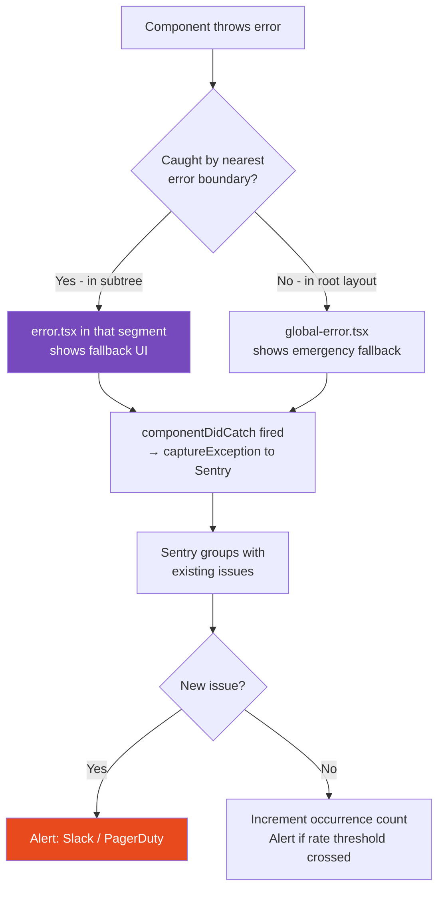

# 114 · Error Boundaries & Monitoring

> **Error boundaries are React's mechanism for catching rendering errors and displaying fallback UI instead of crashing the entire application. Production error monitoring is the system that ensures every unhandled error in your application — whether it occurs during rendering, in a Server Action, in a Route Handler, or in the browser — is captured, attributed, contextualized, and routed to the engineers who can fix it. Together, these two systems form the "safety net" layer of your application architecture: error boundaries determine what users SEE when things go wrong, and monitoring determines what engineers KNOW. This document covers the technical implementation of both, from the React component API to the Sentry integration patterns specific to Next.js App Router.**

The most dangerous production bugs are the ones you don't know about: a Server Component that fails for 1% of users on a specific browser, a Server Action that throws for users with unusual account states, a Route Handler that 500s for certain parameter combinations. Without monitoring, you learn about these from user complaints — days or weeks after they started. With monitoring, you learn within minutes of the first occurrence.

---

## Table of Contents

- [How Error Boundaries Work Internally](#how-error-boundaries-work-internally)
- [The Next.js Error File System](#the-nextjs-error-file-system)
- [Custom Error Boundary Implementation](#custom-error-boundary-implementation)
- [Error Boundaries with Suspense](#error-boundaries-with-suspense)
- [Server-Side Error Handling in Next.js](#server-side-error-handling-in-nextjs)
- [Production Error Monitoring: Sentry for Next.js](#production-error-monitoring-sentry-for-nextjs)
- [Sentry Source Maps for Next.js](#sentry-source-maps-for-nextjs)
- [Custom Error Context and Breadcrumbs](#custom-error-context-and-breadcrumbs)
- [Monitoring Server Actions and Route Handlers](#monitoring-server-actions-and-route-handlers)
- [Alerting and On-Call Patterns](#alerting-and-on-call-patterns)
- [Error Budgets and SLOs](#error-budgets-and-slos)
- [Architecture Diagrams](#architecture-diagrams)
- [Good Practices](#good-practices)
- [Bad Practices](#bad-practices)
- [Mental Model](#mental-model)
- [Common Misconceptions](#common-misconceptions)
- [Exercises](#exercises)
- [Further Reading](#further-reading)

---

## How Error Boundaries Work Internally

```
ERROR BOUNDARY MECHANICS:

1. A class component with componentDidCatch and/or getDerivedStateFromError
   is an "error boundary."

2. When ANY component in the subtree below an error boundary THROWS during:
   - The render phase (the function body of the component)
   - A lifecycle method
   - A constructor
   (NOT during event handlers — those are caught separately)

3. React UNWINDS the render, looking for the NEAREST error boundary ABOVE
   the throwing component in the tree.

4. React calls the boundary's getDerivedStateFromError with the error →
   the boundary updates its state to indicate an error occurred.

5. React re-renders the boundary component, which now returns its fallback UI
   instead of its normal children.

6. React calls componentDidCatch with the error AND an ErrorInfo object
   (containing componentStack — the chain of components that led to the error).

7. The error does NOT propagate further up the tree — the boundary CATCHES it.

WHAT ERROR BOUNDARIES DON'T CATCH:
  ❌ Errors in event handlers (onClick, onChange, etc.)
     → These are regular JavaScript exceptions, caught by try/catch
  ❌ Async errors (in useEffect, setTimeout, Promises)
     → Must be caught manually and reported to monitoring
  ❌ Server-side rendering errors
     → These crash the server-side render, not the client-side component tree
     → Next.js's error.tsx handles the server-side case
  ❌ Errors in the error boundary itself
     → Use global-error.tsx as the ultimate fallback
```

---

## The Next.js Error File System

```
NEXT.JS APP ROUTER ERROR HIERARCHY:

app/
  layout.tsx                ← wraps all pages
  global-error.tsx          ← OUTERMOST boundary (catches layout errors too)
  error.tsx                 ← catches errors in this route segment's children
  page.tsx
  products/
    error.tsx               ← catches only errors in the /products segment
    page.tsx
    [id]/
      error.tsx             ← catches only errors in /products/[id]
      page.tsx

error.tsx COMPONENT CONTRACT:
  'use client' — must be a Client Component (class-based error boundary)
  Receives: error: Error, reset: () => void
  Renders: the fallback UI for this segment
  reset(): re-renders the segment (retries rendering the page)

global-error.tsx:
  Wraps the ROOT layout — catches errors that error.tsx can't (root layout errors)
  Must render <html><body> itself (the layout is also broken)
  Less granular — use it as the last resort, not the primary boundary

not-found.tsx:
  Triggered by notFound() being called in a Server Component
  Separate from errors — not-found is an expected state, not an error
  Renders the 404 UI for this segment
```

---

## Custom Error Boundary Implementation

```tsx
// A reusable, production-grade error boundary:
"use client";
import React from "react";

interface ErrorBoundaryState {
  hasError: boolean;
  error: Error | null;
  errorInfo: React.ErrorInfo | null;
}

interface ErrorBoundaryProps {
  children: React.ReactNode;
  fallback?: React.ReactNode;
  onError?: (error: Error, errorInfo: React.ErrorInfo) => void;
  resetKeys?: unknown[]; // when these change, reset the boundary
}

class ErrorBoundary extends React.Component<
  ErrorBoundaryProps,
  ErrorBoundaryState
> {
  state: ErrorBoundaryState = {
    hasError: false,
    error: null,
    errorInfo: null,
  };

  static getDerivedStateFromError(error: Error): Partial<ErrorBoundaryState> {
    return { hasError: true, error };
  }

  componentDidCatch(error: Error, errorInfo: React.ErrorInfo) {
    this.setState({ errorInfo });
    // Report to monitoring service:
    this.props.onError?.(error, errorInfo);
    console.error("Error caught by boundary:", error, errorInfo.componentStack);
  }

  componentDidUpdate(prevProps: ErrorBoundaryProps) {
    // Auto-reset when resetKeys change (e.g., when route changes):
    if (
      this.state.hasError &&
      this.props.resetKeys?.some((key, i) => key !== prevProps.resetKeys?.[i])
    ) {
      this.setState({ hasError: false, error: null, errorInfo: null });
    }
  }

  reset() {
    this.setState({ hasError: false, error: null, errorInfo: null });
  }

  render() {
    if (this.state.hasError) {
      return (
        this.props.fallback ?? (
          <DefaultErrorFallback
            error={this.state.error!}
            onReset={() => this.reset()}
          />
        )
      );
    }
    return this.props.children;
  }
}

function DefaultErrorFallback({
  error,
  onReset,
}: {
  error: Error;
  onReset: () => void;
}) {
  return (
    <div role="alert" className="error-fallback">
      <h2>Something went wrong</h2>
      <p>An unexpected error occurred. Please try again.</p>
      {process.env.NODE_ENV === "development" && (
        <details>
          <summary>Error details</summary>
          <pre>{error.message}</pre>
        </details>
      )}
      <button onClick={onReset}>Try again</button>
    </div>
  );
}

// Usage:
export default function ProductSection({ productId }: { productId: string }) {
  return (
    <ErrorBoundary
      resetKeys={[productId]} // reset when product changes
      onError={(error, info) => {
        // Send to Sentry/monitoring:
        captureException(error, {
          extra: { componentStack: info.componentStack },
        });
      }}
      fallback={<ProductErrorFallback />}
    >
      <ProductDetails productId={productId} />
    </ErrorBoundary>
  );
}
```

---

## Error Boundaries with Suspense

```tsx
// Error boundaries and Suspense are designed to work together:
// Suspense catches the "not ready yet" state (shows fallback while loading)
// Error boundaries catch the "failed" state (shows error UI after failure)

function ProductSection({ productId }: { productId: string }) {
  return (
    <ErrorBoundary fallback={<ProductErrorUI />}>
      <Suspense fallback={<ProductSkeleton />}>
        {/* 
          This component either:
          - Suspends (shows ProductSkeleton) while loading
          - Throws (shows ProductErrorUI) on error
          - Renders normally on success
        */}
        <ProductDetails productId={productId} />
      </Suspense>
    </ErrorBoundary>
  );
}

// IMPORTANT: Suspense must be INSIDE the ErrorBoundary.
// If ErrorBoundary is inside Suspense, the error boundary's error
// UI is treated as the "fallback" for the Suspense boundary —
// meaning errors look like loading states. Always: ErrorBoundary > Suspense.

// RSC streaming and error handling:
// In Next.js App Router, each Suspense boundary in a streaming response
// can independently succeed or fail. An error in one Suspense section
// (captured by the nearest error.tsx above it) doesn't break other sections.
```

---

## Server-Side Error Handling in Next.js

```tsx
// app/error.tsx — the standard Next.js error boundary for a route segment:
"use client";
import { useEffect } from "react";

interface ErrorPageProps {
  error: Error & { digest?: string }; // digest = server-side error ID
  reset: () => void; // function to re-render the segment
}

export default function ErrorPage({ error, reset }: ErrorPageProps) {
  useEffect(() => {
    // Report the error to monitoring:
    captureException(error, {
      extra: {
        digest: error.digest, // correlates with server-side error log
      },
    });
  }, [error]);

  return (
    <div role="alert">
      <h2>Something went wrong</h2>
      {/* Show the error digest in development for correlation with server logs: */}
      {process.env.NODE_ENV === "development" && error.digest && (
        <p>Error ID: {error.digest}</p>
      )}
      <button onClick={reset}>Try again</button>
    </div>
  );
}

// THE ERROR DIGEST:
// Next.js assigns a short hash (e.g., "abc123") to each server-side error.
// This digest is safe to show to users (it's not the actual error message)
// and correlates with the full error in your server logs.
// In your monitoring: search for the digest to find the server log entry.

// GLOBAL ERROR: app/global-error.tsx
("use client");
export default function GlobalError({
  error,
  reset,
}: {
  error: Error & { digest?: string };
  reset: () => void;
}) {
  return (
    // Must render complete HTML since the root layout is broken:
    <html>
      <body>
        <div role="alert">
          <h2>Application Error</h2>
          <p>A critical error occurred. Our team has been notified.</p>
          <button onClick={reset}>Try again</button>
        </div>
      </body>
    </html>
  );
}
```

---

## Production Error Monitoring: Sentry for Next.js

```bash
npx @sentry/wizard@latest -i nextjs
# → Interactive setup: creates sentry.client.config.ts, sentry.server.config.ts,
#   sentry.edge.config.ts, and instrumentation.ts
```

```ts
// sentry.client.config.ts — client-side Sentry initialization
import * as Sentry from "@sentry/nextjs";

Sentry.init({
  dsn: process.env.NEXT_PUBLIC_SENTRY_DSN,
  environment: process.env.NODE_ENV,

  // Capture X% of transactions for performance monitoring:
  tracesSampleRate: process.env.NODE_ENV === "production" ? 0.1 : 1.0,

  // Ignore expected/non-actionable errors:
  ignoreErrors: [
    // Network errors that users cause by closing tabs:
    "Network request failed",
    "Failed to fetch",
    "NetworkError",
    // Browser extensions:
    /extensions\//i,
    /^chrome:\/\//i,
    // Specific user-facing errors you handle gracefully (not bugs):
    "NotAuthenticated",
  ],

  // Redact sensitive data before sending:
  beforeSend(event) {
    // Remove authentication tokens from URLs:
    if (event.request?.url) {
      event.request.url = event.request.url.replace(
        /token=[^&]+/,
        "token=REDACTED",
      );
    }
    return event;
  },
});
```

```ts
// sentry.server.config.ts — server-side Sentry initialization
import * as Sentry from "@sentry/nextjs";

Sentry.init({
  dsn: process.env.SENTRY_DSN, // note: no NEXT_PUBLIC_ prefix (server-only)
  environment: process.env.NODE_ENV,
  tracesSampleRate: process.env.NODE_ENV === "production" ? 0.05 : 1.0,
});

// instrumentation.ts — required for App Router:
// (created by the wizard, hooks into Next.js's instrumentation API)
export async function register() {
  if (process.env.NEXT_RUNTIME === "nodejs") {
    await import("./sentry.server.config");
  }
  if (process.env.NEXT_RUNTIME === "edge") {
    await import("./sentry.edge.config");
  }
}
```

---

## Sentry Source Maps for Next.js

```ts
// next.config.js — Sentry source map upload configuration
const { withSentryConfig } = require("@sentry/nextjs");

/** @type {import('next').NextConfig} */
const nextConfig = {
  // ... your config
};

module.exports = withSentryConfig(nextConfig, {
  // Sentry Webpack plugin options:
  org: "your-org",
  project: "your-project",
  authToken: process.env.SENTRY_AUTH_TOKEN,

  // Upload source maps to Sentry at build time:
  sourcemaps: {
    deleteSourcemapsAfterUpload: true, // don't serve source maps publicly
  },

  // Automatically instrument Next.js routes for distributed tracing:
  autoInstrumentServerFunctions: true,
  autoInstrumentMiddleware: true,
  autoInstrumentAppDirectory: true,

  // Silence Sentry's build output:
  silent: process.env.NODE_ENV !== "production",
});

// WHY SOURCE MAPS MATTER:
// Without source maps: Sentry shows minified stack traces
//   "TypeError at a.b.c line 1 col 234567" — useless
// With source maps: Sentry shows original source
//   "TypeError: Cannot read 'price' of undefined
//    at ProductCard (/src/components/ProductCard.tsx:45:12)"
// Source maps are uploaded to Sentry's servers (not served to users),
// so your source code stays private.
```

---

## Custom Error Context and Breadcrumbs

```tsx
// Add context to errors so they're actionable in Sentry:
import * as Sentry from "@sentry/nextjs";

// Set user context (for all subsequent errors from this user):
function useSetSentryUser() {
  const { user } = useAuth();

  useEffect(() => {
    if (user) {
      Sentry.setUser({
        id: user.id,
        // Don't send email/name without explicit consent (privacy)
        // Sentry's PII features can be configured to scrub these
      });
    } else {
      Sentry.setUser(null); // clear on logout
    }
  }, [user]);
}

// Add breadcrumbs (user actions trail leading up to an error):
function CheckoutFlow() {
  const [step, setStep] = useState<"shipping" | "payment" | "review">(
    "shipping",
  );

  const advanceToStep = (nextStep: typeof step) => {
    // Log a breadcrumb before each step change:
    Sentry.addBreadcrumb({
      category: "checkout",
      message: `Advancing from ${step} to ${nextStep}`,
      level: "info",
      data: { fromStep: step, toStep: nextStep },
    });
    setStep(nextStep);
  };

  // Now if an error occurs on the payment step, Sentry shows:
  // → User opened /checkout
  // → Advancing from shipping to payment
  // → [Error thrown]
  // This context is invaluable for reproducing the bug.
}

// Manually capture specific errors with rich context:
try {
  await processPayment({ orderId, amount, paymentMethodId });
} catch (error) {
  Sentry.captureException(error, {
    level: "error",
    extra: {
      orderId,
      amount,
      // Don't include card details!
    },
    tags: {
      feature: "checkout",
      paymentProvider: "stripe",
    },
  });
  // Re-throw or handle gracefully:
  throw error;
}
```

---

## Monitoring Server Actions and Route Handlers

```ts
// Wrap Server Actions with error monitoring:
// lib/monitoring/withMonitoring.ts
import * as Sentry from "@sentry/nextjs";

export function withMonitoring<T extends (...args: any[]) => Promise<any>>(
  name: string,
  action: T,
): T {
  return (async (...args: Parameters<T>) => {
    return Sentry.startSpan({ name, op: "server.action" }, async () => {
      try {
        return await action(...args);
      } catch (error) {
        Sentry.captureException(error, {
          tags: { action: name },
        });
        throw error; // re-throw so Next.js error handling still works
      }
    });
  }) as T;
}

// Usage in Server Actions:
("use server");
export const createOrder = withMonitoring(
  "createOrder",
  async (formData: FormData) => {
    const session = await getSession();
    if (!session) throw new Error("Unauthorized");

    const order = await db.orders.create({ data: { userId: session.userId } });
    revalidatePath("/orders");
    return order;
  },
);

// Route Handler with structured monitoring:
// app/api/payments/route.ts
export async function POST(request: Request) {
  return Sentry.startSpan(
    { name: "POST /api/payments", op: "http.server" },
    async () => {
      try {
        const body = await request.json();
        const result = await processPayment(body);
        return Response.json(result);
      } catch (error) {
        Sentry.captureException(error, {
          tags: { endpoint: "/api/payments" },
        });
        return Response.json(
          { error: "Payment processing failed" },
          { status: 500 },
        );
      }
    },
  );
}
```

---

## Alerting and On-Call Patterns

```
SENTRY ALERT CONFIGURATION:

1. NEW ISSUE ALERT: notify when a NEW, PREVIOUSLY UNSEEN error type occurs
   → Trigger: "When a new issue is created"
   → Action: Slack notification to #alerts channel, PagerDuty if high severity
   → Rationale: new errors = new bugs; always worth knowing about immediately

2. ERROR RATE ALERT: notify when error rate exceeds a threshold
   → Trigger: "When error rate exceeds 1% in the last 5 minutes"
   → Action: Slack + PagerDuty
   → Rationale: spike in existing errors may indicate a bad deploy or external failure

3. REGRESSION ALERT: notify when a PREVIOUSLY RESOLVED error recurs
   → Trigger: "When a resolved issue regresses"
   → Action: Slack + assign to the person who resolved it
   → Rationale: fix didn't work, or a new code change broke it again

PRIORITY TIERS:
  P0 (page immediately): checkout broken, auth broken, data loss risk
  P1 (alert within 15min): key feature broken for >5% of users
  P2 (alert within 1hr): feature broken for a specific edge case
  P3 (ticket within 24hr): cosmetic errors, low-frequency issues

ALERT FATIGUE PREVENTION:
  Group similar errors (Sentry does this by default)
  Set minimum occurrence thresholds before alerting
  Resolve issues automatically when a fix is deployed
  Mute expected noise (browser extension errors, benign network errors)
```

---

## Error Budgets and SLOs

```
SERVICE LEVEL OBJECTIVES (SLOs) FOR NEXT.JS APPLICATIONS:

AVAILABILITY SLO: "99.9% of page loads succeed (don't 5xx)"
  Measurement: (successful_requests / total_requests) × 100
  Source: Next.js access logs or CDN logs
  Alert: when availability drops below 99.5%

ERROR RATE SLO: "Client JavaScript errors affect <0.1% of page loads"
  Measurement: Sentry error count / page load count × 100
  Source: Sentry API + analytics
  Alert: when error rate exceeds 0.5%

LATENCY SLO: "95% of page loads complete LCP in under 2500ms"
  Measurement: P95 LCP from Web Vitals / RUM data
  Source: Vercel Speed Insights, Datadog RUM
  Alert: when P95 LCP exceeds 3000ms

ERROR BUDGET:
  If your SLO is 99.9% availability:
  Error budget = 0.1% of total requests can fail
  For 1M requests/month: 1,000 requests can fail before burning the budget

  When the error budget is burning fast:
  → Freeze non-critical deploys
  → Prioritize reliability work
  → Review recent changes that may have caused the regression
```

---

## Architecture Diagrams

### Error flow through Next.js error boundaries



---

## Good Practices

### ✅ Good Practice — Granular error boundaries with specific fallback UI

```tsx
/**
 * Good: Multiple error boundaries at different granularities,
 * each with appropriate fallback UI for its scope, reporting to
 * monitoring with relevant context.
 */

// app/dashboard/page.tsx — different sections have independent boundaries:
export default function DashboardPage() {
  return (
    <div className="dashboard">
      {/* If metrics fail, the rest of the dashboard still works: */}
      <ErrorBoundary
        fallback={<MetricsErrorState />}
        onError={(e) => captureException(e, { tags: { section: "metrics" } })}
      >
        <Suspense fallback={<MetricsSkeleton />}>
          <MetricsPanel /> {/* fetches from analytics API */}
        </Suspense>
      </ErrorBoundary>

      {/* If orders fail, metrics still show: */}
      <ErrorBoundary
        fallback={<OrdersErrorState />}
        onError={(e) => captureException(e, { tags: { section: "orders" } })}
      >
        <Suspense fallback={<OrdersSkeleton />}>
          <RecentOrders /> {/* fetches from orders API */}
        </Suspense>
      </ErrorBoundary>

      {/* Navigation never fails (static): */}
      <DashboardNav />
    </div>
  );
}

// Each error fallback is specific to its section:
function MetricsErrorState() {
  return (
    <div role="alert" className="metrics-error">
      <Icon name="chart-off" />
      <p>Metrics are temporarily unavailable.</p>
      <p>Your orders and account are unaffected.</p>
    </div>
  );
}
```

---

## Bad Practices

### ⚠️ Bad Practice — A single root error boundary that hides all errors

```tsx
/**
 * Bad: Wrapping the entire app in one error boundary that swallows
 * all errors, showing a generic "Something went wrong" page for
 * everything from a missing image to a crashed checkout flow.
 *
 * This:
 * 1. Destroys UX — a crashed product card kills the whole dashboard
 * 2. Makes debugging impossible — no context about where errors occur
 * 3. Prevents users from using unaffected features
 * 4. Over-uses Next.js's global-error.tsx (meant only for root layout errors)
 */

// ❌ app/layout.tsx — one boundary for everything (essentially what global-error.tsx does)
export default function RootLayout({
  children,
}: {
  children: React.ReactNode;
}) {
  return (
    <html>
      <body>
        {/* One giant error boundary — every error shows the same blank page */}
        <ErrorBoundary fallback={<div>Something went wrong</div>}>
          {children}
        </ErrorBoundary>
      </body>
    </html>
  );
}

// This is redundant with Next.js's built-in error.tsx at the root level,
// provides no granularity, and doesn't report errors to monitoring.

/**
 * ✅ Fix: use Next.js's file-based error system (error.tsx per segment)
 * AND add granular boundaries within pages for independent sections.
 * The root boundary (global-error.tsx) should be the LAST resort,
 * rarely reached because segment-level boundaries caught the error first.
 */
```

---

## Mental Model

> 💡 **The error boundary and monitoring mental model:**
>
> Error boundaries are like **circuit breakers in an electrical system** — when a fault occurs in one circuit (a component fails), the breaker trips for that circuit only, isolating the fault and allowing other circuits to keep running. A house wired with ONE breaker for everything (one root error boundary) trips completely on any fault — the fridge, the lights, and the HVAC all go out because the microwave shorted. A house with granular breakers (error boundaries per section) trips only the affected circuit — the microwave shorts, but everything else stays on. Error monitoring is the **electrician's alert system**: it notifies the right person immediately when a breaker trips, shows them which breaker and what caused the fault (component stack, user context, breadcrumbs), and tracks whether the fault is isolated (new issue) or getting worse (error rate spike). Without the alert system, you discover the fault when someone complains the fridge is warm — potentially days after it tripped.

---

## Common Misconceptions

### "Error boundaries catch all React errors"

Error boundaries catch rendering errors (thrown during the render phase or lifecycle methods). They do NOT catch errors in event handlers (`onClick`, `onChange`) — those are regular JavaScript errors, caught by `try/catch` or `window.onerror`. They also don't catch async errors inside `useEffect` — those need their own error handling and manual reporting to monitoring.

### "Sentry automatically captures all Next.js errors"

Sentry's automatic instrumentation captures unhandled exceptions and rejects, but NOT errors that are caught and handled (which is the correct behavior — a handled error isn't a bug). Server-side errors that are caught by your own try/catch and returned as HTTP error responses won't reach Sentry unless you explicitly call `captureException`. Intentional monitoring requires intentional `captureException` calls.

### "One error boundary at the root is sufficient"

A single root boundary is a UX catastrophe. If a product card fails to render, the entire application shows an error page. Granular boundaries (per feature section, per independent data source) allow the rest of the application to function normally while only the failed section shows its specific error state.

### "The error.tsx digest is the full error message"

The digest is a SHORT HASH, not the error message. It's safe to show to users (doesn't expose internals) and safe to log. The full error message and stack trace are only in your server logs and monitoring system — not visible to users. Search your monitoring system for the digest to correlate it with the full error details.

### "You only need monitoring in production"

Monitoring in staging/preview environments catches errors before they reach production users. Sentry's `environment` configuration distinguishes production from staging — you can have separate alert thresholds for each, getting notified of staging errors without paging your on-call engineer at 3am, while still catching issues before they deploy to production.

---

## Exercises

### Exercise 1 — Implement granular error boundaries

Take a page with multiple independent data-fetching sections (sidebar, main content, recommendations). Add:

1. A separate `ErrorBoundary` around each section with a section-specific fallback UI
2. An `onError` callback on each that calls `captureException` with the section name as a tag
3. Test by intentionally throwing in one section and verifying the others continue rendering

### Exercise 2 — Set up Sentry for Next.js

1. Run `npx @sentry/wizard@latest -i nextjs` to set up Sentry
2. Configure source map upload in `next.config.js`
3. Deploy to a preview environment
4. Intentionally cause an error (add `throw new Error('Test error')` in a component)
5. Verify the error appears in Sentry with the correct source-mapped stack trace

### Exercise 3 — Add context-rich error reporting

Implement a checkout error boundary that:

1. Shows a user-friendly fallback with "Our payment team has been notified"
2. Reports to Sentry with: the current checkout step as a tag, the order total as extra data, and a breadcrumb trail of steps the user took
3. Does NOT include payment method details or card information in the Sentry report
4. Displays the Sentry error ID to the user with "Reference: {errorId}" for support purposes

---

## Further Reading

- [React docs: Error Boundaries](https://react.dev/reference/react/Component#catching-rendering-errors-with-an-error-boundary) — official documentation
- [Sentry Next.js documentation](https://docs.sentry.io/platforms/javascript/guides/nextjs/) — complete setup and configuration
- [Next.js docs: Error Handling](https://nextjs.org/docs/app/building-your-application/routing/error-handling) — error.tsx and global-error.tsx
- [react-error-boundary](https://github.com/bvaughn/react-error-boundary) — Brian Vaughn's wrapper that avoids writing class components
- [Site Reliability Engineering (Google)](https://sre.google/sre-book/table-of-contents/) — the definitive reference for SLOs, error budgets, and on-call practices
- Related in this handbook: [112 · Debugging React](./01-debugging-react.md), [113 · Debugging Next.js](./02-debugging-nextjs.md)
- Next in this handbook: [115 · Performance Debugging](./04-performance-debugging.md)

---

_Part of the [React + Next.js Engineering Handbook](../../README.md)_
