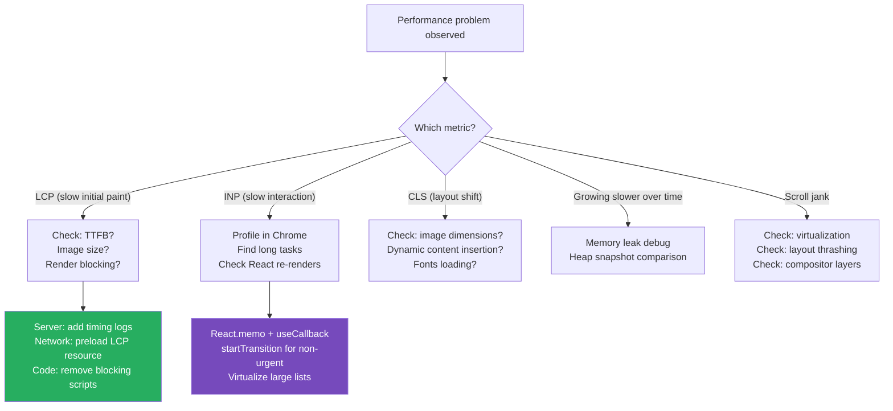

# 115 · Performance Debugging

> **Performance debugging is the art of moving from "the page feels slow" to "the ProductGrid re-renders 200 times because the parent recreates a prop array on every keystroke." It requires a systematic investigation methodology — symptom → measurement → hypothesis → profiling confirmation → fix → verification — because "slowness" is not a bug report, it's a complaint that points toward a category of causes. This document covers the complete toolkit for diagnosing performance problems in React/Next.js applications: the Chrome Performance Panel for long tasks and main thread blocking, the React DevTools Profiler for render-layer analysis, INP investigation for interaction responsiveness, and the specific patterns that cause performance problems in Next.js's server-rendering model.**

Performance debugging is distinct from performance optimization: optimization is applying known techniques preemptively; debugging is finding the specific cause of a specific observed slowness. Engineers who jump straight to "add React.memo everywhere" without measuring usually achieve nothing (memoization has costs too) or improve the wrong thing. The profile-first methodology — measure, identify the specific bottleneck, fix it, measure again — is what distinguishes senior performance engineers from developers who "add memoization to all the things and hope for the best."

---

## Table of Contents

- [The Performance Debugging Methodology](#the-performance-debugging-methodology)
- [Chrome DevTools Performance Panel](#chrome-devtools-performance-panel)
- [Long Tasks: The Root of Jank](#long-tasks-the-root-of-jank)
- [Diagnosing INP: Interaction to Next Paint](#diagnosing-inp-interaction-to-next-paint)
- [React DevTools Profiler: Render-Layer Analysis](#react-devtools-profiler-render-layer-analysis)
- [Memory Leak Debugging](#memory-leak-debugging)
- [Diagnosing Layout Thrashing](#diagnosing-layout-thrashing)
- [Network Performance Debugging](#network-performance-debugging)
- [Diagnosing Large Initial Bundle](#diagnosing-large-initial-bundle)
- [Debugging Slow Server-Side Rendering](#debugging-slow-server-side-rendering)
- [Using Performance.mark() for Custom Timing](#using-performancemark-for-custom-timing)
- [Architecture Diagrams](#architecture-diagrams)
- [Good Practices](#good-practices)
- [Bad Practices](#bad-practices)
- [Mental Model](#mental-model)
- [Common Misconceptions](#common-misconceptions)
- [Exercises](#exercises)
- [Further Reading](#further-reading)

---

## The Performance Debugging Methodology

```
STEP 1: QUANTIFY THE SYMPTOM
  Don't debug until you can MEASURE the current state.
  "The page is slow" → "LCP is 4.2s on mobile, 1.1s on desktop"
  "Clicking the filter is laggy" → "INP is 640ms when clicking the filter button"
  "Scrolling the list is janky" → "frame rate drops to 8fps while scrolling ProductGrid"

  Tools: Chrome DevTools Performance panel, Web Vitals extension, Lighthouse

STEP 2: IDENTIFY THE CATEGORY
  LCP problem: initial render, image loading, server response time
  CLS problem: layout shift — late-loading images, dynamic content insertion
  INP problem: main thread blocking during interaction handling
  FCP problem: render-blocking resources, large initial bundles
  TTFB problem: slow server, poor caching, edge network issues

  Each category has different tooling and different fixes.

STEP 3: PROFILE IN THE RIGHT CONTEXT
  Profile on hardware equivalent to your USERS' devices, not your dev machine.
  DevTools CPU throttling: 4x slowdown simulates a mid-tier Android phone
  DevTools Network throttling: "Slow 4G" simulates mobile connections
  If you can only reproduce on a real device: use Chrome remote debugging

STEP 4: FORM A SPECIFIC HYPOTHESIS
  "I think the filter click is slow because the sort function runs
   synchronously on the main thread for all 10,000 items."
  Not: "I think it's probably something with the state."

STEP 5: CONFIRM WITH A TARGETED PROFILE
  Record a performance profile of EXACTLY the problematic interaction.
  Find your hypothesis in the flame chart — confirmed or refuted?

STEP 6: FIX AND VERIFY
  Apply the fix.
  Measure again with the same tool.
  Is the metric actually better? By how much?
  Did fixing this introduce any new regressions?
```

---

## Chrome DevTools Performance Panel

```
THE ESSENTIAL PERFORMANCE DEBUGGING TOOL.

HOW TO RECORD A USEFUL PROFILE:
  1. Open DevTools → Performance tab
  2. Click the ⚙️ gear icon:
     - Enable "Web Vitals" (shows LCP/CLS markers in the timeline)
     - Enable "Screenshots" (see what was on screen at each moment)
     - CPU throttling: "4x slowdown" for mobile simulation
  3. Click ● record
  4. Perform the problematic action ONCE
  5. Click ■ stop
  → Profile loads showing the timeline

READING THE FLAME CHART:
  The flame chart shows what JavaScript was executing on the main thread, when.
  Each colored block is a function call. The width = time spent.
  Blocks are STACKED: the bottom is called, the middle calls the top.
  The TOP of the stack is the actual function executing.

  RED TRIANGLES in the top-right of a block = "long task" flag
  Long tasks = any task >50ms (blocks the main thread, causes jank)

  WHAT TO LOOK FOR:
    Wide blocks at the bottom of stacks: expensive function in your code
    Long yellow "Scripting" bars: JavaScript execution time
    Long purple "Rendering" bars: style recalculation / layout
    Long green "Painting" bars: compositing layers

KEY TRACKS IN THE TIMELINE:
  CPU: overall CPU usage (high = mainthread busy)
  Network: waterfall of network requests (look for blocking requests)
  Frames: visual frame rate (drops = jank)
  Main: the main thread flame chart (the most important track)
  Timings: LCP, FCP, and custom performance marks

ZOOM IN ON SPECIFIC AREAS:
  Click-and-drag to select a time range → DevTools zooms in
  Alt-scroll to zoom incrementally
  Find the exact moment of slowness (it's often a 100-200ms window)
```

---

## Long Tasks: The Root of Jank

```ts
// A long task is any main-thread JavaScript that takes >50ms.
// While a long task runs, the browser CANNOT:
// - Process user input (clicks, keystrokes, scroll)
// - Update the visual frame
// - Run any other JavaScript

// IDENTIFYING LONG TASKS IN THE PROFILER:
// The "Tasks" track shows red blocks for any task >50ms
// The "Main" flame chart shows what code was running during those blocks

// COMMON LONG TASK SOURCES IN REACT APPS:

// 1. Synchronous rendering of large lists:
function VeryExpensiveList({ items }: { items: Product[] }) {
  // Rendering 10,000 items synchronously → blocks the main thread for 500ms+
  return (
    <ul>
      {items.map(item => <ExpensiveItem key={item.id} item={item} />)}
    </ul>
  );
}
// FIX: virtualization (see doc 74: Large Lists)

// 2. Expensive array operations on every render:
function SortedProducts({ products }: { products: Product[] }) {
  // sort() on 5,000 items = a long task on every render
  const sorted = products.sort((a, b) => b.price - a.price);
  return <ProductGrid products={sorted} />;
}
// FIX: useMemo to only re-sort when products changes

// 3. Complex regex or string processing:
function processUserContent(text: string): string {
  // Complex operations on large text inputs = long tasks on every keystroke
  return text.replace(/complex-pattern/g, 'replacement');
}
// FIX: debounce or move to a Web Worker

// PROGRAMMATIC LONG TASK DETECTION:
const observer = new PerformanceObserver((list) => {
  for (const entry of list.getEntries()) {
    if (entry.duration > 50) {
      console.warn(`Long task detected: ${entry.duration.toFixed(0)}ms`);
      // Report to monitoring:
      analytics.track('long_task', { duration: entry.duration });
    }
  }
});
observer.observe({ entryTypes: ['longtask'] });
```

---

## Diagnosing INP: Interaction to Next Paint

```
INP (Interaction to Next Paint) is the Core Web Vital that measures
how quickly the page visually responds to user interactions (clicks,
keyboard events, taps). INP is "poor" if the p75 is >500ms.

THE INP TIMELINE:
  User clicks → Input delay → Processing time → Presentation delay → Visual update

  Input delay: time between click and when the browser can start processing it
    (caused by: long tasks blocking the main thread when the click arrives)
  Processing time: time to run the event handlers
    (caused by: expensive React state updates, re-renders, DOM operations)
  Presentation delay: time from handler completing to visual update
    (caused by: complex layouts, expensive repaints, compositor work)

DIAGNOSING HIGH INP:

Step 1: Open the Web Vitals Chrome extension
  → Shows INP for the current page with attribution
  → "INP: 640ms → Element: button#filter-btn → Interaction: click"
  → "Longest event: processClick → 580ms (processing time)"

Step 2: Record a performance profile DURING the interaction
  → Click record → click the problematic button → stop → analyze

Step 3: Find the interaction in the profile
  → In the "Interactions" track, find the click event
  → Look at what executed in the "Main" track during that interaction
  → The widest blocks are your problem

Step 4: Common INP culprits and fixes:

CULPRIT: setState triggers a massive synchronous re-render
  Click → setState → React re-renders 200 components → 400ms blocked
  FIX: React.memo on expensive subtrees, useMemo for expensive computations
  FIX: Split state updates: update the clicked element immediately, defer the rest
  FIX: Use React.startTransition for non-urgent updates

CULPRIT: DOM manipulation after state update
  Large DOM changes (adding 100 items to a list) = expensive style + layout
  FIX: Virtualize lists so the DOM stays small
  FIX: Use CSS animations instead of JavaScript-driven position changes

CULPRIT: Third-party script executing on every click
  An analytics script doing heavy work on every interaction
  FIX: Defer third-party scripts, use web workers, or remove if not critical
```

---

## React DevTools Profiler: Render-Layer Analysis

```tsx
// The React DevTools Profiler is covered in doc 112 (Debugging React)
// and doc 72 (React Profiler). This section focuses on PERFORMANCE DEBUGGING
// specifically — finding which components are causing performance problems.

// FINDING THE EXPENSIVE RENDER IN THE PROFILER:

// After recording: switch to the "Ranked" view (not the flame chart)
// The Ranked view sorts components by their actual render time (high to low)
// → The TOP entry is your most expensive render
// → If it's a component you'd expect to be fast, that's suspicious

// CORRELATING WITH THE CHROME PERFORMANCE PANEL:
// 1. Record the same interaction in BOTH:
//    - Chrome Performance Panel (shows overall timeline + long tasks)
//    - React DevTools Profiler (shows React's render breakdown)
// 2. The Chrome panel shows TOTAL time; React Profiler shows React's portion
// 3. If React renders take 50ms and the total task is 300ms:
//    → 250ms is non-React (third-party scripts, DOM operations, etc.)
//    → Profile further in Chrome to find those 250ms

// CHECKING IF MEMOIZATION IS WORKING:

// In the React Profiler flame chart:
// - Gray component = DID NOT render (memoization is working ✅)
// - Colored component = DID render

// If a memoized component is rendering when you expect gray:
// 1. Click the component → "Why did this render?"
// 2. "Props changed: { onSort: function }" → the function prop is being recreated
// 3. FIX: useCallback in the parent for that function prop

// USING THE PROFILER API PROGRAMMATICALLY:
import { Profiler } from "react";

function onRenderCallback(
  id: string,
  phase: "mount" | "update" | "nested-update",
  actualDuration: number,
  baseDuration: number,
  startTime: number,
  commitTime: number,
) {
  if (actualDuration > 16) {
    // slower than one frame (60fps = 16.67ms)
    console.warn(
      `Slow render: ${id} took ${actualDuration.toFixed(1)}ms (${phase})`,
    );
  }
}

<Profiler id="ProductGrid" onRender={onRenderCallback}>
  <ProductGrid products={products} />
</Profiler>;
```

---

## Memory Leak Debugging

```
SYMPTOMS OF A MEMORY LEAK:
  Page becomes progressively slower over time (memory pressure)
  Browser tab eventually crashes (out of memory)
  Task Manager shows growing memory usage for the tab

COMMON REACT MEMORY LEAK PATTERNS:

1. useEffect without cleanup (event listeners not removed):
function Component() {
  useEffect(() => {
    window.addEventListener('resize', handleResize);
    // ❌ NO CLEANUP: listener accumulates on every mount
  }, []);
}

// FIX:
useEffect(() => {
  window.addEventListener('resize', handleResize);
  return () => window.removeEventListener('resize', handleResize); // ✅ cleanup
}, []);

2. setTimeout/setInterval not cleared:
useEffect(() => {
  const interval = setInterval(fetchUpdates, 5000);
  // ❌ NO CLEANUP: interval keeps running after component unmounts
}, []);
// FIX: return () => clearInterval(interval);

3. Observable subscriptions not unsubscribed:
useEffect(() => {
  const subscription = eventBus.subscribe(handler);
  return () => subscription.unsubscribe(); // ✅ cleanup
}, []);

DIAGNOSING MEMORY LEAKS WITH CHROME DEVTOOLS:
  1. Open DevTools → Memory tab
  2. Take a heap snapshot (the initial baseline)
  3. Perform the action that causes the leak (navigate away and back, etc.)
  4. Force garbage collection (the ⊕ garbage can icon)
  5. Take another heap snapshot
  6. Change the view to "Comparison" (not "Summary")
  7. Look for objects with positive "#New" counts (objects that weren't collected)
  8. Click those objects → see what's holding references to them

CHECKING FOR LISTENER ACCUMULATION:
  // In the browser console:
  getEventListeners(window) // shows all listeners on window
  // If this grows each time you navigate, you have a leak
```

---

## Diagnosing Layout Thrashing

```
LAYOUT THRASHING: forcing the browser to calculate layout
repeatedly within a single frame by alternating reads and writes
to layout-affecting DOM properties.

THE MECHANISM:
  Reading layout properties (offsetHeight, getBoundingClientRect, etc.)
  forces the browser to calculate layout synchronously — it must "flush"
  any pending writes first, so it can give you the current correct value.

  If you READ → WRITE → READ → WRITE repeatedly, you force a layout
  calculation (expensive!) on every READ, rather than batching all
  writes and reading once.

THE SYMPTOM IN THE PROFILER:
  Purple "Recalculate Style" + "Layout" blocks appearing repeatedly
  in rapid succession within a single task. Each cycle = layout thrashing.

COMMON REACT CAUSES:
  Animations that read position then write position in a loop:
  function animateToPosition(element: HTMLElement, target: number) {
    const current = element.getBoundingClientRect().top; // ← forces layout
    element.style.transform = `translateY(${target - current}px)`; // ← writes
    requestAnimationFrame(() => animateToPosition(element, target)); // ← again!
  }

  DIAGNOSIS: Chrome DevTools → Performance → look for long purple stripes
  in the "Main" track → this is layout thrashing

  FIX: batch reads before writes, use the CSS Animations API, or
  use requestAnimationFrame to separate the read and write phases:
  requestAnimationFrame(() => {
    const current = element.getBoundingClientRect().top; // read
    element.style.transform = `translateY(${target - current}px)`; // write
  }); // reads and writes are in the same frame, no thrashing
```

---

## Network Performance Debugging

```
DIAGNOSING SLOW LCP FROM NETWORK:
  Chrome DevTools → Network tab → filter by "Img" or the LCP element's type
  Look at the LCP element's request:
    Time to first byte (TTFB) of the image: slow? → CDN or origin server issue
    Download time: large file? → compress / resize the image
    Time in queue: many blocking requests before it? → preload with <link rel="preload">
    DNS + connect time: slow initial connection? → preconnect to the image origin

DIAGNOSING REQUEST WATERFALLS (see doc 94):
  Network tab → set "No throttling" to see the full picture first,
  then apply "Slow 4G" to simulate real user conditions.

  In the waterfall view, staircase patterns = sequential requests.
  Flat, overlapping bars = parallel requests (what you want).
  Staircase patterns point you to the code that's creating
  sequential data dependencies.

DIAGNOSING LARGE PAYLOAD:
  Network tab → sort by "Size" (click the Size column)
  Largest responses are candidates for:
    JSON: are you fetching more data than you need? (over-fetching)
    Images: are they properly compressed and sized?
    JS chunks: is a specific chunk unexpectedly large?

  For JSON over-fetching:
    Filter responses to /api/* → find the largest responses
    Click the response → Preview tab → what data is there that your UI doesn't use?
    Fix: reshape the API response (BFF pattern, doc 95) or use GraphQL
```

---

## Diagnosing Large Initial Bundle

```bash
# Step 1: Analyze the bundle composition
ANALYZE=true npm run build
# Opens the webpack bundle analyzer treemap

# Step 2: Identify the largest chunks
# Look for: unexpectedly large boxes, duplicates, unnecessary modules

# Step 3: Find what's importing the large module
# In the treemap: click a module → it highlights which entry point includes it
# In the terminal: search the build output for the module name

# Step 4: Check if it should be client-side at all
# Server Components don't add to the client bundle
# If a large module is in a Server Component: it shouldn't appear in client chunks
# If it does appear: that component is accidentally marked as a Client Component

# Step 5: Tools for root cause analysis
npx source-map-explorer .next/static/chunks/*.js
# → Another bundle analyzer view, with percentage breakdowns

# COMMON LARGE BUNDLE CULPRITS:
# 1. Moment.js (300KB) instead of date-fns (use date-fns/esm and tree-shake)
# 2. Full lodash instead of lodash-es (tree-shakeable ESM version)
# 3. Icons library importing the ENTIRE set instead of individual icons
#    import { FaSearch } from 'react-icons/fa' ← imports all of react-icons!
#    import FaSearch from 'react-icons/fa/FaSearch' ← just the one icon
# 4. A Server Component accidentally importing a large client-only library
# 5. A missing code-split boundary (should be dynamic() but isn't)
```

---

## Debugging Slow Server-Side Rendering

```ts
// DIAGNOSING SLOW SERVER RESPONSE TIME (high TTFB):

// Step 1: Add timing measurements to slow pages:
export default async function SlowPage() {
  const start = Date.now();

  const [data1, data2, data3] = await Promise.all([
    fetchData1().then(d => {
      console.log(`[SlowPage] data1 took ${Date.now() - start}ms`);
      return d;
    }),
    fetchData2().then(d => {
      console.log(`[SlowPage] data2 took ${Date.now() - start}ms`);
      return d;
    }),
    fetchData3().then(d => {
      console.log(`[SlowPage] data3 took ${Date.now() - start}ms`);
      return d;
    }),
  ]);

  console.log(`[SlowPage] total server time: ${Date.now() - start}ms`);
  return <PageContent data1={data1} data2={data2} data3={data3} />;
}

// Step 2: Identify the slowest fetch from the logs
// If data1 takes 800ms and others take 50ms → data1's backend is slow

// Step 3: Check if requests are in parallel or sequential:
// Are they in Promise.all? → parallel ✅
// Is one fetched, then used to fetch another? → sequential (see doc 94)

// Step 4: Check caching behavior:
// Is this a fresh cold request or hitting the cache?
// In development: no caching (always fresh)
// Add: console.log('[SlowPage] cache:', response.headers.get('x-nextjs-cache'))
// 'HIT' → cached; 'MISS' → uncached; 'STALE' → serving stale while revalidating

// Step 5: Database query analysis:
// Add Prisma query timing:
const prisma = new PrismaClient({
  log: [
    { emit: 'event', level: 'query' },
  ],
});
prisma.$on('query', (e) => {
  if (e.duration > 100) {
    console.warn(`[Slow Query] ${e.duration}ms: ${e.query}`);
  }
});
```

---

## Using Performance.mark() for Custom Timing

```ts
// Mark specific operations to understand where time is being spent:

// In a Server Component (timing appears in terminal):
export async function ProductPage({ params }: { params: { id: string } }) {
  const dbStart = Date.now();
  const product = await db.products.findUnique({ where: { id: params.id } });
  console.log(`[ProductPage] DB query: ${Date.now() - dbStart}ms`);

  const renderStart = Date.now();
  // ... rendering happens (Next.js measures this internally)
  console.log(`[ProductPage] pre-render setup: ${Date.now() - renderStart}ms`);

  return <ProductView product={product!} />;
}

// In Client Components (timing appears in browser DevTools Performance tab):
useEffect(() => {
  performance.mark('hydration-start');
}, []);

useEffect(() => {
  // This effect fires after the first render (approximate hydration time):
  performance.mark('hydration-end');
  performance.measure('hydration', 'hydration-start', 'hydration-end');

  const [measure] = performance.getEntriesByName('hydration');
  if (measure.duration > 100) {
    console.warn(`Slow hydration: ${measure.duration.toFixed(0)}ms`);
  }
}, []);

// In Playwright E2E tests (measuring user-perceived timing):
test('filter interaction responds in under 100ms', async ({ page }) => {
  await page.goto('/products');

  await page.evaluate(() => performance.mark('filter-click-start'));
  await page.click('[data-testid="category-filter"]');
  await page.waitForSelector('[data-testid="filtered-results"]');
  await page.evaluate(() => {
    performance.mark('filter-click-end');
    performance.measure('filter-response', 'filter-click-start', 'filter-click-end');
  });

  const duration = await page.evaluate(() => {
    const [m] = performance.getEntriesByName('filter-response');
    return m.duration;
  });
  expect(duration).toBeLessThan(100);
});
```

---

## Architecture Diagrams

### Performance debugging decision tree by metric



---

## Good Practices

### ✅ Good Practice — Systematic profile-before-fix approach

```tsx
/**
 * Good: A methodical approach to an INP problem —
 * measure first, profile to find the cause, fix the specific bottleneck,
 * then verify the improvement.
 */

// PROBLEM REPORT: "clicking the 'Apply Filter' button feels laggy"

// STEP 1: Measure
// Web Vitals extension shows INP: 540ms for the filter button click.
// That's "poor" (>500ms is the poor threshold).

// STEP 2: Profile (Chrome DevTools Performance Panel, 4x CPU slowdown)
// Recorded the filter click. Found:
//   A long task of 520ms:
//     → React render: 480ms
//     → Within React render: ProductCard × 5,000 = 480ms

// STEP 3: Hypothesis
// The filter updates the parent's state → React re-renders ALL 5,000 ProductCards
// even though only ~200 match the filter and the rest should be hidden.

// STEP 4: Root cause
function ProductCatalog({ products }: { products: Product[] }) {
  const [category, setCategory] = useState("all");

  // ❌ All 5,000 products re-render when filter changes:
  return (
    <>
      <FilterBar onChange={setCategory} />
      {products.map((p) => (
        <ProductCard
          key={p.id}
          product={p}
          visible={category === "all" || p.category === category}
        />
      ))}
    </>
  );
}

// STEP 5: Fix
function ProductCatalog({ products }: { products: Product[] }) {
  const [category, setCategory] = useState("all");

  // Filter at the parent: only pass matching products to the list:
  const filteredProducts = useMemo(
    () =>
      category === "all"
        ? products
        : products.filter((p) => p.category === category),
    [products, category],
  );

  return (
    <>
      <FilterBar onChange={setCategory} />
      {/* + wrap with startTransition so filter click responds immediately */}
      <ProductList products={filteredProducts} />
    </>
  );
}

// STEP 6: Verify
// Re-profile → INP now 85ms for the same filter click. ✅ "Good" (<200ms)
```

---

## Bad Practices

### ⚠️ Bad Practice — Premature memoization without profiling

```tsx
/**
 * Bad: Adding React.memo, useMemo, and useCallback to every component
 * "for performance" without measuring whether they actually help —
 * this pattern adds code complexity and memory overhead with potential
 * negative net effect.
 */

// ❌ Adding memo to everything indiscriminately
const SimpleLabel = React.memo(function SimpleLabel({
  text,
}: {
  text: string;
}) {
  return <span>{text}</span>;
});
// This component renders in ~0.1ms. Wrapping it in React.memo:
// - Adds a shallow equality check on every parent render
// - Adds code complexity
// - Adds memory for the memoized version
// For a component this simple, the overhead of memo EXCEEDS its benefit.

// ❌ Memoizing non-expensive computations:
function ProductCard({ product }: { product: Product }) {
  // This computation takes 0.001ms — not worth memoizing:
  const displayPrice = useMemo(
    () => `$${product.price.toFixed(2)}`,
    [product.price],
  );
  return <div>{displayPrice}</div>;
}

// ❌ useCallback for functions that aren't causing re-renders:
function Parent() {
  // If Child is NOT wrapped with React.memo, this useCallback
  // serves no purpose — Child will re-render anyway:
  const handleClick = useCallback(() => doSomething(), []);
  return <Child onClick={handleClick} />;
  // Without React.memo on Child: useCallback adds overhead with zero benefit
}

/**
 * THE RULE: profile first, then memoize specifically the things
 * the profiler identifies as unnecessary re-renders. Memoization
 * is a targeted optimization, not a blanket technique.
 */
```

---

## Mental Model

> 💡 **The performance debugging mental model:**
>
> Performance debugging is like **diagnosing why a car is slow**: you don't randomly replace parts hoping to go faster. You start by measuring — is it slow on the highway (sustained throughput → engine issue) or at traffic lights (initial acceleration → torque issue)? Then you test the hypothesis — listen to the engine, check the fuel pressure, read the OBD codes. Each measurement narrows the cause from "car is slow" to "cylinder 3 is misfiring at high RPM." Only THEN do you replace the part. Replacing parts randomly (adding `React.memo` everywhere) might accidentally fix the problem, or might not, and you'll never know why. The Chrome Performance Panel is your OBD reader — it shows exactly which code (cylinder) ran for how long (misfired) during the slow moment, so you know precisely what to fix. The fix is the LAST step, not the first.

---

## Common Misconceptions

### "React.memo always improves performance"

React.memo prevents a re-render only when the memoized component's props haven't changed. It has a cost: a shallow equality check of all props on every parent render. For components that legitimately need to re-render frequently (most components), React.memo adds overhead without benefit. Profile first to identify WHICH specific components are causing EXPENSIVE unnecessary re-renders — then apply memo selectively.

### "useMemo is free"

`useMemo` runs its factory function on every render to check if the dependencies changed, AND maintains the memoized value in memory. For very cheap computations (string formatting, simple math), the memo overhead can exceed the computation cost. Apply `useMemo` to genuinely expensive computations (sorting 10,000 items, complex derived data) identified by profiling, not to every derived value.

### "JavaScript is always the performance bottleneck"

In many Next.js applications, the bottleneck is NETWORK (slow server response, large images) or LAYOUT/PAINT (CSS complexity) rather than JavaScript execution. Always check the Chrome Performance Panel's breakdown: if the purple bars (rendering/layout) dominate over yellow bars (scripting), the fix is CSS optimization, not JavaScript optimization.

### "Development mode profiling is representative of production performance"

React development mode adds significant overhead: warning checks, extra validation, slower rendering paths. Performance profiles in development mode show RELATIVE differences (component A is slower than B) but NOT absolute timings. Always profile in production-equivalent conditions (`next build && next start`) for meaningful absolute numbers.

### "Adding `key` props to fix re-renders is always the right fix"

`key` props cause React to UNMOUNT and REMOUNT a component when the key changes — destroying and recreating its state. This is the right fix when you WANT a full reset (new user session, navigating to a different product). Using `key` to "fix" a re-render that should be an UPDATE discards state unnecessarily and can cause worse performance (unmount + mount > update).

---

## Exercises

### Exercise 1 — Profile and fix a real slow interaction

1. Open any data-heavy React application you have access to
2. Enable 4x CPU throttling in Chrome DevTools
3. Record a performance profile of a user interaction (filtering, sorting, searching)
4. Find the widest blocks in the "Main" flame chart
5. Identify if it's a React re-render problem (use React DevTools) or a computation problem (read the function names)
6. Apply the appropriate fix and re-profile to confirm improvement

### Exercise 2 — Debug a memory leak

Create a component that intentionally leaks:

```tsx
function LeakyComponent() {
  useEffect(() => {
    window.addEventListener("click", () => console.log("clicked"));
    // no cleanup
  }, []);
  return <div>Leaky component</div>;
}
```

1. Mount and unmount the component 10 times
2. Open Chrome Memory tab → take a heap snapshot
3. Use the "Comparison" view to find the accumulated event listeners
4. Fix the leak with proper cleanup and verify the heap snapshot improves

### Exercise 3 — Diagnose a large bundle

1. Run `ANALYZE=true npm run build` on a Next.js project
2. Identify the 3 largest modules in the client bundle
3. For each: is it necessary? Could it be replaced with something lighter? Could it be lazy-loaded?
4. Implement one optimization (lazy loading or replacement)
5. Re-run the analyzer to verify the bundle size decreased

---

## Further Reading

- [web.dev: Diagnose slow interactions in the lab](https://web.dev/articles/diagnose-slow-interactions-in-the-lab) — comprehensive INP debugging guide
- [Chrome DevTools: Performance panel documentation](https://developer.chrome.com/docs/devtools/performance/) — the official profiler guide
- [web.dev: Long tasks API](https://web.dev/articles/long-tasks-devtools) — programmatic long task detection
- [Chrome DevTools: Memory](https://developer.chrome.com/docs/devtools/memory-problems/) — memory leak debugging guide
- [React DevTools Profiler](https://react.dev/learn/react-developer-tools#profiler) — React's profiler documentation
- [web.dev: Avoid layout thrashing](https://web.dev/articles/avoid-large-complex-layouts-and-layout-thrashing) — layout thrashing reference
- Related in this handbook: [72 · React Profiler](../performance/01-react-profiler.md), [77 · Large Lists](../performance/06-large-lists.md), [112 · Debugging React](./01-debugging-react.md)

---

_Part of the [React + Next.js Engineering Handbook](../../README.md)_
