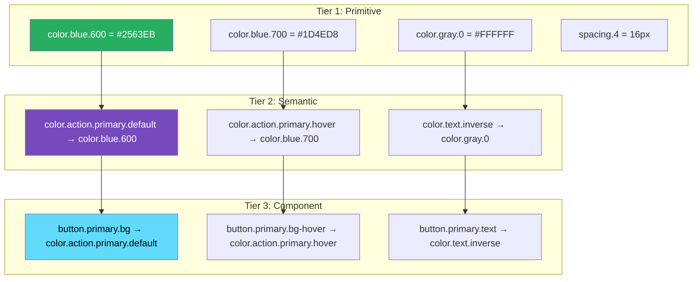
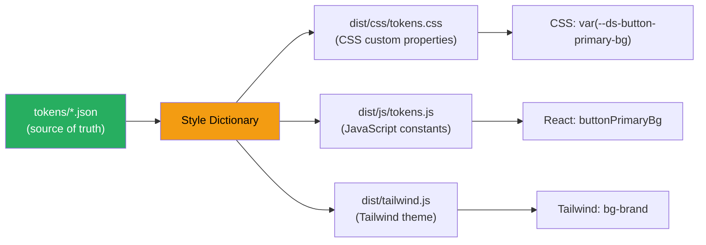

# 101 · Design Token Systems

> **Design tokens are the atomic, named values that encode a design system's visual decisions — colors, typography, spacing, elevation, motion, and border radii — stored as structured data (JSON, YAML, or TypeScript) rather than hardcoded values in CSS or component code. A token like `color.brand.primary.500` is a named abstraction over a hex value: `#2563EB`. When a redesign changes that hex, updating the token updates every component that uses it, everywhere, simultaneously. Tokens are the connective tissue between design tools (Figma) and implementation (CSS, React, React Native) — the single source of truth that makes "change the primary brand color" a one-line operation rather than a grep-and-replace across hundreds of files.**

Design token systems are an architectural investment whose value compounds over time: the larger and older the system, the more expensive ad-hoc visual changes become without tokens, and the cheaper they become with them. Understanding how to architect a multi-tier token system (primitive → semantic → component-level), how to generate platform-specific output (CSS variables, Tailwind config, native values), and how to enforce token discipline across a team is the engineering discipline this document covers.

---

## Table of Contents

- [Why Design Tokens Exist](#why-design-tokens-exist)
- [The Three-Tier Token Architecture](#the-three-tier-token-architecture)
- [Primitive Tokens: The Raw Values](#primitive-tokens-the-raw-values)
- [Semantic Tokens: Purpose-Named Abstractions](#semantic-tokens-purpose-named-abstractions)
- [Component Tokens: Component-Scoped Decisions](#component-tokens-component-scoped-decisions)
- [Token Naming Conventions](#token-naming-conventions)
- [Token Storage Formats](#token-storage-formats)
- [Style Dictionary: Transforming Tokens to Platform Output](#style-dictionary-transforming-tokens-to-platform-output)
- [CSS Custom Properties: The Web Token Runtime](#css-custom-properties-the-web-token-runtime)
- [Theming with Design Tokens](#theming-with-design-tokens)
- [Integrating Tokens with Tailwind CSS](#integrating-tokens-with-tailwind-css)
- [Token Governance and Documentation](#token-governance-and-documentation)
- [Figma to Code: Closing the Token Loop](#figma-to-code-closing-the-token-loop)
- [Architecture Diagrams](#architecture-diagrams)
- [Good Practices](#good-practices)
- [Bad Practices](#bad-practices)
- [Mental Model](#mental-model)
- [Common Misconceptions](#common-misconceptions)
- [Exercises](#exercises)
- [Further Reading](#further-reading)

---

## Why Design Tokens Exist

```
THE PROBLEM WITHOUT TOKENS:

  // Component A (2 years ago):
  background-color: #2563EB;

  // Component B (1 year ago, designer used a slightly different shade):
  background-color: #2564EB;  ← one digit off, looks identical on screen

  // Component C (6 months ago, correct):
  background-color: #2563EB;

  // Component D (last week, developer eyeballed it):
  background-color: rgb(37, 99, 235);  ← same color, different format

  // Brand refresh: primary color changes to #1D4ED8
  // Task: update all instances
  // Reality: grep finds #2563EB in 47 places, misses the rgb() version,
  //          doesn't catch the slightly-off #2564EB, misses the
  //          HSL and rgba() usages elsewhere
  // Result: inconsistent brand refresh, some components updated,
  //         some missed, design review catches issues in QA

WITH TOKENS:
  Every component references: var(--color-brand-primary)
  The token definition: --color-brand-primary: #2563EB;
  Brand refresh: change ONE value in ONE file → CSS recompiles →
  EVERY component updates correctly, simultaneously, without errors.
```

---

## The Three-Tier Token Architecture

The most important structural decision in a token system: how many abstraction layers to use:

```
TIER 1: PRIMITIVE TOKENS
  The raw, global values. Color palettes, full type scales, all spacing
  steps, etc. These have no semantic meaning — they're the complete
  vocabulary from which semantic tokens are drawn.
  Example: color.blue.500 = #2563EB

TIER 2: SEMANTIC TOKENS
  Named by ROLE or PURPOSE, not visual appearance.
  References Tier 1 values — doesn't define new raw values.
  Example: color.action.primary = {value: "{color.blue.500}"}
  These can be ALIASED differently for light/dark themes:
    Light: color.action.primary → color.blue.500 (#2563EB)
    Dark:  color.action.primary → color.blue.400 (#3B82F6)

TIER 3: COMPONENT TOKENS
  Token decisions scoped to a SPECIFIC COMPONENT.
  References Tier 2 tokens — doesn't reference Tier 1 directly.
  Example: button.primary.background = {value: "{color.action.primary}"}

THE VALUE OF THREE TIERS:
  Tier 1 → Tier 2: allows theming (same semantic meaning,
    different raw value per theme)
  Tier 2 → Tier 3: allows component-specific overrides without
    breaking the semantic meaning globally

COMMON MISTAKE: skipping semantic tokens and mapping directly from
  primitive to component. This means theming requires changing
  component tokens individually — losing the "change one value,
  update everything" benefit.
```

---

## Primitive Tokens: The Raw Values

```json
// tokens/primitive/color.json
{
  "color": {
    "blue": {
      "50": { "value": "#EFF6FF" },
      "100": { "value": "#DBEAFE" },
      "200": { "value": "#BFDBFE" },
      "300": { "value": "#93C5FD" },
      "400": { "value": "#60A5FA" },
      "500": { "value": "#3B82F6" },
      "600": { "value": "#2563EB" },
      "700": { "value": "#1D4ED8" },
      "800": { "value": "#1E40AF" },
      "900": { "value": "#1E3A8A" }
    },
    "gray": {
      "0": { "value": "#FFFFFF" },
      "50": { "value": "#F9FAFB" },
      "100": { "value": "#F3F4F6" },
      "200": { "value": "#E5E7EB" },
      "300": { "value": "#D1D5DB" },
      "400": { "value": "#9CA3AF" },
      "500": { "value": "#6B7280" },
      "600": { "value": "#4B5563" },
      "700": { "value": "#374151" },
      "800": { "value": "#1F2937" },
      "900": { "value": "#111827" },
      "1000": { "value": "#000000" }
    },
    "red": {
      "500": { "value": "#EF4444" },
      "600": { "value": "#DC2626" },
      "700": { "value": "#B91C1C" }
    },
    "green": {
      "500": { "value": "#22C55E" },
      "600": { "value": "#16A34A" }
    }
  }
}
```

```json
// tokens/primitive/spacing.json
{
  "spacing": {
    "0": { "value": "0px" },
    "1": { "value": "4px" },
    "2": { "value": "8px" },
    "3": { "value": "12px" },
    "4": { "value": "16px" },
    "5": { "value": "20px" },
    "6": { "value": "24px" },
    "8": { "value": "32px" },
    "10": { "value": "40px" },
    "12": { "value": "48px" },
    "16": { "value": "64px" },
    "20": { "value": "80px" },
    "24": { "value": "96px" }
  }
}
```

---

## Semantic Tokens: Purpose-Named Abstractions

```json
// tokens/semantic/color.json
// Note: values reference Tier 1 tokens using {path.to.token} syntax
{
  "color": {
    "surface": {
      "default": { "value": "{color.gray.0}" },
      "subtle": { "value": "{color.gray.50}" },
      "raised": { "value": "{color.gray.0}" },
      "overlay": { "value": "{color.gray.100}" },
      "inverse": { "value": "{color.gray.900}" }
    },
    "text": {
      "primary": { "value": "{color.gray.900}" },
      "secondary": { "value": "{color.gray.600}" },
      "disabled": { "value": "{color.gray.400}" },
      "inverse": { "value": "{color.gray.0}" },
      "brand": { "value": "{color.blue.600}" },
      "danger": { "value": "{color.red.600}" },
      "success": { "value": "{color.green.600}" }
    },
    "border": {
      "default": { "value": "{color.gray.200}" },
      "strong": { "value": "{color.gray.400}" },
      "focus": { "value": "{color.blue.600}" },
      "danger": { "value": "{color.red.500}" }
    },
    "action": {
      "primary": {
        "default": { "value": "{color.blue.600}" },
        "hover": { "value": "{color.blue.700}" },
        "pressed": { "value": "{color.blue.800}" },
        "disabled": { "value": "{color.gray.300}" }
      },
      "danger": {
        "default": { "value": "{color.red.600}" },
        "hover": { "value": "{color.red.700}" }
      }
    },
    "feedback": {
      "error": { "value": "{color.red.500}" },
      "warning": { "value": "{color.yellow.500}" },
      "success": { "value": "{color.green.500}" },
      "info": { "value": "{color.blue.500}" }
    }
  }
}
```

---

## Component Tokens: Component-Scoped Decisions

```json
// tokens/component/button.json
{
  "button": {
    "primary": {
      "background": {
        "default": { "value": "{color.action.primary.default}" },
        "hover": { "value": "{color.action.primary.hover}" },
        "pressed": { "value": "{color.action.primary.pressed}" },
        "disabled": { "value": "{color.action.primary.disabled}" }
      },
      "text": {
        "default": { "value": "{color.text.inverse}" },
        "disabled": { "value": "{color.gray.500}" }
      },
      "border": {
        "default": { "value": "transparent" }
      }
    },
    "secondary": {
      "background": {
        "default": { "value": "transparent" },
        "hover": { "value": "{color.surface.overlay}" }
      },
      "text": {
        "default": { "value": "{color.action.primary.default}" }
      },
      "border": {
        "default": { "value": "{color.action.primary.default}" }
      }
    },
    "size": {
      "sm": {
        "paddingX": { "value": "{spacing.3}" },
        "paddingY": { "value": "{spacing.2}" },
        "fontSize": { "value": "{font.size.sm}" }
      },
      "md": {
        "paddingX": { "value": "{spacing.4}" },
        "paddingY": { "value": "{spacing.3}" },
        "fontSize": { "value": "{font.size.base}" }
      },
      "lg": {
        "paddingX": { "value": "{spacing.6}" },
        "paddingY": { "value": "{spacing.4}" },
        "fontSize": { "value": "{font.size.lg}" }
      }
    }
  }
}
```

---

## Token Naming Conventions

```
THE STANDARD NAMING PATTERN: [category].[type].[variant].[state]

CATEGORY: what kind of value? color, spacing, typography, border, shadow, motion
TYPE: what purpose? surface, text, action, border, feedback
VARIANT: which variant? primary, secondary, danger, success, brand
STATE: what state? default, hover, pressed, focus, disabled, active

EXAMPLES:
  color.text.primary           → main text color
  color.action.primary.hover   → primary button background on hover
  spacing.4                    → 16px spacing step
  border.radius.md             → medium border radius
  shadow.elevation.2           → second elevation level shadow
  motion.duration.fast         → quick animation duration

NAMING PRINCIPLES:
  ✅ Semantic, not visual: 'color.text.primary' not 'color.black.900'
     (the visual value can change; the PURPOSE stays the same)
  ✅ Consistent hierarchy: always [category].[concept].[variant].[state]
  ✅ Predictable: if color.action.primary.hover exists,
     color.action.danger.hover should too
  ❌ Avoid: mixing conventions ('btn-primary-bg' AND 'color.action.primary')
  ❌ Avoid: too many levels ('color.semantic.action.interactive.primary.background.hover.brand')
  ❌ Avoid: visual descriptions ('color.cobalt.slightly-lighter-on-hover')
```

---

## Token Storage Formats

```
FORMAT 1: JSON (most common, supported by Style Dictionary and most tools)
  {
    "color": {
      "brand": {
        "primary": { "value": "#2563EB", "type": "color", "description": "Main brand color" }
      }
    }
  }

FORMAT 2: W3C Design Token Format (emerging standard)
  {
    "color": {
      "brand": {
        "primary": { "$value": "#2563EB", "$type": "color", "$description": "Main brand color" }
      }
    }
  }
  The W3C format uses $ prefix to distinguish token metadata from
  namespace groupings. More tools are adopting this standard.

FORMAT 3: TypeScript (for type safety in the token source)
  export const tokens = {
    color: {
      brand: {
        primary: { value: '#2563EB', type: 'color' as const },
      },
    },
  } as const;
  // Benefit: TypeScript prevents typos in token names at authoring time.
  // Trade-off: less portable to non-JS tools.

FORMAT 4: YAML (human-readable, used by some teams)
  color:
    brand:
      primary:
        value: "#2563EB"
        type: color

RECOMMENDATION: Use JSON (or the W3C $ format) for maximum tool compatibility.
TypeScript wrappers can be generated from the JSON source for type safety.
```

---

## Style Dictionary: Transforming Tokens to Platform Output

Style Dictionary (by Amazon) is the most widely used tool for building multi-platform design token pipelines:

```js
// sd.config.js — Style Dictionary configuration
import StyleDictionary from "style-dictionary";

export default {
  source: ["tokens/**/*.json"], // input: token JSON files
  platforms: {
    css: {
      transformGroup: "css",
      prefix: "ds", // generates --ds-color-brand-primary
      buildPath: "dist/css/",
      files: [
        {
          destination: "tokens.css",
          format: "css/variables",
          options: {
            outputReferences: true, // preserve references between tokens
          },
        },
      ],
    },
    js: {
      transformGroup: "js",
      buildPath: "dist/js/",
      files: [
        {
          destination: "tokens.js",
          format: "javascript/es6",
        },
      ],
    },
    tailwind: {
      transformGroup: "js",
      buildPath: "dist/",
      files: [
        {
          destination: "tailwind-tokens.js",
          format: "javascript/module",
          filter: (token) => token.attributes.category === "color",
        },
      ],
    },
  },
};
```

```
STYLE DICTIONARY OUTPUT FOR THE BUTTON TOKEN:

CSS OUTPUT (dist/css/tokens.css):
  :root {
    --ds-button-primary-background-default: var(--ds-color-action-primary-default);
    --ds-button-primary-background-hover: var(--ds-color-action-primary-hover);
    --ds-button-size-md-padding-x: var(--ds-spacing-4);
    /* ... */
  }

JAVASCRIPT OUTPUT (dist/js/tokens.js):
  export const ButtonPrimaryBackgroundDefault = 'var(--ds-button-primary-background-default)';
  export const ButtonSizeMdPaddingX = 'var(--ds-spacing-4)';

RESOLVED VALUES (for JavaScript environments without CSS variable support):
  export const ButtonPrimaryBackgroundDefault = '#2563EB';
```

---

## CSS Custom Properties: The Web Token Runtime

CSS Custom Properties (CSS variables) are the most effective web runtime for design tokens:

```css
/* dist/css/tokens.css — generated by Style Dictionary */
:root {
  /* Primitive tokens: */
  --ds-color-blue-600: #2563eb;
  --ds-color-blue-700: #1d4ed8;
  --ds-color-gray-0: #ffffff;
  --ds-spacing-4: 16px;

  /* Semantic tokens (reference primitives): */
  --ds-color-action-primary-default: var(--ds-color-blue-600);
  --ds-color-action-primary-hover: var(--ds-color-blue-700);
  --ds-color-text-inverse: var(--ds-color-gray-0);

  /* Component tokens (reference semantics): */
  --ds-button-primary-bg: var(--ds-color-action-primary-default);
  --ds-button-primary-bg-hover: var(--ds-color-action-primary-hover);
  --ds-button-primary-text: var(--ds-color-text-inverse);
}
```

```css
/* Component CSS using the tokens: */
.button--primary {
  background-color: var(--ds-button-primary-bg);
  color: var(--ds-button-primary-text);
}

.button--primary:hover {
  background-color: var(--ds-button-primary-bg-hover);
}

/* Theming: override token values at a scope level */
[data-theme="dark"] {
  --ds-color-action-primary-default: #3b82f6; /* blue-500 in dark mode */
  --ds-color-action-primary-hover: #2563eb; /* blue-600 in dark mode */
  /* Component tokens automatically update — no changes needed in components! */
}
```

### CSS Custom Properties at runtime

```tsx
// Applying theme via data attribute in Next.js:
// app/layout.tsx
export default function RootLayout({
  children,
}: {
  children: React.ReactNode;
}) {
  return (
    <html data-theme="light">
      {" "}
      {/* or 'dark', or 'brand-alt' */}
      <body>{children}</body>
    </html>
  );
}

// Theme toggle component:
("use client");
function ThemeToggle() {
  const toggleTheme = () => {
    const current = document.documentElement.getAttribute("data-theme");
    document.documentElement.setAttribute(
      "data-theme",
      current === "dark" ? "light" : "dark",
    );
  };
  return <button onClick={toggleTheme}>Toggle theme</button>;
}
```

---

## Theming with Design Tokens

```json
// tokens/themes/dark.json — overrides for dark mode
{
  "color": {
    "surface": {
      "default": { "value": "{color.gray.900}" }, // was gray.0 in light
      "subtle": { "value": "{color.gray.800}" },
      "overlay": { "value": "{color.gray.700}" },
      "inverse": { "value": "{color.gray.0}" }
    },
    "text": {
      "primary": { "value": "{color.gray.0}" }, // was gray.900 in light
      "secondary": { "value": "{color.gray.400}" },
      "brand": { "value": "{color.blue.400}" } // lighter blue on dark bg
    },
    "action": {
      "primary": {
        "default": { "value": "{color.blue.500}" }, // brighter in dark mode
        "hover": { "value": "{color.blue.400}" }
      }
    }
  }
}
```

```
MULTI-THEME GENERATION WITH STYLE DICTIONARY:
  Output for light theme:
    :root, [data-theme="light"] {
      --ds-color-surface-default: var(--ds-color-gray-0);
      --ds-color-text-primary: var(--ds-color-gray-900);
      --ds-color-action-primary-default: var(--ds-color-blue-600);
    }

  Output for dark theme:
    [data-theme="dark"] {
      --ds-color-surface-default: var(--ds-color-gray-900);
      --ds-color-text-primary: var(--ds-color-gray-0);
      --ds-color-action-primary-default: var(--ds-color-blue-500);
    }

Components using --ds-color-surface-default, --ds-color-text-primary, etc.
AUTOMATICALLY get the right values for each theme — zero component code changes needed.
```

---

## Integrating Tokens with Tailwind CSS

```js
// tailwind.config.ts — using token values in Tailwind's theme
import type { Config } from 'tailwindcss';

// Import the generated token values (from Style Dictionary JS output):
// Option 1: import resolved token values
// Option 2: use CSS variable references directly

const config: Config = {
  content: ['./src/**/*.{ts,tsx}'],
  theme: {
    extend: {
      colors: {
        // Map Tailwind color names to CSS custom properties:
        'brand': {
          DEFAULT: 'var(--ds-color-action-primary-default)',
          hover: 'var(--ds-color-action-primary-hover)',
          pressed: 'var(--ds-color-action-primary-pressed)',
        },
        'surface': {
          DEFAULT: 'var(--ds-color-surface-default)',
          subtle: 'var(--ds-color-surface-subtle)',
          overlay: 'var(--ds-color-surface-overlay)',
        },
        'text-primary': 'var(--ds-color-text-primary)',
        'text-secondary': 'var(--ds-color-text-secondary)',
      },
      spacing: {
        // Map Tailwind spacing to token values:
        // (or just keep Tailwind's default spacing and map tokens to Tailwind steps)
        'token-1': 'var(--ds-spacing-1)',
        'token-2': 'var(--ds-spacing-2)',
        'token-4': 'var(--ds-spacing-4)',
      },
    },
  },
};

export default config;

// Usage in components:
// <button className="bg-brand hover:bg-brand-hover text-surface" />
// ← These resolve to CSS variables → update with theme changes
```

---

## Token Governance and Documentation

```
GOVERNANCE: who can add, change, or deprecate tokens?

COMMON PATTERNS:
  1. TOKEN OWNERS: a design systems team owns Tier 1 and Tier 2 tokens.
     Product teams propose Tier 3 (component) tokens but need
     design systems approval before adding them.
     This prevents token proliferation (the "I'll just add a new token
     for this specific case" trap that leads to 500 barely-different tokens).

  2. TOKEN REVIEWS: token changes go through a design and engineering
     review (in a PR/design review), especially for semantic tokens
     that affect many consuming components.

  3. DEPRECATION POLICY: tokens are not deleted immediately — they're
     marked deprecated first, with a replacement reference and a
     removal timeline. Automated linting catches usages of deprecated
     tokens in code reviews.

DOCUMENTATION NEEDS:
  Each token should be documented with:
    - Its value (obviously)
    - Its PURPOSE: "use this for interactive element foreground text"
    - What NOT to use it for: "don't use for decorative elements"
    - Example usage: which components use this token
    - Tier: primitive / semantic / component
    - Figma variable reference (if applicable)

TOOLING FOR TOKEN DOCUMENTATION:
  - Storybook with a token-browser addon
  - Chromatic for visual regression testing token changes
  - A Figma variables panel that mirrors the token file
  - A custom design system documentation site (using the tokens themselves
    to display the token values — "eat your own cooking")
```

---

## Figma to Code: Closing the Token Loop

```
THE DESIGN-CODE TOKEN SYNC PROBLEM:
  Designers update color tokens in Figma.
  Engineers update color tokens in JSON.
  These get out of sync → designers use tokens that don't exist in code,
  or code has tokens that designers have deprecated.

SOLUTIONS:

APPROACH 1: Figma Variables → JSON (design-to-code direction)
  Figma Variables (Figma's native token system) can be exported to JSON
  via plugins: Tokens Studio for Figma, or Figma's native REST API.
  The exported JSON becomes the token source of truth in the repository.
  CI validates that the JSON in the repo matches the latest Figma export.

APPROACH 2: JSON → Figma Variables (code-to-design direction)
  The JSON token file (in the repository) is the source of truth.
  A Figma plugin or automation imports the JSON and updates Figma Variables.
  Design changes are made in the repo first, then sync'd to Figma.
  Less common — designers generally prefer to work in Figma.

APPROACH 3: Tokens Studio for Figma (bidirectional sync)
  A Figma plugin that manages tokens in Figma and can sync them to a
  Git repository (via GitHub/GitLab integration). Changes in Figma
  create PRs in the repository; code changes can be pushed back to Figma.

APPROACH 4: Stately/W3C Token Format Tools
  Emerging tooling around the W3C Design Token Format (the "$value"
  standard) promises better interoperability between design tools and
  code. Still evolving as of 2025.

THE PRACTICAL RECOMMENDATION FOR MOST TEAMS:
  Start with Tokens Studio for Figma if your team wants design-side
  token management. Start with manual JSON if your team is primarily
  engineering-driven. The most important thing is a CLEAR AGREEMENT on
  which system is the source of truth — not technical perfection.
```

---

## Architecture Diagrams

### Three-tier token architecture



### Token pipeline from JSON to web



---

## Good Practices

### ✅ Good Practice — Naming tokens semantically and organizing the three-tier hierarchy

```json
/**
 * Good: Three-tier token structure with semantic naming.
 * Primitive tokens define the palette; semantic tokens define roles;
 * component tokens define component-specific decisions.
 * Theming only requires overriding semantic tokens — component
 * tokens automatically get the correct values.
 */

// tokens/semantic/feedback.json
{
  "color": {
    "feedback": {
      "error": {
        "surface": {
          "value": "{color.red.50}",
          "description": "Background for error states"
        },
        "border": {
          "value": "{color.red.200}",
          "description": "Border for error states"
        },
        "text": {
          "value": "{color.red.700}",
          "description": "Text in error states"
        },
        "icon": {
          "value": "{color.red.600}",
          "description": "Icons in error states"
        }
      },
      "success": {
        "surface": { "value": "{color.green.50}" },
        "border": { "value": "{color.green.200}" },
        "text": { "value": "{color.green.700}" },
        "icon": { "value": "{color.green.600}" }
      }
    }
  }
}

// Usage in a component:
// background: var(--ds-color-feedback-error-surface);
// border: 1px solid var(--ds-color-feedback-error-border);
// color: var(--ds-color-feedback-error-text);
//
// Dark mode override: just change color.feedback.error.surface to a
// dark-mode-appropriate value in the dark theme token file.
// Component CSS: zero changes needed.
```

---

## Bad Practices

### ⚠️ Bad Practice — Primitive values in component code, bypassing the token system

```css
/**
 * Bad: Component directly using primitive hex values instead of
 * semantic tokens. This re-creates the exact problem that tokens
 * solve — a brand refresh requires finding every hardcoded hex,
 * and dark mode requires duplicating all component CSS.
 */

/* ❌ Button.css — hardcoded hex, bypasses the entire token system */
.button--primary {
  background-color: #2563eb; /* ← should be var(--ds-button-primary-bg) */
  color: #ffffff; /* ← should be var(--ds-button-primary-text) */
  border: 1px solid #1d4ed8; /* ← hardcoded hover border */
  padding: 12px 16px; /* ← should reference spacing tokens */
  font-size: 14px; /* ← should reference typography tokens */
}

.button--primary:hover {
  background-color: #1d4ed8; /* ← not linked to the hover token */
}

/* ❌ Dark mode now requires duplicating EVERYTHING: */
[data-theme="dark"] .button--primary {
  background-color: #3b82f6; /* manually chosen, not derived from token */
  color: #ffffff; /* happens to be the same, but now fragile */
}
/* If button.primary.text token changes for dark mode,
   this code doesn't automatically update */

/**
 * ✅ Fix: use the complete token system
 */
.button--primary {
  background-color: var(--ds-button-primary-bg);
  color: var(--ds-button-primary-text);
  padding: var(--ds-button-size-md-padding-y) var(--ds-button-size-md-padding-x);
  font-size: var(--ds-button-size-md-font-size);
}

.button--primary:hover {
  background-color: var(--ds-button-primary-bg-hover);
}

/* Dark mode: ZERO changes to Button.css needed —
   the token values automatically change in [data-theme="dark"] */
```

---

## Mental Model

> 💡 **The design token mental model:**
>
> Design tokens are like a **company's style guide encoded as a database** rather than a PDF. Without tokens: the style guide says "primary blue is #2563EB" and designers and developers manually look it up, type it, and get it slightly wrong — creating a chromatic zoo of "primary blues" across the product. With tokens: `color.action.primary` IS the style guide entry, and every component that references it is automatically in compliance — the guide is in the code, not on paper. The three-tier architecture is like a **corporate hierarchy of decisions**: the company's brand guide (Tier 1: the full color palette) sets the fundamental vocabulary; the product design standards (Tier 2: semantic roles, like "what color are interactive elements?") interpret the brand for specific UI purposes; each product team's component specifications (Tier 3: what color is the primary button?) implement the product design standards for specific components. Updating the brand guide (Tier 1) cascades down through the hierarchy automatically, without each team having to manually re-implement the implications.

---

## Common Misconceptions

### "Design tokens are just CSS variables"

CSS custom properties are ONE RUNTIME FORMAT for tokens. Tokens are primarily a JSON/data structure — they can be transformed into CSS variables, JavaScript constants, Tailwind config values, iOS color definitions, Android color values, React Native StyleSheet values, and any other platform format. The concept is platform-agnostic; CSS variables are just the web implementation.

### "We already have a Tailwind config, we don't need tokens"

A Tailwind config IS a partial token system (for spacing, colors, typography that Tailwind uses), but it lacks: semantic tier (the Tailwind colors `blue-600` are primitive, not semantic), multi-platform output, dark mode systematic token override, and integration with design tools (Figma). Tokens and Tailwind are complementary: tokens define the values, Tailwind config consumes them.

### "Tokens make dark mode trivial"

Tokens make dark mode MANAGEABLE and systematic — but each dark mode semantic token value still requires a deliberate design decision. Tokens don't automatically calculate the right dark-mode colors; they provide the structure for expressing those decisions consistently once made.

### "Adding more tokens is always better"

Token proliferation is a real problem. 500 barely-distinct tokens become unusable and unmaintainable. Good token systems have disciplined governance — each token should have a clear semantic purpose and replace multiple one-off hardcoded values. The value of a token is in being REUSED, not in existing.

### "Tokens must use Style Dictionary"

Style Dictionary is the most mature and widely-used build tool, but any tool that transforms JSON token definitions to platform-specific output works (Token Transformer, Theo, custom scripts). For small teams, even a simple script that reads `tokens.json` and generates `tokens.css` is a valid starting point.

---

## Exercises

### Exercise 1 — Audit a codebase for token adoption

Take any React component file. Highlight every hardcoded color, spacing, font-size, and border-radius value. For each:

1. Should this be a primitive token? (Is this a specific hex that could be in a palette?)
2. Should this be a semantic token? (Does it represent a PURPOSE like "primary action color"?)
3. Should this be a component token? (Is it specific to this component's visual decision?)
   Design the token names for each and write the JSON token entries.

### Exercise 2 — Build a minimal token pipeline

Using Style Dictionary (or a simple custom script):

1. Create a `tokens/primitive/color.json` with 5 colors
2. Create `tokens/semantic/color.json` that aliases them semantically
3. Configure Style Dictionary to output `dist/tokens.css` with CSS custom properties
4. Apply the tokens to a Button component using `var(--...)` references
5. Add a second theme (`[data-theme="dark"]`) by overriding semantic tokens only

### Exercise 3 — Implement a theme toggle with zero component changes

Start with Exercise 2's setup. Add a JavaScript theme toggle that sets `data-theme` on `<html>`. Verify that:

1. Switching themes changes the Button's visual appearance
2. The Button's CSS is unchanged between themes (only token values change)
3. Adding a third theme requires only new token overrides, no component code changes

---

## Further Reading

- [Style Dictionary documentation](https://styledictionary.com/) — the definitive token build tool
- [Tokens Studio for Figma](https://tokens.studio/) — design-side token management
- [W3C Design Token Format Specification](https://design-tokens.github.io/community-group/format/) — the emerging cross-tool standard
- [Nathan Curtis: Tokens in Design Systems](https://medium.com/eightshapes-llc/tokens-in-design-systems-25dd82d58421) — the conceptual foundation
- [Theo](https://github.com/nicolo-ribaudo/theo) — an alternative to Style Dictionary
- Related in this handbook: [97 · Atomic Design](../architecture/02-atomic-design.md)
- Next in this handbook: [102 · Component API Design](./02-component-api.md)

---

_Part of the [React + Next.js Engineering Handbook](../../README.md)_
