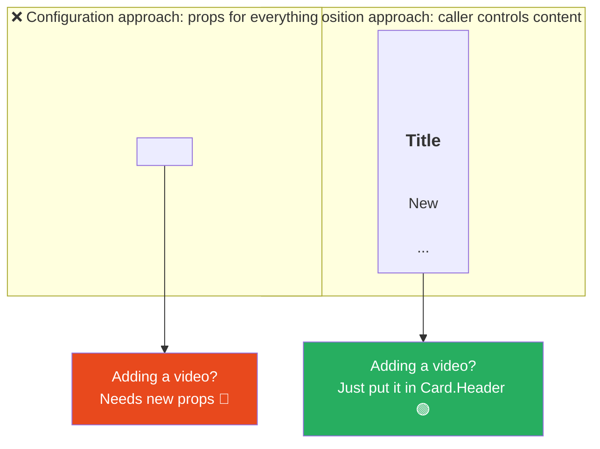
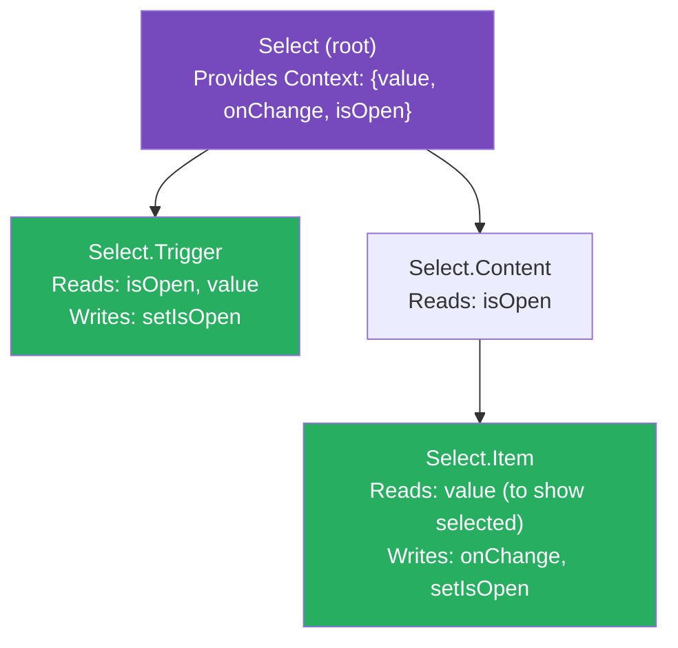

# 102 · Component API Design

> **A component's API is its props interface — the contract between the component and every caller that will ever use it. Good component API design means callers can do what they need to do with minimal friction, mistakes are caught at compile time rather than runtime, and the component's internals can evolve without breaking its consumers. Bad component API design means prop proliferation, boolean flags that conflict, required context knowledge that isn't expressed in types, and the paradox of a "flexible" component that becomes unusable as it accumulates edge cases. This document covers the principles, patterns, and trade-offs of component API design as a discipline — not just React syntax, but the architectural judgment that determines whether a component ages well or becomes technical debt.**

Component API design is often treated as an afterthought — "I'll just add another prop" — until a component has 30 props, seven of which are mutually exclusive, and adding an eighth requires reading 200 lines of source code to understand the interaction. The techniques in this document — composition over configuration, variant props over boolean flags, compound components for complex composition — represent learned patterns from years of engineering experience about what component interfaces withstand scale and what collapses under it.

---

## Table of Contents

- [The Component API as a Contract](#the-component-api-as-a-contract)
- [Composition Over Configuration](#composition-over-configuration)
- [Variant Props vs Boolean Flags](#variant-props-over-boolean-flags)
- [The Polymorphic Component Pattern](#the-polymorphic-component-pattern)
- [Compound Components](#compound-components)
- [Controlled vs Uncontrolled Components](#controlled-vs-uncontrolled-components)
- [Render Props and Function Children](#render-props-and-function-children)
- [Forwarding Refs](#forwarding-refs)
- [Spreading Props and the ...rest Pattern](#spreading-props-and-the-rest-pattern)
- [Slot Pattern: Named Children](#slot-pattern-named-children)
- [Component API Versioning and Backwards Compatibility](#component-api-versioning-and-backwards-compatibility)
- [TypeScript for API Enforcement](#typescript-for-api-enforcement)
- [Architecture Diagrams](#architecture-diagrams)
- [Good Practices](#good-practices)
- [Bad Practices](#bad-practices)
- [Mental Model](#mental-model)
- [Common Misconceptions](#common-misconceptions)
- [Exercises](#exercises)
- [Further Reading](#further-reading)

---

## The Component API as a Contract

```
A COMPONENT API HAS THREE DIMENSIONS:

1. SURFACE: what props does it accept?
   - The named props and their types
   - Required vs optional
   - Default values for optional props

2. SEMANTICS: what do the props MEAN?
   - What does `variant="primary"` imply about appearance AND behavior?
   - Are there combinations that are valid? That are invalid?
   - Which props are purely visual vs which affect accessibility/DOM?

3. STABILITY: what's the commitment to backwards compatibility?
   - Can a prop be renamed without breaking callers?
   - Can a new required prop be added?
   - What's the expected lifecycle of experimental props?

THE DESIGN CRITERIA FOR A GOOD COMPONENT API:
  ✅ PREDICTABLE: callers can guess what a prop does before reading docs
  ✅ COMPOSABLE: the component integrates naturally with others
  ✅ NARROWEST POSSIBLE: accepts only what it actually needs
  ✅ HARD TO MISUSE: invalid combinations are compile-time errors,
     not runtime bugs
  ✅ CONSISTENT: follows conventions established by similar components
  ✅ ESCAPABLE: there's always a way to do what the consumer needs
```

---

## Composition Over Configuration

The most important API design principle: prefer accepting `children` and composition over props that configure what's rendered internally:

```tsx
// ❌ CONFIGURATION APPROACH: component accepts props for every possible element
interface BadCardProps {
  title: string;
  subtitle?: string;
  headerAction?: React.ReactNode;
  imageUrl?: string;
  imageAlt?: string;
  imagePosition?: "top" | "left" | "right";
  footerContent?: React.ReactNode;
  footerActions?: React.ReactNode;
  hasCloseButton?: boolean;
  onClose?: () => void;
  badge?: string;
  badgeVariant?: "info" | "warning" | "error";
}
// Problem: each new layout need requires a new prop.
// The component's internals become a maze of conditional rendering.
// Callers must learn the component's internal layout model
// instead of controlling it directly.

// ✅ COMPOSITION APPROACH: component provides the container, caller controls the content
interface GoodCardProps {
  children: React.ReactNode;
  className?: string;
}

// Caller composes what they need:
function ProductCard({ product }: { product: Product }) {
  return (
    <Card>
      <Card.Image src={product.image} alt={product.name} />
      <Card.Header>
        <h3>{product.name}</h3>
        <Badge variant="info">{product.category}</Badge>
      </Card.Header>
      <Card.Body>{product.description}</Card.Body>
      <Card.Footer>
        <Button>Add to Cart</Button>
        <IconButton icon="heart" aria-label="Wishlist" />
      </Card.Footer>
    </Card>
  );
}
// The caller is in full control of layout and content.
// New requirements (add a video instead of an image, add a custom
// header action) require zero changes to the Card component.
```

---

## Variant Props vs Boolean Flags

```tsx
// ❌ BOOLEAN PROPS FOR VARIANTS — the prop explosion problem:
interface BadButtonProps {
  isPrimary?: boolean;
  isSecondary?: boolean;
  isDanger?: boolean;
  isGhost?: boolean;
  isSmall?: boolean;
  isMedium?: boolean;
  isLarge?: boolean;
  isLoading?: boolean;
  isDisabled?: boolean;
  isFullWidth?: boolean;
}

// PROBLEMS:
// 1. What does isPrimary + isSecondary mean? Both true? Undefined behavior.
// 2. Adding a fifth variant requires a fifth boolean, adding to an
//    already unwieldy list.
// 3. No compile-time enforcement of "pick exactly one variant."
// 4. Callers must read source or docs to know which booleans conflict.

// ✅ VARIANT PROPS — mutually exclusive, type-safe, self-documenting:
type ButtonVariant = "primary" | "secondary" | "danger" | "ghost";
type ButtonSize = "sm" | "md" | "lg";

interface ButtonProps {
  variant?: ButtonVariant; // exactly one variant — enforced by TypeScript
  size?: ButtonSize; // exactly one size — enforced by TypeScript
  isLoading?: boolean; // ok as boolean — only one meaningful "loading" state
  disabled?: boolean; // ok as boolean — only one meaningful "disabled" state
  fullWidth?: boolean; // ok as boolean — only one meaningful "full width" state
}

// Usage:
<Button variant="primary" size="md">
  Click me
</Button>;
// ← TypeScript errors if: variant="superSpecial" (not in union)
//   TypeScript errors if: size={4} (not a string)
// TypeScript is silent (correctly) on: variant="primary" isLoading disabled
//   (these are independent, non-conflicting properties)
```

---

## The Polymorphic Component Pattern

Components that need to render as different HTML elements or components depending on context:

```tsx
// THE PROBLEM:
// <Button> should sometimes render as <a> (for navigation), <button>
// (for actions), or even <Link> (for Next.js routing). The rendered
// element determines which HTML attributes are valid.

// SOLUTION: the `as` prop (polymorphic pattern)
import { ComponentPropsWithRef, ElementType, ReactNode } from 'react';

type PolymorphicProps<C extends ElementType, Props = {}> = Props & {
  as?: C;
} & Omit<ComponentPropsWithRef<C>, keyof Props | 'as'>;

function Button<C extends ElementType = 'button'>({
  as,
  children,
  variant = 'primary',
  className,
  ...rest
}: PolymorphicProps<C, { variant?: ButtonVariant; children: ReactNode }>) {
  const Component = as ?? 'button';
  return (
    <Component
      className={cn('button', `button--${variant}`, className)}
      {...rest}
    >
      {children}
    </Component>
  );
}

// Usage:
<Button>Default button element</Button>
<Button as="a" href="/products">Anchor element — href is now valid!</Button>
<Button as={Link} href="/checkout">Next.js Link — href is required!</Button>
// TypeScript enforces valid props for each element type:
// <Button as="a"> ← knows about href, target, rel
// <Button as="button"> ← knows about type, form, disabled
// <Button as="a" type="submit"> ← TypeScript error: type isn't an 'a' attribute
```

---

## Compound Components

The compound component pattern for complex, multi-part components where sub-parts share implicit state:

```tsx
// The Select component — a complex multi-part component
// that needs shared state between SelectTrigger, SelectContent, and SelectItem

import { createContext, useContext, useState, ReactNode } from "react";

interface SelectContextValue {
  value: string;
  onChange: (value: string) => void;
  isOpen: boolean;
  setIsOpen: (open: boolean) => void;
}

const SelectContext = createContext<SelectContextValue | null>(null);

function useSelectContext() {
  const ctx = useContext(SelectContext);
  if (!ctx)
    throw new Error("Select sub-components must be used within <Select>");
  return ctx;
}

// Root compound component:
function Select({
  value,
  onChange,
  children,
}: {
  value: string;
  onChange: (value: string) => void;
  children: ReactNode;
}) {
  const [isOpen, setIsOpen] = useState(false);
  return (
    <SelectContext.Provider value={{ value, onChange, isOpen, setIsOpen }}>
      <div className="select">{children}</div>
    </SelectContext.Provider>
  );
}

// Sub-components — each accesses shared state via context:
Select.Trigger = function SelectTrigger({ children }: { children: ReactNode }) {
  const { value, isOpen, setIsOpen } = useSelectContext();
  return (
    <button
      onClick={() => setIsOpen(!isOpen)}
      aria-expanded={isOpen}
      aria-haspopup="listbox"
    >
      {children ?? value}
      <Icon name={isOpen ? "chevron-up" : "chevron-down"} />
    </button>
  );
};

Select.Content = function SelectContent({ children }: { children: ReactNode }) {
  const { isOpen } = useSelectContext();
  if (!isOpen) return null;
  return <ul role="listbox">{children}</ul>;
};

Select.Item = function SelectItem({
  value,
  children,
}: {
  value: string;
  children: ReactNode;
}) {
  const ctx = useSelectContext();
  return (
    <li
      role="option"
      aria-selected={ctx.value === value}
      onClick={() => {
        ctx.onChange(value);
        ctx.setIsOpen(false);
      }}
    >
      {children}
    </li>
  );
};

// Caller usage — clean, declarative, flexible:
<Select value={country} onChange={setCountry}>
  <Select.Trigger>Select country</Select.Trigger>
  <Select.Content>
    <Select.Item value="us">United States</Select.Item>
    <Select.Item value="gb">United Kingdom</Select.Item>
    <Select.Item value="ca">Canada</Select.Item>
  </Select.Content>
</Select>;
```

---

## Controlled vs Uncontrolled Components

```tsx
// UNCONTROLLED: the component owns its state; the caller doesn't manage it
// (like a native <input> without value/onChange)
function UncontrolledToggle({
  defaultChecked = false,
  onChange,
}: {
  defaultChecked?: boolean;
  onChange?: (checked: boolean) => void;
}) {
  const [checked, setChecked] = useState(defaultChecked);
  const handleChange = (next: boolean) => {
    setChecked(next);
    onChange?.(next);
  };
  return <Toggle checked={checked} onChange={handleChange} />;
}

// CONTROLLED: the caller owns the state; the component is a "display + event source"
function ControlledToggle({
  checked,
  onChange,
}: {
  checked: boolean;
  onChange: (checked: boolean) => void;
}) {
  return <Toggle checked={checked} onChange={onChange} />;
}

// THE IDEAL: support BOTH — the "headless/uncontrolled with optional control" pattern
function SmartToggle({
  checked: controlledChecked,
  defaultChecked = false,
  onChange,
}: {
  checked?: boolean; // if provided: controlled
  defaultChecked?: boolean; // if checked is absent: uncontrolled default
  onChange?: (checked: boolean) => void;
}) {
  const isControlled = controlledChecked !== undefined;
  const [internalChecked, setInternalChecked] = useState(defaultChecked);
  const checked = isControlled ? controlledChecked : internalChecked;

  const handleChange = (next: boolean) => {
    if (!isControlled) setInternalChecked(next);
    onChange?.(next);
  };

  return <Toggle checked={checked} onChange={handleChange} />;
}

// RULE: if checked is provided, the component is controlled (caller must manage state)
// if checked is absent, the component is uncontrolled (manages its own state)
// onChange fires in BOTH modes — caller can observe changes even in uncontrolled mode
```

---

## Render Props and Function Children

```tsx
// Render props: pass a FUNCTION as children (or any prop) that the component
// calls with internal state — giving callers rendering control with access
// to component-owned state

function HoverCard({
  children,
}: {
  children: (isHovered: boolean) => React.ReactNode;
}) {
  const [isHovered, setIsHovered] = useState(false);
  return (
    <div
      onMouseEnter={() => setIsHovered(true)}
      onMouseLeave={() => setIsHovered(false)}
    >
      {children(isHovered)}
    </div>
  );
}

// Usage:
<HoverCard>
  {(isHovered) => (
    <div
      style={{
        opacity: isHovered ? 1 : 0.7,
        transform: isHovered ? "scale(1.02)" : "none",
      }}
    >
      Hover me for effects
    </div>
  )}
</HoverCard>;

// WHEN RENDER PROPS ARE APPROPRIATE:
//   ✅ The component owns state that the caller needs to render based on
//   ✅ Multiple callers need different rendering of the SAME state
//   ✅ The component provides behavior (hover, focus, infinite scroll trigger)
//      and the caller owns all rendering decisions

// MODERN ALTERNATIVE: custom hooks often replace render props:
function useHover() {
  const [isHovered, setIsHovered] = useState(false);
  const handlers = {
    onMouseEnter: () => setIsHovered(true),
    onMouseLeave: () => setIsHovered(false),
  };
  return [isHovered, handlers] as const;
}

// Usage of the hook alternative:
function MyCard() {
  const [isHovered, hoverHandlers] = useHover();
  return (
    <div {...hoverHandlers} style={{ opacity: isHovered ? 1 : 0.7 }}>
      Hover me
    </div>
  );
}
```

---

## Forwarding Refs

```tsx
// Components that wrap HTML elements must forward refs to allow callers
// to access the underlying DOM element:

import { forwardRef, Ref } from "react";

interface InputProps extends React.InputHTMLAttributes<HTMLInputElement> {
  label?: string;
  error?: string;
}

const Input = forwardRef<HTMLInputElement, InputProps>(function Input(
  { label, error, className, ...rest },
  ref,
) {
  return (
    <div className="input-wrapper">
      {label && <label>{label}</label>}
      <input
        ref={ref} // ← forward the ref to the actual DOM input
        className={cn("input", { "input--error": !!error }, className)}
        {...rest}
      />
      {error && <span className="input__error">{error}</span>}
    </div>
  );
});

// Now callers can control focus and access the DOM element:
function SearchForm() {
  const inputRef = useRef<HTMLInputElement>(null);

  useEffect(() => {
    inputRef.current?.focus(); // ← works because Input forwards the ref
  }, []);

  return (
    <Input ref={inputRef} label="Search" placeholder="Search products..." />
  );
}

// RULE: any component that renders a single root HTML element should forward refs.
// Failing to forward refs forces callers to use workarounds (callback refs on
// wrappers, useImperativeHandle for complex cases).
```

---

## Spreading Props and the ...rest Pattern

```tsx
// The ...rest pattern: accept arbitrary HTML attributes and pass them through,
// without requiring an explicit prop for every possible attribute

interface ButtonProps {
  variant?: ButtonVariant;
  size?: ButtonSize;
  isLoading?: boolean;
  children: React.ReactNode;
}

// Extend HTMLButtonElement's native props, excluding ones we override:
type Props = ButtonProps &
  Omit<React.ButtonHTMLAttributes<HTMLButtonElement>, "children">;

function Button({
  variant = "primary",
  size = "md",
  isLoading,
  children,
  ...rest
}: Props) {
  return (
    <button
      className={cn("button", `button--${variant}`, `button--${size}`)}
      disabled={isLoading || rest.disabled}
      aria-busy={isLoading}
      {...rest} // ← passes aria-*, data-*, type, onClick, id, etc.
    >
      {isLoading ? <Spinner /> : children}
    </button>
  );
}

// Callers can now pass ANY standard button attribute without prop changes:
<Button
  variant="primary"
  type="submit"
  form="checkout-form"
  aria-describedby="price-breakdown"
>
  Place Order
</Button>;
// ← type, form, aria-describedby all passed through via ...rest
```

---

## Slot Pattern: Named Children

For components that need MULTIPLE distinct child insertion points:

```tsx
// A PageLayout component with named slots:
interface PageLayoutSlots {
  header?: React.ReactNode;
  sidebar?: React.ReactNode;
  main: React.ReactNode; // required slot
  footer?: React.ReactNode;
}

function PageLayout({ header, sidebar, main, footer }: PageLayoutSlots) {
  return (
    <div className="page-layout">
      {header && <header className="page-layout__header">{header}</header>}
      <div className="page-layout__body">
        {sidebar && <aside className="page-layout__sidebar">{sidebar}</aside>}
        <main className="page-layout__main">{main}</main>
      </div>
      {footer && <footer className="page-layout__footer">{footer}</footer>}
    </div>
  );
}

// Usage — each slot is a named prop receiving JSX:
function DashboardPage() {
  return (
    <PageLayout
      header={<DashboardHeader />}
      sidebar={<DashboardNav />}
      main={<DashboardContent />}
      footer={<Footer />}
    />
  );
}

// THE NAMED SLOTS PATTERN IS BETTER THAN POSITIONAL CHILDREN WHEN:
//   ✅ Multiple distinct insertion points are needed
//   ✅ Some slots are optional (TypeScript expresses this clearly)
//   ✅ The order of slots in the rendered output doesn't match
//      the natural composition order
//   ✅ The component needs to wrap slots with different styles/semantics
```

---

## Component API Versioning and Backwards Compatibility

```tsx
// Strategies for evolving a component API without breaking callers:

// STRATEGY 1: ADDITIVE ONLY (safest — never break existing callers)
// Add new optional props with defaults that maintain current behavior.
// Never remove or rename existing props.
// Never make an optional prop required.
interface ButtonPropsV1 {
  variant?: "primary" | "secondary";
  children: React.ReactNode;
}
interface ButtonPropsV2 extends ButtonPropsV1 {
  size?: "sm" | "md" | "lg"; // ← new optional prop, no breaking change
  iconLeft?: React.ReactNode; // ← new optional prop, no breaking change
}

// STRATEGY 2: DEPRECATION WITH MIGRATION PATH
// Mark old props as deprecated in JSDoc; support them alongside new API
interface ButtonProps {
  variant?: ButtonVariant;
  /** @deprecated Use `variant="ghost"` instead. Will be removed in v3. */
  isGhost?: boolean;
  children: React.ReactNode;
}

function Button({ variant, isGhost, children }: ButtonProps) {
  // Support the deprecated prop by translating it to the new API:
  const resolvedVariant = isGhost ? "ghost" : variant;
  if (isGhost && process.env.NODE_ENV === "development") {
    console.warn(
      '[Button] `isGhost` is deprecated. Use `variant="ghost"` instead.',
    );
  }
  return <button className={`button--${resolvedVariant}`}>{children}</button>;
}

// STRATEGY 3: MAJOR VERSION BUMP (for large, breaking changes)
// Publish Button v2 as a separate named export alongside Button v1:
export { Button as Button } from "./Button.v1"; // old, maintained
export { Button as ButtonV2 } from "./Button.v2"; // new, recommended
// Teams migrate at their own pace; both versions coexist temporarily.
```

---

## TypeScript for API Enforcement

```tsx
// Use TypeScript to make invalid prop combinations impossible:

// DISCRIMINATED UNIONS for mutually exclusive prop sets:
type IconButtonProps =
  | { icon: React.ReactNode; 'aria-label': string; children?: never }
  | { icon?: never; children: React.ReactNode; 'aria-label'?: string };

function Button({ icon, children, 'aria-label': ariaLabel, ...rest }: IconButtonProps) {
  // TypeScript guarantees: either icon + aria-label, OR children
  // — never both, never neither
}

// Usage:
<Button icon={<HeartIcon />} aria-label="Like" />    // ✅ valid
<Button>Click me</Button>                              // ✅ valid
<Button icon={<HeartIcon />}>Click me</Button>        // ❌ TypeScript error

// REQUIRE RELATED PROPS TOGETHER:
type TooltipProps =
  | { tooltip: string; 'aria-describedby': string }  // both required together
  | { tooltip?: never; 'aria-describedby'?: never };  // or neither

// CONDITIONAL REQUIRED PROPS:
type InputProps = {
  type: 'text' | 'password' | 'email' | 'number';
} & (
  | { type: 'number'; min?: number; max?: number; step?: number }
  | { type: 'text' | 'password' | 'email'; min?: never; max?: never; step?: never }
);
// min/max/step are only valid for type="number" — TypeScript catches misuse.
```

---

## Architecture Diagrams

### Composition over configuration trade-off



### Compound component state sharing via context



---

## Good Practices

### ✅ Good Practice — A well-designed, composable, type-safe component API

```tsx
/**
 * Good: A Dialog component that uses compound components for flexibility,
 * supports both controlled and uncontrolled modes, forwards refs,
 * spreads native attributes, and uses TypeScript to prevent invalid
 * prop combinations.
 */

interface DialogContextValue {
  open: boolean;
  onClose: () => void;
}
const DialogContext = createContext<DialogContextValue | null>(null);

// Root: controlled OR uncontrolled
function Dialog({
  open: controlledOpen,
  defaultOpen = false,
  onClose,
  children,
}: {
  open?: boolean;
  defaultOpen?: boolean;
  onClose?: () => void;
  children: React.ReactNode;
}) {
  const isControlled = controlledOpen !== undefined;
  const [internalOpen, setInternalOpen] = useState(defaultOpen);
  const open = isControlled ? controlledOpen : internalOpen;

  const handleClose = () => {
    if (!isControlled) setInternalOpen(false);
    onClose?.();
  };

  return (
    <DialogContext.Provider value={{ open, onClose: handleClose }}>
      {children}
    </DialogContext.Provider>
  );
}

// Trigger: renders any element as the trigger, no forced styling
Dialog.Trigger = function DialogTrigger({
  children,
}: {
  children: React.ReactElement;
}) {
  const { onClose } = useDialogContext();
  return React.cloneElement(children, {
    onClick: () => {
      /* open logic */
    },
  });
};

// Content: accepts all div attributes + portal target
Dialog.Content = forwardRef<
  HTMLDivElement,
  React.HTMLAttributes<HTMLDivElement>
>(function DialogContent({ children, className, ...rest }, ref) {
  const { open, onClose } = useDialogContext();
  if (!open) return null;
  return createPortal(
    <div
      role="dialog"
      aria-modal
      ref={ref}
      className={cn("dialog", className)}
      {...rest}
    >
      {children}
    </div>,
    document.body,
  );
});
```

---

## Bad Practices

### ⚠️ Bad Practice — Prop explosion and configuration-first design

```tsx
/**
 * Bad: A "flexible" modal that accepted every possible configuration
 * as a prop until it became unusable — requiring users to learn
 * the component's internal layout model instead of controlling it.
 */

// ❌ After 18 months and 12 developers adding features:
interface BadModalProps {
  isOpen: boolean;
  onClose: () => void;
  title?: string;
  subtitle?: string;
  content?: React.ReactNode; // OR body (alias)
  body?: React.ReactNode; // same as content — added by a different dev
  footerActions?: React.ReactNode;
  hasCloseButton?: boolean;
  closeButtonPosition?: "header" | "footer" | "both";
  size?: "sm" | "md" | "lg" | "xl" | "full";
  isFullScreen?: boolean; // overlaps with size="full"
  isScrollable?: boolean;
  maxHeight?: number; // in px?? or rem??
  backdropClosable?: boolean;
  hasBackdrop?: boolean; // what if hasBackdrop=false but backdropClosable=true?
  animation?: "fade" | "slide" | "scale";
  animationDuration?: number;
  showHeader?: boolean; // title is ignored if false — but why pass title then?
  headerContent?: React.ReactNode; // overrides title/subtitle if provided??
  customClass?: string; // OR className??
  className?: string;
  zIndex?: number; // 💀 z-index management in props
}
// This component has 20+ props, at least 5 pairs that conflict,
// and no one on the team is sure what the right combination is
// for any given use case. Docs are 200 lines.

/**
 * ✅ Fix: compound components + minimal config props
 */
interface GoodModalProps {
  open: boolean;
  onClose: () => void;
  size?: "sm" | "md" | "lg";
  children: React.ReactNode;
}
// Modal.Header, Modal.Body, Modal.Footer compound components
// give callers layout control without the API explosion.
// 4 props on the root, unlimited flexibility through composition.
```

**Production impact:** A 26-prop Button component at one company had accrued so many conflicting boolean flags that the design systems team could not safely deprecate any of them without breaking unknown callers. A full audit found 47 usages where 2+ conflicting props were set simultaneously — undefined behavior in production. The component required a v2 rewrite with a compound component API and TypeScript discriminated unions to prevent future conflicts, alongside a 6-month migration period.

---

## Mental Model

> 💡 **The component API mental model:**
>
> Designing a component API is like **designing a power outlet standard**. A poorly designed outlet (15+ prop "slots") requires every device to know the outlet's internal wiring diagram and insert exactly the right plug in exactly the right configuration — any mismatch is an undefined behavior bug. A well-designed outlet (composition pattern) provides a standard interface that any compliant device can use, with the device (caller) responsible for what comes out of it. The three-tier mental model: **configuration props** (variant, size) are the outlet's voltage — fundamental, with a small valid set; **composition** (children, slots) is the plug — open, flexible, caller-controlled; **TypeScript types** are the physical plug shape — a UK plug cannot fit a US outlet, making the wrong combination impossible before you even try it.

---

## Common Misconceptions

### "More props means more flexibility"

More props means more CONFIGURABILITY of the component's internal decisions, which is NOT the same as flexibility. Composition (children, compound components) provides MORE flexibility than props — because the caller controls what renders, not just the parameters of what the component renders. The most flexible component is the one that renders exactly what its children say, not the one with 30 configuration props.

### "Variant props should be limited to a small set"

The `variant` prop is a union type — it can have as many valid values as the design system has variants. What it CANNOT have is undefined behavior from impossible combinations. The key quality is type-safety and exclusivity, not being small.

### "Uncontrolled components are old-fashioned"

Uncontrolled components (managing their own state with optional `defaultValue` and `onChange`) are appropriate for many UI patterns — forms, toggles, accordions — where the caller doesn't need to synchronize state externally. Both controlled AND uncontrolled patterns have their place; the best components often support both.

### "forwardRef makes components more complex without enough benefit"

Any component that renders a root HTML element and doesn't forward its ref is INCOMPLETE for library use — callers need ref access for focus management, measurements, animations, and integration with third-party tools. The complexity of `forwardRef` is approximately 3 additional lines; the cost of omitting it is that callers can't use your component in common patterns.

### "Compound components are only for complex components"

The compound component pattern is most valuable for components with multiple related parts (Select, Dialog, Accordion, Tabs, Menu) — which are common in any design system. For simple components (Button, Badge, Spinner), it's unnecessary. The pattern should be applied where it solves the composition problem, not uniformly.

---

## Exercises

### Exercise 1 — Redesign a boolean-prop-heavy component

Take any component with 5+ boolean props. Identify which booleans represent:

1. Mutually exclusive states → convert to a `variant` union prop
2. Independent states → keep as booleans (this is the right use case)
3. Visual customization → consider if it belongs in the design token / className system

Write the TypeScript interface for the redesigned component.

### Exercise 2 — Implement a compound Accordion

Design and implement an Accordion with:

- `Accordion` root (manages which items are open)
- `Accordion.Item` (one collapsible section)
- `Accordion.Trigger` (the clickable header that toggles the section)
- `Accordion.Content` (the body that shows/hides)

Support both single-item (only one open at a time) and multi-item (multiple open simultaneously) modes via a `type` prop on the root.

### Exercise 3 — Build a controlled + uncontrolled Toggle

Implement a Toggle component that:

1. Works as uncontrolled with `defaultChecked` and `onChange`
2. Works as controlled with `checked` and `onChange`
3. TypeScript correctly infers which mode is active based on props provided
4. Always forwards its ref to the underlying `<button>` element
5. Spreads `...rest` to the underlying button (supporting all standard button attributes)

---

## Further Reading

- [Seb Markbåge: React Component API Design](https://gist.github.com/sebmarkbage/ef0bf1f338a7182b6775) — original thoughts from a React core team member
- [Headless UI](https://headlessui.com/) — a reference implementation of accessible, composable component APIs
- [Radix UI](https://www.radix-ui.com/) — another reference for compound component and composition API patterns
- [Reach UI](https://reach.tech/) — Ryan Florence's accessible component library, influential in compound component patterns
- [React TypeScript Cheatsheet: Patterns](https://react-typescript-cheatsheet.netlify.app/docs/advanced/patterns_by_usecase/) — TypeScript patterns for the polymorphic component, forwardRef, and more
- Related in this handbook: [97 · Atomic Design](../architecture/02-atomic-design.md), [101 · Design Tokens](./01-design-tokens.md)
- Next in this handbook: [103 · Accessibility Engineering](./03-accessibility.md)

---

_Part of the [React + Next.js Engineering Handbook](../../README.md)_
