# 103 · Accessibility Engineering

> **Accessibility (a11y) is the engineering discipline of ensuring digital products work for people with disabilities — visual, auditory, motor, and cognitive. In React/Next.js applications, this means: semantic HTML that screen readers can parse, keyboard navigation that works without a mouse, sufficient color contrast enforced by design tokens, focus management during dynamic content changes, and ARIA attributes that bridge the gap between custom component behavior and assistive technology expectations. Accessibility isn't a feature added at the end of a project — it's a quality dimension woven into component architecture from the start, and it's increasingly both a legal requirement (WCAG 2.1 AA compliance is law in many jurisdictions) and a practical engineering concern that overlaps significantly with SEO, performance, and general code quality.**

Accessibility bugs in production are among the most expensive to fix precisely because they're architectural: a Button implemented as a `<div>` requires not just adding a role, but fixing keyboard events, focus management, and every caller that passed props expecting native button behavior. This document covers what engineering-level accessibility actually requires — beyond the "add an alt attribute" checklists — and focuses on the patterns that make components accessible by design rather than by afterthought.

---

## Table of Contents

- [The Accessibility Tree: How AT Sees Your App](#the-accessibility-tree-how-at-sees-your-app)
- [Semantic HTML: The Foundation](#semantic-html-the-foundation)
- [ARIA: Bridging Custom Behavior to AT](#aria-bridging-custom-behavior-to-at)
- [ARIA Roles, States, and Properties](#aria-roles-states-and-properties)
- [Keyboard Navigation: The Full Contract](#keyboard-navigation-the-full-contract)
- [Focus Management in Dynamic Interfaces](#focus-management-in-dynamic-interfaces)
- [Live Regions: Announcing Dynamic Content](#live-regions-announcing-dynamic-content)
- [Color and Contrast Requirements](#color-and-contrast-requirements)
- [Accessible Form Design](#accessible-form-design)
- [Dialog and Modal Accessibility](#dialog-and-modal-accessibility)
- [Automated Accessibility Testing](#automated-accessibility-testing)
- [The React-Specific Accessibility Patterns](#the-react-specific-accessibility-patterns)
- [Architecture Diagrams](#architecture-diagrams)
- [Good Practices](#good-practices)
- [Bad Practices](#bad-practices)
- [Mental Model](#mental-model)
- [Common Misconceptions](#common-misconceptions)
- [Exercises](#exercises)
- [Further Reading](#further-reading)

---

## The Accessibility Tree: How AT Sees Your App

```
THE DOM vs THE ACCESSIBILITY TREE:
  Browsers build TWO parallel representations of a page:
  1. The DOM: the full HTML structure used for rendering
  2. The Accessibility Tree: a simplified, semantic tree exposed to
     assistive technologies (screen readers, braille displays, switch access)

  The Accessibility Tree is derived FROM the DOM but is NOT identical.
  CSS-hidden elements (display:none) are excluded.
  Elements with role="presentation" are flattened.
  ARIA attributes modify how elements appear in the tree.
  Some HTML elements (e.g., <div>) produce minimal tree nodes by default.

WHAT A SCREEN READER "SEES":
  DOM: <div class="btn primary" onclick="submit()">Submit Order</div>

  Accessibility tree: ???
  (a generic, unnamed container — screen reader may announce it
  as "group" or may not announce it at all; it cannot be focused
  via keyboard; it has no interactive meaning)

  Compare to semantic HTML:
  DOM: <button type="submit">Submit Order</button>

  Accessibility tree:
  role: "button"
  name: "Submit Order"
  state: enabled
  action: press/click
  focusable: yes
  (screen reader announces "Submit Order, button" — complete information)

VIEWING THE ACCESSIBILITY TREE:
  Chrome DevTools → Elements panel → Accessibility tab
  Or: Chrome DevTools → Accessibility pane (toggle on in settings)
  This shows EXACTLY what assistive technology receives — invaluable
  for debugging unexpected screen reader behavior.
```

---

## Semantic HTML: The Foundation

```tsx
// SEMANTIC HTML gives browsers and AT the structural meaning for free:

// ❌ Non-semantic structure (common in component libraries):
<div onClick={handleNav}>Home</div>
<div class="article-container">
  <div class="header">Understanding React</div>
  <div class="body">...</div>
</div>
<div class="btn" onClick={submit}>Subscribe</div>

// ✅ Semantic equivalents (correct accessibility built-in):
<nav><a href="/">Home</a></nav>
<article>
  <h1>Understanding React</h1>
  <p>...</p>
</article>
<button type="submit" onClick={submit}>Subscribe</button>

// SEMANTIC HTML PROVIDES FOR FREE:
//   <button>: keyboard focusable, Enter/Space activation, role=button
//   <a href>: keyboard focusable, Enter activation, role=link, href in tree
//   <h1>-<h6>: heading role, level, participates in heading navigation
//   <nav>: landmark role="navigation", screen reader skip navigation
//   <main>: landmark role="main", "skip to main content" targets this
//   <aside>: landmark role="complementary"
//   <footer>: landmark role="contentinfo"
//   <input type="checkbox">: role=checkbox, checked state, keyboard toggleable
//   <select>: role=combobox/listbox, keyboard navigable

// THE COST OF IGNORING SEMANTICS:
//   Every piece of accessibility that semantic HTML provides for free
//   must be MANUALLY IMPLEMENTED via ARIA when using non-semantic elements.
//   This is the source of the "if you're using ARIA, you're probably
//   doing it wrong" maxim — the need for heavy ARIA is a symptom of
//   failing to use semantic HTML first.
```

---

## ARIA: Bridging Custom Behavior to AT

ARIA (Accessible Rich Internet Applications) is a set of HTML attributes that modify how elements appear in the Accessibility Tree. The first rule of ARIA: don't use ARIA if semantic HTML achieves the same thing:

```tsx
// WHEN ARIA IS APPROPRIATE:
// 1. Custom interactive widgets with no semantic HTML equivalent:
<div
  role="switch"              // "this div IS a toggle switch"
  aria-checked={isOn}        // current state
  tabIndex={0}               // make it keyboard focusable
  onKeyDown={(e) => e.key === 'Enter' && toggle()}
  onClick={toggle}
>
  <span>{isOn ? 'On' : 'Off'}</span>
</div>

// 2. Adding relationships that HTML doesn't express:
<input
  id="email"
  type="email"
  aria-describedby="email-hint email-error" // links to helper text and error
  aria-invalid={!!emailError}               // state: invalid
  aria-required={true}                      // requirement
/>
<p id="email-hint">We'll never share your email.</p>
<p id="email-error" role="alert">{emailError}</p>

// 3. Providing names where visible text is absent:
<button aria-label="Close dialog">
  <XIcon />  {/* icon-only button needs text alternative */}
</button>

<nav aria-label="Product categories"> {/* disambiguates from other <nav>s */}
  {/* ... */}
</nav>
```

---

## ARIA Roles, States, and Properties

```
ARIA ROLES define WHAT an element IS:
  role="button"       → activatable control (use actual <button> instead)
  role="checkbox"     → toggle with checked state
  role="dialog"       → modal dialog container
  role="alert"        → important, time-sensitive message (auto-announced)
  role="alertdialog"  → combination of dialog and alert
  role="menu"         → container for menu items
  role="menuitem"     → item within a menu (activated with Enter)
  role="tab"          → tab in a tablist
  role="tabpanel"     → content associated with a tab
  role="listbox"      → list of selectable options (like a <select>)
  role="option"       → selectable item within a listbox
  role="combobox"     → a combo of input + listbox (searchable select)
  role="tree"         → hierarchical list (like a filesystem tree)
  role="grid"         → a complex data grid

ARIA STATES describe CURRENT CONDITION (can change dynamically):
  aria-checked={true|false|"mixed"}     → for checkboxes, switches, radios
  aria-expanded={true|false}            → for accordions, dropdowns, trees
  aria-selected={true|false}            → for options, tabs, gridcells
  aria-disabled={true|false}            → disabled state (not just visually)
  aria-hidden={true|false}              → removes from accessibility tree
  aria-invalid={true|false}             → for form fields with errors
  aria-pressed={true|false}             → for toggle buttons
  aria-busy={true|false}                → content is updating/loading

ARIA PROPERTIES define STATIC RELATIONSHIPS or CHARACTERISTICS:
  aria-label="Close"                    → provides accessible name (no visible text)
  aria-labelledby="id1 id2"            → name from OTHER element's text
  aria-describedby="hint error"         → additional description from other elements
  aria-controls="panel-id"             → this control manages that element
  aria-haspopup="true|menu|listbox"    → control opens a popup of that type
  aria-live="polite|assertive|off"     → region announces changes to AT
  aria-required={true}                  → field is required
  aria-multiselectable={true}           → multiple selections possible
  aria-setsize={10}                     → total items in a set (for pagination)
  aria-posinset={3}                     → this item's position in the set
```

---

## Keyboard Navigation: The Full Contract

```tsx
// KEYBOARD INTERACTION STANDARDS (from ARIA Authoring Practices Guide):

// MODAL DIALOG:
//   Tab/Shift+Tab: cycle through focusable elements WITHIN the dialog
//   Escape: close the dialog
//   Focus must be TRAPPED inside the dialog while open
//   Focus must return to the TRIGGER when dialog closes

// ACCORDION:
//   Tab: moves focus to next accordion header
//   Enter/Space: toggle the focused panel
//   Arrow keys: optional, but if supported: Down/Right = next, Up/Left = previous

// TABS:
//   Tab: enters/exits the tab list; moves focus to active tab's panel
//   Arrow Left/Right: moves between tabs (AUTOMATIC mode: activates on arrow)
//   Arrow Left/Right: moves between tabs (MANUAL mode: Enter activates)

// MENU/DROPDOWN:
//   Enter/Space/ArrowDown: opens the menu
//   ArrowDown/ArrowUp: navigates between items
//   Enter: activates the focused item
//   Escape: closes the menu, returns focus to trigger
//   Home/End: first/last item

// COMBOBOX (searchable select):
//   Type: filters options, opens list
//   ArrowDown: moves to options list
//   ArrowUp/Down: navigates options
//   Enter: selects focused option
//   Escape: closes list

// IMPLEMENTING TAB TRAPPING FOR DIALOGS:
function useTabTrap(containerRef: RefObject<HTMLElement>, isActive: boolean) {
  useEffect(() => {
    if (!isActive) return;
    const container = containerRef.current;
    if (!container) return;

    const focusableSelectors = [
      "a[href]",
      "button:not([disabled])",
      "input:not([disabled])",
      "select:not([disabled])",
      "textarea:not([disabled])",
      '[tabindex]:not([tabindex="-1"])',
    ].join(", ");

    const focusable = Array.from(
      container.querySelectorAll<HTMLElement>(focusableSelectors),
    );
    const first = focusable[0];
    const last = focusable[focusable.length - 1];

    const handleKeyDown = (e: KeyboardEvent) => {
      if (e.key !== "Tab") return;
      if (e.shiftKey) {
        if (document.activeElement === first) {
          e.preventDefault();
          last.focus();
        }
      } else {
        if (document.activeElement === last) {
          e.preventDefault();
          first.focus();
        }
      }
    };

    container.addEventListener("keydown", handleKeyDown);
    first?.focus(); // move focus into the dialog on open
    return () => container.removeEventListener("keydown", handleKeyDown);
  }, [containerRef, isActive]);
}
```

---

## Focus Management in Dynamic Interfaces

```tsx
// Focus management is required when content changes dynamically in ways
// that could leave a user disoriented:

// 1. AFTER DIALOG OPENS: move focus INTO the dialog
// 2. AFTER DIALOG CLOSES: restore focus to the TRIGGER ELEMENT
function useDialogFocus(isOpen: boolean, triggerRef: RefObject<HTMLElement>) {
  const dialogRef = useRef<HTMLElement>(null);
  const returnFocusRef = useRef<HTMLElement | null>(null);

  useEffect(() => {
    if (isOpen) {
      returnFocusRef.current = document.activeElement as HTMLElement; // save trigger
      dialogRef.current?.focus(); // move focus into dialog
    } else {
      returnFocusRef.current?.focus(); // restore focus to trigger
      returnFocusRef.current = null;
    }
  }, [isOpen]);

  return dialogRef;
}

// 3. AFTER ROUTE CHANGE in Next.js: announce the new page to screen readers
// app/components/RouteAnnouncer.tsx
("use client");
import { usePathname } from "next/navigation";
import { useEffect, useRef } from "react";

export function RouteAnnouncer() {
  const pathname = usePathname();
  const announcerRef = useRef<HTMLElement>(null);

  useEffect(() => {
    // Give the page time to render its <title> or <h1>:
    setTimeout(() => {
      const pageTitle =
        document.title || document.querySelector("h1")?.textContent || pathname;
      if (announcerRef.current) {
        announcerRef.current.textContent = `Navigated to ${pageTitle}`;
      }
    }, 100);
  }, [pathname]);

  return (
    <p
      ref={announcerRef}
      role="status"
      aria-live="polite"
      aria-atomic="true"
      className="sr-only" // visually hidden, readable by screen readers
    />
  );
}

// 4. AFTER ASYNC CONTENT LOADS: announce to screen readers
function SearchResults({ results }: { results: Result[] }) {
  return (
    <>
      <p
        role="status"
        aria-live="polite"
        aria-atomic="true"
        className="sr-only"
      >
        {results.length} results found
      </p>
      <ul>
        {results.map((r) => (
          <ResultItem key={r.id} result={r} />
        ))}
      </ul>
    </>
  );
}
```

---

## Live Regions: Announcing Dynamic Content

```tsx
// aria-live regions cause AT to announce changes without focus movement:

// role="alert" (shorthand for aria-live="assertive" + aria-atomic="true"):
// Use for URGENT updates — error messages, destructive action confirmations
function ErrorBanner({ message }: { message: string }) {
  if (!message) return null;
  return (
    <div role="alert" className="error-banner">
      <Icon name="error" aria-hidden /> {/* hide decorative icon from AT */}
      {message}
    </div>
  );
}

// role="status" (shorthand for aria-live="polite"):
// Use for NON-URGENT updates — success messages, search result counts
function Toast({ message, visible }: { message: string; visible: boolean }) {
  return (
    <div
      role="status"
      aria-live="polite"
      aria-atomic="true"
      // The element must EXIST in the DOM before content is set —
      // dynamically inserting a live region doesn't always announce
    >
      {visible ? message : ""}
    </div>
  );
}

// LIVE REGION PITFALLS:
// ❌ Don't set aria-live on an element AND then insert it into the DOM —
//    the region must be in the DOM BEFORE content changes for reliable announcing
// ❌ Don't use aria-live="assertive" for non-urgent messages — it interrupts
//    whatever the screen reader is currently speaking
// ✅ Always pair aria-atomic="true" with aria-live regions to announce
//    the full content of the region (not just the changed portion)
```

---

## Color and Contrast Requirements

```
WCAG 2.1 CONTRAST REQUIREMENTS:
  LEVEL AA (minimum legal requirement in most jurisdictions):
    Normal text (<18pt or <14pt bold): contrast ratio ≥ 4.5:1
    Large text (≥18pt or ≥14pt bold): contrast ratio ≥ 3:1
    UI components and graphical objects: contrast ratio ≥ 3:1

  LEVEL AAA (enhanced, recommended for specialized contexts):
    Normal text: contrast ratio ≥ 7:1
    Large text: contrast ratio ≥ 4.5:1

CHECKING CONTRAST IN PRACTICE:
  1. Chrome DevTools: pick a color → Accessibility → contrast ratio shown
  2. Figma plugins: Contrast, Able, or built-in contrast checker
  3. axe-core automated testing catches failures programmatically
  4. WebAIM Contrast Checker: webaim.org/resources/contrastchecker/

ENFORCING CONTRAST IN DESIGN TOKENS:
  When building the semantic token system (doc 101), verify EVERY
  text/background token combination meets contrast requirements:

  color.text.primary on color.surface.default: MUST be ≥ 4.5:1
  color.text.secondary on color.surface.default: MUST be ≥ 4.5:1
  color.text.inverse on color.surface.inverse: MUST be ≥ 4.5:1
  color.action.primary on white: MUST be ≥ 3:1 (it's a UI component)
  color.button.primary.text on color.button.primary.bg: MUST be ≥ 4.5:1

  Document and test these combinations; they're not guaranteed by
  visual inspection and must be explicitly verified.

BEYOND CONTRAST:
  ❌ Never rely ONLY on color to convey information:
     "Required fields are shown in red" → also add an asterisk or "(required)" text
     "Errors show in red" → also use an error icon and error text
     "Active tab is blue" → also use underline, bold, or aria-selected
```

---

## Accessible Form Design

```tsx
// Every form input needs:
// 1. A visible, persistent label (not just a placeholder)
// 2. Error messages linked via aria-describedby
// 3. Required fields marked both visually and via aria-required
// 4. Error state communicated via aria-invalid

function FormField({
  id,
  label,
  required,
  error,
  hint,
  children,
}: {
  id: string;
  label: string;
  required?: boolean;
  error?: string;
  hint?: string;
  children: React.ReactElement;
}) {
  const hintId = hint ? `${id}-hint` : undefined;
  const errorId = error ? `${id}-error` : undefined;
  const describedBy = [hintId, errorId].filter(Boolean).join(" ") || undefined;

  return (
    <div className="form-field">
      <label htmlFor={id}>
        {label}
        {required && (
          <span aria-hidden="true" className="required">
            *
          </span>
        )}
        {required && <span className="sr-only"> (required)</span>}
      </label>

      {hint && (
        <p id={hintId} className="form-field__hint">
          {hint}
        </p>
      )}

      {React.cloneElement(children, {
        id,
        "aria-describedby": describedBy,
        "aria-invalid": error ? "true" : undefined,
        "aria-required": required,
        required,
      })}

      {error && (
        <p id={errorId} role="alert" className="form-field__error">
          <Icon name="error" aria-hidden />
          {error}
        </p>
      )}
    </div>
  );
}

// Usage:
<FormField
  id="email"
  label="Email address"
  required
  hint="We'll send your confirmation here"
  error={errors.email}
>
  <input type="email" />
</FormField>;
```

---

## Dialog and Modal Accessibility

```tsx
// An accessible modal requires:
// 1. role="dialog" + aria-modal="true" on the container
// 2. A label via aria-labelledby (pointing to the dialog's heading)
// 3. Focus trapped INSIDE the dialog
// 4. Escape key closes the dialog
// 5. Focus returns to the trigger on close
// 6. Background content is inert (aria-hidden="true" on the rest of the page)

function Modal({
  isOpen,
  onClose,
  title,
  children,
}: {
  isOpen: boolean;
  onClose: () => void;
  title: string;
  children: React.ReactNode;
}) {
  const dialogRef = useRef<HTMLDivElement>(null);
  const titleId = useId(); // React 18+ - generates a unique ID

  // Focus trap and Escape key:
  useEffect(() => {
    if (!isOpen) return;
    const dialog = dialogRef.current;
    if (!dialog) return;

    const previousFocus = document.activeElement as HTMLElement;
    dialog.focus(); // move focus to dialog

    const handleKeyDown = (e: KeyboardEvent) => {
      if (e.key === "Escape") onClose();
    };

    document.addEventListener("keydown", handleKeyDown);

    return () => {
      document.removeEventListener("keydown", handleKeyDown);
      previousFocus?.focus(); // restore focus
    };
  }, [isOpen, onClose]);

  // Make background inert:
  useEffect(() => {
    const mainContent = document.getElementById("main-content");
    if (mainContent) {
      mainContent.inert = isOpen; // HTML inert attribute: fully excludes from AT
      // Also: aria-hidden="true" on background content
      mainContent.setAttribute("aria-hidden", isOpen ? "true" : "false");
    }
    return () => {
      mainContent?.removeAttribute("inert");
      mainContent?.removeAttribute("aria-hidden");
    };
  }, [isOpen]);

  if (!isOpen) return null;

  return createPortal(
    <div className="modal-backdrop" onClick={onClose}>
      <div
        ref={dialogRef}
        role="dialog"
        aria-modal="true"
        aria-labelledby={titleId}
        tabIndex={-1} // allows programmatic focus, excluded from tab order
        className="modal"
        onClick={(e) => e.stopPropagation()} // prevent backdrop click from propagating
      >
        <h2 id={titleId}>{title}</h2>
        <button
          className="modal__close"
          onClick={onClose}
          aria-label="Close dialog"
        >
          <XIcon aria-hidden />
        </button>
        {children}
      </div>
    </div>,
    document.body,
  );
}
```

---

## Automated Accessibility Testing

```tsx
// jest-axe: run axe accessibility analysis in unit tests
import { axe, toHaveNoViolations } from "jest-axe";
expect.extend(toHaveNoViolations);

test("Button has no accessibility violations", async () => {
  const { container } = render(<Button variant="primary">Click me</Button>);
  const results = await axe(container);
  expect(results).toHaveNoViolations();
});

// Testing with specific violation checks:
test("Icon button requires aria-label", async () => {
  const { container } = render(
    <button>
      <XIcon />
    </button>, // ← missing accessible name
  );
  const results = await axe(container);
  // This test is verifying that axe DOES catch the violation:
  expect(results.violations.length).toBeGreaterThan(0);
  expect(results.violations[0].id).toBe("button-name");
});
```

```js
// Playwright: end-to-end accessibility auditing with axe
import AxeBuilder from "@axe-core/playwright";

test("homepage has no accessibility violations", async ({ page }) => {
  await page.goto("/");
  const results = await new AxeBuilder({ page })
    .withTags(["wcag2a", "wcag2aa", "wcag21aa"])
    .analyze();
  expect(results.violations).toEqual([]);
});

// Storybook: automated a11y testing in the browser via @storybook/addon-a11y
// Runs axe on every story — shows violations in the Accessibility panel
// Add to .storybook/main.ts:
// addons: ['@storybook/addon-a11y']
```

```
WHAT AUTOMATED TESTING CATCHES:
  ✅ Missing form labels
  ✅ Insufficient color contrast
  ✅ Missing image alt attributes
  ✅ Invalid ARIA usage (role values, attribute values)
  ✅ Missing required ARIA attributes
  ✅ Interactive elements without accessible names
  ✅ Duplicate IDs

WHAT AUTOMATED TESTING MISSES (requires manual testing):
  ❌ Focus order (logical vs visual order)
  ❌ Screen reader announcement quality
  ❌ Keyboard navigation experience (tab order, trap escape)
  ❌ Motion/animation sensitivity
  ❌ Cognitive load and reading level
  ❌ Context-sensitive meaning (does the announced text make sense in context?)

AUTOMATED TESTING CATCHES ~30-40% OF ACCESSIBILITY ISSUES.
Manual testing with actual AT (VoiceOver, NVDA, JAWS) is required
for genuine WCAG compliance.
```

---

## The React-Specific Accessibility Patterns

```tsx
// 1. useId(): stable IDs for label associations (React 18+)
// BEFORE React 18: engineers generated IDs manually (UUID, counter) —
// prone to hydration mismatches in SSR
// AFTER React 18: useId() generates a stable, SSR-safe ID
function FormField({ label, children }: { label: string; children: React.ReactNode }) {
  const id = useId(); // ← stable across SSR and client
  return (
    <div>
      <label htmlFor={id}>{label}</label>
      {React.cloneElement(children as React.ReactElement, { id })}
    </div>
  );
}

// 2. VISUALLY HIDDEN UTILITY: visible to AT, hidden visually
// (NOT display:none or visibility:hidden — those hide from AT too)
function VisuallyHidden({ children }: { children: React.ReactNode }) {
  return (
    <span
      style={{
        position: 'absolute',
        width: '1px',
        height: '1px',
        padding: 0,
        margin: '-1px',
        overflow: 'hidden',
        clip: 'rect(0, 0, 0, 0)',
        whiteSpace: 'nowrap',
        borderWidth: 0,
      }}
    >
      {children}
    </span>
  );
}
// Usage: <button><HeartIcon /><VisuallyHidden>Add to wishlist</VisuallyHidden></button>

// 3. Skip links: allow keyboard/AT users to skip repetitive navigation
// app/layout.tsx
export default function RootLayout({ children }: { children: React.ReactNode }) {
  return (
    <html lang="en">
      <body>
        <a
          href="#main-content"
          className="skip-link" // visible only on focus (CSS)
        >
          Skip to main content
        </a>
        <nav>{/* ... */}</nav>
        <main id="main-content" tabIndex={-1}>
          {children}
        </main>
      </body>
    </html>
  );
}

// 4. lang attribute: critical for screen reader pronunciation
// app/layout.tsx
<html lang="en"> {/* or "fr", "de", "ja", etc. */}
// Missing lang → screen reader uses its default language → wrong pronunciation
```

---

## Architecture Diagrams

### The accessible form field structure

```mermaid
graph TD
    A["<label htmlFor='email'>Email *<br/><span class='sr-only'> (required)</span></label>"]
    B["<p id='email-hint'>We'll never share your email</p>"]
    C["<input id='email'\n  type='email'\n  aria-describedby='email-hint email-error'\n  aria-invalid='true'\n  aria-required='true'\n/>"]
    D["<p id='email-error' role='alert'>Please enter a valid email</p>"]

    A -->|"htmlFor → id links label to input"| C
    B -->|"aria-describedby links hint to input"| C
    D -->|"aria-describedby links error to input"| C
    D -->|"role='alert' announces immediately"| E["Screen Reader\nAnnounces: 'Please enter a valid email'"]

    style E fill:#27ae60,color:#fff
```



---

## Good Practices

### ✅ Good Practice — A fully accessible custom Select component

```tsx
/**
 * Good: A custom select component implementing the ARIA combobox
 * pattern with full keyboard support, screen reader announcement,
 * focus management, and using useId() for stable associations.
 *
 * In production: use Radix UI Select or Headless UI Select instead
 * of building from scratch — they implement all of this correctly.
 * This example illustrates the requirements.
 */

function AccessibleSelect({
  label,
  options,
  value,
  onChange,
}: {
  label: string;
  options: { value: string; label: string }[];
  value: string;
  onChange: (value: string) => void;
}) {
  const [isOpen, setIsOpen] = useState(false);
  const [activeIndex, setActiveIndex] = useState(-1);
  const listboxId = useId();
  const labelId = useId();
  const buttonRef = useRef<HTMLButtonElement>(null);

  const selectedLabel =
    options.find((o) => o.value === value)?.label ?? "Select...";

  const handleKeyDown = (e: React.KeyboardEvent) => {
    switch (e.key) {
      case "ArrowDown":
        e.preventDefault();
        if (!isOpen) {
          setIsOpen(true);
          setActiveIndex(0);
          break;
        }
        setActiveIndex((i) => Math.min(i + 1, options.length - 1));
        break;
      case "ArrowUp":
        e.preventDefault();
        setActiveIndex((i) => Math.max(i - 1, 0));
        break;
      case "Enter":
      case " ":
        e.preventDefault();
        if (isOpen && activeIndex >= 0) {
          onChange(options[activeIndex].value);
          setIsOpen(false);
          buttonRef.current?.focus();
        } else {
          setIsOpen((o) => !o);
        }
        break;
      case "Escape":
        setIsOpen(false);
        buttonRef.current?.focus();
        break;
      case "Home":
        setActiveIndex(0);
        break;
      case "End":
        setActiveIndex(options.length - 1);
        break;
    }
  };

  return (
    <div className="select">
      <span id={labelId}>{label}</span>
      <button
        ref={buttonRef}
        role="combobox"
        aria-expanded={isOpen}
        aria-haspopup="listbox"
        aria-controls={listboxId}
        aria-labelledby={labelId}
        onKeyDown={handleKeyDown}
        onClick={() => setIsOpen((o) => !o)}
      >
        {selectedLabel}
        <Icon name={isOpen ? "chevron-up" : "chevron-down"} aria-hidden />
      </button>
      {isOpen && (
        <ul id={listboxId} role="listbox" aria-labelledby={labelId}>
          {options.map((option, index) => (
            <li
              key={option.value}
              role="option"
              aria-selected={option.value === value}
              data-active={index === activeIndex}
              onClick={() => {
                onChange(option.value);
                setIsOpen(false);
                buttonRef.current?.focus();
              }}
            >
              {option.label}
            </li>
          ))}
        </ul>
      )}
    </div>
  );
}
```

---

## Bad Practices

### ⚠️ Bad Practice — The classic div-button anti-pattern, with all consequences

```tsx
/**
 * Bad: Using a <div> for interactive elements without any of the
 * accessibility scaffolding that <button> provides natively.
 * This is the single most common accessibility anti-pattern in
 * React codebases — often introduced for "more styling control"
 * or to avoid native button reset styles.
 */

// ❌ The complete list of what's broken:
function BadButton({
  onClick,
  children,
}: {
  onClick: () => void;
  children: React.ReactNode;
}) {
  return (
    <div
      className="my-button"
      onClick={onClick}
      // Missing: role="button" (AT doesn't know it's interactive)
      // Missing: tabIndex={0} (not keyboard focusable)
      // Missing: onKeyDown handler (Enter/Space don't activate it)
      // Missing: aria-disabled support (visual disabled ≠ AT disabled)
      // Missing: type attribute context (won't submit forms)
      // Missing: focus ring styling (likely removed with CSS reset)
    >
      {children}
    </div>
  );
}

// A keyboard user literally cannot use this "button" — it's invisible
// to their Tab key. A screen reader announces it as "group" or skips it.
// A switch access user has no way to activate it.

/**
 * ✅ Fix: use <button>, style it to match the design
 */
function GoodButton({
  onClick,
  children,
}: {
  onClick: () => void;
  children: React.ReactNode;
}) {
  return (
    <button
      type="button"
      className="my-button"
      onClick={onClick}
      // ← ALL of the following are FREE with <button>:
      // tabIndex=0: keyboard focusable automatically
      // role="button": announced as interactive button by AT
      // Enter/Space: activate onClick automatically
      // disabled: properly handled by AT when disabled prop is set
      // focus ring: browsers provide one (enhance/don't remove)
    >
      {children}
    </button>
  );
}

// THE STYLING CONCERN: native <button> styles can be reset completely:
// CSS: all: unset; cursor: pointer; display: inline-flex; /* etc. */
// There is NO legitimate styling reason to use a <div> instead of <button>.
```

---

## Mental Model

> 💡 **The accessibility mental model:**
>
> Accessibility is like **designing a building that works for everyone** — not just people who can use stairs. The HTML semantic elements are the building's structural features: stairs (visual-only navigation), AND ramps (keyboard navigation via tab), AND elevators (skip links and heading navigation), AND clear signage (labels and ARIA names). ARIA attributes are the signage system: when you install a custom door (a `<div>` that acts like a button), ARIA provides the signs that tell visitors what it is and how to use it — without signs, people who rely on them are lost. Automated testing is the building inspector who checks for ramps and rail heights — they catch measurable code violations but can't determine whether the ramp actually leads somewhere useful (which requires real users with disabilities to test). A building that was designed accessible from the start costs roughly the same as one that wasn't; retrofitting accessibility into a completed building is always expensive and often incomplete.

---

## Common Misconceptions

### "Adding alt text to images is enough for accessibility"

Alt text is one requirement among hundreds in WCAG 2.1 AA. A fully accessible application also needs: keyboard navigation, ARIA for custom widgets, color contrast, focus management, live regions, skip links, semantic HTML, form labels, error handling, and more. Alt text is the most visible and commonly cited requirement, but nowhere near sufficient.

### "ARIA always improves accessibility"

Incorrect ARIA is WORSE than no ARIA. If you mark a `<div>` as `role="button"` without implementing keyboard activation (Enter/Space), focus management, and disabled state, you've misled AT users into thinking they can interact with something they can't. The first rule of ARIA: don't use it if you don't need it.

### "Automated accessibility testing tools catch all issues"

Automated tools (axe, Lighthouse) catch approximately 30-40% of WCAG violations — the mechanically detectable ones. The other 60-70% require human judgment, manual keyboard testing, and testing with actual assistive technology. Automation is necessary but not sufficient.

### "Accessibility only matters for blind users"

WCAG covers four categories of disability: visual (low vision, color blindness, blindness), auditory (deafness, hard of hearing), motor (limited fine motor control, paralysis), and cognitive (dyslexia, ADHD, memory impairments). Many accessibility improvements (keyboard navigation, clear labels, consistent layout) benefit ALL users, including those without disabilities.

### "Accessibility is expensive to add"

Accessibility built IN from the start adds approximately 15-30% development time for the initial implementation. Retrofitting accessibility into an inaccessible codebase typically costs 2-5x more than building it correctly the first time, plus carries legal liability for the period it was non-compliant. The cost comparison is almost always in favor of building accessibly from the start.

---

## Exercises

### Exercise 1 — Audit a component with axe

Take any React component in your codebase. Run `jest-axe` or the Chrome DevTools Accessibility panel on it. Document every violation found. Prioritize and fix the critical violations (contrast, missing labels, invalid ARIA). Verify with a screen reader (VoiceOver on macOS is free) that the component is usable.

### Exercise 2 — Build a keyboard-navigable component from scratch

Implement a Tab group (Tabs + TabList + Tab + TabPanel) with full keyboard support:

- Tab key: enters/exits the tab list; moves to active panel
- Left/Right arrows: navigate between tabs (automatic activation mode)
- Focus management: tab panels receive focus when activated
- ARIA: `role="tablist"`, `role="tab"`, `role="tabpanel"`, `aria-selected`, `aria-controls`, `aria-labelledby`

Use the ARIA Authoring Practices Guide as your specification.

### Exercise 3 — Implement a route change announcer

In a Next.js App Router project:

1. Create a `RouteAnnouncer` component (similar to the example in this doc)
2. Add it to `app/layout.tsx`
3. Verify with VoiceOver or a screen reader that navigating between routes announces the new page title
4. Test with a page that has a `<h1>` vs one that only has `<title>` — does both work?

---

## Further Reading

- [WebAIM: Introduction to Web Accessibility](https://webaim.org/intro/) — the most approachable foundation
- [ARIA Authoring Practices Guide](https://www.w3.org/WAI/ARIA/apg/) — the definitive keyboard/ARIA pattern reference
- [WCAG 2.1 Quick Reference](https://www.w3.org/WAI/WCAG21/quickref/) — the official requirements reference
- [axe-core](https://github.com/dequelabs/axe-core) — the engine behind most automated accessibility testing
- [Inclusive Components](https://inclusive-components.design/) — detailed accessible component implementations by Heydon Pickering
- [Headless UI](https://headlessui.com/) and [Radix UI](https://www.radix-ui.com/) — reference accessible component libraries
- [WebAIM: Screen Reader User Survey](https://webaim.org/projects/screenreadersurvey10/) — how real screen reader users navigate the web

---

_Part of the [React + Next.js Engineering Handbook](../../README.md)_
