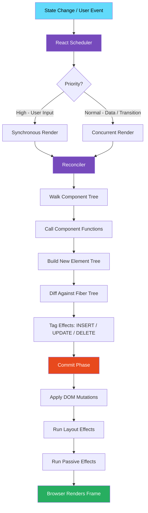
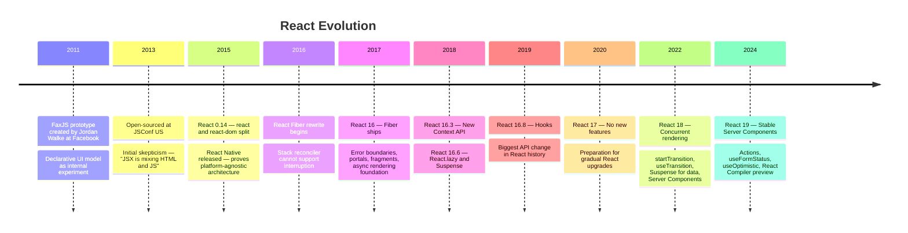
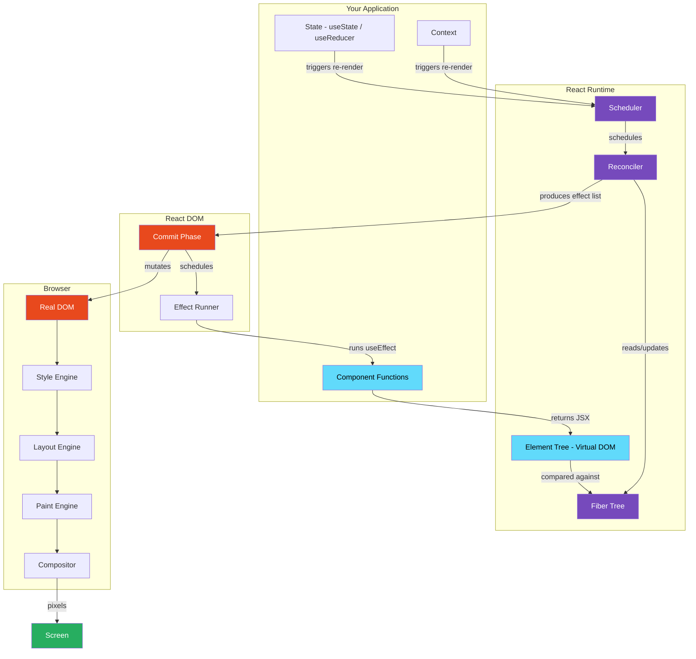

# 01 · What React Actually Is

> **React is a JavaScript runtime that manages a tree of UI descriptions and surgically synchronizes that tree with the browser DOM — using a scheduling system, a diffing algorithm, and an effect model to do so efficiently.**

Most introductions to React describe it as "a JavaScript library for building user interfaces." That is technically true and practically useless. It tells you nothing about _what React actually does_, _why it exists_, or _how it works_.

This document answers the real question: **what is React, as a piece of engineering?**

---

## Table of Contents

- [The Problem React Solves](#the-problem-react-solves)
- [Why Direct DOM Manipulation Does Not Scale](#why-direct-dom-manipulation-does-not-scale)
- [The Imperative vs Declarative Distinction](#the-imperative-vs-declarative-distinction)
- [What React Actually Is at Runtime](#what-react-actually-is-at-runtime)
- [The Three Core Systems Inside React](#the-three-core-systems-inside-react)
- [How React Interacts with the Browser](#how-react-interacts-with-the-browser)
- [The Historical Evolution of React](#the-historical-evolution-of-react)
- [React as a Reactive System](#react-as-a-reactive-system)
- [What React Is Not](#what-react-is-not)
- [Architecture Diagram](#architecture-diagram)
- [Good Practice](#good-practice)
- [Bad Practice](#bad-practice)
- [Mental Model](#mental-model)
- [Common Misconceptions](#common-misconceptions)
- [Exercises](#exercises)
- [Further Reading](#further-reading)

---

## The Problem React Solves

To understand React, you must first understand what engineering problem existed before it.

In 2011, Facebook's frontend team was building increasingly complex UI — the notification badge, the chat sidebar, the news feed. They were using jQuery and standard DOM APIs. The engineering problem they faced was not "we don't know how to show data on screen." The problem was:

**When application state changes, how do you keep the UI consistent with that state — across dozens of UI components — without the code becoming unmanageable?**

Here is a concrete example. Imagine a social feed application with three pieces of state:

1. The logged-in user's name
2. The notification count
3. A list of posts

Those three pieces of state appear in multiple places in the UI:

- The header shows the user's name and notification count
- The sidebar shows the notification count
- The main feed shows posts
- Each post shows the user's name as the author

With imperative DOM manipulation, every time any piece of state changes, you must write code to find every DOM element that depends on it and update it manually:

```js
// Every state change requires you to manually find and update DOM nodes
function onNotificationReceived(count) {
  document.querySelector("#header-badge").textContent = count;
  document.querySelector("#sidebar-badge").textContent = count;
  document.querySelector("#mobile-badge").textContent = count;
  // If you forget one, that element shows stale data. Forever.
  // If the DOM structure changes, this code silently breaks.
}
```

This works for three elements. It does not work for 300. The bugs from missed updates, stale data, and inconsistent UI states were real, expensive, and hard to trace.

> 🏭 **Production Note:** Facebook engineers described this as the "cascading updates" problem — a single user action could trigger dozens of state mutations across the application, and keeping all UI in sync required a fragile web of event handlers and DOM queries. The notification count bug — where the badge showed a different number than the actual unread count — became a notorious internal example.

**React was created to solve this specific problem**: make it impossible for UI to be out of sync with state by making UI a pure function of state.

---

## Why Direct DOM Manipulation Does Not Scale

The DOM (Document Object Model) is the browser's internal representation of your HTML page as a tree of objects. When JavaScript changes the DOM, the browser must do work — sometimes a lot of work.

Understanding _why_ DOM manipulation is expensive requires understanding what the browser does when you change a DOM node.

### What happens when you change a DOM property

```js
// This single line triggers a multi-step browser process
document.querySelector(".user-name").textContent = "Alice";
```

The browser must:

1. **Find the element** — traverse the DOM tree to locate it
2. **Invalidate the render tree** — mark the affected portion as dirty
3. **Recalculate styles** — determine if the change affects computed styles
4. **Reflow (layout)** — recalculate the geometry of affected elements
5. **Repaint** — redraw the affected pixels
6. **Composite** — combine layers and send to the screen

Steps 3–6 are the expensive ones. They happen on the browser's main thread. While they are running, your JavaScript cannot execute. If you trigger many DOM mutations in sequence, these steps accumulate and the UI freezes.

```js
// Dangerous: triggers reflow on every iteration
const items = document.querySelectorAll(".list-item");
items.forEach((item) => {
  item.style.height = item.offsetHeight + 10 + "px"; // READ then WRITE
  // offsetHeight triggers a forced synchronous reflow
  // Then style write triggers another reflow on next iteration
  // 100 items = 100+ reflows = janky, frozen UI
});
```

> 🔬 **Internals:** The browser tries to batch DOM changes and only reflow once per frame. But if you _read_ a layout property (like `offsetHeight`, `getBoundingClientRect()`, `scrollTop`) after a write, you force the browser to flush its pending changes immediately and reflow synchronously — before it is ready. This is called a **forced synchronous layout** or **layout thrashing**, and it is one of the most common causes of UI jank.

The deeper problem is not raw performance — it is **coordination**. As your application grows, you have:

- Many pieces of state
- Many DOM elements that depend on each state
- Complex rules about which state affects which elements
- Multiple events that can trigger state changes simultaneously

Writing correct imperative DOM code for this complexity requires superhuman bookkeeping. Engineers make mistakes. Bugs accumulate. The codebase becomes impossible to reason about.

---

## The Imperative vs Declarative Distinction

This is the most important conceptual shift in React, and it is worth explaining precisely.

### Imperative UI: describe _how_ to change the UI

```js
// Imperative: you describe the steps
function showUserLoggedIn(user) {
  const header = document.getElementById("header");
  const avatar = document.createElement("img");
  avatar.src = user.avatarUrl;
  avatar.className = "avatar";

  const name = document.createElement("span");
  name.textContent = user.name;

  const logoutBtn = document.createElement("button");
  logoutBtn.textContent = "Log out";
  logoutBtn.addEventListener("click", handleLogout);

  header.innerHTML = ""; // clear existing content
  header.appendChild(avatar);
  header.appendChild(name);
  header.appendChild(logoutBtn);
}

function showUserLoggedOut() {
  const header = document.getElementById("header");
  const loginBtn = document.createElement("button");
  loginBtn.textContent = "Log in";
  loginBtn.addEventListener("click", handleLogin);

  header.innerHTML = "";
  header.appendChild(loginBtn);
}
```

You describe _every step_ of the transition. You are responsible for:

- Creating the right elements
- Removing the old ones
- Attaching the right event listeners
- Not leaking event listeners from removed elements
- Not forgetting to handle every possible state transition

### Declarative UI: describe _what_ the UI should look like

```jsx
// Declarative: you describe the desired end state
function Header({ user }) {
  if (user) {
    return (
      <header>
        
        <span>{user.name}</span>
        <button onClick={handleLogout}>Log out</button>
      </header>
    );
  }

  return (
    <header>
      <button onClick={handleLogin}>Log in</button>
    </header>
  );
}
```

You describe _what the UI should look like_ for a given state. You do not describe the transition steps. React figures out the minimum DOM changes needed to get from the current UI to the desired UI.

This is the core value proposition: **the developer describes state → UI mappings; React handles UI → DOM synchronization**.

> 💡 **Mental Model:** Think of it like a GPS. Imperative programming is giving turn-by-turn directions: "turn left, then right, then go 200 meters." Declarative programming is giving the destination: "take me to 123 Main Street." React is the GPS — you give it the destination (the UI you want), and it figures out the route (the DOM mutations needed).

---

## What React Actually Is at Runtime

When your Next.js or React application runs in the browser, here is what actually exists in memory:

### 1. Your component functions

Plain JavaScript functions. They take props as input and return a description of UI as output (JSX, which compiles to `React.createElement` calls).

```jsx
// This is just a JavaScript function
function Button({ label, onClick }) {
  return <button onClick={onClick}>{label}</button>;
  // Compiles to: React.createElement('button', { onClick }, label)
}
```

### 2. The React element tree (Virtual DOM)

A plain JavaScript object tree describing what the UI should look like. Created fresh on every render. Lightweight — just objects, not real DOM nodes.

```js
// This is what JSX compiles to — plain objects
{
  type: 'button',
  props: {
    onClick: [Function],
    children: 'Submit'
  }
}
```

### 3. The Fiber tree

React's internal working data structure. One Fiber node per component/element. Persists between renders (unlike the element tree which is recreated). Stores component state, effects, and work-in-progress rendering data.

### 4. The Reconciler

The algorithm that compares the new element tree against the existing Fiber tree and determines the minimum set of DOM mutations required. This is where React's diffing logic lives.

### 5. The Scheduler

Decides _when_ to do rendering work. Allows React to interrupt rendering in the middle of the tree, pause, and resume later — which is the foundation of concurrent React features.

### 6. The Renderer (react-dom)

The platform-specific layer that takes the reconciler's output (a list of DOM mutations) and applies them to the actual browser DOM. React Native uses a different renderer. React Three Fiber uses another.

> 🔬 **Internals:** This separation between the Reconciler and the Renderer is intentional. The reconciler is platform-agnostic — it only works with Fiber nodes and produces effect lists. The renderer is what knows about `document.createElement` and `appendChild`. This is why React can render to DOM, native, canvas, PDF, terminal output, and more — the core reconciliation logic is shared.

---

## The Three Core Systems Inside React

Every render that React does flows through three coordinated systems:

### System 1: The Reconciler (react-reconciler)

**What it does:** Compares the previous UI description (Fiber tree) with the new one (React element tree from your component functions) and produces a list of changes.

**Key operations:**

- Walks the component tree calling your component functions
- Creates or reuses Fiber nodes
- Runs the diffing algorithm on element trees
- Tags fibers with effects (insert, update, delete)

### System 2: The Scheduler (@react/scheduler)

**What it does:** Manages _when_ the reconciler runs and with what priority. Prevents long renders from blocking user input.

**Key operations:**

- Assigns priority levels to updates (user input = high priority, data fetch = normal priority)
- Time-slices rendering work into small chunks (5ms per chunk by default)
- Yields control back to the browser between chunks
- Resumes rendering in the next idle period

### System 3: The Renderer (react-dom / react-native)

**What it does:** Takes the output of the reconciler (tagged fibers with effects) and applies them to the host environment (browser DOM, native views, etc.)

**Key operations:**

- Creates real DOM nodes from fiber data
- Updates DOM properties
- Attaches event listeners
- Runs layout effects (`useLayoutEffect`)
- Schedules passive effects (`useEffect`)



---

## How React Interacts with the Browser

React does not bypass the browser. It works _with_ the browser's rendering engine. Understanding where React ends and the browser begins is critical for performance engineering.

### React's responsibility:

- Decide _what_ DOM changes are needed (reconciliation)
- Decide _when_ to apply them (scheduling)
- Apply them in a single, batched commit (commit phase)

### Browser's responsibility:

- Turn DOM mutations into pixels on screen (style → layout → paint → composite)
- Handle native events and route them to React's event system
- Manage memory for DOM nodes

### The boundary between them:

```
Your React Code
     ↓
React Runtime (Reconciler + Scheduler)
     ↓
  react-dom (Renderer)
     ↓  ← This line is where React stops and the browser starts
Browser DOM API (document.createElement, appendChild, etc.)
     ↓
Browser Rendering Engine (Blink, WebKit, Gecko)
     ↓
GPU
     ↓
Screen
```

React's rendering work happens in JavaScript on the main thread. The browser's painting and layout work also happens on the main thread. They compete for the same thread time. This is why React's scheduler is important — it yields control back to the browser between rendering chunks so that layout and paint can happen, keeping the frame rate at 60fps.

> 🔬 **Internals:** React 18 uses `MessageChannel` to schedule rendering work between frames. It posts a message to itself and handles it in the next task queue slot — after the browser has had a chance to paint the current frame. Before React 18, it used `postMessage` and `requestAnimationFrame` combinations. This is what "yielding to the browser" means at the implementation level.

---

## The Historical Evolution of React

Understanding how React evolved explains _why_ it is designed the way it is.



### The Stack Reconciler (pre-2016)

The original React used a recursive, synchronous reconciler called the "stack reconciler." When a component updated, React recursively called every child component's render function in a single synchronous call stack.

**The fatal limitation:** Once started, it could not be interrupted. If a large component tree took 50ms to reconcile, the browser was blocked for 50ms. No user interactions could be processed. No frames could be painted. The UI froze.

```
// Stack reconciler behavior (simplified)
function reconcile(component) {
  component.render(); // synchronous
  component.children.forEach(child => {
    reconcile(child); // recursive, cannot stop
  });
}
// If this takes 50ms, the browser is completely blocked for 50ms
```

### Why Fiber Was The Answer

React Fiber (2017) replaced the recursive stack with an iterative loop over a linked list of Fiber nodes. This made rendering **interruptible** — React could process one Fiber node, check if higher-priority work had arrived, and pause if needed.

This was the foundational change that made concurrent rendering, time slicing, Suspense, and eventually React Server Components possible.

> 🏭 **Production Note:** React 16 with Fiber shipped with synchronous rendering by default — the concurrent features were infrastructure only. The actual concurrent APIs (startTransition, etc.) did not ship until React 18, two years after the underlying Fiber infrastructure was built. This tells you how carefully the React team tests large infrastructure changes before exposing them.

---

## React as a Reactive System

React is often called "reactive," but this word is used loosely. Here is what it actually means in React's case.

In a reactive system, **state changes automatically propagate to dependent computations**. In React:

- **State** is the source of truth (held in component state and context)
- **The UI** is a dependent computation — a pure function of state
- When state changes, React automatically re-runs the computation (re-renders the component) and updates the UI

```
State → (React runtime) → UI

When state changes:
New State → React detects change → Re-renders affected components → UI updates
```

This is different from observable-based reactivity (like MobX or Solid.js) where individual values are tracked at a granular level. React is **component-level reactive** — when state changes, the entire component function re-runs. React then determines through reconciliation whether the DOM actually needs to change.

> 🔬 **Internals:** React does not track which DOM elements depend on which state properties. It re-runs the entire component function and uses reconciliation to find the delta. This "re-run everything, diff the result" model is simpler to reason about but requires memoization to be efficient at scale. This is why `useMemo`, `useCallback`, and `React.memo` exist.

---

## What React Is Not

Clearing up common misunderstandings:

### React is not a framework (traditionally)

React is a UI library. It handles component rendering and state synchronization. It does not handle routing, data fetching, form management, server communication, or build optimization by default. Next.js, Remix, and similar tools build the full framework around React.

### React is not a virtual DOM library

The virtual DOM is an implementation detail, not the feature. React's value is the declarative component model and the rendering system. The virtual DOM is _how_ it achieves efficient DOM synchronization — not the point.

### React is not the same as react-dom

`react` contains the component model, hooks, and reconciler logic. `react-dom` is the browser-specific renderer. This separation exists so that the same React logic works in React Native, React Three Fiber, and other environments.

### React's virtual DOM is not always faster than the real DOM

Reconciliation has a cost. For very simple UIs, direct DOM manipulation can be faster. React's value is developer productivity and maintainability at scale, not raw DOM manipulation speed.

---

## Architecture Diagram



---

## Good Practice

### ✅ Good Practice — Treat UI as a pure function of state

```tsx
/**
 * Good: UI is derived entirely from state and props.
 * React controls all DOM mutations through re-renders.
 * No manual DOM queries or mutations needed.
 */
function NotificationBadge({ count }: { count: number }) {
  if (count === 0) return null;

  return (
    <span className="badge" aria-label={`${count} notifications`}>
      {count > 99 ? "99+" : count}
    </span>
  );
}

// Usage: React handles DOM updates when count changes
// <NotificationBadge count={unreadCount} />
```

**Why this works:** The component is a pure function. The same input always produces the same output. React can safely re-render it at any time and the UI will always be correct. No stale DOM state is possible.

**The tradeoff:** Every state change re-runs this function. For inexpensive components this is negligible. For expensive computations, `React.memo` or `useMemo` can prevent unnecessary re-execution.

---

## Bad Practice

### ⚠️ Bad Practice — Mixing React state with manual DOM mutations

```tsx
/**
 * Bad: Manually querying and mutating the DOM alongside React state.
 * Creates two sources of truth that can drift out of sync.
 */
function NotificationBadge({ count }: { count: number }) {
  useEffect(() => {
    // ❌ Manually finding and mutating a DOM element outside React's control
    const badge = document.getElementById("sidebar-badge");
    if (badge) {
      badge.textContent = count.toString();
      badge.style.display = count > 0 ? "block" : "none";
    }
  }, [count]);

  return <span id="header-badge">{count}</span>;
}
```

**What happens:** React controls `#header-badge` and the sidebar badge is controlled by imperative DOM code. If the sidebar is also a React component that renders, React will overwrite your manual DOM changes. If it is not a React component, you now have no mechanism to ensure it stays in sync with the rest of your application state.

**Production impact:** Race conditions between React renders and manual mutations. Stale UI after component unmount (the effect runs but the badge element may have been removed by React elsewhere). Memory leaks if event listeners are attached manually without cleanup.

---

## Mental Model

> 💡 **The core mental model for React:**
>
> Your component functions are **equations**, not **instructions**. `UI = f(state)` — your job is to write `f`. React's job is to call `f` when `state` changes, compare the result against the previous result, and update the DOM with only what changed.
>
> You never touch the DOM directly. You only update state. React handles everything between state and screen.

---

## Common Misconceptions

### "React re-renders means the DOM updates"

Not necessarily. React re-renders means your component function runs again. The DOM only updates if reconciliation finds a difference between the old and new element trees. React can call your component function 10 times and make zero DOM mutations if the output is the same.

### "The Virtual DOM makes React fast"

The Virtual DOM adds overhead compared to targeted DOM mutations. React's speed advantage comes from batching, scheduling, and smart diffing — not from the virtual DOM itself. Direct DOM manipulation can be faster for simple cases.

### "React is reactive like a spreadsheet"

A spreadsheet recalculates individual cells when their dependencies change. React re-runs entire component functions when their state changes and then diffs the output. It is component-level reactive, not value-level reactive.

### "useEffect runs after every render"

`useEffect` runs after every render _where its dependencies changed_, after the browser has painted. Not after every render, and not synchronously after DOM mutation.

---

## Exercises

### Exercise 1 — Trace a state update

Open the React DevTools Profiler. Build a counter component. Click the increment button. Capture a profiling session. Identify: which components re-rendered, why they re-rendered, and how long each render took.

### Exercise 2 — Identify the abstraction boundary

In a simple React app, open Chrome DevTools → Performance tab. Record a few state changes. Find where React's JavaScript execution ends and the browser's "Rendering" work begins. Identify the names of React's internal functions in the call stack.

### Exercise 3 — Compare imperative vs declarative

Build the same notification badge feature twice:

1. Imperatively using `document.getElementById` and direct property mutation
2. Declaratively as a React component

Deliberately introduce a bug in the imperative version by missing one update site. Observe how the declarative version cannot have the same class of bug.

---

## Further Reading

- [React Source: ReactElement.js](https://github.com/facebook/react/blob/main/packages/react/src/jsx/ReactJSXElement.js) — How React elements are created
- [React Source: ReactFiber.js](https://github.com/facebook/react/blob/main/packages/react-reconciler/src/ReactFiber.js) — Fiber node structure
- [Original Fiber design document](https://github.com/acdlite/react-fiber-architecture) by Andrew Clark
- [Pete Hunt's JSConf EU 2013 talk](https://www.youtube.com/watch?v=x7cQ3mrcKaY) — React's original introduction
- Next in this handbook: [02 · JSX Transformation & Runtime](./02-jsx-transformation.md)

---

_Part of the [React + Next.js Engineering Handbook](../../README.md)_
