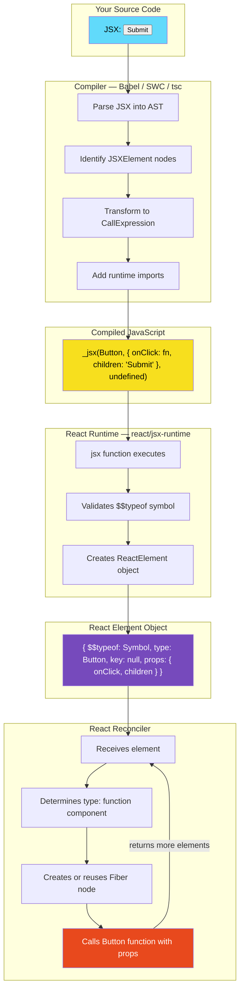

# 02 · JSX Transformation & Runtime

> **JSX is not a templating language. It is syntactic sugar that compiles to plain JavaScript function calls — producing lightweight object descriptions of UI that React's runtime consumes to build and update the DOM.**

When you write `<Button label="Submit" />`, you are not writing HTML. You are not invoking magic. You are writing a shorthand that your build tool transforms into a JavaScript function call before your code ever reaches the browser. Understanding this transformation completely — and what happens to those objects at runtime — dissolves a large class of React confusion.

---

## Table of Contents

- [What JSX Actually Is](#what-jsx-actually-is)
- [The Classic Transform: React.createElement](#the-classic-transform-reactcreateelement)
- [The New JSX Transform (React 17+)](#the-new-jsx-transform-react-17)
- [Anatomy of a React Element Object](#anatomy-of-a-react-element-object)
- [How the Runtime Processes Elements](#how-the-runtime-processes-elements)
- [JSX Expressions and JavaScript Interop](#jsx-expressions-and-javascript-interop)
- [Component Types in JSX](#component-types-in-jsx)
- [JSX Compilation Edge Cases](#jsx-compilation-edge-cases)
- [Children: The Full Picture](#children-the-full-picture)
- [Keys at the Transform Level](#keys-at-the-transform-level)
- [Fragments](#fragments)
- [What Babel and SWC Do](#what-babel-and-swc-do)
- [Architecture Diagram](#architecture-diagram)
- [Good Practice](#good-practice)
- [Bad Practice](#bad-practice)
- [Mental Model](#mental-model)
- [Common Misconceptions](#common-misconceptions)
- [Exercises](#exercises)
- [Further Reading](#further-reading)

---

## What JSX Actually Is

JSX stands for JavaScript XML. It was created by the React team as a syntax extension to JavaScript — not a separate language, not a template engine, not HTML embedded in JavaScript.

The key insight: **JSX files cannot run in any JavaScript engine directly.** Your browser does not understand JSX. Node.js does not understand JSX. Before your code runs anywhere, a compiler (Babel, SWC, TypeScript, or esbuild) transforms every JSX expression into standard JavaScript.

JSX exists for one reason: **developer ergonomics**. It makes UI structure visually obvious at a glance. Without it, React code would look like this:

```js
// What you would write without JSX
React.createElement(
  "div",
  { className: "container" },
  React.createElement("h1", null, "Hello"),
  React.createElement(
    "p",
    { style: { color: "blue" } },
    "Welcome, ",
    React.createElement("strong", null, userName),
  ),
);
```

With JSX:

```jsx
// What you write with JSX — same output after compilation
<div className="container">
  <h1>Hello</h1>
  <p style={{ color: "blue" }}>
    Welcome, <strong>{userName}</strong>
  </p>
</div>
```

The JSX version is not more powerful. It is not doing anything different. It compiles to exactly the nested `React.createElement` calls above. The benefit is purely readability and the ability to visually parse component trees at a glance.

---

## The Classic Transform: React.createElement

Before React 17, every JSX file required `import React from 'react'` at the top — even if you never explicitly called any React APIs. This confused newcomers endlessly.

The reason: JSX compiled to `React.createElement(...)` calls, which required `React` to be in scope.

### Single element

```jsx
// Input: JSX
const element = <div className="box">Hello</div>;

// Output: Classic transform
const element = React.createElement(
  "div", // type: string for DOM elements
  { className: "box" }, // props object
  "Hello", // children (rest arguments)
);
```

### Nested elements

```jsx
// Input
const element = (
  <section>
    <h1>Title</h1>
    <p>Body text</p>
  </section>
);

// Output
const element = React.createElement(
  "section",
  null, // no props → null, not {}
  React.createElement("h1", null, "Title"),
  React.createElement("p", null, "Body text"),
);
```

### Component element

```jsx
// Input: Component (capital letter)
const element = (
  <Button variant="primary" onClick={handleClick}>
    Submit
  </Button>
);

// Output
const element = React.createElement(
  Button, // type: the component function/class itself (not a string)
  { variant: "primary", onClick: handleClick },
  "Submit",
);
```

> 🔬 **Internals:** The capital letter convention in JSX is not arbitrary style. It is a semantic signal to the compiler. Lowercase tags (`div`, `span`, `button`) compile to string types. Capitalized identifiers (`Button`, `MyComponent`) compile to the JavaScript variable itself — the actual function or class. This is why components must start with a capital letter: a lowercase component would compile to a string, and React would look for a DOM element named `button` instead of your component.

### The React.createElement signature

```ts
React.createElement(
  type: string | ComponentType,  // DOM tag or component reference
  props: object | null,           // all props including key and ref
  ...children: ReactNode[]        // zero or more children
): ReactElement
```

The `props` argument contains everything except `key` and `ref`, which React extracts and handles specially.

---

## The New JSX Transform (React 17+)

React 17 introduced a new JSX transform that eliminated the need to import React in every file. It also changed the underlying function calls for performance and correctness reasons.

### How it works

Instead of compiling to `React.createElement`, the new transform imports helper functions directly from `react/jsx-runtime`:

```jsx
// Input (React 17+ with new transform)
const element = <div className="box">Hello</div>;

// Output: New transform
import { jsx as _jsx } from "react/jsx-runtime";

const element = _jsx("div", {
  className: "box",
  children: "Hello",
});
```

### Key differences from the classic transform

**1. Children are in the props object, not rest arguments**

```jsx
// Input
<ul>
  <li>One</li>
  <li>Two</li>
</ul>;

// Classic transform output
React.createElement(
  "ul",
  null,
  React.createElement("li", null, "One"), // children as rest args
  React.createElement("li", null, "Two"),
);

// New transform output
import { jsxs as _jsxs, jsx as _jsx } from "react/jsx-runtime";

_jsxs("ul", {
  children: [
    // children inside props
    _jsx("li", { children: "One" }),
    _jsx("li", { children: "Two" }),
  ],
});
```

**2. `jsx` vs `jsxs` vs `jsxDEV`**

The new transform uses different functions depending on context:

| Function | When Used                                        |
| -------- | ------------------------------------------------ |
| `jsx`    | Single child                                     |
| `jsxs`   | Multiple children (static array)                 |
| `jsxDEV` | Development mode (includes source location info) |

> 🔬 **Internals:** The `jsxs` / `jsx` split exists because a single child and multiple children have different internal handling. When children is an array, React needs to reconcile a list. When children is a single value, it does not. Using separate functions lets the runtime skip array-handling logic for single children.

**3. `key` is extracted at compile time, not runtime**

In the new transform, `key` is always passed as a separate argument — never inside the props object — even if you write `key={...}` as a JSX attribute:

```jsx
// Input
<li key={item.id}>{item.name}</li>;

// New transform output
_jsx("li", { children: item.name }, item.id); // key is 3rd argument
```

This is a correctness improvement. In the classic transform, `key` was inside `props` and React had to extract it at runtime every time. Now the compiler extracts it once, at build time.

### Configuring the transform

```json
// tsconfig.json — TypeScript
{
  "compilerOptions": {
    "jsx": "react-jsx" // new transform
    // vs "react"       // classic transform
  }
}
```

```json
// .babelrc — Babel
{
  "presets": [
    [
      "@babel/preset-react",
      {
        "runtime": "automatic" // new transform
        // vs "classic"         // old transform
      }
    ]
  ]
}
```

---

## Anatomy of a React Element Object

After compilation and runtime execution, `React.createElement` (or `_jsx`) returns a plain JavaScript object. This object is called a **React element**. It is not a DOM node. It is not a component instance. It is a description — a blueprint.

Here is the actual shape of a React element:

```ts
// The ReactElement type (simplified from React source)
interface ReactElement {
  $$typeof: Symbol; // Symbol(react.element) — security marker
  type: string | Function; // 'div' | Button | React.Fragment
  key: string | null; // from key prop, coerced to string
  ref: Ref | null; // from ref prop
  props: {
    // All props except key and ref
    children?: ReactNode | ReactNode[];
    [propName: string]: any;
  };
  _owner: Fiber | null; // DEV only: which fiber created this
  _store: {}; // DEV only: validation store
}
```

### The `$$typeof` field

```js
// React elements always have this field
element.$$typeof === Symbol.for("react.element"); // true
```

This exists as a **security measure**. React reads elements from various sources — sometimes including user-provided data stored in databases. If an attacker could inject an object shaped like a React element into your app's data, they could potentially execute arbitrary components.

`Symbol` values cannot be serialized to JSON, which means they cannot come from a server response or localStorage. React checks `$$typeof` before treating any object as a renderable element. If the symbol is missing, React refuses to render it.

> 🔬 **Internals:** This defense was added after a class of XSS vulnerability was discovered where React could be tricked into rendering attacker-controlled component types. The fix (adding `$$typeof`) is transparent to developers but is checked in `ReactDOM.render` and the reconciler's `createFiberFromElement`. See [this blog post by Dan Abramov](https://overreacted.io/why-do-react-elements-have-typeof-property/) for the full story.

### Elements are immutable and disposable

React elements are created fresh on every render. They are not cached between renders. They are not reused. They are:

1. Created by your component function (via JSX)
2. Read by the reconciler for one render cycle
3. Garbage collected after the reconciler is done with them

The **Fiber tree** persists between renders. React elements do not. This is a crucial distinction for understanding React's memory model.

---

## How the Runtime Processes Elements

When React receives a React element (either at the root via `createRoot().render()` or as a component's return value), it processes it through the reconciler.

### Step 1: Determine the element type

```js
// Inside the reconciler (simplified)
function createFiberFromElement(element) {
  const type = element.type;

  if (typeof type === "string") {
    // Host component: 'div', 'span', 'button'
    return createFiberFromHostComponent(type, element.props);
  }

  if (typeof type === "function") {
    if (type.prototype?.isReactComponent) {
      // Class component
      return createFiberFromClassComponent(type, element.props);
    }
    // Function component
    return createFiberFromFunctionComponent(type, element.props);
  }

  if (type === React.Fragment) {
    return createFiberFromFragment(element.props.children);
  }

  // ... other types: Suspense, Context.Provider, Lazy, etc.
}
```

### Step 2: Create or reuse a Fiber node

If this is the first render, the reconciler creates a new Fiber node. On subsequent renders, it tries to find an existing Fiber node to reuse (based on element type and position in the tree).

### Step 3: Process children recursively

The reconciler reads `element.props.children` and processes each child element the same way — creating or reusing Fiber nodes for each one.

### Step 4: For function components — call the function

```js
// Simplified: how React calls your component
function renderFunctionComponent(fiber) {
  const props = fiber.pendingProps;

  // Set current fiber so hooks know which component they belong to
  ReactCurrentDispatcher.current = HooksDispatcher;
  currentlyRenderingFiber = fiber;

  // Call your component function — this is what runs your JSX
  const children = fiber.type(props); // fiber.type is your function

  currentlyRenderingFiber = null;

  return children; // the React elements your function returned
}
```

This is why hooks must be called inside component functions — `currentlyRenderingFiber` is set during the function call and reset immediately after. Any hook call outside that window has no fiber to attach to.

---

## JSX Expressions and JavaScript Interop

JSX is embedded in JavaScript, so any JavaScript expression can be used inside JSX with curly braces `{}`.

### What can go inside `{}`

```jsx
// String
<p>{"Hello"}</p>

// Number (renders as text)
<span>{42}</span>

// Variable
<span>{userName}</span>

// Function call
<span>{formatDate(timestamp)}</span>

// Ternary expression
<div>{isLoading ? <Spinner /> : <Content />}</div>

// Logical AND (conditional rendering)
<div>{hasError && <ErrorMessage error={error} />}</div>

// Array of elements
<ul>{items.map(item => <li key={item.id}>{item.name}</li>)}</ul>

// Template literal
<p>{`Welcome, ${userName}!`}</p>
```

### What renders to nothing

```jsx
// These values render nothing — no DOM output, no error
<div>{false}</div>
<div>{null}</div>
<div>{undefined}</div>

// ⚠️ BUT: 0 renders as the character "0" — common gotcha
<div>{0}</div>        // renders: 0
<div>{0 && <Item />}</div>  // ⚠️ renders: 0 (not nothing!)
```

> ⚠️ **Anti-Pattern:** Using `count && <Component />` when `count` might be `0`. Since `0` is falsy but also a renderable value (it renders as the text "0"), this pattern produces a visible "0" in your UI instead of rendering nothing. Use `count > 0 && <Component />` or `Boolean(count) && <Component />` instead.

### JSX attributes vs HTML attributes

JSX attributes are JavaScript — not HTML. This causes several differences:

```jsx
// HTML attribute → JSX prop
class="container"     → className="container"    // 'class' is a reserved word in JS
for="email"           → htmlFor="email"           // 'for' is a reserved word in JS
tabindex="0"          → tabIndex={0}              // camelCase, and number not string
onclick="handler()"   → onClick={handler}         // camelCase, pass function reference

// Style is an object, not a string
style="color: blue"   → style={{ color: 'blue' }} // object with camelCase keys

// Boolean attributes
disabled="true"       → disabled={true}  or just  disabled
disabled="false"      → disabled={false}           // must pass false explicitly
```

---

## Component Types in JSX

JSX handles several distinct component types, each compiled and processed differently:

### DOM host elements (lowercase)

```jsx
<div />  <span />  <button />  <input />
// Compile to: _jsx('div', ...), _jsx('span', ...)
// React creates actual DOM nodes for these
```

### Function components (capitalized variable)

```jsx
<Button />  <UserCard />  <AppLayout />
// Compile to: _jsx(Button, ...), _jsx(UserCard, ...)
// React calls these as functions during render
```

### Dynamic components (computed type)

```jsx
const ComponentMap = { primary: PrimaryButton, ghost: GhostButton };
const Button = ComponentMap[variant]; // must be capitalized variable
<Button />; // works — React sees the variable, not the string
```

```jsx
// ⚠️ This breaks:
<componentMap[variant] /> // compiles as string 'componentMap[variant]' — invalid DOM tag
```

### Context components

```jsx
<ThemeContext.Provider value={theme}>
<ThemeContext.Consumer>
// Compile to: _jsx(ThemeContext.Provider, ...) — the .Provider property is the type
```

### Special React types

```jsx
<React.Fragment>  or  <>        // Fragment type
<React.Suspense fallback={...}> // Suspense type
<React.StrictMode>              // StrictMode type
<React.lazy(...)>               // Lazy type
```

---

## JSX Compilation Edge Cases

### Self-closing tags

In HTML, only void elements are self-closing (`<br>`, `<input>`). In JSX, any element can be self-closed:

```jsx
// Both are valid JSX:
<Button></Button>
<Button />

// Both compile to:
_jsx(Button, {})
```

### Spread props

```jsx
const props = { className: "box", "aria-label": "Card" };
<div {...props} />;

// Compiles to:
_jsx("div", { ...props });
// or more precisely at runtime:
_jsx("div", Object.assign({}, props));
```

> ⚠️ **Anti-Pattern:** Spreading all parent props into child components (`<Child {...props} />`). This forwards props the child does not need, makes prop contracts implicit, and can accidentally forward HTML attributes to DOM elements (causing React warnings about unknown DOM attributes).

### Whitespace handling

JSX strips most whitespace, which differs from HTML:

```jsx
// These are equivalent — blank lines and extra spaces are removed:
<p>
  Hello
</p>

<p>Hello</p>

// To preserve a space between inline elements, use {' '}:
<span>First</span>{' '}<span>Second</span>
```

### Comments in JSX

```jsx
<div>
  {/* This is a JSX comment — inside curly braces */}
  <p>Content</p>
  {/* 
    Multi-line
    JSX comment 
  */}
</div>
```

---

## Children: The Full Picture

The `children` prop is how React represents nested content. Understanding its full type is important:

```ts
type ReactNode =
  | ReactElement // <Component /> or <div />
  | string // "text content"
  | number // 42
  | boolean // true or false (renders nothing)
  | null // renders nothing
  | undefined // renders nothing
  | ReactPortal // created by ReactDOM.createPortal
  | ReactNode[]; // array of any of the above
```

### How children flows through props

```jsx
// Single child: children is a ReactElement
<Container>
  <Child />
</Container>
// props.children === <Child /> (a ReactElement object)

// Multiple children: children is an array
<Container>
  <Child />
  <AnotherChild />
</Container>
// props.children === [<Child />, <AnotherChild />]

// Text child: children is a string
<p>Hello world</p>
// props.children === "Hello world"

// Mixed children: children is an array
<p>Hello <strong>world</strong></p>
// props.children === ["Hello ", <strong>world</strong>]
```

### React.Children utilities

```tsx
function List({ children }: { children: React.ReactNode }) {
  // React.Children.count handles null, undefined, arrays uniformly
  const count = React.Children.count(children);

  // React.Children.map adds keys automatically
  const items = React.Children.map(children, (child, index) => (
    <li>{child}</li>
  ));

  // React.Children.toArray — converts to flat array with stable keys
  const arr = React.Children.toArray(children);

  // React.Children.only — throws if not exactly one child
  const single = React.Children.only(children);
}
```

> 🔬 **Internals:** `React.Children` utilities exist because `children` can be a single element, an array, or null/undefined, and writing `Array.isArray(children) ? children.map(...) : [children].map(...)` everywhere is tedious and error-prone. These utilities normalize the type. In modern React, the `children` prop typing in TypeScript (`React.ReactNode`) handles this at the type level.

---

## Keys at the Transform Level

`key` is JSX syntax but it is **not** a regular prop. It is extracted by the compiler and treated specially:

```jsx
// Input
<li key={item.id} className="item">
  {item.name}
</li>;

// Classic transform: key goes into props, React extracts it
React.createElement("li", { key: item.id, className: "item" }, item.name);
// React reads props.key and moves it to element.key, then deletes from props

// New transform: key is a separate argument, never in props
_jsx("li", { className: "item", children: item.name }, item.id);
// element.props will NOT contain key — it only exists as element.key
```

This matters because:

- `props.key` is always `undefined` inside your component — accessing it returns nothing
- If you need to pass an identifier to a child, pass it as a separate prop: `<Child key={id} id={id} />`

---

## Fragments

Fragments let you return multiple elements without a wrapper DOM node:

```jsx
// Long form
<React.Fragment>
  <dt>Term</dt>
  <dd>Definition</dd>
</React.Fragment>

// Short form (cannot accept key or other props)
<>
  <dt>Term</dt>
  <dd>Definition</dd>
</>

// Long form with key (needed when mapping)
items.map(item => (
  <React.Fragment key={item.id}>
    <dt>{item.term}</dt>
    <dd>{item.definition}</dd>
  </React.Fragment>
))
```

Compilation:

```js
// Short form <>
_jsxs(React.Fragment, {
  children: [
    _jsx("dt", { children: "Term" }),
    _jsx("dd", { children: "Definition" }),
  ],
});
```

> 🔬 **Internals:** React.Fragment has a special `type` value: `Symbol.for('react.fragment')`. When the reconciler sees this type, it processes the children directly without creating any host fiber (no DOM node). The fragment itself leaves no trace in the DOM output.

---

## What Babel and SWC Do

Your JSX is transformed before it reaches the browser by one of several compilers:

### Babel

The original JavaScript compiler. Uses `@babel/plugin-transform-react-jsx` for JSX transformation. Slower but highly configurable.

```js
// Babel configuration for JSX
{
  plugins: [
    [
      "@babel/plugin-transform-react-jsx",
      {
        runtime: "automatic", // or 'classic'
        importSource: "react", // where to import jsx-runtime from
        development: process.env.NODE_ENV === "development",
      },
    ],
  ];
}
```

### SWC (Speedy Web Compiler)

A Rust-based compiler used by Next.js. 20–70x faster than Babel for the same transformations. Used by default in Next.js since v12.

```json
// next.config.js — SWC is the default, no config needed
// .swcrc for custom SWC config
{
  "jsc": {
    "transform": {
      "react": {
        "runtime": "automatic",
        "importSource": "react",
        "development": false
      }
    }
  }
}
```

### TypeScript Compiler (tsc)

Can also transform JSX when `jsx` is set to `react-jsx` or `react` in `tsconfig.json`. Usually combined with Babel or SWC in production builds.

### What the compiler does step by step

```
1. Parse JSX source into an AST (Abstract Syntax Tree)
   <div className="box">Hello</div>

2. Traverse the AST, identify JSXElement nodes

3. Transform JSXElement → CallExpression
   JSXElement { opening: 'div', props: [...], children: [...] }
   → CallExpression { callee: '_jsx', args: ['div', { className: 'box', children: 'Hello' }] }

4. Add import statement if using automatic runtime
   → import { jsx as _jsx } from 'react/jsx-runtime'

5. Output standard JavaScript
```

---

## Architecture Diagram



---

## Good Practice

### ✅ Good Practice — Compute values before JSX, keep JSX clean

```tsx
/**
 * Good: Logic lives in JavaScript, JSX describes structure only.
 * Makes the render output easy to read and test.
 */
function UserGreeting({ user, postCount }: { user: User; postCount: number }) {
  const greeting = user.isPremium
    ? `Welcome back, ${user.name}!`
    : `Hi, ${user.name}`;
  const postsLabel = postCount === 1 ? "1 post" : `${postCount} posts`;
  const showBadge = user.isPremium && postCount > 100;

  return (
    <header>
      <h1>{greeting}</h1>
      <p>{postsLabel}</p>
      {showBadge && <PremiumBadge />}
    </header>
  );
}
```

**Why this works:** JSX is just function calls — you can compute any value before returning it. Keeping complex logic out of JSX makes it readable, testable, and easier to extract into hooks.

---

## Bad Practice

### ⚠️ Bad Practice — Complex logic buried inside JSX expressions

```tsx
/**
 * Bad: Logic is tangled inside JSX.
 * Deeply nested ternaries, inline computations, complex conditions.
 * Hard to read, impossible to test the logic in isolation.
 */
function UserGreeting({ user, postCount }: { user: User; postCount: number }) {
  return (
    <header>
      <h1>
        {user.isPremium
          ? `Welcome back, ${user.name}!`
          : user.isReturning
            ? `Good to see you again, ${user.name}`
            : `Hi, ${user.name}`}
      </h1>
      <p>{postCount === 1 ? "1 post" : `${postCount} posts`}</p>
      {user.isPremium && postCount > 100 && (
        <PremiumBadge level={postCount > 1000 ? "gold" : "silver"} />
      )}
    </header>
  );
}
```

**What happens:** The logic and the structure are mixed. Reading this requires mentally evaluating nested ternaries while also tracking JSX structure. Adding any new condition makes it worse.

**Production impact:** Logic buried in JSX cannot be unit tested directly. When the business rules change, the engineer must surgically edit inside JSX — error-prone. Refactoring becomes a full rewrite.

---

## Mental Model

> 💡 **The JSX mental model:**
>
> JSX is a **factory call in disguise**. Every `<Tag prop={val}>child</Tag>` is a call to `createElement(Tag, { prop: val }, child)` that returns a plain JavaScript object. That object is a **description** — it describes what you _want_, not what exists. React reads those descriptions and makes them real (in the DOM, or wherever your renderer targets). The compiler is just making the factory call syntax pretty.

---

## Common Misconceptions

### "JSX is HTML"

JSX is not HTML. It compiles to JavaScript function calls. It looks similar to HTML but has different attribute names (`className`, `htmlFor`, `tabIndex`), JavaScript semantics for values, and supports arbitrary JavaScript expressions.

### "JSX is evaluated top-to-bottom like a template"

JSX compiles to nested function calls. The innermost JSX evaluates first (like any nested function call in JavaScript), then outer elements receive them as `children`. The order of evaluation is inside-out, not top-to-bottom.

### "React elements are DOM nodes"

React elements are plain JavaScript objects — `{ $$typeof, type, props, key }`. The DOM node does not exist until the reconciler processes the element tree and the renderer creates actual DOM nodes in the commit phase.

### "Children is always an array"

`props.children` is a single element when there is one child, an array when there are multiple, and `undefined` when there are none. Always use `React.Children` utilities or `React.isValidElement` before assuming the shape.

### "key is accessible as a prop inside the component"

`key` is consumed by React's reconciler and is never forwarded into the component's props. `props.key` is always `undefined`. If you need the key value inside the component, pass it as a separate prop.

---

## Exercises

### Exercise 1 — Read the compiled output

Take any React component you have written. Run it through the [Babel REPL](https://babeljs.io/repl) with `@babel/preset-react` enabled. Toggle between classic and automatic runtime. Read every line of the compiled output and match it back to your JSX source.

### Exercise 2 — Inspect a React element object

```js
// Run this in a React app's browser console
import { jsx } from "react/jsx-runtime";
const el = jsx("div", { className: "test", children: "Hello" });
console.log(el);
console.log(Object.keys(el));
console.log(el.$$typeof.toString()); // Symbol(react.element)
```

Observe the shape of the element. Notice `key`, `ref`, `$$typeof`. Try passing a key and see where it appears.

### Exercise 3 — Build createElement manually

Write a simple `createElement` function that matches React's output shape. Then write a simple renderer that takes a tree of elements and produces DOM nodes. This forces you to understand the boundary between description and creation.

```js
function createElement(type, props, ...children) {
  return {
    $$typeof: Symbol.for("react.element"),
    type,
    key: props?.key ?? null,
    ref: props?.ref ?? null,
    props: {
      ...props,
      children: children.length === 1 ? children[0] : children,
    },
  };
}

function render(element, container) {
  // Your implementation here
  // Hint: handle string types vs function types vs nested elements
}
```

---

## Further Reading

- [React Source: jsx-runtime](https://github.com/facebook/react/blob/main/packages/react/src/jsx/ReactJSXElement.js) — The actual `jsx` and `jsxs` functions
- [RFC: New JSX Transform](https://github.com/reactjs/rfcs/blob/createlement-rfc/text/0000-create-element-changes.md) — Why the new transform was introduced
- [Dan Abramov: Why do React elements have a $$typeof property?](https://overreacted.io/why-do-react-elements-have-typeof-property/) — The security story
- [Babel REPL](https://babeljs.io/repl) — See your JSX compiled in real-time
- Next in this handbook: [03 · Virtual DOM Deep Dive](./03-virtual-dom.md)

---

_Part of the [React + Next.js Engineering Handbook](../../README.md)_
