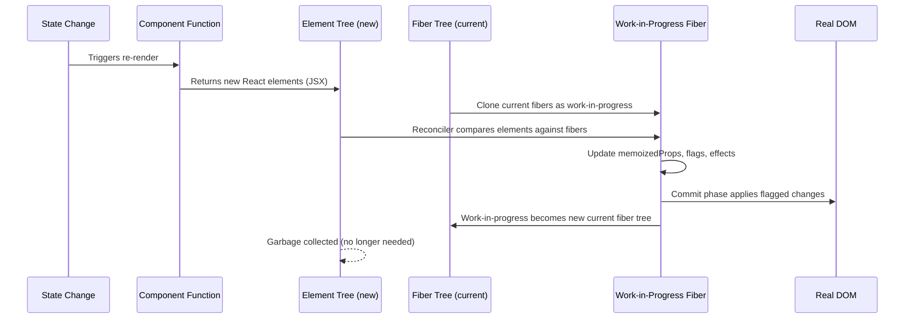
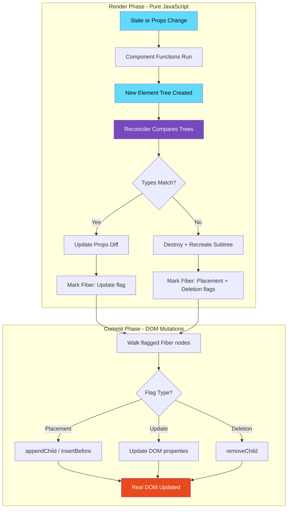
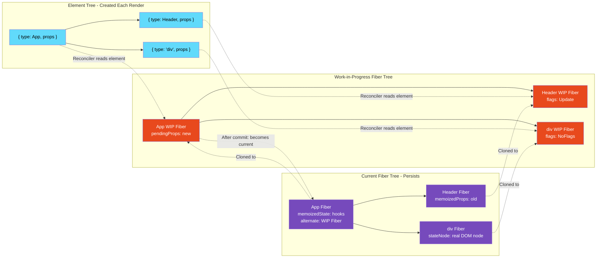

# 03 · Virtual DOM Deep Dive

> **The Virtual DOM is not a performance optimization. It is an abstraction layer — a lightweight JavaScript object tree that lets React compute the minimum set of DOM mutations needed to move from one UI state to another, without you having to think about the DOM at all.**

"Virtual DOM makes React fast" is one of the most repeated and most misleading statements in frontend engineering. The Virtual DOM adds overhead. It is not faster than targeted DOM manipulation. Its value is something more important: it makes correct, maintainable, scalable UI development possible. Understanding what it actually is, what it is not, and how it works will change how you reason about React performance.

---

## Table of Contents

- [What the Virtual DOM Actually Is](#what-the-virtual-dom-actually-is)
- [Why the Virtual DOM Exists](#why-the-virtual-dom-exists)
- [The Real DOM vs The Virtual DOM](#the-real-dom-vs-the-virtual-dom)
- [The Element Tree vs The Fiber Tree](#the-element-tree-vs-the-fiber-tree)
- [How the Diffing Algorithm Works](#how-the-diffing-algorithm-works)
- [The Two Assumptions React's Diffing Makes](#the-two-assumptions-reacts-diffing-makes)
- [Tree Diffing in Detail](#tree-diffing-in-detail)
- [The Cost Model of the Virtual DOM](#the-cost-model-of-the-virtual-dom)
- [When the Virtual DOM Hurts Performance](#when-the-virtual-dom-hurts-performance)
- [Virtual DOM vs Other Approaches](#virtual-dom-vs-other-approaches)
- [Architecture Diagrams](#architecture-diagrams)
- [Good Practice](#good-practice)
- [Bad Practice](#bad-practice)
- [Mental Model](#mental-model)
- [Common Misconceptions](#common-misconceptions)
- [Exercises](#exercises)
- [Further Reading](#further-reading)

---

## What the Virtual DOM Actually Is

The Virtual DOM is a plain JavaScript object tree that mirrors the structure of the real DOM — but exists entirely in memory, with no browser involvement.

When your React component returns JSX, it produces React elements. Those elements are the Virtual DOM. They are just objects:

```js
// A "Virtual DOM tree" is just this:
{
  type: 'ul',
  props: {
    className: 'task-list',
    children: [
      {
        type: 'li',
        props: { className: 'task', children: 'Write tests' },
        key: 'task-1',
        $$typeof: Symbol(react.element)
      },
      {
        type: 'li',
        props: { className: 'task', children: 'Deploy app' },
        key: 'task-2',
        $$typeof: Symbol(react.element)
      }
    ]
  },
  key: null,
  $$typeof: Symbol(react.element)
}
```

This is the entire Virtual DOM for a two-item task list. No browser APIs are called to create this. No layout is calculated. No pixels are touched. It is just a description of what you want.

Now contrast this with what the real DOM node for the same `<ul>` looks like:

```js
// A real DOM node has 200+ properties
const ul = document.createElement("ul");
console.log(Object.keys(Object.getPrototypeOf(ul)));
// → ['align', 'blur', 'click', 'closest', 'matches', 'remove', 'scroll', ...]
// Plus inherited from HTMLElement, Element, Node, EventTarget...
// A real DOM node is a C++ object wrapped in a JavaScript proxy
// Creating one triggers browser style recalculation
```

A real DOM node is a complex, expensive C++ object inside the browser engine, wrapped in a JavaScript interface. Creating one, reading from one, and writing to one all cross the JavaScript-to-browser boundary — which is not free.

A Virtual DOM node is 5 fields on a plain JavaScript object. Creating one is as cheap as `Object.create(null)`.

> 🔬 **Internals:** The Virtual DOM concept predates React. It appears in early descriptions of React's design as "a lightweight, in-memory representation of the DOM." The term was popularized by React but the technique exists in other frameworks too (Vue, Inferno, Preact). Solid.js and Svelte deliberately avoid it, which is both a genuine performance win for their specific use cases and a fundamental architectural tradeoff.

---

## Why the Virtual DOM Exists

The Virtual DOM solves a coordination problem that becomes acute as applications scale.

### The naive alternative: re-render everything

The simplest way to keep UI in sync with state is to destroy all existing DOM and recreate it from scratch on every state change. This is what early web applications did with `innerHTML`:

```js
// Naive approach: blow away the DOM and rebuild it
function update(state) {
  document.getElementById("app").innerHTML = renderToHTML(state);
}
```

This works at small scale. It is catastrophically bad at large scale:

- All DOM nodes are destroyed and recreated — expensive
- All scroll positions are lost
- All focus states are lost
- All text selection is lost
- All CSS transitions reset
- All browser-maintained state (video position, form values) is wiped
- Event listeners must be re-attached

### The imperative alternative: surgical manual updates

The opposite approach: write explicit code to update exactly the right DOM nodes when exactly the right state changes:

```js
// Surgical approach: manually find and update the right nodes
function updateTaskName(taskId, newName) {
  document.querySelector(`[data-task-id="${taskId}"] .task-name`).textContent =
    newName;
}
function addTask(task) {
  const li = document.createElement("li");
  li.dataset.taskId = task.id;
  // ... build the DOM structure
  document.getElementById("task-list").appendChild(li);
}
```

This is maximally efficient — only the exact DOM nodes that need to change are touched. But it does not scale because:

- You must write an update function for every possible state change
- You must ensure every update function handles every possible current DOM state
- As state complexity grows, the number of possible transitions grows exponentially
- Bugs from missed updates or wrong assumptions about current DOM state accumulate

### The Virtual DOM solution: compute the diff

The Virtual DOM sits between these two extremes. On every state change:

1. Call component functions → get a new Virtual DOM tree (cheap, just JS objects)
2. Compare the new tree against the previous tree (the diffing algorithm)
3. Apply only the changes — the diff — to the real DOM (surgical DOM mutations)

You get the correctness of the "re-render everything" approach (describe the full UI on every change) with the performance characteristics approaching the "surgical update" approach (only mutate what actually changed).

```
State Change
     ↓
New Virtual DOM Tree (cheap to create)
     ↓
Diff: New Tree vs Previous Tree (algorithmic)
     ↓
Minimal DOM Mutations (surgical application)
     ↓
Browser updates pixels
```

---

## The Real DOM vs The Virtual DOM

Understanding the performance characteristics of each explains why the Virtual DOM exists.

### Real DOM operations: cost breakdown

| Operation                       | Cost        | Reason                                          |
| ------------------------------- | ----------- | ----------------------------------------------- |
| `document.createElement('div')` | Medium      | Allocates a C++ DOM node, creates JS wrapper    |
| `element.appendChild(child)`    | Medium-High | Potentially triggers reflow if child has layout |
| `element.textContent = 'x'`     | Low-Medium  | String update + potential reflow                |
| `element.style.color = 'red'`   | Low         | Style recalc on next frame                      |
| `element.offsetHeight` (read)   | High        | Forces synchronous reflow                       |
| `element.className = 'x'`       | Medium      | Style recalc + potential reflow                 |
| `element.remove()`              | Medium      | DOM tree mutation + potential reflow            |

### Virtual DOM operations: cost breakdown

| Operation                    | Cost       | Reason                          |
| ---------------------------- | ---------- | ------------------------------- |
| `{ type: 'div', props: {} }` | Negligible | Plain object allocation         |
| Diff two element trees       | Low-Medium | O(n) algorithm over JS objects  |
| Reading a prop               | Negligible | Property access on plain object |

The difference in cost per operation is significant. But the Virtual DOM still has overhead — the diffing algorithm runs every render. For applications with thousands of components updating frequently, this overhead is measurable.

> 🏭 **Production Note:** In high-performance scenarios (60fps canvas, real-time data grids, trading terminals), the Virtual DOM overhead can be the bottleneck. Teams at Bloomberg, Airbnb, and financial institutions have written custom rendering pipelines that bypass React's Virtual DOM for specific high-frequency components. For most applications, this is irrelevant — the bottleneck is network and business logic, not reconciliation.

---

## The Element Tree vs The Fiber Tree

This is a critical distinction that many React engineers get wrong.

### React Element Tree (Virtual DOM)

- Created fresh on **every render**
- Plain JavaScript objects only
- Temporary — garbage collected after the reconciler reads it
- Produced by calling your component functions
- Represents "what the UI should look like **now**"
- Has no concept of state, effects, or work-in-progress

```js
// React element tree — recreated every render
// These objects are ephemeral
{
  type: TaskList,
  props: { tasks: [...] },
  // No state, no effects, no previous version reference
}
```

### React Fiber Tree

- **Persists between renders** — mutated in place, not recreated
- Contains component state (`memoizedState`)
- Contains effect lists (which effects need to run)
- Contains work-in-progress rendering state
- Has `alternate` pointer to previous version for comparison
- Is the actual working data structure of the reconciler

```js
// Fiber node — persists across renders
{
  type: TaskList,
  key: null,
  stateNode: null,            // DOM node or class instance
  pendingProps: { tasks: [...] },
  memoizedProps: { tasks: [...] }, // props from last render
  memoizedState: { ... },     // useState, useReducer state linked list
  updateQueue: { ... },       // pending state updates
  flags: 0b0000100,           // effect flags: Update, Placement, etc.
  subtreeFlags: 0b0000100,    // aggregated child effect flags
  alternate: FiberNode,       // the previous version of this fiber
  return: ParentFiber,        // parent in the tree
  child: ChildFiber,          // first child
  sibling: SiblingFiber,      // next sibling
}
```

### How they interact during a render



> 🔬 **Internals:** React maintains two Fiber trees simultaneously — the "current" tree (what is currently rendered) and the "work-in-progress" tree (what is being computed for the next render). This is called **double buffering**. When the work-in-progress render completes, React atomically swaps the two trees — the work-in-progress becomes current, and the old current becomes available for reuse as the next work-in-progress. This prevents partial renders from being visible.

---

## How the Diffing Algorithm Works

React's diffing algorithm (called **reconciliation**) compares the new element tree against the existing Fiber tree. The theoretical minimum complexity for comparing two arbitrary trees is O(n³) — for a tree of 1000 nodes, that is 1 billion operations. React's algorithm achieves O(n) by making two deliberate assumptions.

### The Two Assumptions React's Diffing Makes

**Assumption 1: Elements of different types produce different trees.**

If an element's `type` changes (e.g., from `<div>` to `<span>`, or from `<Header>` to `<Footer>`), React **does not attempt to diff the subtrees**. It destroys the entire old subtree and builds a new one from scratch.

```jsx
// Before render
<div>
  <Counter />
</div>

// After render — type changed from div to section
<section>
  <Counter />
</section>
```

React does not ask "can any children be reused?" It destroys `<div>` and all its children, including `<Counter>` and its state. Creates `<section>` and all children fresh. This is why changing a wrapper element's type resets all nested component state — even if the children look identical.

**Assumption 2: Keys identify stable elements across renders.**

When reconciling lists of children, React uses the `key` prop to match elements across renders. Without keys, React uses position. With keys, React uses identity.

```jsx
// Without keys: React matches by position
// Before:         After:
// <li>Alice</li>  <li>Bob</li>    ← React: "position 0 changed, update text"
// <li>Bob</li>                    ← React: "position 1 removed, delete"

// With keys: React matches by identity
// Before:              After:
// <li key="a">Alice    <li key="b">Bob   ← React: "key 'b' at position 0, was at 1, move"
// <li key="b">Bob                        ← React: "key 'a' removed, delete"
```

---

## Tree Diffing in Detail

The diffing algorithm processes the tree level by level, left to right. Here is what it actually does at each node:

### Step 1: Compare element types

```js
// Simplified reconciliation logic
function reconcileElement(currentFiber, newElement) {
  const sameType =
    currentFiber !== null && currentFiber.type === newElement.type;

  if (sameType) {
    // REUSE: same type — update props, keep DOM node
    return updateFiber(currentFiber, newElement.props);
  } else {
    // REPLACE: different type — destroy old subtree, create new
    if (currentFiber !== null) {
      deleteSubtree(currentFiber); // marks for deletion in commit phase
    }
    return createFiber(newElement); // creates new fiber
  }
}
```

### Step 2: For host components (DOM elements) — update props

If the type matches, React updates only the props that changed:

```js
// React computes the prop diff for DOM elements
function diffDOMProps(oldProps, newProps) {
  const updates = {};

  // Find removed props
  for (const key in oldProps) {
    if (key !== "children" && !(key in newProps)) {
      updates[key] = null; // remove this prop
    }
  }

  // Find added or changed props
  for (const key in newProps) {
    if (key !== "children" && oldProps[key] !== newProps[key]) {
      updates[key] = newProps[key]; // update this prop
    }
  }

  return updates; // committed to DOM in the commit phase
}
```

This is why changing a single className results in only that className being updated on the real DOM node — React diffs the props and applies only the delta.

### Step 3: For function components — call the function

```js
// When a function component fiber is reconciled:
function updateFunctionComponent(fiber) {
  // Call the component with new props
  const newChildren = fiber.type(fiber.pendingProps);
  // Then reconcile the returned children against existing children
  reconcileChildren(fiber, newChildren);
}
```

### Step 4: Reconcile children

This is where keys matter. React must match children from the new element tree against children from the existing Fiber tree.

```js
// Simplified child reconciliation
function reconcileChildren(parentFiber, newChildren) {
  // Build a map of existing children by key (or index if no key)
  const existingChildrenByKey = mapExistingChildren(parentFiber);

  let newFibers = [];

  newChildren.forEach((newChild, index) => {
    const key = newChild.key ?? index; // use key or fall back to index
    const existingFiber = existingChildrenByKey.get(key);

    if (existingFiber && existingFiber.type === newChild.type) {
      // Same key AND same type: REUSE and UPDATE
      existingChildrenByKey.delete(key);
      newFibers.push(updateFiber(existingFiber, newChild.props));
    } else {
      // Different key OR different type: CREATE NEW
      newFibers.push(createFiber(newChild));
    }
  });

  // Anything left in existingChildrenByKey was not matched: DELETE
  existingChildrenByKey.forEach((fiber) => deleteSubtree(fiber));

  return newFibers;
}
```

### The complete diffing result: effect flags

After diffing, each Fiber node is tagged with effect flags indicating what needs to happen in the commit phase:

```js
// Effect flags (from React source)
const NoFlags = 0b00000000000000000000000000;
const Placement = 0b00000000000000000000000010; // Insert into DOM
const Update = 0b00000000000000000000000100; // Update DOM props
const Deletion = 0b00000000000000000000001000; // Remove from DOM
const ChildDeletion = 0b00000000000000000000010000; // Child needs deletion
const ContentReset = 0b00000000000000000001000000; // Reset text content
const Ref = 0b00000000000000001000000000; // Attach/detach ref
const Snapshot = 0b00000000000000010000000000; // getSnapshotBeforeUpdate
const Passive = 0b00000000000000100000000000; // useEffect
const LayoutMask = 0b00000000000001000000000000; // useLayoutEffect
```

The commit phase walks fibers that have non-zero flags and applies the corresponding DOM operations. This is the only time the real DOM is touched.

---

## The Cost Model of the Virtual DOM

To reason correctly about Virtual DOM performance, you need an accurate cost model.

### Per-render costs

Every render, regardless of whether the DOM changes:

1. **All component functions in the subtree run** — even if their output is identical
2. **New React elements are allocated** — object creation for every JSX expression
3. **The diffing algorithm runs** — O(n) comparison of new elements against existing fibers
4. **Props are compared** — shallow comparison of every prop object

### Per-change costs (commit phase only when flags are set)

Only when actual changes are detected:

5. **DOM mutations execute** — only the changed properties
6. **Effects run** — only effects whose dependencies changed

### Where time is actually spent

In a typical React application, profiling reveals:

```
Render time breakdown (approximate):
├── Component function calls:     60-70%  ← your code + React overhead
├── Diffing algorithm:            15-20%  ← React's reconciliation work
├── DOM mutations (commit):        5-10%  ← actual browser DOM work
└── Effect execution:              5-15%  ← useEffect, useLayoutEffect
```

The browser's layout/paint/composite work happens _after_ React's commit phase and is not counted above. For most applications, the bottleneck is component function call time — which is why memoization (`React.memo`, `useMemo`) targets reducing unnecessary component function calls.

---

## When the Virtual DOM Hurts Performance

The Virtual DOM is not a universal win. It hurts performance in specific scenarios:

### 1. High-frequency updates with large trees

If you update state 60 times per second (animation, real-time data), the reconciler runs 60 times per second. For a large component tree, this is 60 × O(n) object creations and comparisons per second.

```tsx
// ⚠️ Problematic: 60fps state update forces 60 reconciler runs
function AnimatedProgress() {
  const [progress, setProgress] = useState(0);

  useEffect(() => {
    const id = requestAnimationFrame(function tick() {
      setProgress((p) => p + 1); // triggers full reconciliation 60x/second
      requestAnimationFrame(tick);
    });
    return () => cancelAnimationFrame(id);
  }, []);

  return <ProgressBar value={progress} />; // entire tree reconciled each frame
}
```

For 60fps animations, bypass React state entirely and use CSS animations, the Web Animations API, or direct ref mutations.

### 2. Fine-grained updates on large flat lists

```tsx
// 1000 items. One item's name changes.
// React reconciles ALL 1000 items to find the 1 that changed.
// The other 999 component functions still run (unless memoized).
function TaskList({ tasks }) {
  return tasks.map((task) => <TaskItem key={task.id} task={task} />);
}
```

With 1000 items and no memoization, changing one item's name causes 1000 `TaskItem` function calls. The diff finds 1 update and makes 1 DOM mutation — but 999 function calls were unnecessary work.

### 3. Deeply nested components with context

Context updates cause all consumers to re-render — bypassing the normal parent-child render propagation. In a large tree with many context consumers, a single context update triggers potentially hundreds of component re-renders, each running through the Virtual DOM machinery.

> 🏭 **Production Note:** Frameworks like Solid.js (fine-grained reactivity), Svelte (compiled reactivity), and Million.js (block-based Virtual DOM) exist specifically to avoid the overhead of React's component-level Virtual DOM approach. They trade React's developer ergonomics for reduced runtime reconciliation cost. The right tool depends on the performance envelope your application needs.

---

## Virtual DOM vs Other Approaches

| Approach                      | Example                  | How Updates Work                                                | Tradeoff                                                           |
| ----------------------------- | ------------------------ | --------------------------------------------------------------- | ------------------------------------------------------------------ |
| Virtual DOM (component-level) | React                    | Re-render components, diff trees                                | Simple mental model, higher reconciliation overhead                |
| Fine-grained reactivity       | Solid.js, MobX           | Track which DOM nodes depend on which values, update only those | Lower overhead, more complex tracking system                       |
| Compiled reactivity           | Svelte                   | Compiler generates targeted DOM updates at build time           | Zero runtime overhead, limited to compile-time-analyzable patterns |
| Block Virtual DOM             | Million.js               | Diff "blocks" instead of full trees                             | Faster reconciliation, less flexible                               |
| Dirty checking                | Angular (old)            | Check all watched values on every event                         | Simple but scales poorly                                           |
| Incremental DOM               | Google's Incremental DOM | Walk new and old trees simultaneously, update in place          | Lower memory, used in Angular (new)                                |

React's approach wins on **predictability** and **composability** — the same mental model works whether you have 10 components or 10,000. It does not win on raw performance overhead.

---

## Architecture Diagrams

### Virtual DOM as a reconciliation input/output



### Element Tree vs Fiber Tree relationship



---

## Good Practice

### ✅ Good Practice — Help the diffing algorithm with stable keys

```tsx
/**
 * Good: Keys are stable identifiers tied to data identity,
 * not to render-time position or random values.
 * The diffing algorithm can match elements across renders accurately.
 */
function TaskList({ tasks }: { tasks: Task[] }) {
  return (
    <ul>
      {tasks.map((task) => (
        // key from data — stable across re-orders, additions, removals
        <TaskItem key={task.id} task={task} />
      ))}
    </ul>
  );
}

// When a task is reordered: React moves the existing DOM node
// When a task is added: React creates one new DOM node
// When a task is removed: React removes exactly one DOM node
// No unnecessary destruction and recreation
```

**Why this works:** Stable keys let the reconciler match the old Fiber (with its DOM node and state) to the new element by identity, not position. Reordering the list causes DOM node _moves_, not DOM node _recreation_.

---

## Bad Practice

### ⚠️ Bad Practice — Unstable keys that reset component state and force recreation

```tsx
/**
 * Bad: Using array index as key.
 * Fine for static, never-reordered lists.
 * Catastrophic for dynamic lists.
 */
function TaskList({ tasks }: { tasks: Task[] }) {
  return (
    <ul>
      {tasks.map((task, index) => (
        <TaskItem key={index} task={task} /> // ⚠️ index as key
      ))}
    </ul>
  );
}

/**
 * Even worse: Random key on every render.
 * Forces React to destroy and recreate EVERY element every render.
 */
function TaskList({ tasks }: { tasks: Task[] }) {
  return (
    <ul>
      {tasks.map((task) => (
        <TaskItem key={Math.random()} task={task} /> // ❌ never do this
      ))}
    </ul>
  );
}
```

**What happens with index keys:** If you delete item at index 0, every remaining item shifts down. Item that was at index 1 is now at index 0. React sees "index 0" exists in both old and new trees — assumes same element — and _updates_ the existing DOM node. The DOM node now holds the wrong component state (the deleted item's state), and the input the user was typing in item 1 is now shown in item 0's position.

**What happens with random keys:** Every key changes every render. React sees zero matching keys between old and new trees. It destroys every existing DOM node and creates every DOM node from scratch. This is equivalent to `innerHTML = ''` + full rebuild on every state change — the most expensive possible outcome.

**Production impact:** Animation state, input focus, scroll position, and component-local state are all lost on every reorder or re-render. With large lists, GC pressure from creating and destroying DOM nodes causes frame drops.

---

## Mental Model

> 💡 **The Virtual DOM mental model:**
>
> Think of the Virtual DOM as a **blueprint** and the real DOM as the **building**. Every render, React drafts a new blueprint (the element tree). It then compares the new blueprint against the current building's blueprint (the Fiber tree), finds the differences, and sends only the change orders to the construction crew (the commit phase). The building is never demolished and rebuilt from scratch — only the rooms that changed get renovated. Your job as an engineer is to write blueprints that make the "find differences" step fast — which means stable structures, stable keys, and avoiding layout changes in hot render paths.

---

## Common Misconceptions

### "The Virtual DOM is an in-memory copy of the real DOM"

It is not a copy of the DOM. It is a description of what you _want_ the DOM to look like. The real DOM might be completely different from the Virtual DOM — the reconciler's job is to make them match.

### "React diffs against the real DOM"

React diffs the new element tree against the **Fiber tree** — not the real DOM. The Fiber tree stores what React last committed to the DOM. This is why React never reads from the real DOM during reconciliation. Reading from the DOM (e.g., `element.offsetHeight`) during the render phase is an anti-pattern that breaks this model.

### "Virtual DOM means React never touches the real DOM"

The whole point is that React _does_ touch the real DOM — in the commit phase. The Virtual DOM is what React uses to figure out _how much_ to touch it.

### "More components = more Virtual DOM overhead"

More components means more function calls during reconciliation. But if those components are correctly memoized (`React.memo`), the reconciler skips their subtrees entirely. Component count is less important than whether unnecessary re-renders are avoided.

### "Svelte/Solid is always faster than React"

Svelte and Solid avoid Virtual DOM overhead. For applications with frequent, fine-grained updates to many independent state values, they can be significantly faster. For applications with complex conditional rendering, deeply nested trees, and infrequent updates, the difference is often negligible. Always measure for your specific use case.

---

## Exercises

### Exercise 1 — Visualize reconciliation with React DevTools

Install React DevTools. In the Profiler tab, record a render where a list item is added, removed, and reordered. Look at the "Why did this render?" panel for each component. Identify which components were re-rendered unnecessarily.

### Exercise 2 — Observe key behavior

Build a list of components, each with an `<input>` inside. Type something in the first input. Then prepend a new item to the list. Observe what happens with:

- No `key` prop
- `key={index}`
- `key={item.id}`

The difference in behavior is a direct demonstration of how keys guide the diffing algorithm.

### Exercise 3 — Measure Virtual DOM overhead

```tsx
// Build this component and profile it:
function HeavyList() {
  const [count, setCount] = useState(0);
  const items = Array.from({ length: 1000 }, (_, i) => ({ id: i, value: i }));

  return (
    <>
      <button onClick={() => setCount((c) => c + 1)}>Re-render</button>
      <span>Renders: {count}</span>
      {items.map((item) => (
        <div key={item.id}>{item.value}</div>
      ))}
    </>
  );
}
```

Profile a click. How much time does reconciliation take? Now wrap the list in `React.memo` or `useMemo`. How much faster is it? This demonstrates the concrete cost of the Virtual DOM at scale and the value of memoization.

---

## Further Reading

- [React Source: ReactChildFiber.js](https://github.com/facebook/react/blob/main/packages/react-reconciler/src/ReactChildFiber.js) — The actual child reconciliation algorithm
- [React Source: ReactFiberReconciler.js](https://github.com/facebook/react/blob/main/packages/react-reconciler/src/ReactFiberReconciler.js) — Entry point for reconciliation
- [Original Fiber design document](https://github.com/acdlite/react-fiber-architecture) — Why the element tree / fiber tree split exists
- [Overreacted: React as a UI Runtime](https://overreacted.io/react-as-a-ui-runtime/) — Dan Abramov's deep dive into React's rendering model
- [Million.js: Block Virtual DOM](https://million.dev/blog/virtual-dom) — Alternative approach to Virtual DOM diffing
- Next in this handbook: [04 · Component Architecture](./04-component-architecture.md)

---

_Part of the [React + Next.js Engineering Handbook](../../README.md)_
