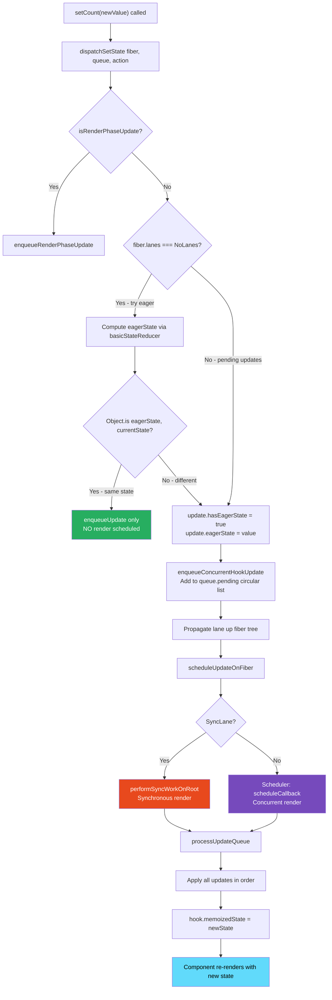
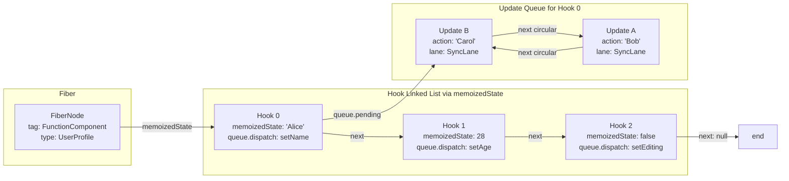

# 20 · useState Internals

> **useState is not a storage mechanism. It is a dispatch system. When you call useState, React creates a hook node in the fiber's linked list that holds your state value plus a dispatch queue. When you call the setter, React enqueues an update object, schedules a re-render, and during that re-render, processes all queued updates in order to compute the next state. Understanding this pipeline is understanding why setState is asynchronous, why stale closures happen, and why updater functions always produce correct results.**

Most React developers use `useState` daily without understanding it. They know it returns a value and a setter. They know the setter is "async." They know they should use updater functions "sometimes." This document replaces vague intuitions with precise mechanical understanding — which is the foundation for writing correct, performant stateful React components.

---

## Table of Contents

- [What useState Returns at Runtime](#what-usestate-returns-at-runtime)
- [The Hook Node Structure](#the-hook-node-structure)
- [Mount: mountState](#mount-mountstate)
- [The Dispatch Function: dispatchSetState](#the-dispatch-function-dispatchsetstate)
- [The Eager State Optimization](#the-eager-state-optimization)
- [Update: updateState and processUpdateQueue](#update-updatestate-and-processUpdateQueue)
- [Why setState is "Asynchronous"](#why-setstate-is-asynchronous)
- [The Stale Closure Problem: Root Cause](#the-stale-closure-problem-root-cause)
- [Updater Functions: How They Fix Stale Closures](#updater-functions-how-they-fix-stale-closures)
- [Lazy Initialization](#lazy-initialization)
- [Multiple useState Calls and the Hook List](#multiple-usestate-calls-and-the-hook-list)
- [useState vs useReducer: Under the Hood](#usestate-vs-usereducer-under-the-hood)
- [Batching and useState](#batching-and-usestate)
- [Priority and useState](#priority-and-usestate)
- [Architecture Diagrams](#architecture-diagrams)
- [Good Practices](#good-practices)
- [Bad Practices](#bad-practices)
- [Mental Model](#mental-model)
- [Common Misconceptions](#common-misconceptions)
- [Exercises](#exercises)
- [Further Reading](#further-reading)

---

## What useState Returns at Runtime

```tsx
const [count, setCount] = useState(0);
```

This line does two different things depending on whether the component is mounting or updating:

**On mount:** Creates a new hook node in the fiber's `memoizedState` linked list. Initializes state to `0`. Creates a dispatch function bound to this fiber and this hook's queue. Returns `[0, dispatchFunction]`.

**On update:** Reads the existing hook node from the fiber's `memoizedState` linked list (at the same position as on mount). Processes all queued update objects to compute the new state value. Returns `[newState, dispatchFunction]`.

The dispatch function (`setCount`) is stable across renders — it is the same function object every render (bound to the specific fiber and queue at creation time). This is why you can safely include `setCount` in `useEffect` dependency arrays without it causing re-runs.

---

## The Hook Node Structure

Each `useState` call creates one node in the fiber's hook linked list:

```js
// The shape of a useState hook node (from ReactFiberHooks.js)
const hook = {
  memoizedState: 0, // The current committed state value
  baseState: 0, // The base state for computing the next state
  // (relevant when updates have different priorities)
  baseQueue: null, // Updates skipped in previous renders (priority-related)
  queue: {
    pending: null, // The circular linked list of pending Update objects
    lanes: NoLanes, // Lanes of pending updates
    dispatch: setCount, // The dispatch function (bound to this fiber+queue)
    lastRenderedReducer: basicStateReducer, // The reducer for useState
    lastRenderedState: 0, // The state from the last render (for eager state check)
  },
  next: null, // Pointer to the next hook in this fiber's list
};
```

### The basicStateReducer

`useState` is actually `useReducer` with a built-in reducer:

```js
function basicStateReducer(state, action) {
  // If action is a function (updater), call it with current state
  // If action is a value, return it directly
  return typeof action === "function" ? action(state) : action;
}
```

This is the fundamental truth: `useState` is sugar over `useReducer`. Every `setCount(newValue)` call is equivalent to `dispatch(newValue)`, and the "reducer" is just `(state, action) => action` (or `action(state)` for updater functions).

---

## Mount: mountState

The first time a component renders, `mountState` runs:

```js
// From ReactFiberHooks.js
function mountState(initialState) {
  // Create a new hook node and append it to the fiber's hook list
  const hook = mountWorkInProgressHook();
  // mountWorkInProgressHook creates a new hook node and links it into
  // workInProgress.memoizedState linked list

  // Resolve lazy initialization
  if (typeof initialState === "function") {
    initialState = initialState();
    // The function is called once on mount only — this is lazy initialization
  }

  // Initialize hook state
  hook.memoizedState = hook.baseState = initialState;

  // Create the update queue for this hook
  const queue = {
    pending: null, // no pending updates yet
    lanes: NoLanes,
    dispatch: null, // filled in below
    lastRenderedReducer: basicStateReducer,
    lastRenderedState: initialState,
  };
  hook.queue = queue;

  // Create the dispatch function, bound to:
  // - currentlyRenderingFiber: the fiber being rendered right now
  // - queue: this specific hook's update queue
  const dispatch = (queue.dispatch = dispatchSetState.bind(
    null,
    currentlyRenderingFiber,
    queue,
  ));

  // Return [currentState, dispatchFunction]
  return [hook.memoizedState, dispatch];
}
```

### mountWorkInProgressHook: building the linked list

```js
function mountWorkInProgressHook() {
  const hook = {
    memoizedState: null,
    baseState: null,
    baseQueue: null,
    queue: null,
    next: null,
  };

  if (workInProgressHook === null) {
    // This is the first hook in the component
    // Set as the head of the hook list
    currentlyRenderingFiber.memoizedState = workInProgressHook = hook;
  } else {
    // Append to the end of the existing hook list
    workInProgressHook = workInProgressHook.next = hook;
  }

  return workInProgressHook;
}
```

After a component with 3 `useState` calls mounts, the fiber's `memoizedState` looks like:

```
fiber.memoizedState →
  Hook 1 { memoizedState: 0, queue: {...}, next: → }
  Hook 2 { memoizedState: '', queue: {...}, next: → }
  Hook 3 { memoizedState: false, queue: {...}, next: null }
```

---

## The Dispatch Function: dispatchSetState

When you call `setCount(newValue)`, you're calling `dispatchSetState` with the pre-bound fiber and queue:

```js
function dispatchSetState(fiber, queue, action) {
  // action = newValue (or updater function)

  // ─── 1. Determine priority ─────────────────────────────────────────────
  const lane = requestUpdateLane(fiber);
  // SyncLane for events, TransitionLane for startTransition, etc.

  // ─── 2. Create the Update object ──────────────────────────────────────
  const update = {
    lane,
    action, // the new value or updater function
    hasEagerState: false, // will be set if eager optimization runs
    eagerState: null, // will be set if eager optimization runs
    next: null, // linked list pointer
  };

  // ─── 3. Check for render-phase updates ────────────────────────────────
  if (isRenderPhaseUpdate(fiber)) {
    // setState called during render — handle specially
    // (rare but valid for derived state patterns)
    enqueueRenderPhaseUpdate(queue, update);
  } else {
    // ─── 4. Try eager state optimization ────────────────────────────────
    const alternate = fiber.alternate;
    if (
      fiber.lanes === NoLanes &&
      (alternate === null || alternate.lanes === NoLanes)
    ) {
      // No pending updates — attempt eager evaluation
      const lastRenderedReducer = queue.lastRenderedReducer;

      if (lastRenderedReducer !== null) {
        try {
          const currentState = queue.lastRenderedState;
          const eagerState = lastRenderedReducer(currentState, action);
          // basicStateReducer: if action is function, call it; else return it

          update.hasEagerState = true;
          update.eagerState = eagerState;

          if (Object.is(eagerState, currentState)) {
            // ✅ NEW STATE === CURRENT STATE → bail out early!
            // No re-render needed
            enqueueUpdate(fiber, queue, update, lane);
            return; // ← EARLY RETURN: skip scheduling a render
          }
        } catch (error) {
          // Ignore errors in eager state computation
        } finally {
          // Restore the reducer (may have been changed)
        }
      }
    }

    // ─── 5. Enqueue the update ───────────────────────────────────────────
    const root = enqueueConcurrentHookUpdate(fiber, queue, update, lane);
    // This adds the update to the fiber's queue (circular linked list)
    // and propagates the lane up to the root fiber

    if (root !== null) {
      // ─── 6. Schedule a render ──────────────────────────────────────────
      const eventTime = requestEventTime();
      scheduleUpdateOnFiber(root, fiber, lane, eventTime);
      entangleTransitionUpdate(root, queue, lane);
    }
  }
}
```

---

## The Eager State Optimization

The eager state optimization is one of React's most impactful micro-optimizations. It prevents renders entirely when the new state is identical to the current state:

```tsx
const [count, setCount] = useState(5);

// This triggers a render:
setCount(6); // eagerState = 6, currentState = 5 → 6 !== 5 → render scheduled

// This does NOT trigger a render (eager optimization):
setCount(5); // eagerState = 5, currentState = 5 → Object.is(5, 5) = true → BAIL OUT

// This also does NOT trigger a render:
setCount((c) => c); // eagerState = basicStateReducer(5, c => c) = (c => c)(5) = 5 → bail out

// This DOES trigger a render (object reference):
setCount({ value: 5 }); // new object !== old object → render scheduled
// Even if the content is identical, reference inequality triggers a render
```

### When the eager optimization is skipped

The optimization only runs when:

1. The fiber has no pending updates (`fiber.lanes === NoLanes`)
2. The alternate (WIP) fiber also has no pending updates

If there are already pending updates, the new state depends on them and must be computed in sequence — eager computation would give the wrong answer.

```tsx
// Eager optimization skipped:
setCount(1); // Update A enqueued — fiber.lanes now has bits set
setCount((c) => c + 1); // Update B: fiber.lanes !== NoLanes → skip eager check
// Update B must wait for Update A to be processed to know what "c" is
```

---

## Update: updateState and processUpdateQueue

On subsequent renders (after the component has mounted), `updateState` runs instead of `mountState`:

```js
function updateState(initialState) {
  // Note: initialState is IGNORED on updates — it only matters on mount
  return updateReducer(basicStateReducer, initialState);
}

function updateReducer(reducer, initialArg, init) {
  // ─── 1. Get the current hook node ─────────────────────────────────────
  const hook = updateWorkInProgressHook();
  // updateWorkInProgressHook: reads from the current fiber's hook list
  // (same position as the mount hook) and creates a WIP version

  const queue = hook.queue;

  // ─── 2. Process the update queue ──────────────────────────────────────
  queue.lastRenderedReducer = reducer;

  const current = currentHook; // the current (committed) hook state
  let baseQueue = current.baseQueue; // updates skipped in previous renders

  // Get pending updates from the queue
  const pendingQueue = queue.pending;

  if (pendingQueue !== null) {
    // There are pending updates from dispatchSetState calls
    if (baseQueue !== null) {
      // We have both skipped updates and new updates
      // Splice them together to process in the right order
      const baseFirst = baseQueue.next;
      const pendingFirst = pendingQueue.next;
      baseQueue.next = pendingFirst;
      pendingQueue.next = baseFirst;
    }
    current.baseQueue = baseQueue = pendingQueue;
    queue.pending = null; // clear the pending queue
  }

  if (baseQueue !== null) {
    // Process updates in the queue
    const first = baseQueue.next; // first update (circular list)
    let newState = current.baseState; // start from last committed state

    let newBaseState = null;
    let newBaseQueueFirst = null;
    let newBaseQueueLast = null;
    let update = first;

    do {
      const updateLane = update.lane;

      if (!isSubsetOfLanes(renderLanes, updateLane)) {
        // ─── SKIP this update ─────────────────────────────────────────────
        // This update's lane is not in the current render lanes
        // (e.g., TransitionLane update during a SyncLane render)
        // Save it for a future render

        const clone = {
          lane: updateLane,
          action: update.action,
          hasEagerState: update.hasEagerState,
          eagerState: update.eagerState,
          next: null,
        };

        if (newBaseQueueLast === null) {
          newBaseQueueFirst = newBaseQueueLast = clone;
          newBaseState = newState; // base state for next render
        } else {
          newBaseQueueLast = newBaseQueueLast.next = clone;
        }

        // Ensure this lane will be retried
        currentlyRenderingFiber.lanes = mergeLanes(
          currentlyRenderingFiber.lanes,
          updateLane,
        );
        markSkippedUpdateLanes(updateLane);
      } else {
        // ─── APPLY this update ───────────────────────────────────────────
        if (newBaseQueueLast !== null) {
          // There were skipped updates before this one
          // This update must be included in the base queue too
          // (so it can be recomputed when skipped updates are processed)
          const clone = {
            lane: NoLane, // no lane — already processed
            action: update.action,
            hasEagerState: update.hasEagerState,
            eagerState: update.eagerState,
            next: null,
          };
          newBaseQueueLast = newBaseQueueLast.next = clone;
        }

        // Compute the new state
        if (update.hasEagerState) {
          // Eager state was already computed in dispatchSetState
          newState = update.eagerState;
        } else {
          const action = update.action;
          newState = reducer(newState, action);
          // basicStateReducer: typeof action === 'function' ? action(newState) : action
        }
      }

      update = update.next;
    } while (update !== null && update !== first); // circular list

    // Set the new base state
    if (newBaseQueueLast === null) {
      newBaseState = newState;
    } else {
      newBaseQueueLast.next = newBaseQueueFirst; // close the circular list
    }

    // ─── 3. Check if state actually changed ──────────────────────────────
    if (!Object.is(newState, hook.memoizedState)) {
      markWorkInProgressReceivedUpdate();
      // This flag causes beginWork to NOT bail out for this component
    }

    // ─── 4. Update the hook state ─────────────────────────────────────────
    hook.memoizedState = newState;
    hook.baseState = newBaseState;
    hook.baseQueue = newBaseQueueFirst;

    queue.lastRenderedState = newState;
  }

  const dispatch = queue.dispatch;
  return [hook.memoizedState, dispatch];
}
```

---

## Why setState is "Asynchronous"

`setState` is not truly asynchronous in the sense of Promises or setTimeout. It is **deferred** — the state update happens in a future render cycle, not synchronously in the current execution context.

```tsx
function Counter() {
  const [count, setCount] = useState(0);

  const handleClick = () => {
    setCount(1);
    console.log(count); // Logs: 0 (NOT 1)
    // Why? count is a const in the current render's closure
    // setCount(1) enqueued an Update object — it did NOT change count
    // count will be 1 in the NEXT render, not in this handler
  };
}
```

### The closure is the explanation

```tsx
function Counter() {
  // On render N: count = 0 (a const in this render's scope)
  const [count, setCount] = useState(0);

  const handleClick = () => {
    // This handler closes over count = 0
    // It will always see 0 regardless of what setCount does
    setCount(count + 1); // enqueue Update: action = 0 + 1 = 1
    // count is still 0 here
    // count will be 1 in render N+1 — a completely new execution of Counter()
  };

  // On render N+1: count = 1 (the result of processing the Update from render N)
}
```

Every render is a separate function call. `count` is a `const` bound to the value at that render. It cannot change within the same render. `setCount` schedules work for the next render. The next render creates a new `count` const with the new value.

---

## The Stale Closure Problem: Root Cause

Stale closures occur when a closure captures a `const` value from an old render, and that closure is still executing when a newer render has computed a different value for that `const`.

```tsx
function Counter() {
  const [count, setCount] = useState(0); // count = 0 on render 1

  useEffect(() => {
    // This callback closes over count = 0 from render 1
    const id = setInterval(() => {
      setCount(count + 1); // always: 0 + 1 = 1
      // count is ALWAYS 0 here — the closure captured render 1's count
      // Even on render 10 (where count = 9), this interval still uses count = 0
    }, 1000);
    return () => clearInterval(id);
  }, []); // empty deps: only runs on mount → captures count = 0 forever
}
```

The interval fires every second. Every time it fires, `setCount(count + 1)` is `setCount(0 + 1)` — always 1. The count never increases beyond 1.

### Root cause analysis

```
Render 1:
  count = 0
  setCount function created
  useEffect callback created — captures { count: 0 }
  Browser: setInterval created — calls the closure every 1 second

1 second later:
  Interval fires: setCount(0 + 1) = setCount(1) → render scheduled

Render 2:
  count = 1
  New useEffect callback created — captures { count: 1 }
  But: deps = [] → useEffect does NOT re-run
  Old closure (count = 0) is still the active interval callback

1 second later:
  Interval fires again: OLD closure → setCount(0 + 1) = setCount(1) again
  State is already 1 — eager optimization: 1 === 1 → NO RENDER
```

The count is perpetually stuck at 1 because the old closure with `count = 0` is still running.

---

## Updater Functions: How They Fix Stale Closures

The updater function pattern breaks the dependency on the closure's captured value by using the _current queued state_ instead of the closure's _captured state_:

```tsx
function Counter() {
  const [count, setCount] = useState(0);

  useEffect(() => {
    const id = setInterval(() => {
      // ✅ Updater function: c is the CURRENT queued state
      // Not the captured count from this closure
      setCount((c) => c + 1);
      // basicStateReducer(currentState, c => c + 1) = currentState + 1
      // currentState is read from the hook's queue during processUpdateQueue
      // NOT from this closure
    }, 1000);
    return () => clearInterval(id);
  }, []);
}
```

### How the updater function escapes the stale closure

```
Render 1:
  count = 0
  setInterval closure captures { count: 0 } — but we're NOT using count

1 second later:
  setCount(c => c + 1)
  dispatchSetState: action = (c => c + 1)
  Update object: { action: (c => c + 1) }
  → render scheduled

Render 2 (count → 1):
  processUpdateQueue:
    newState = basicStateReducer(0, (c => c + 1)) = (c => c + 1)(0) = 1
  count = 1

1 second later:
  setCount(c => c + 1) again (same function from old closure — that's fine)
  Update object: { action: (c => c + 1) }
  → render scheduled

Render 3 (count → 2):
  processUpdateQueue:
    newState = basicStateReducer(1, (c => c + 1)) = (c => c + 1)(1) = 2
  count = 2
```

The updater function `c => c + 1` doesn't close over `count`. It receives the current queued state as its argument during `processUpdateQueue`. The closure-captured value is irrelevant.

### The rule: when to use updater functions

```tsx
// Use updater functions when:
// 1. New state depends on previous state
setCount((c) => c + 1); // depends on previous count
setItems((prev) => [...prev, newItem]); // depends on previous items
setMap((prev) => new Map(prev).set(key, value)); // depends on previous map

// Direct value is fine when:
// 1. New state is independent of previous state
setIsLoading(false); // not derived from previous isLoading
setError(null); // not derived from previous error
setActiveTab("settings"); // not derived from previous tab

// Always use updater functions in:
// - setInterval/setTimeout callbacks (stale closure risk)
// - Event handlers called multiple times in quick succession
// - Any situation where multiple updates may be batched
```

---

## Lazy Initialization

The `useState` initializer function is called only on mount:

```tsx
// ❌ Eager initialization: runs on every render (even though result is ignored)
function Component() {
  const [state] = useState(computeExpensiveInitialValue()); // runs every render
}

// ✅ Lazy initialization: runs only on mount
function Component() {
  const [state] = useState(() => computeExpensiveInitialValue()); // runs once
}
```

The implementation:

```js
function mountState(initialState) {
  // ...
  if (typeof initialState === "function") {
    // Lazy: call the function on mount only
    initialState = initialState();
  }
  hook.memoizedState = hook.baseState = initialState;
  // ...
}

function updateState(initialState) {
  return updateReducer(basicStateReducer, initialState);
  // Note: initialState is passed but never used in updateReducer
  // On updates, initial value is irrelevant — state comes from the queue
}
```

### When to use lazy initialization

```tsx
// Use lazy initialization for:

// 1. Expensive computations
const [data, setData] = useState(() => parseLocalStorage("my-key"));
// parseLocalStorage only runs on mount, not on every re-render

// 2. Computations from props (that don't need to stay in sync)
const [formData, setFormData] = useState(() => ({
  name: props.user.name, // snapshot of initial value
  email: props.user.email,
}));
// Only initial values — changes to props.user after mount don't update formData

// 3. Computations involving browser APIs (not available during SSR)
const [windowSize, setWindowSize] = useState(() => ({
  width: typeof window !== "undefined" ? window.innerWidth : 0,
  height: typeof window !== "undefined" ? window.innerHeight : 0,
}));
```

---

## Multiple useState Calls and the Hook List

React identifies which hook is which by position in the linked list:

```tsx
function UserProfile() {
  const [name, setName] = useState(""); // hook list position 0
  const [age, setAge] = useState(0); // hook list position 1
  const [isEditing, setIsEditing] = useState(false); // hook list position 2
}
```

After mount, `fiber.memoizedState`:

```
Node 0: { memoizedState: '',    queue: { dispatch: setName    } next → }
Node 1: { memoizedState: 0,     queue: { dispatch: setAge     } next → }
Node 2: { memoizedState: false, queue: { dispatch: setIsEditing } next: null }
```

On update, `updateWorkInProgressHook` reads them in order:

```js
function updateWorkInProgressHook() {
  // On first call: currentHook = fiber.memoizedState (node 0)
  // On second call: currentHook = currentHook.next (node 1)
  // On third call: currentHook = currentHook.next (node 2)
  // ...
}
```

**This is why hooks cannot be conditional.** If you conditionally call `useState`:

```tsx
function Broken() {
  if (someCondition) {
    const [x, setX] = useState(0); // only on first render: hook node 0
  }
  const [y, setY] = useState(""); // sometimes node 0, sometimes node 1!
}
```

On the first render with `someCondition = true`, `y` occupies position 1.
On a re-render with `someCondition = false`, `useState('')` is the first hook call — it reads position 0 (x's state). React assigns x's state to y. Everything breaks.

React detects this (different number of hooks between renders) and throws an error.

---

## useState vs useReducer: Under the Hood

```tsx
// useState:
const [count, setCount] = useState(0);
setCount((c) => c + 1); // action is an updater function

// Equivalent useReducer:
const [count, dispatch] = useReducer((state, action) => {
  return typeof action === "function" ? action(state) : action;
}, 0);
dispatch((c) => c + 1); // same thing
```

The actual React source:

```js
// mountState is literally:
function mountState(initialState) {
  return mountReducer(basicStateReducer, initialState);
  // With basicStateReducer = (state, action) =>
  //   typeof action === 'function' ? action(state) : action
}

// updateState is literally:
function updateState(initialState) {
  return updateReducer(basicStateReducer, initialState);
}
```

`useState` IS `useReducer`. The distinction is ergonomic, not architectural. The hook node structure, the queue, the dispatch mechanism, the batching — all identical.

---

## Batching and useState

In React 18, all setState calls within the same synchronous execution are batched into a single render:

```tsx
function handleClick() {
  setCount((c) => c + 1); // Update A enqueued
  setName("Alice"); // Update B enqueued
  setIsLoading(false); // Update C enqueued
  // Three updates enqueued in three different hook queues
  // But React schedules ONE render to process all three
}

// During that one render:
// processUpdateQueue for count: applies Update A → count = 1
// processUpdateQueue for name: applies Update B → name = 'Alice'
// processUpdateQueue for isLoading: applies Update C → isLoading = false
// Committed in a single commit phase
```

### Multiple setState calls to the same hook

```tsx
function handleClick() {
  setCount((c) => c + 1); // Update A: action = c => c + 1
  setCount((c) => c + 1); // Update B: action = c => c + 1
  setCount((c) => c + 1); // Update C: action = c => c + 1
  // All three go into count's queue (the SAME hook's queue)
}

// count.queue.pending = circular list: [A → B → C → A]

// During processUpdateQueue:
// Start: newState = 0 (current committed state)
// Apply A: newState = (c => c + 1)(0) = 1
// Apply B: newState = (c => c + 1)(1) = 2
// Apply C: newState = (c => c + 1)(2) = 3
// Result: count = 3 ✓
```

---

## Priority and useState

In concurrent React, setState calls at different priorities produce different update queue behavior:

```tsx
const [data, setData] = useState(null);

// SyncLane update (user click):
setData(clickData);

// TransitionLane update (background fetch):
startTransition(() => setData(fetchedData));
```

If the SyncLane render runs before the TransitionLane render processes, the update queue contains both updates. During the SyncLane render:

- `clickData` update (SyncLane) → APPLIED
- `fetchedData` update (TransitionLane) → SKIPPED (not in renderLanes)

The state after the SyncLane render: `clickData`.

When the TransitionLane render runs:

- baseState: `clickData` (from committed SyncLane render)
- `fetchedData` update → APPLIED

The state after the TransitionLane render: `fetchedData`.

This is why the order and priority of updates matters in concurrent React — updates at different priorities are processed separately, and each render sees only the updates in its priority lane.

---

## Architecture Diagrams

### The complete useState dispatch pipeline



### The hook linked list and fiber relationship



---

## Good Practices

### ✅ Good Practice — Updater functions for all state that depends on previous state

```tsx
/**
 * Good: All state updates that derive from the previous state use
 * updater functions. This is correct regardless of batching, concurrent
 * rendering, or stale closures.
 */
function ShoppingCart() {
  const [items, setItems] = useState<CartItem[]>([]);
  const [total, setTotal] = useState(0);
  const [itemCount, setItemCount] = useState(0);

  const addItem = useCallback((product: Product) => {
    // All three updates use updater functions — safe in any context
    setItems((prev) => {
      const existing = prev.find((i) => i.id === product.id);
      if (existing) {
        return prev.map((i) =>
          i.id === product.id ? { ...i, quantity: i.quantity + 1 } : i,
        );
      }
      return [...prev, { id: product.id, product, quantity: 1 }];
    });

    setTotal((prev) => prev + product.price);
    setItemCount((prev) => prev + 1);
  }, []);

  const removeItem = useCallback((productId: string, price: number) => {
    setItems((prev) => prev.filter((i) => i.id !== productId));
    setTotal((prev) => prev - price);
    setItemCount((prev) => prev - 1);
  }, []);

  // Works correctly even when addItem/removeItem are called rapidly
  // (e.g., user clicking + button 5 times quickly)
  // Each updater sees the latest queued state, not the stale closure value
}
```

**Why this works:** Even if `addItem` is called 5 times before a single render, each `setItems` call enqueues an updater function. During `processUpdateQueue`, the updaters chain: first call sees `[]`, second sees `[item1]`, third sees `[item1, item2]`, etc. The final state correctly reflects all 5 additions, regardless of how many renders actually happened.

---

## Bad Practices

### ⚠️ Bad Practice — Reading state immediately after setState

```tsx
/**
 * Bad: Attempting to read the updated state immediately after calling setState.
 * setState enqueues an update — it does not change the current const.
 * The new value is only available in the NEXT render.
 */
function SearchComponent() {
  const [query, setQuery] = useState("");
  const [results, setResults] = useState<Result[]>([]);

  const handleSearch = async (newQuery: string) => {
    setQuery(newQuery);

    // ❌ query is STILL the old value here — setState doesn't update it
    console.log(query); // logs old value, not newQuery

    // ❌ This fetch uses the old query, not newQuery
    const data = await searchAPI(query); // fetches with old query!
    setResults(data);

    // ❌ This comparison is always false on first search:
    if (query === newQuery) {
      console.log("Query unchanged"); // wrong — query is old value
    }
  };

  // ✅ Fix: use the parameter directly (newQuery) not the state (query)
  const handleSearchFixed = async (newQuery: string) => {
    setQuery(newQuery);
    // Use newQuery (the function parameter), not query (the stale state)
    const data = await searchAPI(newQuery); // correct
    setResults(data);
  };
}
```

**What happens:** `query` is a `const` set at the start of this render. `setQuery(newQuery)` schedules a future render where `query` will equal `newQuery`. In the current render (and the current `handleSearch` execution), `query` is still the old value. Using `query` after `setQuery` produces stale values.

**Production impact:** This specific pattern in search components produces queries that lag one interaction behind. User types "react" after "react h" — the fetch runs with "react h" because `query` hasn't updated yet. The results shown are for the previous search term. This is a common source of stale search results in production.

---

## Mental Model

> 💡 **The useState mental model:**
>
> `useState` is a **mailbox system** for your component. The state value (`count`) is like today's mail — what's currently in the inbox. The setter (`setCount`) is like dropping a letter in the outbox. The outbox doesn't immediately change what's in the inbox. React (the mail carrier) picks up all outbox letters at the end of the day (end of the current event handler), delivers them to the processing center (the Scheduler), and they appear in tomorrow's inbox (the next render). The updater function `c => c + 1` is like a letter that says "add one more than whatever is in tomorrow's inbox" — it's evaluated during delivery, not when you wrote it. The direct value `5` is like a letter that says "put exactly 5 in tomorrow's inbox" — but if two letters both say "put 5" after different calculations, the last one wins (potential race condition). This is why updater functions are safer when the new state depends on the old state.

---

## Common Misconceptions

### "setState is asynchronous like a Promise"

`setState` is synchronous — it immediately enqueues an Update object and schedules a render. The render itself may be deferred (by the Scheduler), but the enqueue is synchronous. The "asynchronous" feeling comes from the fact that the state variable doesn't reflect the new value in the current render.

### "Calling setState multiple times causes multiple renders"

In React 18, all setState calls within the same synchronous execution are batched into one render. Multiple `setState` calls in an event handler = one render (batched). The render processes all queued updates.

### "useState doesn't re-render if value is the same"

The eager state optimization prevents a re-render only when there are no other pending updates AND the new value equals the current value. If there are pending updates (batching scenario), the eager optimization is skipped and a render may be scheduled even for unchanged values.

### "The initial value is used on every render"

The initial value (or lazy initializer function) is only used on mount. On every subsequent render, `updateState` completely ignores the initial value argument. State comes from the hook's queue, not from re-evaluating the initial value.

### "useReducer is more powerful than useState"

They are mechanically identical — `useState` is `useReducer` with `basicStateReducer`. The choice between them is ergonomic: `useState` for independent state values, `useReducer` for complex state with multiple related sub-values and explicit action semantics.

---

## Exercises

### Exercise 1 — Verify the hook linked list

```js
// In browser console, on any React app:
const input = document.querySelector("input"); // find an input with useState
const key = Object.keys(input).find((k) => k.startsWith("__reactFiber"));
let fiber = input[key];

// Walk up to find a function component fiber (tag = 0)
while (fiber && fiber.tag !== 0) fiber = fiber.return;

// Inspect the hook linked list
console.log("Hook 0:", fiber.memoizedState);
console.log("Hook 1:", fiber.memoizedState?.next);
console.log("Hook 2:", fiber.memoizedState?.next?.next);

// See the queue and dispatch function
console.log("setState fn:", fiber.memoizedState?.queue?.dispatch);
```

### Exercise 2 — Prove eager state optimization works

```tsx
let renderCount = 0;
function EagerOptDemo() {
  renderCount++;
  const [count, setCount] = useState(0);

  return (
    <div>
      <p>Renders: {renderCount}</p>
      <button onClick={() => setCount(0)}>
        Set to 0 (same value — should NOT re-render)
      </button>
      <button onClick={() => setCount((c) => c)}>
        Set to same (updater — should NOT re-render)
      </button>
      <button onClick={() => setCount(1)}>
        Set to 1 (different value — SHOULD re-render)
      </button>
    </div>
  );
}
```

Observe: clicking "Set to 0" when count is 0 does NOT increment renderCount. Clicking "Set to 1" does. This is the eager state optimization in action.

### Exercise 3 — Demonstrate stale closure and the fix

```tsx
// Version 1: stale closure bug
function StaleCounter() {
  const [count, setCount] = useState(0);

  useEffect(() => {
    const id = setInterval(() => {
      setCount(count + 1); // stale closure — count never updates
    }, 500);
    return () => clearInterval(id);
  }, []); // deliberately missing count dep

  return <div>Count (stale): {count}</div>;
}

// Version 2: updater function fix
function CorrectCounter() {
  const [count, setCount] = useState(0);

  useEffect(() => {
    const id = setInterval(() => {
      setCount((c) => c + 1); // always uses latest queued state
    }, 500);
    return () => clearInterval(id);
  }, []); // correctly empty — no deps needed

  return <div>Count (correct): {count}</div>;
}
```

Render both side by side. Version 1 counts to 1 and stops. Version 2 counts indefinitely.

---

## Further Reading

- [React Source: ReactFiberHooks.js — mountState, updateState, dispatchSetState](https://github.com/facebook/react/blob/main/packages/react-reconciler/src/ReactFiberHooks.js) — Complete useState implementation
- [React Docs: useState](https://react.dev/reference/react/useState) — Official API reference
- [Dan Abramov: A Complete Guide to useEffect](https://overreacted.io/a-complete-guide-to-useeffect/) — Stale closures in depth
- [Kent C. Dodds: Don't Sync State, Derive It](https://kentcdodds.com/blog/dont-sync-state-derive-it) — When to avoid useState
- [Overreacted: Why Do React Hooks Rely on Call Order?](https://overreacted.io/why-do-hooks-rely-on-call-order/) — The hook linked list design rationale
- Next in this handbook: [21 · useEffect Internals](./02-useeffect.md)

---

_Part of the [React + Next.js Engineering Handbook](../../README.md)_
