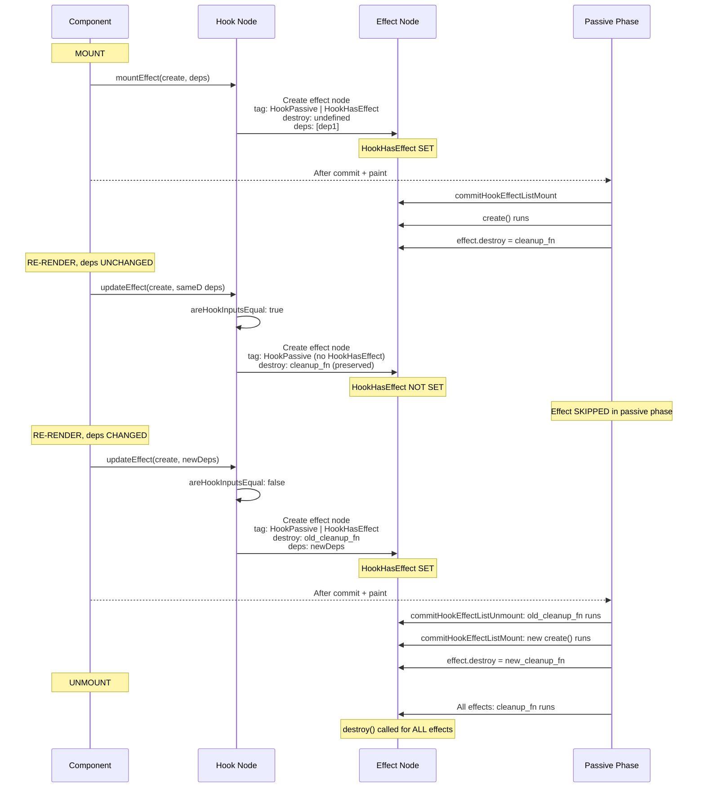
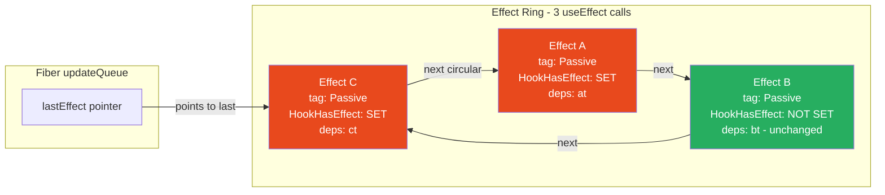

# 21 · useEffect Internals

> **useEffect is not a lifecycle method. It is a synchronization primitive — a mechanism for declaring that some external system should be kept in sync with a specific subset of React state. Understanding what useEffect actually is at the implementation level explains every behavior that confuses React developers: why cleanup runs before setup, why effects fire bottom-up, why the dependency array is a lie detector, and why the empty array pattern is a trap for stale state.**

The mental model most developers have for `useEffect` is wrong in subtle ways that lead to real bugs. This document replaces that mental model with a mechanical understanding of what React actually does with every `useEffect` call — from the hook node structure through the effect flag system through the passive effects execution phase.

---

## Table of Contents

- [What useEffect Actually Is](#what-useeffect-actually-is)
- [The Effect Node Structure](#the-effect-node-structure)
- [Mount: mountEffect](#mount-mounteffect)
- [Update: updateEffect](#update-updateeffect)
- [How HookHasEffect Is Set and Cleared](#how-hookhasheffect-is-set-and-cleared)
- [The Dependency Comparison Mechanism](#the-dependency-comparison-mechanism)
- [How Effects Are Stored on the Fiber](#how-effects-are-stored-on-the-fiber)
- [The Passive Effects Execution Pipeline](#the-passive-effects-execution-pipeline)
- [Cleanup: When and How It Runs](#cleanup-when-and-how-it-runs)
- [The Cleanup-Before-Setup Guarantee](#the-cleanup-before-setup-guarantee)
- [Effect Execution Order in the Tree](#effect-execution-order-in-the-tree)
- [Infinite Loops: Root Causes](#infinite-loops-root-causes)
- [The Stale Closure in useEffect](#the-stale-closure-in-useeffect)
- [useEffect vs useLayoutEffect Internals](#useeffect-vs-uselayouteffect-internals)
- [Architecture Diagrams](#architecture-diagrams)
- [Good Practices](#good-practices)
- [Bad Practices](#bad-practices)
- [Mental Model](#mental-model)
- [Common Misconceptions](#common-misconceptions)
- [Exercises](#exercises)
- [Further Reading](#further-reading)

---

## What useEffect Actually Is

`useEffect` is a hook that registers a **side-effecting function** to run after React has committed changes to the DOM. It is explicitly not:

- A lifecycle method (not `componentDidMount` or `componentDidUpdate`)
- A way to run code "after render"
- A mechanism for transforming data

It is a **synchronization hook**: you describe what external system should be synchronized with what React state, and React handles the timing of when that synchronization runs.

```tsx
// Correct mental frame:
useEffect(() => {
  // SYNCHRONIZE: "While this component is mounted,
  //  keep the WebSocket connected to roomId"
  const ws = connect(roomId);
  return () => ws.disconnect(); // desynchronize on cleanup
}, [roomId]);

// Wrong mental frame:
useEffect(() => {
  // BAD: "Run this code after the component renders"
  // This frame leads to: wrong deps, missing cleanup, infinite loops
}, []);
```

---

## The Effect Node Structure

Each `useEffect` call creates one **effect node** stored on the fiber. Effect nodes form a circular linked list (a **ring**) on the fiber's `updateQueue.lastEffect`:

```js
// Effect node structure (from ReactFiberHooks.js)
const effect = {
  tag: HookPassive | HookHasEffect,
  // tag is a bitmask of flags:
  //   HookPassive (0b1000):  this is a passive effect (useEffect, not useLayoutEffect)
  //   HookLayout (0b0100):   this is a layout effect (useLayoutEffect)
  //   HookInsertion (0b0010): this is an insertion effect (useInsertionEffect)
  //   HookHasEffect (0b0001): this effect NEEDS to run in the current commit
  //   Absence of HookHasEffect: skip this effect

  create: () => {
    // Your setup function
    const connection = connect(roomId);
    return () => connection.disconnect(); // cleanup function
  },

  destroy: undefined,
  // Populated with the return value of create() after first run
  // The cleanup function — called before next setup or on unmount
  // undefined before first run, null if setup returned nothing

  deps: [roomId],
  // The dependency array — compared with Object.is on each render

  next: effect,
  // Circular linked list pointer
  // Last effect's .next = first effect
};
```

---

## Mount: mountEffect

On first render, `mountEffect` creates the effect node and adds it to the fiber:

```js
// From ReactFiberHooks.js
function mountEffect(create, deps) {
  return mountEffectImpl(
    PassiveEffect | PassiveStaticEffect, // flags to set on the FIBER
    HookPassive, // tag to set on the EFFECT NODE
    create,
    deps,
  );
}

function mountEffectImpl(fiberFlags, hookFlags, create, deps) {
  // ─── 1. Create hook node in the fiber's hook linked list ──────────────
  const hook = mountWorkInProgressHook();

  const nextDeps = deps === undefined ? null : deps;

  // ─── 2. Set flags on the FIBER (not the effect node) ──────────────────
  currentlyRenderingFiber.flags |= fiberFlags;
  // PassiveEffect: this fiber has a passive effect to run
  // This flag propagates via subtreeFlags to allow commit phase to find it

  // ─── 3. Create the effect node ────────────────────────────────────────
  hook.memoizedState = pushEffect(
    HookHasEffect | hookFlags, // tag: HAS_EFFECT (must run) + PASSIVE (type)
    create,
    undefined, // destroy: not run yet
    nextDeps,
  );
  // pushEffect creates the effect node and adds it to the fiber's ring
}

function pushEffect(tag, create, destroy, deps) {
  const effect = {
    tag,
    create,
    destroy,
    deps,
    next: null,
  };

  // Add to the circular effect ring on the fiber's updateQueue
  let componentUpdateQueue = currentlyRenderingFiber.updateQueue;

  if (componentUpdateQueue === null) {
    // First effect on this fiber: create the queue
    componentUpdateQueue = createFunctionComponentUpdateQueue();
    currentlyRenderingFiber.updateQueue = componentUpdateQueue;
    componentUpdateQueue.lastEffect = effect.next = effect;
    // Single effect: points to itself
  } else {
    // Additional effect: insert before the first (at the end of the ring)
    const lastEffect = componentUpdateQueue.lastEffect;
    if (lastEffect === null) {
      componentUpdateQueue.lastEffect = effect.next = effect;
    } else {
      const firstEffect = lastEffect.next;
      lastEffect.next = effect;
      effect.next = firstEffect;
      componentUpdateQueue.lastEffect = effect;
      // The ring now ends at this new effect
    }
  }

  return effect;
}
```

On mount, **every effect has `HookHasEffect` set** — all effects must run on first mount, unconditionally.

---

## Update: updateEffect

On re-renders, `updateEffect` checks whether the effect needs to re-run:

```js
function updateEffect(create, deps) {
  return updateEffectImpl(PassiveEffect, HookPassive, create, deps);
}

function updateEffectImpl(fiberFlags, hookFlags, create, deps) {
  // ─── 1. Get the existing hook node (same position as mount) ───────────
  const hook = updateWorkInProgressHook();
  const nextDeps = deps === undefined ? null : deps;

  // ─── 2. Get the previous effect ───────────────────────────────────────
  const prevEffect = hook.memoizedState;
  const destroy = prevEffect.destroy;
  // The cleanup function from the previous run

  // ─── 3. Compare dependencies ──────────────────────────────────────────
  if (nextDeps !== null) {
    const prevDeps = prevEffect.deps;

    if (areHookInputsEqual(nextDeps, prevDeps)) {
      // ✅ Dependencies UNCHANGED
      // Create effect node WITHOUT HookHasEffect
      hook.memoizedState = pushEffect(
        hookFlags, // NO HookHasEffect
        create,
        destroy,
        nextDeps,
      );
      return;
      // This effect will NOT run in the commit phase
      // It's in the ring (so it exists) but won't be executed
    }
  }

  // ─── 4. Dependencies changed (or no deps array) ───────────────────────
  // Set the Passive flag on the fiber (to ensure commit phase visits it)
  currentlyRenderingFiber.flags |= fiberFlags;

  // Create effect node WITH HookHasEffect
  hook.memoizedState = pushEffect(
    HookHasEffect | hookFlags, // HAS_EFFECT: this effect MUST run
    create,
    destroy,
    nextDeps,
  );
  // The cleanup (destroy) from the previous run is preserved in this node
  // It will be called before the new create() runs
}
```

The presence or absence of `HookHasEffect` in the effect's `tag` is the single bit that determines whether an effect runs in the current commit.

---

## How HookHasEffect Is Set and Cleared

```
On MOUNT:
  Every effect: tag = HookPassive | HookHasEffect
  → HookHasEffect is SET
  → Effect will run

On UPDATE, deps UNCHANGED:
  Effect: tag = HookPassive (no HookHasEffect)
  → HookHasEffect is NOT SET
  → Effect will NOT run

On UPDATE, deps CHANGED (or no deps array):
  Effect: tag = HookPassive | HookHasEffect
  → HookHasEffect is SET
  → Effect will run

On UNMOUNT:
  Effect: tag = HookPassive | HookHasEffect (all effects treated as changed)
  → All cleanup functions run
```

The commit phase uses this flag to decide what to execute:

```js
// In ReactFiberCommitWork.js
function commitHookEffectListUnmount(
  flags,
  finishedWork,
  nearestMountedAncestor,
) {
  const updateQueue = finishedWork.updateQueue;
  const lastEffect = updateQueue !== null ? updateQueue.lastEffect : null;

  if (lastEffect !== null) {
    const firstEffect = lastEffect.next;
    let effect = firstEffect;
    do {
      if ((effect.tag & flags) === flags) {
        // flags = HookPassive | HookHasEffect
        // Check: does this effect have BOTH flags?
        const destroy = effect.destroy;
        effect.destroy = undefined;
        if (destroy !== undefined) {
          safelyCallDestroy(finishedWork, nearestMountedAncestor, destroy);
          // Calls the cleanup function
        }
      }
      effect = effect.next;
    } while (effect !== firstEffect); // circular — stop at start
  }
}
```

---

## The Dependency Comparison Mechanism

React uses `areHookInputsEqual` to compare dependency arrays:

```js
function areHookInputsEqual(nextDeps, prevDeps) {
  if (prevDeps === null) {
    // No previous deps (first render, or deps was previously undefined)
    return false; // always re-run
  }

  for (let i = 0; i < prevDeps.length && i < nextDeps.length; i++) {
    if (Object.is(nextDeps[i], prevDeps[i])) {
      continue; // same value — check next dep
    }
    return false; // different value — deps changed, effect must run
  }

  return true; // all deps the same — effect can skip
}
```

### Object.is semantics

`Object.is` is nearly identical to `===` with two exceptions:

```js
Object.is(NaN, NaN); // true (=== gives false)
Object.is(0, -0); // false (=== gives true)
```

For dependency comparison, the practical implications:

```js
// Primitives: compared by value (correct behavior)
Object.is(5, 5); // true → effect skips
Object.is(5, 6); // false → effect runs
Object.is("a", "a"); // true → effect skips

// Objects: compared by REFERENCE
Object.is({}, {}); // false → effect runs every render
Object.is([], []); // false → effect runs every render

// Functions: compared by REFERENCE
Object.is(fn, fn); // true if same reference
Object.is(
  () => {},
  () => {},
); // false → effect runs every render
```

### The most common dependency mistake

```tsx
// ❌ Options object recreated on every render → effect runs every render
function DataFetcher({ userId }: { userId: string }) {
  const options = { includeDeleted: false, limit: 20 }; // new object each render

  useEffect(() => {
    fetchUser(userId, options);
  }, [userId, options]); // options is always a new reference → always runs
}

// ✅ Fix 1: Move stable objects outside the component
const DEFAULT_OPTIONS = { includeDeleted: false, limit: 20 };
function DataFetcher({ userId }: { userId: string }) {
  useEffect(() => {
    fetchUser(userId, DEFAULT_OPTIONS);
  }, [userId]); // DEFAULT_OPTIONS is stable — not needed in deps
}

// ✅ Fix 2: Use primitive deps instead of object deps
function DataFetcher({ userId, includeDeleted }: Props) {
  useEffect(() => {
    fetchUser(userId, { includeDeleted, limit: 20 });
    // Don't put the object in deps — put its primitive components
  }, [userId, includeDeleted]); // primitives compare correctly
}
```

---

## How Effects Are Stored on the Fiber

The relationship between the fiber, its hook nodes, and its effect ring is important to understand:

```
Fiber (FunctionComponent):
  memoizedState: HookNode-0 → HookNode-1 → HookNode-2 → null
  updateQueue: { lastEffect: EffectNode-C }

  HookNode-0 (useState): { memoizedState: count, queue: {...} }
  HookNode-1 (useEffect A): { memoizedState: EffectNode-A }
  HookNode-2 (useEffect B): { memoizedState: EffectNode-B }

  EffectNode-C → EffectNode-A → EffectNode-B → EffectNode-C (circular)
  (updateQueue.lastEffect = EffectNode-C = last in ring)
  (EffectNode-C.next = EffectNode-A = first in ring)
```

### Multiple effects on the same fiber

```tsx
function Component() {
  const [count] = useState(0); // hook node 0: in memoizedState list

  useEffect(() => {
    // hook node 1: in memoizedState list
    // effect A
    console.log("Effect A");
    return () => console.log("Cleanup A");
  }, []);

  useEffect(() => {
    // hook node 2: in memoizedState list
    // effect B
    console.log("Effect B");
    return () => console.log("Cleanup B");
  }, [count]);
}

// The fiber's updateQueue.lastEffect ring (after mount):
// EffectNodeB → EffectNodeA → EffectNodeB (circular)
// lastEffect = EffectNodeB (last added)
// lastEffect.next = EffectNodeA (first added = first to run)

// Execution order: A then B (FIFO — first added, first run)
```

---

## The Passive Effects Execution Pipeline

After the commit phase completes and the browser paints, React runs passive effects via a scheduled microtask/macrotask:

```js
// Scheduled after commitRoot:
scheduleCallback(NormalSchedulerPriority, () => {
  flushPassiveEffects();
  return null;
});

function flushPassiveEffects() {
  if (rootWithPendingPassiveEffects !== null) {
    const root = rootWithPendingPassiveEffects;
    const lanes = pendingPassiveEffectsLanes;
    rootWithPendingPassiveEffects = null;
    pendingPassiveEffectsLanes = NoLanes;

    const prevExecutionContext = executionContext;
    executionContext |= CommitContext;

    // ─── Phase 1: Run ALL cleanups first ────────────────────────────────
    commitPassiveUnmountEffects(root.current);
    // Walks the fiber tree
    // For every fiber with HookPassive | HookHasEffect:
    //   Calls effect.destroy() if it exists

    // ─── Phase 2: Run ALL setups after all cleanups ───────────────────────
    commitPassiveMountEffects(root, root.current, lanes);
    // Walks the fiber tree
    // For every fiber with HookPassive | HookHasEffect:
    //   Calls effect.create()
    //   Stores return value in effect.destroy

    executionContext = prevExecutionContext;

    // Effects may have triggered more updates — flush them
    flushSyncCallbacks();
    return true;
  }
  return false;
}
```

### Why all cleanups run before all setups

The order is:

1. ALL cleanup functions in the tree (from previous render's effects that need to re-run)
2. ALL setup functions in the tree (current render's effects that need to run)

This is NOT interleaved per-component. It is two separate tree passes:

```
// Incorrect mental model (interleaved per component):
// Component A cleanup → Component A setup → Component B cleanup → Component B setup

// Correct (two full passes):
// Component A cleanup → Component B cleanup → Component A setup → Component B setup
```

Why? Because during cleanup, you may need to read values that other components' setups will overwrite. The two-pass approach ensures that all "old" external state is cleaned up before any "new" external state is set up.

```tsx
// Example where order matters:
function MediaPlayer({ videoId }: { videoId: string }) {
  useEffect(() => {
    videoRegistry.register(videoId, playerRef.current);
    return () => {
      videoRegistry.unregister(videoId); // cleanup: remove from registry
    };
  }, [videoId]);
}

// If two MediaPlayer instances render with different videoIds:
// Pass 1 (cleanups): unregister old-videoId-A, unregister old-videoId-B
// Pass 2 (setups): register new-videoId-A, register new-videoId-B
// Registry is always consistent — no overlap between old and new registrations

// If interleaved: register A while B is still registered with old ID
// → Potential registry conflict during the transition
```

---

## Cleanup: When and How It Runs

The cleanup function returned from `useEffect` runs in exactly three scenarios:

### Scenario 1: Before the next effect setup (dependencies changed)

```tsx
function ChatRoom({ roomId }: { roomId: string }) {
  useEffect(() => {
    const ws = connect(roomId); // setup: connect to roomId
    return () => ws.disconnect(); // cleanup: this runs BEFORE next setup
  }, [roomId]);
}

// roomId changes from 'general' to 'engineering':
// 1. React renders with 'engineering'
// 2. Effect has HookHasEffect (deps changed)
// 3. Commit → paint
// 4. flushPassiveEffects:
//    Cleanup pass: ws.disconnect() for 'general'
//    Setup pass: ws = connect('engineering')
// Result: connected to 'engineering', never connected to both simultaneously
```

### Scenario 2: On unmount

```tsx
// Component unmounts (removed from tree):
// React marks the fiber for deletion in reconciliation
// In commitDeletion, cleanup effects are scheduled
// flushPassiveEffects:
//   Cleanup for EVERY effect on the unmounting fiber
//   Effect nodes: cleanup runs even if HookHasEffect is NOT set
//   (unmounting is different from "deps changed" — all effects clean up)
```

### Scenario 3: Strict Mode deliberate remount

```tsx
// In StrictMode development:
// Mount → Unmount → Mount
// Effects fire: setup → cleanup → setup
// This reveals cleanup correctness problems early
```

### The destroy field lifecycle

```js
// In the effect node:
effect.destroy = undefined; // Before first run

// After first create() runs:
effect.destroy = cleanup_function; // or null if create() returned nothing

// Before next create() runs:
// commitHookEffectListUnmount calls effect.destroy()
// Then resets: effect.destroy = undefined

// After next create() runs:
effect.destroy = new_cleanup_function;
```

---

## The Cleanup-Before-Setup Guarantee

React guarantees that the previous cleanup always runs before the next setup. This guarantee enables correct resource management:

```tsx
// Without the guarantee: potential resource leak
// (not what React does — shown for contrast)
function BadOrder() {
  // setup('A') runs
  // Props change to B
  // setup('B') runs ← B starts before A is cleaned up
  // cleanup('A') runs ← A cleans up after B already started
  // If A's cleanup affects B's resources: bug
}

// With React's guarantee: always cleanup before setup
function CorrectOrder() {
  useEffect(() => {
    const subscription = subscribe(topic);
    return () => subscription.unsubscribe(); // cleanup A
  }, [topic]);

  // Props change: topic A → topic B
  // React guarantee:
  // 1. cleanup A: subscription.unsubscribe() for topic A
  // 2. setup B: subscribe(topic B)
  // You are never subscribed to two topics simultaneously
}
```

---

## Effect Execution Order in the Tree

Effects execute **bottom-up** — children's effects run before parents' effects. This is a consequence of how the commit phase traverses fibers:

```tsx
function App() {
  useEffect(() => {
    console.log("App effect");
  });
  return <Section />;
}

function Section() {
  useEffect(() => {
    console.log("Section effect");
  });
  return <Article />;
}

function Article() {
  useEffect(() => {
    console.log("Article effect");
  });
  return <div>Content</div>;
}

// Mount output (bottom-up):
// Article effect
// Section effect
// App effect

// Cleanup on unmount (also bottom-up):
// Article cleanup
// Section cleanup
// App cleanup
```

### Why bottom-up?

The commit phase traverses `completeWork` order — which is naturally bottom-up (deepest children complete first). Effects are registered during this traversal and executed in the same order.

This means: when a parent's effect runs, all child effects have already run. A parent can safely read DOM state set by a child's effect.

---

## Infinite Loops: Root Causes

`useEffect` infinite loops are one of the most common React bugs. They all have the same root cause: **the effect's side effect triggers a state update that causes a re-render, which causes the effect to run again, which causes another state update...**

### Type 1: Missing or wrong dependencies → unexpected re-run

```tsx
// ❌ Infinite loop: effect produces data, data is in deps
function InfiniteLoop1() {
  const [data, setData] = useState([]);

  useEffect(() => {
    setData([...data, "new item"]); // adds to data
  }, [data]); // data changes → effect re-runs → data changes again...
}

// Fix: don't put data in deps if the effect modifies data
function Fixed1() {
  const [data, setData] = useState<string[]>([]);

  useEffect(() => {
    setData((prev) => [...prev, "new item"]); // use updater
    // Don't include data in deps
  }, []); // run once on mount
}
```

### Type 2: Object/function dependency created in render

```tsx
// ❌ Infinite loop: config is a new object on every render
// Object.is({}, {}) = false → effect always runs → setState → re-render → new object
function InfiniteLoop2({ userId }: { userId: string }) {
  const [data, setData] = useState(null);
  const config = { userId, timestamp: Date.now() }; // new on every render

  useEffect(() => {
    fetchUser(config).then(setData);
  }, [config]); // config is always a new reference → infinite loop
}

// Fix: use primitives in deps, not objects
function Fixed2({ userId }: { userId: string }) {
  const [data, setData] = useState(null);

  useEffect(() => {
    fetchUser({ userId }).then(setData);
  }, [userId]); // primitive dep — correct comparison
}
```

### Type 3: setState inside an effect with no deps array

```tsx
// ❌ Infinite loop: no deps array → runs after every render
function InfiniteLoop3() {
  const [count, setCount] = useState(0);

  useEffect(() => {
    setCount((c) => c + 1); // setState → re-render → effect runs → setState...
  }); // no deps array = runs after every render

  return <div>{count}</div>;
}

// Fix: add deps array
function Fixed3() {
  const [count, setCount] = useState(0);

  useEffect(() => {
    setCount((c) => c + 1);
  }, []); // run once on mount only
}
```

### Type 4: useCallback/useMemo missing from deps

```tsx
// ❌ Often infinite loop (or unexpected re-runs):
function InfiniteLoop4({ userId }: { userId: string }) {
  const [data, setData] = useState(null);

  // fetchUser is a new function on every render
  const fetchUser = () => api.getUser(userId);

  useEffect(() => {
    fetchUser().then(setData);
  }, [fetchUser]); // new function every render → effect always runs
}

// Fix: useCallback to stabilize the function reference
function Fixed4({ userId }: { userId: string }) {
  const [data, setData] = useState(null);

  const fetchUser = useCallback(() => api.getUser(userId), [userId]);

  useEffect(() => {
    fetchUser().then(setData);
  }, [fetchUser]); // stable reference — only re-runs when userId changes
}
```

---

## The Stale Closure in useEffect

The most persistent useEffect bug is stale closures — the effect captures a value from a specific render and that value becomes outdated:

```tsx
function MessageStream({ channelId }: { channelId: string }) {
  const [messages, setMessages] = useState<Message[]>([]);

  useEffect(() => {
    const ws = new WebSocket(`wss://chat/${channelId}`);

    ws.onmessage = (event) => {
      // ❌ Stale closure: messages is always [] (from render 1)
      setMessages([...messages, JSON.parse(event.data)]);
      // After 10 messages: this always appends to [] → only 1 message shows
    };

    return () => ws.close();
  }, [channelId]); // correctly: re-runs when channelId changes
  // but: messages is NOT in deps → stale closure inside ws.onmessage
}
```

### The complete diagnosis

```
Render 1: messages = []
  useEffect runs: ws = new WebSocket(...)
  ws.onmessage captures: { messages: [] }

Message 1 arrives:
  ws.onmessage: setMessages([...[], msg1]) → messages = [msg1]

Render 2: messages = [msg1]
  useEffect deps [channelId]: unchanged → effect does NOT re-run
  ws.onmessage closure still captures: { messages: [] }

Message 2 arrives:
  ws.onmessage: setMessages([...[], msg2]) → messages = [msg2]
  (NOT [msg1, msg2] — the closure sees messages = [], not [msg1])
```

### Fix 1: Updater function (cleanest)

```tsx
useEffect(() => {
  const ws = new WebSocket(`wss://chat/${channelId}`);
  ws.onmessage = (event) => {
    // ✅ Updater function: doesn't close over messages
    setMessages((prev) => [...prev, JSON.parse(event.data)]);
    // prev is always the current queued state — never stale
  };
  return () => ws.close();
}, [channelId]);
```

### Fix 2: Ref to store current value

```tsx
const messagesRef = useRef(messages);
useLayoutEffect(() => {
  messagesRef.current = messages; // always up to date
}, [messages]);

useEffect(() => {
  const ws = new WebSocket(`wss://chat/${channelId}`);
  ws.onmessage = (event) => {
    // ✅ Reads from ref — always current value
    setMessages([...messagesRef.current, JSON.parse(event.data)]);
  };
  return () => ws.close();
}, [channelId]);
```

### Fix 3: useEffectEvent (React 19)

```tsx
const onMessage = useEffectEvent((event: MessageEvent) => {
  // This function sees the latest messages without being reactive
  setMessages((prev) => [...prev, JSON.parse(event.data)]);
});

useEffect(() => {
  const ws = new WebSocket(`wss://chat/${channelId}`);
  ws.onmessage = onMessage; // stable reference, always current
  return () => ws.close();
}, [channelId]); // onMessage not in deps — it's not reactive
```

---

## useEffect vs useLayoutEffect Internals

The two hooks use the same implementation (`mountEffectImpl`/`updateEffectImpl`) with different arguments:

```js
// useEffect
function mountEffect(create, deps) {
  return mountEffectImpl(
    PassiveEffect | PassiveStaticEffect, // fiber flags
    HookPassive, // effect tag
    create,
    deps,
  );
}

// useLayoutEffect
function mountLayoutEffect(create, deps) {
  let fiberFlags = UpdateEffect;
  if (enableCreateEventHandleAPI) {
    fiberFlags |= LayoutStaticEffect;
  }
  return mountEffectImpl(
    fiberFlags, // fiber flags (different from useEffect)
    HookLayout, // effect tag (HookLayout vs HookPassive)
    create,
    deps,
  );
}
```

The difference is the **fiber flag** and the **effect tag**:

|               | useEffect           | useLayoutEffect      |
| ------------- | ------------------- | -------------------- |
| Fiber flag    | `PassiveEffect`     | `UpdateEffect`       |
| Effect tag    | `HookPassive`       | `HookLayout`         |
| Commit pass   | `PassiveMask`       | `LayoutMask`         |
| Timing        | After browser paint | Before browser paint |
| Blocks paint? | No                  | Yes                  |

The commit phase uses the tag to decide which pass processes which effects:

```js
// Layout phase (before paint): processes HookLayout effects
commitHookEffectListUnmount(HookLayout | HookHasEffect, finishedWork, ...);
commitHookEffectListMount(HookLayout | HookHasEffect, finishedWork, ...);

// Passive phase (after paint): processes HookPassive effects
commitHookEffectListUnmount(HookPassive | HookHasEffect, finishedWork, ...);
commitHookEffectListMount(HookPassive | HookHasEffect, finishedWork, ...);
```

---

## Architecture Diagrams

### useEffect lifecycle: mount through update through unmount



### Effect node ring structure on fiber



---

## Good Practices

### ✅ Good Practice — Effect that synchronizes with a single external system

```tsx
/**
 * Good: Each useEffect synchronizes with exactly one external system.
 * Clear setup + cleanup pair. Minimal deps. Updater functions for state.
 */
function WebSocketRoom({ roomId, userId }: RoomProps) {
  const [messages, setMessages] = useState<Message[]>([]);
  const [isConnected, setIsConnected] = useState(false);
  const [error, setError] = useState<Error | null>(null);

  // One effect: WebSocket connection lifecycle
  useEffect(() => {
    let ws: WebSocket | null = null;
    let didCancel = false;

    function connect() {
      ws = new WebSocket(`wss://chat.example.com/rooms/${roomId}`);

      ws.onopen = () => {
        if (!didCancel) setIsConnected(true);
      };

      ws.onmessage = (event) => {
        if (!didCancel) {
          setMessages((prev) => [...prev, JSON.parse(event.data)]);
        }
      };

      ws.onerror = (e) => {
        if (!didCancel) setError(new Error("WebSocket error"));
      };

      ws.onclose = () => {
        if (!didCancel) setIsConnected(false);
      };
    }

    connect();

    return () => {
      didCancel = true;
      ws?.close();
    };
  }, [roomId]); // only re-connect when roomId changes

  return (
    <div>
      <ConnectionStatus isConnected={isConnected} error={error} />
      <MessageList messages={messages} />
    </div>
  );
}
```

**Why this works:** The `didCancel` flag prevents state updates after cleanup (safe for abandoned renders and unmounts). The updater function `prev => [...]` prevents stale closure on `messages`. The single `roomId` dep ensures reconnection only when the room changes, not on every render.

---

## Bad Practices

### ⚠️ Bad Practice — Using useEffect to derive state (causes extra render)

```tsx
/**
 * Bad: useEffect used to transform data for rendering.
 * This is the wrong abstraction — it causes:
 * 1. Extra render cycle (one with stale data, one with correct data)
 * 2. User sees stale state briefly
 * 3. More complex code than the alternative
 * 4. Potential infinite loop if not careful with deps
 */
function ProductList({ products, category }: ProductListProps) {
  const [filtered, setFiltered] = useState<Product[]>([]);

  // ❌ useEffect to derive filtered list from props
  useEffect(() => {
    setFiltered(
      category ? products.filter((p) => p.category === category) : products,
    );
  }, [products, category]);
  // Render 1 (on prop change): filtered = old filtered list (stale)
  // Render 2 (after effect): filtered = new correct filtered list
  // User sees flash of stale content on every category change

  return (
    <ul>
      {filtered.map((p) => (
        <ProductItem key={p.id} product={p} />
      ))}
    </ul>
  );
}

/**
 * ✅ Correct: Derive during render with useMemo — always consistent
 */
function ProductList({ products, category }: ProductListProps) {
  // Computed synchronously — never stale, never causes extra renders
  const filtered = useMemo(
    () =>
      category ? products.filter((p) => p.category === category) : products,
    [products, category],
  );

  return (
    <ul>
      {filtered.map((p) => (
        <ProductItem key={p.id} product={p} />
      ))}
    </ul>
  );
}
```

**Production impact:** In a product catalog with 100 items and category filters, the useEffect version shows wrong products for at least one render cycle on every filter change. With fast users or slow devices, this flash is visible. It also makes the filter interaction feel slightly slower (two renders instead of one). At scale — a filter UI that updates 10+ times per second — this doubles the render count and processing time.

---

## Mental Model

> 💡 **The useEffect mental model:**
>
> `useEffect` is a **maintenance contract** between your component and an external system. The contract has three clauses: (1) **When to activate** — the dependency array defines when the contract starts or restarts; (2) **What to do** — the setup function performs the synchronization; (3) **How to terminate** — the cleanup function ends the previous contract before the new one begins. The dependency array is not a cache key — it is a "re-negotiate conditions" trigger. When deps change, the old contract is terminated (cleanup runs) and a new contract is negotiated (setup runs). An empty deps array means "this contract never needs renegotiating — sign it once on mount, terminate it only on unmount." React ensures you're never in two active contracts for the same resource simultaneously — cleanup always runs before the next setup.

---

## Common Misconceptions

### "useEffect with [] runs once"

`useEffect` with `[]` runs once **per mount**. In Strict Mode, components deliberately mount → unmount → remount, so the effect runs twice in development. In production, it runs once per component mount event — if a component unmounts and remounts (navigation away and back), the effect runs again.

### "useEffect deps array is like a cache"

The deps array is not a cache — it is a "when to re-synchronize" declaration. It should list every reactive value the effect uses, not a subset chosen for performance. Missing deps causes stale closures. Extra deps cause unnecessary re-synchronizations (but are always correct).

### "useEffect is like componentDidMount"

`componentDidMount` never had a cleanup phase and only ran on the class instance. `useEffect` is fundamentally different: it has cleanup, it can re-run, it's tied to values (not just the component lifecycle), and it runs after every commit where its deps changed (not just mount).

### "Cleanup runs when the component unmounts"

Cleanup runs in TWO situations: (1) before the next setup when deps changed, and (2) when the component unmounts. It does NOT only run on unmount — it runs on every re-synchronization.

### "An empty deps array is always correct for 'one-time setup'"

An empty deps array is correct only when the effect truly has no dependency on any reactive value. If the effect uses a prop or state value but has `[]`, the closure will be stale after the first render. The ESLint exhaustive-deps rule is not pedantic — it catches real bugs.

---

## Exercises

### Exercise 1 — Observe the cleanup-before-setup order

```tsx
function TimestampEffect({ id }: { id: string }) {
  useEffect(() => {
    const timestamp = Date.now();
    console.log(`Setup [${id}] at ${timestamp}`);
    return () => console.log(`Cleanup [${id}] at ${Date.now()}`);
  }, [id]);

  return <div>{id}</div>;
}
```

Render `<TimestampEffect id="a" />`. Change to `<TimestampEffect id="b" />`. Observe console:

- Cleanup [a] logs BEFORE Setup [b]
- The timestamps confirm: cleanup always precedes setup

### Exercise 2 — Find the stale closure

```tsx
function Counter() {
  const [count, setCount] = useState(0);

  useEffect(() => {
    const id = setInterval(() => {
      console.log(`Count is: ${count}`); // always 0?
      setCount(count + 1); // always sets to 1?
    }, 1000);
    return () => clearInterval(id);
  }, []); // deliberately empty deps

  return <p>{count}</p>;
}
```

1. Render this. Observe count on screen vs console log.
2. The screen count increases (because... why?). The console always shows 0. Trace both.
3. Fix the stale closure with an updater function. Verify.
4. Now explain: why does the on-screen count increase despite the stale closure?

_(Answer: `setCount(count + 1)` schedules `setCount(0 + 1) = setCount(1)` every second. React sees 1 === 1 on the second call → eager optimization skips the re-render? No — because the previous render committed count=1, the next eager check: `basicStateReducer(1, 1)` = 1, `Object.is(1, 1)` = true → render IS skipped after the first one. So count is always 1, not increasing — the stale closure bug is real!)_

### Exercise 3 — Build a subscription hook from scratch

```tsx
// Implement this hook using only useEffect and useRef:
function useEventEmitter<T>(emitter: EventEmitter, event: string): T | null {
  const [value, setValue] = useState<T | null>(null);

  useEffect(() => {
    // Your implementation:
    // 1. Subscribe to emitter.on(event, ...)
    // 2. Handle the callback (avoid stale closure!)
    // 3. Unsubscribe in cleanup
  }, [emitter, event]);

  return value;
}

// Test: Does it correctly update when event fires?
// Test: Does it correctly unsubscribe when event changes?
// Test: Does it correctly unsubscribe when component unmounts?
// Test: Does it pass React StrictMode (double-invoke)?
```

---

## Further Reading

- [React Source: ReactFiberHooks.js — mountEffect, updateEffect, dispatchEffect](https://github.com/facebook/react/blob/main/packages/react-reconciler/src/ReactFiberHooks.js)
- [React Source: ReactFiberCommitWork.js — commitPassiveMountEffects, commitPassiveUnmountEffects](https://github.com/facebook/react/blob/main/packages/react-reconciler/src/ReactFiberCommitWork.js)
- [React Docs: Synchronizing with Effects](https://react.dev/learn/synchronizing-with-effects) — Official guide with the synchronization mental model
- [React Docs: You Might Not Need an Effect](https://react.dev/learn/you-might-not-need-an-effect) — All the wrong uses of useEffect
- [Dan Abramov: A Complete Guide to useEffect](https://overreacted.io/a-complete-guide-to-useeffect/) — The canonical deep dive
- [React Docs: useEffectEvent](https://react.dev/reference/react/experimental_useEffectEvent) — The React 19 solution to non-reactive event callbacks
- Next in this handbook: [22 · useMemo & useCallback](./03-usememo-usecallback.md)

---

_Part of the [React + Next.js Engineering Handbook](../../README.md)_
