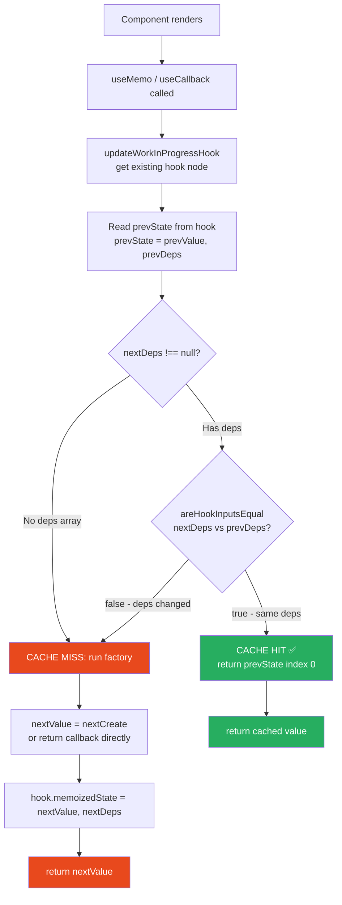
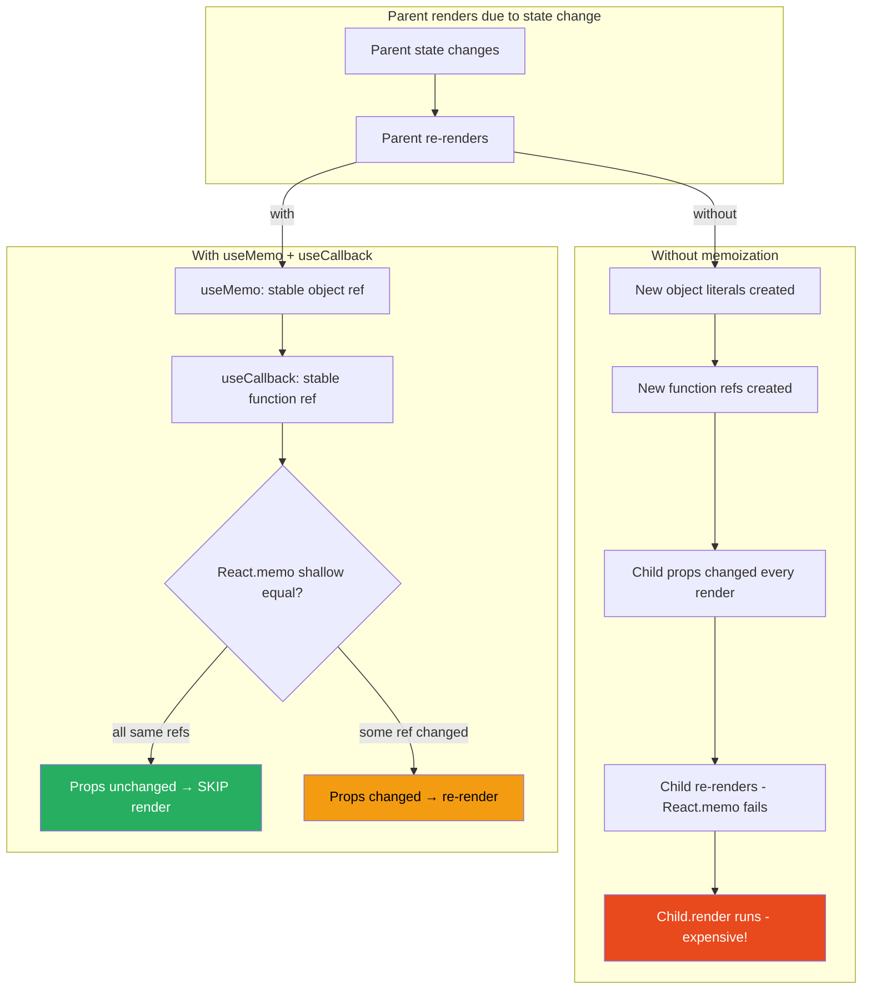

# 22 · useMemo & useCallback

> **useMemo and useCallback are the same hook. useCallback(fn, deps) is literally useMemo(() => fn, deps). Both store a value in the fiber's hook linked list, compare dependencies with Object.is on every render, and return the cached value when dependencies are unchanged. The confusion around when to use them, when not to, and what they actually cost is a result of treating them as magic optimizations rather than as memoization primitives with a real overhead. This document explains the complete implementation and the precise cost model so you can make rational engineering decisions.**

The most important truth about `useMemo` and `useCallback`: they do not make your code faster by default. They make it potentially faster at the cost of a guaranteed overhead on every render. The net gain depends entirely on whether the savings from cache hits exceed the cost of dependency comparison and cache management. In many cases, they do not — and adding them makes code slower, not faster.

---

## Table of Contents

- [What useMemo and useCallback Actually Are](#what-usememo-and-usecallback-actually-are)
- [The Hook Node Structure](#the-hook-node-structure)
- [Mount: mountMemo and mountCallback](#mount-mountmemo-and-mountcallback)
- [Update: updateMemo and updateCallback](#update-updatememo-and-updatecallback)
- [The Dependency Comparison](#the-dependency-comparison)
- [useCallback is useMemo in Disguise](#usecallback-is-usememo-in-disguise)
- [The Cost Model: When Memoization Pays Off](#the-cost-model-when-memoization-pays-off)
- [useMemo for Expensive Computations](#usememo-for-expensive-computations)
- [useCallback for Stable Function References](#useCallback-for-stable-function-references)
- [Memoization and React.memo: The Partnership](#memoization-and-reactmemo-the-partnership)
- [The Object Reference Problem](#the-object-reference-problem)
- [When NOT to Use useMemo](#when-not-to-use-usememo)
- [When NOT to Use useCallback](#when-not-to-use-usecallback)
- [The React Compiler: Automatic Memoization](#the-react-compiler-automatic-memoization)
- [Architecture Diagrams](#architecture-diagrams)
- [Good Practices](#good-practices)
- [Bad Practices](#bad-practices)
- [Mental Model](#mental-model)
- [Common Misconceptions](#common-misconceptions)
- [Exercises](#exercises)
- [Further Reading](#further-reading)

---

## What useMemo and useCallback Actually Are

Both hooks store a value in the fiber's hook linked list and return that cached value when dependencies haven't changed. The stored value is:

- For `useMemo`: the return value of the factory function
- For `useCallback`: the function itself (which is also a value)

```tsx
// useMemo: stores the RESULT of calling the factory
const expensiveResult = useMemo(() => compute(a, b), [a, b]);
// On deps change: compute(a, b) → store result → return result
// On same deps: skip compute() → return stored result

// useCallback: stores the FUNCTION itself
const handler = useCallback(() => doSomething(x), [x]);
// On deps change: store new function → return new function
// On same deps: skip → return stored function
```

They are optimization primitives — they trade a guaranteed cost (dep comparison every render) for a potential savings (skipping expensive computation or stabilizing references). Whether that trade is worth it requires measuring, not guessing.

---

## The Hook Node Structure

Each `useMemo` and `useCallback` call creates one hook node:

```js
// useMemo hook node
const hook = {
  memoizedState: [cachedValue, deps],
  // memoizedState is a 2-element array: [value, prevDeps]
  // React stores both together so it can compare deps and return value in one lookup

  baseState: null,
  baseQueue: null,
  queue: null, // no update queue — useMemo has no dispatch mechanism
  next: null, // pointer to next hook
};

// After mountMemo:
hook.memoizedState = [computedValue, [dep1, dep2]];
// On update with same deps:
hook.memoizedState; // still [computedValue, [dep1, dep2]] — untouched
// On update with changed deps:
hook.memoizedState = [newComputedValue, [newDep1, newDep2]];
```

The 2-element tuple `[value, deps]` is stored together so React can:

1. Read the previous deps (`memoizedState[1]`)
2. Compare with current deps
3. Return `memoizedState[0]` if unchanged, or compute a new value and update the tuple

---

## Mount: mountMemo and mountCallback

```js
// From ReactFiberHooks.js
function mountMemo(nextCreate, deps) {
  // ─── 1. Create hook node ───────────────────────────────────────────────
  const hook = mountWorkInProgressHook();
  const nextDeps = deps === undefined ? null : deps;

  // ─── 2. Run the factory function (always on mount) ────────────────────
  const nextValue = nextCreate();
  // In production: always calls nextCreate()
  // In development (StrictMode): may call twice to detect impurities

  // ─── 3. Store [value, deps] tuple ─────────────────────────────────────
  hook.memoizedState = [nextValue, nextDeps];

  return nextValue;
}

function mountCallback(callback, deps) {
  // ─── 1. Create hook node ───────────────────────────────────────────────
  const hook = mountWorkInProgressHook();
  const nextDeps = deps === undefined ? null : deps;

  // ─── 2. Store the function itself (don't call it) ─────────────────────
  hook.memoizedState = [callback, nextDeps];
  // Note: callback is stored directly — NOT called
  // Compare with mountMemo which calls nextCreate()

  return callback;
}
```

On mount, both hooks always execute their "setup":

- `useMemo`: calls the factory function
- `useCallback`: stores the current function reference

There is no caching benefit on the first render — memoization only applies to subsequent renders.

---

## Update: updateMemo and updateCallback

```js
function updateMemo(nextCreate, deps) {
  // ─── 1. Get existing hook node ────────────────────────────────────────
  const hook = updateWorkInProgressHook();
  const nextDeps = deps === undefined ? null : deps;

  // ─── 2. Read cached value and previous deps ───────────────────────────
  const prevState = hook.memoizedState;
  // prevState = [prevValue, prevDeps]

  if (prevState !== null) {
    if (nextDeps !== null) {
      const prevDeps = prevState[1]; // extract previous deps

      // ─── 3. Compare dependencies ─────────────────────────────────────
      if (areHookInputsEqual(nextDeps, prevDeps)) {
        // ✅ CACHE HIT: deps unchanged
        return prevState[0]; // return cached value — DO NOT call nextCreate()
      }
    }
  }

  // ─── 4. CACHE MISS: deps changed ──────────────────────────────────────
  const nextValue = nextCreate(); // call the factory function
  hook.memoizedState = [nextValue, nextDeps]; // update cache
  return nextValue;
}

function updateCallback(callback, deps) {
  const hook = updateWorkInProgressHook();
  const nextDeps = deps === undefined ? null : deps;
  const prevState = hook.memoizedState;

  if (prevState !== null) {
    if (nextDeps !== null) {
      const prevDeps = prevState[1];
      if (areHookInputsEqual(nextDeps, prevDeps)) {
        return prevState[0]; // ✅ CACHE HIT: return same function reference
      }
    }
  }

  // CACHE MISS: store new callback
  hook.memoizedState = [callback, nextDeps];
  return callback;
}
```

The pattern is identical for both hooks. The only difference: `useMemo` calls `nextCreate()` on cache miss, `useCallback` returns `callback` directly.

---

## The Dependency Comparison

Both hooks use `areHookInputsEqual` — the same function used by `useEffect`:

```js
function areHookInputsEqual(nextDeps, prevDeps) {
  if (prevDeps === null) return false;

  for (let i = 0; i < prevDeps.length && i < nextDeps.length; i++) {
    if (Object.is(nextDeps[i], prevDeps[i])) continue;
    return false; // different value found
  }
  return true;
}
```

This comparison runs on **every render** regardless of whether the cache hits or misses. This is the guaranteed overhead — it cannot be avoided by using `useMemo`.

### The comparison cost

For a dependency array of `[a, b, c]`:

1. `Object.is(nextA, prevA)` — one comparison
2. `Object.is(nextB, prevB)` — one comparison
3. `Object.is(nextC, prevC)` — one comparison

For primitives (string, number, boolean): comparison is effectively free (pointer comparison or immediate equality).

For objects and arrays: comparison is also effectively free — it compares references (pointers), not deep values. `Object.is({a:1}, {a:1})` is `false` in O(1), not O(n).

The overhead per `useMemo`/`useCallback` call per render is approximately:

- Hook node traversal: ~1 pointer dereference
- Deps array read: ~1 array access
- Comparison loop: ~N comparisons (where N = deps.length)
- Tuple read: ~1 array access

Total: ~microseconds per call. Negligible for individual hooks, measurable when you have hundreds.

---

## useCallback is useMemo in Disguise

This is not a metaphor — it is literally true in React's source:

```js
// From ReactFiberHooks.js
function mountCallback(callback, deps) {
  const hook = mountWorkInProgressHook();
  const nextDeps = deps === undefined ? null : deps;
  hook.memoizedState = [callback, nextDeps]; // store [fn, deps]
  return callback;
}

// mountMemo with factory = () => callback would be identical:
function mountMemo(nextCreate, deps) {
  const hook = mountWorkInProgressHook();
  const nextDeps = deps === undefined ? null : deps;
  const nextValue = nextCreate(); // calls () => callback → returns callback
  hook.memoizedState = [nextValue, nextDeps]; // store [callback, deps]
  return nextValue; // returns callback
}

// So: useCallback(fn, deps) ≡ useMemo(() => fn, deps)
```

The React docs literally state this equivalence. The separate `useCallback` hook exists for ergonomics — `useCallback(fn, deps)` is cleaner than `useMemo(() => fn, deps)`.

### Why this matters

Understanding that they are identical clarifies the mental model:

- `useMemo` memoizes a computed **value**
- `useCallback` memoizes a **function** (which is also a value)
- Both trade guaranteed dep-comparison overhead for potential computation savings

The "savings" from `useCallback` is not computing a function — creating a function is nearly free in JavaScript. The savings is returning the **same function reference**, which prevents downstream components or hooks from treating it as a changed dependency.

---

## The Cost Model: When Memoization Pays Off

The fundamental equation:

```
Net benefit = (Cost of recomputation) - (Cost of dep comparison)
            = (Frequency × Per-recomputation cost) - (Frequency × Comparison cost)

If Net benefit > 0: useMemo/useCallback helps
If Net benefit < 0: useMemo/useCallback hurts (makes code slower)
```

### When useMemo pays off

```tsx
// useMemo pays off when:
// 1. The computation is expensive (>> dep comparison cost)
// 2. AND the deps are stable (frequent cache hits)

// GOOD: expensive computation, stable deps
const sortedData = useMemo(
  () => [...data].sort(complexComparator), // O(n log n), potentially 10ms+
  [data], // only recomputes when data reference changes
);

// GOOD: computation produces an object used as a dep in downstream hooks
const config = useMemo(
  () => ({ endpoint, headers: { Authorization: token } }),
  [endpoint, token], // recomputes when either primitive changes
);
// Without useMemo: config = new object every render → downstream useEffect re-runs every render

// BAD: trivial computation
const doubled = useMemo(() => count * 2, [count]);
// cost of dep comparison + cache management > cost of multiplication
// Just write: const doubled = count * 2;
```

### When useCallback pays off

```tsx
// useCallback pays off when:
// 1. The function is passed as a prop to a React.memo component
//    OR used as a dep in a useEffect/useMemo
// 2. AND the function's logical behavior only changes when deps change

// GOOD: passed to memoized child as prop
const handleSubmit = useCallback(() => {
  submitForm(formData);
}, [formData]);
<React.memo(Form) onSubmit={handleSubmit} />
// Without useCallback: Form re-renders on every parent render (new function ref)
// With useCallback: Form only re-renders when formData changes

// GOOD: used as useEffect dependency
const fetchUser = useCallback(() => api.get(`/users/${userId}`), [userId]);
useEffect(() => {
  fetchUser().then(setUser);
}, [fetchUser]); // re-fetches when fetchUser changes (i.e., when userId changes)

// BAD: function not passed to any memoized consumer
const handleClick = useCallback(() => setCount(c => c + 1), []);
<button onClick={handleClick}>+</button>
// Div doesn't check prop equality — useCallback has zero benefit here
```

---

## useMemo for Expensive Computations

The primary use case for `useMemo` is caching the result of a computation that:

1. Takes measurably more than ~1ms
2. Is called on component renders (not just on user actions)
3. Has inputs that change less frequently than renders

```tsx
// Legitimate expensive computation candidates:
function DataDashboard({ orders, dateRange, filters }: DashboardProps) {
  // ✅ Potentially expensive: sort + filter + aggregate on large dataset
  const summary = useMemo(() => {
    const filtered = orders
      .filter((o) => isInDateRange(o.date, dateRange))
      .filter((o) => matchesFilters(o, filters));

    return {
      total: filtered.reduce((sum, o) => sum + o.amount, 0),
      count: filtered.length,
      byCategory: groupBy(filtered, "category"),
      topCustomers: filtered.sort((a, b) => b.amount - a.amount).slice(0, 10),
    };
  }, [orders, dateRange, filters]);
  // Only recomputes when orders, dateRange, or filters changes
  // Handles parent re-renders, context updates, other state changes
  // without recomputing the expensive aggregate

  return <SummaryDisplay summary={summary} />;
}
```

### Measuring before memoizing

```tsx
// Profile before adding useMemo:
function ProfiledComputation({ data }: { data: DataPoint[] }) {
  const start = performance.now();
  const result = expensiveCompute(data); // how long does this take?
  const duration = performance.now() - start;

  if (duration > 1) {
    console.log(`expensiveCompute: ${duration.toFixed(2)}ms`);
  }

  return <Display result={result} />;
}

// If consistently > 1ms on rerenders: add useMemo
// If consistently < 1ms: don't add useMemo (comparison overhead not worth it)
```

### Object reference stability via useMemo

A non-obvious but valuable use of `useMemo`: producing stable object references for downstream consumers:

```tsx
function UserProvider({ userId, role }: UserProviderProps) {
  const [user, setUser] = useState<User | null>(null);

  // ❌ Without useMemo: new object every render
  // Every Context consumer re-renders (Object.is fails on new object)
  const value = { user, setUser, role };

  // ✅ With useMemo: stable reference when deps unchanged
  const value = useMemo(
    () => ({ user, setUser, role }),
    [user, role], // setUser is stable (dispatch doesn't change)
  );

  return <UserContext.Provider value={value}>{children}</UserContext.Provider>;
}
```

---

## useCallback for Stable Function References

`useCallback` is primarily useful for preventing unnecessary re-renders of memoized child components and preventing unnecessary effect re-runs.

### The prop reference stability pattern

```tsx
function Parent() {
  const [count, setCount] = useState(0);
  const [name, setName] = useState("");

  // ❌ New function on every render → MemoizedChild re-renders on every count change
  const handleNameChange = (newName: string) => setName(newName);

  // ✅ Stable reference → MemoizedChild only re-renders when name changes
  const handleNameChange = useCallback(
    (newName: string) => setName(newName),
    [], // setName is stable — no deps needed
  );

  return (
    <div>
      <button onClick={() => setCount((c) => c + 1)}>{count}</button>
      <MemoizedNameInput
        value={name}
        onChange={handleNameChange} // if not stable: re-renders on every count increment
      />
    </div>
  );
}

const MemoizedNameInput = React.memo(function NameInput({ value, onChange }) {
  return <input value={value} onChange={(e) => onChange(e.target.value)} />;
});
```

### The effect stability pattern

```tsx
// useCallback to stabilize a function that's used as a useEffect dependency
function DataLoader({ userId, onLoaded }: Props) {
  // ❌ onLoaded is a new function on every render → effect re-runs every render
  useEffect(() => {
    loadUser(userId).then(onLoaded);
  }, [userId, onLoaded]); // onLoaded changes every render → infinite fetches

  // Fix: the parent should stabilize onLoaded with useCallback
}

// In the parent:
function Page() {
  const handleLoaded = useCallback((user: User) => {
    setUser(user);
    trackUserLoad(user.id);
  }, []); // stable — only changes if setUser or trackUserLoad change

  return <DataLoader userId={userId} onLoaded={handleLoaded} />;
}
```

---

## Memoization and React.memo: The Partnership

`useMemo`/`useCallback` and `React.memo` work together. `React.memo` prevents re-renders when props are shallowly equal — but shallow equality fails if any prop is a new object or function reference. `useMemo`/`useCallback` stabilize those references.

```tsx
// The complete pattern:

// 1. Memoize the child component (prevents re-render on same props)
const ExpensiveList = React.memo(function ExpensiveList({
  items,
  onSelect,
  config,
}: ExpensiveListProps) {
  // Expensive rendering: 100+ item components
  return (
    <ul>
      {items.map((item) => (
        <ExpensiveItem
          key={item.id}
          item={item}
          onSelect={onSelect}
          config={config}
        />
      ))}
    </ul>
  );
});

// 2. Stabilize the props in the parent
function Page() {
  const [selectedId, setSelectedId] = useState<string | null>(null);
  const [searchTerm, setSearchTerm] = useState("");

  // ✅ Filtered items: memoized so reference is stable when search unchanged
  const filteredItems = useMemo(
    () => items.filter((i) => i.name.includes(searchTerm)),
    [items, searchTerm],
  );

  // ✅ Handler: memoized so reference is stable when selectedId unchanged
  const handleSelect = useCallback(
    (id: string) => setSelectedId(id),
    [], // setSelectedId is stable
  );

  // ✅ Config: memoized so reference is stable when neither dep changes
  const config = useMemo(
    () => ({ multiSelect: false, showMetadata: true }),
    [], // never changes
  );

  return (
    <>
      <input
        value={searchTerm}
        onChange={(e) => setSearchTerm(e.target.value)}
      />
      <ExpensiveList
        items={filteredItems} // stable when searchTerm unchanged
        onSelect={handleSelect} // stable (always)
        config={config} // stable (always)
      />
    </>
  );
}
// Result: typing in search box only re-renders ExpensiveList when
// filteredItems actually changes (i.e., a filter match changes)
// NOT on every keystroke regardless of filter result
```

### React.memo's shallow comparison

`React.memo` by default uses `shallowEqual` — one level of `Object.is`:

```js
function shallowEqual(objA, objB) {
  if (Object.is(objA, objB)) return true;
  if (typeof objA !== "object" || typeof objB !== "object") return false;

  const keysA = Object.keys(objA);
  const keysB = Object.keys(objB);

  if (keysA.length !== keysB.length) return false;

  for (let i = 0; i < keysA.length; i++) {
    if (!Object.is(objA[keysA[i]], objB[keysA[i]])) return false;
  }

  return true;
}
```

For each prop, `Object.is` is used. Object props (like `config`) must be reference-stable for the comparison to pass. This is why `useMemo` is necessary for object props passed to `React.memo` components.

---

## The Object Reference Problem

The most common scenario where `useMemo` is genuinely needed: an object is created in the parent and passed as a prop or dep, causing unnecessary re-renders or effect re-runs.

```tsx
// ❌ Problematic: new object every render
function Dashboard({ data }: DashboardProps) {
  const [darkMode, setDarkMode] = useState(false);

  // New object on every render — any state change in Dashboard causes:
  // - Chart's React.memo check to fail (config !== config)
  // - Chart re-renders with the same visual output
  const chartConfig = {
    colors: darkMode ? DARK_COLORS : LIGHT_COLORS,
    showLegend: true,
    animated: true,
  };

  return <MemoizedChart data={data} config={chartConfig} />;
}

// ✅ With useMemo: config reference only changes when darkMode changes
function Dashboard({ data }: DashboardProps) {
  const [darkMode, setDarkMode] = useState(false);

  const chartConfig = useMemo(
    () => ({
      colors: darkMode ? DARK_COLORS : LIGHT_COLORS,
      showLegend: true,
      animated: true,
    }),
    [darkMode],
  );

  return <MemoizedChart data={data} config={chartConfig} />;
}
```

### Recognizing the pattern that needs useMemo

```tsx
// Pattern: new object/array in component body → passed to memoized child or effect

// ❌ Any of these without useMemo causes problems:
const options = { pageSize: 10, sortBy: "name" }; // new every render
const ids = items.map((i) => i.id); // new every render
const handlers = { onClick, onChange, onBlur }; // new every render

// ✅ Wrapped in useMemo/useCallback:
const options = useMemo(() => ({ pageSize: 10, sortBy: "name" }), []);
const ids = useMemo(() => items.map((i) => i.id), [items]);
const handlers = useMemo(
  () => ({ onClick, onChange, onBlur }),
  [onClick, onChange, onBlur],
);
```

---

## When NOT to Use useMemo

### 1. Simple computations

```tsx
// ❌ Unnecessary useMemo — adds overhead with no benefit
const fullName = useMemo(
  () => `${firstName} ${lastName}`,
  [firstName, lastName],
);
// String concatenation is ~nanoseconds. Dep comparison is ~microseconds.
// Net: useMemo makes this slower.

// ✅ Just compute it
const fullName = `${firstName} ${lastName}`;
```

### 2. Values not passed to memoized consumers

```tsx
// ❌ Unnecessary: filtered is used only in this component's JSX
// and the parent isn't React.memo'd
const filtered = useMemo(() => items.filter((i) => i.active), [items]);
// If the parent re-renders, this component re-renders regardless
// useMemo doesn't prevent the re-render — it only makes the filter faster
// But if filter is cheap (<1ms), useMemo costs more than it saves

// ✅ Only add useMemo if:
// a) filter is measurably expensive, OR
// b) filtered is passed to a React.memo child or used in a useEffect dep
```

### 3. Values with frequently changing deps

```tsx
// ❌ useMemo with no benefit: deps change every render anyway
function Component({ timestamp }: { timestamp: number }) {
  // timestamp changes on every render (new Date())
  const formatted = useMemo(
    () => formatTimestamp(timestamp),
    [timestamp], // changes every render
  );
  // Cache hits: never. Cost: always dep comparison.

  // ✅ Just compute:
  const formatted = formatTimestamp(timestamp);
}
```

---

## When NOT to Use useCallback

### 1. Event handlers on DOM elements

```tsx
// ❌ Unnecessary: regular DOM elements don't check prop equality
const handleClick = useCallback(() => setCount(c => c + 1), []);
<button onClick={handleClick}>+</button>
// <button> is a DOM element — it doesn't use React.memo
// React's reconciler will update the onClick on every render regardless
// useCallback adds overhead with zero benefit

// ✅ Just define it inline
<button onClick={() => setCount(c => c + 1)}>+</button>
```

### 2. Functions not used as deps or passed to memo'd components

```tsx
// ❌ Unnecessary: handler only passed to a non-memoized child
const handleSelect = useCallback(id => setSelected(id), []);
<RegularChild onSelect={handleSelect} /> // RegularChild is not React.memo'd
// RegularChild re-renders when parent re-renders regardless
// New function reference doesn't matter

// ✅ Inline or stabilize only when it matters
<RegularChild onSelect={id => setSelected(id)} />
```

### 3. Functions with many frequently-changing deps

```tsx
// ❌ useCallback with all deps changing: cache never hits
const processItem = useCallback(
  (item: Item) => process(item, timestamp, userPrefs, filters),
  [timestamp, userPrefs, filters], // all change frequently
);
// Cache misses on every render → same overhead as no memoization
// plus guaranteed dep comparison cost on every render

// ✅ Recognize when memoization won't help and skip it
```

---

## The React Compiler: Automatic Memoization

React Compiler (formerly React Forget), shipping with React 19, automatically adds `useMemo` and `useCallback` where they benefit performance:

```tsx
// You write:
function ProductCard({ product, onAdd }: ProductCardProps) {
  const price = formatPrice(product.price, product.currency);
  const handleAddClick = () => onAdd(product.id);

  return (
    <div>
      <span>{price}</span>
      <button onClick={handleAddClick}>Add</button>
    </div>
  );
}

// React Compiler produces (conceptually):
function ProductCard({ product, onAdd }: ProductCardProps) {
  const price = useMemo(
    () => formatPrice(product.price, product.currency),
    [product.price, product.currency],
  );
  const handleAddClick = useCallback(
    () => onAdd(product.id),
    [onAdd, product.id],
  );

  return (
    <div>
      <span>{price}</span>
      <button onClick={handleAddClick}>Add</button>
    </div>
  );
}
```

### What the compiler optimizes

The compiler analyzes:

1. Which values are used in JSX or passed to children
2. Which values are stable (never change) vs reactive (change with state/props)
3. Which computations are worth memoizing based on estimated cost

It can make better decisions than humans because it has full visibility into the dependency graph — it sees all uses of every value, not just the ones you remembered to include in your deps array.

### When the compiler replaces manual memoization

With the React Compiler, the need for manual `useMemo` and `useCallback` is dramatically reduced. The remaining cases:

1. **Integration with non-React code** that needs stable references
2. **Complex computations** where compiler heuristics might not memoize
3. **Explicit performance-critical paths** where you want guaranteed memoization

> 🏭 **Production Note:** As of 2024-2025, the React Compiler is in production at Meta on facebook.com and instagram.com. Teams report 20-40% reduction in render work without code changes. For new projects, consider whether to invest in manual `useMemo`/`useCallback` patterns or adopt the compiler and write natural React code.

---

## Architecture Diagrams

### useMemo / useCallback cache hit vs miss



### The memoization partnership: useMemo + React.memo



---

## Good Practices

### ✅ Good Practice — Measure before memoizing, memoize the right things

```tsx
/**
 * Good: useMemo applied precisely to the expensive computation,
 * useCallback applied precisely to the function passed to memoized child.
 * Performance impact measured before and after.
 */
function ReportBuilder({ reportConfig, data }: ReportBuilderProps) {
  const [expandedSections, setExpandedSections] = useState<Set<string>>(new Set);

  // ✅ useMemo: computeReport is measured at ~50ms on 10k rows
  // Only recomputes when data or reportConfig changes
  const report = useMemo(
    () => computeReport(data, reportConfig),
    [data, reportConfig]
  );

  // ✅ useCallback: toggleSection passed to React.memo(ReportSection)
  const toggleSection = useCallback(
    (sectionId: string) => {
      setExpandedSections(prev => {
        const next = new Set(prev);
        if (next.has(sectionId)) next.delete(sectionId);
        else next.add(sectionId);
        return next;
      });
    },
    [] // setExpandedSections is stable (dispatch function)
  );

  // ❌ NOT memoizing simple derivations:
  const sectionCount = report.sections.length; // trivial, no useMemo
  const hasData = data.length > 0;             // trivial, no useMemo

  return (
    <div>
      <ReportHeader sectionCount={sectionCount} />
      {hasData && report.sections.map(section => (
        <React.memo(ReportSection)
          key={section.id}
          section={section}
          isExpanded={expandedSections.has(section.id)}
          onToggle={toggleSection}  // stable ref → ReportSection won't re-render unless section changes
        />
      ))}
    </div>
  );
}
```

**Why this works:** `computeReport` is genuinely expensive (~50ms for large datasets). Without `useMemo`, every parent re-render (e.g., user expands a section) triggers 50ms of recomputation — even though `data` and `reportConfig` haven't changed. With `useMemo`, expanding a section only costs the `expandedSections` state update and the `ReportSection` that needs to show as expanded — not 50ms of recomputation.

---

## Bad Practices

### ⚠️ Bad Practice — Premature memoization of everything

```tsx
/**
 * Bad: useMemo and useCallback applied to everything "just in case."
 * This is the cargo-cult memoization pattern — adds overhead without benefit.
 * Worse: it makes the code harder to read and maintain.
 */
function UserCard({ user, onEdit }: UserCardProps) {
  // ❌ Trivial string concatenation — useMemo is slower than just computing it
  const fullName = useMemo(
    () => `${user.firstName} ${user.lastName}`,
    [user.firstName, user.lastName],
  );

  // ❌ useMemo for a simple boolean — microseconds at most
  const isAdmin = useMemo(() => user.role === "admin", [user.role]);

  // ❌ useCallback for a handler passed to a non-memoized component
  // <button> is a native DOM element — it doesn't check prop equality
  const handleClick = useCallback(() => onEdit(user.id), [onEdit, user.id]);

  // ❌ useMemo for the style — object with no reactive deps could just be a constant
  const nameStyle = useMemo(
    () => ({ fontWeight: "bold", fontSize: 16 }),
    [], // no deps — this is the same as a module-level constant
  );

  return (
    <div style={nameStyle}>
      <span>{fullName}</span>
      {isAdmin && <Badge>Admin</Badge>}
      <button onClick={handleClick}>Edit</button>
    </div>
  );
}

/**
 * ✅ Correct: compute simple values inline, memoize only what needs it
 */
const NAME_STYLE = { fontWeight: "bold", fontSize: 16 }; // module constant

function UserCard({ user, onEdit }: UserCardProps) {
  // ✅ Trivial: just compute inline
  const fullName = `${user.firstName} ${user.lastName}`;
  const isAdmin = user.role === "admin";

  // ✅ useCallback only if onEdit(user) is a React.memo'd component
  // For a plain <button>, inline is fine
  const handleClick = () => onEdit(user.id);

  return (
    <div style={NAME_STYLE}>
      <span>{fullName}</span>
      {isAdmin && <Badge>Admin</Badge>}
      <button onClick={handleClick}>Edit</button>
    </div>
  );
}
```

**Production impact:** In a list of 1000 `UserCard` components, every render:

- 3× `useMemo` calls = 3000 dep comparisons
- 1× `useCallback` call = 1000 dep comparisons
- Total: 4000 hook operations that produce zero optimization benefit

The "memoized" version is measurably slower than the plain version for this component. React DevTools Profiler would show higher `actualDuration` for the memoized version on re-renders where the memoization provides no cache hit benefit.

---

## Mental Model

> 💡 **The useMemo/useCallback mental model:**
>
> `useMemo` and `useCallback` are **receipts for expensive work**. When you do expensive work and get a receipt, next time you can show the receipt instead of repeating the work — as long as the inputs are the same. The receipt itself has a cost: you have to carry it with you (dep array storage), compare it each time (dep comparison), and manage it (cache invalidation). If the work costs $100 and the receipt costs $1, keeping the receipt is worth it. If the work costs $0.01 and the receipt costs $1, you should throw the receipt away and redo the work. Your job: estimate the cost of the work, estimate the cost of the receipt, and only use a receipt when the work is meaningfully more expensive than the receipt system. The receipt is also worth keeping if it prevents downstream work — even if the work itself is cheap, a stable receipt reference can prevent a memoized child from re-rendering expensively.

---

## Common Misconceptions

### "useCallback prevents function recreation"

`useCallback` prevents returning a _new function reference_. The anonymous function `() => doSomething(x)` inside `useCallback` IS still created on every render (JavaScript allocates it). React just doesn't return it if the cached one is still valid. The benefit is reference stability, not reduced memory allocation.

### "useMemo makes renders faster"

`useMemo` adds guaranteed overhead (dep comparison) on every render. It only makes renders faster when: (a) the computation is expensive and (b) the cache hits frequently enough to outweigh the overhead. Always measure.

### "Adding useMemo everywhere is safe"

It is not harmful for correctness, but it can harm performance. Unnecessary `useMemo` calls add dep comparison overhead with no benefit — and they make code harder to read and refactor.

### "useCallback with [] means the function never changes"

`useCallback` with `[]` returns the same function reference on every render — but this only matters if something downstream checks whether the function changed. If the function is passed to a non-memoized child or a regular DOM element, the stable reference provides zero benefit.

### "useMemo is needed to prevent recomputation on every render"

Not necessarily. If the computation is fast (<1ms), React can afford to recompute it on every render. The hidden cost of `useMemo` (dep comparison, tuple allocation, hook traversal) may exceed the cost of the computation itself.

---

## Exercises

### Exercise 1 — Measure the useMemo overhead

```tsx
function MeasureMemoOverhead() {
  const [count, setCount] = useState(0);

  // Version A: plain computation
  const resultA = `${count} doubled = ${count * 2}`;

  // Version B: useMemo computation
  const resultB = useMemo(() => `${count} doubled = ${count * 2}`, [count]);

  // Profile 10,000 renders of each version
  // Expected: Version B is measurably slower for this trivial case

  return (
    <React.Profiler
      id="test"
      onRender={(_, __, actual) => {
        console.log(`Render: ${actual.toFixed(3)}ms`);
      }}
    >
      <button onClick={() => setCount((c) => c + 1)}>
        {resultA} | {resultB}
      </button>
    </React.Profiler>
  );
}
```

### Exercise 2 — Prove useCallback prevents React.memo re-renders

```tsx
let childRenderCount = 0;
const MemoChild = React.memo(function Child({
  onClick,
}: {
  onClick: () => void;
}) {
  childRenderCount++;
  return <button onClick={onClick}>Render {childRenderCount}</button>;
});

function Parent() {
  const [count, setCount] = useState(0);
  const [text, setText] = useState("");

  // Test 1: without useCallback
  const handleClick1 = () => console.log("clicked");

  // Test 2: with useCallback
  const handleClick2 = useCallback(() => console.log("clicked"), []);

  return (
    <div>
      <button onClick={() => setCount((c) => c + 1)}>Count: {count}</button>
      <input value={text} onChange={(e) => setText(e.target.value)} />
      {/* Toggle between these: */}
      <MemoChild onClick={handleClick1} />{" "}
      {/* re-renders on every count change */}
      {/* vs */}
      <MemoChild onClick={handleClick2} /> {/* only renders on mount */}
    </div>
  );
}
```

### Exercise 3 — Find the useMemo opportunities in a codebase

Take any non-trivial React component you've written. For each variable computed inside the component body:

1. Is it derived from props/state? (If not: move outside component)
2. Is it an object/array/function? (If not: memoization rarely helps)
3. Is it expensive to compute? (>1ms? Measure it)
4. Is it passed to a `React.memo` child or used as a `useEffect` dep?
5. Do its deps change infrequently?

Only add `useMemo`/`useCallback` when 3, 4, AND 5 are true.

---

## Further Reading

- [React Source: ReactFiberHooks.js — mountMemo, updateMemo, mountCallback, updateCallback](https://github.com/facebook/react/blob/main/packages/react-reconciler/src/ReactFiberHooks.js)
- [React Docs: useMemo](https://react.dev/reference/react/useMemo) — Official reference with guidance on when to use
- [React Docs: useCallback](https://react.dev/reference/react/useCallback) — Official reference
- [React Docs: React Compiler](https://react.dev/learn/react-compiler) — Automatic memoization
- [Overreacted: Before You memo()](https://overreacted.io/before-you-memo/) — State colocation as a useMemo alternative
- [Nadia Makarevich: How to use useMemo and useCallback correctly](https://www.developerway.com/posts/how-to-use-memo-use-callback) — Comprehensive practical guide
- [When to useMemo and useCallback (Kent C. Dodds)](https://kentcdodds.com/blog/usememo-and-usecallback) — The canonical "don't overuse it" article
- Next in this handbook: [23 · useRef Behavior](./04-useref.md)

---

_Part of the [React + Next.js Engineering Handbook](../../README.md)_
