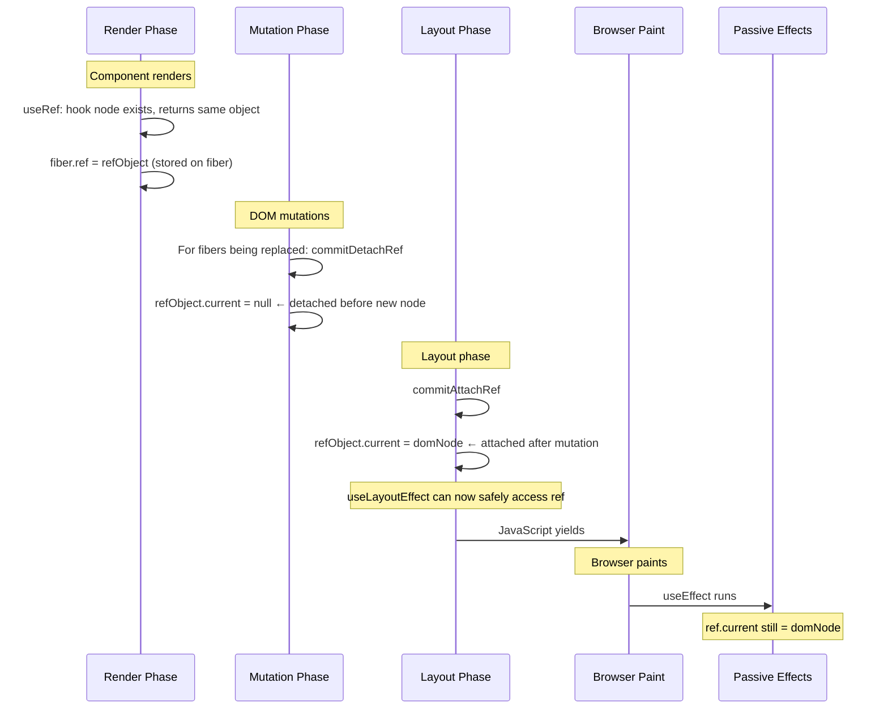

# 23 · useRef Behavior

> **useRef returns a plain JavaScript object with a single mutable `.current` property. It is deliberately not part of React's rendering system — mutations to `.current` never trigger re-renders, are not tracked by the reconciler, and are not batched. Understanding exactly why requires understanding how React's hook system works and what it means to be "outside" the rendering cycle. useRef is not a lesser useState — it is a fundamentally different tool for a different class of problems.**

The confusion between `useRef` and `useState` is one of the most reliable sources of bugs in React codebases. Developers use refs when they should use state (invisible mutations), and state when they should use refs (expensive renders for values the UI doesn't display). This document explains the mechanical distinction and the precise engineering use cases for each.

---

## Table of Contents

- [What useRef Actually Returns](#what-useref-actually-returns)
- [The Hook Node Structure](#the-hook-node-structure)
- [Mount: mountRef](#mount-mountref)
- [Update: updateRef](#update-updateref)
- [Why Mutations Don't Trigger Re-renders](#why-mutations-dont-trigger-re-renders)
- [The Ref Object is Stable](#the-ref-object-is-stable)
- [When useRef is the Right Tool](#when-useref-is-the-right-tool)
- [DOM Refs: Connecting to the Real DOM](#dom-refs-connecting-to-the-real-dom)
- [Ref Attachment Timing](#ref-attachment-timing)
- [Callback Refs](#callback-refs)
- [forwardRef: Passing Refs Across Component Boundaries](#forwardref-passing-refs-across-component-boundaries)
- [useImperativeHandle: Customizing the Exposed Interface](#useimperativehandle-customizing-the-exposed-interface)
- [Ref vs State: The Decision Framework](#ref-vs-state-the-decision-framework)
- [The Previous Value Pattern](#the-previous-value-pattern)
- [The Mutable Instance Pattern](#the-mutable-instance-pattern)
- [Architecture Diagrams](#architecture-diagrams)
- [Good Practices](#good-practices)
- [Bad Practices](#bad-practices)
- [Mental Model](#mental-model)
- [Common Misconceptions](#common-misconceptions)
- [Exercises](#exercises)
- [Further Reading](#further-reading)

---

## What useRef Actually Returns

```tsx
const ref = useRef(initialValue);
// ref = { current: initialValue }
```

This is the complete return value. A plain JavaScript object. No getters. No setters. No Proxy. No magic. The `.current` property is a regular writable property on a regular object.

```js
// These are equivalent:
const ref = useRef(0);
const ref = { current: 0 }; // literally the same object shape

// You can mutate ref.current anywhere, at any time:
ref.current = 42; // no re-render triggered
ref.current = "hello"; // no re-render triggered
ref.current = null; // no re-render triggered
```

The object is created once (on mount) and the **same object** is returned on every render. The `.current` property changes but the object reference never changes.

---

## The Hook Node Structure

Each `useRef` call creates one hook node:

```js
// useRef hook node
const hook = {
  memoizedState: { current: initialValue },
  // memoizedState holds the ref object itself
  // NOT the current value — the OBJECT

  baseState: null,
  baseQueue: null,
  queue: null, // no queue: refs have no dispatch mechanism
  next: null,
};
```

Compare with `useState`:

```js
// useState hook node
const hook = {
  memoizedState: currentValue,  // the VALUE
  queue: {
    pending: null,
    dispatch: setCount,         // has a dispatch mechanism
    lastRenderedState: ...,
  },
};
```

The structural difference: `useRef` stores the **object** in `memoizedState`. `useState` stores the **value** in `memoizedState` and has a dispatch queue. No dispatch queue means no way to enqueue an update, which means no way to trigger a re-render.

---

## Mount: mountRef

```js
// From ReactFiberHooks.js
function mountRef(initialValue) {
  const hook = mountWorkInProgressHook();

  // Create the ref object
  const ref = { current: initialValue };

  // Seal the ref object in development
  if (__DEV__) {
    Object.seal(ref);
    // Object.seal: prevents adding/deleting properties
    // .current remains writable, but you can't do: ref.other = 'x'
  }

  // Store the ref object in the hook node
  hook.memoizedState = ref;

  return ref;
}
```

That's the entire mount implementation. No lanes. No queues. No scheduling. Create an object, store it, return it.

### Why Object.seal in development

In development mode, React seals the ref object. This catches common mistakes:

```js
// Dev: Object.seal throws on adding properties
const ref = useRef(null);
ref.foo = "bar"; // ❌ TypeError: Cannot add property foo
// This prevents typos like ref.currnet = ... (silent bug → would work without seal)
```

In production, `Object.seal` is not called — refs are plain unsealed objects for performance.

---

## Update: updateRef

```js
function updateRef(initialValue) {
  // initialValue is IGNORED on update
  const hook = updateWorkInProgressHook();

  // Return the SAME object that was created on mount
  return hook.memoizedState;
}
```

The update path is even simpler than mount. It reads the existing hook node and returns the same ref object that was stored there on mount. `initialValue` is completely ignored after the first render.

This is the mechanism that makes the ref object stable: `updateRef` returns `hook.memoizedState`, which is the same object reference every time. The object was created once in `mountRef` and never replaced.

---

## Why Mutations Don't Trigger Re-renders

This is the core question. Why does `ref.current = 42` not trigger a re-render when `setState(42)` does?

### The setState path triggers scheduling

```js
// What happens when you call setState:
function dispatchSetState(fiber, queue, action) {
  const lane = requestUpdateLane(fiber); // determine priority
  const update = { lane, action, ... };
  enqueueUpdate(fiber, queue, update, lane); // add to queue
  scheduleUpdateOnFiber(fiber, lane);        // ← THIS schedules a re-render
}
```

### The ref mutation path does nothing

```js
// What happens when you mutate a ref:
ref.current = 42;
// JavaScript property assignment — calls no React APIs
// React has no setter intercepting this mutation
// Nothing is enqueued
// Nothing is scheduled
// No re-render
```

React has no way to observe `ref.current` mutations because:

1. The ref object is a plain JavaScript object — no Proxy, no defineProperty with setter
2. There is no dispatch function bound to the ref
3. There is no update queue on the ref's hook node
4. The reconciler never reads `ref.current` during normal rendering

When the fiber is processed during a re-render (triggered by some other state change), `updateRef` reads `hook.memoizedState` and returns it — whatever value is currently in `.current` at that point. But this is a read, not a trigger.

> 🔬 **Internals:** This is intentional design, not an oversight. React's rendering model requires that component output be deterministic for given state/props. If `ref.current` mutations triggered re-renders, they would need to be scheduled, batched, and processed like state updates — but refs are specifically designed for values that don't need to be reflected in the UI. Making them non-reactive is the point.

---

## The Ref Object is Stable

The same ref object is returned on every render. This is guaranteed by the `updateRef` implementation which returns `hook.memoizedState` — the same object created on mount.

```tsx
function Component() {
  const ref = useRef(0);

  // ref is the SAME object on every render:
  // Render 1: ref = { current: 0 }, ref is the object at address 0x1234
  // Render 2: ref = { current: 42 }, ref is STILL at address 0x1234 (same object)
  // Render 3: ref = { current: 42 }, still 0x1234

  // This means: ref can safely be used as a useEffect dependency
  useEffect(() => {
    // ref.current may change, but ref itself is stable
    // → effect never re-runs due to ref reference changing
  }, [ref]); // ref is always the same object → deps never change
  // (though including ref in deps is usually not needed)
}
```

This stability is what makes refs valuable in effects — you can access `ref.current` inside an effect to get the latest value without making that value a dependency (which would cause the effect to re-run):

```tsx
// The "always-latest callback" pattern uses ref stability:
function useEventCallback<T extends Function>(callback: T): T {
  const callbackRef = useRef(callback);

  useLayoutEffect(() => {
    callbackRef.current = callback; // update to latest callback
  }, [callback]);

  // Return a stable function that calls the latest callback
  return useCallback((...args: unknown[]) => {
    return callbackRef.current(...args);
  }, []) as unknown as T;
  // callbackRef is stable → dependency array never changes → function is stable
}
```

---

## When useRef is the Right Tool

Refs are the right tool in four distinct scenarios:

### 1. Accessing DOM nodes imperatively

```tsx
function AutoFocusInput({ placeholder }: { placeholder: string }) {
  const inputRef = useRef<HTMLInputElement>(null);

  useEffect(() => {
    inputRef.current?.focus(); // imperative DOM call
  }, []);

  return <input ref={inputRef} placeholder={placeholder} />;
}
```

### 2. Storing mutable values that don't affect rendering

```tsx
function VideoPlayer({ src }: { src: string }) {
  // Timer ID: doesn't affect rendering, just needs to be remembered
  const fadeTimerRef = useRef<ReturnType<typeof setTimeout> | null>(null);

  const startFade = () => {
    fadeTimerRef.current = setTimeout(() => {
      // apply fade effect
    }, 300);
  };

  const cancelFade = () => {
    if (fadeTimerRef.current) {
      clearTimeout(fadeTimerRef.current);
      fadeTimerRef.current = null;
    }
  };

  useEffect(() => () => cancelFade(), []); // cleanup on unmount

  return <video src={src} onMouseEnter={startFade} onMouseLeave={cancelFade} />;
}
```

### 3. Breaking the stale closure problem for non-rendered values

```tsx
// Keep latest callback without making it a useEffect dependency
function useLatest<T>(value: T): React.RefObject<T> {
  const ref = useRef(value);
  ref.current = value; // update synchronously during render (not in useEffect)
  // Safe because: render is pure, and ref.current mutation doesn't trigger re-render
  return ref;
}

function ClickTracker({ onClick }: { onClick: () => void }) {
  const onClickRef = useLatest(onClick);

  useEffect(() => {
    document.addEventListener("click", () => {
      onClickRef.current(); // always calls latest onClick
    });
    // No cleanup shown for brevity
  }, []); // empty deps: ref is stable, and reading from ref.current doesn't need to be a dep
}
```

### 4. Storing previous values for comparison

```tsx
function usePrevoius<T>(value: T): T | undefined {
  const ref = useRef<T | undefined>(undefined);

  useEffect(() => {
    ref.current = value; // update AFTER render (so current render sees previous value)
  }, [value]);

  return ref.current; // returns value from previous render
}

function TransitionAnimation({ phase }: { phase: "enter" | "exit" }) {
  const prevPhase = usePrevious(phase);
  // prevPhase = what phase was last render
  // phase = what phase is this render
  // Use both to determine animation direction
}
```

---

## DOM Refs: Connecting to the Real DOM

The most common use of `useRef` is accessing DOM nodes. This works through React's ref attachment system:

```tsx
// You write:
const divRef = useRef<HTMLDivElement>(null);
return <div ref={divRef}>content</div>;

// React processes:
// 1. JSX: ref prop is extracted from props (not in props.ref)
// 2. Reconciler: fiber.ref = divRef (stored on the fiber)
// 3. completeWork (render phase): DOM node created, stateNode = domNode
// 4. Commit phase - layout: ref is attached
```

### The ref attachment mechanism

```js
// In ReactFiberCommitWork.js — layout phase
function commitAttachRef(finishedWork) {
  const ref = finishedWork.ref;
  if (ref !== null) {
    const instanceToAttach = finishedWork.stateNode;
    // For HostComponent (DOM elements): stateNode = the DOM node
    // For ClassComponent: stateNode = the class instance

    if (typeof ref === 'function') {
      // Callback ref: call the function with the DOM node
      let retVal;
      if (enableProfilerTimer && ...) {
        // profiling code
      } else {
        retVal = ref(instanceToAttach);
      }
      // If the callback returns a function, store it as cleanup
      if (typeof retVal === 'function') {
        finishedWork.refCleanup = retVal;
      }
    } else {
      // Object ref: set .current
      ref.current = instanceToAttach;
    }
  }
}

// In ReactFiberCommitWork.js — detach (mutation phase, before new ref attached)
function commitDetachRef(current) {
  const currentRef = current.ref;
  if (currentRef !== null) {
    if (typeof currentRef === 'function') {
      currentRef(null); // callback ref: called with null
    } else {
      currentRef.current = null; // object ref: set to null
    }
  }
}
```

---

## Ref Attachment Timing

Refs are attached and detached during the **layout phase** of the commit — after DOM mutations but before the browser paints. This is critical to understand:

```tsx
function Component() {
  const divRef = useRef<HTMLDivElement>(null);

  // ❌ WRONG: ref is NOT attached during render phase
  console.log(divRef.current); // null (first render) or stale DOM node

  useLayoutEffect(() => {
    // ✅ CORRECT: ref is attached by the time layout effects run
    console.log(divRef.current); // the actual DOM node
    const height = divRef.current!.offsetHeight; // accurate measurement
  });

  useEffect(() => {
    // ✅ ALSO CORRECT: passive effects run after layout effects
    console.log(divRef.current); // the actual DOM node
  });

  return <div ref={divRef}>content</div>;
}
```

### The attachment sequence for an update

```
Mutation phase:
  If ref changed: commitDetachRef → ref.current = null

Layout phase:
  commitAttachRef → ref.current = newDOMNode

useLayoutEffect:
  ref.current is now the new DOM node ✅

Browser paint

useEffect:
  ref.current is the same DOM node ✅
```

### Why ref.current is null during first render

```tsx
function Component() {
  const ref = useRef<HTMLDivElement>(null);

  // During render: React hasn't built the DOM yet
  // completeWork hasn't run for <div ref={ref}>
  // The DOM node hasn't been created yet
  // commitAttachRef hasn't run yet
  // Therefore: ref.current = null (initial value)

  return <div ref={ref}>content</div>;
}
```

The DOM node exists after `completeWork` creates it — but `ref.current` isn't set until `commitAttachRef` in the layout phase. Between "component function runs" and "layout phase completes," `ref.current` is null for new nodes.

---

## Callback Refs

Instead of a `useRef` object, you can pass a function as the `ref` prop. React calls this function with the DOM node when the node is created, and with `null` when it's removed:

```tsx
function MeasuredDiv({ onHeight }: { onHeight: (height: number) => void }) {
  const callbackRef = useCallback(
    (node: HTMLDivElement | null) => {
      if (node !== null) {
        // Node was added to DOM
        onHeight(node.getBoundingClientRect().height);
      }
      // node === null: node was removed from DOM
    },
    [onHeight],
  );

  return <div ref={callbackRef}>Content</div>;
}
```

### Callback ref vs object ref: when each is better

**Object ref** (`useRef`): when you need to access the DOM node at arbitrary times (in effects, event handlers, etc.)

**Callback ref**: when you need to execute logic at the exact moment the node is added or removed from the DOM — not on a schedule.

```tsx
// Callback ref for: "do something when node appears"
function ScrollIntoView({ children }: { children: React.ReactNode }) {
  const ref = useCallback((node: HTMLElement | null) => {
    if (node) {
      node.scrollIntoView({ behavior: "smooth" });
      // This runs at the exact moment the element appears in the DOM
      // useEffect would run slightly later (after paint)
    }
  }, []);

  return <div ref={ref}>{children}</div>;
}
```

### The callback ref with cleanup (React 19)

React 19 introduces callback ref cleanup — the callback can return a cleanup function:

```tsx
// React 19: callback ref can return a cleanup function
function Component() {
  const ref = useCallback((node: HTMLElement | null) => {
    if (node) {
      // Setup
      const observer = new ResizeObserver(handleResize);
      observer.observe(node);

      // Return cleanup (React 19+)
      return () => {
        observer.disconnect();
      };
    }
    // null case handled by cleanup function automatically
  }, []);

  return <div ref={ref}>Content</div>;
}
```

Before React 19, callback refs received `null` on removal, requiring manual tracking:

```tsx
// Pre-React 19 pattern (still works):
function Component() {
  const observerRef = useRef<ResizeObserver | null>(null);

  const ref = useCallback((node: HTMLElement | null) => {
    if (node) {
      observerRef.current = new ResizeObserver(handleResize);
      observerRef.current.observe(node);
    } else {
      // node = null: element removed
      observerRef.current?.disconnect();
      observerRef.current = null;
    }
  }, []);

  return <div ref={ref}>Content</div>;
}
```

---

## forwardRef: Passing Refs Across Component Boundaries

By default, a ref placed on a component (`<MyInput ref={ref} />`) does nothing — the ref is not automatically forwarded to the underlying DOM node. `forwardRef` explicitly threads the ref through:

```tsx
// Without forwardRef: ref on MyInput does nothing
function MyInput(props: InputProps) {
  return <input {...props} />;
}
// <MyInput ref={inputRef} /> → inputRef.current = null (not the input DOM node)

// With forwardRef: ref is forwarded to the inner input
const MyInput = React.forwardRef<HTMLInputElement, InputProps>(
  function MyInput(props, ref) {
    // ref is the second argument — pass it to the DOM element
    return <input {...props} ref={ref} />;
  },
);
// <MyInput ref={inputRef} /> → inputRef.current = <input> DOM node ✅
```

### forwardRef internals

```js
// React.forwardRef returns a special object
function forwardRef(render) {
  const elementType = {
    $$typeof: REACT_FORWARD_REF_TYPE, // special type marker
    render, // the component function
  };
  return elementType;
}

// When React reconciles a ForwardRef element:
// beginWork: fiber.tag = ForwardRef
// The component function is called as: render(props, ref)
// where ref comes from the fiber's .ref field (set by the parent's JSX)
```

### Why forwardRef is needed

React's reconciler separates `ref` from `props` at the JSX compilation step:

```jsx
// <MyInput ref={inputRef} value="hello" />
// Compiles to:
_jsx(MyInput, { value: "hello" }, null, inputRef);
//                                      ↑ ref is the 4th arg, not in props
```

The ref is stored on the fiber's `.ref` field, not in `props`. A regular component function only receives `props` — it has no way to access the ref unless React explicitly passes it. `forwardRef` tells React "pass the ref as the second argument to this function."

---

## useImperativeHandle: Customizing the Exposed Interface

`useImperativeHandle` lets you control what a parent sees when it accesses a ref to a child component. Instead of exposing the raw DOM node, you expose a custom API:

```tsx
interface VideoPlayerHandle {
  play: () => void;
  pause: () => void;
  seek: (seconds: number) => void;
  getCurrentTime: () => number;
}

const VideoPlayer = React.forwardRef<VideoPlayerHandle, VideoProps>(
  function VideoPlayer({ src }, ref) {
    const videoRef = useRef<HTMLVideoElement>(null);

    // Expose a curated interface — not the raw DOM node
    useImperativeHandle(
      ref,
      () => ({
        play: () => videoRef.current?.play(),
        pause: () => videoRef.current?.pause(),
        seek: (seconds) => {
          if (videoRef.current) {
            videoRef.current.currentTime = seconds;
          }
        },
        getCurrentTime: () => videoRef.current?.currentTime ?? 0,
      }),
      [],
    ); // empty deps: methods don't need to change

    return <video ref={videoRef} src={src} />;
  },
);

// Usage:
const playerRef = useRef<VideoPlayerHandle>(null);
// <VideoPlayer ref={playerRef} />
// playerRef.current.play() ← works
// playerRef.current.currentTime ← doesn't exist (not exposed)
```

### useImperativeHandle internals

```js
function mountImperativeHandle(ref, init, deps) {
  return mountEffectImpl(
    UpdateEffect, // fiber flag
    HookLayout, // runs in layout phase (like useLayoutEffect)
    imperativeHandleEffect.bind(null, init, ref),
    deps,
  );
}

function imperativeHandleEffect(init, ref) {
  if (typeof ref === "function") {
    const refCallback = ref;
    const inst = init(); // call the factory function
    refCallback(inst); // attach the inst to the ref
    return () => refCallback(null); // cleanup: detach
  } else if (ref !== null && ref !== undefined) {
    ref.current = init(); // set .current to the factory result
    return () => {
      ref.current = null;
    }; // cleanup
  }
}
```

`useImperativeHandle` is implemented as a layout effect — it runs synchronously after DOM mutations but before paint, same timing as `useLayoutEffect`. This ensures the ref is set before any `useLayoutEffect` in the parent runs.

### When to use useImperativeHandle

Use it when:

1. You're wrapping a DOM element and want to expose a semantic API (not raw DOM)
2. You're implementing a compound component where the parent needs to trigger imperative actions
3. You need to expose a stable interface that's independent of internal implementation

```tsx
// Good use case: dialog with imperative open/close
const Dialog = React.forwardRef<DialogHandle, DialogProps>(function Dialog(
  { children, title },
  ref,
) {
  const [isOpen, setIsOpen] = useState(false);

  useImperativeHandle(
    ref,
    () => ({
      open: () => setIsOpen(true),
      close: () => setIsOpen(false),
      toggle: () => setIsOpen((v) => !v),
    }),
    [],
  );

  return isOpen ? (
    <div role="dialog" aria-label={title}>
      {children}
      <button onClick={() => setIsOpen(false)}>Close</button>
    </div>
  ) : null;
});

// Parent triggers open/close imperatively
const dialogRef = useRef<DialogHandle>(null);
// <Dialog ref={dialogRef} title="Settings">...
// dialogRef.current.open(); // from a button handler elsewhere
```

---

## Ref vs State: The Decision Framework

The key question: **does this value need to appear in the rendered UI?**

```
Does the value affect what the user SEES?
├── Yes → useState (triggers re-render to update UI)
└── No → useRef (no re-render needed)
    ├── Is it a DOM node or class instance? → useRef with null initial value
    ├── Is it a mutable value persisted across renders? → useRef
    ├── Is it a timer/subscription ID? → useRef
    ├── Is it a previous value for comparison? → useRef
    └── Is it a "latest version" of a callback/prop? → useRef
```

### Concrete examples

```tsx
// useState: affects rendering
const [count, setCount] = useState(0);
return <div>{count}</div>; // count appears in UI

// useRef: doesn't affect rendering
const renderCountRef = useRef(0);
renderCountRef.current++; // tracked but not displayed

// useState: user-visible state
const [isOpen, setIsOpen] = useState(false);
return isOpen ? <Modal /> : null; // isOpen determines what renders

// useRef: non-visible state
const isFirstRenderRef = useRef(true);
useEffect(() => {
  isFirstRenderRef.current = false;
}, []);
// Controls effect behavior, not rendering
```

### The hybrid pattern: ref + state for derived display

```tsx
// Sometimes you need BOTH: a mutable value (ref) AND a displayed version (state)
function TimerDisplay() {
  const [displayedTime, setDisplayedTime] = useState(0);
  const actualTimeRef = useRef(0); // precise timer value
  const frameRef = useRef<number | null>(null);

  const startTimer = () => {
    const tick = () => {
      actualTimeRef.current += 1; // 60x/second mutation, no re-render
      // Only update display every 100ms to avoid excessive re-renders
      if (actualTimeRef.current % 6 === 0) {
        setDisplayedTime(Math.floor(actualTimeRef.current / 60)); // in seconds
      }
      frameRef.current = requestAnimationFrame(tick);
    };
    frameRef.current = requestAnimationFrame(tick);
  };

  const stopTimer = () => {
    if (frameRef.current) cancelAnimationFrame(frameRef.current);
  };

  return (
    <div>
      <p>{displayedTime}s</p>
      <button onClick={startTimer}>Start</button>
      <button onClick={stopTimer}>Stop</button>
    </div>
  );
}
```

---

## The Previous Value Pattern

A common and legitimate use of `useRef`: capturing the value from the previous render:

```tsx
function usePrevious<T>(value: T): T | undefined {
  const ref = useRef<T | undefined>(undefined);

  // Update the ref AFTER render (in useEffect)
  // This ensures current render sees the previous value
  useEffect(() => {
    ref.current = value;
  }); // no deps: runs after every render

  // Return the value from before this render
  return ref.current;
}

function AnimatedValue({ value }: { value: number }) {
  const prevValue = usePrevious(value);

  // Determine animation direction based on previous vs current
  const direction =
    prevValue !== undefined && value > prevValue ? "up" : "down";

  return <span className={`animated-${direction}`}>{value}</span>;
}
```

### Why useEffect timing makes this work

```
Render N: value = 5
  ref.current = undefined (from before render 1) or prev value
  return ref.current → returns the PREVIOUS value (correct)

After render N: useEffect runs
  ref.current = 5 (updated to current value)

Render N+1: value = 10
  return ref.current → returns 5 (the previous value) ✅

After render N+1: useEffect runs
  ref.current = 10
```

The key: `useEffect` runs _after_ the render that returns `ref.current`. So when we return `ref.current` during render, we're returning the value set by the _previous_ render's effect — which is the previous value.

---

## The Mutable Instance Pattern

Refs can store any mutable object — not just DOM nodes. This enables a class-instance-like pattern for managing resources in function components:

```tsx
// Store an expensive object that persists across renders
// without causing re-renders when it changes
function AudioVisualizer({ source }: { source: string }) {
  const audioContextRef = useRef<AudioContext | null>(null);
  const analyzerRef = useRef<AnalyserNode | null>(null);

  useEffect(() => {
    // Initialize once
    audioContextRef.current = new AudioContext();
    analyzerRef.current = audioContextRef.current.createAnalyser();
    analyzerRef.current.fftSize = 2048;

    return () => {
      // Cleanup
      audioContextRef.current?.close();
    };
  }, []); // only on mount/unmount

  const startVisualization = useCallback(() => {
    if (!analyzerRef.current) return;
    // Use analyzerRef.current directly — no re-render needed
    // It's always the latest (non-null after effect runs)
    drawVisualization(analyzerRef.current);
  }, []); // stable: refs are stable, no deps needed

  return <canvas onClick={startVisualization} />;
}
```

---

## Architecture Diagrams

### useRef vs useState: the rendering impact

```mermaid
graph TD
    subgraph "useState path"
        A[setState called] --> B[Update enqueued on fiber]
        B --> C[scheduleUpdateOnFiber]
        C --> D[Scheduler: render scheduled]
        D --> E[Component re-renders]
        E --> F[New value in UI]
    end

    subgraph "useRef path"
        G[ref.current = newValue] --> H[Plain JS property assignment]
        H --> I[No React APIs called]
        I --> J[No update enqueued]
        J --> K[No render scheduled]
        K --> L[UI unchanged]
        L --> M[ref.current reflects new value<br/>on NEXT render if one occurs]
    end

    style A fill:#764abc,color:#fff
    style D fill:#e8491d,color:#fff
    style F fill:#27ae60,color:#fff
    style G fill:#61dafb,color:#000
    style L fill:#999,color:#fff
```



### Ref attachment lifecycle in the commit phase



---

## Good Practices

### ✅ Good Practice — useRef for values that don't affect rendering

```tsx
/**
 * Good: Uses refs for values that need to persist across renders
 * but should not trigger re-renders when changed.
 * Uses state for values that affect what the user sees.
 */
function AnimatedCounter({ target }: { target: number }) {
  // ✅ useState: displayed value — changes should trigger UI update
  const [displayed, setDisplayed] = useState(0);

  // ✅ useRef: animation frame ID — mutable, not rendered
  const rafRef = useRef<number | null>(null);

  // ✅ useRef: start value for animation — mutable, not rendered
  const startValueRef = useRef(0);

  // ✅ useRef: animation start time — mutable, not rendered
  const startTimeRef = useRef(0);

  useEffect(() => {
    startValueRef.current = displayed;
    startTimeRef.current = performance.now();

    const animate = (currentTime: number) => {
      const elapsed = currentTime - startTimeRef.current;
      const duration = 500; // ms
      const progress = Math.min(elapsed / duration, 1);
      const eased = easeOutCubic(progress);
      const current =
        startValueRef.current + (target - startValueRef.current) * eased;

      setDisplayed(Math.round(current)); // ← only setState when value changes UI

      if (progress < 1) {
        rafRef.current = requestAnimationFrame(animate);
      }
    };

    rafRef.current = requestAnimationFrame(animate);

    return () => {
      if (rafRef.current) cancelAnimationFrame(rafRef.current);
    };
  }, [target]);

  return <span>{displayed}</span>;
}
```

**Why this works:** The animation state (frame ID, start value, start time) is stored in refs — mutations don't trigger re-renders. Only `displayed` is state — the value the user sees. This prevents the 60fps animation from causing 60 unintended re-renders per second of the parent component tree.

---

## Bad Practices

### ⚠️ Bad Practice — Using refs to share state between components

```tsx
/**
 * Bad: Using a ref to communicate state changes between sibling components.
 * The receiving component won't re-render when ref.current changes.
 * This creates hidden, invisible state that breaks React's rendering model.
 */
function Parent() {
  // ❌ Shared ref as a communication channel between siblings
  const sharedRef = useRef<string>("");

  return (
    <div>
      <InputComponent valueRef={sharedRef} />
      <DisplayComponent valueRef={sharedRef} />
    </div>
  );
}

function InputComponent({
  valueRef,
}: {
  valueRef: React.MutableRefObject<string>;
}) {
  return (
    <input
      onChange={(e) => {
        valueRef.current = e.target.value; // ❌ sibling won't see this
        // DisplayComponent doesn't know valueRef.current changed
        // It won't re-render
        // User types but display stays blank
      }}
    />
  );
}

function DisplayComponent({
  valueRef,
}: {
  valueRef: React.MutableRefObject<string>;
}) {
  // ❌ Reads ref but never re-renders when ref changes
  // Will always show the value from the last render
  return <p>{valueRef.current}</p>;
}

/**
 * ✅ Correct: Lift state to parent — sibling communication via state
 */
function Parent() {
  const [value, setValue] = useState("");

  return (
    <div>
      <InputComponent value={value} onChange={setValue} />
      <DisplayComponent value={value} />
    </div>
  );
}
```

**What happens:** User types in the input. `valueRef.current` is updated. `DisplayComponent` is not re-rendered because nothing triggered a re-render. `DisplayComponent` continues to show the value from the last time it rendered (probably empty string or last seen value). The ref mutation is invisible — it happened but nobody noticed.

**Production impact:** This pattern produces UIs where some parts are perpetually stale — they show data from a previous render that never gets updated because the mechanism for updating them (state change → re-render) was bypassed. Debugging is extremely difficult because no errors are thrown and React DevTools shows the component as "not re-rendered" which is correct but unhelpful.

---

## Mental Model

> 💡 **The useRef mental model:**
>
> A ref is like a **sticky note stuck to the component's desk**. You can write anything on it at any time, cross it out, rewrite it — the desk doesn't care and doesn't react. State is like **a digital sign above the desk** — when the sign changes, everyone who can see it notices immediately and reacts. The desk (fiber) holds both: the sticky note (`ref.current`) and the digital sign (`memoizedState` via useState). React checks the digital sign during re-renders to decide what to display. React never checks the sticky note during rendering — it just passes it around when explicitly asked. Writing on the sticky note is free (no scheduling). Changing the digital sign triggers the machinery (scheduling → render → reconcile → commit → paint). Use sticky notes for information that the component needs to remember for itself but that doesn't need to be announced to the world.

---

## Common Misconceptions

### "ref.current is reset on every render"

`ref.current` persists its value across renders. The entire point of `useRef` is to give you a mutable box that survives re-renders without triggering them. React never resets `ref.current` — only you can change it.

### "useRef and useState store values the same way"

`useRef` stores the ref object in `memoizedState`. `useState` stores the value in `memoizedState` and has a dispatch queue. The fundamental difference is the dispatch queue — without it, there is no mechanism to trigger a re-render.

### "Passing a ref as a prop to a child makes the child reactive to ref changes"

Passing a ref object as a prop does nothing special. The child receives a stable object reference. Mutations to `ref.current` don't trigger re-renders in either the parent or the child — the child just has access to the same mutable box.

### "useRef is only for DOM elements"

`useRef` is a general-purpose mutable container. DOM refs are the most visible use case, but refs are equally valid for timer IDs, previous values, mutable instance data, latest-callback patterns, and any other value that needs to persist across renders without triggering them.

### "ref.current is available during render"

For DOM refs: `ref.current` is `null` during the render phase (DOM not yet created). For non-DOM refs: `ref.current` reflects whatever was last written to it, which could be a value set during a previous render's effect or event handler — but it's not "the current render's value."

---

## Exercises

### Exercise 1 — Prove ref mutations don't trigger re-renders

```tsx
let renderCount = 0;

function RefVsState() {
  renderCount++;
  const ref = useRef(0);
  const [state, setState] = useState(0);

  return (
    <div>
      <p>Renders: {renderCount}</p>
      <p>
        Ref: {ref.current} | State: {state}
      </p>
      <button
        onClick={() => {
          ref.current++;
          console.log(ref.current);
        }}
      >
        Mutate ref (no re-render)
      </button>
      <button onClick={() => setState((s) => s + 1)}>
        Update state (re-render)
      </button>
    </div>
  );
}
```

Observe: clicking "Mutate ref" logs the new value but renderCount doesn't increase and the displayed ref value doesn't change. Only clicking "Update state" shows the accumulated ref mutations (because a re-render finally happens, and `ref.current` is now higher than expected).

### Exercise 2 — Trace ref attachment timing

```tsx
function RefTiming() {
  const ref = useRef<HTMLDivElement>(null);

  console.log("Render:", ref.current); // null first render

  useLayoutEffect(() => {
    console.log("useLayoutEffect:", ref.current); // DOM node
  });

  useEffect(() => {
    console.log("useEffect:", ref.current); // DOM node
  });

  return <div ref={ref}>Content</div>;
}
```

Observe the exact order and values. This directly demonstrates the commit phase timing of ref attachment.

### Exercise 3 — Build usePrevious from scratch

```tsx
// Implement this without looking at the implementation above
function usePrevious<T>(value: T): T | undefined {
  // Hint 1: You need something that persists across renders
  // Hint 2: You need the value to update AFTER render
  // Hint 3: You need to return the value from BEFORE the current render
}

// Test:
function Counter() {
  const [count, setCount] = useState(0);
  const prevCount = usePrevious(count);

  return (
    <div>
      <p>
        Current: {count}, Previous: {prevCount ?? "none"}
      </p>
      <button onClick={() => setCount((c) => c + 1)}>+</button>
    </div>
  );
}
// Expected: Previous should always be one step behind Current
```

---

## Further Reading

- [React Source: ReactFiberHooks.js — mountRef, updateRef](https://github.com/facebook/react/blob/main/packages/react-reconciler/src/ReactFiberHooks.js)
- [React Source: ReactFiberCommitWork.js — commitAttachRef, commitDetachRef](https://github.com/facebook/react/blob/main/packages/react-reconciler/src/ReactFiberCommitWork.js)
- [React Docs: useRef](https://react.dev/reference/react/useRef) — Official reference including when to use refs
- [React Docs: Manipulating the DOM with Refs](https://react.dev/learn/manipulating-the-dom-with-refs) — DOM ref patterns
- [React Docs: Referencing Values with Refs](https://react.dev/learn/referencing-values-with-refs) — When to use refs vs state
- [React Docs: forwardRef](https://react.dev/reference/react/forwardRef) — Forwarding refs across components
- Next in this handbook: [24 · useReducer & useContext](./05-usereducer-usecontext.md)

---

_Part of the [React + Next.js Engineering Handbook](../../README.md)_
