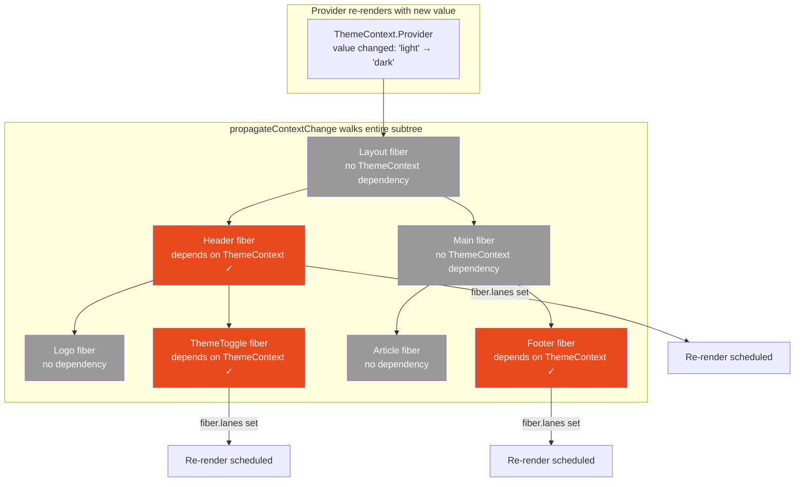
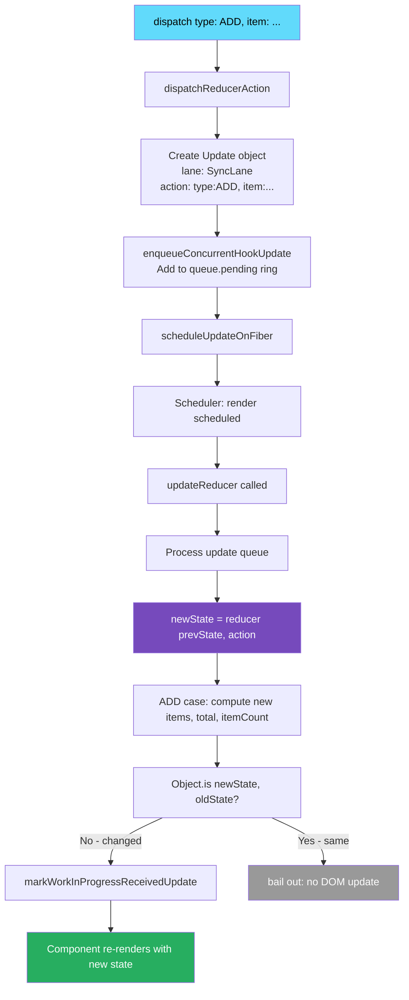

# 24 · useReducer & useContext

> **useReducer is useState with an explicit reducer function — the same hook machinery, the same update queue, the same batching, but with business logic extracted from the dispatch call site into a pure function. useContext is a subscription mechanism that bypasses the prop chain — but it registers a dependency on the fiber that causes full component re-renders whenever the context value changes by reference. Understanding the internals of both explains the performance cliffs they create and how to design around them.**

These two hooks are often paired: `useReducer` provides complex state management and `useContext` provides a way to share that state across the tree. Together they form the foundation of most custom state management systems. But the combination has specific performance characteristics that require careful architectural decisions. This document explains both hooks from the implementation up.

---

## Table of Contents

- [useReducer: What it Actually Is](#usereducer-what-it-actually-is)
- [The Reducer Contract](#the-reducer-contract)
- [Mount: mountReducer](#mount-mountreducer)
- [Dispatch: dispatchReducerAction](#dispatch-dispatchreduceraction)
- [Update: updateReducer](#update-updatereducer)
- [useReducer vs useState: Exact Differences](#usereducer-vs-usestate-exact-differences)
- [Reducer Purity: Why it Matters at Runtime](#reducer-purity-why-it-matters-at-runtime)
- [The Discriminated Union Pattern](#the-discriminated-union-pattern)
- [useContext: The Subscription Mechanism](#usecontext-the-subscription-mechanism)
- [Context Internals: How Consumers Register](#context-internals-how-consumers-register)
- [How Context Value Changes Propagate](#how-context-value-changes-propagate)
- [The Re-render Propagation Problem](#the-re-render-propagation-problem)
- [Context Optimization Strategies](#context-optimization-strategies)
- [useReducer + useContext: The Pattern](#usereducer--usecontext-the-pattern)
- [Architecture Diagrams](#architecture-diagrams)
- [Good Practices](#good-practices)
- [Bad Practices](#bad-practices)
- [Mental Model](#mental-model)
- [Common Misconceptions](#common-misconceptions)
- [Exercises](#exercises)
- [Further Reading](#further-reading)

---

## useReducer: What it Actually Is

`useReducer` is `useState` with a pluggable reducer function. The hook machinery — update queue, batching, priority lanes, dispatch function — is identical. The only difference is what happens to the queued `action` when the update is processed:

```js
// useState: built-in reducer
function basicStateReducer(state, action) {
  return typeof action === "function" ? action(state) : action;
}

// useReducer: your reducer
function yourReducer(state, action) {
  // whatever logic you provide
  switch (action.type) {
    case "INCREMENT":
      return { ...state, count: state.count + 1 };
    default:
      return state;
  }
}

// The hook call:
const [state, dispatch] = useReducer(yourReducer, initialState);
// vs
const [state, setState] = useState(initialState);
// Both use the SAME underlying mountReducer / updateReducer implementation
```

The `action` you dispatch is processed by your reducer instead of by `basicStateReducer`. Everything else — enqueuing, scheduling, batching, priority — is identical.

---

## The Reducer Contract

A reducer must satisfy one contract: **pure function**.

```tsx
// The reducer contract:
type Reducer<S, A> = (state: S, action: A) => S;

// Where:
// - S is your state type
// - A is your action type
// - (state, action) → new state
// - Must be PURE:
//   Same state + same action = same new state (every time)
//   No side effects
//   No mutation of state (return new objects)
//   No async operations
//   No random values
//   No Date.now() or other non-deterministic reads
```

The purity contract is not enforced by React — violations produce subtle bugs. React may call your reducer multiple times (Strict Mode double-invoke, concurrent rendering restarts). A pure reducer produces the same result regardless of how many times it's called with the same inputs. An impure reducer does not.

---

## Mount: mountReducer

```js
// From ReactFiberHooks.js
function mountReducer(reducer, initialArg, init) {
  // ─── 1. Create hook node ──────────────────────────────────────────────
  const hook = mountWorkInProgressHook();

  // ─── 2. Compute initial state ─────────────────────────────────────────
  let initialState;
  if (init !== undefined) {
    // Lazy initialization with initializer function:
    // useReducer(reducer, initialArg, init)
    // → initialState = init(initialArg)
    initialState = init(initialArg);
  } else {
    // Direct initial state:
    // useReducer(reducer, initialState)
    initialState = initialArg;
  }

  // ─── 3. Initialize hook state ─────────────────────────────────────────
  hook.memoizedState = hook.baseState = initialState;

  // ─── 4. Create update queue ───────────────────────────────────────────
  const queue = {
    pending: null, // pending Update objects (circular linked list)
    lanes: NoLanes,
    dispatch: null, // filled below
    lastRenderedReducer: reducer, // ← YOUR reducer (not basicStateReducer)
    lastRenderedState: initialState,
  };
  hook.queue = queue;

  // ─── 5. Create dispatch function ──────────────────────────────────────
  const dispatch = (queue.dispatch = dispatchReducerAction.bind(
    null,
    currentlyRenderingFiber,
    queue,
  ));
  // Note: dispatchReducerAction, not dispatchSetState
  // The key difference: no eager state optimization

  return [hook.memoizedState, dispatch];
}
```

### Lazy initialization with init function

```tsx
// Three-argument form: init(initialArg) produces initial state
const [state, dispatch] = useReducer(
  reducer,
  userId, // initialArg
  fetchInitialData, // init function — called once on mount
);
// initialState = fetchInitialData(userId)
// Useful for expensive initial computations
// Also enables resetting state by dispatching { type: 'RESET', userId }
// → reducer calls init(userId) again
```

---

## Dispatch: dispatchReducerAction

Unlike `dispatchSetState` (which has the eager state optimization), `dispatchReducerAction` is simpler:

```js
function dispatchReducerAction(fiber, queue, action) {
  // ─── 1. Determine priority ─────────────────────────────────────────────
  const lane = requestUpdateLane(fiber);

  // ─── 2. Create Update object ──────────────────────────────────────────
  const update = {
    lane,
    action, // the action object: { type: 'INCREMENT', payload: ... }
    hasEagerState: false, // reducers can't easily precompute — no eager check
    eagerState: null,
    next: null,
  };

  if (isRenderPhaseUpdate(fiber)) {
    enqueueRenderPhaseUpdate(queue, update);
  } else {
    // ─── 3. Enqueue the update ──────────────────────────────────────────
    const root = enqueueConcurrentHookUpdate(fiber, queue, update, lane);

    if (root !== null) {
      // ─── 4. Schedule a render ─────────────────────────────────────────
      const eventTime = requestEventTime();
      scheduleUpdateOnFiber(root, fiber, lane, eventTime);
      entangleTransitionUpdate(root, queue, lane);
    }
  }
}
```

### Why no eager state optimization for useReducer

`dispatchSetState` (used by useState) checks if the new state equals the current state before scheduling a render — the eager state optimization. `dispatchReducerAction` skips this check.

Why? Computing `reducer(currentState, action)` outside the render cycle is possible, but React cannot always do it safely:

1. The reducer might have side effects (violation of the contract, but React can't enforce purity)
2. The reducer might call hooks or access context (rare but possible in advanced patterns)
3. Computing it eagerly and then again during the render would violate the "call reducer once per update" invariant

React chose to not eagerly evaluate reducers, accepting that `useReducer` dispatches always schedule a render even if the state doesn't change.

> 🔬 **Internals:** This means `useReducer` is slightly less optimized than `useState` for the "dispatch with same value" case. If you dispatch an action that your reducer handles by returning the current state unchanged, React will still schedule and run a render — then find no state change and bail out. With `useState`, the eager check prevents the render entirely. For most applications this is irrelevant, but in extremely high-frequency dispatch scenarios it can matter.

---

## Update: updateReducer

`updateReducer` is shared between `updateState` and `updateReducer`:

```js
function updateReducer(reducer, initialArg, init) {
  const hook = updateWorkInProgressHook();
  const queue = hook.queue;

  // Update the reducer function on the queue
  // This allows the reducer itself to change between renders
  queue.lastRenderedReducer = reducer;

  const current = currentHook;
  let baseQueue = current.baseQueue;
  const pendingQueue = queue.pending;

  // Merge pending updates with base queue (handles priority skipping)
  if (pendingQueue !== null) {
    if (baseQueue !== null) {
      // Merge: pending goes after base (priority-ordering preserved)
      const baseFirst = baseQueue.next;
      const pendingFirst = pendingQueue.next;
      baseQueue.next = pendingFirst;
      pendingQueue.next = baseFirst;
    }
    current.baseQueue = baseQueue = pendingQueue;
    queue.pending = null;
  }

  if (baseQueue !== null) {
    const first = baseQueue.next;
    let newState = current.baseState;
    let newBaseState = null;
    let newBaseQueueFirst = null;
    let newBaseQueueLast = null;
    let update = first;

    do {
      const updateLane = update.lane;

      if (!isSubsetOfLanes(renderLanes, updateLane)) {
        // Skip this update — lower priority than current render
        // Save it in baseQueue for a future render
        const clone = { lane: updateLane, action: update.action, ... };
        if (newBaseQueueLast === null) {
          newBaseQueueFirst = newBaseQueueLast = clone;
          newBaseState = newState;
        } else {
          newBaseQueueLast = newBaseQueueLast.next = clone;
        }
        markSkippedUpdateLanes(updateLane);
      } else {
        if (newBaseQueueLast !== null) {
          const clone = { lane: NoLane, action: update.action, ... };
          newBaseQueueLast = newBaseQueueLast.next = clone;
        }

        // ← Apply this update using YOUR reducer
        const action = update.action;
        newState = reducer(newState, action);
        // For useState: reducer = basicStateReducer
        // For useReducer: reducer = YOUR function
      }

      update = update.next;
    } while (update !== null && update !== first);

    // Set new state
    if (!Object.is(newState, hook.memoizedState)) {
      markWorkInProgressReceivedUpdate();
    }

    hook.memoizedState = newState;
    hook.baseState = newBaseState === null ? newState : newBaseState;
    hook.baseQueue = newBaseQueueFirst;
    queue.lastRenderedState = newState;
  }

  return [hook.memoizedState, queue.dispatch];
}
```

The key line: `newState = reducer(newState, action)` — this is where your reducer runs. For a queue of 3 actions, your reducer is called 3 times, each with the previous result as the new state.

---

## useReducer vs useState: Exact Differences

| Aspect             | useState                         | useReducer                                |
| ------------------ | -------------------------------- | ----------------------------------------- |
| Mount function     | `mountState`                     | `mountReducer`                            |
| Dispatch function  | `dispatchSetState`               | `dispatchReducerAction`                   |
| Eager optimization | Yes — precomputes new state      | No — always schedules render              |
| Reducer            | `basicStateReducer`              | Your function                             |
| Action type        | Any value or function            | Typically action object `{type, payload}` |
| State update       | Direct replacement or updater fn | `reducer(state, action)`                  |
| Use case           | Independent simple values        | Complex state with multiple transitions   |

Both use the same:

- Update queue structure
- `updateReducer` for processing
- Batching behavior
- Priority/lane system
- `Object.is` for change detection

---

## Reducer Purity: Why it Matters at Runtime

React calls reducers in several contexts where impurity causes bugs:

### Context 1: Strict Mode double invocation

```js
// In Strict Mode, React may call your reducer twice:
function reducer(state, action) {
  let sideEffectCount = 0; // ❌ mutates external variable
  sideEffectCount++;
  console.log("Reducer called"); // ❌ observable side effect

  return { ...state, count: state.count + 1 };
}
// In StrictMode: logs appear twice per dispatch
// sideEffectCount increments twice per dispatch
```

### Context 2: Concurrent rendering restarts

When a high-priority update interrupts a low-priority render, React restarts the low-priority render. The update queue is processed again:

```js
// If reducer has side effects:
function impureReducer(state, action) {
  saveToLocalStorage(state); // ❌ side effect
  return { ...state, count: state.count + 1 };
}
// On render restart: saveToLocalStorage called twice for one "logical" dispatch
```

### Context 3: Time travel debugging

Redux DevTools and similar tools rely on replaying action history from initial state. Impure reducers produce different states on replay.

### The correct pattern

```tsx
// ✅ Pure reducer: no side effects, no mutation
type State = {
  items: Item[];
  isLoading: boolean;
  error: Error | null;
};

type Action =
  | { type: "FETCH_START" }
  | { type: "FETCH_SUCCESS"; payload: Item[] }
  | { type: "FETCH_ERROR"; payload: Error }
  | { type: "DELETE_ITEM"; payload: string };

function reducer(state: State, action: Action): State {
  switch (action.type) {
    case "FETCH_START":
      return { ...state, isLoading: true, error: null };

    case "FETCH_SUCCESS":
      return { ...state, isLoading: false, items: action.payload };

    case "FETCH_ERROR":
      return { ...state, isLoading: false, error: action.payload };

    case "DELETE_ITEM":
      return {
        ...state,
        items: state.items.filter((item) => item.id !== action.payload),
      };

    default:
      return state; // ← always handle unknown actions by returning current state
  }
}
```

---

## The Discriminated Union Pattern

TypeScript's discriminated union type system makes `useReducer` exceptionally type-safe:

```tsx
// State as a discriminated union: only valid state combinations exist
type FetchState<T> =
  | { status: "idle" }
  | { status: "loading" }
  | { status: "error"; error: Error }
  | { status: "success"; data: T };

type FetchAction<T> =
  | { type: "FETCH" }
  | { type: "RESOLVE"; data: T }
  | { type: "REJECT"; error: Error }
  | { type: "RESET" };

function fetchReducer<T>(
  state: FetchState<T>,
  action: FetchAction<T>,
): FetchState<T> {
  switch (action.type) {
    case "FETCH":
      return { status: "loading" };
    case "RESOLVE":
      return { status: "success", data: action.data };
    case "REJECT":
      return { status: "error", error: action.error };
    case "RESET":
      return { status: "idle" };
    default:
      return state;
  }
}

// Usage: TypeScript enforces valid state transitions
function DataFetcher<T>({ url }: { url: string }) {
  const [state, dispatch] = useReducer(fetchReducer<T>, { status: "idle" });

  useEffect(() => {
    dispatch({ type: "FETCH" });
    fetch(url)
      .then((r) => r.json())
      .then((data) => dispatch({ type: "RESOLVE", data }))
      .catch((error) => dispatch({ type: "REJECT", error }));
  }, [url]);

  // TypeScript narrows correctly:
  if (state.status === "loading") return <Spinner />;
  if (state.status === "error") return <Error error={state.error} />;
  if (state.status === "success") return <Display data={state.data} />;
  return <Button onClick={() => dispatch({ type: "FETCH" })}>Load</Button>;
}
```

---

## useContext: The Subscription Mechanism

`useContext` reads the current value of a React Context and registers the calling component as a **consumer** that must re-render whenever the context value changes.

```tsx
const ThemeContext = React.createContext<Theme>("light");

function ThemedButton() {
  const theme = useContext(ThemeContext);
  // This component is now a context consumer
  // When ThemeContext.Provider's value changes: this component re-renders

  return <button className={`btn-${theme}`}>Click</button>;
}
```

---

## Context Internals: How Consumers Register

When `useContext` is called, React reads the current context value AND registers a dependency:

```js
// From ReactFiberHooks.js
function readContext(context) {
  return readContextForConsumer(currentlyRenderingFiber, context);
}

function readContextForConsumer(consumer, context) {
  const value = getContextValue(context);
  // value = the current context value (from the nearest Provider above)

  // ─── Register this fiber as a consumer of this context ─────────────────
  const contextItem = {
    context: context, // which context
    memoizedValue: value, // the value we last read
    next: null, // next context dependency (linked list)
  };

  // Add to the fiber's dependencies linked list
  if (lastContextDependency === null) {
    // First context dependency for this component
    consumer.dependencies = {
      lanes: NoLanes,
      firstContext: contextItem,
    };
    lastContextDependency = contextItem;
  } else {
    // Additional context dependency: append to list
    lastContextDependency = lastContextDependency.next = contextItem;
  }

  return value;
}
```

After `useContext(ThemeContext)` is called, the fiber's `dependencies` field contains a node pointing to `ThemeContext`. This registration persists across renders until the component unmounts.

### The fiber's dependencies field

```js
// fiber.dependencies structure for a component using two contexts:
fiber.dependencies = {
  lanes: NoLanes, // lanes of pending context updates
  firstContext: {
    context: ThemeContext,
    memoizedValue: "dark",
    next: {
      context: UserContext,
      memoizedValue: { name: "Alice", role: "admin" },
      next: null,
    },
  },
};
```

---

## How Context Value Changes Propagate

When a Provider's `value` prop changes, React must find all consumer components and mark them for re-render. This propagation happens during the render phase when React processes the Provider fiber:

```js
// In ReactFiberBeginWork.js — when processing a ContextProvider fiber
function updateContextProvider(current, workInProgress, renderLanes) {
  const providerType = workInProgress.type;
  const context = providerType._context;

  const newProps = workInProgress.pendingProps;
  const oldProps = workInProgress.memoizedProps;

  const newValue = newProps.value;
  const oldValue = oldProps !== null ? oldProps.value : null;

  // Push the new context value onto the context stack
  // (so descendants can read it via useContext)
  pushProvider(workInProgress, context, newValue);

  // ─── Check if the value changed ────────────────────────────────────────
  if (oldProps !== null) {
    if (Object.is(oldValue, newValue)) {
      // Value unchanged: no consumers need to re-render
      // But children may still need re-rendering for other reasons
      if (oldProps.children === newProps.children) {
        return bailoutOnAlreadyFinishedWork(
          current,
          workInProgress,
          renderLanes,
        );
      }
    } else {
      // ── Value CHANGED: find and mark all consumers ────────────────────
      propagateContextChange(workInProgress, context, renderLanes);
    }
  }

  reconcileChildren(current, workInProgress, newProps.children, renderLanes);
  return workInProgress.child;
}
```

### propagateContextChange: finding all consumers

```js
function propagateContextChange(workInProgress, context, renderLanes) {
  // Walk the entire fiber tree below this Provider
  // looking for fibers that depend on this context
  propagateContextChanges(workInProgress, [context], renderLanes, true);
}

function propagateContextChanges(
  workInProgress,
  contexts,
  renderLanes,
  forcePropagateEntireTree,
) {
  let fiber = workInProgress.child;

  while (fiber !== null) {
    let nextFiber;

    // Check if this fiber depends on the changed context
    const dependencies = fiber.dependencies;
    if (dependencies !== null) {
      nextFiber = fiber.child;
      let dependency = dependencies.firstContext;

      while (dependency !== null) {
        // ─── Check if this dependency matches the changed context ───────
        if (dependency.context === context) {
          // ✅ MATCH: this fiber is a consumer of the changed context
          // Mark it as needing re-render

          if (fiber.tag === ClassComponent) {
            // Class components: create a ForceUpdate
            const update = createUpdate(NoTimestamp, renderLanes);
            update.tag = ForceUpdate;
            enqueueUpdate(fiber, update, renderLanes);
          }

          // All fibers: mark with the render lanes
          fiber.lanes = mergeLanes(fiber.lanes, renderLanes);

          // Propagate up: mark all ancestors' childLanes
          const alternate = fiber.alternate;
          if (alternate !== null) {
            alternate.lanes = mergeLanes(alternate.lanes, renderLanes);
          }
          scheduleContextWorkOnParentPath(
            fiber.return,
            renderLanes,
            workInProgress,
          );
          // ↑ Walks up to the Provider fiber, setting childLanes on each ancestor
          // This ensures the work loop descends into this subtree

          dependencies.lanes = mergeLanes(dependencies.lanes, renderLanes);
          break; // found the matching dependency — no need to continue checking this fiber's deps
        }
        dependency = dependency.next;
      }
    } else if (fiber.tag === ContextProvider) {
      // Nested Provider for the SAME context: stop propagating
      // (the inner provider has its own consumers)
      nextFiber = fiber.type === workInProgress.type ? null : fiber.child;
    } else {
      // Not a consumer, not a nested provider: check children
      nextFiber = fiber.child;
    }

    // Tree traversal (depth-first, with sibling fallback)
    if (nextFiber !== null) {
      nextFiber.return = fiber;
    } else {
      // Leaf node: go to sibling or back up
      nextFiber = fiber;
      while (nextFiber !== null) {
        if (nextFiber === workInProgress) return;
        const sibling = nextFiber.sibling;
        if (sibling !== null) {
          sibling.return = nextFiber.return;
          nextFiber = sibling;
          break;
        }
        nextFiber = nextFiber.return;
      }
    }
    fiber = nextFiber;
  }
}
```

This traversal walks the **entire fiber tree below the Provider** to find consumers. For a large application with a Provider near the root and many consumers scattered throughout, this traversal touches every fiber in the tree.

> 🔬 **Internals:** The context propagation traversal is one of the more expensive operations in React's runtime for large trees. It is O(n) where n = number of fibers in the Provider's subtree. For a Provider at the root with a 10,000-fiber tree, every context value change triggers a 10,000-fiber walk to find consumers. This walk happens in the render phase of the Provider's fiber — before any consumer actually re-renders.

---

## The Re-render Propagation Problem

The most critical performance characteristic of `useContext`: **when the context value changes, every component that called `useContext` with that context re-renders, regardless of whether the specific part of the value it uses changed**.

```tsx
// Context value is an object
const UserContext = React.createContext<{
  user: User;
  notifications: number;
  preferences: Preferences;
}>({ user: defaultUser, notifications: 0, preferences: defaultPrefs });

// Components that use different parts of the context
function Avatar() {
  const { user } = useContext(UserContext);
  // Only uses user — but re-renders when notifications changes too
  return ;
}

function NotificationBadge() {
  const { notifications } = useContext(UserContext);
  return <span>{notifications}</span>;
}

// When notifications changes:
// 1. Provider re-renders with new value object
// 2. Object.is(oldValue, newValue) = false (new object)
// 3. propagateContextChange: marks Avatar AND NotificationBadge
// 4. Both re-render — even though Avatar's user didn't change
```

### Why `Object.is` is the comparison

React uses `Object.is` to compare old and new context values:

```js
if (Object.is(oldValue, newValue)) {
  // No change — skip propagation
}
```

For primitive values (strings, numbers, booleans): `Object.is` compares by value — changing `'dark'` to `'light'` correctly triggers propagation.

For object values: `Object.is` compares by reference — a new object (even with identical properties) always triggers propagation.

```tsx
// ❌ Always triggers re-renders: new object every render
<ThemeContext.Provider value={{ mode: 'dark', size: 14 }}>
// Object.is({mode:'dark', size:14}, {mode:'dark', size:14}) = false

// ✅ Stable reference: useMemo prevents unnecessary re-renders
const themeValue = useMemo(
  () => ({ mode, size }),
  [mode, size]
);
<ThemeContext.Provider value={themeValue}>
```

---

## Context Optimization Strategies

### Strategy 1: Split contexts by update frequency

```tsx
// ❌ Single monolithic context
const AppContext = React.createContext<AppState>({ ... });
// Every state change causes ALL consumers to re-render

// ✅ Separate contexts by update frequency
const UserContext = React.createContext<User | null>(null);          // changes rarely
const NotificationsContext = React.createContext<number>(0);         // changes often
const ThemeContext = React.createContext<'light' | 'dark'>('light'); // changes rarely

// Consumers of NotificationsContext don't re-render when user changes
// Consumers of UserContext don't re-render when notifications change
```

### Strategy 2: Separate state from dispatch

```tsx
// ✅ Dispatch function never changes (stable reference)
// Components that only dispatch don't re-render on state changes
const StateContext = React.createContext<AppState | null>(null);
const DispatchContext = React.createContext<React.Dispatch<Action> | null>(
  null,
);

function AppProvider({ children }: { children: React.ReactNode }) {
  const [state, dispatch] = useReducer(reducer, initialState);

  return (
    <DispatchContext.Provider value={dispatch}>
      {/* dispatch is the same reference every render (bound to queue) */}
      <StateContext.Provider value={state}>{children}</StateContext.Provider>
    </DispatchContext.Provider>
  );
}

// Pure action dispatcher: never re-renders due to state changes
function AddButton() {
  const dispatch = useContext(DispatchContext)!;
  return <button onClick={() => dispatch({ type: "ADD_ITEM" })}>Add</button>;
}

// Pure data displayer: only re-renders when state changes
function ItemCount() {
  const state = useContext(StateContext)!;
  return <span>{state.items.length} items</span>;
}
```

### Strategy 3: Context selectors via custom hooks

React's built-in `useContext` always re-renders on any context value change. You can implement a selector pattern using external state management:

```tsx
// Custom context with selector support
// (This is what Zustand, Jotai, and Redux do internally)
function useContextSelector<T, S>(
  Context: React.Context<T>,
  selector: (value: T) => S,
): S {
  const value = useContext(Context);
  return selector(value);
}

// Usage:
function NotificationsOnly() {
  // Only subscribes to the notifications slice
  // But: still re-renders when any part of UserContext changes (React limitation)
  const notifications = useContextSelector(
    UserContext,
    (ctx) => ctx.notifications,
  );
  return <span>{notifications}</span>;
}

// To truly avoid re-renders: use useSyncExternalStore or a library
// that provides actual selector functionality (Recoil, Jotai, Zustand)
```

### Strategy 4: Memoize context value

```tsx
function ThemeProvider({ children }: { children: React.ReactNode }) {
  const [mode, setMode] = useState<"light" | "dark">("light");
  const [fontSize, setFontSize] = useState(14);

  // ✅ Stable reference: only changes when mode or fontSize changes
  const value = useMemo(
    () => ({ mode, fontSize, setMode, setFontSize }),
    [mode, fontSize],
    // setMode and setFontSize are stable (dispatch functions)
  );

  return (
    <ThemeContext.Provider value={value}>{children}</ThemeContext.Provider>
  );
}
```

---

## useReducer + useContext: The Pattern

The combination of `useReducer` for state management and `useContext` for distribution is a common architecture:

```tsx
// Complete pattern: useReducer + useContext for app state

// ── Types ──────────────────────────────────────────────────────────────────
type CartItem = { productId: string; quantity: number; price: number };
type CartState = { items: CartItem[]; total: number; itemCount: number };
type CartAction =
  | { type: "ADD"; item: CartItem }
  | { type: "REMOVE"; productId: string }
  | { type: "UPDATE_QUANTITY"; productId: string; quantity: number }
  | { type: "CLEAR" };

// ── Reducer ────────────────────────────────────────────────────────────────
function cartReducer(state: CartState, action: CartAction): CartState {
  switch (action.type) {
    case "ADD": {
      const existing = state.items.find(
        (i) => i.productId === action.item.productId,
      );
      const items = existing
        ? state.items.map((i) =>
            i.productId === action.item.productId
              ? { ...i, quantity: i.quantity + action.item.quantity }
              : i,
          )
        : [...state.items, action.item];

      const total = items.reduce((sum, i) => sum + i.price * i.quantity, 0);
      const itemCount = items.reduce((sum, i) => sum + i.quantity, 0);

      return { items, total, itemCount };
    }

    case "REMOVE": {
      const items = state.items.filter((i) => i.productId !== action.productId);
      return {
        items,
        total: items.reduce((sum, i) => sum + i.price * i.quantity, 0),
        itemCount: items.reduce((sum, i) => sum + i.quantity, 0),
      };
    }

    case "CLEAR":
      return { items: [], total: 0, itemCount: 0 };

    default:
      return state;
  }
}

// ── Contexts ───────────────────────────────────────────────────────────────
const CartStateContext = React.createContext<CartState | null>(null);
const CartDispatchContext =
  React.createContext<React.Dispatch<CartAction> | null>(null);

// ── Provider ───────────────────────────────────────────────────────────────
const initialCartState: CartState = { items: [], total: 0, itemCount: 0 };

function CartProvider({ children }: { children: React.ReactNode }) {
  const [state, dispatch] = useReducer(cartReducer, initialCartState);

  return (
    <CartDispatchContext.Provider value={dispatch}>
      <CartStateContext.Provider value={state}>
        {children}
      </CartStateContext.Provider>
    </CartDispatchContext.Provider>
  );
}

// ── Custom hooks for consumers ─────────────────────────────────────────────
function useCartState() {
  const state = useContext(CartStateContext);
  if (!state) throw new Error("useCartState must be inside CartProvider");
  return state;
}

function useCartDispatch() {
  const dispatch = useContext(CartDispatchContext);
  if (!dispatch) throw new Error("useCartDispatch must be inside CartProvider");
  return dispatch;
}

// ── Usage ──────────────────────────────────────────────────────────────────
function CartBadge() {
  const { itemCount } = useCartState(); // re-renders when cart changes
  return <span>{itemCount}</span>;
}

function AddToCartButton({ product }: { product: Product }) {
  const dispatch = useCartDispatch(); // NEVER re-renders from cart changes
  return (
    <button
      onClick={() =>
        dispatch({
          type: "ADD",
          item: { productId: product.id, quantity: 1, price: product.price },
        })
      }
    >
      Add to Cart
    </button>
  );
}
```

---

## Architecture Diagrams

### useContext value change propagation



### useReducer dispatch pipeline



---

## Good Practices

### ✅ Good Practice — Separate state and dispatch contexts

```tsx
/**
 * Good: State and dispatch in separate contexts.
 * Action-only components (buttons, forms) consume only DispatchContext
 * and never re-render due to state changes.
 * Display components consume StateContext and correctly re-render on changes.
 *
 * Result: only components that visually depend on state actually re-render.
 */
function ShopProvider({ children }: { children: React.ReactNode }) {
  const [state, dispatch] = useReducer(shopReducer, initialShopState);

  return (
    <ShopDispatchContext.Provider value={dispatch}>
      {/* dispatch is the same reference every render */}
      <ShopStateContext.Provider value={state}>
        {children}
      </ShopStateContext.Provider>
    </ShopDispatchContext.Provider>
  );
}

// This never re-renders due to shop state changes
function BuyNowButton({ product }: { product: Product }) {
  const dispatch = useContext(ShopDispatchContext)!;
  // ✅ Only receives dispatch — stable reference — no re-renders from state
  return (
    <button onClick={() => dispatch({ type: "ADD_TO_CART", product })}>
      Buy Now
    </button>
  );
}

// This re-renders only when cart state changes
function CartSummary() {
  const { cart } = useContext(ShopStateContext)!;
  return (
    <div>
      {cart.items.length} items — ${cart.total}
    </div>
  );
}
```

**Why this works:** `dispatch` from `useReducer` is always the same function reference (bound to the fiber and queue at mount). `ShopDispatchContext.Provider value={dispatch}` — this value never changes because `dispatch` never changes. `propagateContextChange` is never triggered for `ShopDispatchContext`. `BuyNowButton` never re-renders due to shop state changes. At scale — a product page with 50 "Add to Cart" buttons — this prevents 50 unnecessary re-renders on every cart update.

---

## Bad Practices

### ⚠️ Bad Practice — Single context with everything

```tsx
/**
 * Bad: All app state in one context object.
 * Any state change (even unrelated to a component's use) triggers re-render.
 * A notification count changing causes product cards to re-render.
 * A theme toggle causes the shopping cart to re-render.
 * Everything re-renders for everything.
 */
const AppContext = React.createContext<AppState | null>(null);

function AppProvider({ children }: { children: React.ReactNode }) {
  const [user, setUser] = useState<User | null>(null);
  const [notifications, setNotifications] = useState(0);
  const [theme, setTheme] = useState<"light" | "dark">("light");
  const [cart, setCart] = useState<CartItem[]>([]);
  const [products, setProducts] = useState<Product[]>([]);

  // ❌ New object on every render → all consumers re-render on any state change
  const value = {
    user,
    setUser,
    notifications,
    setNotifications,
    theme,
    setTheme,
    cart,
    setCart,
    products,
    setProducts,
  };

  return <AppContext.Provider value={value}>{children}</AppContext.Provider>;
}

// ProductCard uses only `products` but re-renders when notifications changes
function ProductCard({ productId }: { productId: string }) {
  const { products } = useContext(AppContext)!;
  // ❌ Subscribed to ALL app state — re-renders for unrelated changes
  const product = products.find((p) => p.id === productId);
  return <div>{product?.name}</div>;
}

// At scale: 100 ProductCards × every notification = 100 unnecessary renders per notification
```

**What happens:** With 100 product cards and real-time notifications (every few seconds), each notification increments `notifications` → new context object → all 100 ProductCards re-render → 100 × N reconciliation cycles per notification. On a slow device, this causes visible jank during browsing. The fix is splitting into `ProductsContext`, `NotificationsContext`, `ThemeContext`, `CartContext` — each with focused consumers.

---

## Mental Model

> 💡 **The useReducer + useContext mental model:**
>
> Think of `useReducer` as a **state machine with an explicit transition table** (the reducer). You start in a state, send events (actions), and the machine moves to a new state deterministically. The reducer is the table: "if I'm in state X and event Y arrives, go to state Z." `useContext` is like a **company-wide announcement system** — when the PA system (Provider) plays a message (value change), every employee who signed up to hear that channel (consumers) stops what they're doing and re-reads the new message. The crucial mistake is putting too many channels through one PA system — then every announcement causes everyone to stop, even if the announcement isn't relevant to them. Split your PA systems by topic (separate contexts), and only announce when something actually changed (stable references).

---

## Common Misconceptions

### "useReducer is for complex state, useState is for simple state"

Both use the same machinery. The choice is about code organization: if state transitions involve multiple sub-values changing together, or if the transition logic is complex enough to test separately, `useReducer` is cleaner. For independent values, multiple `useState` calls are cleaner. Neither is more powerful.

### "useContext re-renders only the component that uses the changed value"

`useContext` re-renders every component that called `useContext` with the changed context — even if they only use a sub-property that didn't change. React doesn't do fine-grained tracking of which properties are read.

### "Wrapping the Provider value in useMemo prevents all re-renders"

`useMemo` with correct deps prevents re-renders when the memoized deps haven't changed. It prevents re-renders of consumers caused by the Provider's parent re-rendering. It doesn't prevent re-renders when the actual values change — those should still cause re-renders.

### "dispatch from useReducer is stable"

The dispatch function is created once on mount and never recreated — it is bound to the fiber and queue at mount time. This means it is safe to put dispatch in `useEffect` dependency arrays, pass it as a prop to memoized components, and use it in callbacks without `useCallback`. It is always the same function reference.

### "Context is global state"

Context is tree-scoped state — only components below the Provider can access it. Multiple Providers of the same Context can exist in the tree simultaneously, each with its own value. Nested consumers get the nearest ancestor Provider's value.

---

## Exercises

### Exercise 1 — Observe reducer execution order

```tsx
function reducer(
  state: number,
  action: { type: "ADD" | "MULTIPLY"; value: number },
): number {
  console.log(`reducer(${state}, ${action.type}(${action.value}))`);
  switch (action.type) {
    case "ADD":
      return state + action.value;
    case "MULTIPLY":
      return state * action.value;
    default:
      return state;
  }
}

function Calculator() {
  const [state, dispatch] = useReducer(reducer, 0);

  const handleDoubleDispatch = () => {
    dispatch({ type: "ADD", value: 5 });
    dispatch({ type: "MULTIPLY", value: 2 });
    // Expected final state: (0 + 5) * 2 = 10
    // How many times does reducer run? What is the sequence?
  };

  return <button onClick={handleDoubleDispatch}>{state}</button>;
}
```

### Exercise 2 — Measure context consumer re-renders

```tsx
let notificationRenders = 0;
let avatarRenders = 0;

function NotificationBadge() {
  const { notifications } = useContext(UserContext)!;
  notificationRenders++;
  return <span>{notifications}</span>;
}

function Avatar() {
  const { user } = useContext(UserContext)!;
  avatarRenders++;
  return ;
}
```

Trigger 10 notification updates. Count `notificationRenders` and `avatarRenders`. Both should equal 10 — even though Avatar doesn't use notifications. Then split into two contexts and repeat. Avatar should remain at 1 (initial render only).

### Exercise 3 — Implement a mini-Redux with useReducer + useContext

Build a complete state management system:

1. A `createStore(reducer, initialState)` function that returns `{ Provider, useSelector, useDispatch }`
2. `useSelector(fn)` should accept a selector function and return the selected value
3. `useDispatch()` should return a stable dispatch function
4. Only components whose selected value changed should re-render

This forces you to understand how React's context limitations can be worked around with external subscriptions (similar to how `react-redux` uses `useSyncExternalStore`).

---

## Further Reading

- [React Source: ReactFiberHooks.js — mountReducer, dispatchReducerAction](https://github.com/facebook/react/blob/main/packages/react-reconciler/src/ReactFiberHooks.js)
- [React Source: ReactFiberNewContext.js — readContext, propagateContextChange](https://github.com/facebook/react/blob/main/packages/react-reconciler/src/ReactFiberNewContext.js)
- [React Docs: useReducer](https://react.dev/reference/react/useReducer) — Official reference
- [React Docs: useContext](https://react.dev/reference/react/useContext) — Official reference
- [React Docs: Passing Data Deeply with Context](https://react.dev/learn/passing-data-deeply-with-context) — Context patterns
- [Daishi Kato: Why useSyncExternalStore is the future](https://blog.axlight.com/posts/why-use-sync-external-store-is-the-future-of-state-management/) — Context performance limits
- Next in this handbook: [25 · Custom Hook Architecture](./06-custom-hooks.md)

---

_Part of the [React + Next.js Engineering Handbook](../../README.md)_
