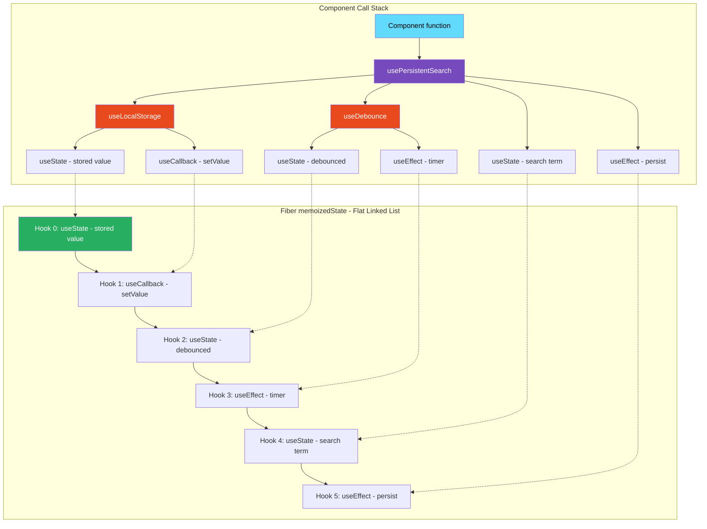
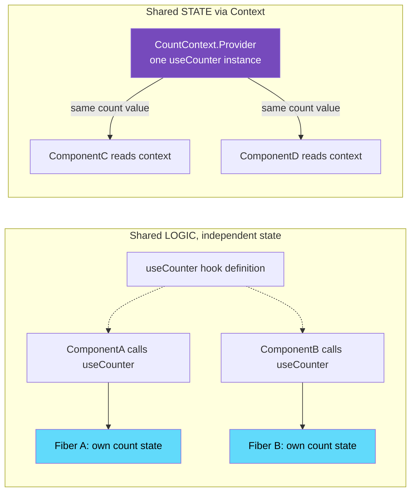

# 25 · Custom Hook Architecture

> **A custom hook is a JavaScript function whose name starts with "use" and that calls other hooks. That is the complete technical definition. The engineering value is not in the syntax — it is in the architectural pattern: custom hooks let you extract stateful logic from components, make it reusable, testable, and composable, while keeping the same mental model of hooks across your entire codebase. The "use" prefix is not a convention — it is a signal to React's rules enforcement and a guarantee to callers that this function participates in the hook lifecycle.**

Custom hooks are the primary abstraction mechanism in the React hooks model. They replaced higher-order components and render props for most logic-sharing use cases, not because they are syntactically nicer (they are), but because they compose correctly, maintain the hook execution order invariants, and avoid the component tree nesting that HOCs and render props require. This document explains the implementation model and the architectural patterns that emerge from it.

---

## Table of Contents

- [What Custom Hooks Actually Are](#what-custom-hooks-actually-are)
- [The Hook Rules and Why They Apply to Custom Hooks](#the-hook-rules-and-why-they-apply-to-custom-hooks)
- [The "use" Prefix Convention](#the-use-prefix-convention)
- [How Custom Hooks Compose](#how-custom-hooks-compose)
- [The Hook Tree for a Component](#the-hook-tree-for-a-component)
- [Sharing State vs Sharing Logic](#sharing-state-vs-sharing-logic)
- [Custom Hook Design Principles](#custom-hook-design-principles)
- [The Data Fetching Hook Pattern](#the-data-fetching-hook-pattern)
- [The Subscription Hook Pattern](#the-subscription-hook-pattern)
- [The Derived State Hook Pattern](#the-derived-state-hook-pattern)
- [The Imperative API Hook Pattern](#the-imperative-api-hook-pattern)
- [The Configuration Hook Pattern](#the-configuration-hook-pattern)
- [Composing Custom Hooks](#composing-custom-hooks)
- [Testing Custom Hooks](#testing-custom-hooks)
- [Performance Considerations](#performance-considerations)
- [Architecture Diagrams](#architecture-diagrams)
- [Good Practices](#good-practices)
- [Bad Practices](#bad-practices)
- [Mental Model](#mental-model)
- [Common Misconceptions](#common-misconceptions)
- [Exercises](#exercises)
- [Further Reading](#further-reading)

---

## What Custom Hooks Actually Are

At the implementation level, a custom hook is nothing more than a regular JavaScript function that:

1. Has a name starting with `use` (by convention — enforced by the ESLint rule)
2. Calls one or more hook functions internally

```tsx
// This is a complete custom hook:
function useCounter(initial: number = 0) {
  const [count, setCount] = useState(initial);
  const increment = useCallback(() => setCount((c) => c + 1), []);
  const decrement = useCallback(() => setCount((c) => c - 1), []);
  const reset = useCallback(() => setCount(initial), [initial]);
  return { count, increment, decrement, reset };
}
```

When a component calls `useCounter(0)`, React's hook dispatcher does not know or care that it is inside a "custom hook." The call stack looks like:

```
Component function
  → useCounter (your function)
    → useState (React's function) ← React processes this
    → useCallback (React's function) ← React processes this
    → useCallback (React's function) ← React processes this
    → useCallback (React's function) ← React processes this
```

React sees 4 hook calls in this component, at positions 0 (useState), 1 (first useCallback), 2, and 3. The `useCounter` function is transparent to React — it is just JavaScript stack frames. The hooks are directly on the component's fiber.

---

## The Hook Rules and Why They Apply to Custom Hooks

The rules of hooks apply to custom hooks because custom hooks are transparent to React:

### Rule 1: Call hooks at the top level

```tsx
// ❌ Conditional custom hook call — violates rule
function Component({ isEnabled }: { isEnabled: boolean }) {
  if (isEnabled) {
    const data = useData(); // hook called conditionally
  }
}

// ❌ Custom hook calling another hook conditionally
function useConditionalData(isEnabled: boolean) {
  if (isEnabled) {
    const [data, setData] = useState(null); // ❌ conditional hook call
  }
}

// ✅ Correct: handle condition inside the hook
function useData(isEnabled: boolean) {
  const [data, setData] = useState(null);

  useEffect(() => {
    if (!isEnabled) return; // condition inside the effect, not around the hook
    fetchData().then(setData);
  }, [isEnabled]);

  return isEnabled ? data : null;
}
```

The positions of hooks on the fiber's linked list must be consistent across renders. A conditional hook call changes the number or order of hooks — React reads wrong state for each subsequent hook.

### Rule 2: Call hooks only from React function components or custom hooks

```tsx
// ❌ Hook called from a regular function
function processOrder(orderId: string) {
  const [status, setStatus] = useState("pending"); // ❌ no fiber context
  // currentlyRenderingFiber is null → hooks throw an error
}

// ✅ Hook called from a custom hook (which is called from a component)
function useOrderStatus(orderId: string) {
  const [status, setStatus] = useState("pending"); // ✅ has fiber context
  return status;
}
```

Hooks depend on `currentlyRenderingFiber` being set by `renderWithHooks`. Regular functions called outside the render cycle don't have this context.

---

## The "use" Prefix Convention

The `use` prefix is:

1. **A signal to React's ESLint rule** (`eslint-plugin-react-hooks`) to enforce hook rules inside this function
2. **A signal to React's future Compiler** to understand which functions participate in the hook model
3. **A contract to callers** that this function may have side effects tied to the component lifecycle

```tsx
// ESLint's react-hooks/rules-of-hooks checks:
// - Functions starting with "use" in component bodies: enforce hook rules
// - Functions NOT starting with "use": don't enforce (can't call hooks)

function getUser(id: string) {
  // ESLint: this is a regular function, hooks not allowed
  const [user, setUser] = useState(null); // ← ESLint error in regular function
}

function useUser(id: string) {
  // ESLint: this is a hook, hook rules enforced
  const [user, setUser] = useState(null); // ← OK
  return user;
}
```

---

## How Custom Hooks Compose

Custom hooks compose by calling each other. The hook list on the fiber is flat — it doesn't matter how deep the call stack is when hooks are called. All hooks from all levels of the custom hook stack end up on the same fiber's linked list:

```tsx
// Component uses: useUserProfile
// useUserProfile uses: useUser, usePermissions
// useUser uses: useState (×2), useEffect
// usePermissions uses: useState, useEffect, useMemo

// The fiber's memoizedState linked list:
// [useState (user)] → [useState (loading)] → [useEffect (fetch)]
// → [useState (permissions)] → [useEffect (fetch perm)] → [useMemo (derived)]

// All 6 hook nodes are flat on the same fiber
// "useUserProfile", "useUser", "usePermissions" are invisible to React
```

This flat structure is why composition works correctly — the hook list order is deterministic as long as the call path is deterministic.

---

## The Hook Tree for a Component

When a component uses multiple custom hooks, the conceptual "hook tree" maps to a flat fiber hook list:

```tsx
function UserDashboard({ userId }: { userId: string }) {
  // Level 1: component calls custom hooks
  const { user, isLoading } = useUser(userId); // 3 hooks internally
  const permissions = usePermissions(user?.role); // 2 hooks internally
  const theme = useTheme(); // 1 hook internally
  const [isEditing, setIsEditing] = useState(false); // 1 hook directly

  // Total hooks on this fiber: 3 + 2 + 1 + 1 = 7
}

// Fiber memoizedState linked list (7 nodes):
// useUser:
//   [0] useState: { user: null }
//   [1] useState: { isLoading: true }
//   [2] useEffect: { deps: [userId] }
// usePermissions:
//   [3] useState: { permissions: [] }
//   [4] useEffect: { deps: [role] }
// useTheme:
//   [5] useContext: { context: ThemeContext }
// Direct call:
//   [6] useState: { isEditing: false }
```

---

## Sharing State vs Sharing Logic

The most important distinction in custom hook design: **custom hooks share logic, not state**.

```tsx
// SHARED LOGIC, INDEPENDENT STATE
function useCounter(initial = 0) {
  const [count, setCount] = useState(initial);
  const increment = () => setCount((c) => c + 1);
  return { count, increment };
}

function ComponentA() {
  const { count } = useCounter(0); // count A is independent
}

function ComponentB() {
  const { count } = useCounter(0); // count B is independent — NOT shared with A
}
// ComponentA and ComponentB each have their own count state
// Incrementing in A does not affect B
```

To share state, you need to lift state up or use Context:

```tsx
// SHARED STATE via Context + custom hook
const CountContext = React.createContext<ReturnType<typeof useCounter> | null>(
  null,
);

function CountProvider({ children }: { children: React.ReactNode }) {
  const counter = useCounter(0); // ONE instance — shared
  return (
    <CountContext.Provider value={counter}>{children}</CountContext.Provider>
  );
}

function useSharedCounter() {
  const ctx = useContext(CountContext);
  if (!ctx) throw new Error("Must be inside CountProvider");
  return ctx;
}

function ComponentA() {
  const { count } = useSharedCounter(); // same count as B
}

function ComponentB() {
  const { count } = useSharedCounter(); // same count as A
}
```

---

## Custom Hook Design Principles

### Principle 1: Single responsibility

Each custom hook should do one thing completely:

```tsx
// ❌ Does too much: fetch + process + UI state
function useProductPage(productId: string) {
  const [product, setProduct] = useState(null);
  const [isLoading, setIsLoading] = useState(true);
  const [isWishlisted, setIsWishlisted] = useState(false);
  const [selectedVariant, setSelectedVariant] = useState(null);
  const [quantity, setQuantity] = useState(1);
  const [reviews, setReviews] = useState([]);
  // 50 more lines...
}

// ✅ Each hook does one thing
function useProduct(productId: string) {
  // fetches and caches product data
}

function useWishlist(productId: string) {
  // manages wishlist state for one product
}

function useProductVariants(product: Product | null) {
  // manages variant selection
}
```

### Principle 2: Return what the consumer needs, not what you computed

```tsx
// ❌ Returns internal implementation details
function useFetch<T>(url: string) {
  const [state, setState] = useState({
    data: null,
    loading: true,
    error: null,
  });
  const abortControllerRef = useRef<AbortController | null>(null);
  const retryCountRef = useRef(0);
  const cacheRef = useRef<Map<string, T>>(new Map());

  // Don't return: setState, abortControllerRef, retryCountRef, cacheRef
  // These are internal implementation
}

// ✅ Return a clean, stable API
function useFetch<T>(url: string): {
  data: T | null;
  isLoading: boolean;
  error: Error | null;
  refetch: () => void;
} {
  // ... implementation hidden
  return { data, isLoading, error, refetch };
}
```

### Principle 3: Accept configuration parameters, not imperative control

```tsx
// ❌ Imperative: caller must control the hook's behavior
function useWebSocket() {
  const wsRef = useRef<WebSocket | null>(null);
  const connect = (url: string) => { /* ... */ };
  const disconnect = () => { /* ... */ };
  return { connect, disconnect }; // caller must call connect()
}

// ✅ Declarative: hook responds to parameter changes
function useWebSocket(url: string | null) {
  const [messages, setMessages] = useState<Message[]>([]);
  const [status, setStatus] = useState<'connecting' | 'connected' | 'disconnected'>('disconnected');

  useEffect(() => {
    if (!url) return; // null url = no connection
    const ws = new WebSocket(url);
    setStatus('connecting');
    ws.onopen = () => setStatus('connected');
    ws.onmessage = e => setMessages(prev => [...prev, JSON.parse(e.data)]);
    ws.onclose = () => setStatus('disconnected');
    return () => ws.close();
  }, [url]);

  return { messages, status };
}

// Usage: passing null disconnects automatically
<useWebSocket(isConnected ? 'wss://...' : null)>
```

---

## The Data Fetching Hook Pattern

The most universal custom hook pattern — encapsulates all async data loading complexity:

```tsx
type FetchState<T> =
  | { status: "idle" }
  | { status: "loading" }
  | { status: "error"; error: Error }
  | { status: "success"; data: T };

function useFetch<T>(
  url: string | null,
  options?: RequestInit,
): FetchState<T> & { refetch: () => void } {
  const [state, setState] = useState<FetchState<T>>({ status: "idle" });
  const [refreshKey, setRefreshKey] = useState(0);

  // Stable options reference
  const optionsRef = useRef(options);
  useLayoutEffect(() => {
    optionsRef.current = options;
  }, [options]);

  useEffect(() => {
    if (!url) {
      setState({ status: "idle" });
      return;
    }

    let cancelled = false;
    const controller = new AbortController();

    setState({ status: "loading" });

    fetch(url, { ...optionsRef.current, signal: controller.signal })
      .then((res) => {
        if (!res.ok) throw new Error(`HTTP ${res.status}: ${res.statusText}`);
        return res.json();
      })
      .then((data: T) => {
        if (!cancelled) setState({ status: "success", data });
      })
      .catch((error: Error) => {
        if (!cancelled && error.name !== "AbortError") {
          setState({ status: "error", error });
        }
      });

    return () => {
      cancelled = true;
      controller.abort();
    };
  }, [url, refreshKey]); // refreshKey: allows manual refetch

  const refetch = useCallback(() => setRefreshKey((k) => k + 1), []);

  return { ...state, refetch };
}

// Usage:
function UserProfile({ userId }: { userId: string }) {
  const result = useFetch<User>(`/api/users/${userId}`);

  if (result.status === "loading") return <Skeleton />;
  if (result.status === "error") return <Error error={result.error} />;
  if (result.status === "success") return <ProfileCard user={result.data} />;
  return null;
}
```

---

## The Subscription Hook Pattern

Encapsulates subscription to external stores or event sources:

```tsx
function useMediaQuery(query: string): boolean {
  const [matches, setMatches] = useState(() => {
    if (typeof window === "undefined") return false;
    return window.matchMedia(query).matches;
  });

  useEffect(() => {
    if (typeof window === "undefined") return;

    const mediaQuery = window.matchMedia(query);
    const handler = (e: MediaQueryListEvent) => setMatches(e.matches);

    // Support both old (addListener) and new (addEventListener) APIs
    if (mediaQuery.addEventListener) {
      mediaQuery.addEventListener("change", handler);
      return () => mediaQuery.removeEventListener("change", handler);
    } else {
      mediaQuery.addListener(handler);
      return () => mediaQuery.removeListener(handler);
    }
  }, [query]);

  return matches;
}

// More idiomatic with useSyncExternalStore (React 18):
function useMediaQuery(query: string): boolean {
  return React.useSyncExternalStore(
    // subscribe function
    (callback) => {
      const mq = window.matchMedia(query);
      mq.addEventListener("change", callback);
      return () => mq.removeEventListener("change", callback);
    },
    // getSnapshot: current value for client
    () => window.matchMedia(query).matches,
    // getServerSnapshot: SSR value
    () => false,
  );
}
```

### useSyncExternalStore for external stores

```tsx
// For subscribing to any external store (Redux, MobX, custom stores):
function useExternalStore<T>(store: Store<T>): T {
  return React.useSyncExternalStore(
    store.subscribe, // subscribe(callback) → unsubscribe
    store.getSnapshot, // () → current value (must return same reference if unchanged)
    store.getServerSnapshot, // for SSR
  );
}
```

---

## The Derived State Hook Pattern

Computes values derived from state or props, with memoization as needed:

```tsx
function useFilteredAndSorted<T>(
  items: T[],
  filterFn: (item: T) => boolean,
  sortFn: (a: T, b: T) => number,
): T[] {
  return useMemo(
    () => items.filter(filterFn).sort(sortFn),
    [items, filterFn, sortFn],
  );
}

// Pagination hook: derives page items and page info from flat list
function usePagination<T>(items: T[], pageSize: number) {
  const [page, setPage] = useState(1);

  const totalPages = Math.ceil(items.length / pageSize);

  // Reset to page 1 when items change (new search results, filter changes)
  useEffect(() => {
    setPage(1);
  }, [items]);

  const pageItems = useMemo(
    () => items.slice((page - 1) * pageSize, page * pageSize),
    [items, page, pageSize],
  );

  const goToPage = useCallback(
    (newPage: number) => setPage(Math.min(Math.max(1, newPage), totalPages)),
    [totalPages],
  );

  return {
    pageItems,
    page,
    totalPages,
    goToPage,
    hasNextPage: page < totalPages,
    hasPrevPage: page > 1,
    goNext: useCallback(() => goToPage(page + 1), [goToPage, page]),
    goPrev: useCallback(() => goToPage(page - 1), [goToPage, page]),
  };
}
```

---

## The Imperative API Hook Pattern

Exposes an imperative API for triggering actions programmatically:

```tsx
// Toast notification hook: imperatively show toasts
interface Toast {
  id: string;
  message: string;
  type: "success" | "error" | "info";
  duration: number;
}

function useToastSystem() {
  const [toasts, setToasts] = useState<Toast[]>([]);

  const show = useCallback(
    (message: string, type: Toast["type"] = "info", duration = 3000) => {
      const id = crypto.randomUUID();
      setToasts((prev) => [...prev, { id, message, type, duration }]);

      setTimeout(() => {
        setToasts((prev) => prev.filter((t) => t.id !== id));
      }, duration);

      return id; // return id for programmatic dismissal
    },
    [],
  );

  const dismiss = useCallback((id: string) => {
    setToasts((prev) => prev.filter((t) => t.id !== id));
  }, []);

  return {
    toasts,
    success: useCallback((msg: string) => show(msg, "success"), [show]),
    error: useCallback((msg: string) => show(msg, "error"), [show]),
    info: useCallback((msg: string) => show(msg, "info"), [show]),
    dismiss,
  };
}
```

---

## The Configuration Hook Pattern

Assembles configuration from multiple sources (props, context, environment):

```tsx
// Merges component props with context defaults and environment config
function useTableConfig(propsConfig: Partial<TableConfig>): TableConfig {
  const contextConfig = useContext(TableConfigContext) ?? DEFAULT_TABLE_CONFIG;
  const { locale, numberFormat } = useLocale();
  const isDense = useMediaQuery("(max-width: 768px)");

  return useMemo(
    () => ({
      ...DEFAULT_TABLE_CONFIG,
      ...contextConfig,
      // Environment overrides
      pageSize: isDense ? 10 : contextConfig.pageSize,
      numberFormat,
      locale,
      // Props take highest priority
      ...propsConfig,
    }),
    [contextConfig, propsConfig, locale, numberFormat, isDense],
  );
}
```

---

## Composing Custom Hooks

Custom hooks can call other custom hooks — this is the primary composition mechanism:

```tsx
// Low-level primitive hooks
function useLocalStorage<T>(
  key: string,
  initialValue: T,
): [T, (value: T) => void] {
  const [storedValue, setStoredValue] = useState<T>(() => {
    try {
      const item = window.localStorage.getItem(key);
      return item ? JSON.parse(item) : initialValue;
    } catch {
      return initialValue;
    }
  });

  const setValue = useCallback(
    (value: T) => {
      try {
        setStoredValue(value);
        window.localStorage.setItem(key, JSON.stringify(value));
      } catch (error) {
        console.error(error);
      }
    },
    [key],
  );

  return [storedValue, setValue];
}

function useDebounce<T>(value: T, delay: number): T {
  const [debouncedValue, setDebouncedValue] = useState(value);

  useEffect(() => {
    const timer = setTimeout(() => setDebouncedValue(value), delay);
    return () => clearTimeout(timer);
  }, [value, delay]);

  return debouncedValue;
}

// Higher-level hook composing both
function usePersistentDebouncedSearch(storageKey: string, delay: number = 300) {
  const [savedTerm, setSavedTerm] = useLocalStorage<string>(storageKey, "");
  const [searchTerm, setSearchTerm] = useState(savedTerm);
  const debouncedTerm = useDebounce(searchTerm, delay);

  // Persist debounced value to localStorage
  useEffect(() => {
    setSavedTerm(debouncedTerm);
  }, [debouncedTerm, setSavedTerm]);

  return {
    searchTerm, // current input value (live)
    setSearchTerm, // update current value
    debouncedTerm, // debounced value for search execution
    savedTerm, // persisted value (survives page reload)
  };
}
```

---

## Testing Custom Hooks

Custom hooks can be tested in isolation using `@testing-library/react-hooks` (or React Testing Library's `renderHook`):

```tsx
import { renderHook, act } from "@testing-library/react";

describe("useCounter", () => {
  it("initializes with the provided value", () => {
    const { result } = renderHook(() => useCounter(5));
    expect(result.current.count).toBe(5);
  });

  it("increments the count", () => {
    const { result } = renderHook(() => useCounter(0));

    act(() => {
      result.current.increment();
    });

    expect(result.current.count).toBe(1);
  });

  it("resets to initial value", () => {
    const { result } = renderHook(() => useCounter(10));

    act(() => {
      result.current.increment();
      result.current.increment();
    });

    act(() => {
      result.current.reset();
    });

    expect(result.current.count).toBe(10);
  });

  it("handles rapid increments correctly", () => {
    const { result } = renderHook(() => useCounter(0));

    act(() => {
      result.current.increment();
      result.current.increment();
      result.current.increment();
    });

    expect(result.current.count).toBe(3); // batched correctly
  });
});

// Testing hooks with context dependencies:
describe("useCartDispatch", () => {
  const wrapper = ({ children }: { children: React.ReactNode }) => (
    <CartProvider>{children}</CartProvider>
  );

  it("provides a dispatch function", () => {
    const { result } = renderHook(() => useCartDispatch(), { wrapper });
    expect(typeof result.current).toBe("function");
  });
});
```

---

## Performance Considerations

### Return stable references from custom hooks

```tsx
// ❌ New object returned every render — causes consumer re-renders
function useUser(userId: string) {
  const [user, setUser] = useState(null);
  return { user, setUser }; // new object every render!
}

// ✅ Stable setUser (it's a dispatch function) — only object is new
// Fix: return values separately or memoize the object
function useUser(userId: string) {
  const [user, setUser] = useState(null);
  // Option 1: return as tuple (no object creation)
  return [user, setUser] as const;
  // Option 2: memoize the object
  return useMemo(() => ({ user, setUser }), [user]);
}
```

### Don't memoize inside custom hooks that create subscriptions

```tsx
// ❌ Memoizing the cleanup prevents re-subscription when deps change
function useDebounce<T>(value: T, delay: number) {
  const [debouncedValue, setDebouncedValue] = useState(value);

  // ❌ useMemo here: the callback is memoized, but the effect needs to re-run
  const schedule = useMemo(() => {
    return () => {
      const timer = setTimeout(() => setDebouncedValue(value), delay);
      return () => clearTimeout(timer);
    };
  }, [value, delay]);

  // ✅ useEffect handles the lifecycle correctly
  useEffect(() => {
    const timer = setTimeout(() => setDebouncedValue(value), delay);
    return () => clearTimeout(timer);
  }, [value, delay]);

  return debouncedValue;
}
```

### Custom hooks and React.memo

Custom hooks are part of the component function — they don't affect `React.memo`'s prop comparison. `React.memo` checks props before calling the component function, so hooks inside are only reached if memo's comparison says "re-render":

```tsx
// React.memo checks props BEFORE calling the component function
// Custom hooks INSIDE the component don't affect this check
const MemoizedCard = React.memo(function Card({ userId }: { userId: string }) {
  // This useUser call only happens if memo's prop check passes
  const { user } = useUser(userId);
  return <div>{user?.name}</div>;
});
// memo prevents re-renders when userId is the same reference
// But when userId changes, useUser re-runs and fetches new data
```

---

## Architecture Diagrams

### Custom hook composition and the fiber hook list



### Sharing logic vs sharing state



---

## Good Practices

### ✅ Good Practice — Single-responsibility custom hook with clean API

```tsx
/**
 * Good: One focused concern. Clean return API.
 * Handles all edge cases (loading, error, cancellation, cleanup).
 * Consumer has no implementation details in their component.
 * Easy to test in isolation.
 */
function useUserSearch(initialQuery: string = "") {
  const [query, setQuery] = useState(initialQuery);
  const debouncedQuery = useDebounce(query, 300);

  const result = useFetch<User[]>(
    debouncedQuery.length >= 2
      ? `/api/users/search?q=${encodeURIComponent(debouncedQuery)}`
      : null,
  );

  return {
    query,
    setQuery,
    users: result.status === "success" ? result.data : [],
    isLoading: result.status === "loading",
    error: result.status === "error" ? result.error : null,
    hasResults: result.status === "success" && result.data.length > 0,
    isEmpty:
      debouncedQuery.length >= 2 &&
      result.status === "success" &&
      result.data.length === 0,
  };
}

// Consumer: clean, focused, no async management
function UserSearchPanel() {
  const { query, setQuery, users, isLoading, error, isEmpty } = useUserSearch();

  return (
    <div>
      <input
        value={query}
        onChange={(e) => setQuery(e.target.value)}
        placeholder="Search users..."
      />
      {isLoading && <Spinner />}
      {error && <ErrorMessage error={error} />}
      {isEmpty && <p>No users found for "{query}"</p>}
      <UserList users={users} />
    </div>
  );
}
```

**Why this works:** The component has no async management code, no loading state tracking, no error handling logic. All of that is in the hook. The component only handles UI decisions. The hook can be tested completely independently of any UI. Adding pagination, caching, or retry logic requires only changing the hook — not the component.

---

## Bad Practices

### ⚠️ Bad Practice — God hook: one hook for everything

```tsx
/**
 * Bad: Single massive hook that combines unrelated concerns.
 * Cannot be used partially. Cannot be tested in isolation.
 * Changing user logic requires touching product logic code.
 * 100+ lines that should be 5 focused hooks.
 */
function useEverything({
  userId,
  productId,
}: {
  userId: string;
  productId: string;
}) {
  // ❌ User management
  const [user, setUser] = useState<User | null>(null);
  const [userLoading, setUserLoading] = useState(true);

  // ❌ Product management (unrelated to user)
  const [product, setProduct] = useState<Product | null>(null);
  const [productLoading, setProductLoading] = useState(true);

  // ❌ Cart management (unrelated to fetching)
  const [cartItems, setCartItems] = useState<CartItem[]>([]);
  const [cartTotal, setCartTotal] = useState(0);

  // ❌ UI state (unrelated to data)
  const [isSidebarOpen, setIsSidebarOpen] = useState(false);
  const [activeTab, setActiveTab] = useState("overview");
  const [isFullscreen, setIsFullscreen] = useState(false);

  // ❌ Notification logic (unrelated to everything else)
  const [notifications, setNotifications] = useState<Notification[]>([]);
  const [notificationPermission, setNotificationPermission] =
    useState("default");

  // 200 more lines...

  return {
    user,
    userLoading,
    product,
    productLoading,
    cartItems,
    cartTotal,
    addToCart: () => {
      /* ... */
    },
    isSidebarOpen,
    setIsSidebarOpen,
    activeTab,
    setActiveTab,
    notifications,
    requestPermission: () => {
      /* ... */
    },
    // 30 more properties...
  };
}

// ✅ Refactored: focused hooks
function usePage({ userId, productId }: { userId: string; productId: string }) {
  const user = useUser(userId); // user + auth
  const product = useProduct(productId); // product data
  const cart = useCart(); // cart state + actions
  const ui = usePageUI(); // sidebar, tab, fullscreen
  const notifications = useNotifications(); // notification system

  return { user, product, cart, ui, notifications };
}
```

**Production impact:** The god hook is used in 5 components. Feature X requires changes to user logic. The developer must modify `useEverything`, which contains cart, product, notification, and UI logic. Tests break for features unrelated to the change. Code review is harder (massive diff). Bugs in cart logic affect user components. The 5 focused hooks are each independently testable, independently modifiable, and independently usable.

---

## Mental Model

> 💡 **The custom hook mental model:**
>
> Custom hooks are like **electrical adapters**. The wall outlet (React's hook system) provides power (state, effects, context) through standardized connectors (useState, useEffect, etc.). A custom hook is an adapter: it accepts power from the wall (calls built-in hooks), transforms it into a different shape (encapsulates logic), and presents a new interface (your custom return value). Multiple adapters can chain: a power strip (useFetch) plugs into the wall and provides multiple outlets. Your device (useUserSearch) plugs into the power strip. The wall only sees one connection. The device only sees its socket. The adapter handles the conversion in between. Like physical adapters: one adapter per concern, labeled clearly (the `use` prefix), and you don't put two unrelated devices into one adapter.

---

## Common Misconceptions

### "Custom hooks create separate component instances"

Custom hooks are transparent to React. They don't create new fibers, new component instances, or new tree nodes. All hook state from custom hooks lives on the same fiber as the component that called the outermost custom hook.

### "Custom hooks automatically share state between components"

Custom hooks share logic, not state. Each component that calls a custom hook gets its own independent state. To share state, you need Context, external stores, or state lifting.

### "Custom hooks are only for reuse"

Custom hooks are also valuable for extraction — organizing a single component's logic into focused units, even if those units are never used elsewhere. A complex component with 5 custom hooks (none shared) is often more maintainable than one with all logic inline.

### "The 'use' prefix is required by JavaScript"

The prefix is required by React's ESLint rules and the React Compiler, not by JavaScript or React's runtime. Without the prefix, the function works but ESLint won't enforce hook rules inside it, which can lead to bugs that are hard to diagnose.

### "Custom hooks can be called from class components"

Custom hooks can only be called from function components or other custom hooks. Class components don't have the hook context (`currentlyRenderingFiber` is not set during class component render methods).

---

## Exercises

### Exercise 1 — Visualize the flat hook list

Build a custom hook that calls multiple hooks. Add a debugging utility to inspect the fiber's `memoizedState` linked list:

```tsx
function useHookListDebug() {
  // After mount, inspect the fiber's hook list
  useEffect(() => {
    // Get the fiber for the component that called this hook
    // (implementation: find element with __reactFiber, walk up to find function component)
    const fiber = getCurrentFiber(); // your implementation
    let hook = fiber?.memoizedState;
    let position = 0;
    while (hook) {
      console.log(`Hook ${position}:`, hook.memoizedState);
      hook = hook.next;
      position++;
    }
  }, []);
}

// Count: how many hook nodes does your custom hook create?
```

### Exercise 2 — Test a custom hook in isolation

```tsx
// Write tests for this hook without any component:
function useToggle(initial: boolean = false) {
  const [value, setValue] = useState(initial);
  const toggle = useCallback(() => setValue((v) => !v), []);
  const setTrue = useCallback(() => setValue(true), []);
  const setFalse = useCallback(() => setValue(false), []);
  return { value, toggle, setTrue, setFalse };
}

// Required tests:
// - Initial value is correct
// - toggle changes false → true → false
// - setTrue always sets to true
// - setFalse always sets to false
// - Multiple rapid toggles produce correct final state
```

### Exercise 3 — Refactor a component using custom hooks

Take any component > 100 lines with mixed concerns. Identify:

1. Data fetching logic
2. Form state management
3. UI state (collapsed, selected, etc.)
4. Side effects (analytics, timers)

Extract each into a named custom hook. Measure: does the component body become shorter? Is each hook independently testable? Can each hook be reused elsewhere?

---

## Further Reading

- [React Docs: Reusing Logic with Custom Hooks](https://react.dev/learn/reusing-logic-with-custom-hooks) — Official guide with design principles
- [React Source: renderWithHooks](https://github.com/facebook/react/blob/main/packages/react-reconciler/src/ReactFiberHooks.js) — How hooks are called during render
- [@testing-library/react — renderHook](https://testing-library.com/docs/react-testing-library/api/#renderhook) — Testing custom hooks
- [Kent C. Dodds: How to test custom React hooks](https://kentcdodds.com/blog/how-to-test-custom-react-hooks) — Testing strategies
- [Overreacted: Making setInterval Declarative with React Hooks](https://overreacted.io/making-setinterval-declarative-with-react-hooks/) — Classic custom hook design example
- Next in this handbook: [26 · What Causes Re-renders](../react-rendering/06-what-causes-rerenders.md)

---

_Part of the [React + Next.js Engineering Handbook](../../README.md)_
