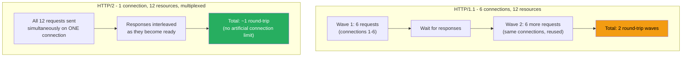
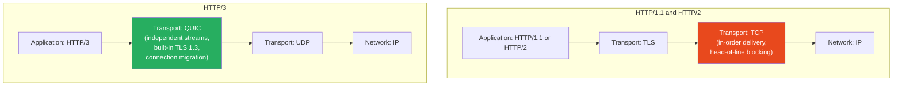

# 91 · HTTP/1.1 vs HTTP/2 vs HTTP/3

> **The HTTP protocol version your application is served over fundamentally changes which frontend performance optimizations matter. Techniques developed for HTTP/1.1's limitations — domain sharding, CSS/JS concatenation, image spriting — became actively counterproductive under HTTP/2, and HTTP/3's QUIC-based transport changes the calculus again, particularly for users on unreliable mobile networks. Understanding what changed at each protocol generation explains why "best practices" from a 2015 performance guide can hurt performance today, and clarifies what Next.js's bundling and asset strategies are actually optimizing for.**

Most frontend engineers treat HTTP as a black box — "the browser makes a request, the server responds." But the protocol's mechanics directly determine whether code splitting helps or hurts, whether inlining critical CSS makes sense, and how many parallel connections your app effectively uses. This document covers the three protocol generations currently in production use and their direct implications for Next.js application architecture.

---

## Table of Contents

- [HTTP/1.1: The Connection-Per-Request Era](#http11-the-connection-per-request-era)
- [The HTTP/1.1 Workarounds (and Why They're Now Harmful)](#the-http11-workarounds-and-why-theyre-now-harmful)
- [HTTP/2: Multiplexing Over a Single Connection](#http2-multiplexing-over-a-single-connection)
- [HTTP/2 Server Push (and Its Deprecation)](#http2-server-push-and-its-deprecation)
- [HTTP/2 Header Compression: HPACK](#http2-header-compression-hpack)
- [The HTTP/2 Problem: Head-of-Line Blocking at the TCP Layer](#the-http2-problem-head-of-line-blocking-at-the-tcp-layer)
- [HTTP/3: QUIC and the Move Away from TCP](#http3-quic-and-the-move-away-from-tcp)
- [QUIC's Connection Migration](#quics-connection-migration)
- [0-RTT Connection Resumption](#0-rtt-connection-resumption)
- [Practical Implications for Next.js Applications](#practical-implications-for-nextjs-applications)
- [Detecting and Verifying Protocol Version](#detecting-and-verifying-protocol-version)
- [Architecture Diagrams](#architecture-diagrams)
- [Good Practices](#good-practices)
- [Bad Practices](#bad-practices)
- [Mental Model](#mental-model)
- [Common Misconceptions](#common-misconceptions)
- [Exercises](#exercises)
- [Further Reading](#further-reading)

---

## HTTP/1.1: The Connection-Per-Request Era

```
HTTP/1.1 (1997, still in limited use):
  - Each TCP connection handles ONE request at a time
  - "Keep-alive" allows REUSING a connection for sequential requests,
    but NOT concurrent ones — request 2 must wait for request 1's
    full response before being sent on the SAME connection
  - Browsers work around this by opening MULTIPLE PARALLEL connections
    to the same origin: typically 6 connections per hostname (browser-
    dependent, historically ranged from 2 to 8)

THE BOTTLENECK:
  A page requiring 30 resources (HTML, CSS, JS, images, fonts) from
  ONE origin, with a 6-connection limit:
    30 resources ÷ 6 connections = 5 "waves" of requests
    Each wave: request → wait for response → next wave starts
    Total time: heavily dependent on round-trip latency, multiplied
    by the number of waves

  On a connection with 100ms RTT (round-trip time):
    5 waves × 100ms minimum = 500ms+ JUST for connection round trips,
    before accounting for actual download time
```

---

## The HTTP/1.1 Workarounds (and Why They're Now Harmful)

A generation of "best practices" emerged specifically to work around HTTP/1.1's connection limits:

```
WORKAROUND 1: CSS/JS Concatenation
  Combine many small files into ONE large file → fewer requests
  → fewer connection-limited "waves"
  HTTP/1.1 era: genuinely beneficial
  HTTP/2+ era: HARMFUL — see below

WORKAROUND 2: Image Spriting
  Combine many small images into ONE sprite sheet, use CSS
  background-position to show only the needed portion
  HTTP/1.1 era: genuinely beneficial (1 request instead of 20)
  HTTP/2+ era: largely unnecessary, adds complexity, often worse
  for caching (changing ONE icon invalidates the WHOLE sprite)

WORKAROUND 3: Domain Sharding
  Serve assets from MULTIPLE subdomains (static1.example.com,
  static2.example.com) to get MORE THAN 6 parallel connections
  (6 connections × N domains = more parallelism)
  HTTP/1.1 era: genuinely beneficial
  HTTP/2+ era: ACTIVELY HARMFUL — each additional domain requires
  its own TCP handshake + TLS negotiation, and HTTP/2's multiplexing
  benefits only apply WITHIN a single connection (sharding defeats
  the very feature that makes HTTP/2 fast)

WORKAROUND 4: Inlining Small Assets as Data URIs
  Embed small images/fonts directly in CSS/HTML as base64 data URIs
  to avoid a separate request
  HTTP/1.1 era: beneficial for very small, rarely-changing assets
  HTTP/2+ era: usually unnecessary — base64 encoding adds ~33% size
  overhead, and a separate cacheable request is often better than
  bloating a frequently-changing file with inlined binary data
```

```
WHY THESE WORKAROUNDS ACTIVELY HURT under HTTP/2:

Bundling everything into ONE giant JS file means:
  - The ENTIRE file must be re-downloaded when ANY part changes
    (poor caching — defeats the benefit of content-hashed filenames
    for unrelated code)
  - The browser can't start executing/parsing earlier-needed code
    while later code is still downloading (worse for code that could
    otherwise be split and prioritized)
  - HTTP/2 can efficiently multiplex MANY SMALL requests over one
    connection — the "1 big file is better than many small files"
    assumption from HTTP/1.1 no longer holds
```

---

## HTTP/2: Multiplexing Over a Single Connection

```
HTTP/2 (2015, now the dominant protocol for most web traffic):

KEY INNOVATION: MULTIPLEXING
  Multiple requests AND responses can be in flight SIMULTANEOUSLY
  over a SINGLE TCP connection. No more "wait for response before
  sending next request" — and no need for 6 parallel connections
  to achieve parallelism.

  HTTP/2 introduces "STREAMS" — each request/response pair gets
  its own stream ID, and the underlying TCP connection carries
  interleaved FRAMES from multiple streams simultaneously.

PRACTICAL IMPACT:
  A page with 30 resources from ONE origin:
    HTTP/1.1: 5 waves of 6 parallel requests (connection-limited)
    HTTP/2: all 30 requests can be in flight concurrently over
            ONE connection (no artificial 6-connection ceiling)

  This is WHY the HTTP/1.1 workarounds become harmful — HTTP/2
  already solves the problem they were designed to work around,
  and applying them ON TOP of HTTP/2 just adds unnecessary
  complexity and caching downsides.

BINARY FRAMING (vs HTTP/1.1's text-based protocol):
  HTTP/2 encodes requests/responses as BINARY FRAMES rather than
  human-readable text. This makes parsing faster and less error-prone,
  though it's not directly visible to web developers (browser
  DevTools still SHOW you the request/response as if it were
  human-readable HTTP/1.1-style text, abstracting the binary framing).
```

---

## HTTP/2 Server Push (and Its Deprecation)

```
HTTP/2 SERVER PUSH (largely abandoned, important to know about
for historical context and because some legacy guides still
recommend it):

THE IDEA: the server, while responding to a request for index.html,
PROACTIVELY pushes resources it KNOWS the browser will need next
(like the CSS and JS referenced in that HTML) — without waiting
for the browser to parse the HTML and request them separately.

WHY IT WAS DEPRECATED (Chrome removed support in 2022, other
browsers followed or are following):
  - Pushed resources often DUPLICATED what was ALREADY in the
    browser's cache (the server doesn't know what the browser
    already has cached, so it might push unnecessary data)
  - Difficult to implement correctly; many implementations pushed
    too much or the wrong resources
  - <link rel="preload"> achieves similar prioritization benefits
    with browser-cache-awareness and developer control, without
    the protocol-level complexity

CURRENT RECOMMENDATION: use <link rel="preload"> and HTTP's
103 Early Hints status code (an emerging, more targeted replacement
for server push) instead of HTTP/2 Server Push.
```

---

## HTTP/2 Header Compression: HPACK

```
HTTP/1.1 sends FULL HEADERS with every request — for a page with
30 resources, the same Cookie, User-Agent, Accept-Language headers
(often several hundred bytes) are repeated 30 TIMES.

HTTP/2's HPACK compression:
  Maintains a SHARED, STATEFUL "header table" between client and
  server for the LIFETIME of the connection. Headers that repeat
  across requests (Cookie, User-Agent, common Accept headers) are
  sent ONCE in full, then referenced by a SHORT INDEX on subsequent
  requests within the same connection.

PRACTICAL IMPACT:
  For request-header-heavy applications (many cookies, complex
  Accept-* headers), HPACK can reduce the OVERHEAD of headers by
  80-90% across a connection's lifetime — meaningful for mobile
  users on slow/metered connections, where header overhead was a
  surprisingly significant fraction of total request size under
  HTTP/1.1.
```

---

## The HTTP/2 Problem: Head-of-Line Blocking at the TCP Layer

HTTP/2 solved APPLICATION-LAYER head-of-line blocking (waiting for one response before sending the next request) but inherited a TRANSPORT-LAYER problem from TCP:

```
THE PROBLEM:
  HTTP/2 multiplexes multiple streams over ONE TCP connection.
  TCP guarantees IN-ORDER DELIVERY of all bytes on a connection.

  If even ONE PACKET is lost (common on mobile/wifi networks),
  TCP must WAIT for that packet to be retransmitted before
  delivering ANY subsequent data — even data belonging to a
  COMPLETELY DIFFERENT HTTP/2 stream that arrived successfully.

  This means: a single dropped packet for Stream A (say, a large
  image) can stall delivery of Stream B's data (say, your critical
  JavaScript) even though Stream B's packets arrived FINE — because
  TCP doesn't know about HTTP/2's stream concept; it just sees
  "bytes 1000-2000 are missing, hold everything after that."

WHY THIS MATTERS MORE ON MOBILE:
  Mobile networks have HIGHER PACKET LOSS RATES than wired
  connections (WiFi interference, cellular handoffs, congestion).
  HTTP/2's multiplexing benefit can be SEVERELY DEGRADED on lossy
  networks because of this TCP-level head-of-line blocking — in
  the worst cases, performance can be WORSE than HTTP/1.1's
  multiple-connection approach, where a lost packet on one
  connection doesn't block the OTHER parallel connections.

THIS IS THE PROBLEM HTTP/3 WAS DESIGNED TO SOLVE.
```

---

## HTTP/3: QUIC and the Move Away from TCP

```
HTTP/3 (2022, RFC 9114, increasingly widely deployed):

THE FUNDAMENTAL CHANGE: HTTP/3 doesn't run over TCP at all.
It runs over QUIC, a NEW TRANSPORT PROTOCOL built on top of UDP.

WHY THIS SOLVES THE HEAD-OF-LINE BLOCKING PROBLEM:
  QUIC implements its OWN stream multiplexing AT THE TRANSPORT
  LAYER (not just the application layer like HTTP/2's streams-over-TCP).
  Each QUIC stream has INDEPENDENT loss recovery — a lost packet
  for Stream A's data does NOT block delivery of Stream B's data,
  because QUIC (unlike TCP) understands the concept of independent
  streams natively, at the protocol level where packet loss
  recovery happens.

  This means: HTTP/3 over QUIC genuinely achieves what HTTP/2
  ATTEMPTED but couldn't fully deliver due to TCP's in-order,
  connection-wide guarantee.

OTHER QUIC IMPROVEMENTS:
  - Built-in encryption (QUIC mandates TLS 1.3 — there is no
    "unencrypted QUIC," unlike HTTP/1.1 and HTTP/2 which CAN run
    without TLS)
  - Faster connection establishment (combines the transport AND
    TLS handshakes into fewer round trips than TCP+TLS separately)
  - Connection migration (see below)
```

---

## QUIC's Connection Migration

```
TCP connections are identified by a 4-tuple:
  (source IP, source port, destination IP, destination port)

When your phone switches from WiFi to cellular data (a common
mobile scenario), your DEVICE'S IP ADDRESS CHANGES. This BREAKS
any existing TCP connection — the OS must establish an entirely
NEW TCP connection (full handshake) before the app can continue.

QUIC connections are identified by a CONNECTION ID, independent
of the underlying IP address/port. When your network changes
(WiFi → cellular), QUIC can MIGRATE the existing connection to
the new network path WITHOUT a full reconnection — the connection
ID persists, and QUIC handles the transition transparently.

PRACTICAL IMPACT:
  A user streaming data or mid-way through a long page load who
  walks out of WiFi range and onto cellular: with HTTP/3, the
  connection can survive this transition smoothly. With HTTP/1.1
  or HTTP/2 (over TCP), the connection breaks and must be
  re-established from scratch.
```

---

## 0-RTT Connection Resumption

```
ESTABLISHING A NEW HTTPS CONNECTION TRADITIONALLY REQUIRES:
  TCP handshake: 1 round trip (SYN, SYN-ACK, ACK)
  TLS handshake: 1-2 round trips (depending on TLS version)
  Total: 2-3 round trips BEFORE the first byte of actual data
  is exchanged.

  On a connection with 100ms RTT: 200-300ms of pure handshake
  overhead before useful data transfer begins.

QUIC (and TLS 1.3, used by HTTP/2 as well) SUPPORT 0-RTT:
  If the client has PREVIOUSLY connected to this server (and has
  cached the necessary session resumption data), it can send
  APPLICATION DATA in its VERY FIRST PACKET — achieving "0 round
  trips" of pure handshake overhead before useful data flows.

CAVEAT: 0-RTT data is vulnerable to REPLAY ATTACKS (a network
attacker who captures the 0-RTT packet can resend it, potentially
causing the same request to be processed twice). For this reason,
0-RTT is typically only used for IDEMPOTENT requests (GET requests
that don't have side effects) — POST/PUT/DELETE requests usually
require the full handshake for safety.
```

---

## Practical Implications for Next.js Applications

```
WHAT TO DO DIFFERENTLY UNDER HTTP/2+ (vs old HTTP/1.1 guidance):

✅ DO: split code into reasonably-sized chunks (Next.js's automatic
       route-based + dynamic-import-based splitting). HTTP/2's
       multiplexing handles many small requests efficiently.

✅ DO: use content-hashed filenames for long-term caching
       (the_chunk.abc123.js) — smaller, more granular chunks mean
       MORE of your bundle can be served from cache after a deploy
       that only changes SOME files.

✅ DO: rely on a SINGLE origin/domain for your assets where possible
       (avoid the old domain-sharding pattern) — let HTTP/2's
       connection multiplexing do its job.

❌ DON'T: manually concatenate all your CSS/JS into one giant file
          "to reduce requests" — this defeats caching granularity
          and HTTP/2 doesn't need it.

❌ DON'T: image-sprite small icons "to reduce requests" — modern
          icon strategies (SVG sprites for genuinely many small
          icons are still occasionally useful, but for general
          images, HTTP/2 makes individual requests cheap).

✅ DO: still minimize the NUMBER OF BYTES transferred (this matters
       under ANY protocol version) — compression, image optimization,
       code splitting for UNUSED code (not just request-count reduction).

⚠️ CONSIDER: if your user base is significantly mobile/lossy-network,
   verify your CDN/hosting supports HTTP/3 — Vercel, Cloudflare, and
   most major CDNs support HTTP/3 by default as of recent years.
```

---

## Detecting and Verifying Protocol Version

```bash
# Chrome DevTools: Network tab → add the "Protocol" column
# (right-click any column header → Protocol)
# Shows: h1.1, h2, h3 (or "quic") per request

# curl: check the negotiated protocol
curl -I --http2 https://example.com
curl -I --http3 https://example.com  # requires curl built with HTTP/3 support

# Command-line verification of HTTP/3 support:
curl -v --http3 https://example.com 2>&1 | grep "HTTP/3"
```

```
COMMON GOTCHA: a server can SUPPORT HTTP/3 but the CLIENT'S FIRST
CONNECTION still uses HTTP/1.1 or HTTP/2 — the server advertises
HTTP/3 availability via an "Alt-Svc" response header, and the
BROWSER decides whether to switch to HTTP/3 for SUBSEQUENT requests
(or sometimes for the same page's later resources). This means a
single page load can use a MIX of protocol versions for different
resources — checking DevTools per-request (not assuming a single
protocol for the whole page) is the accurate way to verify.
```

---

## Architecture Diagrams

### HTTP/1.1 connection-limited waterfall vs HTTP/2 multiplexed



### Protocol stack comparison



---

## Good Practices

### ✅ Good Practice — Architecting Next.js asset delivery for HTTP/2+

```js
/**
 * Good: Next.js's default behavior already aligns with HTTP/2+ best
 * practices — granular, content-hashed, route-based chunks served
 * from a single origin. This configuration reinforces those defaults
 * rather than fighting them with HTTP/1.1-era workarounds.
 */

// next.config.js
/** @type {import('next').NextConfig} */
module.exports = {
  // Single origin for assets — let HTTP/2/3 multiplexing work,
  // don't shard across multiple subdomains
  images: {
    domains: [], // serve optimized images from the same origin via next/image
  },

  // Granular chunk splitting is Next.js's default behavior —
  // don't override optimization.splitChunks to force everything
  // into one giant bundle "to reduce requests" (an HTTP/1.1-era
  // anti-pattern under HTTP/2+)

  // Ensure your hosting/CDN advertises HTTP/3 support:
  // (Vercel, Cloudflare, and most modern CDNs do this automatically —
  // verify via DevTools' Protocol column, not just assume it)
};
```

---

## Bad Practices

### ⚠️ Bad Practice — Applying HTTP/1.1-era domain sharding under HTTP/2

```js
/**
 * Bad: Manually splitting static assets across multiple subdomains,
 * an HTTP/1.1-era technique to bypass the 6-connections-per-origin
 * limit, applied to a project served over HTTP/2.
 *
 * Under HTTP/2's multiplexing, this DEFEATS the protocol's core
 * advantage: each additional domain requires its OWN separate
 * TCP+TLS handshake (and its own HTTP/2 connection), fragmenting
 * what should be ONE efficient multiplexed connection into SEVERAL
 * less-efficient ones.
 */

// ❌ next.config.js — domain sharding (HTTP/1.1 anti-pattern under HTTP/2+)
module.exports = {
  assetPrefix: "https://static1.example.com", // unnecessary extra origin
  images: {
    domains: [
      "static1.example.com",
      "static2.example.com",
      "static3.example.com", // "more parallelism" — but HARMFUL under HTTP/2
    ],
  },
};

// Each additional domain incurs:
//   - A new DNS lookup
//   - A new TCP handshake
//   - A new TLS handshake
//   - A SEPARATE HTTP/2 connection (losing the multiplexing benefit
//     of consolidating requests onto ONE connection)

/**
 * ✅ Fix: serve all assets from a SINGLE origin, let HTTP/2/3
 * multiplexing handle the parallelism
 */
module.exports = {
  // No assetPrefix sharding — single origin
  images: {
    // next/image serves optimized images from the SAME origin by default
  },
};
```

**Production impact:** A team migrating from an older infrastructure setup retained their domain-sharding configuration (3 static asset subdomains) after switching to a CDN that fully supported HTTP/2. Lighthouse audits showed worse-than-expected Largest Contentful Paint despite a fast CDN — the root cause was 3x the connection-establishment overhead (3 separate TCP+TLS handshakes) competing for the same limited initial network budget. Consolidating to a single origin improved LCP by ~400ms on average mobile connections.

---

## Mental Model

> 💡 **The HTTP version mental model:**
>
> HTTP/1.1 is like a **single-lane toll booth** — only one car (request) can pass through at a time, so to handle traffic, cities built MULTIPLE toll booths side by side (the 6-connections-per-origin workaround) and tried to reduce the NUMBER OF CARS by combining multiple trips into fewer, larger vehicles (file concatenation, sprite sheets). HTTP/2 replaced this with a **multi-lane highway with one entrance ramp** — many cars can travel simultaneously once they're on the highway (multiplexing over one connection), so building MULTIPLE separate entrance ramps (domain sharding) is now counterproductive — it just creates redundant toll-booth overhead. HTTP/3's QUIC is like **upgrading from a highway where one stalled car blocks an entire lane (TCP's head-of-line blocking) to a system where each car has its own independent track** — a breakdown in one track doesn't block traffic in any other track, which matters enormously on bumpy roads (lossy mobile networks) where breakdowns (packet loss) are common.

---

## Common Misconceptions

### "HTTP/2 makes bundling unnecessary entirely"

HTTP/2 makes bundling LESS NECESSARY for reducing request count, but bundling (and code splitting) still matters for REDUCING TOTAL BYTES TRANSFERRED (tree shaking, minification) and for ORGANIZING code into cacheable units. The goal shifts from "minimize request count" to "minimize bytes + maximize caching granularity."

### "HTTP/3 is universally faster than HTTP/2"

HTTP/3's advantages are MOST PRONOUNCED on lossy networks (mobile, WiFi with interference). On a stable, low-loss wired connection, HTTP/2 and HTTP/3 perform similarly — the head-of-line blocking problem HTTP/3 solves is most impactful when packet loss is a meaningful factor.

### "My server supports HTTP/3, so all my requests use it"

The FIRST connection to a server typically uses HTTP/1.1 or HTTP/2 (browsers don't know in advance if a server supports HTTP/3). The server advertises HTTP/3 support via the `Alt-Svc` header, and the browser MAY upgrade to HTTP/3 for SUBSEQUENT connections/requests. Verify actual protocol usage via DevTools, don't assume.

### "QUIC being built on UDP means it's less reliable than TCP"

QUIC implements ITS OWN reliability mechanisms (acknowledgments, retransmission, congestion control) on top of UDP — it's not "unreliable UDP," it's a NEW reliable transport protocol that happens to use UDP as its underlying packet-delivery mechanism (because UDP, unlike TCP, doesn't impose in-order delivery at the OS/kernel level, giving QUIC the flexibility to implement independent-stream reliability).

### "Domain sharding is always bad under HTTP/2"

For assets served from a GENUINELY DIFFERENT origin (a third-party CDN, an API server with different caching needs), separate origins remain necessary and not "sharding" in the harmful sense. The anti-pattern specifically refers to ARTIFICIALLY splitting YOUR OWN assets across MULTIPLE subdomains SOLELY to bypass HTTP/1.1's connection limit — a non-issue under HTTP/2+.

---

## Exercises

### Exercise 1 — Observe protocol versions in DevTools

1. Open Chrome DevTools → Network tab
2. Right-click the column header, enable "Protocol"
3. Visit a major site (e.g., a site served via Cloudflare or Vercel)
4. Observe: are all requests on the same protocol? Do any show h3 (HTTP/3 over QUIC)?
5. Visit an older or less-optimized site and compare

### Exercise 2 — Measure the connection overhead of domain sharding

Using a tool like WebPageTest or Chrome DevTools' waterfall view:

1. Create a test page that loads 20 small images from ONE origin
2. Create a second test page that loads the SAME 20 images split across 3 subdomains
3. Compare total load time, paying attention to DNS lookup + connection setup time in the waterfall

### Exercise 3 — Research your production CDN's protocol support

For your actual production deployment (Vercel, Cloudflare, or other hosting):

1. Check their documentation for HTTP/3 support status
2. Use `curl -v --http3` or DevTools to verify HTTP/3 is actually negotiated for your domain
3. If not enabled, research what configuration (if any) is needed to enable it

---

## Further Reading

- [web.dev: HTTP/2 and beyond](https://web.dev/articles/performance-http2) — practical optimization guidance for HTTP/2+
- [Cloudflare: What is HTTP/3?](https://www.cloudflare.com/learning/performance/what-is-http3/) — accessible HTTP/3/QUIC explainer
- [RFC 9114: HTTP/3](https://www.rfc-editor.org/rfc/rfc9114) — the official specification
- [RFC 9000: QUIC Transport Protocol](https://www.rfc-editor.org/rfc/rfc9000) — the underlying transport spec
- [Daniel Stenberg (curl maintainer): HTTP/3 explained](https://http3-explained.haxx.se/) — comprehensive, freely available book
- Next in this handbook: [92 · Streaming & Chunked Transfer](./02-streaming.md)

---

_Part of the [React + Next.js Engineering Handbook](../../README.md)_
