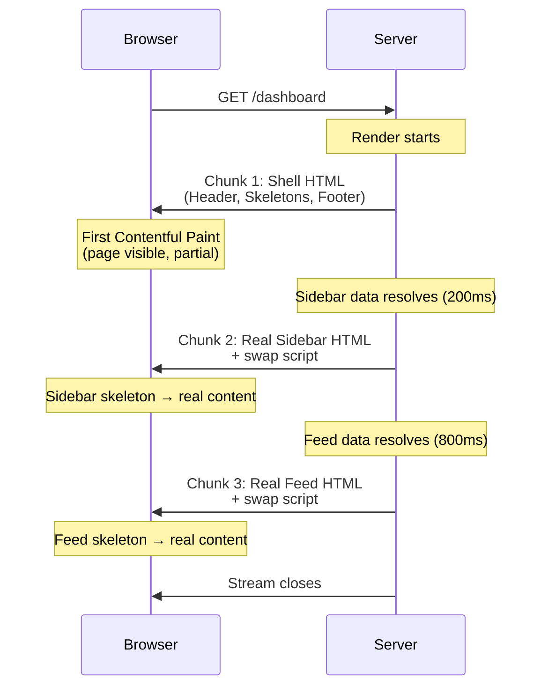
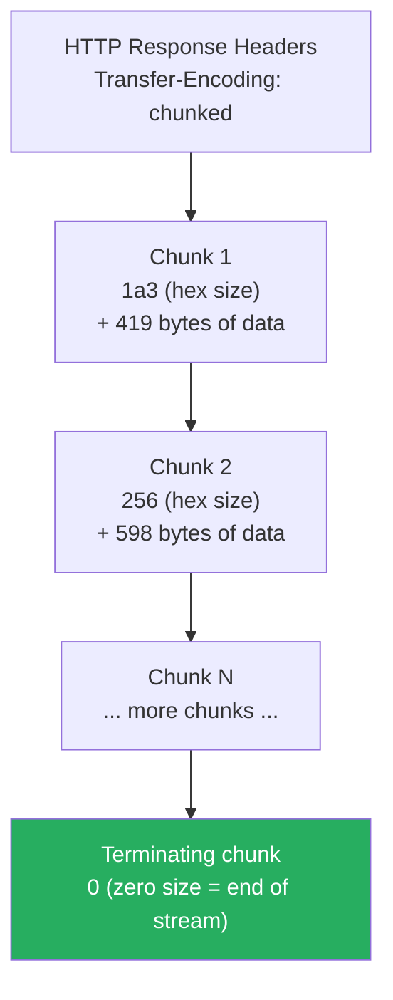

# 92 · Streaming & Chunked Transfer

> **Streaming is the technique of sending a response to the client incrementally, as it becomes available, rather than waiting for the complete response before sending anything. This is the mechanism underlying React Server Components' progressive rendering, Suspense-driven loading states, and Next.js's ability to show a page shell before all data has loaded. Understanding streaming at the HTTP protocol level — chunked transfer encoding, backpressure, and the ReadableStream API — demystifies how "the page appears before the data is fully loaded" actually works under the hood.**

Streaming isn't a React-specific innovation — it's a decades-old HTTP capability (chunked transfer encoding dates to HTTP/1.1) that React 18's architecture finally exploited at the framework level. Understanding the underlying protocol mechanics clarifies what's actually happening when you see a Suspense boundary resolve, why streaming SSR requires specific server infrastructure, and how to debug streaming issues that manifest as "the page hangs" or "content appears out of order."

---

## Table of Contents

- [What Streaming Solves](#what-streaming-solves)
- [HTTP Chunked Transfer Encoding](#http-chunked-transfer-encoding)
- [The ReadableStream Web API](#the-readablestream-web-api)
- [Backpressure: The Critical Streaming Concept](#backpressure-the-critical-streaming-concept)
- [How React Server Components Use Streaming](#how-react-server-components-use-streaming)
- [Suspense Boundaries as Stream Chunk Boundaries](#suspense-boundaries-as-stream-chunk-boundaries)
- [Out-of-Order Streaming](#out-of-order-streaming)
- [Streaming in Next.js Route Handlers](#streaming-in-nextjs-route-handlers)
- [Server-Sent Events: A Streaming Application](#server-sent-events-a-streaming-application)
- [Streaming AI/LLM Responses](#streaming-aillm-responses)
- [Infrastructure Requirements for Streaming](#infrastructure-requirements-for-streaming)
- [Debugging Streaming Issues](#debugging-streaming-issues)
- [Architecture Diagrams](#architecture-diagrams)
- [Good Practices](#good-practices)
- [Bad Practices](#bad-practices)
- [Mental Model](#mental-model)
- [Common Misconceptions](#common-misconceptions)
- [Exercises](#exercises)
- [Further Reading](#further-reading)

---

## What Streaming Solves

```
WITHOUT STREAMING (traditional request/response):
  Client sends request
  Server processes EVERYTHING (queries database, renders full page)
  Server sends ENTIRE response in one piece
  Client receives and processes the complete response

  Time to first byte = time for the SLOWEST part of processing
  If one database query takes 3 seconds, the user sees NOTHING
  for 3 seconds, even if 95% of the page's content was ready
  in 100ms.

WITH STREAMING:
  Client sends request
  Server sends WHATEVER IS READY immediately (page shell, fast content)
  Server CONTINUES processing slower parts
  Server sends ADDITIONAL chunks as they become ready
  Client renders EACH CHUNK as it arrives

  Time to first byte = time for the FASTEST meaningful content
  The user sees the page shell and fast content almost immediately,
  with slower sections (comments, recommendations, etc.) filling in
  progressively.
```

---

## HTTP Chunked Transfer Encoding

The underlying HTTP mechanism that makes streaming possible:

```
NORMAL HTTP RESPONSE (Content-Length known upfront):
  HTTP/1.1 200 OK
  Content-Type: text/html
  Content-Length: 1523        ← exact byte count, known before sending

  <!DOCTYPE html>...(1523 bytes total)...

  The client knows EXACTLY how many bytes to expect and can wait
  for the complete response.

CHUNKED TRANSFER ENCODING (length not known upfront):
  HTTP/1.1 200 OK
  Content-Type: text/html
  Transfer-Encoding: chunked   ← signals: chunks follow, total
                                  length unknown in advance

  1a3                          ← chunk size in HEX (419 bytes)
  <!DOCTYPE html><html>...     ← chunk 1 content

  256                          ← next chunk size in HEX
  <div id="root">...           ← chunk 2 content

  0                             ← zero-size chunk signals END of stream

Each chunk is prefixed with its size (in hexadecimal) followed by
CRLF, then the chunk's actual bytes, then another CRLF. A
zero-length chunk signals the end of the response body.

THIS IS WHY: streaming responses use Transfer-Encoding: chunked
instead of Content-Length — the server genuinely doesn't know the
total response size upfront, because later chunks depend on
still-pending async work (database queries, API calls).
```

---

## The ReadableStream Web API

The JavaScript-level abstraction for working with streamed data, used both in browsers (fetch responses) and in server runtimes (Next.js Route Handlers, React's streaming renderer):

```js
// Creating a ReadableStream manually:
const stream = new ReadableStream({
  start(controller) {
    // Called immediately when the stream is created
    controller.enqueue("First chunk\n");
  },
  pull(controller) {
    // Called when the consumer is ready for MORE data
    // (this is where backpressure-aware data production happens)
    fetchNextChunk().then((chunk) => {
      if (chunk === null) {
        controller.close(); // no more data
      } else {
        controller.enqueue(chunk);
      }
    });
  },
  cancel(reason) {
    // Called if the consumer stops reading (e.g., user navigates away)
    cleanupResources();
  },
});

// Consuming a ReadableStream:
const reader = stream.getReader();
while (true) {
  const { done, value } = await reader.read();
  if (done) break;
  console.log("Received chunk:", value);
}
```

```js
// Real-world example: consuming a streamed fetch response
const response = await fetch("/api/stream-data");
const reader = response.body.getReader();
const decoder = new TextDecoder();

while (true) {
  const { done, value } = await reader.read();
  if (done) break;
  const text = decoder.decode(value, { stream: true });
  console.log("Chunk:", text);
}
```

---

## Backpressure: The Critical Streaming Concept

Backpressure is the mechanism that prevents a fast producer from overwhelming a slow consumer:

```
THE PROBLEM WITHOUT BACKPRESSURE:
  A server generating data FASTER than the client (or network) can
  consume it would need to buffer unlimited amounts of unsent data
  in memory — a potential memory exhaustion vulnerability/bug.

HOW BACKPRESSURE WORKS:
  The ReadableStream's `pull()` callback is only invoked when the
  INTERNAL QUEUE has room (controlled by a configurable "highWaterMark").
  If the consumer is reading slowly, `pull()` is called LESS OFTEN,
  naturally slowing down production to match consumption speed.

  This creates a feedback loop: slow consumer → less frequent pull()
  calls → producer naturally throttles → memory usage stays bounded.

CONFIGURING THE QUEUE SIZE:
  const stream = new ReadableStream({
    pull(controller) { /* ... */ },
  }, {
    highWaterMark: 10, // internal queue can hold up to 10 chunks
                        // before pull() stops being called
  });

PRACTICAL RELEVANCE FOR SERVER-SIDE STREAMING:
  When streaming a large response (e.g., a big CSV export, or React's
  SSR output), the underlying stream implementation handles backpressure
  automatically — if the CLIENT's network connection is slow, the
  SERVER's rendering/data-fetching work is naturally throttled to
  match, rather than buffering an ever-growing queue of unsent HTML
  in server memory.
```

---

## How React Server Components Use Streaming

React's server renderer (`renderToReadableStream` in React 18+) produces a `ReadableStream` of HTML, allowing the server to send content as React generates it:

```js
// Simplified illustration of what Next.js does internally:
import { renderToReadableStream } from "react-dom/server";

async function handleRequest(request) {
  const stream = await renderToReadableStream(<App />, {
    bootstrapScripts: ["/main.js"],
  });

  return new Response(stream, {
    headers: { "Content-Type": "text/html" },
  });
}
```

```
WHAT HAPPENS DURING renderToReadableStream:

1. React starts rendering the component tree TOP-DOWN.
2. For SYNCHRONOUS content (no async data dependencies): React
   renders it immediately and the HTML is added to the stream.
3. When React encounters a SUSPENSE BOUNDARY wrapping an async
   Server Component (one that does `await fetch(...)`):
   - React renders the FALLBACK content (e.g., a loading skeleton)
     and INCLUDES it in the stream immediately
   - React CONTINUES rendering the REST of the page (siblings,
     other branches) without waiting for this async component
   - When the async component's data eventually resolves, React
     renders the REAL content and sends it as an ADDITIONAL chunk,
     along with a small inline <script> that tells the browser to
     SWAP the fallback content for the real content in the DOM

4. The stream closes when ALL Suspense boundaries have resolved
   (or errored).

THIS IS WHY: the page's HTML structure includes both the fallback
markup AND (later in the stream) the real content, plus small
"swap" scripts — visible if you view-source on a streaming SSR
page during a slow data fetch, or inspect the raw network response
in DevTools.
```

---

## Suspense Boundaries as Stream Chunk Boundaries

```tsx
// app/page.tsx
export default function Page() {
  return (
    <div>
      <Header /> {/* renders immediately */}
      <Suspense fallback={<SidebarSkeleton />}>
        <Sidebar /> {/* may be slow — own chunk */}
      </Suspense>
      <Suspense fallback={<FeedSkeleton />}>
        <Feed /> {/* may be slow — own chunk */}
      </Suspense>
      <Footer /> {/* renders immediately */}
    </div>
  );
}
```

```
STREAMING TIMELINE for this page:

t=0ms:    Stream begins. Header, SidebarSkeleton, FeedSkeleton,
          and Footer are ALL sent immediately (the synchronous
          shell of the page, including BOTH fallbacks).
          → Browser can show a complete, if partial, page layout
          → This is what produces a fast First Contentful Paint

t=200ms:  Sidebar's data resolves. React sends an additional chunk:
          the real Sidebar HTML + a tiny script that replaces
          SidebarSkeleton with the real content in the DOM.
          → Browser swaps content; layout shifts minimally
          (if the skeleton was sized correctly)

t=800ms:  Feed's data resolves. Same process: real Feed HTML +
          swap script sent as another chunk.
          → Stream closes (all Suspense boundaries resolved)

THE KEY INSIGHT: each Suspense boundary becomes an INDEPENDENT
unit of streaming — its fallback ships immediately, its real
content ships whenever ITS OWN data dependency resolves, completely
independently of OTHER Suspense boundaries' timing.
```

---

## Out-of-Order Streaming

A subtlety worth understanding: chunks don't necessarily arrive in DOCUMENT ORDER — they arrive in COMPLETION ORDER:

```
If Feed's data resolves BEFORE Sidebar's data (even though Feed
appears LATER in the JSX tree), React streams Feed's real content
FIRST, then Sidebar's real content when it's ready.

This works correctly because each streamed chunk includes a SCRIPT
that knows WHICH DOM element to target for the swap (using a unique
ID assigned to each Suspense boundary's fallback) — the swap doesn't
rely on chunks arriving in any particular order; each chunk is
self-describing about where it belongs.

This out-of-order capability is what allows React to show the
FASTEST content first, regardless of its position in the component
tree — a slow header and a fast footer: the footer's real content
can appear before the header's, if the footer's data resolves first.
```

---

## Streaming in Next.js Route Handlers

Beyond RSC's automatic streaming, you can manually stream responses from Route Handlers:

```tsx
// app/api/export/route.ts — streaming a large CSV export
export async function GET() {
  const encoder = new TextEncoder();

  const stream = new ReadableStream({
    async start(controller) {
      controller.enqueue(encoder.encode("id,name,email\n")); // header row

      let cursor = null;
      let hasMore = true;

      while (hasMore) {
        const { rows, nextCursor } = await db.users.findMany({
          take: 1000,
          cursor,
        });

        for (const row of rows) {
          const line = `${row.id},${row.name},${row.email}\n`;
          controller.enqueue(encoder.encode(line));
        }

        cursor = nextCursor;
        hasMore = rows.length === 1000;
      }

      controller.close();
    },
  });

  return new Response(stream, {
    headers: {
      "Content-Type": "text/csv",
      "Content-Disposition": 'attachment; filename="export.csv"',
    },
  });
}
```

```
WHY STREAM A CSV EXPORT:
  Without streaming: the server must load ALL rows into memory,
  build the COMPLETE CSV string, THEN send it — for a million-row
  export, this could mean hundreds of megabytes held in server
  memory, plus the user waiting for the ENTIRE export to be
  generated before seeing ANY progress.

  With streaming: rows are fetched and sent in batches, memory
  usage stays bounded (only ~1000 rows in memory at a time), and
  the browser can start DOWNLOADING the file (showing download
  progress) before the server has finished generating later rows.
```

---

## Server-Sent Events: A Streaming Application

Server-Sent Events (SSE) is a specific streaming protocol built on top of chunked HTTP responses, designed for server-to-client push notifications:

```tsx
// app/api/notifications/route.ts
export async function GET() {
  const encoder = new TextEncoder();

  const stream = new ReadableStream({
    async start(controller) {
      const sendEvent = (data: object) => {
        controller.enqueue(encoder.encode(`data: ${JSON.stringify(data)}\n\n`));
      };

      // Send an initial event:
      sendEvent({ type: "connected", timestamp: Date.now() });

      // Subscribe to a notification source (pub/sub, database listener, etc.)
      const unsubscribe = notificationBus.subscribe((notification) => {
        sendEvent({ type: "notification", payload: notification });
      });

      // Cleanup when the client disconnects:
      // (Route Handler's request signal can be checked, or rely on
      // the ReadableStream's cancel() callback)
    },
    cancel() {
      // unsubscribe(); // clean up when client closes the connection
    },
  });

  return new Response(stream, {
    headers: {
      "Content-Type": "text/event-stream",
      "Cache-Control": "no-cache",
      Connection: "keep-alive",
    },
  });
}
```

```tsx
// Client-side consumption with the native EventSource API:
"use client";
useEffect(() => {
  const eventSource = new EventSource("/api/notifications");

  eventSource.onmessage = (event) => {
    const data = JSON.parse(event.data);
    console.log("Received:", data);
  };

  return () => eventSource.close();
}, []);
```

---

## Streaming AI/LLM Responses

A particularly common modern streaming use case — displaying AI-generated text token-by-token as it's produced:

```tsx
// app/api/chat/route.ts
export async function POST(request: Request) {
  const { messages } = await request.json();

  const encoder = new TextEncoder();
  const llmStream = await callLLMProvider({ messages, stream: true });

  const stream = new ReadableStream({
    async start(controller) {
      for await (const chunk of llmStream) {
        const text = chunk.choices[0]?.delta?.content ?? "";
        if (text) {
          controller.enqueue(encoder.encode(text));
        }
      }
      controller.close();
    },
  });

  return new Response(stream, {
    headers: { "Content-Type": "text/plain; charset=utf-8" },
  });
}
```

```tsx
// Client: consume the stream and update UI progressively
"use client";
async function streamChat(message: string) {
  const response = await fetch("/api/chat", {
    method: "POST",
    body: JSON.stringify({ messages: [{ role: "user", content: message }] }),
  });

  const reader = response.body!.getReader();
  const decoder = new TextDecoder();
  let fullText = "";

  while (true) {
    const { done, value } = await reader.read();
    if (done) break;
    fullText += decoder.decode(value, { stream: true });
    setDisplayedText(fullText); // update UI with each chunk
  }
}
```

---

## Infrastructure Requirements for Streaming

```
STREAMING REQUIRES INFRASTRUCTURE SUPPORT AT EVERY LAYER:

✅ The application server must support streaming responses
   (Next.js's App Router does, via Web Streams API)

✅ The hosting platform must not BUFFER the entire response before
   forwarding it (some serverless platforms historically buffered
   responses, defeating streaming — verify your platform's behavior)

✅ Any REVERSE PROXY or CDN in front of your app must support
   streaming pass-through (most modern CDNs do, but older or
   misconfigured proxies can buffer responses)

✅ The PROTOCOL must support chunked transfer (HTTP/1.1+; this is
   not an issue for any modern deployment)

COMMON PITFALL: deploying to a serverless function platform with
a STRICT execution time limit AND response buffering can mean a
slow-but-streaming response gets KILLED by the platform's timeout
before all chunks are sent — even though the TOTAL data sent was
small, because the FUNCTION DURATION (not response size) hit the
limit while waiting for slow upstream data.

VERCEL-SPECIFIC NOTE: Vercel's infrastructure is built to support
streaming for Next.js's App Router natively — this is one of the
specific advantages of using Vercel's platform for Next.js apps
(though self-hosted Node.js servers and other platforms can support
streaming correctly too, with proper configuration).
```

---

## Debugging Streaming Issues

```
SYMPTOM: page appears to "hang" with a blank screen, then suddenly
shows everything at once (no progressive rendering)
LIKELY CAUSE: response buffering somewhere in the infrastructure
chain — check reverse proxy configuration, hosting platform's
buffering behavior

SYMPTOM: Suspense fallback never resolves, stays as loading
skeleton forever
LIKELY CAUSE: the async Server Component's promise never resolves
(check for unhandled errors, infinite awaiting, missing error
boundaries that should catch and convert the error to a fallback UI)

SYMPTOM: content flashes/flickers when swapping from fallback to
real content
LIKELY CAUSE: fallback skeleton dimensions don't match real content
dimensions, causing layout shift during the swap — size skeletons
to match expected real content dimensions

DEBUGGING TOOL: Chrome DevTools' Network tab, click on the document
request, view the "Timing" tab — for a streaming response, you'll
see data arriving in multiple "chunks" over time rather than one
instantaneous transfer. The "Response" tab shows the FULL final
content, but the Timing/waterfall view reveals the progressive
arrival pattern.
```

---

## Architecture Diagrams

### Streaming SSR timeline with Suspense boundaries



### Chunked transfer encoding format



---

## Good Practices

### ✅ Good Practice — Properly sized Suspense fallbacks to prevent layout shift during streaming

```tsx
/**
 * Good: Skeleton components sized to match their real content's
 * expected dimensions, minimizing layout shift when streaming
 * swaps fallback for real content.
 */

function SidebarSkeleton() {
  return (
    <div className="sidebar" style={{ width: 280 }}>
      {/* Match the real Sidebar's approximate height and structure */}
      <div className="skeleton-avatar" style={{ height: 48, width: 48 }} />
      <div className="skeleton-line" style={{ height: 16, width: "80%" }} />
      <div className="skeleton-line" style={{ height: 16, width: "60%" }} />
      {Array.from({ length: 5 }).map((_, i) => (
        <div key={i} className="skeleton-item" style={{ height: 40 }} />
      ))}
    </div>
  );
}

export default function DashboardPage() {
  return (
    <div className="dashboard">
      <Header />
      <Suspense fallback={<SidebarSkeleton />}>
        <Sidebar /> {/* same approximate dimensions as the skeleton */}
      </Suspense>
      <Suspense fallback={<FeedSkeleton />}>
        <Feed />
      </Suspense>
    </div>
  );
}
```

---

## Bad Practices

### ⚠️ Bad Practice — Loading all data before rendering, defeating streaming's purpose

```tsx
/**
 * Bad: Awaiting ALL data at the top of the page component before
 * rendering anything — even though Suspense boundaries are
 * technically present elsewhere, this pattern defeats streaming
 * because the AWAIT blocks the entire render from starting.
 */

// ❌ Awaiting everything upfront defeats streaming
export default async function DashboardPage() {
  const [user, sidebar, feed, recommendations] = await Promise.all([
    fetchUser(),
    fetchSidebarData(), // slow: 800ms
    fetchFeedData(), // slow: 1200ms
    fetchRecommendations(), // slow: 2000ms
  ]);
  // The ENTIRE component waits for the SLOWEST fetch (2000ms)
  // before ANY HTML is sent — no progressive rendering occurs,
  // even though the page COULD have shown the user info and
  // sidebar much earlier.

  return (
    <div>
      <Header user={user} />
      <Sidebar data={sidebar} />
      <Feed data={feed} />
      <Recommendations data={recommendations} />
    </div>
  );
}

/**
 * ✅ Fix: push each async fetch DOWN into its own component,
 * wrapped in its own Suspense boundary — each component awaits
 * ONLY its own data, allowing independent streaming
 */
export default function DashboardPage() {
  return (
    <div>
      <Suspense fallback={<HeaderSkeleton />}>
        <HeaderWithUser /> {/* awaits fetchUser() internally */}
      </Suspense>
      <Suspense fallback={<SidebarSkeleton />}>
        <SidebarWithData /> {/* awaits fetchSidebarData() internally */}
      </Suspense>
      <Suspense fallback={<FeedSkeleton />}>
        <FeedWithData /> {/* awaits fetchFeedData() internally */}
      </Suspense>
      <Suspense fallback={<RecommendationsSkeleton />}>
        <RecommendationsWithData />{" "}
        {/* awaits fetchRecommendations() internally */}
      </Suspense>
    </div>
  );
}

async function HeaderWithUser() {
  const user = await fetchUser(); // fast — resolves first, streams first
  return <Header user={user} />;
}
// ... similar pattern for the other components
```

---

## Mental Model

> 💡 **The streaming mental model:**
>
> Think of a non-streaming response as a **restaurant that won't bring out ANY dish until the entire meal — appetizer, main course, dessert — is fully prepared**, even if the appetizer has been ready for ten minutes. You sit at an empty table, watching nothing happen, until everything arrives simultaneously. Streaming is the restaurant bringing each dish **as soon as it's ready** — the appetizer arrives first (fast content), giving you something to engage with while the kitchen works on the main course (slower data). The chunked transfer encoding is the literal serving mechanism: each course is a "chunk," brought out individually, with a final "that's everything" signal (the empty chunk) when the meal is complete. Suspense boundaries are like ordering EACH course separately and clearly marking "this is the soup, this is the salad" — so the waiter (the browser) knows exactly which empty place setting (DOM element) each dish belongs to, even if they don't arrive in the order you'd naturally expect.

---

## Common Misconceptions

### "Streaming means the response is sent faster overall"

Streaming doesn't necessarily reduce the TOTAL TIME for all content to arrive — the slowest piece of data still takes just as long. What streaming improves is PERCEIVED performance: the user sees USEFUL content much sooner (Time to First Byte / First Contentful Paint), even though Time to Full Load may be similar.

### "Any async Server Component automatically streams"

Streaming requires an explicit Suspense boundary wrapping the async component (or React's automatic boundary insertion at certain points). An async Server Component WITHOUT a Suspense boundary ancestor will BLOCK the entire page's initial HTML until it resolves — exactly the "bad practice" pattern shown above.

### "Chunked transfer encoding and streaming are React-specific concepts"

Chunked transfer encoding is a fundamental HTTP/1.1 protocol feature dating to 1997, used for decades by various technologies (long-running API responses, file downloads, video streaming) before React Server Components used it for progressive HTML rendering. React applies an existing protocol capability to a new use case.

### "Streaming always improves user experience"

For PAGES where ALL content is needed before the page is "useful" (most content depends on the same fast data source), streaming's benefit is minimal, and the added complexity (Suspense boundary placement, skeleton design) may not be worth it. Streaming shines specifically when SOME content is fast and OTHER content is meaningfully slower.

### "SSE (Server-Sent Events) and WebSockets are the same thing"

Both enable server-to-client push, but SSE is UNIDIRECTIONAL (server → client only, built on plain HTTP, simpler to implement) while WebSockets are BIDIRECTIONAL (full duplex, requires protocol upgrade, more complex but supports client → server push too). Choose based on whether you need bidirectional communication.

---

## Exercises

### Exercise 1 — Observe streaming in the Network tab

1. Build (or find) a Next.js page with a slow Suspense-wrapped Server Component (add an artificial `await new Promise(r => setTimeout(r, 3000))`)
2. Open Chrome DevTools → Network tab, reload the page
3. Click the document request, view the Timing tab — observe the response arriving in multiple chunks over time
4. Compare to the same page WITHOUT the Suspense boundary (awaited at the top level instead)

### Exercise 2 — Build a streaming CSV export endpoint

Implement a Route Handler that:

1. Streams a large dataset (simulate with 10,000 generated rows) as CSV
2. Uses a `ReadableStream` with batched database-like fetches (simulate with `setTimeout`)
3. Verify via DevTools that the response downloads progressively, not all at once

### Exercise 3 — Implement and consume Server-Sent Events

Build a simple SSE endpoint that sends a counter update every second, and a client component that displays the live-updating counter using `EventSource`. Verify the connection persists and properly cleans up when the component unmounts.

---

## Further Reading

- [MDN: Streams API](https://developer.mozilla.org/en-US/docs/Web/API/Streams_API) — the ReadableStream/WritableStream web standard
- [MDN: Using HTTP chunked encoding](https://developer.mozilla.org/en-US/docs/Web/HTTP/Headers/Transfer-Encoding) — protocol-level reference
- [React docs: renderToReadableStream](https://react.dev/reference/react-dom/server/renderToReadableStream) — the API powering streaming SSR
- [MDN: Server-Sent Events](https://developer.mozilla.org/en-US/docs/Web/API/Server-sent_events) — SSE specification and usage
- [web.dev: Streams — The definitive guide](https://web.dev/articles/streams) — comprehensive Streams API guide
- Related in this handbook: [03 · Streaming](../server-components/03-streaming.md), [Part XI: Rendering Strategies](../nextjs-rendering/01-hydration.md)
- Next in this handbook: [93 · WebSocket & SSE](./03-websocket-sse.md)

---

_Part of the [React + Next.js Engineering Handbook](../../README.md)_
