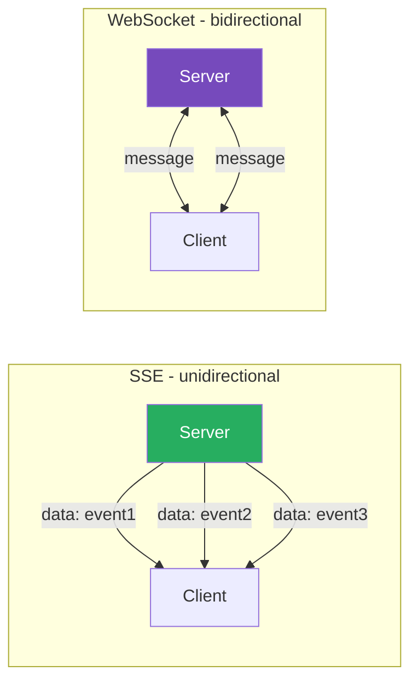
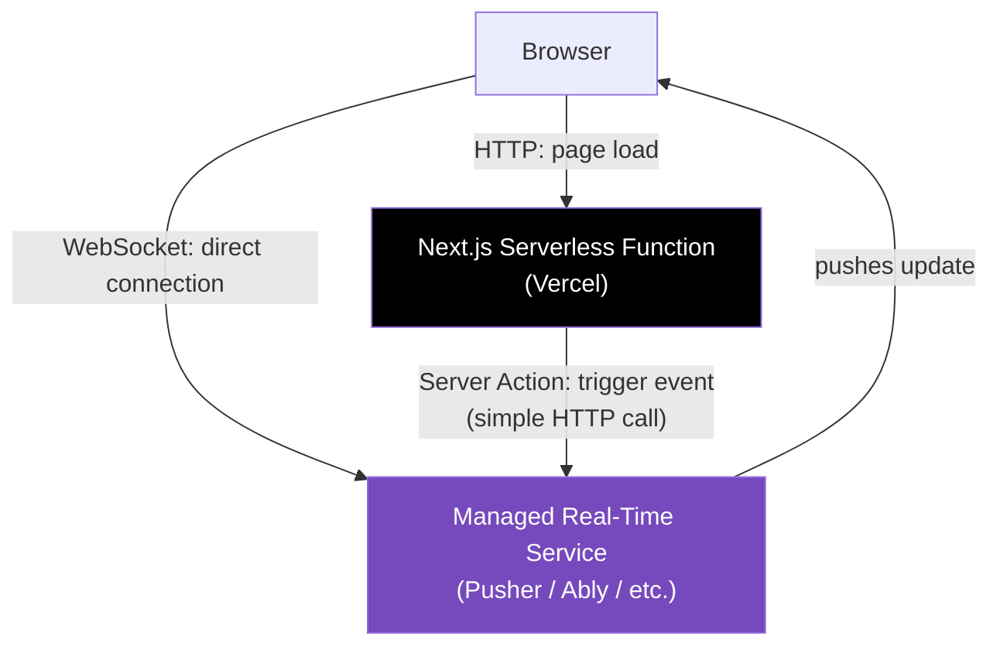

# 93 · WebSocket & SSE

> **WebSocket and Server-Sent Events (SSE) are the two primary mechanisms for real-time, server-initiated communication in web applications — solving the fundamental limitation that plain HTTP is request-initiated only (the server can't "push" data to a client without the client first asking). They serve overlapping but distinct use cases: SSE for one-directional server-to-client streams (notifications, live feeds, AI token streaming), WebSocket for genuine bidirectional, low-latency communication (chat, collaborative editing, multiplayer features). Understanding their protocol-level differences — not just their APIs — clarifies which to reach for, and reveals the specific architectural challenges of using either with Next.js's serverless-first deployment model.**

The choice between WebSocket and SSE (or neither, and just using polling) is one of the most consequential real-time architecture decisions in a Next.js application, because it interacts directly with deployment model constraints: serverless functions have execution time limits and don't maintain persistent connections well, which pushes real-time Next.js applications toward specific architectural patterns that differ from a traditional always-on Node.js server.

---

## Table of Contents

- [The Fundamental Limitation of HTTP](#the-fundamental-limitation-of-http)
- [Server-Sent Events: Protocol and API](#server-sent-events-protocol-and-api)
- [WebSocket: Protocol and API](#websocket-protocol-and-api)
- [The WebSocket Handshake](#the-websocket-handshake)
- [SSE vs WebSocket: Feature Comparison](#sse-vs-websocket-feature-comparison)
- [WebSocket in Next.js: The Serverless Challenge](#websocket-in-nextjs-the-serverless-challenge)
- [Architectural Patterns for Real-Time in Next.js](#architectural-patterns-for-real-time-in-nextjs)
- [Using a Managed WebSocket Service](#using-a-managed-websocket-service)
- [Reconnection Strategies](#reconnection-strategies)
- [Authentication for Persistent Connections](#authentication-for-persistent-connections)
- [Scaling WebSocket Connections](#scaling-websocket-connections)
- [Polling as a Fallback Strategy](#polling-as-a-fallback-strategy)
- [Architecture Diagrams](#architecture-diagrams)
- [Good Practices](#good-practices)
- [Bad Practices](#bad-practices)
- [Mental Model](#mental-model)
- [Common Misconceptions](#common-misconceptions)
- [Exercises](#exercises)
- [Further Reading](#further-reading)

---

## The Fundamental Limitation of HTTP

```
HTTP's REQUEST-RESPONSE MODEL:
  Client sends a request → Server sends ONE response → connection
  (in HTTP/1.1 keep-alive) MAY persist for FUTURE requests, but
  the SERVER CANNOT INITIATE sending data — it can only RESPOND
  to requests the client makes.

THIS CREATES A PROBLEM FOR:
  - Chat applications (need to receive messages from OTHER users
    without polling)
  - Live notifications (a new order arrived — tell the dashboard NOW)
  - Collaborative editing (another user's cursor moved — show it
    immediately)
  - Live sports scores, stock tickers, any "push" use case

THE HISTORICAL WORKAROUNDS (largely obsolete, but informative):
  Polling: client requests "anything new?" every N seconds
    → wasteful (most requests return "nothing new"), and adds
      latency up to N seconds for genuinely new data

  Long polling: client makes a request, server HOLDS it open
    until there's data to send (or a timeout), then immediately
    re-requests
    → reduces wasted requests vs naive polling, but still has
      connection overhead per "long poll" cycle, and doesn't
      truly solve bidirectional low-latency communication

  These are why WebSocket and SSE were standardized — purpose-built
  solutions rather than workarounds.
```

---

## Server-Sent Events: Protocol and API

SSE is built ENTIRELY on top of standard HTTP — it's a STREAMING HTTP RESPONSE with a specific text format, consumed via a dedicated browser API:

```
THE WIRE FORMAT (text/event-stream):
  data: {"type": "notification", "message": "New order #1234"}
                                                                  ← blank line ends an event
  data: {"type": "notification", "message": "New order #1235"}

  event: heartbeat
  data: ping
                                                                  ← blank line ends an event

  id: 42
  data: {"type": "update", "value": 100}
                                                                  ← blank line ends an event

FIELDS:
  data:  the event payload (required; can span multiple lines)
  event: a custom event name (optional; defaults to "message")
  id:    an event ID, used for automatic reconnection resume (optional)
  retry: reconnection delay in ms, sent by server to configure client (optional)
```

```js
// Client-side: the native EventSource API
const eventSource = new EventSource("/api/events");

// Listen for the default "message" event (data: lines without explicit event:)
eventSource.onmessage = (event) => {
  const data = JSON.parse(event.data);
  console.log("Received:", data);
};

// Listen for a CUSTOM named event:
eventSource.addEventListener("heartbeat", (event) => {
  console.log("Heartbeat:", event.data);
});

eventSource.onerror = (error) => {
  console.error("SSE error:", error);
  // EventSource AUTOMATICALLY reconnects on error by default —
  // no manual reconnection logic needed for basic cases
};

eventSource.close(); // manually close when no longer needed
```

### SSE's Built-In Automatic Reconnection

```
CRITICAL BUILT-IN FEATURE: EventSource automatically reconnects
if the connection drops (network blip, server restart), WITHOUT
any application code needed.

The reconnection delay is configurable via the server-sent `retry:`
field. The browser also tracks the LAST RECEIVED event's `id:` field
and sends it back as a `Last-Event-ID` header on reconnection,
allowing the server to RESUME the stream from where it left off
(if the server implements this resume logic).

This automatic reconnection is a SIGNIFICANT advantage over raw
WebSocket, which requires you to implement reconnection logic
yourself entirely.
```

---

## WebSocket: Protocol and API

WebSocket is a SEPARATE PROTOCOL (not HTTP, though it STARTS as an HTTP request that gets "upgraded"), providing full-duplex (bidirectional, simultaneous) communication:

```js
// Client-side: the native WebSocket API
const ws = new WebSocket("wss://example.com/socket");

ws.onopen = () => {
  console.log("Connection established");
  ws.send(JSON.stringify({ type: "subscribe", channel: "orders" }));
};

ws.onmessage = (event) => {
  const data = JSON.parse(event.data);
  console.log("Received:", data);
};

ws.onerror = (error) => {
  console.error("WebSocket error:", error);
};

ws.onclose = (event) => {
  console.log("Connection closed:", event.code, event.reason);
  // NO automatic reconnection — must be implemented manually
};

// Sending data FROM the client TO the server (SSE cannot do this):
ws.send(JSON.stringify({ type: "chat-message", text: "Hello!" }));

ws.close(); // manually close
```

---

## The WebSocket Handshake

```
WebSocket connections START as an HTTP request with special headers,
then UPGRADE to the WebSocket protocol:

CLIENT REQUEST:
  GET /socket HTTP/1.1
  Host: example.com
  Upgrade: websocket              ← signals: I want to upgrade
  Connection: Upgrade
  Sec-WebSocket-Key: dGhlIHNhbXBsZSBub25jZQ==  ← random value for handshake validation
  Sec-WebSocket-Version: 13

SERVER RESPONSE (if it accepts the upgrade):
  HTTP/1.1 101 Switching Protocols
  Upgrade: websocket
  Connection: Upgrade
  Sec-WebSocket-Accept: s3pPLMBiTxaQ9kYGzzhZRbK+xOo=  ← derived from the client's key

AFTER THIS HANDSHAKE:
  The underlying TCP connection is REPURPOSED entirely for the
  WebSocket protocol — no more HTTP request/response semantics
  apply. Both client and server can send "frames" (WebSocket's
  message unit) AT ANY TIME, in EITHER DIRECTION, without waiting
  for a request.

THIS IS WHY: WebSocket requires the underlying connection to be
LONG-LIVED and STATEFUL — fundamentally different from HTTP's
typically short-lived, stateless request/response cycles, and
this is exactly what creates friction with serverless deployment
models (see below).
```

---

## SSE vs WebSocket: Feature Comparison

```
                          SSE                    WebSocket
Direction:                Server → Client only    Bidirectional

Protocol:                 Plain HTTP              Separate protocol
                          (text/event-stream)      (ws:// or wss://)

Automatic reconnection:   ✅ Built-in              ❌ Manual implementation
                                                    required

Binary data:               ❌ Text only             ✅ Supports binary frames

Browser connection limit:  ⚠️ Subject to HTTP/1.1   ✅ Not subject to the
                           per-origin connection     same limit (separate
                           limits (6 per origin)     protocol)
                           — HTTP/2 multiplexing
                           mitigates this

Proxy/firewall             ✅ Generally easier       ⚠️ Some older proxies/
compatibility:             (it's just HTTP)          firewalls block WebSocket
                                                       upgrade requests

Server complexity:         Lower (just stream         Higher (need a WebSocket
                           text over HTTP)             server/library, manage
                                                        connection state)

Use case fit:              Notifications, live feeds, Chat, collaborative
                           AI token streaming,         editing, multiplayer
                           dashboards, one-way push    games, anything needing
                                                        low-latency client→server
```

---

## WebSocket in Next.js: The Serverless Challenge

```
THE CORE PROBLEM:
  Next.js's App Router (and Vercel's deployment model) is built
  around SERVERLESS FUNCTIONS — each request invokes a function
  instance that runs for a BOUNDED time and then terminates.

  WebSocket connections are LONG-LIVED and STATEFUL — they need
  a server process that STAYS RUNNING for the connection's entire
  duration (potentially hours), which is FUNDAMENTALLY INCOMPATIBLE
  with the "spin up, handle one request, spin down" serverless model.

  Next.js Route Handlers (API routes) CANNOT natively host a
  WebSocket SERVER in the standard Vercel serverless deployment —
  there's no persistent process to maintain the open socket.

THE PRACTICAL IMPLICATIONS:
  For WebSocket functionality in a Next.js + Vercel deployment,
  you generally need EITHER:

  1. A SEPARATE, dedicated WebSocket server (a traditional
     always-on Node.js process, deployed separately from your
     Next.js serverless functions — e.g., on a VPS, a container
     platform, or a different hosting service)

  2. A MANAGED WebSocket/real-time service (Pusher, Ably, Supabase
     Realtime, PartyKit, or similar) that handles the persistent
     connection infrastructure for you, while your Next.js app
     just publishes/subscribes to events via their SDK

  3. Self-hosting Next.js on a TRADITIONAL SERVER (not serverless) —
     e.g., a custom Node.js server using `next()` programmatically,
     deployed to a VPS or container where you control the long-running
     process — this DOES allow co-locating a WebSocket server with
     your Next.js app, at the cost of losing some serverless benefits
     (auto-scaling, pay-per-request pricing)

SSE DOES NOT HAVE THIS PROBLEM TO THE SAME DEGREE:
  SSE responses, while long-lived, are STILL fundamentally HTTP
  responses — many serverless platforms (including Vercel, with
  appropriate function configuration) CAN stream a long-lived SSE
  response from within a serverless function execution, though
  there are still EXECUTION TIME LIMITS to be aware of (a serverless
  function has a MAXIMUM duration; an SSE connection open longer
  than that limit will be forcibly terminated).
```

---

## Architectural Patterns for Real-Time in Next.js

```
PATTERN 1: SSE from a Route Handler (works within serverless limits
for moderate-duration streams)
  Good for: notifications, live dashboards with bounded session
  length, AI streaming responses (which naturally complete within
  seconds to a couple minutes)

PATTERN 2: Next.js app + separate WebSocket server
  Your Next.js app (deployed normally, serverless or not) handles
  all the UI/SSR/API routes. A SEPARATE Node.js process (deployed
  to a VPS, Railway, Render, Fly.io, or similar always-on platform)
  runs a WebSocket server (using `ws`, Socket.IO, or similar).
  The browser connects DIRECTLY to the separate WebSocket server's
  URL, while still loading the main app from Next.js.

PATTERN 3: Managed real-time service
  Use Pusher/Ably/Supabase Realtime/PartyKit: your Next.js Server
  Actions or Route Handlers PUBLISH events to the service (a simple
  HTTP call), and the BROWSER subscribes DIRECTLY to the service's
  WebSocket infrastructure (via their client SDK) — you never run
  your own WebSocket server.

PATTERN 4: Self-hosted Next.js with custom server
  // server.js — custom Node.js server hosting Next.js + WebSocket
  const { createServer } = require('http');
  const { parse } = require('url');
  const next = require('next');
  const { WebSocketServer } = require('ws');

  const app = next({ dev: process.env.NODE_ENV !== 'production' });
  const handle = app.getRequestHandler();

  app.prepare().then(() => {
    const server = createServer((req, res) => {
      handle(req, res, parse(req.url, true));
    });

    const wss = new WebSocketServer({ server });
    wss.on('connection', (ws) => {
      ws.on('message', (message) => {
        // broadcast to other connected clients, etc.
      });
    });

    server.listen(3000);
  });
  // Trade-off: loses Vercel's serverless auto-scaling and
  // edge deployment benefits; gains the ability to co-host
  // WebSocket with the Next.js app in one process.
```

---

## Using a Managed WebSocket Service

```tsx
// Example using Pusher (representative of the managed-service pattern)

// Server: Server Action publishes an event
"use server";
import Pusher from "pusher";

const pusher = new Pusher({
  appId: process.env.PUSHER_APP_ID!,
  key: process.env.PUSHER_KEY!,
  secret: process.env.PUSHER_SECRET!,
  cluster: process.env.PUSHER_CLUSTER!,
});

export async function sendChatMessage(channelId: string, message: string) {
  await db.messages.create({ data: { channelId, message } });

  // Publish to Pusher's infrastructure — this is a simple HTTP
  // call, NOT a persistent connection from your serverless function
  await pusher.trigger(`channel-${channelId}`, "new-message", {
    message,
    timestamp: Date.now(),
  });
}

// Client: subscribes DIRECTLY to Pusher's WebSocket infrastructure
("use client");
import PusherClient from "pusher-js";
import { useEffect, useState } from "react";

function ChatRoom({ channelId }: { channelId: string }) {
  const [messages, setMessages] = useState<Message[]>([]);

  useEffect(() => {
    const pusher = new PusherClient(process.env.NEXT_PUBLIC_PUSHER_KEY!, {
      cluster: process.env.NEXT_PUBLIC_PUSHER_CLUSTER!,
    });

    const channel = pusher.subscribe(`channel-${channelId}`);
    channel.bind(
      "new-message",
      (data: { message: string; timestamp: number }) => {
        setMessages((prev) => [...prev, data]);
      },
    );

    return () => {
      pusher.unsubscribe(`channel-${channelId}`);
      pusher.disconnect();
    };
  }, [channelId]);

  return (
    <ul>
      {messages.map((m, i) => (
        <li key={i}>{m.message}</li>
      ))}
    </ul>
  );
}
// Notice: your Next.js serverless functions NEVER hold an open
// connection. They make a quick HTTP call to Pusher's API. Pusher's
// own infrastructure (NOT your Vercel deployment) handles maintaining
// the actual long-lived WebSocket connections to every subscribed
// browser.
```

---

## Reconnection Strategies

```js
// WebSocket: manual reconnection with exponential backoff
class ReconnectingWebSocket {
  private ws: WebSocket | null = null;
  private reconnectAttempts = 0;
  private maxReconnectDelay = 30000;

  constructor(private url: string, private onMessage: (data: any) => void) {
    this.connect();
  }

  private connect() {
    this.ws = new WebSocket(this.url);

    this.ws.onopen = () => {
      this.reconnectAttempts = 0; // reset backoff on successful connection
    };

    this.ws.onmessage = (event) => {
      this.onMessage(JSON.parse(event.data));
    };

    this.ws.onclose = () => {
      this.scheduleReconnect();
    };

    this.ws.onerror = () => {
      this.ws?.close(); // triggers onclose, which schedules reconnect
    };
  }

  private scheduleReconnect() {
    const delay = Math.min(
      1000 * Math.pow(2, this.reconnectAttempts), // exponential backoff
      this.maxReconnectDelay
    );
    this.reconnectAttempts++;

    setTimeout(() => this.connect(), delay);
  }

  send(data: object) {
    if (this.ws?.readyState === WebSocket.OPEN) {
      this.ws.send(JSON.stringify(data));
    }
  }

  close() {
    this.ws?.close();
  }
}
```

```
SSE: EventSource handles basic reconnection automatically, but for
PRODUCTION robustness, you may still want to:
  - Track the last received event ID (EventSource does this
    automatically via Last-Event-ID, IF your server implements
    resume logic using the id: field)
  - Show a "reconnecting..." UI state by listening to onerror
  - Implement a manual maximum-retry-count if indefinite reconnection
    attempts aren't desired
```

---

## Authentication for Persistent Connections

```
WEBSOCKET AUTHENTICATION CHALLENGES:
  The WebSocket handshake is an HTTP request, so STANDARD auth
  headers/cookies CAN be sent during the initial handshake. But:
  - Browsers' native WebSocket API does NOT support setting custom
    headers (a known, long-standing API limitation)
  - Common workarounds: pass an auth TOKEN as a QUERY PARAMETER
    in the WebSocket URL (visible in logs — use short-lived tokens),
    or rely on COOKIES (sent automatically if same-origin, subject
    to SameSite cookie policy considerations)

// Common pattern: short-lived token in the URL
const token = await fetchShortLivedWebSocketToken(); // from your API
const ws = new WebSocket(`wss://realtime.example.com/socket?token=${token}`);

SSE AUTHENTICATION:
  EventSource ALSO doesn't support custom headers natively, but
  SINCE it's same-origin HTTP, COOKIES work automatically
  (no special workaround needed, assuming your auth uses
  cookie-based sessions) — this is a meaningful practical advantage
  of SSE over WebSocket for browser-based auth.
```

---

## Scaling WebSocket Connections

```
THE STATEFUL CONNECTION SCALING PROBLEM:
  Unlike stateless HTTP requests (any server instance can handle
  any request), a WebSocket connection is PINNED to the SPECIFIC
  server instance that accepted it. If you have multiple server
  instances behind a load balancer, a message that needs to reach
  a specific connected client must be routed to the EXACT instance
  holding that client's connection.

COMMON SOLUTIONS:
  1. STICKY SESSIONS (session affinity): load balancer routes the
     SAME client to the SAME server instance for the connection's
     lifetime — simple, but limits horizontal scaling flexibility
     and creates uneven load distribution risk.

  2. PUB/SUB BACKPLANE (Redis Pub/Sub, NATS, etc.): each server
     instance subscribes to a shared message bus. When ANY instance
     needs to send a message to a client, it publishes to the bus;
     the instance ACTUALLY holding that client's connection receives
     the pub/sub message and forwards it to the client over its
     WebSocket. This decouples "which instance has the connection"
     from "which instance needs to send the message."

  3. MANAGED SERVICES (Pusher, Ably, etc.) HANDLE THIS ENTIRELY
     for you — this is one of the primary value propositions of
     using a managed real-time service instead of self-hosting:
     you don't have to solve the connection-scaling problem yourself.
```

---

## Polling as a Fallback Strategy

```
For LOW-FREQUENCY updates where the complexity of WebSocket/SSE
isn't justified, simple polling (with TanStack Query's refetchInterval,
covered in Part XVI) remains a legitimate, simple choice:

const { data } = useQuery({
  queryKey: ['order-status', orderId],
  queryFn: () => fetchOrderStatus(orderId),
  refetchInterval: 5000, // poll every 5 seconds
  refetchIntervalInBackground: false, // pause when tab is hidden
});

WHEN POLLING IS THE RIGHT CHOICE:
  ✅ Updates are infrequent (order status changes a few times total)
  ✅ Sub-second latency isn't required
  ✅ Simplicity is valued over real-time precision
  ✅ You want to avoid the infrastructure complexity of WebSocket/SSE

WHEN POLLING IS THE WRONG CHOICE:
  ❌ High-frequency updates (chat messages, live cursors) — polling
     would need very short intervals, becoming wasteful and laggy
  ❌ True real-time requirements (collaborative editing needs
     sub-100ms latency, which polling cannot achieve efficiently)
```

---

## Architecture Diagrams

### SSE vs WebSocket data flow



### Next.js + managed real-time service architecture



---

## Good Practices

### ✅ Good Practice — SSE for AI streaming, with proper cleanup and error handling

```tsx
/**
 * Good: An SSE-based chat streaming implementation using a Route
 * Handler — appropriate because the connection duration is bounded
 * (a single AI response, typically seconds), works within serverless
 * function time limits, and benefits from SSE's automatic reconnection
 * and same-origin cookie auth.
 */

// app/api/chat/route.ts
export async function POST(request: Request) {
  const session = await getSession();
  if (!session) {
    return new Response("Unauthorized", { status: 401 });
  }

  const { message } = await request.json();
  const encoder = new TextEncoder();

  const stream = new ReadableStream({
    async start(controller) {
      try {
        const llmStream = await callLLM({ message, stream: true });
        for await (const chunk of llmStream) {
          const text = chunk.delta?.content ?? "";
          if (text) {
            controller.enqueue(
              encoder.encode(`data: ${JSON.stringify({ text })}\n\n`),
            );
          }
        }
        controller.enqueue(encoder.encode("data: [DONE]\n\n"));
      } catch (error) {
        controller.enqueue(
          encoder.encode(
            `data: ${JSON.stringify({ error: "Stream failed" })}\n\n`,
          ),
        );
      } finally {
        controller.close();
      }
    },
  });

  return new Response(stream, {
    headers: {
      "Content-Type": "text/event-stream",
      "Cache-Control": "no-cache, no-transform",
      Connection: "keep-alive",
    },
  });
}

// Client:
("use client");
function useChatStream() {
  const [text, setText] = useState("");
  const [isStreaming, setIsStreaming] = useState(false);

  const sendMessage = useCallback(async (message: string) => {
    setIsStreaming(true);
    setText("");

    const response = await fetch("/api/chat", {
      method: "POST",
      body: JSON.stringify({ message }),
    });

    const reader = response.body!.getReader();
    const decoder = new TextDecoder();
    let buffer = "";

    try {
      while (true) {
        const { done, value } = await reader.read();
        if (done) break;

        buffer += decoder.decode(value, { stream: true });
        const lines = buffer.split("\n\n");
        buffer = lines.pop() ?? "";

        for (const line of lines) {
          if (!line.startsWith("data: ")) continue;
          const data = line.slice(6);
          if (data === "[DONE]") continue;
          const parsed = JSON.parse(data);
          if (parsed.text) setText((prev) => prev + parsed.text);
        }
      }
    } finally {
      setIsStreaming(false);
    }
  }, []);

  return { text, isStreaming, sendMessage };
}
```

---

## Bad Practices

### ⚠️ Bad Practice — Attempting to run a WebSocket server inside a Vercel serverless function

```ts
/**
 * Bad: Trying to create a persistent WebSocket server inside a
 * Next.js Route Handler deployed to Vercel's serverless infrastructure.
 * This DOES NOT WORK reliably — serverless functions are designed
 * to handle ONE request and terminate; they cannot maintain a
 * long-lived, stateful connection across multiple separate invocations.
 */

// ❌ app/api/socket/route.ts — this will NOT work correctly on Vercel
import { WebSocketServer } from "ws";

let wss: WebSocketServer; // ❌ module-level state doesn't persist
// reliably across serverless invocations

export async function GET(request: Request) {
  if (!wss) {
    wss = new WebSocketServer({ noServer: true });
    // Even if this somehow worked for one invocation, the NEXT
    // request might hit a COLD-STARTED, DIFFERENT function instance
    // with NO knowledge of this WebSocketServer or its connections.
  }
  // This pattern fundamentally misunderstands serverless execution —
  // there's no "server" to attach a WebSocketServer to in the way
  // a traditional long-running Node.js process would have.
}

/**
 * ✅ Fix: use one of the established patterns —
 *   1. A managed real-time service (Pusher, Ably, Supabase Realtime)
 *   2. A SEPARATE, dedicated WebSocket server on always-on infrastructure
 *   3. Self-host Next.js with a custom server (losing some serverless benefits)
 *
 * See "Architectural Patterns for Real-Time in Next.js" above for
 * each pattern's implementation.
 */
```

**Production impact:** A team attempted to implement live cursor tracking for a collaborative tool using a WebSocket server embedded in a Next.js API route on Vercel. Connections would randomly drop, with users reporting cursors "freezing" every 10-60 seconds. Root cause: Vercel's serverless functions have execution time limits and don't guarantee the same instance handles subsequent requests — the WebSocket connection's underlying function instance was being recycled, severing the connection. Migrating to a dedicated WebSocket server on a separate always-on host (Fly.io) resolved the issue entirely.

---

## Mental Model

> 💡 **The SSE vs WebSocket mental model:**
>
> SSE is like a **subscription to a newsletter** — you sign up once (open the connection), and the publisher (server) sends you updates whenever they have news, but you can't write back through the same channel (one-directional). It's simple, uses the postal system you already trust (plain HTTP), and if a delivery is missed, the postal service automatically resumes from where it left off (auto-reconnect). WebSocket is like **opening a dedicated phone line** between you and the other party — either side can speak at any moment, in either direction, with minimal delay. But maintaining that phone line requires BOTH parties to stay on the call continuously, which is exactly why a "phone operator" who hangs up and reconnects every few minutes (a serverless function) can't reliably host one end of a WebSocket call — you need a dedicated, always-present operator (a long-running server process) to hold up their end of the line.

---

## Common Misconceptions

### "WebSocket is always better than SSE because it's bidirectional"

If you only need server-to-client push (notifications, live feeds, AI streaming), SSE's simplicity, automatic reconnection, and HTTP-native compatibility make it the BETTER choice, not just an inferior fallback. Reach for WebSocket specifically when you need the client to ALSO push data with low latency.

### "You can run a WebSocket server in any Next.js deployment"

This depends ENTIRELY on your hosting model. Vercel's standard serverless deployment does NOT support hosting a WebSocket server within Route Handlers reliably. Self-hosted Next.js (with a custom Node.js server) CAN host WebSocket, as can certain other deployment targets — always verify your SPECIFIC platform's capabilities.

### "Socket.IO and native WebSocket are the same thing"

Socket.IO is a LIBRARY built ON TOP of WebSocket (with fallbacks to HTTP long-polling for environments without WebSocket support), adding features like automatic reconnection, room/namespace concepts, and acknowledgments. It uses its OWN wire protocol on top of WebSocket frames — a Socket.IO client cannot connect to a raw WebSocket server and vice versa, without protocol translation.

### "EventSource (SSE) supports sending custom headers for auth"

The native `EventSource` API does NOT support setting custom request headers (a known limitation). For auth, rely on cookies (same-origin) or pass a token as a query parameter (`/api/events?token=...`) — there's no built-in header-injection mechanism, unlike `fetch()`.

### "Managed real-time services are only for large-scale applications"

Services like Pusher, Ably, and PartyKit have generous free tiers and are appropriate even for small projects or prototypes — the engineering complexity of self-hosting WebSocket infrastructure (scaling, reconnection, auth) often isn't justified until you have very specific requirements (data residency, cost at extreme scale, custom protocol needs) that a managed service can't meet.

---

## Exercises

### Exercise 1 — Implement SSE-based live notifications

Build a Route Handler that streams notifications using SSE, with:

1. A `data:` event format carrying JSON payloads
2. A periodic `heartbeat` custom event (every 30s) to keep the connection alive through proxies that might time out idle connections
3. A client component using `EventSource` with `addEventListener('heartbeat', ...)` separate from the default message handler

### Exercise 2 — Build a reconnecting WebSocket client

Implement a WebSocket wrapper class with:

1. Exponential backoff reconnection (starting at 1s, capping at 30s)
2. A `connectionState` that components can subscribe to ('connecting' | 'open' | 'closed')
3. A message queue that buffers `send()` calls made while disconnected, flushing them upon reconnection

### Exercise 3 — Compare polling vs SSE for a specific use case

For an "order tracking" feature where order status changes happen roughly every few minutes:

1. Implement it with TanStack Query polling (`refetchInterval`)
2. Implement it with SSE
3. Compare the implementation complexity, and discuss which is more appropriate given the LOW frequency of actual updates

---

## Further Reading

- [MDN: Server-Sent Events](https://developer.mozilla.org/en-US/docs/Web/API/Server-sent_events) — SSE specification and API reference
- [MDN: WebSocket API](https://developer.mozilla.org/en-US/docs/Web/API/WebSockets_API) — WebSocket reference
- [RFC 6455: The WebSocket Protocol](https://www.rfc-editor.org/rfc/rfc6455) — the official specification
- [Pusher docs](https://pusher.com/docs) — example of a managed real-time service
- [PartyKit docs](https://docs.partykit.io/) — a modern, edge-native real-time platform with strong Next.js integration
- [Vercel: WebSockets on Vercel](https://vercel.com/guides/do-vercel-serverless-functions-support-websocket-connections) — official guidance on the serverless WebSocket limitation
- Related in this handbook: [92 · Streaming & Chunked Transfer](./02-streaming.md), [82 · TanStack Query Internals](../state-management/04-tanstack-query.md)
- Next in this handbook: [94 · Rendering Waterfalls](./04-rendering-waterfalls.md)

---

_Part of the [React + Next.js Engineering Handbook](../../README.md)_
