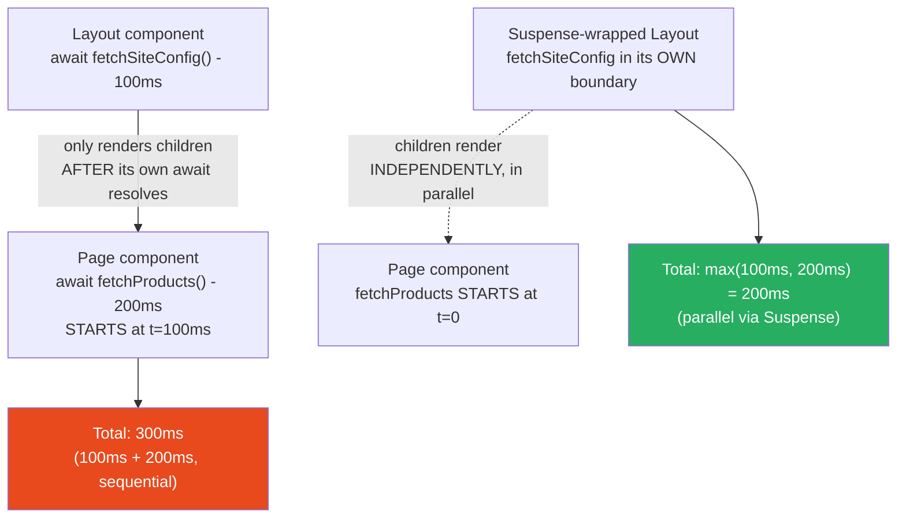

# 94 · Rendering Waterfalls

> **A rendering waterfall occurs when requests that COULD happen in parallel instead happen sequentially — each one waiting for the previous to complete before starting — turning what should be a single round-trip's worth of latency into a multiplied chain. Waterfalls are the single most common, most expensive, and most invisible performance bug in React applications: invisible because each individual piece of code looks reasonable in isolation, expensive because the cost compounds (3 sequential 200ms requests = 600ms; the same 3 requests in parallel = 200ms), and common because React's component composition model naturally encourages the exact nesting pattern that creates waterfalls if data-fetching isn't deliberately architected to avoid them.**

Understanding waterfalls requires connecting two things covered separately elsewhere in this handbook: HTTP/2's multiplexing (Part XVIII, doc 91) which makes PARALLEL requests cheap, and React's component tree execution model (Parts I-X) which determines WHEN each request fires. A waterfall isn't a network problem — the network is fully capable of handling parallel requests efficiently. A waterfall is an APPLICATION ARCHITECTURE problem: code structured so that data fetching is accidentally sequential when it could be concurrent.

---

## Table of Contents

- [Anatomy of a Waterfall](#anatomy-of-a-waterfall)
- [The Component-Tree Waterfall Pattern](#the-component-tree-waterfall-pattern)
- [Network Waterfalls vs Data Waterfalls](#network-waterfalls-vs-data-waterfalls)
- [Waterfalls in Client-Side Fetching (useEffect Chains)](#waterfalls-in-client-side-fetching-useeffect-chains)
- [Waterfalls in Server Components](#waterfalls-in-server-components)
- [The Parallel Data Fetching Pattern](#the-parallel-data-fetching-pattern)
- [Preload Pattern: Starting Fetches Before They're Needed](#preload-pattern-starting-fetches-before-theyre-needed)
- [Waterfalls Caused by Authentication/Session Checks](#waterfalls-caused-by-authenticationsession-checks)
- [Identifying Waterfalls in DevTools](#identifying-waterfalls-in-devtools)
- [When Sequential IS Correct](#when-sequential-is-correct)
- [Waterfalls in TanStack Query: Dependent Queries Done Right](#waterfalls-in-tanstack-query-dependent-queries-done-right)
- [Architecture Diagrams](#architecture-diagrams)
- [Good Practices](#good-practices)
- [Bad Practices](#bad-practices)
- [Mental Model](#mental-model)
- [Common Misconceptions](#common-misconceptions)
- [Exercises](#exercises)
- [Further Reading](#further-reading)

---

## Anatomy of a Waterfall

```
THE MATHEMATICAL COST:

Sequential (waterfall) requests, each taking 200ms:
  Request A: 0ms ──────── 200ms
                          Request B: 200ms ──────── 400ms
                                                     Request C: 400ms ──────── 600ms
  Total time: 600ms (sum of all request times)

Parallel requests, each taking 200ms:
  Request A: 0ms ──────── 200ms
  Request B: 0ms ──────── 200ms
  Request C: 0ms ──────── 200ms
  Total time: 200ms (max of all request times, NOT the sum)

For N sequential requests of T ms each: total time = N × T
For N parallel requests of T ms each: total time ≈ T (the slowest one)

This is why a waterfall of just 4 requests at 150ms each (a typical
API latency) costs 600ms — a full HALF SECOND of pure, unnecessary
waiting that proper parallelization would eliminate entirely.
```

---

## The Component-Tree Waterfall Pattern

The most common source of waterfalls in React applications is data fetching nested inside the component tree, where a CHILD component's fetch depends on a PARENT component finishing its render (and thus its fetch) first:

```tsx
// ❌ THE WATERFALL PATTERN:
async function ProductPage({ productId }: { productId: string }) {
  const product = await fetchProduct(productId); // 200ms
  return (
    <div>
      <ProductHeader product={product} />
      <ProductReviews productId={productId} />{" "}
      {/* starts AFTER product resolves */}
    </div>
  );
}

async function ProductReviews({ productId }: { productId: string }) {
  const reviews = await fetchReviews(productId); // another 200ms, but STARTS LATE
  return <ReviewList reviews={reviews} />;
}

// TIMELINE:
//   t=0:    fetchProduct() starts
//   t=200:  fetchProduct() resolves, ProductPage finishes rendering its
//           JSX, ProductReviews component begins executing
//   t=200:  fetchReviews() starts (only NOW, because ProductReviews
//           wasn't even CALLED until ProductPage's await resolved)
//   t=400:  fetchReviews() resolves
//   TOTAL: 400ms

// Yet fetchReviews() doesn't actually NEED the result of fetchProduct() —
// it only needs `productId`, which was available from t=0. The 200ms
// delay before fetchReviews() even STARTS is entirely unnecessary.
```

```tsx
// ✅ THE FIX: hoist the independent fetch to start in parallel
async function ProductPage({ productId }: { productId: string }) {
  // Start BOTH fetches immediately, without awaiting either yet:
  const productPromise = fetchProduct(productId);
  const reviewsPromise = fetchReviews(productId);

  // NOW await them (they're already both in flight):
  const [product, reviews] = await Promise.all([
    productPromise,
    reviewsPromise,
  ]);

  return (
    <div>
      <ProductHeader product={product} />
      <ReviewList reviews={reviews} />
    </div>
  );
}

// TIMELINE:
//   t=0:    BOTH fetchProduct() and fetchReviews() start simultaneously
//   t=200:  BOTH resolve (assuming similar latency)
//   TOTAL: 200ms — HALF the time of the waterfall version
```

---

## Network Waterfalls vs Data Waterfalls

It's important to distinguish two related but distinct phenomena:

```
NETWORK WATERFALL:
  Visible in the browser's Network tab — actual HTTP requests
  shown as a staircase pattern, each starting only after the
  previous one completes.

DATA WATERFALL (the broader, often invisible category):
  The underlying CAUSE of network waterfalls in many cases —
  your CODE's structure determines WHEN each fetch is INITIATED,
  even if the actual network requests themselves could run in
  parallel. A data waterfall exists in your code's control flow
  even before any network request is made.

THE RELATIONSHIP:
  A data waterfall in your component/function structure ALWAYS
  produces a network waterfall when those fetches execute.
  But understanding the DATA waterfall (the code structure) is
  what lets you FIX it — staring at the Network tab tells you
  THAT a waterfall exists, but the FIX happens in your component
  code's data-fetching structure.
```

---

## Waterfalls in Client-Side Fetching (useEffect Chains)

The classic, pre-RSC waterfall pattern, still common in Client Components:

```tsx
// ❌ Sequential useEffect chain — a very common anti-pattern
function UserDashboard({ userId }: { userId: string }) {
  const [user, setUser] = useState<User | null>(null);
  const [orders, setOrders] = useState<Order[] | null>(null);

  useEffect(() => {
    fetchUser(userId).then(setUser); // starts at t=0
  }, [userId]);

  useEffect(() => {
    if (user) {
      // ❌ Waits for `user` state to be set (a RE-RENDER) before
      // even STARTING this fetch — even though orders only needs
      // userId, not anything from the `user` object!
      fetchOrders(userId).then(setOrders);
    }
  }, [user, userId]);

  if (!user || !orders) return <Loading />;
  return <Dashboard user={user} orders={orders} />;
}

// TIMELINE:
//   t=0:    fetchUser(userId) starts
//   t=200:  fetchUser resolves → setUser() → RE-RENDER
//   t=200:  (only now) the second useEffect's condition `if (user)`
//           becomes true → fetchOrders(userId) starts
//   t=400:  fetchOrders resolves
//   TOTAL: 400ms (when it could have been 200ms)
```

```tsx
// ✅ Fix: both fetches depend only on userId — start both immediately
function UserDashboard({ userId }: { userId: string }) {
  const { data: user } = useQuery({
    queryKey: ["user", userId],
    queryFn: () => fetchUser(userId),
  });
  const { data: orders } = useQuery({
    queryKey: ["orders", userId],
    queryFn: () => fetchOrders(userId),
  });
  // TanStack Query fires BOTH queries immediately and independently —
  // no artificial dependency between them. Total time: max(200, 200) = 200ms

  if (!user || !orders) return <Loading />;
  return <Dashboard user={user} orders={orders} />;
}
```

---

## Waterfalls in Server Components

RSC's `async`/`await` component model makes waterfalls EASY to accidentally create, because nested components naturally execute in sequence as React renders the tree:

```tsx
// ❌ Waterfall: each layer awaits before rendering its children
async function Layout({ children }: { children: React.ReactNode }) {
  const config = await fetchSiteConfig(); // 100ms
  return (
    <div data-theme={config.theme}>
      {children}{" "}
      {/* React doesn't START rendering children until
                     THIS component's render function (including its
                     await) completes */}
    </div>
  );
}

async function Page() {
  const products = await fetchProducts(); // starts AFTER Layout's fetchSiteConfig
  return <ProductGrid products={products} />;
}

// Even though fetchSiteConfig() and fetchProducts() are COMPLETELY
// INDEPENDENT (neither needs the other's result), the component tree
// structure (Layout wrapping Page) forces SEQUENTIAL execution:
// fetchSiteConfig (100ms) THEN fetchProducts (200ms) = 300ms total
```

```tsx
// ✅ Fix 1: use Suspense boundaries to decouple independent sections
// (each Suspense boundary's subtree starts rendering independently —
// see doc 92, Streaming, for the underlying mechanism)
async function Layout({ children }: { children: React.ReactNode }) {
  return (
    <div>
      <Suspense fallback={<ThemeSkeleton />}>
        <ThemedWrapper>{children}</ThemedWrapper>
      </Suspense>
    </div>
  );
}

async function ThemedWrapper({ children }: { children: React.ReactNode }) {
  const config = await fetchSiteConfig();
  return <div data-theme={config.theme}>{children}</div>;
}
// React can start rendering `children` (the Page component, and its
// OWN Suspense-wrapped data fetching) WITHOUT waiting for
// fetchSiteConfig() — both fetches are now effectively parallel,
// each within its own Suspense boundary, streaming independently.

// ✅ Fix 2 (often simpler): hoist truly independent fetches to a
// COMMON ancestor and pass results down, OR use Promise.all() at
// a shared level, as shown in the ProductPage example above.
```

---

## The Parallel Data Fetching Pattern

The general-purpose fix for waterfalls: identify INDEPENDENT data needs and initiate ALL of them BEFORE awaiting ANY of them:

```tsx
// THE PATTERN: start all promises first, await them together

async function Dashboard({ userId }: { userId: string }) {
  // Step 1: START all independent fetches (no `await` yet — these
  // are Promise objects, and calling an async function ALREADY
  // starts its execution, even before you `await` it)
  const userPromise = fetchUser(userId);
  const ordersPromise = fetchOrders(userId);
  const notificationsPromise = fetchNotifications(userId);
  const recommendationsPromise = fetchRecommendations(userId);

  // Step 2: NOW await them all together
  const [user, orders, notifications, recommendations] = await Promise.all([
    userPromise,
    ordersPromise,
    notificationsPromise,
    recommendationsPromise,
  ]);

  return (
    <DashboardLayout
      user={user}
      orders={orders}
      notifications={notifications}
      recommendations={recommendations}
    />
  );
}

// CRITICAL DETAIL: calling fetchUser(userId) WITHOUT awaiting it
// IMMEDIATELY starts the async function's execution (up to its
// first `await` internally) — JavaScript's async functions don't
// "wait to be awaited" to begin running. This is WHY listing all
// the calls first (without await) achieves parallelism — each
// call kicks off its own independent execution/network request
// immediately, and Promise.all() just waits for ALL of them to finish.
```

### Promise.allSettled for partial-failure tolerance

```tsx
// When some data is optional and shouldn't block the whole page
// if it fails:
async function Dashboard({ userId }: { userId: string }) {
  const [userResult, ordersResult, recommendationsResult] =
    await Promise.allSettled([
      fetchUser(userId),
      fetchOrders(userId),
      fetchRecommendations(userId), // optional — OK if this fails
    ]);

  if (userResult.status === "rejected") {
    throw new Error("Failed to load user"); // critical data — fail the page
  }

  return (
    <DashboardLayout
      user={userResult.value}
      orders={ordersResult.status === "fulfilled" ? ordersResult.value : []}
      recommendations={
        recommendationsResult.status === "fulfilled"
          ? recommendationsResult.value
          : null // gracefully degrade — show no recommendations rather than erroring
      }
    />
  );
}
```

---

## Preload Pattern: Starting Fetches Before They're Needed

For cases where the waterfall comes from NEEDING a value before you can even START the next fetch (genuine dependency), you can still minimize the damage by starting EVERYTHING possible as early as possible:

```tsx
// The "preload" pattern — start a fetch as a side effect, before
// the component that NEEDS its result is even rendered

// lib/data.ts
import { cache } from "react";

export const getUser = cache(async (userId: string) => {
  return db.users.findUnique({ where: { id: userId } });
});

// Preload function: call this to START the fetch without consuming
// its result yet — React's cache() ensures subsequent calls with
// the SAME arguments reuse the in-flight/resolved promise
export function preloadUser(userId: string) {
  void getUser(userId); // intentionally not awaited — just kicks off the fetch
}

// app/dashboard/page.tsx
import { preloadUser, getUser } from "@/lib/data";

export default async function DashboardPage({
  params,
}: {
  params: { userId: string };
}) {
  // Start the user fetch IMMEDIATELY, before rendering ANY children:
  preloadUser(params.userId);

  return (
    <div>
      <Suspense fallback={<SidebarSkeleton />}>
        <Sidebar userId={params.userId} />{" "}
        {/* unrelated to user, runs in parallel */}
      </Suspense>
      <Suspense fallback={<ProfileSkeleton />}>
        <UserProfile userId={params.userId} />{" "}
        {/* uses getUser() — but it's
                                                     ALREADY been preloaded above,
                                                     so this resolves faster
                                                     (or instantly, if already done) */}
      </Suspense>
    </div>
  );
}

async function UserProfile({ userId }: { userId: string }) {
  const user = await getUser(userId); // hits React's request-memoization
  // cache — reuses the promise
  // started by preloadUser()
  return <Profile user={user} />;
}
```

---

## Waterfalls Caused by Authentication/Session Checks

A frequently-overlooked waterfall source: checking authentication BEFORE starting any data fetches, when the auth check and the data fetch could often run concurrently (with appropriate error handling for the auth-failure case):

```tsx
// ❌ Sequential: auth check blocks ALL subsequent data fetching
async function ProtectedPage() {
  const session = await getSession(); // 50ms
  if (!session) redirect("/login");

  const data = await fetchDashboardData(session.userId); // starts AFTER auth, 200ms
  return <Dashboard data={data} />;
}
// Total: 250ms

// ✅ Often better: most session checks are FAST (reading a cookie,
// maybe a fast cache lookup) — but if the auth check ITSELF is slow
// (e.g., a database round-trip to validate a session token), and the
// data fetch doesn't strictly need to wait, consider:

async function ProtectedPage() {
  const sessionPromise = getSession();
  // If fetchDashboardData can accept an optimistic/placeholder userId
  // or be safely started and discarded on auth failure, start it:
  // (this specific optimization requires careful judgment — don't
  // start fetches for sensitive, user-specific data before confirming
  // auth, but DO consider it for fetches that are safe regardless)

  const session = await sessionPromise;
  if (!session) redirect("/login");
  // ... continue
}

// IN PRACTICE: most auth checks (reading a cookie/JWT) are fast
// enough that this optimization rarely matters — the more common
// and impactful waterfall fix is parallelizing the DATA fetches
// THEMSELVES, as shown in earlier sections. This section exists to
// flag that auth checks ARE part of the waterfall chain and worth
// auditing if they're unusually slow.
```

---

## Identifying Waterfalls in DevTools

```
CHROME DEVTOOLS NETWORK TAB — reading the waterfall view:

A genuine waterfall appears as a STAIRCASE pattern:
  Request A: ▬▬▬▬▬▬▬▬
  Request B:         ▬▬▬▬▬▬▬▬          ← starts only after A completes
  Request C:                 ▬▬▬▬▬▬▬▬  ← starts only after B completes

Properly parallelized requests appear STACKED, starting at similar times:
  Request A: ▬▬▬▬▬▬▬▬
  Request B: ▬▬▬▬▬▬▬▬  ← starts at the same time as A
  Request C: ▬▬▬▬▬▬▬▬  ← starts at the same time as A

WHAT TO LOOK FOR:
  1. Sort the Network tab by "Start Time" (or observe the waterfall
     visually) — look for requests that START exactly when a
     PREVIOUS request's bar ENDS.
  2. Click each request, check the "Initiator" column/tab — this
     shows WHICH script/line of code triggered the request, helping
     trace back to the responsible component.
  3. For Server Component waterfalls (server-side requests not
     visible in the browser's Network tab at all): use server-side
     logging/tracing (timestamps around each fetch call) or an APM
     tool (Vercel's Observability, Sentry Performance, etc.) to see
     the server-side request timeline.
```

---

## When Sequential IS Correct

Not every sequential pattern is a bug — some dependencies are GENUINE:

```tsx
// ✅ LEGITIMATE sequential dependency: orgId comes FROM the user fetch
async function Dashboard({ userId }: { userId: string }) {
  const user = await fetchUser(userId); // MUST resolve first
  const org = await fetchOrganization(user.orgId); // genuinely NEEDS user.orgId
  return <DashboardView user={user} org={org} />;
}
// This is NOT a waterfall bug — fetchOrganization() genuinely cannot
// start before fetchUser() resolves, because it needs a value FROM
// that result. The sequential structure correctly reflects a real
// data dependency.

// THE DIAGNOSTIC QUESTION for any two sequential fetches:
//   "Does fetch B's INPUT depend on fetch A's OUTPUT?"
//   YES → sequential is correct, no fix needed (though consider
//          whether the DEPENDENCY itself could be restructured —
//          e.g., does the API support fetching by userId directly,
//          avoiding the need for the intermediate orgId lookup?)
//   NO  → this is a waterfall bug — parallelize with Promise.all()
//          or independent Suspense boundaries
```

---

## Waterfalls in TanStack Query: Dependent Queries Done Right

```tsx
// Genuine dependency, correctly expressed with `enabled`:
function UserOrgDashboard({ userId }: { userId: string }) {
  const { data: user } = useQuery({
    queryKey: ["user", userId],
    queryFn: () => fetchUser(userId),
  });

  const { data: org } = useQuery({
    queryKey: ["org", user?.orgId],
    queryFn: () => fetchOrganization(user!.orgId),
    enabled: !!user?.orgId, // correctly waits for user to resolve FIRST
    // This IS a legitimate waterfall (org genuinely needs user.orgId) —
    // the `enabled` flag correctly expresses this real dependency,
    // rather than accidentally creating a FALSE dependency.
  });

  // Compare: if `org` only needed `userId` (not `user.orgId`), making
  // it `enabled: !!userId` instead of `enabled: !!user?.orgId` would
  // let it start in PARALLEL with the user query — always question
  // whether an `enabled` dependency reflects a REAL data dependency
  // or an UNNECESSARY one.
}
```

---

## Architecture Diagrams

### Waterfall vs parallel request timeline

```mermaid
gantt
    title Sequential (Waterfall) vs Parallel Requests
    dateFormat X
    axisFormat %Lms

    section Waterfall
    fetchUser (200ms)        :a1, 0, 200
    fetchOrders (200ms)      :a2, after a1, 200
    fetchNotifications (200ms) :a3, after a2, 200

    section Parallel
    fetchUser (200ms)        :b1, 0, 200
    fetchOrders (200ms)      :b2, 0, 200
    fetchNotifications (200ms) :b3, 0, 200
```



### Component tree execution order causing a waterfall



---

## Good Practices

### ✅ Good Practice — Auditing and fixing a real dashboard's waterfall

```tsx
/**
 * Good: A dashboard page where every independent fetch starts in
 * parallel, with proper handling of the ONE genuine dependency
 * (organization needs the user's orgId).
 */

async function DashboardPage({ params }: { params: { userId: string } }) {
  // Independent fetches — all start immediately, in parallel:
  const userPromise = fetchUser(params.userId);
  const notificationsPromise = fetchNotifications(params.userId);
  const recentActivityPromise = fetchRecentActivity(params.userId);

  // Await the one we need first (for the genuine dependency chain):
  const user = await userPromise;

  // NOW start the dependent fetch (genuinely needs user.orgId):
  const orgPromise = fetchOrganization(user.orgId);

  // Await everything else together:
  const [notifications, recentActivity, org] = await Promise.all([
    notificationsPromise,
    recentActivityPromise,
    orgPromise,
  ]);

  return (
    <DashboardLayout
      user={user}
      org={org}
      notifications={notifications}
      recentActivity={recentActivity}
    />
  );
}

// TIMELINE:
//   t=0:   user, notifications, recentActivity ALL start
//   t=200: user resolves (assume 200ms) → org fetch starts (depends on user.orgId)
//   t=250: notifications resolves (assume 250ms, already done)
//   t=300: recentActivity resolves (assume 300ms, already done)
//   t=350: org resolves (assume 150ms from when it started at t=200)
//   TOTAL: 350ms — vs a NAIVE waterfall of all 4 sequential: 200+250+300+150 = 900ms
```

---

## Bad Practices

### ⚠️ Bad Practice — The "convenient" nested-component waterfall

```tsx
/**
 * Bad: Nesting components for visual/organizational convenience
 * without considering that each layer's await blocks the next
 * layer from STARTING its own fetch — a very common, easy-to-miss
 * waterfall pattern in RSC-based applications.
 */

// ❌ Each component is independently reasonable, but composed
// this way, they create a 3-layer waterfall
async function ProductPage({ productId }: { productId: string }) {
  const product = await fetchProduct(productId); // 150ms
  return <ProductDetail product={product} productId={productId} />;
}

async function ProductDetail({ product, productId }: Props) {
  const inventory = await fetchInventory(productId); // starts at t=150, 100ms
  return (
    <InventoryDisplay
      product={product}
      inventory={inventory}
      productId={productId}
    />
  );
}

async function InventoryDisplay({ product, inventory, productId }: Props) {
  const reviews = await fetchReviews(productId); // starts at t=250, 200ms
  return (
    <FullProductView
      product={product}
      inventory={inventory}
      reviews={reviews}
    />
  );
}
// TOTAL: 150 + 100 + 200 = 450ms — a 3-LEVEL WATERFALL, even though
// NONE of these three fetches actually depend on each other's data!
// Each only needs `productId`, available from t=0.

/**
 * ✅ Fix: flatten the fetches to a single level, parallelized
 */
async function ProductPage({ productId }: { productId: string }) {
  const [product, inventory, reviews] = await Promise.all([
    fetchProduct(productId),
    fetchInventory(productId),
    fetchReviews(productId),
  ]);

  return (
    <FullProductView
      product={product}
      inventory={inventory}
      reviews={reviews}
    />
  );
}
// TOTAL: max(150, 100, 200) = 200ms — more than 2x faster
```

**Production impact:** A team's product page had grown organically, with each new feature (inventory display, reviews, recommendations) added as a nested child component that fetched its own data with a top-level `await`. Over several months, this accumulated into a 5-level-deep waterfall totaling over 1.2 seconds of PURELY SEQUENTIAL, UNNECESSARY waiting — none of the fetches actually depended on each other. Restructuring to a flat `Promise.all()` pattern at the top of the page component (passing results down as props) reduced server response time from 1.2s to 280ms (the slowest individual fetch).

---

## Mental Model

> 💡 **The rendering waterfall mental model:**
>
> Think of data fetching like **ordering food at a multi-station food court** where you and your three friends each want something from a different stall. The WATERFALL pattern is like everyone walking to the FIRST stall together, waiting for THAT order, THEN walking to the second stall together, waiting again, and so on — even though nobody's order at Stall B depends on what happened at Stall A. The PARALLEL pattern is each friend walking DIRECTLY to their own stall AT THE SAME TIME, and everyone meeting back at the table once all orders are ready — the total wait time is determined by the SLOWEST individual order, not the SUM of all of them. The one case where sequential IS correct: if your dessert order at Stall C depends on knowing WHICH MAIN COURSE your friend got from Stall A (a genuine dependency) — in that specific case, you DO need to wait for Stall A before you can even PLACE the Stall C order. The skill is recognizing which fetches are "everyone walks to their own stall" (parallelize) versus "I need information from this fetch before I can even FORM the next request" (genuinely sequential).

---

## Common Misconceptions

### "Waterfalls only happen with useEffect, not with RSC's async/await"

RSC's component-tree execution model creates waterfalls JUST AS EASILY as useEffect chains — arguably MORE easily, because nesting async Server Components feels natural and "clean" while silently introducing sequential execution. The fix (Promise.all, parallel Suspense boundaries) differs from the client-side fix, but the underlying problem is identical.

### "Promise.all() always fixes a waterfall"

`Promise.all()` only helps when the fetches it parallelizes are GENUINELY INDEPENDENT (none needs another's result as input). Using `Promise.all()` on a TRULY dependent chain doesn't make sense (you'd need the first result before you could even construct the second request) — in genuinely dependent cases, the correct fix is often architectural (can the API combine the two calls? Can a single query fetch both pieces of data?), not just wrapping in Promise.all.

### "More Suspense boundaries always reduce waterfalls"

Suspense boundaries help when they allow INDEPENDENT subtrees to render concurrently (avoiding one slow fetch blocking unrelated siblings). But a Suspense boundary AROUND a genuinely sequential chain (B needs A's result) doesn't eliminate that chain's inherent latency — it can only help the REST OF THE PAGE avoid being blocked by that one sequential chain.

### "Network waterfalls are caused by slow APIs"

A waterfall's TOTAL TIME is affected by individual request latency, but the WATERFALL PATTERN ITSELF (sequential vs parallel) is purely a function of your CODE'S STRUCTURE, not the API's speed. Even very fast APIs (20ms each) produce a meaningfully worse experience when chained sequentially across many components versus parallelized.

### "Client-side data fetching libraries (TanStack Query) automatically parallelize everything"

TanStack Query parallelizes queries that are INDEPENDENTLY MOUNTED (different `useQuery` calls without an `enabled` dependency chain). But if you structure your COMPONENT TREE so that a child component (and thus its `useQuery` call) doesn't even MOUNT until a parent's conditional rendering allows it, you've recreated a waterfall at the component level, regardless of TanStack Query's own efficiency.

---

## Exercises

### Exercise 1 — Identify and fix a 3-level component waterfall

Given this code, identify the waterfall, calculate the total time assuming each fetch takes 150ms, and rewrite it to minimize total time:

```tsx
async function OrderPage({ orderId }: { orderId: string }) {
  const order = await fetchOrder(orderId);
  return <OrderShipping order={order} orderId={orderId} />;
}

async function OrderShipping({ order, orderId }: Props) {
  const shipping = await fetchShippingStatus(orderId);
  return <OrderPayment order={order} shipping={shipping} orderId={orderId} />;
}

async function OrderPayment({ order, shipping, orderId }: Props) {
  const payment = await fetchPaymentDetails(orderId);
  return <FullOrderView order={order} shipping={shipping} payment={payment} />;
}
```

### Exercise 2 — Distinguish genuine dependencies from false ones

For each pair of fetches below, determine: genuine dependency (sequential is correct) or false dependency (should be parallelized)?

1. `fetchUser(userId)` → `fetchUserPermissions(user.role)`
2. `fetchUser(userId)` → `fetchUserOrders(userId)`
3. `fetchPost(postId)` → `fetchAuthor(post.authorId)`
4. `fetchPost(postId)` → `fetchComments(postId)`

### Exercise 3 — Trace a real waterfall using DevTools

Take any Next.js application you have access to (or build a small one with 3+ intentionally nested async Server Components). Open the Network tab, identify the staircase pattern, and use the Initiator column to trace each request back to its triggering component. Fix the waterfall and verify the improvement.

---

## Further Reading

- [web.dev: Avoiding request waterfalls](https://web.dev/articles/preload-critical-assets) — general waterfall avoidance principles
- [React docs: Parallel data fetching with use()](https://react.dev/reference/react/use) — modern patterns for parallel async data in components
- [Next.js docs: Sequential vs Parallel Data Fetching](https://nextjs.org/docs/app/building-your-application/data-fetching/fetching-caching-and-revalidating#parallel-and-sequential-data-fetching) — official Next.js guidance
- [Vercel: Understanding React Server Component data fetching patterns](https://vercel.com/blog/everything-you-need-to-know-about-react-server-components) — RSC-specific waterfall guidance
- Related in this handbook: [92 · Streaming & Chunked Transfer](./02-streaming.md), [04 · RSC Patterns](../server-components/04-rsc-patterns.md)
- Next in this handbook: [95 · BFF Architecture](./05-bff.md)

---

_Part of the [React + Next.js Engineering Handbook](../../README.md)_
