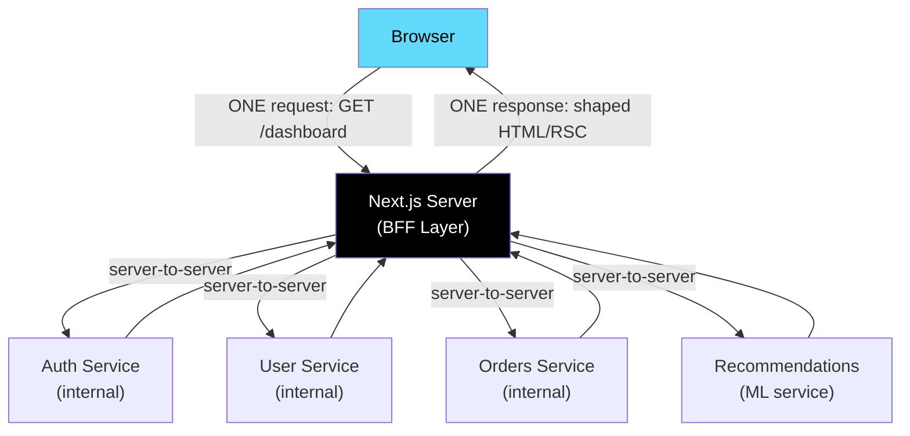
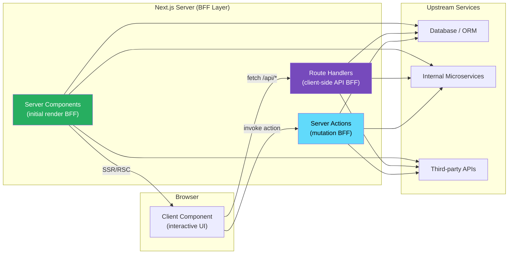

# 95 · BFF Architecture (Backend-for-Frontend)

> **The Backend-for-Frontend (BFF) pattern is an architectural approach where a dedicated server layer sits between a frontend application and its upstream services, purpose-built to serve the frontend's specific data needs rather than being a general-purpose API. In the Next.js world, this distinction matters because Next.js's Route Handlers and Server Actions ARE, functionally, a BFF — they can aggregate, transform, and shape data from multiple upstream sources into exactly what the frontend needs, without exposing raw service APIs to the browser. Understanding when this pattern adds value versus when it adds unnecessary complexity is essential architecture-level knowledge for senior Next.js engineers.**

The BFF pattern emerged from the observation that a single, general-purpose API designed to serve multiple client types (web, mobile, IoT) inevitably serves each of them poorly — too much data for some use cases, too little for others, requiring multiple round trips where one should suffice. A BFF dedicates server-side logic to serving one specific client's needs. Next.js's App Router, with its Server Components and Route Handlers, is arguably the most integrated BFF implementation available in the React ecosystem — one where the BFF layer and the frontend rendering layer share code, types, deployment infrastructure, and even the same process.

---

## Table of Contents

- [What BFF Solves](#what-bff-solves)
- [BFF in the Context of Next.js](#bff-in-the-context-of-nextjs)
- [The Three Data-Fetching Layers in a Next.js BFF](#the-three-data-fetching-layers-in-a-nextjs-bff)
- [API Aggregation: One Request Instead of Many](#api-aggregation-one-request-instead-of-many)
- [Response Shaping: Give the Frontend Exactly What It Needs](#response-shaping-give-the-frontend-exactly-what-it-needs)
- [Authentication and Authorization at the BFF Layer](#authentication-and-authorization-at-the-bff-layer)
- [Rate Limiting and Circuit Breakers in the BFF Layer](#rate-limiting-and-circuit-breakers-in-the-bff-layer)
- [The BFF vs GraphQL Decision](#the-bff-vs-graphql-decision)
- [BFF Caching Strategy](#bff-caching-strategy)
- [Type Safety Across the BFF Boundary](#type-safety-across-the-bff-boundary)
- [When BFF Adds Complexity Without Value](#when-bff-adds-complexity-without-value)
- [Microservices and the BFF](#microservices-and-the-bff)
- [Architecture Diagrams](#architecture-diagrams)
- [Good Practices](#good-practices)
- [Bad Practices](#bad-practices)
- [Mental Model](#mental-model)
- [Common Misconceptions](#common-misconceptions)
- [Exercises](#exercises)
- [Further Reading](#further-reading)

---

## What BFF Solves

```
THE PROBLEM (without BFF):

  Frontend ──────────────────────── Auth Service
            ──────────────────────── User Service
            ──────────────────────── Order Service
            ──────────────────────── Product Service
            ──────────────────────── Recommendation Service

  For a dashboard page, the browser must:
    1. Send 5 separate requests to 5 services (or wait for a general API)
    2. Receive 5 responses, each potentially containing 10x the data needed
    3. Merge, filter, and transform the data in client-side JavaScript
    4. Deal with 5 separate auth, error handling, and retry concerns
    5. Expose internal service URLs to the browser (security concern)

WITH BFF:

  Frontend ─── BFF (Next.js Server Components / Route Handlers)
                  ├── calls Auth Service (server-to-server)
                  ├── calls User Service (server-to-server)
                  ├── calls Order Service (server-to-server)
                  ├── calls Product Service (server-to-server)
                  └── calls Recommendation Service (server-to-server)

  The browser makes ONE request to the BFF, which:
    - Calls all upstream services IN PARALLEL (server-to-server,
      typically faster than client-to-service calls: lower latency,
      no public internet traversal)
    - Merges results into exactly the shape the page needs
    - Filters out sensitive/irrelevant fields
    - Handles auth, errors, and retries centrally
    - Returns ONE response to the browser, precisely shaped
    - Never exposes internal service URLs to the browser
```

---

## BFF in the Context of Next.js

Next.js's App Router blurs the line between "frontend" and "BFF" in a way that's architecturally significant:

```
TRADITIONAL BFF ARCHITECTURE:
  Frontend app (React SPA)
    │ HTTP requests
  BFF server (separate Node.js service, separate deployment)
    │ HTTP/gRPC requests
  Upstream services (Auth, User, Orders, ...)

NEXT.JS APP ROUTER ARCHITECTURE (collapsed BFF):
  Next.js Server Components and Route Handlers
  (this is BOTH the frontend rendering layer AND the BFF layer —
   in the same codebase, the same process, the same deployment)
    │ HTTP/gRPC/SDK requests (all server-side, fast, private)
  Upstream services (Auth, User, Orders, ...)
  Browser receives HTML/RSC payloads — NOT raw API JSON

THE IMPLICATION:
  When you write a Server Component that calls multiple APIs and
  returns the aggregated result as rendered HTML, you're implementing
  the BFF pattern without any additional infrastructure. The Server
  Component IS the BFF for that page.

  When you write a Route Handler that aggregates three microservice
  responses into one JSON shape for a Client Component to consume,
  you're implementing the BFF pattern for that API endpoint.
```

---

## The Three Data-Fetching Layers in a Next.js BFF

```
LAYER 1: Server Components (the preferred BFF layer for most cases)
  What: async RSC functions that fetch data and return rendered HTML/RSC
  When to use: for data that's needed for initial render and can be
              server-rendered (the vast majority of cases)
  Benefit: ZERO client-side JS for the data fetching — the result
           is already rendered HTML when it reaches the browser;
           the "API call" is invisible to the client

  async function DashboardPage() {
    const [user, metrics] = await Promise.all([fetchUser(), fetchMetrics()]);
    return <Dashboard user={user} metrics={metrics} />;
  }

LAYER 2: Route Handlers (BFF API endpoints for client-side needs)
  What: app/api/*/route.ts files that return JSON
  When to use: for data needed by Client Components that:
    - requires client-side interactivity to trigger (button clicks)
    - updates in real-time (polling, SSE)
    - needs to be called post-render (mutations, searches)
  Benefit: shapes data server-side before returning to client,
           handles auth/validation, aggregates if needed

  // app/api/search/route.ts
  export async function GET(request: Request) {
    const { searchParams } = new URL(request.url);
    const q = searchParams.get('q');

    // Aggregate two services into one response:
    const [results, suggestions] = await Promise.all([
      searchProducts(q),
      fetchSearchSuggestions(q),
    ]);
    return Response.json({ results, suggestions });
  }

LAYER 3: Server Actions (BFF for mutations)
  What: 'use server' functions for form submissions and mutations
  When to use: for write operations (create, update, delete) triggered
              by user interaction
  Benefit: runs server-side, handles auth, validates, revalidates cache
```

---

## API Aggregation: One Request Instead of Many

A core BFF value: aggregating multiple upstream calls into one client-facing response:

```tsx
// BEFORE BFF (SPA pattern): browser makes 4 separate requests
// useEffect in the browser calls:
//   GET /api/products/{id}        → product details
//   GET /api/reviews/{productId}  → reviews
//   GET /api/inventory/{id}       → stock levels
//   GET /api/recommendations      → related products
// Total: 4 round trips, browser-visible URLs, 4 separate auth headers

// AFTER BFF (Server Component): ONE render, server fetches in parallel
async function ProductPage({ params }: { params: { id: string } }) {
  const [product, reviews, inventory, recommendations] = await Promise.all([
    // These are all server-to-server calls — faster, private,
    // never visible to the browser:
    fetchProduct(params.id), // internal microservice
    fetchReviews(params.id), // internal microservice
    fetchInventory(params.id), // internal microservice
    fetchRecommendations(params.id), // ML service
  ]);

  return (
    <ProductView
      product={product}
      reviews={reviews}
      inventory={inventory}
      recommendations={recommendations}
    />
  );
}

// What the browser receives: ONE HTML document (or RSC payload on
// client-side navigation) with all data already integrated.
// The browser never sees /api/products/{id}, /api/reviews/{id}, etc.
// The internal service topology is completely hidden from the client.
```

---

## Response Shaping: Give the Frontend Exactly What It Needs

One of the BFF pattern's most concrete benefits — preventing over-fetching and under-fetching:

```tsx
// Upstream service response (often over-specified, "everything"):
type RawProduct = {
  id: string;
  name: string;
  description: string;
  longDescription: string;
  internalSku: string; // internal — never show to browser
  supplierCode: string; // internal — never show to browser
  costPrice: number; // sensitive — NEVER expose to browser
  retailPrice: number;
  taxCode: string; // internal
  warehouseLocation: string; // internal
  createdAt: string;
  updatedAt: string;
  publishedAt: string | null;
  images: Array<{
    id: string;
    url: string;
    alt: string;
    internalNote: string; // internal — never show to browser
    width: number;
    height: number;
  }>;
};

// BFF shapes the response to EXACTLY what the page needs:
function shapeProductForPage(raw: RawProduct): PageProduct {
  return {
    id: raw.id,
    name: raw.name,
    description: raw.description,
    price: raw.retailPrice,
    // costPrice: OMITTED — sensitive data stays on server
    // supplierCode: OMITTED — internal data stays on server
    // internalSku: OMITTED
    images: raw.images.map((img) => ({
      url: img.url,
      alt: img.alt,
      width: img.width,
      height: img.height,
      // internalNote: OMITTED
    })),
  };
}

async function ProductPage({ id }: { id: string }) {
  const rawProduct = await fetchFromProductService(id);
  const product = shapeProductForPage(rawProduct);
  // `product` is the BFF-shaped, browser-safe version
  // The rawProduct with costPrice and internal fields NEVER reaches the browser
  return <ProductView product={product} />;
}
```

---

## Authentication and Authorization at the BFF Layer

The BFF is the natural place to centralize auth checking, rather than relying on each upstream service to independently validate the caller:

```tsx
// Pattern: validate auth ONCE at the BFF layer, use internal/service
// auth tokens for upstream calls (avoiding browser-side auth tokens
// for internal services)

async function OrdersPage() {
  const session = await getSession(); // validates the USER's auth cookie
  if (!session) redirect("/login");

  // The BFF layer now calls internal services with SERVER-SIDE
  // credentials (internal API keys, service-to-service JWT, etc.)
  // — the user's browser never sees these credentials:
  const orders = await fetch("http://internal-orders-service/orders", {
    headers: {
      Authorization: `Bearer ${process.env.INTERNAL_SERVICE_TOKEN}`,
      "X-User-ID": session.userId, // pass the validated user ID to the service
    },
  }).then((r) => r.json());

  return <OrdersList orders={orders} />;
}

// Benefits:
// 1. Internal service URLs (http://internal-orders-service) NEVER
//    reach the browser — only the BFF knows they exist
// 2. Internal API keys (INTERNAL_SERVICE_TOKEN) never reach the browser
// 3. Auth validation happens once at the BFF — upstream services
//    trust the BFF's X-User-ID header (a common internal auth pattern)
// 4. If auth requirements change, they change in ONE PLACE (the BFF)
//    rather than across every internal service's public-facing endpoint
```

---

## Rate Limiting and Circuit Breakers in the BFF Layer

```tsx
// lib/services/product-service.ts
import { Ratelimit } from "@upstash/ratelimit";
import { Redis } from "@upstash/redis";

const ratelimit = new Ratelimit({
  redis: Redis.fromEnv(),
  limiter: Ratelimit.slidingWindow(100, "1 m"), // 100 requests per minute
});

export async function fetchProduct(id: string, userId: string) {
  // Rate limit at the BFF layer — protecting upstream services from
  // client-generated traffic bursts:
  const { success } = await ratelimit.limit(userId);
  if (!success) {
    throw new Error("Rate limit exceeded");
  }

  return fetch(`http://internal-product-service/products/${id}`, {
    headers: { Authorization: `Bearer ${process.env.INTERNAL_SERVICE_TOKEN}` },
  }).then((r) => r.json());
}

// Circuit breaker pattern (simplified, using a library like opossum):
// When an upstream service is failing, stop making calls to it
// temporarily rather than accumulating timeouts:
import CircuitBreaker from "opossum";

const breaker = new CircuitBreaker(
  (id: string) => fetch(`http://internal-product-service/products/${id}`),
  {
    timeout: 3000, // fail if call takes > 3s
    errorThresholdPercentage: 50, // open circuit if > 50% calls fail
    resetTimeout: 30000, // try again after 30s
  },
);

breaker.fallback(() => getCachedProduct()); // return stale cache on failure
```

---

## The BFF vs GraphQL Decision

```
THE COMPARISON:
  BFF + REST/JSON:
    Each page/feature has its own BFF endpoint shaped exactly for it
    Pro: simple, explicit, easy to debug, no schema to maintain
    Pro: natural fit with Next.js's file-based routing
    Con: endpoints proliferate over time; similar data needs across
         features can lead to duplication
    Best for: teams without GraphQL expertise, simpler data needs,
               Next.js-first architecture (Server Components are a
               natural BFF replacement for many GraphQL use cases)

  GraphQL (with a BFF as the GraphQL server, or a GraphQL gateway):
    One endpoint (/graphql) with a typed schema; clients query
    EXACTLY what they need, nothing more or less
    Pro: powerful for complex, cross-feature data requirements
    Pro: clients can specify their exact data needs (no over-fetching)
    Pro: strong tooling (Apollo Client, code generation, persisted queries)
    Con: additional layer of complexity (schema design, resolver implementation)
    Con: N+1 query problems if DataLoader isn't implemented
    Con: can be over-engineering for simple frontend data needs

  THE NEXT.JS-SPECIFIC ANGLE:
    React Server Components already provide what GraphQL provides for
    INITIAL RENDER: the server knows exactly what data the component
    tree needs (because it's executing the rendering), fetches only
    what's needed, and returns the exact shape in rendered HTML/RSC form.
    For CLIENT-SIDE DYNAMIC DATA, GraphQL has more advantages over
    REST-based Route Handlers.

    Many Next.js + RSC applications find they need GraphQL LESS than
    they thought, because Server Components handle the initial-render
    data-fetching case that used to require GraphQL's query flexibility.
```

---

## BFF Caching Strategy

The BFF layer is an ideal place to centralize caching, leveraging Next.js's built-in Data Cache:

```tsx
// lib/services/product-service.ts

// Level 1: Next.js's built-in Data Cache (revalidate-aware)
export async function fetchProduct(id: string) {
  return fetch(`http://internal-product-service/products/${id}`, {
    next: {
      revalidate: 300, // cache for 5 minutes
      tags: [`product-${id}`], // for on-demand revalidation
    },
  }).then((r) => r.json());
}

// Level 2: Request deduplication via React's cache() (within one render)
import { cache } from "react";

export const getProduct = cache(async (id: string) => {
  return fetchProduct(id);
});
// Multiple Server Components in the same render tree calling
// getProduct(id) with the same id only trigger ONE actual fetch.

// Level 3: External cache (Redis) for cross-render, cross-deployment
// caching with fine-grained TTL control — appropriate for data that
// is expensive to compute and shared across many users
export async function getProductWithRedisCache(id: string) {
  const cached = await redis.get(`product:${id}`);
  if (cached) return JSON.parse(cached);

  const product = await fetchProduct(id);
  await redis.setex(`product:${id}`, 300, JSON.stringify(product)); // TTL: 5min
  return product;
}
```

---

## Type Safety Across the BFF Boundary

One of Next.js's unique advantages as a BFF: shared types between server and client, and increasingly, end-to-end type safety:

```tsx
// types/product.ts — shared types used by BOTH server and client layers
export type BFFProduct = {
  id: string;
  name: string;
  price: number;
  images: Array<{ url: string; alt: string }>;
  // Note: costPrice, supplierCode, etc. are NOT in this type —
  // they never cross the BFF boundary
};

// Server (BFF layer):
async function fetchAndShapeProduct(id: string): Promise<BFFProduct> {
  const raw = await fetchFromProductService(id); // RawProduct
  return {
    id: raw.id,
    name: raw.name,
    price: raw.retailPrice, // maps from retailPrice → price
    images: raw.images.map((img) => ({ url: img.url, alt: img.alt })),
  }; // TypeScript verifies this matches BFFProduct at compile time
}

// Client (consumes BFFProduct type):
function ProductCard({ product }: { product: BFFProduct }) {
  return (
    <div>
      <h3>{product.name}</h3>
      <span>${product.price}</span>
    </div>
  );
}

// With tRPC (for Route Handlers that MUST return JSON to clients):
// tRPC provides end-to-end type safety from server procedure definition
// to client call — the client SDK knows the exact return type of
// each server procedure without any manual type sharing.
```

---

## When BFF Adds Complexity Without Value

```
THE BFF IS OVERKILL WHEN:

1. The upstream API is already frontend-optimized:
   If you're calling a single REST API that already returns exactly
   the data the page needs in the right shape, adding a BFF layer
   just to proxy the call is pure overhead.

2. The frontend is simple (small app, few data sources):
   BFF architecture shines when aggregating MULTIPLE upstream
   services. For a simple app hitting ONE database via Prisma,
   Server Components that call Prisma directly IS the appropriate
   pattern — no additional BFF layer needed.

3. You're building a public API anyway:
   If your backend needs to be consumed by BOTH your Next.js frontend
   AND external third-party clients, the BFF must expose a public API.
   A separate, general-purpose API may be more appropriate than a
   Next.js-coupled BFF.

4. The team doesn't own the backend:
   If you're consuming third-party APIs (Stripe, Shopify, Salesforce),
   you may need a BFF for auth/key-protection, but beyond that,
   adding transformation logic that you'll need to maintain as the
   third-party API evolves may be more burden than benefit.

SIGNS THE BFF PATTERN IS WORKING WELL:
  - Downstream services never receive requests from browser IPs
  - Sensitive data (internal pricing, supplier codes) is never in
    Network tab responses
  - Multiple upstream calls are consolidated into single page fetches
  - Client-side code has no awareness of internal service topology
  - Type-safe request/response contracts exist at the BFF boundary
```

---

## Microservices and the BFF

```
THE MICROSERVICES CONTEXT:
  Large organizations with microservices architectures commonly have
  many specialized internal services (Auth, User, Catalog, Orders,
  Inventory, Pricing, Recommendation, Search, ...). Each service
  owns its own domain and data.

  Without a BFF, the web frontend must either:
    A) Call each service directly (complex, insecure, chatty)
    B) Call a general-purpose "API gateway" that proxies ALL services
       (one endpoint, but still returns raw service data, still requires
       client-side aggregation)

  WITH a Next.js BFF:
    The Server Component or Route Handler is the API gateway AND the
    aggregation AND the transformation AND the presentation layer —
    all in one cohesive, type-safe system. The BFF knows about the
    page it's serving, so it can request exactly the right data from
    exactly the right services in exactly the right combination, and
    render it directly into HTML/RSC.

  THE TEAM TOPOLOGY CONSIDERATION:
    Conway's Law observation: the BFF's data aggregation logic only
    works well if the TEAM owning the BFF has enough context about
    both the upstream services AND the frontend's needs. When the
    frontend team ALSO owns the BFF (as in a Next.js-full-stack setup),
    this is natural. When the BFF must be owned by a SEPARATE team
    (e.g., a platform team), organizational friction can make the
    pattern's benefits harder to achieve in practice.
```

---

## Architecture Diagrams

### BFF in the Next.js request flow



### Next.js three-layer BFF model



---

## Good Practices

### ✅ Good Practice — A well-structured BFF Route Handler with auth, aggregation, and shaping

```tsx
/**
 * Good: A Route Handler that serves as a proper BFF endpoint —
 * authenticates the request, aggregates multiple upstream sources
 * in parallel, shapes the response to exactly what the client needs,
 * and strips sensitive internal data.
 */

// app/api/dashboard-summary/route.ts
import { getSession } from "@/lib/auth";
import { userService, orderService, metricsService } from "@/lib/services";

export async function GET(request: Request) {
  // 1. Authentication at the BFF boundary
  const session = await getSession();
  if (!session) {
    return Response.json({ error: "Unauthorized" }, { status: 401 });
  }

  // 2. Parallel upstream calls (all server-to-server, hidden from browser)
  const [user, recentOrders, metrics] = await Promise.all([
    userService.getUser(session.userId),
    orderService.getRecentOrders(session.userId, { limit: 5 }),
    metricsService.getUserMetrics(session.userId),
  ]);

  // 3. Response shaping — only what the dashboard widget needs
  const summary = {
    user: {
      name: user.displayName,
      avatar: user.avatarUrl,
      memberSince: user.createdAt,
      // user.internalId, user.passwordHash, etc. — NOT included
    },
    recentOrders: recentOrders.map((order) => ({
      id: order.id,
      status: order.status,
      total: order.totalAmount,
      placedAt: order.createdAt,
      // order.internalFulfillmentId, etc. — NOT included
    })),
    metrics: {
      totalOrders: metrics.orderCount,
      lifetimeValue: metrics.ltv,
      // metrics.internalCustomerSegment — NOT included (internal classification)
    },
  };

  return Response.json(summary);
}
```

---

## Bad Practices

### ⚠️ Bad Practice — Passing through raw upstream responses without shaping

```tsx
/**
 * Bad: A Route Handler that proxies an upstream API response directly
 * to the browser — exposing internal data fields, internal service
 * URLs, and skipping the transformation that is the BFF's core value.
 * This gives you the complexity of a BFF (an extra layer) with none
 * of its benefits (security, data shaping, aggregation).
 */

// ❌ Passthrough proxy — the worst of both worlds
export async function GET(request: Request) {
  const session = await getSession();
  if (!session)
    return Response.json({ error: "Unauthorized" }, { status: 401 });

  const rawResponse = await fetch(`http://internal-product-service/products`, {
    headers: { Authorization: `Bearer ${process.env.INTERNAL_TOKEN}` },
  });

  const rawData = await rawResponse.json();

  // ❌ Return raw upstream response directly to the browser:
  return Response.json(rawData);
  // Now the browser receives:
  //   - internal cost prices (sensitive)
  //   - supplier codes (internal business data)
  //   - warehouse locations (internal)
  //   - raw internal service data schema (exposes internal structure)
  //   - 10x more data than the UI actually uses (over-fetching)
}

/**
 * ✅ Fix: always shape the response to match what the client actually needs
 */
export async function GET(request: Request) {
  const session = await getSession();
  if (!session)
    return Response.json({ error: "Unauthorized" }, { status: 401 });

  const rawProducts = await internalProductService.listProducts();

  // Shape: include only browser-safe, client-needed fields
  const products = rawProducts.map((p) => ({
    id: p.id,
    name: p.name,
    price: p.retailPrice, // not costPrice
    image: p.primaryImageUrl,
    available: p.inventoryCount > 0,
    // sensitive/internal fields: NOT included
  }));

  return Response.json({ products });
}
```

---

## Mental Model

> 💡 **The BFF mental model:**
>
> The BFF is like a **personal assistant at a company who handles ALL your external interactions** on your behalf. Instead of the executive (the browser) calling the legal department, the finance team, the operations team, and the HR department directly — knowing each team's internal extension numbers and protocols — the assistant (the BFF) makes all those calls, knows all the internal numbers, filters the responses to just what the executive needs to know, and presents a single, clear brief. The executive never calls anyone directly, never knows the legal department's internal extension, never receives 50-page contracts when a 2-sentence summary is what's needed. This insulation of the browser from internal service complexity is the BFF's core architectural value — and Next.js's Server Components are the most natural implementation of this assistant role, because they share the same codebase, types, and deployment as the frontend they serve.

---

## Common Misconceptions

### "A BFF is always a separate service from the frontend"

Traditionally yes, but Next.js's Server Components represent a paradigm where the BFF and the rendering layer are UNIFIED — the same code is simultaneously the backend data-aggregation layer and the frontend rendering layer. This is arguably the BFF pattern's ideal form, eliminating the network hop between the "frontend" and the "BFF."

### "Next.js Route Handlers ARE a BFF"

Route Handlers CAN implement the BFF pattern, but they don't automatically do so — a Route Handler that blindly proxies an upstream API without shaping or aggregation is NOT realizing the BFF's value. The pattern is about WHAT you do in the Route Handler (aggregate, shape, auth-gate), not the existence of the Route Handler itself.

### "BFF means duplicating business logic from backend services"

The BFF should contain PRESENTATION logic (what data does this page need? how should it be shaped?) not DOMAIN logic (is this order valid? how is this price calculated?). Business rules belong in their domain services; the BFF aggregates and shapes their outputs without reimplementing their core logic.

### "GraphQL makes BFF unnecessary"

GraphQL and BFF solve overlapping but not identical problems. GraphQL provides a flexible query language for fetching exactly specified data. A BFF provides server-side aggregation, response shaping, auth centralization, and internal service encapsulation. They can be used together (a GraphQL server that serves as a BFF) or separately. React Server Components reduce the need for BOTH in the initial-render case, but not in all scenarios.

### "The BFF layer adds unnecessary latency"

A BFF adds a network hop IF it's deployed separately from the frontend AND the alternative is the browser directly calling the same server-side APIs. But: (1) server-to-server calls are typically MUCH FASTER than browser-to-service calls (same data center, no public internet traversal, no TLS overhead per request if using service mesh); (2) the BFF's AGGREGATION eliminates multiple sequential browser round trips; (3) in Next.js Server Components, the "BFF" has ZERO network hop (it's code in the same process). Net latency effect: BFF is typically faster, not slower.

---

## Exercises

### Exercise 1 — Identify what should and shouldn't cross the BFF boundary

Given a product service that returns this type, design a `BFFProduct` type for your web frontend product listing page — include only what's needed, exclude sensitive/internal fields:

```typescript
type RawProduct = {
  id: string;
  name: string;
  slug: string;
  description: string;
  longDescription: string;
  costPrice: number;
  wholesalePrice: number;
  retailPrice: number;
  salePrice: number | null;
  sku: string;
  internalCode: string;
  supplierPartNumber: string;
  warehouseLocation: string;
  reorderPoint: number;
  isPublished: boolean;
  isArchived: boolean;
  images: Array<{
    id: string;
    url: string;
    alt: string;
    sortOrder: number;
    internalNote: string;
  }>;
  categories: Array<{
    id: string;
    name: string;
    slug: string;
    internalCode: string;
  }>;
};
```

### Exercise 2 — Convert a multi-request client pattern to a BFF Server Component

Take this Client Component that makes 3 separate fetch calls in useEffect:

1. `fetchUser(userId)` on mount
2. `fetchUserOrders(userId)` once user loads
3. `fetchOrderRecommendations(orders)` once orders load (a genuine waterfall!)

Convert it to a Server Component that fetches what can be parallelized in parallel, handles the genuine dependency correctly, and passes the shaped result as props.

### Exercise 3 — Implement a rate-limited BFF Route Handler

Build a Route Handler for `/api/search` that:

1. Validates the request is authenticated
2. Rate-limits to 20 requests per minute per user (using any rate-limiting library)
3. Calls two internal services (simulate with small delays)
4. Shapes and returns only the client-needed fields
5. Returns appropriate error responses for auth failures and rate limit violations

---

## Further Reading

- [Sam Newman: Pattern: Backends For Frontends](https://samnewman.io/patterns/architectural/bff/) — the original BFF pattern writeup by the developer who coined the term
- [Netflix Tech Blog: The Netflix Tech Blog on BFF](https://netflixtechblog.com/embracing-the-differences-inside-the-netflix-api-redesign-15fd8b3dc49d) — a real-world BFF implementation at scale
- [Next.js docs: Route Handlers](https://nextjs.org/docs/app/building-your-application/routing/route-handlers) — the BFF-as-API layer in Next.js
- [tRPC docs](https://trpc.io/docs) — end-to-end type-safe RPC over HTTP, useful for typed Next.js BFF Route Handlers
- Related in this handbook: [94 · Rendering Waterfalls](./04-rendering-waterfalls.md), [65 · Server Actions Deep Dive](../nextjs-core/09-server-actions.md)

---

_Part of the [React + Next.js Engineering Handbook](../../README.md)_
